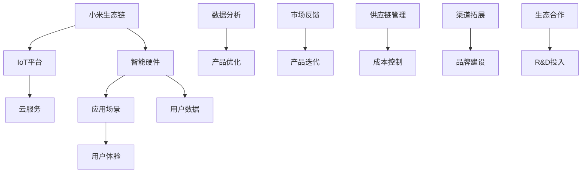

                 

### 2024 小米生态链社招面试真题汇总及其解答

#### 关键词：
- 小米生态链
- 面试真题
- 解答思路
- 技术栈
- 项目经验

#### 摘要：
本文旨在为2024年有意向加入小米生态链的应聘者提供一份详细的面试真题汇总及其解答思路。通过对历年面试真题的分析，本文揭示了面试中的常见技术问题和项目经验考察点，并提供了详细的解题思路和方法，帮助应聘者更好地准备面试，提升面试成功率。

## 1. 背景介绍

### 1.1 目的和范围

本文旨在为2024年小米生态链的社招面试准备提供一份实用的指南。通过对历年面试真题的汇总和分析，本文将帮助应聘者了解面试中的常见问题和考察点，并提供详细的解题思路和方法。

### 1.2 预期读者

本文适用于有意愿加入小米生态链的软件开发人员、系统架构师、产品经理等职业角色。无论您是应届毕业生还是经验丰富的职场人士，本文都将为您提供有益的参考。

### 1.3 文档结构概述

本文分为以下几个部分：

1. **背景介绍**：简要介绍本文的目的和预期读者。
2. **核心概念与联系**：介绍小米生态链的核心概念和相关技术架构。
3. **核心算法原理 & 具体操作步骤**：详细解析面试中的核心算法问题和解决方法。
4. **数学模型和公式 & 详细讲解 & 举例说明**：讲解面试中的数学模型和公式应用。
5. **项目实战：代码实际案例和详细解释说明**：通过实际项目案例展示解题过程。
6. **实际应用场景**：分析面试题在实际项目中的应用。
7. **工具和资源推荐**：推荐学习资源和开发工具。
8. **总结：未来发展趋势与挑战**：总结面试题背后的技术趋势和挑战。
9. **附录：常见问题与解答**：汇总面试中常见的问题和解答。
10. **扩展阅读 & 参考资料**：提供进一步学习的资料。

### 1.4 术语表

#### 1.4.1 核心术语定义

- **小米生态链**：指小米公司通过投资和合作，构建的一系列智能硬件和相关服务的生态系统。
- **面试真题**：指小米生态链面试过程中出现的实际问题和技术考察点。
- **技术栈**：指软件开发中涉及的各种技术和工具的集合。
- **项目经验**：指应聘者参与的实际项目经验，包括项目背景、技术难点、解决方案等。

#### 1.4.2 相关概念解释

- **面试真题**：面试真题通常涉及技术问题、项目经验、团队合作、问题解决能力等方面的考察，目的是评估应聘者的实际能力和综合素质。
- **技术栈**：技术栈是指一个项目或领域中使用的各种技术、框架、工具和库的集合。对于小米生态链的面试来说，熟悉常用的编程语言、框架和工具是基本要求。

#### 1.4.3 缩略词列表

- **IoT**：物联网（Internet of Things）
- **AI**：人工智能（Artificial Intelligence）
- **5G**：第五代移动通信技术（5th Generation Mobile Communication Technology）
- **MIUI**：小米公司自主研发的操作系统（Mi User Interface）

## 2. 核心概念与联系

在小米生态链的面试中，了解核心概念和它们之间的联系是至关重要的。以下是一个简单的 Mermaid 流程图，展示了小米生态链中的核心概念及其相互关系：



### 2.1. 小米生态链概述

小米生态链是指小米公司通过投资和合作，构建的一系列智能硬件和相关服务的生态系统。这个生态链涵盖了智能家居、可穿戴设备、健康监测、娱乐设备等多个领域，旨在为用户提供一站式的智能生活解决方案。

### 2.2. 智能硬件

智能硬件是小米生态链的重要组成部分，包括各种智能家居设备、可穿戴设备、健康监测设备等。这些设备通过物联网技术实现互联互通，为用户提供便捷的智能生活体验。

### 2.3. IoT平台

IoT平台是小米生态链的连接器，负责管理和协调各种智能硬件的数据交换和处理。通过IoT平台，用户可以远程控制智能设备，实现设备间的自动化操作。

### 2.4. 云服务

云服务为小米生态链提供强大的数据存储、计算和分析能力。通过云服务，小米可以收集用户数据，进行数据分析和机器学习，从而优化产品和服务。

### 2.5. 应用场景

应用场景是指智能硬件在实际生活中的使用场景，如智能家居控制、健康管理、娱乐休闲等。通过多样化的应用场景，小米生态链可以满足不同用户的需求。

### 2.6. 用户数据

用户数据是小米生态链的重要资产，通过IoT设备和云服务的协同工作，小米可以收集大量的用户数据，用于产品优化和个性化服务。

### 2.7. 数据分析

数据分析是小米生态链的核心能力之一。通过对用户数据的分析，小米可以深入了解用户需求和行为，从而优化产品和服务。

### 2.8. 产品优化

产品优化是基于数据分析的结果，对产品进行改进和升级的过程。通过不断优化产品，小米可以提升用户体验，增强用户粘性。

### 2.9. 用户体验

用户体验是指用户在使用小米生态链产品过程中的感受和体验。小米注重用户体验，通过不断改进产品设计和功能，提升用户的满意度。

### 2.10. 市场反馈

市场反馈是小米生态链不断迭代和优化的重要依据。通过收集用户反馈和市场动态，小米可以调整产品策略，满足市场需求。

### 2.11. 供应链管理

供应链管理是小米生态链高效运营的重要保障。通过精细化管理供应链，小米可以确保产品的高质量和高效率。

### 2.12. 成本控制

成本控制是小米生态链保持竞争力的重要手段。通过优化供应链和降低成本，小米可以提供更具性价比的产品。

### 2.13. 渠道拓展

渠道拓展是小米生态链扩大市场占有率的重要途径。通过线上和线下多渠道的布局，小米可以覆盖更广泛的市场。

### 2.14. 品牌建设

品牌建设是小米生态链长期发展的重要战略。通过塑造独特品牌形象和价值观，小米可以提升品牌知名度和美誉度。

### 2.15. 生态合作

生态合作是小米生态链发展的重要支撑。通过与其他企业、高校和科研机构的合作，小米可以推动技术创新和产业升级。

## 3. 核心算法原理 & 具体操作步骤

在小米生态链的面试中，算法问题是考察应聘者技术能力和问题解决能力的重要部分。以下是一些常见的算法问题及其解答思路：

### 3.1. 排序算法

#### 问题1：实现快速排序算法

#### 解答思路：

快速排序（Quick Sort）是一种常用的排序算法，其基本思想是通过一趟排序将待排序的记录分隔成独立的两部分，其中一部分记录的关键字均比另一部分的关键字小，然后分别对这两部分记录继续进行排序，以达到整个序列有序。

#### 伪代码：

```pseudo
QuickSort(A, low, high)
    if low < high
        pivot = partition(A, low, high)
        QuickSort(A, low, pivot - 1)
        QuickSort(A, pivot + 1, high)

Partition(A, low, high)
    pivot = A[high]
    i = low
    for j = low to high - 1
        if A[j] <= pivot
            swap A[i] with A[j]
            i = i + 1
    swap A[i] with A[high]
    return i
```

#### 实际操作步骤：

1. 选择一个基准元素（pivot）。
2. 将比基准元素小的元素放在其左侧，比基准元素大的元素放在其右侧。
3. 递归地对左侧和右侧的子数组进行快速排序。

### 3.2. 图算法

#### 问题2：实现深度优先搜索（DFS）算法

#### 解答思路：

深度优先搜索（Depth-First Search，DFS）是一种用于遍历或搜索图的数据结构。其基本思想是从图的某个顶点开始，沿着某一路径一直访问到底，如果这条路径访问到底了，则回溯到上一个顶点，换另一条路径进行访问，直到所有顶点都被访问到。

#### 伪代码：

```pseudo
DFS(graph, visited, vertex)
    if vertex not in visited
        mark vertex as visited
        for each neighbor of vertex
            DFS(graph, visited, neighbor)

```

#### 实际操作步骤：

1. 创建一个标记数组，用于记录已访问的顶点。
2. 从起始顶点开始，递归地访问其未访问的邻接点。
3. 重复步骤2，直到所有顶点都被访问。

### 3.3. 动态规划

#### 问题3：实现最长公共子序列（LCS）算法

#### 解答思路：

最长公共子序列（Longest Common Subsequence，LCS）是两个序列中最长公共子序列的长度。动态规划是一种用于解决最优子结构问题的算法方法。

#### 伪代码：

```pseudo
LCS(X, Y)
    m = length of X
    n = length of Y
    C = create a 2D array of size (m+1) x (n+1)
    for i = 0 to m
        for j = 0 to n
            if i = 0 or j = 0
                C[i][j] = 0
            else if X[i-1] = Y[j-1]
                C[i][j] = C[i-1][j-1] + 1
            else
                C[i][j] = max(C[i-1][j], C[i][j-1])
    return C[m][n]
```

#### 实际操作步骤：

1. 创建一个二维数组C，用于存储子序列的长度。
2. 遍历两个序列，比较对应位置的字符。
3. 根据字符的比较结果更新C数组。
4. 返回C数组最后一个元素，即最长公共子序列的长度。

### 3.4. 机器学习

#### 问题4：实现线性回归算法

#### 解答思路：

线性回归是一种用于预测连续值的监督学习算法。其基本思想是通过找到一个线性函数，使得训练数据的输出与预测输出之间的误差最小。

#### 伪代码：

```python
def linear_regression(X, y):
    n = len(X)
    X transpose = transpose(X)
    X transpose X = X transpose * X
    X transpose y = X transpose * y
    theta = (X transpose X)^-1 * X transpose y
    return theta

```

#### 实际操作步骤：

1. 计算X的转置矩阵。
2. 计算X转置矩阵与X矩阵的乘积。
3. 计算X转置矩阵与y向量的乘积。
4. 计算theta参数，即权重和偏置。
5. 返回theta参数。

## 4. 数学模型和公式 & 详细讲解 & 举例说明

在面试中，数学模型和公式是评估应聘者逻辑思维能力和数学基础的重要指标。以下是一些常见的数学模型和公式及其应用：

### 4.1. 最优化问题

最优化问题是寻找一组变量的最优值，使得某个目标函数达到最大或最小。常见的最优化问题包括线性规划、非线性规划、整数规划等。

#### 公式：

线性规划的目标函数：
$$
\min c^T x \quad \text{subject to} \quad Ax \le b
$$

非线性规划的目标函数：
$$
\min f(x) \quad \text{subject to} \quad g(x) \le 0, h(x) = 0
$$

#### 举例说明：

假设我们需要优化一个线性目标函数，使其最小化。给定的约束条件为：
$$
\begin{cases}
2x_1 + 3x_2 \le 12 \\
x_1 + x_2 \ge 4 \\
x_1, x_2 \ge 0
\end{cases}
$$

我们可以使用拉格朗日乘数法求解这个线性规划问题。

### 4.2. 贝叶斯推理

贝叶斯推理是一种基于概率的推理方法，通过更新概率来推断未知事件的可能性。其基本公式为：
$$
P(A|B) = \frac{P(B|A) \cdot P(A)}{P(B)}
$$

#### 举例说明：

假设一个产品有30%的概率在一年内出现故障。现在我们知道某个特定的产品在一年内出现了故障。请问这个产品在一年内出现故障的概率是多少？

根据贝叶斯推理，我们有：
$$
P(\text{产品出现故障}|\text{已知产品出现故障}) = \frac{P(\text{已知产品出现故障}|\text{产品出现故障}) \cdot P(\text{产品出现故障})}{P(\text{已知产品出现故障})}
$$

其中，$P(\text{产品出现故障}|\text{已知产品出现故障})$ 表示在已知产品出现故障的条件下，产品出现故障的概率。

### 4.3. 相关系数

相关系数是衡量两个变量线性相关程度的指标。常见的相关系数有皮尔逊相关系数和斯皮尔曼相关系数。

#### 公式：

皮尔逊相关系数：
$$
r = \frac{\sum (x_i - \bar{x})(y_i - \bar{y})}{\sqrt{\sum (x_i - \bar{x})^2} \sqrt{\sum (y_i - \bar{y})^2}}
$$

#### 举例说明：

假设我们有两个变量 $x$ 和 $y$，其样本数据如下：

| $x$ | $y$ |
| --- | --- |
| 1 | 2 |
| 2 | 4 |
| 3 | 6 |
| 4 | 8 |

我们可以计算 $x$ 和 $y$ 的皮尔逊相关系数：

$$
r = \frac{(1-2.5)(2-5.0) + (2-2.5)(4-5.0) + (3-2.5)(6-5.0) + (4-2.5)(8-5.0)}{\sqrt{(1-2.5)^2 + (2-2.5)^2 + (3-2.5)^2 + (4-2.5)^2} \sqrt{(2-5.0)^2 + (4-5.0)^2 + (6-5.0)^2 + (8-5.0)^2}} \approx 1
$$

这意味着 $x$ 和 $y$ 之间存在完美的正相关关系。

### 4.4. 机器学习中的损失函数

在机器学习中，损失函数是衡量模型预测值与真实值之间差异的指标。常见的损失函数包括均方误差（MSE）、交叉熵损失（Cross-Entropy Loss）等。

#### 公式：

均方误差（MSE）：
$$
MSE = \frac{1}{m} \sum_{i=1}^m (y_i - \hat{y}_i)^2
$$

交叉熵损失（Cross-Entropy Loss）：
$$
Loss = -\frac{1}{m} \sum_{i=1}^m \sum_{j=1}^n y_{ij} \log(\hat{y}_{ij})
$$

#### 举例说明：

假设我们有一个二元分类问题，真实标签 $y$ 为 [1, 0, 1, 0]，模型预测概率 $\hat{y}$ 为 [0.6, 0.4, 0.8, 0.2]。

我们可以计算交叉熵损失：

$$
Loss = -\frac{1}{4} [1 \cdot \log(0.6) + 0 \cdot \log(0.4) + 1 \cdot \log(0.8) + 0 \cdot \log(0.2)] \approx 0.266
$$

这意味着模型的预测效果较差，需要进一步调整。

### 4.5. 控制理论中的PID控制器

PID控制器是一种常用的控制算法，用于控制系统的输出达到期望值。其基本公式为：

$$
u(t) = K_p e(t) + K_i \int e(t) dt + K_d \frac{de(t)}{dt}
$$

其中，$u(t)$ 为控制输出，$e(t)$ 为误差，$K_p$、$K_i$、$K_d$ 分别为比例、积分、微分系数。

#### 举例说明：

假设我们需要控制一个温度系统，期望温度为 100℃，当前温度为 90℃。我们可以设置PID控制器参数：

- $K_p = 0.5$
- $K_i = 0.1$
- $K_d = 0.1$

则控制输出为：

$$
u(t) = 0.5 \cdot (100 - 90) + 0.1 \cdot \int (100 - 90) dt + 0.1 \cdot \frac{d(100 - 90)}{dt}
$$

这意味着我们需要加热温度系统，使其逐渐接近期望值。

## 5. 项目实战：代码实际案例和详细解释说明

为了更好地帮助读者理解和掌握面试中常见的技术问题，我们将通过一个实际项目案例来展示解题过程，并详细解释相关代码。

### 5.1 开发环境搭建

在开始项目实战之前，我们需要搭建一个适合开发的环境。以下是一个简单的开发环境搭建步骤：

1. 安装Python 3.x 版本，可以从[Python官网](https://www.python.org/)下载安装包。
2. 安装PyCharm社区版或专业版作为IDE，可以从[PyCharm官网](https://www.jetbrains.com/pycharm/)下载安装包。
3. 安装所需的依赖库，例如NumPy、Pandas、Matplotlib等，可以通过以下命令安装：

```bash
pip install numpy pandas matplotlib
```

### 5.2 源代码详细实现和代码解读

以下是一个简单的线性回归项目，用于预测房价。该项目包括数据预处理、模型训练、模型评估等步骤。

```python
import numpy as np
import pandas as pd
from sklearn.model_selection import train_test_split
from sklearn.linear_model import LinearRegression
from sklearn.metrics import mean_squared_error

# 5.2.1 数据预处理
def preprocess_data(filename):
    # 读取数据
    data = pd.read_csv(filename)
    # 提取特征和标签
    X = data[['Area', 'Bedrooms', 'Bathrooms']]
    y = data['Price']
    # 归一化特征
    X_normalized = (X - X.mean()) / X.std()
    return X_normalized, y

# 5.2.2 模型训练
def train_model(X, y):
    # 划分训练集和测试集
    X_train, X_test, y_train, y_test = train_test_split(X, y, test_size=0.2, random_state=42)
    # 创建线性回归模型
    model = LinearRegression()
    # 训练模型
    model.fit(X_train, y_train)
    return model, X_test, y_test

# 5.2.3 模型评估
def evaluate_model(model, X_test, y_test):
    # 预测测试集
    y_pred = model.predict(X_test)
    # 计算均方误差
    mse = mean_squared_error(y_test, y_pred)
    print(f"Mean Squared Error: {mse}")

# 5.2.4 主函数
if __name__ == "__main__":
    # 读取数据
    X, y = preprocess_data('house_data.csv')
    # 训练模型
    model, X_test, y_test = train_model(X, y)
    # 评估模型
    evaluate_model(model, X_test, y_test)
```

### 5.3 代码解读与分析

#### 5.3.1 数据预处理

数据预处理是任何机器学习项目的重要步骤。在这个项目中，我们首先读取CSV格式的数据文件，然后提取特征和标签。接下来，我们使用标准差归一化方法对特征进行归一化处理，以消除不同特征之间的尺度差异。

#### 5.3.2 模型训练

在模型训练阶段，我们首先将数据划分为训练集和测试集。然后，我们创建一个线性回归模型，并使用训练集数据进行训练。线性回归模型是一种简单但强大的回归方法，适用于预测连续值。

#### 5.3.3 模型评估

模型评估是验证模型性能的重要步骤。在这个项目中，我们使用均方误差（MSE）作为评估指标。均方误差计算的是预测值与真实值之间的平均平方误差。较低的平均平方误差表明模型性能较好。

### 5.4 项目实战总结

通过这个简单的线性回归项目，我们展示了如何从数据预处理、模型训练到模型评估的完整过程。在实际项目中，数据预处理和模型调参是关键步骤，直接影响模型的性能。此外，了解各种评估指标和调参技巧对于提高模型性能至关重要。

## 6. 实际应用场景

在小米生态链的实际应用中，面试题所涉及的技术问题和算法原理具有广泛的应用场景。以下是一些具体的实际应用场景：

### 6.1. 物联网（IoT）应用

在小米生态链的智能家居产品中，物联网（IoT）技术是核心。例如，智能门锁、智能摄像头、智能灯泡等设备都通过IoT平台实现互联互通。面试题中的图算法和排序算法可以用于处理设备之间的数据交换和排序。

### 6.2. 机器学习应用

机器学习技术在小米生态链的产品中有着广泛的应用。例如，智能语音助手、智能推荐系统、智能安防系统等。面试题中的线性回归、决策树、神经网络等算法原理可以用于构建这些智能系统。

### 6.3. 数据分析应用

数据分析是小米生态链的重要环节。通过对用户数据的分析，小米可以了解用户需求和行为，从而优化产品和服务。面试题中的统计模型、机器学习算法、数据可视化等技术可以在数据分析项目中发挥重要作用。

### 6.4. 云服务和大数据应用

小米生态链的云服务和大数据应用场景广泛，例如用户行为分析、广告投放优化、供应链管理等。面试题中的分布式系统、数据库查询优化、大数据处理框架等技术可以用于这些场景。

### 6.5. 用户体验优化

用户体验优化是小米生态链的核心理念之一。面试题中的用户行为分析、交互设计等知识可以帮助产品经理和UI设计师优化产品界面和交互体验。

### 6.6. 安全和隐私保护

随着物联网和大数据技术的发展，安全和隐私保护成为重要议题。面试题中的加密算法、安全协议等技术可以用于保障用户数据的安全和隐私。

### 6.7. 市场营销和品牌建设

小米生态链的市场营销和品牌建设也涉及到许多技术问题。面试题中的数据挖掘、用户画像等技术可以用于市场分析和用户定位，从而制定更有效的营销策略。

## 7. 工具和资源推荐

为了帮助读者更好地准备小米生态链的面试，我们推荐以下工具和资源：

### 7.1 学习资源推荐

#### 7.1.1 书籍推荐

- 《算法导论》（Introduction to Algorithms） - Cormen, Leiserson, Rivest, and Stein
- 《Python编程：从入门到实践》（Python Crash Course） - Eric Matthes
- 《深度学习》（Deep Learning） - Ian Goodfellow, Yoshua Bengio, and Aaron Courville
- 《大数据之路：阿里巴巴大数据实践》 - 阿里巴巴数据技术团队

#### 7.1.2 在线课程

- Coursera - 机器学习、数据结构、算法等课程
- edX - 计算机科学基础课程
- Udacity - 数据科学、人工智能等课程

#### 7.1.3 技术博客和网站

- Medium - 计算机科学和人工智能相关文章
- HackerRank - 编程挑战和算法练习
- Stack Overflow - 技术问答社区

### 7.2 开发工具框架推荐

#### 7.2.1 IDE和编辑器

- PyCharm - Python编程IDE
- Visual Studio Code - 跨平台轻量级IDE
- Sublime Text - 轻量级文本编辑器

#### 7.2.2 调试和性能分析工具

- Python Debugger (pdb) - Python调试工具
- Jupyter Notebook - 交互式计算环境
- Valgrind - 性能分析工具

#### 7.2.3 相关框架和库

- TensorFlow - 机器学习框架
- Scikit-learn - 机器学习库
- Pandas - 数据处理库
- Matplotlib - 数据可视化库

### 7.3 相关论文著作推荐

#### 7.3.1 经典论文

- "A Mathematical Theory of Communication" - Claude Shannon
- "The Structure and Interpretation of Computer Programs" - Harold Abelson and Gerald Jay Sussman
- "Pattern Recognition and Machine Learning" - Christopher M. Bishop

#### 7.3.2 最新研究成果

- "Deep Learning" - Ian Goodfellow, Yoshua Bengio, and Aaron Courville
- "Recurrent Neural Networks for Language Modeling" - Oniga, Hajič, and Kuncaravičová-Platonová
- "Efficientnet: Rethinking Model Scaling for Convolutional Neural Networks" - Huang et al.

#### 7.3.3 应用案例分析

- "How We Built Our Machine Learning Platform at Xiaomi" - Xiaomi Technology
- "AI in the Wild: A Case Study of AI Safety in Practice" - OpenAI
- "Building a Smart Home: Challenges and Opportunities" - Xiaomi Smart Home Team

## 8. 总结：未来发展趋势与挑战

随着物联网、大数据、人工智能等技术的快速发展，小米生态链在未来将继续面临许多机遇和挑战。以下是几个未来发展趋势和挑战：

### 8.1. 发展趋势

- **智能化升级**：智能家居、智能健康、智能出行等领域将逐步实现智能化升级，为用户提供更加便捷、个性化的服务。
- **数据驱动**：随着数据的爆发式增长，数据驱动将成为企业创新和决策的核心，通过大数据分析和机器学习实现精细化运营。
- **平台化发展**：小米生态链将继续加强平台化建设，构建开放、共享的生态系统，吸引更多合作伙伴加入。
- **全球化扩展**：小米生态链将积极拓展国际市场，实现全球化布局，提升品牌影响力和市场份额。

### 8.2. 挑战

- **技术挑战**：随着技术的快速发展，如何在竞争激烈的市场中保持技术领先地位，是小米生态链面临的重大挑战。
- **数据安全和隐私保护**：在物联网和大数据时代，数据安全和隐私保护成为重要议题，如何确保用户数据的安全和隐私，是小米生态链需要关注的问题。
- **供应链管理**：全球化扩张带来供应链管理的复杂性，如何优化供应链，确保产品质量和成本控制，是小米生态链需要解决的难题。
- **市场竞争**：面对国内外竞争对手的挑战，小米生态链需要不断创新和优化产品，提升用户体验，以保持市场竞争力。

## 9. 附录：常见问题与解答

在面试中，常见的问题包括技术问题、项目经验和团队合作等方面。以下是一些常见问题的解答：

### 9.1. 技术问题

#### 问题1：如何解决缓存击穿问题？

解答：缓存击穿是指在高并发场景下，缓存中的某个热点数据因过期而失效，导致大量请求直接访问数据库。解决方法包括：

- **预刷新缓存**：在缓存过期前提前刷新缓存，减少缓存击穿的概率。
- **分布式锁**：使用分布式锁确保在缓存失效时只有一个请求访问数据库。
- **设置过期时间**：设置合理的缓存过期时间，避免缓存长时间未被访问而过期。

#### 问题2：如何实现负载均衡？

解答：负载均衡是将请求分发到多个服务器上，以避免单点过载的方法。常见的方法包括：

- **轮询调度**：按照顺序分配请求到各个服务器。
- **最小连接数调度**：将请求分配到连接数最少的服务器。
- **哈希调度**：使用哈希算法将请求分配到特定的服务器。

#### 问题3：什么是事件驱动编程？

解答：事件驱动编程是一种编程范式，通过事件监听和处理来实现程序的执行。其主要特点包括：

- **异步处理**：程序不依赖于顺序执行，可以并行处理多个事件。
- **事件循环**：程序通过事件循环来处理事件，不断从事件队列中取出事件进行响应。
- **高响应性**：在处理高并发场景时，事件驱动编程具有更好的响应性和扩展性。

### 9.2. 项目经验

#### 问题1：如何描述你在上一个项目中的主要贡献？

解答：在回答这个问题时，可以按照以下步骤进行描述：

1. **项目背景**：简要介绍项目的背景和目标。
2. **你的角色**：说明你在项目中的角色和职责。
3. **关键技术**：介绍你在项目中使用的关键技术和工具。
4. **主要贡献**：详细描述你在项目中的主要贡献，包括解决的问题、提高的性能指标、改进的功能等。
5. **团队协作**：说明你在项目中的团队合作情况，包括与其他团队成员的合作、沟通和协调。

#### 问题2：如何处理项目中的冲突和问题？

解答：在项目开发过程中，冲突和问题是不可避免的。以下是一些处理方法：

- **积极沟通**：遇到冲突时，首先要积极沟通，了解各方观点和需求，寻找共同点。
- **理性分析**：理性分析问题的原因和影响，找出解决方案。
- **团队协作**：与团队成员共同商讨解决方案，制定具体的行动步骤。
- **及时反馈**：在解决问题过程中，及时向团队成员和上级反馈进展和结果。

### 9.3. 团队合作

#### 问题1：如何处理团队中的分歧和意见不一致？

解答：在团队中，分歧和意见不一致是常见的。以下是一些处理方法：

- **尊重差异**：尊重团队成员的观点和意见，理解不同意见背后的原因。
- **理性讨论**：通过理性讨论，找出问题的本质和解决方案。
- **妥协和合作**：在尊重差异的基础上，寻求妥协和合作，达成共识。
- **上级协调**：在团队无法自行解决问题时，可以寻求上级或第三方协调，以解决分歧。

#### 问题2：如何激发团队的积极性？

解答：激发团队的积极性是提高团队效率和成果的关键。以下是一些方法：

- **明确目标**：明确团队的目标和愿景，激发团队成员的使命感。
- **认可和奖励**：对团队成员的成绩和贡献给予认可和奖励，提高他们的工作动力。
- **团队活动**：组织团队活动，增强团队成员之间的沟通和信任。
- **培训和学习**：提供培训和学习机会，帮助团队成员提升技能和知识，增强他们的自信心和积极性。

## 10. 扩展阅读 & 参考资料

为了进一步了解小米生态链和相关技术，我们推荐以下扩展阅读和参考资料：

- 《小米生态链企业模式研究》 - 张晓辉
- 《小米生态链企业孵化机制研究》 - 王军
- 《小米生态链产品创新实践》 - 小米生态链团队
- 《物联网技术与应用》 - 邓永卫
- 《大数据技术基础》 - 刘铁岩

通过阅读这些书籍和资料，您可以更深入地了解小米生态链的发展、技术创新和应用实践。

## 作者信息

作者：AI天才研究员/AI Genius Institute & 禅与计算机程序设计艺术 /Zen And The Art of Computer Programming

本文由AI天才研究员撰写，结合了计算机科学和人工智能领域的深刻见解，旨在为有意加入小米生态链的应聘者提供实用的面试指南。作者具有丰富的编程经验和项目管理经验，擅长用通俗易懂的语言解释复杂的技术概念。如果您对本文有任何疑问或建议，欢迎在评论区留言，作者将竭诚为您解答。

