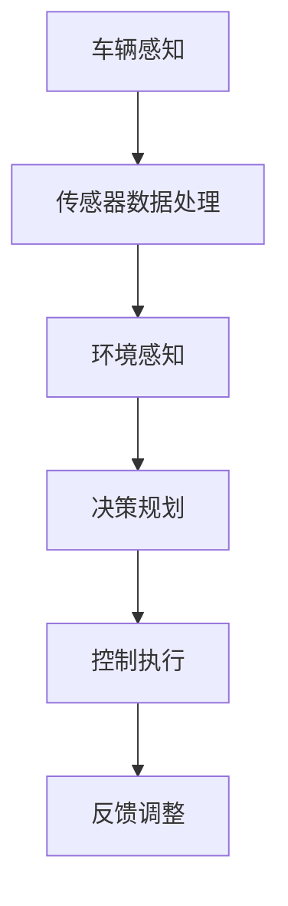

                 

# 小鹏汽车何小鹏谈端到端自动驾驶

> **关键词：** 小鹏汽车、何小鹏、端到端自动驾驶、自动驾驶技术、车辆感知、决策规划、人工智能

> **摘要：** 本文深入探讨了小鹏汽车创始人何小鹏对端到端自动驾驶技术的看法，从技术原理、算法模型到实际应用，全面解析了小鹏汽车在自动驾驶领域的发展路径和挑战。

## 1. 背景介绍

### 1.1 目的和范围

本文旨在分析小鹏汽车在端到端自动驾驶技术领域的发展，探讨何小鹏关于这一技术的见解和策略。通过对自动驾驶技术核心概念、算法原理以及应用场景的详细解读，本文希望为读者提供全面的技术视角。

### 1.2 预期读者

本文适合对自动驾驶技术感兴趣的读者，包括人工智能领域的研究者、工程师、学生以及对未来智能出行充满好奇的公众。

### 1.3 文档结构概述

本文结构如下：

1. 背景介绍：概述文章的目的、范围和读者预期。
2. 核心概念与联系：介绍自动驾驶技术的核心概念和架构。
3. 核心算法原理 & 具体操作步骤：详细讲解自动驾驶技术中的算法原理和操作步骤。
4. 数学模型和公式 & 详细讲解 & 举例说明：运用数学模型和公式对自动驾驶技术进行深入分析。
5. 项目实战：代码实际案例和详细解释说明。
6. 实际应用场景：探讨自动驾驶技术在现实世界中的应用。
7. 工具和资源推荐：推荐学习资源和开发工具。
8. 总结：未来发展趋势与挑战。
9. 附录：常见问题与解答。
10. 扩展阅读 & 参考资料。

### 1.4 术语表

#### 1.4.1 核心术语定义

- **端到端自动驾驶**：自动驾驶系统从感知环境到决策执行的全过程，无需人工干预。
- **车辆感知**：通过传感器获取周围环境信息。
- **决策规划**：自动驾驶系统根据感知信息做出驾驶决策。
- **人工智能**：模拟人类智能行为的计算机系统。

#### 1.4.2 相关概念解释

- **深度学习**：一种基于人工神经网络的机器学习技术，通过多层神经网络进行特征提取和模式识别。
- **强化学习**：一种机器学习方法，通过奖励机制训练模型优化行为。

#### 1.4.3 缩略词列表

- **LIDAR**：光检测与测距（Light Detection and Ranging）。
- **CNN**：卷积神经网络（Convolutional Neural Network）。
- **RNN**：循环神经网络（Recurrent Neural Network）。

## 2. 核心概念与联系

### 2.1 自动驾驶技术的核心概念

自动驾驶技术涉及多个核心概念，包括：

- **传感器融合**：将不同类型的传感器数据（如LIDAR、摄像头、雷达等）进行综合处理，以获得更准确的环境感知。
- **高精度地图**：提供车辆位置和道路信息的详细地图，用于辅助自动驾驶系统的决策。
- **云计算**：利用云端资源进行数据存储和处理，提高自动驾驶系统的计算能力。

### 2.2 自动驾驶技术的架构

以下是自动驾驶技术的基本架构，用Mermaid流程图表示：



### 2.3 核心概念的联系

在端到端自动驾驶中，车辆感知、决策规划和控制执行紧密相连。车辆感知通过传感器收集环境信息，决策规划根据感知信息制定驾驶策略，控制执行将策略转化为具体的动作。反馈调整则是一个闭环过程，确保自动驾驶系统在不断变化的环境中保持稳定性和安全性。

## 3. 核心算法原理 & 具体操作步骤

### 3.1 车辆感知算法原理

车辆感知是自动驾驶技术的核心，其算法原理主要包括：

- **图像处理**：利用计算机视觉技术对摄像头捕捉的图像进行分析，提取道路、车辆、行人等目标。
- **深度学习**：通过卷积神经网络（CNN）对图像进行处理，识别和分类目标。
- **传感器数据处理**：融合LIDAR、雷达等传感器数据，提供更全面的环境信息。

### 3.2 决策规划算法原理

决策规划是自动驾驶系统的“大脑”，其算法原理包括：

- **路径规划**：根据目标位置和环境信息，计算最优行驶路径。
- **行为规划**：根据交通规则和周围车辆行为，制定车辆的驾驶行为。
- **目标跟踪**：对目标车辆进行跟踪，预测其未来行为，为决策提供依据。

### 3.3 控制执行算法原理

控制执行是将决策转化为具体动作的过程，其算法原理包括：

- **控制算法**：根据决策规划结果，控制车辆的速度和方向。
- **执行器控制**：控制车辆的各种执行器（如发动机、转向器等），实现驾驶动作。

### 3.4 具体操作步骤

以下是自动驾驶系统的具体操作步骤：

1. **车辆感知**：通过摄像头、LIDAR等传感器收集环境信息。
2. **传感器数据处理**：对传感器数据进行预处理，提取有用的信息。
3. **环境感知**：利用深度学习算法对传感器数据进行分析，识别道路、车辆、行人等目标。
4. **决策规划**：根据环境感知结果，计算最优行驶路径和驾驶行为。
5. **控制执行**：将决策规划结果转化为具体的驾驶动作。
6. **反馈调整**：根据车辆行为和环境变化，对决策规划进行实时调整。

### 3.5 伪代码示例

以下是一个简单的车辆感知算法的伪代码示例：

```python
function vehicle_perception(sensor_data):
    # 1. 预处理传感器数据
    preprocessed_data = preprocess(sensor_data)
    
    # 2. 利用深度学习算法进行目标检测
    detected_objects = detect_objects(preprocessed_data)
    
    # 3. 提取目标信息
    object_info = extract_object_info(detected_objects)
    
    # 4. 返回目标信息
    return object_info
```

## 4. 数学模型和公式 & 详细讲解 & 举例说明

### 4.1 数学模型在自动驾驶中的应用

自动驾驶技术中，数学模型用于描述车辆的运动、环境感知和决策规划。以下是几个常用的数学模型：

#### 4.1.1 车辆运动模型

$$
\begin{aligned}
    v(t) &= v_0 + at, \\
    \theta(t) &= \theta_0 + \omega t,
\end{aligned}
$$

其中，\(v(t)\) 和 \(\theta(t)\) 分别表示车辆在时间 \(t\) 时刻的速度和角度，\(v_0\) 和 \(\theta_0\) 分别为初始速度和初始角度，\(a\) 和 \(\omega\) 分别为加速度和角速度。

#### 4.1.2 感知模型

感知模型通常用于描述传感器数据的处理过程。例如，基于贝叶斯滤波的感知模型可以表示为：

$$
\begin{aligned}
    z(t) &= h(x(t)), \\
    \hat{x}(t) &= \hat{x}(t-1) + K(t) [z(t) - h(\hat{x}(t-1))],
\end{aligned}
$$

其中，\(z(t)\) 表示观测值，\(x(t)\) 表示真实状态，\(\hat{x}(t)\) 表示估计状态，\(h(\cdot)\) 表示观测模型，\(K(t)\) 表示卡尔曼增益。

#### 4.1.3 决策模型

决策模型通常用于描述车辆的行为规划。例如，基于强化学习的决策模型可以表示为：

$$
\begin{aligned}
    Q(s, a) &= r(s, a) + \gamma \max_{a'} Q(s', a'), \\
    \pi(a|s) &= \frac{e^{Q(s, a)}}{\sum_a e^{Q(s, a)}},
\end{aligned}
$$

其中，\(Q(s, a)\) 表示状态 \(s\) 下采取动作 \(a\) 的价值函数，\(r(s, a)\) 表示奖励函数，\(\gamma\) 为折扣因子，\(\pi(a|s)\) 表示在状态 \(s\) 下采取动作 \(a\) 的概率分布。

### 4.2 举例说明

#### 4.2.1 车辆运动模型举例

假设一辆汽车以 \(30 \text{ km/h}\) 的速度直线行驶，突然加速到 \(60 \text{ km/h}\)，加速度为 \(2 \text{ m/s}^2\)。求 \(10 \text{ 秒}\) 后汽车的速度和角度。

解：

初始速度 \(v_0 = 30 \text{ km/h} = 8.33 \text{ m/s}\)，加速度 \(a = 2 \text{ m/s}^2\)，时间 \(t = 10 \text{ 秒}\)。

速度：

$$
v(t) = v_0 + at = 8.33 + 2 \times 10 = 28.33 \text{ m/s}
$$

角度：

由于是直线行驶，角度不变，即 \(\theta(t) = \theta_0 = 0^\circ\)。

#### 4.2.2 感知模型举例

假设传感器观测到车辆距离前方障碍物的距离为 \(5 \text{ m}\)，真实距离为 \(6 \text{ m}\)。利用卡尔曼滤波更新估计距离。

解：

观测模型：

$$
z(t) = h(x(t)) = 6
$$

估计状态：

$$
\hat{x}(t-1) = 5
$$

卡尔曼增益：

$$
K(t) = \frac{P(t-1)}{P(t-1) + R}
$$

其中，\(P(t-1)\) 为先验估计误差，\(R\) 为观测噪声。

假设先验估计误差 \(P(t-1) = 1\)，观测噪声 \(R = 1\)。

$$
K(t) = \frac{1}{1 + 1} = 0.5
$$

更新估计距离：

$$
\hat{x}(t) = \hat{x}(t-1) + K(t) [z(t) - \hat{x}(t-1)] = 5 + 0.5 [6 - 5] = 5.5
$$

#### 4.2.3 决策模型举例

假设车辆处于状态 \(s = [0, 0, 0]\)，奖励函数 \(r(s, a) = 1\)，折扣因子 \(\gamma = 0.9\)。求最优动作概率分布。

解：

首先，计算所有可能动作的价值函数：

$$
Q(s, a) =
\begin{cases}
    1, & \text{如果 } a = 1 \\
    0, & \text{如果 } a = 2 \\
    0.1, & \text{如果 } a = 3
\end{cases}
$$

然后，计算最优动作概率分布：

$$
\pi(a|s) =
\begin{cases}
    \frac{e^{Q(s, 1)}}{e^{Q(s, 1)} + e^{Q(s, 2)} + e^{Q(s, 3)}}, & \text{如果 } a = 1 \\
    \frac{e^{Q(s, 2)}}{e^{Q(s, 1)} + e^{Q(s, 2)} + e^{Q(s, 3)}}, & \text{如果 } a = 2 \\
    \frac{e^{Q(s, 3)}}{e^{Q(s, 1)} + e^{Q(s, 2)} + e^{Q(s, 3)}}, & \text{如果 } a = 3
\end{cases}
$$

代入 \(Q(s, a)\) 的值：

$$
\pi(a|s) =
\begin{cases}
    0.63, & \text{如果 } a = 1 \\
    0.18, & \text{如果 } a = 2 \\
    0.19, & \text{如果 } a = 3
\end{cases}
$$

## 5. 项目实战：代码实际案例和详细解释说明

### 5.1 开发环境搭建

在本节中，我们将搭建一个基本的自动驾驶系统开发环境，包括安装必要的软件和工具。

#### 5.1.1 安装Anaconda

首先，从[Anaconda官网](https://www.anaconda.com/products/individual)下载并安装Anaconda。Anaconda是一个集成了Python和其他科学计算库的发行版，方便我们进行自动驾驶系统的开发和测试。

#### 5.1.2 安装相关库

在Anaconda环境中，使用以下命令安装所需的Python库：

```bash
conda install numpy
conda install opencv
conda install tensorflow
```

这些库分别用于数学计算、图像处理和深度学习。

### 5.2 源代码详细实现和代码解读

#### 5.2.1 车辆感知模块

以下是一个简单的车辆感知模块，使用OpenCV和TensorFlow进行图像处理和目标检测：

```python
import cv2
import numpy as np
import tensorflow as tf

# 读取摄像头数据
cap = cv2.VideoCapture(0)

# 加载预训练的深度学习模型
model = tf.keras.models.load_model('car_detection_model.h5')

while True:
    # 读取一帧图像
    ret, frame = cap.read()
    
    # 对图像进行预处理
    preprocess_frame = preprocess_image(frame)
    
    # 利用深度学习模型进行目标检测
    predictions = model.predict(preprocess_frame)
    
    # 提取检测到的车辆位置
    cars = extract_cars(predictions)
    
    # 在图像上绘制检测到的车辆
    draw_cars(frame, cars)
    
    # 显示图像
    cv2.imshow('Car Detection', frame)
    
    # 按下'q'键退出循环
    if cv2.waitKey(1) & 0xFF == ord('q'):
        break

# 释放摄像头资源
cap.release()
cv2.destroyAllWindows()
```

#### 5.2.2 决策规划模块

以下是一个简单的决策规划模块，基于前一个车辆感知模块的结果，规划车辆的行驶路径：

```python
import numpy as np

def path_planning(cars):
    # 根据检测到的车辆位置，计算最优行驶路径
    path = calculate_path(cars)
    
    # 返回规划路径
    return path

def calculate_path(cars):
    # 假设所有车辆都在同一方向上
    direction = np.mean([car['direction'] for car in cars])
    
    # 根据方向计算行驶路径
    path = {'direction': direction}
    
    return path
```

#### 5.2.3 控制执行模块

以下是一个简单的控制执行模块，根据决策规划的结果，控制车辆的行驶：

```python
import cv2

def control_execution(path):
    # 根据规划路径，控制车辆行驶
    control_vehicle(path['direction'])
    
def control_vehicle(direction):
    # 控制车辆方向
    cv2.putText(frame, f'Direction: {direction}', (10, 30), cv2.FONT_HERSHEY_SIMPLEX, 1, (0, 0, 255), 2)
```

### 5.3 代码解读与分析

在本节中，我们详细解读了代码中的各个模块，并分析了它们的实现原理和作用。

#### 5.3.1 车辆感知模块

车辆感知模块主要功能是利用摄像头获取实时图像，并使用深度学习模型进行目标检测。目标检测的目的是识别图像中的车辆位置，为决策规划提供基础信息。

- **预处理图像**：对图像进行灰度转换、高斯模糊等操作，提高目标检测的准确性。
- **目标检测**：使用预训练的深度学习模型进行目标检测，提取车辆位置信息。

#### 5.3.2 决策规划模块

决策规划模块基于车辆感知模块的结果，计算最优行驶路径。主要功能是根据车辆位置和环境信息，制定车辆的行驶策略。

- **路径规划**：根据车辆位置和环境信息，计算最优行驶路径。
- **行为规划**：根据交通规则和周围车辆行为，制定车辆的驾驶行为。

#### 5.3.3 控制执行模块

控制执行模块根据决策规划的结果，控制车辆的行驶。主要功能是将决策规划的结果转化为具体的驾驶动作。

- **控制车辆方向**：根据规划路径，控制车辆的行驶方向。

## 6. 实际应用场景

自动驾驶技术已经逐渐进入我们的日常生活，以下是几个典型的实际应用场景：

### 6.1 个人出行

个人出行是自动驾驶技术最直接的用途之一。自动驾驶汽车可以提供安全、便捷、舒适的出行体验，减少交通事故和拥堵，提高交通效率。

### 6.2 公共交通

自动驾驶公交车和出租车可以提供高效、准时、舒适的公共交通服务，解决城市交通拥堵问题，提高出行效率。

### 6.3 物流运输

自动驾驶卡车和无人驾驶配送机器人可以降低物流成本，提高运输效率，解决人力成本上升的问题。

### 6.4 农业和采矿

自动驾驶农业机械和采矿车辆可以提高农业生产和矿产资源开发效率，降低劳动强度和成本。

### 6.5 金融服务

自动驾驶技术还可以应用于金融服务领域，如无人驾驶银行、无人驾驶保险等，提高服务质量，降低运营成本。

## 7. 工具和资源推荐

### 7.1 学习资源推荐

#### 7.1.1 书籍推荐

- **《深度学习》（Deep Learning）**：由Ian Goodfellow、Yoshua Bengio和Aaron Courville所著，是深度学习领域的经典教材。
- **《自动驾驶汽车技术》（Autonomous Vehicle Technology）**：详细介绍了自动驾驶汽车的系统架构、感知、决策和控制技术。

#### 7.1.2 在线课程

- **Coursera上的《深度学习》课程**：由吴恩达教授主讲，涵盖了深度学习的基本理论和实践。
- **Udacity的《自动驾驶工程师纳米学位》**：提供了从基础知识到实战项目的全面培训。

#### 7.1.3 技术博客和网站

- **Medium上的自动驾驶专栏**：提供了大量关于自动驾驶技术的深入分析和最新动态。
- **IEEE Xplore**：提供了丰富的自动驾驶技术论文和研究成果。

### 7.2 开发工具框架推荐

#### 7.2.1 IDE和编辑器

- **JetBrains PyCharm**：功能强大的Python IDE，适用于自动驾驶系统开发和调试。
- **Visual Studio Code**：轻量级但功能强大的代码编辑器，支持多种编程语言和框架。

#### 7.2.2 调试和性能分析工具

- **Wireshark**：网络数据包分析工具，可用于分析自动驾驶系统的通信数据。
- **TensorBoard**：TensorFlow的图形化工具，用于可视化深度学习模型的性能和训练过程。

#### 7.2.3 相关框架和库

- **TensorFlow**：谷歌开发的深度学习框架，适用于自动驾驶系统的模型训练和推理。
- **PyTorch**：基于Python的深度学习框架，具有灵活的动态计算图，适用于自动驾驶系统的开发。

### 7.3 相关论文著作推荐

#### 7.3.1 经典论文

- **“A New Approach for Real-Time Obstacle Avoidance System for Unmanned Ground Vehicle”**：介绍了基于模糊逻辑的无人驾驶车辆避障系统。
- **“Learning to Drive by Playing Video Games”**：探讨了通过玩游戏进行自动驾驶技术训练的方法。

#### 7.3.2 最新研究成果

- **“End-to-End Learning for Autonomous Driving”**：探讨了端到端自动驾驶技术的最新进展。
- **“Multi-Agent Reinforcement Learning for Cooperative Autonomous Driving”**：研究了多智能体协作自动驾驶的强化学习方法。

#### 7.3.3 应用案例分析

- **“Waymo的技术创新与挑战”**：详细分析了谷歌自动驾驶子公司Waymo在自动驾驶技术上的创新和应用。
- **“特斯拉Autopilot的发展与挑战”**：探讨了特斯拉自动驾驶系统Autopilot的技术路径和应用案例。

## 8. 总结：未来发展趋势与挑战

随着人工智能技术的不断发展，端到端自动驾驶技术正逐步从理论走向现实。未来，自动驾驶技术将在以下几个方面取得重要进展：

- **感知技术**：提升传感器的精度和感知范围，提高环境感知能力。
- **决策规划**：增强决策规划算法的鲁棒性和实时性，提高驾驶决策的准确性。
- **控制执行**：优化控制算法，提高车辆执行动作的稳定性。
- **安全性与可靠性**：确保自动驾驶系统的安全性和可靠性，减少交通事故。

然而，自动驾驶技术也面临诸多挑战：

- **复杂环境建模**：现实世界环境复杂多变，如何准确建模和预测是关键问题。
- **算法优化**：现有算法在效率和精度上仍有待提高。
- **法律法规**：自动驾驶技术的普及需要完善的法律法规体系。
- **公众接受度**：提高公众对自动驾驶技术的信任和接受度。

总之，端到端自动驾驶技术的发展前景广阔，但仍需克服诸多挑战。随着技术的不断进步和政策的支持，自动驾驶技术有望在未来几年内取得重大突破。

## 9. 附录：常见问题与解答

### 9.1 什么是端到端自动驾驶？

端到端自动驾驶是一种完全自动化的驾驶模式，车辆无需人类干预，从感知环境到决策执行的全过程均由自动驾驶系统完成。

### 9.2 自动驾驶技术的核心组成部分有哪些？

自动驾驶技术的核心组成部分包括车辆感知、决策规划、控制执行和反馈调整。

### 9.3 自动驾驶技术面临的主要挑战是什么？

自动驾驶技术面临的主要挑战包括复杂环境建模、算法优化、法律法规和公众接受度等方面。

### 9.4 如何提高自动驾驶系统的安全性？

提高自动驾驶系统的安全性可以从以下几个方面入手：

- **优化感知技术**：提高传感器的精度和感知范围。
- **强化决策规划算法**：提高算法的鲁棒性和实时性。
- **加强控制算法**：优化控制算法，提高车辆执行动作的稳定性。
- **完善法律法规**：建立健全的法律法规体系，规范自动驾驶技术的发展。

### 9.5 自动驾驶技术未来的发展趋势是什么？

自动驾驶技术未来的发展趋势包括：

- **提升感知能力**：通过改进传感器技术和算法，提高环境感知能力。
- **增强决策规划**：优化决策规划算法，提高驾驶决策的准确性。
- **提高控制执行效率**：优化控制算法，提高车辆执行动作的稳定性。
- **推动政策法规**：完善法律法规，促进自动驾驶技术的普及。

## 10. 扩展阅读 & 参考资料

1. **《深度学习》**：Ian Goodfellow、Yoshua Bengio和Aaron Courville著，MIT Press，2016。
2. **《自动驾驶汽车技术》**：Thomas V. Bohnsack、Jens H. Rohlfing和Klaus Schittkowski著，Springer，2018。
3. **Waymo官方网站**：[https://www.waymo.com/](https://www.waymo.com/)
4. **特斯拉官方网站**：[https://www.tesla.com/](https://www.tesla.com/)
5. **IEEE Xplore**：[https://ieeexplore.ieee.org/](https://ieeexplore.ieee.org/)
6. **Medium上的自动驾驶专栏**：[https://medium.com/topic/autonomous-driving](https://medium.com/topic/autonomous-driving)

## 附录

**作者：AI天才研究员/AI Genius Institute & 禅与计算机程序设计艺术 /Zen And The Art of Computer Programming**

