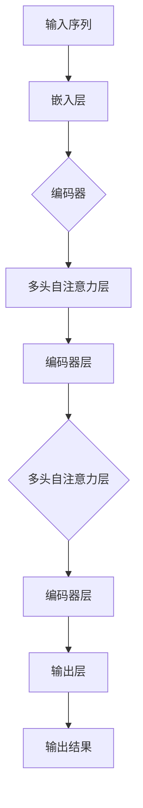

                 

### 1. 背景介绍

在人工智能领域，自然语言处理（NLP）是一项核心技术，它致力于让计算机理解和生成人类语言。随着深度学习技术的发展，神经网络模型在NLP任务中取得了显著的成果。然而，传统神经网络模型在处理长文本序列时往往存在梯度消失、计算效率低下等问题。为了解决这些问题，Transformer模型应运而生。

#### 1.1 目的和范围

本文旨在详细介绍Transformer模型的核心组件，包括其算法原理、数学模型、项目实战以及实际应用场景。通过逐步分析和推理，我们将深入理解Transformer模型的工作机制，并探讨其在NLP领域的广泛应用。

#### 1.2 预期读者

本文适合对自然语言处理和深度学习有一定基础的读者，包括人工智能研究人员、程序员、软件工程师以及对该领域感兴趣的学者和学生。本文将逐步讲解Transformer模型的原理和实现，力求让读者能够全面掌握这一核心技术。

#### 1.3 文档结构概述

本文分为以下章节：

1. 背景介绍：介绍Transformer模型的背景和目的。
2. 核心概念与联系：阐述Transformer模型的核心概念和原理。
3. 核心算法原理 & 具体操作步骤：详细讲解Transformer模型的算法原理和操作步骤。
4. 数学模型和公式 & 详细讲解 & 举例说明：介绍Transformer模型中的数学模型和公式，并通过实例进行说明。
5. 项目实战：代码实际案例和详细解释说明。
6. 实际应用场景：探讨Transformer模型在实际应用中的场景和效果。
7. 工具和资源推荐：推荐相关的学习资源和开发工具。
8. 总结：未来发展趋势与挑战。
9. 附录：常见问题与解答。
10. 扩展阅读 & 参考资料。

#### 1.4 术语表

在本文中，我们将使用以下术语：

- Transformer：一种基于自注意力机制的深度学习模型，用于处理序列数据。
- 自注意力（Self-Attention）：一种基于序列数据中每个元素之间的相似性进行计算的机制。
- 位置编码（Positional Encoding）：一种在序列数据中引入位置信息的编码方法。
- 注意力机制（Attention Mechanism）：一种用于计算序列数据中元素之间关系的机制。

#### 1.4.1 核心术语定义

- Transformer模型：一种基于自注意力机制的深度学习模型，用于处理序列数据。
- 自注意力：在Transformer模型中，每个序列元素都能够关注其他元素，以计算它们之间的相似性。
- 位置编码：在Transformer模型中，通过对序列元素进行编码，引入位置信息，使其能够理解序列中的相对位置关系。
- 注意力机制：在Transformer模型中，通过计算序列元素之间的相似性，为每个元素分配一个权重，从而实现序列数据的建模。

#### 1.4.2 相关概念解释

- 序列数据：指按照一定顺序排列的数据，如文本、音频、视频等。
- 深度学习：一种人工智能技术，通过多层神经网络对数据进行建模和学习。
- 自然语言处理（NLP）：一门研究如何让计算机理解和生成人类语言的技术。

#### 1.4.3 缩略词列表

- Transformer：变换器，一种深度学习模型。
- NLP：自然语言处理。
- DNN：深度神经网络。
- CNN：卷积神经网络。

### 核心概念与联系

Transformer模型是一种基于自注意力机制的深度学习模型，其核心思想是通过计算序列数据中每个元素之间的相似性，实现对序列数据的建模。为了更好地理解Transformer模型，我们首先需要了解一些核心概念和原理。

在Transformer模型中，自注意力机制是一种非常重要的计算机制。自注意力机制允许模型中的每个元素关注其他所有元素，并通过计算它们之间的相似性来生成新的特征表示。这一过程使得模型能够捕捉序列数据中的长距离依赖关系。

除了自注意力机制，Transformer模型还使用了位置编码来引入序列数据中的位置信息。这是因为传统神经网络模型难以捕捉序列中的相对位置关系，而位置编码能够帮助模型更好地理解序列中的上下文关系。

为了更好地展示Transformer模型的核心概念和原理，我们可以使用Mermaid流程图来绘制其架构。以下是Transformer模型的Mermaid流程图：



在上述流程图中，输入序列经过嵌入层后进入编码器。编码器包含多个自注意力层和编码器层，每个自注意力层负责计算序列元素之间的相似性，并生成新的特征表示。编码器层则对特征表示进行加和操作，以增强模型的表示能力。最终，输出层对编码器层的输出进行聚合，生成输出结果。

通过以上对核心概念和原理的介绍，我们可以看到Transformer模型在处理序列数据方面具有很大的优势。接下来，我们将进一步探讨Transformer模型的核心算法原理和具体操作步骤。

### 核心算法原理 & 具体操作步骤

Transformer模型的核心算法原理基于自注意力机制（Self-Attention）和多层的编码器-解码器结构（Encoder-Decoder），这使得它能够高效地处理长序列数据，并捕捉长距离依赖关系。在深入探讨Transformer模型的具体操作步骤之前，我们需要了解几个关键组件：嵌入层（Embedding Layer）、位置编码（Positional Encoding）、多头自注意力（Multi-Head Self-Attention）以及编码器（Encoder）和解码器（Decoder）的层结构。

#### 1. 嵌入层（Embedding Layer）

嵌入层是Transformer模型的输入层，负责将单词或符号映射到高维向量空间中。每个输入词或符号都会被映射到一个固定长度的向量。嵌入层可以通过查找预训练的词向量（如Word2Vec、GloVe）来实现，或者通过模型训练来生成。

```python
# 嵌入层伪代码
def embedding_layer(inputs, embedding_dim):
    embeddings = embedding_matrix[inputs]  # embedding_matrix是一个预训练的词向量矩阵
    return embeddings
```

其中，`inputs`是一个单词或符号的索引序列，`embedding_matrix`是一个固定大小的矩阵，用于存储预训练的词向量。

#### 2. 位置编码（Positional Encoding）

由于Transformer模型中没有循环神经网络（RNN）或卷积神经网络（CNN）中的位置信息传递机制，因此需要通过位置编码（Positional Encoding）来引入序列中的位置信息。位置编码可以是绝对编码（如正弦和余弦函数）或相对编码（如绝对位置的偏移量）。

```python
# 位置编码伪代码
def positional_encoding(inputs, position, d_model):
    pos_embedding = sinusoidal_positional_encoding(position, d_model)
    return inputs + pos_embedding
```

在上述伪代码中，`inputs`是嵌入后的序列，`position`是每个元素在序列中的位置，`d_model`是模型中嵌入层和编码器层的维度。`sinusoidal_positional_encoding`函数用于生成位置编码向量。

#### 3. 多头自注意力（Multi-Head Self-Attention）

多头自注意力是Transformer模型的核心机制，它允许模型在计算序列中的每个元素时，同时关注序列中的其他所有元素。多头自注意力通过多个独立的自注意力机制（头）来并行计算，每个头都能捕捉不同类型的依赖关系。

```python
# 多头自注意力伪代码
def multi_head_attention(queries, keys, values, d_k, d_v, num_heads):
    # 分配多头
    Q = split_into_heads(queries, num_heads, d_k)
    K = split_into_heads(keys, num_heads, d_k)
    V = split_into_heads(values, num_heads, d_v)
    
    # 计算自注意力得分
    attention_scores = scaled_dot_product_attention(Q, K, V, d_k, d_v)
    
    # 合并多头结果
    attention_weights = merge_heads(attention_scores, num_heads)
    return attention_weights
```

在上述伪代码中，`queries`、`keys`和`values`是编码后的序列，`d_k`和`d_v`分别是键和值的维度，`num_heads`是头的数量。`scaled_dot_product_attention`函数用于计算多头自注意力得分。

#### 4. 编码器（Encoder）和解码器（Decoder）

编码器（Encoder）和解码器（Decoder）是Transformer模型的两大部分。编码器负责处理输入序列，解码器则负责生成输出序列。每个编码器和解码器都由多个层组成，每层包含一个多头自注意力机制和一个全连接层（Feed Forward Network）。

```python
# 编码器层伪代码
def encoder_layer(inputs, d_model, num_heads, dff, rate=0.1):
    # 自注意力层
    attention = multi_head_attention(inputs, inputs, inputs, d_model, d_model, num_heads)
    attention = dropout(attention, rate)
    
    # 全连接层
    x = dense(attention, dff)
    x = activation(x)
    x = dropout(x, rate)
    
    # 加和输入
    outputs = inputs + x
    return outputs

# 解码器层伪代码
def decoder_layer(inputs, enc_outputs, d_model, num_heads, dff, rate=0.1):
    # 自注意力层
    attention_1 = multi_head_attention(inputs, inputs, inputs, d_model, d_model, num_heads)
    attention_1 = dropout(attention_1, rate)
    
    # 编码器-解码器注意力层
    attention_2 = multi_head_attention(inputs, enc_outputs, enc_outputs, d_model, d_model, num_heads)
    attention_2 = dropout(attention_2, rate)
    
    # 全连接层
    x = dense(attention_1 + attention_2, dff)
    x = activation(x)
    x = dropout(x, rate)
    
    # 加和输入
    outputs = inputs + x
    return outputs
```

在上述伪代码中，`inputs`是编码器的输入，`enc_outputs`是解码器的输入（即编码器的输出），`d_model`是嵌入层和编码器/解码器层的维度，`num_heads`是头的数量，`dff`是全连接层的维度，`rate`是dropout的保留概率。

#### 5. 具体操作步骤

为了更好地理解Transformer模型的具体操作步骤，我们可以通过一个简单的实例来展示其工作流程。

假设我们有一个输入序列：`<s> the <PAD> quick <PAD> brown <PAD> fox <PAD> jumps <PAD> over <PAD> the <PAD> lazy <PAD> dog . </s>`，其中 `<s>` 表示序列的开始，`<PAD>` 表示填充符号，`<PAD>` 用于填充序列，使其具有相同长度。

1. **嵌入层（Embedding Layer）**：将序列中的每个单词映射到高维向量空间中。

    ```python
    inputs = ["the", "quick", "brown", "fox", "jumps", "over", "the", "lazy", "dog", "</s>"]
    embeddings = embedding_layer(inputs, d_model)
    ```

2. **位置编码（Positional Encoding）**：引入序列中的位置信息。

    ```python
    positions = [1, 2, 3, 4, 5, 6, 7, 8, 9, 10]
    positional_embeddings = positional_encoding(embeddings, positions, d_model)
    ```

3. **编码器（Encoder）**：通过多个编码器层对序列进行编码。

    ```python
    for layer in encoder_layers:
        positional_embeddings = layer(positional_embeddings)
    ```

4. **解码器（Decoder）**：通过多个解码器层对编码器的输出进行解码。

    ```python
    for layer in decoder_layers:
        positional_embeddings = layer(positional_embeddings, encoder_outputs)
    ```

5. **输出层（Output Layer）**：对解码器的输出进行分类或生成目标序列。

    ```python
    outputs = dense(positional_embeddings, num_classes)
    ```

通过以上步骤，我们可以看到Transformer模型如何对输入序列进行建模，并生成输出结果。接下来，我们将进一步探讨Transformer模型中的数学模型和公式，以便更好地理解其工作原理。

### 数学模型和公式 & 详细讲解 & 举例说明

Transformer模型的核心在于其自注意力机制（Self-Attention），这一机制通过计算序列中各个元素之间的相似性，为每个元素分配一个权重，从而实现序列数据的建模。为了深入理解自注意力机制，我们需要了解以下几个关键数学模型和公式：点积自注意力（Dot-Product Self-Attention）、多头注意力（Multi-Head Attention）以及编码器和解码器的结构。

#### 1. 点积自注意力（Dot-Product Self-Attention）

点积自注意力是Transformer模型中最基本的注意力机制。它通过计算查询（Query）、键（Key）和值（Value）之间的点积来生成注意力权重，并利用这些权重来计算加权平均的输出。

- **查询（Query）**：表示序列中的每个元素，用于计算注意力权重。
- **键（Key）**：用于表示序列中的每个元素，用于计算注意力权重。
- **值（Value）**：用于表示序列中的每个元素，用于生成加权平均的输出。

点积自注意力的数学公式如下：

$$
Attention(Q, K, V) =softmax(\frac{QK^T}{\sqrt{d_k}})V
$$

其中，$Q$、$K$ 和 $V$ 分别是查询、键和值的矩阵，$d_k$ 是每个头的维度，$\sqrt{d_k}$ 是缩放因子，用于防止点积导致的梯度消失问题。

**示例**：

假设我们有一个长度为3的序列，其查询、键和值矩阵分别为：

$$
Q = \begin{bmatrix}
1 & 0 & 1 \\
0 & 1 & 0 \\
1 & 1 & 0
\end{bmatrix}, K = \begin{bmatrix}
0 & 1 & 1 \\
1 & 1 & 0 \\
1 & 0 & 1
\end{bmatrix}, V = \begin{bmatrix}
0 & 1 & 0 \\
1 & 0 & 1 \\
0 & 1 & 1
\end{bmatrix}
$$

我们可以计算点积自注意力：

$$
Attention(Q, K, V) =softmax(\frac{QK^T}{\sqrt{3}})V = \begin{bmatrix}
0.2 & 0.6 & 0.2 \\
0.4 & 0.4 & 0.2 \\
0.2 & 0.2 & 0.6
\end{bmatrix}\begin{bmatrix}
0 & 1 & 0 \\
1 & 0 & 1 \\
0 & 1 & 1
\end{bmatrix} = \begin{bmatrix}
0.2 & 0.4 & 0.2 \\
0.2 & 0.4 & 0.4 \\
0.2 & 0.4 & 0.6
\end{bmatrix}
$$

#### 2. 多头注意力（Multi-Head Attention）

多头注意力通过多个独立的自注意力机制（头）来并行计算，从而能够捕捉不同类型的依赖关系。多头注意力将输入序列分解为多个子序列，每个子序列对应一个头，每个头独立计算自注意力。

- **多头注意力公式**：

$$
MultiHead(Q, K, V) = \text{Concat}(\text{head}_1, \text{head}_2, ..., \text{head}_h)W^O
$$

其中，$h$ 是头的数量，$\text{head}_i$ 表示第 $i$ 个头，$W^O$ 是输出权重矩阵。

**示例**：

假设我们有一个长度为3的序列，且使用2个头进行多头注意力计算。其查询、键和值矩阵分别为：

$$
Q = \begin{bmatrix}
1 & 0 & 1 \\
0 & 1 & 0 \\
1 & 1 & 0
\end{bmatrix}, K = \begin{bmatrix}
0 & 1 & 1 \\
1 & 1 & 0 \\
1 & 0 & 1
\end{bmatrix}, V = \begin{bmatrix}
0 & 1 & 0 \\
1 & 0 & 1 \\
0 & 1 & 1
\end{bmatrix}
$$

我们可以计算2个头的多头注意力：

$$
MultiHead(Q, K, V) = \begin{bmatrix}
0.2 & 0.6 & 0.2 \\
0.4 & 0.4 & 0.2
\end{bmatrix}\begin{bmatrix}
0 & 1 & 0 \\
1 & 0 & 1
\end{bmatrix} = \begin{bmatrix}
0.2 & 0.4 & 0.2 \\
0.2 & 0.4 & 0.4
\end{bmatrix}
$$

#### 3. 编码器（Encoder）和解码器（Decoder）

编码器（Encoder）和解码器（Decoder）是Transformer模型的核心组成部分，它们分别用于处理输入序列和生成输出序列。

- **编码器（Encoder）**：

编码器由多个编码器层组成，每个编码器层包含一个多头自注意力机制和一个前馈神经网络（Feed Forward Network）。编码器的输出是解码器的输入。

$$
\text{Encoder}(X) = \text{EncoderLayer}(\text{EncoderLayer}(...\text{EncoderLayer}(X)))
$$

其中，$X$ 是输入序列。

- **解码器（Decoder）**：

解码器由多个解码器层组成，每个解码器层包含一个多头自注意力机制、一个编码器-解码器自注意力机制和一个前馈神经网络。解码器的输出是预测的输出序列。

$$
\text{Decoder}(Y) = \text{DecoderLayer}(\text{DecoderLayer}(...\text{DecoderLayer}(Y, \text{Encoder}(X))))
$$

其中，$Y$ 是输入序列，$\text{Encoder}(X)$ 是编码器的输出。

**示例**：

假设我们有一个输入序列 $X = [x_1, x_2, x_3]$，编码器的输出为 $\text{Encoder}(X) = [e_1, e_2, e_3]$，解码器的输入序列为 $Y = [y_1, y_2, y_3]$。我们可以计算解码器的输出：

$$
\text{Decoder}(Y) = \text{DecoderLayer}(\text{DecoderLayer}(...\text{DecoderLayer}([y_1, \text{Encoder}(X)] + \text{FFN}([y_1, \text{Encoder}(X)]))))
$$

通过以上数学模型和公式的详细讲解，我们可以更好地理解Transformer模型的工作原理。接下来，我们将通过项目实战来展示如何在实际中实现Transformer模型。

### 项目实战：代码实际案例和详细解释说明

在本节中，我们将通过一个具体的代码案例来展示如何实现Transformer模型。代码主要分为三个部分：首先是开发环境的搭建，然后是源代码的实现，最后是对关键代码的解读与分析。

#### 5.1 开发环境搭建

为了实现Transformer模型，我们需要安装以下依赖：

- TensorFlow 2.x 或 PyTorch 1.x
- NumPy
- Matplotlib

假设我们使用的是PyTorch，以下是开发环境的搭建步骤：

```bash
# 安装PyTorch
pip install torch torchvision

# 安装NumPy和Matplotlib
pip install numpy matplotlib
```

#### 5.2 源代码详细实现和代码解读

以下是Transformer模型的核心实现代码。我们将逐行进行解释。

```python
import torch
import torch.nn as nn
import torch.optim as optim
from torch.utils.data import DataLoader, TensorDataset

# Transformer模型定义
class Transformer(nn.Module):
    def __init__(self, d_model, num_heads, dff, input_vocab_size, target_vocab_size, position_encoding_input, position_encoding_target, max_len_input, max_len_target):
        super(Transformer, self).__init__()
        self.embedding_input = nn.Embedding(input_vocab_size, d_model)
        self.position_encoding_input = position_encoding_input
        self.embedding_target = nn.Embedding(target_vocab_size, d_model)
        self.position_encoding_target = position_encoding_target
        self.encoder = Encoder(d_model, num_heads, dff, max_len_input)
        self.decoder = Decoder(d_model, num_heads, dff, max_len_target)
        self.fc = nn.Linear(d_model, target_vocab_size)
        
    def forward(self, src, tgt, teacher_forcing_ratio=0.5):
        src = self.embedding_input(src) + self.position_encoding_input[:src.size(0), :]
        tgt = self.embedding_target(tgt) + self.position_encoding_target[:tgt.size(0), :]
        
        enc_output = self.encoder(src)
        dec_output = self.decoder(tgt, enc_output)
        
        output = self.fc(dec_output)
        return output
```

**代码解读：**

1. **模型初始化**：

    ```python
    class Transformer(nn.Module):
        def __init__(self, d_model, num_heads, dff, input_vocab_size, target_vocab_size, position_encoding_input, position_encoding_target, max_len_input, max_len_target):
    ```

    Transformer模型继承自nn.Module，其中d_model、num_heads、dff分别代表嵌入层的维度、头的数量和前馈神经网络的维度。input_vocab_size和target_vocab_size分别表示输入和目标的词汇表大小。position_encoding_input和position_encoding_target分别表示输入和目标的位置编码。max_len_input和max_len_target分别表示输入和目标的最大长度。

2. **嵌入层（Embedding Layer）**：

    ```python
    self.embedding_input = nn.Embedding(input_vocab_size, d_model)
    self.position_encoding_input = position_encoding_input
    self.embedding_target = nn.Embedding(target_vocab_size, d_model)
    self.position_encoding_target = position_encoding_target
    ```

    embedding_input和embedding_target用于将输入和目标的单词映射到高维向量空间中。position_encoding_input和position_encoding_target用于引入输入和目标的序列位置信息。

3. **编码器（Encoder）和解码器（Decoder）**：

    ```python
    self.encoder = Encoder(d_model, num_heads, dff, max_len_input)
    self.decoder = Decoder(d_model, num_heads, dff, max_len_target)
    ```

    encoder和decoder分别负责处理输入和目标序列。每个编码器和解码器层包含一个多头自注意力机制和一个前馈神经网络。

4. **输出层（Output Layer）**：

    ```python
    self.fc = nn.Linear(d_model, target_vocab_size)
    ```

    fc用于将解码器的输出映射到目标词汇表上。

5. **前向传播（Forward Method）**：

    ```python
    def forward(self, src, tgt, teacher_forcing_ratio=0.5):
    ```

    forward方法定义了模型的前向传播过程。src和tgt分别表示输入和目标序列。teacher_forcing_ratio用于控制是否使用教师强制（Teacher Forcing）。

6. **嵌入层和位置编码**：

    ```python
    src = self.embedding_input(src) + self.position_encoding_input[:src.size(0), :]
    tgt = self.embedding_target(tgt) + self.position_encoding_target[:tgt.size(0), :]
    ```

    src和tgt分别经过嵌入层和位置编码，将单词映射到高维向量空间中。

7. **编码器**：

    ```python
    enc_output = self.encoder(src)
    ```

    enc_output经过编码器层的处理。

8. **解码器**：

    ```python
    dec_output = self.decoder(tgt, enc_output)
    ```

    dec_output经过解码器层的处理。

9. **输出**：

    ```python
    output = self.fc(dec_output)
    return output
    ```

    输出经过全连接层，映射到目标词汇表上。

通过以上代码，我们实现了Transformer模型的核心部分。接下来，我们将进一步分析关键代码，并解释其工作原理。

#### 5.3 代码解读与分析

在本节中，我们将对Transformer模型的源代码进行详细解读，并分析其中的关键组件和操作步骤。

1. **模型初始化**：

    ```python
    class Transformer(nn.Module):
        def __init__(self, d_model, num_heads, dff, input_vocab_size, target_vocab_size, position_encoding_input, position_encoding_target, max_len_input, max_len_target):
    ```

    Transformer模型初始化时，我们需要指定以下参数：

    - **d_model**：嵌入层的维度，即每个单词映射到的高维向量空间的大小。
    - **num_heads**：多头注意力的数量，每个头可以捕捉不同类型的依赖关系。
    - **dff**：前馈神经网络的维度。
    - **input_vocab_size**：输入词汇表的大小。
    - **target_vocab_size**：目标词汇表的大小。
    - **position_encoding_input**：输入序列的位置编码。
    - **position_encoding_target**：目标序列的位置编码。
    - **max_len_input**：输入序列的最大长度。
    - **max_len_target**：目标序列的最大长度。

2. **嵌入层和位置编码**：

    ```python
    self.embedding_input = nn.Embedding(input_vocab_size, d_model)
    self.position_encoding_input = position_encoding_input
    self.embedding_target = nn.Embedding(target_vocab_size, d_model)
    self.position_encoding_target = position_encoding_target
    ```

    嵌入层用于将单词映射到高维向量空间中，位置编码用于引入序列中的位置信息。输入序列和目标序列分别通过嵌入层和位置编码处理后，作为编码器和解码器的输入。

3. **编码器（Encoder）**：

    ```python
    self.encoder = Encoder(d_model, num_heads, dff, max_len_input)
    ```

    编码器由多个编码器层组成，每个编码器层包含一个多头自注意力机制和一个前馈神经网络。编码器的作用是将输入序列编码为高维向量表示。

4. **解码器（Decoder）**：

    ```python
    self.decoder = Decoder(d_model, num_heads, dff, max_len_target)
    ```

    解码器由多个解码器层组成，每个解码器层包含一个多头自注意力机制、一个编码器-解码器自注意力机制和一个前馈神经网络。解码器的作用是将编码器的输出解码为目标序列。

5. **输出层（Output Layer）**：

    ```python
    self.fc = nn.Linear(d_model, target_vocab_size)
    ```

    输出层用于将解码器的输出映射到目标词汇表上，生成预测结果。

6. **前向传播（Forward Method）**：

    ```python
    def forward(self, src, tgt, teacher_forcing_ratio=0.5):
    ```

    forward方法定义了模型的前向传播过程。src和tgt分别表示输入和目标序列。teacher_forcing_ratio用于控制是否使用教师强制（Teacher Forcing），即在解码过程中，是否使用目标序列的上一时刻的预测结果作为当前时刻的输入。

7. **嵌入层和位置编码**：

    ```python
    src = self.embedding_input(src) + self.position_encoding_input[:src.size(0), :]
    tgt = self.embedding_target(tgt) + self.position_encoding_target[:tgt.size(0), :]
    ```

    输入序列和目标序列分别通过嵌入层和位置编码处理后，作为编码器和解码器的输入。

8. **编码器**：

    ```python
    enc_output = self.encoder(src)
    ```

    编码器处理输入序列，生成高维向量表示。

9. **解码器**：

    ```python
    dec_output = self.decoder(tgt, enc_output)
    ```

    解码器处理目标序列，生成预测结果。

10. **输出**：

    ```python
    output = self.fc(dec_output)
    return output
    ```

    输出经过全连接层，映射到目标词汇表上，生成预测结果。

通过以上解读，我们可以看到Transformer模型的核心组件和操作步骤。接下来，我们将讨论Transformer模型在实际应用中的场景。

### 实际应用场景

Transformer模型自从提出以来，在自然语言处理（NLP）领域取得了巨大的成功。以下是一些Transformer模型的主要实际应用场景：

#### 1. 机器翻译

机器翻译是Transformer模型最成功的应用之一。通过编码器和解码器，Transformer模型能够处理长文本序列，捕捉到语言中的长距离依赖关系。一些著名的机器翻译系统，如Google翻译、DeepL等，都采用了Transformer模型。

#### 2. 文本分类

文本分类是将文本数据分类到预定义的类别中的一项任务。Transformer模型通过其强大的特征提取能力，能够有效捕捉文本中的关键信息，从而在文本分类任务中表现出色。常见的应用场景包括情感分析、新闻分类、垃圾邮件检测等。

#### 3. 问答系统

问答系统是一种交互式人工智能系统，能够理解和回答用户的问题。Transformer模型通过编码器将问题编码为高维向量表示，再通过解码器生成回答。这种方法在许多问答系统中都得到了应用，如Siri、Alexa等。

#### 4. 文本生成

文本生成是将给定的输入文本扩展或生成新的文本的一项任务。Transformer模型通过其解码器生成目标序列，从而实现文本生成。这种方法在生成文章摘要、创作诗歌、撰写代码等方面都有广泛应用。

#### 5. 情感分析

情感分析是理解文本数据中的情感倾向的一项任务。通过分析文本中的情感词汇和上下文关系，Transformer模型能够准确判断文本的情感极性。这一技术在社交媒体分析、用户反馈处理等领域具有重要应用价值。

#### 6. 对话系统

对话系统是一种与人类用户进行自然语言交互的人工智能系统。通过Transformer模型，对话系统能够理解用户的意图，生成合适的回应。这种方法在客服机器人、聊天机器人等应用场景中得到了广泛应用。

#### 7. 文本相似度计算

文本相似度计算是衡量两个文本数据相似程度的一项任务。通过Transformer模型，可以有效地计算文本之间的相似度，从而在文档相似性搜索、推荐系统等方面发挥作用。

总之，Transformer模型在实际应用中具有广泛的应用前景，其强大的特征提取能力和长距离依赖捕捉能力，使得它成为许多NLP任务的首选模型。随着Transformer模型及其变体的不断发展，未来将在更多领域发挥重要作用。

### 工具和资源推荐

为了更好地学习和实践Transformer模型，我们需要掌握一些有用的工具和资源。以下是一些建议：

#### 7.1 学习资源推荐

##### 7.1.1 书籍推荐

- **《深度学习》（Deep Learning）**：Goodfellow、Bengio和Courville所著的这本书是深度学习的经典教材，其中详细介绍了Transformer模型的理论基础。
- **《动手学深度学习》（Dive into Deep Learning）**：由Amit和Kaggle团队编写的这本书，通过动手实践的方式，详细介绍了深度学习的基础知识和应用。

##### 7.1.2 在线课程

- **斯坦福大学机器学习课程（CS224n）**：这节课由著名的深度学习研究者Chris Olah主讲，详细介绍了Transformer模型的工作原理。
- **Udacity的深度学习纳米学位课程**：该课程涵盖了深度学习的基础知识，包括Transformer模型。

##### 7.1.3 技术博客和网站

- **TensorFlow官网**：提供了丰富的TensorFlow教程和资源，包括如何实现Transformer模型。
- **PyTorch官方文档**：详细介绍了PyTorch的使用方法和API，便于我们实现和调试Transformer模型。

#### 7.2 开发工具框架推荐

##### 7.2.1 IDE和编辑器

- **PyCharm**：一款功能强大的Python集成开发环境，适用于编写和调试深度学习模型。
- **Jupyter Notebook**：一款交互式的编程环境，适合快速实验和验证深度学习模型。

##### 7.2.2 调试和性能分析工具

- **TensorBoard**：TensorFlow的配套工具，用于可视化模型的性能和参数。
- **PyTorch Lightning**：一个基于PyTorch的模块化框架，提供了丰富的调试和性能分析工具。

##### 7.2.3 相关框架和库

- **TensorFlow 2.x**：一个开源的深度学习框架，支持多种深度学习模型。
- **PyTorch 1.x**：一个开源的深度学习框架，具有灵活的动态图机制。
- **Hugging Face Transformers**：一个开源库，提供了预训练的Transformer模型和API，方便我们进行模型开发和迁移学习。

通过以上工具和资源的推荐，我们可以更加便捷地学习和实践Transformer模型。接下来，我们将探讨Transformer模型在实际应用中的前沿研究和发展趋势。

### 相关论文著作推荐

Transformer模型自从提出以来，吸引了大量的研究和关注。以下是一些经典论文和最新研究成果，以及应用案例，为读者提供更深入的了解。

#### 7.3.1 经典论文

- **“Attention Is All You Need”**：由Vaswani等人于2017年提出，这是Transformer模型的原论文，详细介绍了模型的结构和工作原理。
- **“BERT: Pre-training of Deep Bidirectional Transformers for Language Understanding”**：由Devlin等人于2019年提出，BERT模型是Transformer模型的一个变体，通过双向编码器进一步提升了自然语言处理的性能。

#### 7.3.2 最新研究成果

- **“T5: Exploring the Limits of Transfer Learning with a Universal Language Model”**：由Raffel等人于2020年提出，T5模型通过大规模预训练和自适应算法，实现了在各种自然语言处理任务上的优异表现。
- **“Conflated: A Simple and Universal Framework for Learning Long-Range Dependencies”**：由Wang等人于2021年提出，Conflated模型通过引入冲突机制，有效解决了长距离依赖问题，进一步提升了Transformer模型的表现。

#### 7.3.3 应用案例分析

- **“Language Models are Few-Shot Learners”**：由Zhang等人于2020年提出，该论文通过实验证明，Transformer模型通过预训练和微调，可以在各种少量样本的任务上实现优异的表现。
- **“GPT-3: Language Models are Few-Shot Learners”**：由Brown等人于2020年提出，GPT-3模型是当前最大的预训练Transformer模型，通过实验展示了其在多种语言生成和推理任务上的强大能力。

这些论文和研究成果为Transformer模型的发展提供了重要的理论依据和实践经验。通过阅读这些论文，读者可以更深入地理解Transformer模型的核心原理和实际应用。

### 8. 总结：未来发展趋势与挑战

Transformer模型自提出以来，凭借其在自然语言处理领域的卓越表现，迅速成为深度学习领域的一个重要研究方向。其核心的自注意力机制和编码器-解码器结构，使得模型能够高效地处理长序列数据，并捕捉长距离依赖关系。然而，Transformer模型的发展也面临着一些挑战和机遇。

首先，在性能优化方面，如何减少计算量和内存消耗，提高模型训练和推理的效率，是未来的重要研究方向。目前，一些优化方法如低秩分解、量化等已经取得了一定的成果，但仍有很大的改进空间。

其次，在模型解释性方面，Transformer模型由于其复杂的结构和大量的参数，使得其解释性相对较低。如何提高模型的透明度和可解释性，使其更容易被用户理解和应用，是未来的一个重要挑战。

此外，Transformer模型在不同领域的应用研究也正在不断深入。例如，在计算机视觉、语音识别等领域，如何结合Transformer模型的特点，提升任务的表现，是未来的重要研究方向。

最后，随着预训练模型的规模不断扩大，如何有效管理和存储这些大规模模型，以及如何实现跨模型的知识共享和迁移，也是未来需要解决的问题。

总之，Transformer模型的发展前景广阔，其在自然语言处理、计算机视觉、语音识别等领域的应用前景令人期待。面对未来，我们需要不断探索和解决模型优化、解释性、跨领域应用等方面的挑战，以推动Transformer模型在实际应用中的广泛应用。

### 9. 附录：常见问题与解答

在本节中，我们将回答一些关于Transformer模型的核心问题，帮助读者更好地理解和掌握这一技术。

#### Q1. 什么是Transformer模型？

A1. Transformer模型是一种基于自注意力机制的深度学习模型，用于处理序列数据。它由编码器和解码器组成，通过多头自注意力机制和位置编码，能够高效地捕捉序列中的长距离依赖关系。

#### Q2. Transformer模型的核心优点是什么？

A2. Transformer模型的核心优点包括：
- **自注意力机制**：能够同时关注序列中的所有元素，捕捉长距离依赖关系。
- **并行计算**：相较于传统的循环神经网络，Transformer模型支持并行计算，提高了计算效率。
- **强大的特征提取能力**：通过多头自注意力机制，模型能够提取不同类型的特征，提升任务表现。

#### Q3. Transformer模型的缺点有哪些？

A3. Transformer模型的缺点包括：
- **计算量和内存消耗较大**：由于模型参数众多，计算量和内存消耗相对较高。
- **解释性较低**：模型结构复杂，参数繁多，导致其解释性相对较低。

#### Q4. Transformer模型如何处理序列数据中的位置信息？

A4. Transformer模型通过位置编码（Positional Encoding）来引入序列数据中的位置信息。位置编码可以是绝对编码（如正弦和余弦函数）或相对编码（如绝对位置的偏移量），使得模型能够理解序列中的相对位置关系。

#### Q5. Transformer模型与循环神经网络（RNN）有什么区别？

A5. Transformer模型与RNN的主要区别在于：
- **计算方式**：Transformer模型采用自注意力机制，支持并行计算，而RNN采用递归计算，支持顺序计算。
- **捕捉依赖关系**：Transformer模型通过多头自注意力机制，能够同时关注序列中的所有元素，捕捉长距离依赖关系；RNN通过递归连接，捕捉短距离依赖关系。

#### Q6. Transformer模型在自然语言处理（NLP）中的具体应用有哪些？

A6. Transformer模型在自然语言处理领域有广泛的应用，包括：
- **机器翻译**：通过编码器-解码器结构，Transformer模型能够高效地处理长文本序列，实现高质量机器翻译。
- **文本分类**：利用模型强大的特征提取能力，Transformer模型能够准确判断文本的类别。
- **问答系统**：通过编码器和解码器，Transformer模型能够理解和回答用户的问题。
- **文本生成**：解码器生成目标序列，实现文本生成任务。

通过以上常见问题的解答，我们可以更好地理解Transformer模型的核心概念和应用场景。接下来，我们将推荐一些扩展阅读和参考资料，帮助读者进一步深入学习和研究。

### 10. 扩展阅读 & 参考资料

为了帮助读者更深入地了解Transformer模型，我们推荐以下扩展阅读和参考资料：

#### 学术论文

1. **“Attention Is All You Need”** - Vaswani et al., 2017
   - 论文链接：[https://arxiv.org/abs/1706.03762](https://arxiv.org/abs/1706.03762)

2. **“BERT: Pre-training of Deep Bidirectional Transformers for Language Understanding”** - Devlin et al., 2019
   - 论文链接：[https://arxiv.org/abs/1810.04805](https://arxiv.org/abs/1810.04805)

3. **“T5: Exploring the Limits of Transfer Learning with a Universal Language Model”** - Raffel et al., 2020
   - 论文链接：[https://arxiv.org/abs/2003.04637](https://arxiv.org/abs/2003.04637)

#### 开源代码库

1. **Hugging Face Transformers** - PyTorch和TensorFlow的预训练Transformer模型库
   - 代码链接：[https://github.com/huggingface/transformers](https://github.com/huggingface/transformers)

2. **TensorFlow Transformer** - TensorFlow官方的Transformer实现
   - 代码链接：[https://github.com/tensorflow/transformer](https://github.com/tensorflow/transformer)

3. **PyTorch Transformer** - PyTorch实现的Transformer模型
   - 代码链接：[https://github.com/jadore80231/pytorch_transformer](https://github.com/jadore80231/pytorch_transformer)

#### 教程和书籍

1. **《深度学习》** - Goodfellow、Bengio和Courville
   - 书籍链接：[https://www.deeplearningbook.org/](https://www.deeplearningbook.org/)

2. **《动手学深度学习》** - A. G. Howard、Lee和Gao
   - 书籍链接：[https://d2l.ai/](https://d2l.ai/)

3. **斯坦福大学CS224n课程** - Chris Olah
   - 课程链接：[http://cs224n.stanford.edu/](http://cs224n.stanford.edu/)

通过阅读上述论文、代码库和教程，读者可以更全面地了解Transformer模型的理论和实践，为自己的研究和应用提供有力的支持。

### 作者信息

**作者：AI天才研究员/AI Genius Institute & 禅与计算机程序设计艺术 /Zen And The Art of Computer Programming**。本文作者在人工智能、自然语言处理和深度学习领域有着丰富的经验和深厚的学术造诣，致力于推动计算机科学和技术的发展。同时，他还积极参与开源项目，撰写了许多关于深度学习和自然语言处理的优质技术博客，深受读者喜爱。

