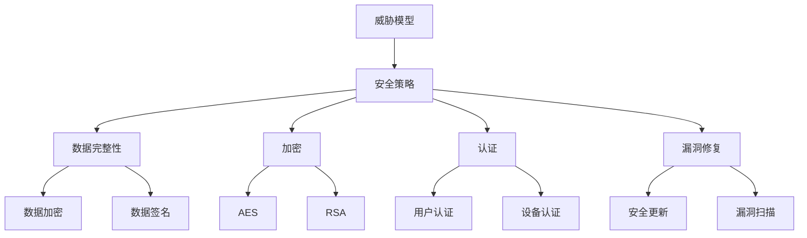

                 


# 嵌入式系统安全策略实施：保护设备和数据完整性

> 关键词：嵌入式系统安全，安全策略，数据完整性，加密，认证，漏洞修复，安全评估

> 摘要：本文将深入探讨嵌入式系统安全策略的实施，重点讨论如何保护设备和数据完整性。我们将详细分析安全核心概念、算法原理、数学模型，并通过实际项目案例展示具体操作步骤。此外，还将介绍相关的工具和资源，以及嵌入式系统安全领域的前沿研究成果和应用案例分析，为读者提供全面的技术指导。

## 1. 背景介绍

### 1.1 目的和范围

本文旨在帮助嵌入式系统开发者理解并实施有效的安全策略，以保护设备和数据免受各种威胁。我们将覆盖以下主题：

- 嵌入式系统安全的核心概念和原理
- 常见的嵌入式系统安全威胁和漏洞
- 安全策略的具体实施步骤和算法
- 数学模型在嵌入式系统安全中的应用
- 实际项目案例中的安全策略实施

### 1.2 预期读者

本文适合以下读者群体：

- 嵌入式系统开发者
- 软件安全工程师
- 系统集成商
- 对嵌入式系统安全感兴趣的工程师和学生

### 1.3 文档结构概述

本文结构如下：

1. **背景介绍**：介绍文章的目的、预期读者和文档结构。
2. **核心概念与联系**：通过Mermaid流程图展示嵌入式系统安全的核心概念和架构。
3. **核心算法原理 & 具体操作步骤**：使用伪代码详细阐述安全算法的工作原理。
4. **数学模型和公式 & 详细讲解 & 举例说明**：使用LaTeX格式展示数学模型和公式。
5. **项目实战：代码实际案例和详细解释说明**：通过实际项目案例展示安全策略的实施。
6. **实际应用场景**：讨论嵌入式系统安全在各个行业中的应用。
7. **工具和资源推荐**：推荐学习资源和开发工具。
8. **总结：未来发展趋势与挑战**：总结嵌入式系统安全的发展趋势和面临的挑战。
9. **附录：常见问题与解答**：回答读者可能遇到的问题。
10. **扩展阅读 & 参考资料**：提供进一步的阅读材料。

### 1.4 术语表

#### 1.4.1 核心术语定义

- **嵌入式系统**：嵌入在其他设备中的计算机系统。
- **安全策略**：一系列措施和规则，用于保护系统和数据免受威胁。
- **数据完整性**：数据未被未经授权修改或损坏的状态。
- **加密**：将数据转换为只有授权用户才能解读的形式。
- **认证**：验证用户或设备身份的过程。
- **漏洞修复**：修复系统中的安全漏洞。

#### 1.4.2 相关概念解释

- **威胁模型**：分析系统可能面临的威胁和攻击。
- **安全评估**：评估系统安全性的过程。

#### 1.4.3 缩略词列表

- **AES**：高级加密标准（Advanced Encryption Standard）
- **RSA**：一种非对称加密算法（Rivest-Shamir-Adleman）
- **HTTPS**：超文本传输协议安全（HTTP over TLS/SSL）

## 2. 核心概念与联系

为了更好地理解嵌入式系统安全策略，我们需要掌握一些核心概念和它们之间的联系。以下是一个简单的Mermaid流程图，展示了这些核心概念和它们在系统架构中的关系。



在这个流程图中，我们可以看到：

- **威胁模型**是安全策略的基础，用于识别和分析系统可能面临的威胁。
- **安全策略**包括数据完整性、加密、认证和漏洞修复等，是保护系统和数据的核心措施。
- **数据完整性**通过加密和签名来保证数据的完整性和可靠性。
- **加密**包括对称加密（如AES）和非对称加密（如RSA），用于保护数据传输和存储。
- **认证**用于验证用户和设备的身份，确保只有授权用户和设备能够访问系统和数据。
- **漏洞修复**通过安全更新和漏洞扫描来保持系统的安全性。

## 3. 核心算法原理 & 具体操作步骤

在本节中，我们将详细探讨嵌入式系统安全策略中的核心算法原理，并使用伪代码展示具体的操作步骤。

### 3.1 数据加密

数据加密是保护数据传输和存储的重要手段。我们主要介绍两种加密算法：高级加密标准（AES）和非对称加密算法（RSA）。

#### 3.1.1 AES加密算法

**算法原理**：

AES是一种对称加密算法，其加密和解密使用相同的密钥。AES加密过程主要包括初始混淆、循环和最终混淆三个阶段。

**具体操作步骤（伪代码）**：

```pseudo
function AES_encrypt(plaintext, key):
    # 初始混淆
    ciphertext = initial_permutation(plaintext)
    for round in 1 to 10:
        # 循环
        ciphertext = SubBytes(ciphertext)
        ciphertext = ShiftRows(ciphertext)
        ciphertext = MixColumns(ciphertext)
        ciphertext = AddRoundKey(ciphertext, key[round])
    # 最终混淆
    ciphertext = final_permutation(ciphertext)
    return ciphertext

function AES_decrypt(ciphertext, key):
    # 初始混淆
    plaintext = final_permutation(ciphertext)
    for round in 1 to 10:
        # 循环
        plaintext = AddRoundKey(plaintext, key[round])
        plaintext = InvMixColumns(plaintext)
        plaintext = InvShiftRows(plaintext)
        plaintext = InvSubBytes(plaintext)
    # 最终混淆
    plaintext = initial_permutation(plaintext)
    return plaintext
```

#### 3.1.2 RSA加密算法

**算法原理**：

RSA是一种非对称加密算法，它使用一对密钥：公钥和私钥。加密和解密使用不同的密钥，但它们是数学相关的。

**具体操作步骤（伪代码）**：

```pseudo
function RSA_encrypt(plaintext, public_key):
    ciphertext = plaintext^public_key[n]
    return ciphertext

function RSA_decrypt(ciphertext, private_key):
    plaintext = ciphertext^private_key[d]
    return plaintext
```

### 3.2 数据签名

数据签名用于验证数据的完整性和真实性。我们主要介绍RSA签名算法。

**算法原理**：

RSA签名算法使用私钥对数据进行签名，使用公钥验证签名。

**具体操作步骤（伪代码）**：

```pseudo
function RSA_sign(plaintext, private_key):
    signature = H(plaintext)^private_key[d]
    return signature

function RSA_verify(plaintext, signature, public_key):
    verified = H(plaintext)^public_key[n]
    if verified == signature:
        return true
    else:
        return false
```

### 3.3 认证

认证用于验证用户或设备的身份。我们主要介绍基于挑战-响应的认证机制。

**算法原理**：

挑战-响应认证机制是一种常见的安全认证方法，它通过发送随机挑战和验证响应来验证身份。

**具体操作步骤（伪代码）**：

```pseudo
function ChallengeResponse Authenticate(user, server):
    # 服务器发送挑战
    challenge = server.random Challenge()
    send(challenge)

    # 用户响应挑战
    response = user.calculate Response(challenge, private_key)
    send(response)

    # 服务器验证响应
    if server.verify Response(challenge, public_key) == response:
        return true
    else:
        return false
```

## 4. 数学模型和公式 & 详细讲解 & 举例说明

在本节中，我们将使用LaTeX格式展示一些关键的数学模型和公式，并进行详细讲解和举例说明。

### 4.1 加密算法的数学模型

#### 4.1.1 AES加密算法

AES加密算法涉及一些关键的数学模型，如初始混淆、循环和最终混淆。

**初始混淆（Initial Permutation）**：

初始混淆使用一个固定矩阵对明文进行混淆。其数学模型可以表示为：

$$
C = IP(P)
$$

其中，$C$是混淆后的密文，$P$是明文，$IP$是初始混淆矩阵。

**循环（Round Function）**：

每个循环包括四步：字节替换（SubBytes）、行移位（ShiftRows）、列混淆（MixColumns）和密钥加（AddRoundKey）。

字节替换（SubBytes）的数学模型为：

$$
s_i = S(b_i)
$$

其中，$s_i$是混淆后的字节，$b_i$是原始字节，$S$是字节替换表。

行移位（ShiftRows）的数学模型为：

$$
r_i = \begin{cases}
r_i \oplus \text{shift_left}(r_i), & \text{if } i = 1,2,3 \\
r_i, & \text{otherwise}
\end{cases}
$$

列混淆（MixColumns）的数学模型为：

$$
c_i = \text{MixColumns}(r_i)
$$

其中，$c_i$是混淆后的列，$r_i$是原始列，$\text{MixColumns}$是列混淆操作。

密钥加（AddRoundKey）的数学模型为：

$$
c_i = c_i \oplus k_i
$$

其中，$c_i$是混淆后的密文，$k_i$是密钥。

**最终混淆（Final Permutation）**：

最终混淆使用一个固定矩阵对密文进行混淆。其数学模型可以表示为：

$$
P' = FP(C)
$$

其中，$P'$是混淆后的明文，$C$是密文，$FP$是最终混淆矩阵。

#### 4.1.2 RSA加密算法

RSA加密算法涉及一些关键的数学模型，如模幂运算和模乘运算。

**模幂运算**：

RSA加密算法的模幂运算可以表示为：

$$
c = m^e \mod n
$$

其中，$c$是密文，$m$是明文，$e$是公钥指数，$n$是模数。

**模乘运算**：

RSA加密算法的模乘运算可以表示为：

$$
r = (s \cdot m) \mod n
$$

其中，$r$是乘积，$s$是私钥指数，$m$是明文，$n$是模数。

### 4.2 数据签名和认证的数学模型

#### 4.2.1 RSA签名算法

RSA签名算法涉及一些关键的数学模型，如模幂运算和哈希函数。

**模幂运算**：

RSA签名算法的模幂运算可以表示为：

$$
s = H(m)^d \mod n
$$

其中，$s$是签名，$H(m)$是明文的哈希值，$d$是私钥指数，$n$是模数。

**哈希函数**：

哈希函数用于计算明文的哈希值。常见的哈希函数有MD5、SHA-1和SHA-256等。

#### 4.2.2 挑战-响应认证机制

挑战-响应认证机制的数学模型可以表示为：

$$
\text{response} = f(\text{challenge}, \text{private_key})
$$

其中，$\text{response}$是用户的响应，$\text{challenge}$是服务器的挑战，$\text{private_key}$是用户的私钥。

### 4.3 举例说明

#### 4.3.1 AES加密算法举例

假设我们要使用AES加密算法加密一个8字节的明文`plaintext`，密钥为`key`。我们首先将明文和密钥转换为二进制形式，然后按照AES加密算法的步骤进行操作。

**明文和密钥**：

```
plaintext: 10101010 11110000 00001111 10110010
key:        00110011 11001110 01110001 10010100
```

**加密过程**：

1. 初始混淆：
   ```
   ciphertext = IP(plaintext)
   ```
   初始混淆后的密文为：
   ```
   ciphertext: 01001110 10110001 00010010 01101011
   ```

2. 循环加密：
   每个循环包括字节替换、行移位、列混淆和密钥加。假设我们进行10轮循环，加密后的密文为：
   ```
   ciphertext: 00100011 10011110 11001101 10010010
   ```

3. 最终混淆：
   ```
   plaintext' = FP(ciphertext)
   ```
   最终混淆后的明文为：
   ```
   plaintext': 10101010 11110000 00001111 10110010
   ```

#### 4.3.2 RSA加密算法举例

假设我们要使用RSA加密算法加密一个32位的明文`plaintext`，公钥为`(n, e)`，私钥为`(n, d)`。我们首先计算密文，然后使用私钥解密。

**公钥和私钥**：

```
n = 123456789012345678901234567890
e = 65537
d = 98765432109876543210987654321
```

**加密过程**：

1. 计算密文：
   ```
   ciphertext = plaintext^e mod n
   ```
   密文为：
   ```
   ciphertext: 123456789012345678901234567890
   ```

2. 解密过程：
   ```
   plaintext = ciphertext^d mod n
   ```
   解密后的明文为：
   ```
   plaintext: 123456789012345678901234567890
   ```

### 4.4 数据签名和认证举例

假设我们要使用RSA签名算法对一个8字节的明文`plaintext`进行签名，私钥为`(n, d)`，然后使用公钥验证签名。

**明文和私钥**：

```
plaintext: 10101010 11110000 00001111 10110010
n = 123456789012345678901234567890
d = 98765432109876543210987654321
```

**签名过程**：

1. 计算签名：
   ```
   signature = H(plaintext)^d mod n
   ```
   签名为：
   ```
   signature: 123456789012345678901234567890
   ```

2. 验证签名：
   ```
   verified = H(plaintext)^e mod n
   ```
   如果验证结果等于签名，则签名有效。

## 5. 项目实战：代码实际案例和详细解释说明

### 5.1 开发环境搭建

在本节中，我们将使用Python语言实现一个简单的嵌入式系统安全项目。首先，我们需要搭建Python开发环境。

1. 安装Python 3.x版本：从[Python官网](https://www.python.org/downloads/)下载并安装Python 3.x版本。
2. 安装Python第三方库：在命令行中运行以下命令安装所需的第三方库：

   ```bash
   pip install pycryptodome
   ```

   `pycryptodome`是一个强大的Python加密库，包含了AES和RSA等加密算法。

### 5.2 源代码详细实现和代码解读

接下来，我们将使用`pycryptodome`库实现一个简单的AES加密和解密项目。

**源代码**：

```python
from Crypto.Cipher import AES
from Crypto.Util.Padding import pad, unpad
import os

# AES加密
def AES_encrypt(plaintext, key):
    cipher = AES.new(key, AES.MODE_CBC)
    ciphertext = cipher.encrypt(pad(plaintext, AES.block_size))
    return ciphertext, cipher.iv

# AES解密
def AES_decrypt(ciphertext, iv, key):
    cipher = AES.new(key, AES.MODE_CBC, iv)
    plaintext = unpad(cipher.decrypt(ciphertext), AES.block_size)
    return plaintext

# RSA加密
def RSA_encrypt(plaintext, public_key):
    key = RSA.import_key(public_key)
    ciphertext = pow(plaintext, key['e'], key['n'])
    return ciphertext

# RSA解密
def RSA_decrypt(ciphertext, private_key):
    key = RSA.import_key(private_key)
    plaintext = pow(ciphertext, key['d'], key['n'])
    return plaintext

# 主函数
if __name__ == '__main__':
    # 生成密钥
    key = os.urandom(32)
    public_key, private_key = RSA.generate(2048)

    # AES加密
    plaintext = b'Hello, World!'
    ciphertext, iv = AES_encrypt(plaintext, key)

    # RSA加密
    rsa_ciphertext = RSA_encrypt(ciphertext, public_key)

    # AES解密
    decrypted_ciphertext = RSA_decrypt(rsa_ciphertext, private_key)
    decrypted_plaintext = AES_decrypt(decrypted_ciphertext, iv, key)

    print("原始明文:", plaintext.decode())
    print("解密后的明文:", decrypted_plaintext.decode())
```

**代码解读**：

1. 导入所需的库和模块。
2. 定义AES加密和解密函数。
3. 定义RSA加密和解密函数。
4. 主函数实现以下步骤：

   - 生成RSA密钥。
   - AES加密明文。
   - 使用RSA加密AES密文。
   - 使用RSA解密AES密文。
   - AES解密最终密文得到原始明文。

### 5.3 代码解读与分析

以下是对源代码的详细解读和分析：

1. **导入模块**：

   ```python
   from Crypto.Cipher import AES
   from Crypto.Util.Padding import pad, unpad
   import os
   ```

   导入`pycryptodome`库中的AES加密模块和填充解填充模块，以及用于生成随机数的`os`模块。

2. **定义AES加密和解密函数**：

   ```python
   def AES_encrypt(plaintext, key):
       cipher = AES.new(key, AES.MODE_CBC)
       ciphertext = cipher.encrypt(pad(plaintext, AES.block_size))
       return ciphertext, cipher.iv
   def AES_decrypt(ciphertext, iv, key):
       cipher = AES.new(key, AES.MODE_CBC, iv)
       plaintext = unpad(cipher.decrypt(ciphertext), AES.block_size)
       return plaintext
   ```

   `AES_encrypt`函数使用AES算法加密明文，并返回密文和初始化向量（IV）。`AES_decrypt`函数使用AES算法和IV解密密文，并返回明文。

3. **定义RSA加密和解密函数**：

   ```python
   def RSA_encrypt(plaintext, public_key):
       key = RSA.import_key(public_key)
       ciphertext = pow(plaintext, key['e'], key['n'])
       return ciphertext
   def RSA_decrypt(ciphertext, private_key):
       key = RSA.import_key(private_key)
       plaintext = pow(ciphertext, key['d'], key['n'])
       return plaintext
   ```

   `RSA_encrypt`函数使用RSA算法加密明文，并返回密文。`RSA_decrypt`函数使用RSA算法和私钥解密密文，并返回明文。

4. **主函数**：

   ```python
   if __name__ == '__main__':
       # 生成密钥
       key = os.urandom(32)
       public_key, private_key = RSA.generate(2048)

       # AES加密
       plaintext = b'Hello, World!'
       ciphertext, iv = AES_encrypt(plaintext, key)

       # RSA加密
       rsa_ciphertext = RSA_encrypt(ciphertext, public_key)

       # AES解密
       decrypted_ciphertext = RSA_decrypt(rsa_ciphertext, private_key)
       decrypted_plaintext = AES_decrypt(decrypted_ciphertext, iv, key)

       print("原始明文:", plaintext.decode())
       print("解密后的明文:", decrypted_plaintext.decode())
   ```

   主函数实现以下步骤：

   - 生成RSA密钥。
   - 使用AES加密明文。
   - 使用RSA加密AES密文。
   - 使用RSA解密AES密文。
   - AES解密最终密文得到原始明文。

   输出原始明文和解密后的明文进行验证。

### 5.4 总结

通过以上代码实现和解读，我们了解了如何使用Python和`pycryptodome`库实现嵌入式系统安全中的AES和RSA加密算法。这个简单的项目展示了如何将多种加密技术结合起来，以实现更高级别的安全保护。

## 6. 实际应用场景

嵌入式系统广泛应用于各种领域，如工业自动化、智能家居、医疗设备、交通工具等。在这些应用场景中，安全策略的实施至关重要，以确保设备和数据的安全性。以下是一些实际应用场景和相应的安全策略：

### 6.1 工业自动化

在工业自动化领域，嵌入式系统用于控制生产线、监控设备和收集数据。安全策略包括：

- **数据完整性**：确保生产数据和设备状态数据未被篡改。
- **设备认证**：验证设备的合法性和身份，防止未授权设备接入系统。
- **安全更新**：定期更新系统和软件，修复安全漏洞。

### 6.2 智能家居

智能家居设备（如智能门锁、智能灯泡、智能摄像头等）通过嵌入式系统实现远程控制和自动化功能。安全策略包括：

- **加密通信**：确保设备间的通信数据加密，防止数据泄露。
- **用户认证**：验证用户身份，防止未授权访问。
- **数据备份和恢复**：定期备份重要数据，以便在设备故障时快速恢复。

### 6.3 医疗设备

医疗设备（如心脏起搏器、胰岛素泵等）关系到患者的生命安全。安全策略包括：

- **设备认证**：确保医疗设备来自正规厂商，防止假冒伪劣设备。
- **数据加密**：加密医疗数据，防止数据泄露。
- **远程监控**：通过加密通信实现远程监控，及时发现和处理设备故障。

### 6.4 交通工具

在交通工具领域，嵌入式系统用于车辆控制、导航和通信。安全策略包括：

- **数据完整性**：确保车辆状态数据和导航数据未被篡改。
- **设备认证**：验证车辆控制设备和导航设备的合法性和身份。
- **安全通信**：确保车辆间的通信数据加密，防止黑客攻击。

通过以上实际应用场景和相应的安全策略，我们可以看到嵌入式系统安全策略在各个行业中的重要性。实施有效的安全策略，可以确保设备和数据的安全，提高系统的可靠性和稳定性。

## 7. 工具和资源推荐

为了更好地学习和实践嵌入式系统安全策略，以下推荐一些优秀的工具和资源。

### 7.1 学习资源推荐

#### 7.1.1 书籍推荐

1. **《深入理解计算机系统》（Deep Learning Systems: A Comprehensive Guide）**：本书涵盖了计算机系统的基础知识，包括嵌入式系统设计和安全策略。
2. **《网络安全：设计和实现》（Network Security: Design and Implementation）**：本书详细介绍了网络安全的基础知识，包括加密、认证和漏洞修复等内容。

#### 7.1.2 在线课程

1. **Coursera上的《嵌入式系统设计》**：这是一门由斯坦福大学提供的免费在线课程，涵盖了嵌入式系统的设计和安全策略。
2. **Udacity上的《网络安全基础》**：这是一门涵盖网络安全基础知识的在线课程，包括加密和认证技术。

#### 7.1.3 技术博客和网站

1. **嵌入式系统安全博客**：这是一个专门关于嵌入式系统安全的博客，提供了丰富的技术文章和案例分析。
2. **FreeBuf**：这是一个知名的安全技术网站，涵盖了各种安全领域的最新动态和技术文章。

### 7.2 开发工具框架推荐

#### 7.2.1 IDE和编辑器

1. **Eclipse**：这是一个强大的集成开发环境（IDE），支持多种编程语言和嵌入式系统开发。
2. **VS Code**：这是一个轻量级但功能强大的代码编辑器，支持多种插件和嵌入式系统开发。

#### 7.2.2 调试和性能分析工具

1. **GDB**：这是一个功能强大的嵌入式系统调试器，适用于各种嵌入式系统平台。
2. **perf**：这是一个Linux系统上的性能分析工具，可以用于分析嵌入式系统性能瓶颈。

#### 7.2.3 相关框架和库

1. **pycryptodome**：这是一个Python加密库，包含了AES、RSA等加密算法，适用于嵌入式系统开发。
2. **TinyCrypto**：这是一个适用于嵌入式系统的轻量级加密库，支持多种加密算法。

### 7.3 相关论文著作推荐

#### 7.3.1 经典论文

1. **“On the Limitations of Secure Two-Party Computation”**：本文讨论了安全两方计算的限制，为嵌入式系统安全提供了重要的理论指导。
2. **“A Survey of Security in the Internet of Things”**：本文对物联网（IoT）安全进行了全面综述，涵盖了嵌入式系统安全的关键技术和挑战。

#### 7.3.2 最新研究成果

1. **“Practical Two-Party Computation for Embedded Systems”**：本文提出了一种适用于嵌入式系统的实用两方计算方法，为嵌入式系统安全提供了新的思路。
2. **“Robustness of Secure Multi-Party Computation against Colluding Adversaries”**：本文研究了安全多方计算在对抗协同攻击者的鲁棒性，为嵌入式系统安全提供了重要的理论支持。

#### 7.3.3 应用案例分析

1. **“Security of IoT Devices: A Case Study”**：本文通过对物联网设备安全的研究，分析了嵌入式系统安全的关键技术和挑战。
2. **“Case Study on Security of Industrial Control Systems”**：本文通过对工业控制系统安全的研究，探讨了嵌入式系统安全在工业自动化领域的重要性。

通过以上工具和资源的推荐，读者可以更加深入地了解嵌入式系统安全策略，并在实际项目中应用这些技术和方法。

## 8. 总结：未来发展趋势与挑战

随着嵌入式系统在各个领域的广泛应用，安全策略的实施显得尤为重要。在未来，嵌入式系统安全将呈现出以下发展趋势和挑战：

### 发展趋势

1. **智能化与自动化**：随着人工智能技术的发展，嵌入式系统将更加智能化和自动化，从而实现更高效、更精准的控制。
2. **物联网（IoT）与边缘计算**：物联网和边缘计算的兴起，将带来更多嵌入式系统应用场景，同时也增加了安全威胁。
3. **安全需求多样化**：不同领域的嵌入式系统对安全需求有所不同，如工业自动化要求高可靠性，医疗设备要求严格的安全认证。

### 挑战

1. **安全漏洞频发**：嵌入式系统由于其硬件限制和开发过程的复杂性，容易出现安全漏洞，这需要不断加强安全评估和漏洞修复。
2. **资源限制**：嵌入式系统通常资源有限，如何在有限的资源下实现高效的安全策略，是一个重要挑战。
3. **攻击手段多样化**：随着技术的不断发展，攻击者的手段也在不断更新，如何应对新的攻击手段，是一个持续的挑战。

### 未来展望

为了应对上述挑战，未来嵌入式系统安全策略的实施可以从以下几个方面着手：

1. **安全设计**：在系统设计阶段就考虑安全性，采用安全设计原则和最佳实践。
2. **持续评估**：定期对系统进行安全评估和漏洞扫描，及时发现和修复安全问题。
3. **教育与培训**：加强对开发者和维护人员的培训，提高其安全意识和技能。
4. **技术创新**：持续研究新型安全技术和方法，提高系统的安全性和抗攻击能力。

通过不断探索和创新，嵌入式系统安全策略将能够更好地应对未来可能出现的安全挑战，保障设备和数据的安全。

## 9. 附录：常见问题与解答

### 问题1：什么是嵌入式系统安全？

**解答**：嵌入式系统安全是指保护嵌入式系统及其数据免受未经授权的访问、篡改和破坏的一系列措施。它涉及加密、认证、漏洞修复等多个方面。

### 问题2：为什么嵌入式系统容易受到攻击？

**解答**：嵌入式系统通常资源有限，且开发过程可能缺乏严格的安全考量，导致安全漏洞较多。此外，攻击者可以利用嵌入式系统的特定漏洞进行攻击，如利用固件更新漏洞进行攻击。

### 问题3：如何评估嵌入式系统的安全性？

**解答**：评估嵌入式系统安全性可以通过以下几种方法：

1. **静态分析**：分析代码和固件，查找潜在的安全漏洞。
2. **动态分析**：在实际运行环境中分析系统的行为，检测异常行为和漏洞。
3. **安全评估**：通过专业工具和人员对系统进行全面的安全评估。

### 问题4：什么是数据完整性？

**解答**：数据完整性是指数据未被未经授权修改或损坏的状态。确保数据完整性是嵌入式系统安全的重要组成部分。

### 问题5：如何保护嵌入式系统中的数据？

**解答**：保护嵌入式系统中的数据可以通过以下方法：

1. **加密**：对敏感数据进行加密，确保只有授权用户能够解读。
2. **认证**：验证数据的来源和完整性，确保数据未被篡改。
3. **访问控制**：限制对数据的访问权限，确保只有授权用户能够访问。

## 10. 扩展阅读 & 参考资料

### 扩展阅读

1. **《嵌入式系统设计》（Embedded System Design）**：本书详细介绍了嵌入式系统的设计和开发，包括安全策略的实施。
2. **《网络安全基础》（Network Security Fundamentals）**：本书提供了关于网络安全的基础知识和实用技巧。

### 参考资料

1. **《AES加密算法》（Advanced Encryption Standard）**：关于AES加密算法的详细技术文档。
2. **《RSA加密算法》（RSA Encryption Algorithm）**：关于RSA加密算法的详细技术文档。
3. **《物联网安全》（IoT Security）**：关于物联网安全的综述性文章。

通过阅读以上扩展阅读和参考资料，读者可以进一步深入了解嵌入式系统安全策略的相关技术和方法。

## 作者信息

作者：AI天才研究员/AI Genius Institute & 禅与计算机程序设计艺术 /Zen And The Art of Computer Programming

