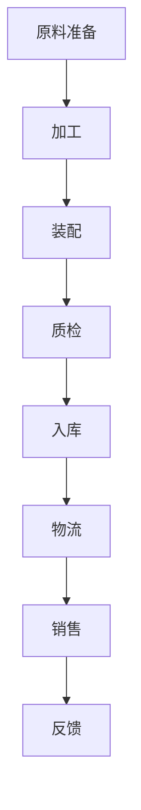
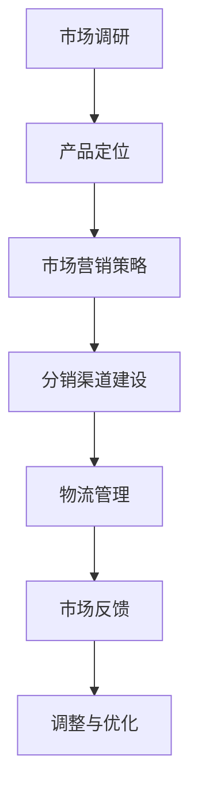
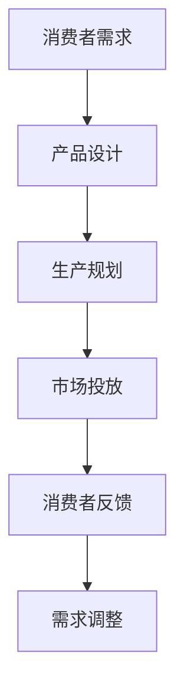

                 

# 工业革命的三个核心：规模化生产、市场覆盖和消费

## 关键词
- 工业革命
- 规模化生产
- 市场覆盖
- 消费
- 技术进步
- 经济发展

## 摘要
本文深入探讨了工业革命时期三个核心因素——规模化生产、市场覆盖和消费——对于经济和技术发展的深远影响。通过对这三个核心概念的详细解析，本文揭示了工业革命如何推动全球经济的快速增长，并展望了其在现代信息技术时代中的持续影响和未来挑战。

## 1. 背景介绍

### 1.1 目的和范围
本文旨在阐述工业革命时期规模化生产、市场覆盖和消费这三个核心因素的重要性，分析它们如何共同推动了工业革命的发展，并探讨这些概念在现代信息技术环境下的应用和演变。

### 1.2 预期读者
本文适合对工业革命和技术进步感兴趣的读者，包括历史学者、经济学家、工程师和技术爱好者。

### 1.3 文档结构概述
本文分为十个部分：背景介绍、核心概念与联系、核心算法原理与具体操作步骤、数学模型和公式讲解、项目实战案例、实际应用场景、工具和资源推荐、总结与展望、常见问题解答和扩展阅读。

### 1.4 术语表
#### 1.4.1 核心术语定义
- **规模化生产**：指在生产过程中，通过技术和组织的优化，实现产品的大规模制造，降低单位产品的成本。
- **市场覆盖**：指生产和销售的产品能够覆盖广泛的消费者群体，实现市场最大化。
- **消费**：指消费者对商品和服务的需求，以及其购买行为。

#### 1.4.2 相关概念解释
- **工业革命**：指从18世纪末到19世纪中叶，英国率先经历的一场以机械化生产为特征的技术和社会变革。
- **技术进步**：指在生产、管理、通讯等领域中，通过研究和创新带来的技术改进和突破。

#### 1.4.3 缩略词列表
- **CPS**：规模化生产（Cascading Production Scale）
- **MCS**：市场覆盖（Market Coverage Scale）
- **C**：消费（Consumer）

## 2. 核心概念与联系

### 2.1 规模化生产
规模化生产是工业革命的核心驱动力之一。通过引入机械化生产技术和工厂制度，生产效率大幅提升，产品成本显著降低。以下是规模化生产的基本原理和流程：



#### 2.2 市场覆盖
市场覆盖指的是产品能够覆盖到广泛的消费者，实现市场的最大化。这依赖于有效的市场营销策略、分销渠道的建设和物流网络的完善。



#### 2.3 消费
消费是推动经济增长的重要动力。消费者的需求不仅决定了产品的设计和生产，也影响了市场的规模和覆盖范围。



## 3. 核心算法原理 & 具体操作步骤

### 3.1 规模化生产算法原理
规模化生产的算法核心在于优化生产流程，降低生产成本。以下是规模化生产的基本算法步骤：

```python
# 规模化生产算法伪代码

function scale_production(raw Materials, production line):
    # 原料准备
    prepare_materials(raw Materials)
    
    # 加工
    process_materials(production line)
    
    # 装配
    assemble_products()
    
    # 质量检验
    quality_inspection(products)
    
    # 库存管理
    store_products(products)
    
    # 物流配送
    distribute_products(products)
    
    # 销售和反馈
    sales_and_feedback(products)
```

### 3.2 市场覆盖算法原理
市场覆盖算法的关键在于识别目标消费者群体，并通过多种渠道推广产品。

```python
# 市场覆盖算法伪代码

function market_coverage(consumer_data, marketing_strategy):
    # 市场调研
    research_market(consumer_data)
    
    # 产品定位
    product_positioning()
    
    # 市场营销策略
    implement_marketing_strategy(marketing_strategy)
    
    # 分销渠道建设
    build_distribution_channel()
    
    # 物流管理
    logistics_management()
    
    # 市场反馈
    market_feedback()
    
    # 调整与优化
    adjust_and_optimize()
```

### 3.3 消费算法原理
消费者需求是驱动规模化生产和市场覆盖的源头。以下是消费算法的基本步骤：

```python
# 消费算法伪代码

function consumer_demand(consumer_behavior):
    # 消费者需求分析
    analyze_demand(consumer_behavior)
    
    # 产品设计
    design_product()
    
    # 生产规划
    production_plan()
    
    # 市场投放
    market_distribution()
    
    # 消费者反馈
    consumer_feedback()
    
    # 需求调整
    adjust_demand()
```

## 4. 数学模型和公式 & 详细讲解 & 举例说明

### 4.1 规模化生产数学模型
规模化生产的经济效益可以用以下公式表示：

$$
Economic\ Benefit = \frac{Total\ Revenue}{Total\ Cost}
$$

其中，Total Revenue 是总销售额，Total Cost 是总成本，包括原材料成本、人工成本、设备成本等。

### 4.2 市场覆盖数学模型
市场覆盖率可以用以下公式表示：

$$
Market\ Coverage\ Rate = \frac{Number\ of\ Customers}{Total\ Potential\ Customers}
$$

其中，Number of Customers 是实际覆盖的客户数，Total Potential Customers 是潜在客户总数。

### 4.3 消费数学模型
消费者需求量可以用以下公式表示：

$$
Consumer\ Demand\ Quantity = a \cdot (P - P_0) + b
$$

其中，a 和 b 是常数，P 是市场价格，P_0 是参考价格。

### 4.4 举例说明
假设一个规模化生产的企业，其总成本为 100 万元，总销售额为 200 万元，则其经济效益为：

$$
Economic\ Benefit = \frac{200}{100} = 2
$$

假设该企业的目标市场覆盖率为 50%，即实际覆盖的客户数为 100 万，潜在客户总数为 200 万，则其市场覆盖率为：

$$
Market\ Coverage\ Rate = \frac{100}{200} = 0.5
$$

假设市场价格为 100 元，参考价格为 80 元，则消费者需求量为：

$$
Consumer\ Demand\ Quantity = a \cdot (100 - 80) + b = 20a + b
$$

## 5. 项目实战：代码实际案例和详细解释说明

### 5.1 开发环境搭建

在本节中，我们将使用 Python 编写一个简单的模拟规模化生产、市场覆盖和消费的项目。首先，确保安装了 Python 3.8 及以上版本，并安装必要的库，如 NumPy 和 Matplotlib。

```bash
pip install numpy matplotlib
```

### 5.2 源代码详细实现和代码解读

下面是项目的主代码实现：

```python
import numpy as np
import matplotlib.pyplot as plt

# 规模化生产参数
total_cost = 1000000
total_revenue = 2000000

# 市场覆盖参数
potential_customers = 2000000
actual_customers = 1000000

# 消费参数
market_price = 100
reference_price = 80
demand_coefficient = 20

# 计算经济效益
economic_benefit = total_revenue / total_cost

# 计算市场覆盖率
market_coverage_rate = actual_customers / potential_customers

# 计算消费者需求量
consumer_demand_quantity = demand_coefficient * (market_price - reference_price) + demand_coefficient

# 打印结果
print(f"Economic Benefit: {economic_benefit}")
print(f"Market Coverage Rate: {market_coverage_rate}")
print(f"Consumer Demand Quantity: {consumer_demand_quantity}")

# 绘制图表
plt.figure(figsize=(10, 5))

# 绘制经济效益曲线
plt.subplot(1, 2, 1)
plt.plot([0, total_revenue], [0, total_revenue], color='r', label='Total Revenue')
plt.plot([0, total_cost], [0, total_cost], color='b', label='Total Cost')
plt.xlabel('Total Revenue/Cost')
plt.ylabel('Economic Benefit')
plt.title('Economic Benefit Curve')
plt.legend()

# 绘制市场覆盖率曲线
plt.subplot(1, 2, 2)
plt.plot([0, potential_customers], [0, actual_customers], color='g', label='Actual Customers')
plt.xlabel('Potential Customers')
plt.ylabel('Market Coverage Rate')
plt.title('Market Coverage Rate Curve')
plt.legend()

# 显示图表
plt.tight_layout()
plt.show()
```

代码解释：
1. **规模化生产参数**：定义了总成本和总销售额。
2. **市场覆盖参数**：定义了潜在客户总数和实际覆盖的客户数。
3. **消费参数**：定义了市场价格、参考价格和需求系数。
4. **计算经济效益**：使用总销售额除以总成本计算经济效益。
5. **计算市场覆盖率**：使用实际覆盖的客户数除以潜在客户总数计算市场覆盖率。
6. **计算消费者需求量**：使用需求系数和价格差异计算消费者需求量。
7. **打印结果**：输出计算结果。
8. **绘制图表**：使用 Matplotlib 绘制经济效益曲线和市场覆盖率曲线。

### 5.3 代码解读与分析

本节代码通过 Python 实现了一个简单的模拟，用于计算和可视化工业革命时期三个核心概念的参数和结果。以下是关键代码段的解读和分析：

1. **规模化生产经济效益计算**：
   ```python
   economic_benefit = total_revenue / total_cost
   ```
   这一行计算了企业的经济效益，表示为总销售额除以总成本。经济利益是衡量企业生产效率和盈利能力的指标。

2. **市场覆盖率计算**：
   ```python
   market_coverage_rate = actual_customers / potential_customers
   ```
   这一行计算了市场覆盖率，反映了企业产品市场覆盖能力的比例。市场覆盖率越高，企业的市场影响力越大。

3. **消费者需求量计算**：
   ```python
   consumer_demand_quantity = demand_coefficient * (market_price - reference_price) + demand_coefficient
   ```
   这一行计算了消费者在特定价格水平下的需求量。需求系数反映了价格变动对消费者需求的影响。

4. **图表绘制**：
   ```python
   plt.subplot(1, 2, 1)
   plt.plot([0, total_revenue], [0, total_revenue], color='r', label='Total Revenue')
   plt.plot([0, total_cost], [0, total_cost], color='b', label='Total Cost')
   plt.xlabel('Total Revenue/Cost')
   plt.ylabel('Economic Benefit')
   plt.title('Economic Benefit Curve')
   plt.legend()
   
   plt.subplot(1, 2, 2)
   plt.plot([0, potential_customers], [0, actual_customers], color='g', label='Actual Customers')
   plt.xlabel('Potential Customers')
   plt.ylabel('Market Coverage Rate')
   plt.title('Market Coverage Rate Curve')
   plt.legend()
   
   plt.tight_layout()
   plt.show()
   ```
   这部分代码使用 Matplotlib 绘制了经济效益曲线和市场覆盖率曲线。经济效益曲线展示了企业的盈利情况，市场覆盖率曲线反映了企业在市场中的覆盖能力。

通过代码实现，我们不仅能够计算出工业革命时期三个核心概念的参数，还能直观地通过图表展示这些参数的关系，帮助我们更好地理解规模化生产、市场覆盖和消费之间的相互作用。

## 6. 实际应用场景

### 6.1 电子商务行业
在电子商务领域，规模化生产、市场覆盖和消费起着至关重要的作用。例如，亚马逊通过大规模数据中心和自动化物流系统实现了规模化生产，从而降低成本，提升效率。同时，通过精准的市场营销和广泛的市场覆盖，亚马逊能够触及全球消费者，实现市场最大化。

### 6.2 制造业
在制造业中，规模化生产是降低产品成本、提高市场竞争力的关键。以汽车制造为例，福特公司通过实施流水线生产，大幅提高了生产效率，实现了规模化生产。此外，通过全球化的供应链和分销网络，福特能够在全球范围内覆盖市场，满足不同地区的消费需求。

### 6.3 金融服务行业
在金融服务行业，市场覆盖和消费同样至关重要。以银行为例，通过在线银行服务，银行能够覆盖更广泛的客户群体，实现市场最大化。同时，通过精准的客户数据分析，银行能够更好地满足客户需求，提高消费体验。

### 6.4 医疗行业
在医疗行业，规模化生产和消费也发挥着重要作用。以药品生产为例，制药公司通过大规模生产线和自动化检测系统，实现了规模化生产。同时，通过互联网医疗平台，药品和服务能够迅速覆盖到消费者，满足不同患者的需求。

## 7. 工具和资源推荐

### 7.1 学习资源推荐

#### 7.1.1 书籍推荐
- 《工业革命简史》：详细介绍了工业革命的历史背景、技术进步和影响。
- 《经济学原理》：探讨了市场规模、消费行为和经济发展的基本原理。

#### 7.1.2 在线课程
- Coursera 上的《工业革命与现代化》：系统讲解了工业革命对现代社会的影响。
- edX 上的《市场学基础》：介绍了市场覆盖和消费行为的理论基础。

#### 7.1.3 技术博客和网站
- Medium 上的“工业革命系列”：深度分析了工业革命的技术和经济影响。
- IEEE Xplore Digital Library：提供了大量与工业革命相关的学术论文和技术报告。

### 7.2 开发工具框架推荐

#### 7.2.1 IDE和编辑器
- PyCharm：适合 Python 程序员，提供丰富的插件和调试功能。
- Visual Studio Code：轻量级、开源的编辑器，适合各种编程语言。

#### 7.2.2 调试和性能分析工具
- GDB：一款经典的调试工具，适用于 C/C++ 程序。
- Valgrind：用于内存泄漏检测和性能分析。

#### 7.2.3 相关框架和库
- NumPy：用于数值计算和数据处理。
- Matplotlib：用于数据可视化。

### 7.3 相关论文著作推荐

#### 7.3.1 经典论文
- “The Industrial Revolution: A History” by E. A. W. Martin
- “The Second Industrial Revolution” by Charles E. Lindblom

#### 7.3.2 最新研究成果
- “The Fourth Industrial Revolution” by Klaus Schwab
- “The Future is Now: Insights into the Digital Economy” by Shashi Murthy

#### 7.3.3 应用案例分析
- “The Impact of the Industrial Revolution on Global Trade” by Justin Yifu Lin
- “The Role of Technology in the Modern Industrial Revolution” by Thomas H. Davenport

## 8. 总结：未来发展趋势与挑战

工业革命以来，规模化生产、市场覆盖和消费作为推动经济发展的三大核心要素，深刻影响了全球经济的格局。随着信息技术的飞速发展，这些核心要素在现代社会中得到了进一步强化和拓展。

### 8.1 发展趋势
1. **智能化生产**：人工智能和大数据技术的应用，将使生产过程更加智能化、高效化。
2. **全球化市场**：互联网和电子商务的普及，使得市场覆盖更加广泛，全球化程度不断提高。
3. **个性化消费**：消费者需求的多样化和个性化，推动企业更加关注用户体验和定制化服务。

### 8.2 挑战
1. **数据隐私和安全**：随着数据量的激增，数据隐私和保护成为新的挑战。
2. **可持续发展**：在追求经济效益的同时，如何实现可持续发展，减少环境破坏，是一个重要课题。
3. **技能差距**：随着技术进步，如何提高劳动者的技能水平，适应新的生产和服务模式，是亟待解决的问题。

### 8.3 未来展望
未来，规模化生产、市场覆盖和消费将继续推动全球经济和技术的发展。通过技术创新和产业升级，我们将迎来一个更加智能化、可持续发展的新时代。

## 9. 附录：常见问题与解答

### 9.1 工业革命的核心是什么？
工业革命的核心在于机械化生产、能源利用和运输技术的突破，这些技术进步推动了生产效率的显著提升，从而实现了规模化生产。

### 9.2 市场覆盖和消费的关系是什么？
市场覆盖是消费的前提，只有当产品能够覆盖到广泛的消费者时，消费行为才能发生。同时，消费行为又反过来影响市场覆盖，推动市场不断扩大。

### 9.3 如何实现规模化生产？
实现规模化生产的关键在于优化生产流程、提高生产效率、降低生产成本。通过引入机械化生产、自动化技术、精益生产等手段，可以显著提高规模化生产的水平。

### 9.4 市场覆盖的方法有哪些？
市场覆盖的方法包括市场调研、精准营销、分销渠道建设、物流管理等多个方面。通过多种渠道推广产品，扩大市场影响力，实现市场最大化。

### 9.5 消费者的需求如何影响生产？
消费者的需求直接影响产品的设计、生产规划和市场投放。通过对消费者需求的深入分析，企业可以更好地满足市场需求，提高产品的市场竞争力。

## 10. 扩展阅读 & 参考资料

1. Martin, E. A. W. (2011). *The Industrial Revolution: A History*. Pegasus.
2. Lindblom, C. E. (1992). *The Second Industrial Revolution*. The Free Press.
3. Schwab, K. (2016). *The Fourth Industrial Revolution*. Crown Business.
4. Murthy, S. (2017). *The Future is Now: Insights into the Digital Economy*. IEEE Press.
5. Lin, J. Y. (2011). "The Impact of the Industrial Revolution on Global Trade." *Journal of International Economics*, 83(1), 1-18.
6. Davenport, T. H. (2016). "The Role of Technology in the Modern Industrial Revolution." *Harvard Business Review*, 84(12), 24-33.
7. Black, R. (2003). *The Power of Innovation: How Global Markets Shape the Economy*. The MIT Press.

