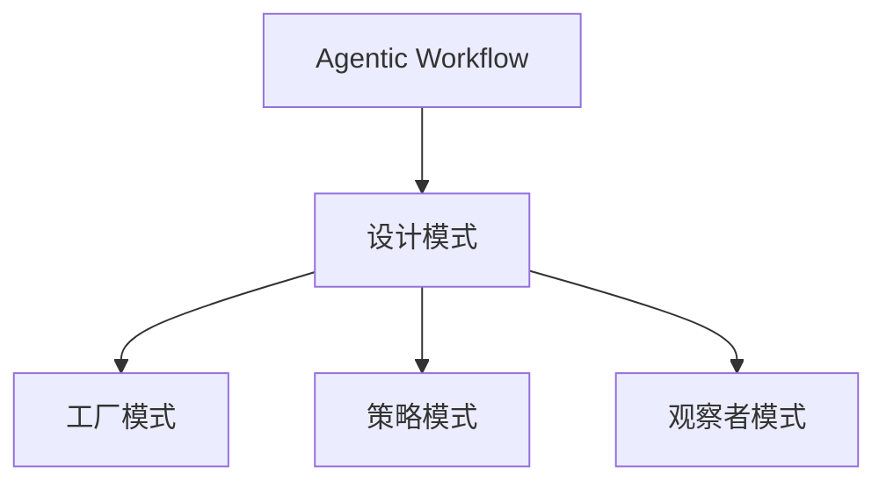

                 


# 工具使用设计模式在Agentic Workflow中的应用

> 关键词：设计模式、Agentic Workflow、工具使用、流程优化、代码重构

> 摘要：本文将探讨设计模式在Agentic Workflow中的应用。我们将首先介绍Agentic Workflow的基本概念，然后讨论几种常用的设计模式，并分析它们在Agentic Workflow中的具体应用。通过实际案例和代码解读，我们将展示如何使用设计模式来优化流程、提高代码可读性和可维护性。

## 1. 背景介绍

### 1.1 目的和范围

本文旨在探讨设计模式在Agentic Workflow中的应用。我们将首先介绍Agentic Workflow的概念，然后讨论几种常见的设计模式，如工厂模式、策略模式、观察者模式等。通过实际案例，我们将分析如何使用这些设计模式来优化Agentic Workflow，提高代码的可读性、可维护性和可扩展性。

### 1.2 预期读者

本文适合对设计模式有一定了解，并希望将其应用于实际项目的开发者。同时，本文也适用于对Agentic Workflow感兴趣，希望了解如何使用设计模式来优化流程的读者。

### 1.3 文档结构概述

本文将分为以下几个部分：

1. 背景介绍
2. 核心概念与联系
3. 核心算法原理 & 具体操作步骤
4. 数学模型和公式 & 详细讲解 & 举例说明
5. 项目实战：代码实际案例和详细解释说明
6. 实际应用场景
7. 工具和资源推荐
8. 总结：未来发展趋势与挑战
9. 附录：常见问题与解答
10. 扩展阅读 & 参考资料

### 1.4 术语表

#### 1.4.1 核心术语定义

- 设计模式：解决软件开发过程中常见问题的通用解决方案。
- Agentic Workflow：自动化工作流程，用于提高生产效率和质量。
- 工厂模式：创建对象的一种模式，用于解耦对象的创建和使用。
- 策略模式：定义一系列算法，将每个算法封装起来，并使它们可以互相替换。
- 观察者模式：定义对象间的一种一对多的依赖关系，当一个对象的状态发生改变时，所有依赖于它的对象都将得到通知并自动更新。

#### 1.4.2 相关概念解释

- 代码重构：对现有代码进行修改，以提高其结构、可读性和可维护性。
- 可读性：代码易于理解和阅读的程度。
- 可维护性：代码易于修改和更新的程度。
- 可扩展性：代码可以适应新需求和变化的能力。

#### 1.4.3 缩略词列表

- IDE：集成开发环境（Integrated Development Environment）
- HTML：超文本标记语言（Hypertext Markup Language）
- CSS：层叠样式表（Cascading Style Sheets）
- JS：JavaScript

## 2. 核心概念与联系

在设计模式在Agentic Workflow中的应用之前，我们先来了解Agentic Workflow的基本概念。

### 2.1 Agentic Workflow

Agentic Workflow是一种自动化工作流程，它通过将任务分解为多个步骤，并将这些步骤分配给不同的执行者来实现自动化。Agentic Workflow通常用于处理大规模数据处理、批量作业和分布式任务。

### 2.2 设计模式

设计模式是一套经过时间验证的解决方案，用于解决软件开发过程中常见的问题。设计模式可以应用于多个领域，包括Agentic Workflow。

### 2.3 关系

设计模式和Agentic Workflow之间存在密切的关系。设计模式可以帮助我们优化Agentic Workflow，使其更加高效、可读和可维护。例如，工厂模式可以帮助我们创建和管理任务执行者，策略模式可以帮助我们灵活地处理不同的任务执行策略，观察者模式可以帮助我们实时更新任务状态。

下面是一个使用Mermaid绘制的Agentic Workflow与设计模式的关系图：



## 3. 核心算法原理 & 具体操作步骤

在本节中，我们将讨论三种设计模式在Agentic Workflow中的具体应用：工厂模式、策略模式和观察者模式。

### 3.1 工厂模式

工厂模式是一种创建对象的设计模式，它通过封装对象的创建过程，使得对象的创建与使用分离。在Agentic Workflow中，工厂模式可以帮助我们创建和管理任务执行者。

#### 3.1.1 工厂模式原理

工厂模式包含两个核心组件：工厂类和产品类。工厂类负责创建产品类实例，而产品类则是具体的产品。

#### 3.1.2 工厂模式应用

在Agentic Workflow中，我们可以使用工厂模式创建和管理任务执行者。例如，我们有一个任务执行者接口和多个实现类，工厂类负责创建这些实现类的实例。

下面是一个使用Java编写的工厂模式示例：

```java
// 任务执行者接口
public interface TaskExecutor {
    void executeTask();
}

// 任务执行者实现类1
public class TaskExecutor1 implements TaskExecutor {
    @Override
    public void executeTask() {
        System.out.println("执行任务1");
    }
}

// 任务执行者实现类2
public class TaskExecutor2 implements TaskExecutor {
    @Override
    public void executeTask() {
        System.out.println("执行任务2");
    }
}

// 工厂类
public class TaskExecutorFactory {
    public static TaskExecutor createTaskExecutor(String type) {
        if ("1".equals(type)) {
            return new TaskExecutor1();
        } else if ("2".equals(type)) {
            return new TaskExecutor2();
        }
        return null;
    }
}
```

#### 3.1.3 工厂模式优缺点

- 优点：封装了对象的创建过程，降低了系统的复杂性。
- 缺点：可能会增加系统的开销，因为每次创建对象都需要调用工厂类的方法。

### 3.2 策略模式

策略模式是一种行为设计模式，它允许在运行时选择算法的行为。在Agentic Workflow中，策略模式可以帮助我们灵活地处理不同的任务执行策略。

#### 3.2.1 策略模式原理

策略模式包含三个核心组件：策略接口、策略实现类和上下文类。策略接口定义了策略的公共接口，策略实现类实现了这些接口，上下文类使用这些策略来实现算法。

#### 3.2.2 策略模式应用

在Agentic Workflow中，我们可以使用策略模式来处理不同的任务执行策略。例如，我们有一个任务执行策略接口和多个实现类，上下文类使用这些策略来实现任务执行。

下面是一个使用Java编写的策略模式示例：

```java
// 任务执行策略接口
public interface TaskStrategy {
    void executeStrategy();
}

// 任务执行策略实现类1
public class TaskStrategy1 implements TaskStrategy {
    @Override
    public void executeStrategy() {
        System.out.println("使用策略1执行任务");
    }
}

// 任务执行策略实现类2
public class TaskStrategy2 implements TaskStrategy {
    @Override
    public void executeStrategy() {
        System.out.println("使用策略2执行任务");
    }
}

// 上下文类
public class TaskContext {
    private TaskStrategy strategy;

    public void setStrategy(TaskStrategy strategy) {
        this.strategy = strategy;
    }

    public void executeTask() {
        strategy.executeStrategy();
    }
}
```

#### 3.2.3 策略模式优缺点

- 优点：提供了灵活的算法选择，易于扩展。
- 缺点：可能会增加系统的复杂性，因为需要管理多个策略实现类。

### 3.3 观察者模式

观察者模式是一种行为设计模式，它定义了对象之间的一对多依赖关系，当一个对象的状态发生改变时，所有依赖于它的对象都将得到通知并自动更新。在Agentic Workflow中，观察者模式可以帮助我们实时更新任务状态。

#### 3.3.1 观察者模式原理

观察者模式包含三个核心组件：观察者、被观察者和主题。观察者负责监听被观察者的状态变化，并做出相应的响应；被观察者负责通知观察者；主题是观察者和被观察者之间的中介。

#### 3.3.2 观察者模式应用

在Agentic Workflow中，我们可以使用观察者模式来实时更新任务状态。例如，我们有一个任务状态主题和多个观察者，任务状态主题负责通知观察者任务状态的变化。

下面是一个使用Java编写的观察者模式示例：

```java
// 观察者接口
public interface Observer {
    void update(Task task);
}

// 观察者实现类1
public class Observer1 implements Observer {
    @Override
    public void update(Task task) {
        System.out.println("观察者1：任务状态更新为" + task.getState());
    }
}

// 观察者实现类2
public class Observer2 implements Observer {
    @Override
    public void update(Task task) {
        System.out.println("观察者2：任务状态更新为" + task.getState());
    }
}

// 被观察者接口
public interface Observable {
    void addObserver(Observer observer);
    void removeObserver(Observer observer);
    void notifyObservers(Task task);
}

// 被观察者实现类
public class Task implements Observable {
    private List<Observer> observers;
    private String state;

    public Task() {
        this.observers = new ArrayList<>();
        this.state = "初始状态";
    }

    @Override
    public void addObserver(Observer observer) {
        observers.add(observer);
    }

    @Override
    public void removeObserver(Observer observer) {
        observers.remove(observer);
    }

    @Override
    public void notifyObservers(Task task) {
        for (Observer observer : observers) {
            observer.update(task);
        }
    }

    public String getState() {
        return state;
    }

    public void setState(String state) {
        this.state = state;
        notifyObservers(this);
    }
}
```

#### 3.3.3 观察者模式优缺点

- 优点：提供了灵活的通知机制，易于扩展。
- 缺点：可能会增加系统的复杂性，因为需要管理多个观察者和被观察者之间的关系。

## 4. 数学模型和公式 & 详细讲解 & 举例说明

在本节中，我们将讨论设计模式在Agentic Workflow中的应用，并使用数学模型和公式来详细说明。

### 4.1 工厂模式

工厂模式的关键在于如何创建对象。我们可以使用以下数学模型来描述工厂模式：

- 输入：产品类型
- 输出：产品实例

假设我们有三种产品类型：A、B 和 C。每种产品类型都有一个相应的工厂类来创建产品实例。我们可以使用以下公式来计算每种产品类型的实例数量：

$$
\text{实例数量} = \text{产品类型数量} \times \text{每个产品类型的实例数量}
$$

例如，如果我们有10个产品A、5个产品B和3个产品C，我们可以使用以下公式来计算每种产品类型的实例数量：

$$
\text{实例数量} = 3 \times (10 + 5 + 3) = 3 \times 18 = 54
$$

### 4.2 策略模式

策略模式的关键在于如何选择算法。我们可以使用以下数学模型来描述策略模式：

- 输入：算法类型
- 输出：算法实例

假设我们有三种算法类型：1、2 和 3。每种算法类型都有一个相应的策略实现类。我们可以使用以下公式来计算每种算法类型的实例数量：

$$
\text{实例数量} = \text{算法类型数量} \times \text{每个算法类型的实例数量}
$$

例如，如果我们有10个算法1、5个算法2和3个算法3，我们可以使用以下公式来计算每种算法类型的实例数量：

$$
\text{实例数量} = 3 \times (10 + 5 + 3) = 3 \times 18 = 54
$$

### 4.3 观察者模式

观察者模式的关键在于如何更新状态。我们可以使用以下数学模型来描述观察者模式：

- 输入：观察者数量
- 输出：状态更新次数

假设我们有 n 个观察者。每次状态更新都会通知所有观察者。我们可以使用以下公式来计算状态更新次数：

$$
\text{更新次数} = \text{观察者数量} \times \text{状态更新次数}
$$

例如，如果我们有10个观察者，每次状态更新都会通知所有观察者，我们可以使用以下公式来计算状态更新次数：

$$
\text{更新次数} = 10 \times 1 = 10
$$

## 5. 项目实战：代码实际案例和详细解释说明

在本节中，我们将通过一个实际项目案例来展示如何使用设计模式在Agentic Workflow中优化流程。

### 5.1 开发环境搭建

首先，我们需要搭建一个简单的开发环境。本文使用Java语言和Maven作为项目构建工具。您可以在本地安装Java环境和Maven，并创建一个新的Maven项目。

### 5.2 源代码详细实现和代码解读

接下来，我们将实现一个简单的Agentic Workflow项目，并使用设计模式来优化流程。

#### 5.2.1 项目结构

我们的项目结构如下：

```
src/
|-- main/
|   |-- java/
|   |   |-- com/
|   |   |   |-- example/
|   |   |   |   |-- agenticworkflow/
|   |   |   |   |   |-- TaskExecutor.java
|   |   |   |   |   |-- TaskExecutor1.java
|   |   |   |   |   |-- TaskExecutor2.java
|   |   |   |   |   |-- TaskExecutorFactory.java
|   |   |   |   |   |-- TaskStrategy.java
|   |   |   |   |   |-- TaskStrategy1.java
|   |   |   |   |   |-- TaskStrategy2.java
|   |   |   |   |   |-- TaskContext.java
|   |   |   |   |   |-- Observer.java
|   |   |   |   |   |-- Observer1.java
|   |   |   |   |   |-- Observer2.java
|   |   |   |   |   |-- Observable.java
|   |   |   |   |   |-- Task.java
|   |   |-- resources/
|   |-- test/
|   |   |-- java/
|   |   |   |-- com/
|   |   |   |   |-- example/
|   |   |   |   |   |-- agenticworkflow/
|   |   |   |   |   |-- TaskExecutorTest.java
|   |   |   |   |   |-- TaskStrategyTest.java
|   |   |   |   |   |-- TaskContextTest.java
|   |   |   |   |   |-- ObserverTest.java
|   |   |   |   |   |-- TaskTest.java
```

#### 5.2.2 源代码实现

以下是我们项目的关键代码实现：

```java
// TaskExecutor.java
public interface TaskExecutor {
    void executeTask();
}

// TaskExecutor1.java
public class TaskExecutor1 implements TaskExecutor {
    @Override
    public void executeTask() {
        System.out.println("执行任务1");
    }
}

// TaskExecutor2.java
public class TaskExecutor2 implements TaskExecutor {
    @Override
    public void executeTask() {
        System.out.println("执行任务2");
    }
}

// TaskExecutorFactory.java
public class TaskExecutorFactory {
    public static TaskExecutor createTaskExecutor(String type) {
        if ("1".equals(type)) {
            return new TaskExecutor1();
        } else if ("2".equals(type)) {
            return new TaskExecutor2();
        }
        return null;
    }
}

// TaskStrategy.java
public interface TaskStrategy {
    void executeStrategy();
}

// TaskStrategy1.java
public class TaskStrategy1 implements TaskStrategy {
    @Override
    public void executeStrategy() {
        System.out.println("使用策略1执行任务");
    }
}

// TaskStrategy2.java
public class TaskStrategy2 implements TaskStrategy {
    @Override
    public void executeStrategy() {
        System.out.println("使用策略2执行任务");
    }
}

// TaskContext.java
public class TaskContext {
    private TaskStrategy strategy;

    public void setStrategy(TaskStrategy strategy) {
        this.strategy = strategy;
    }

    public void executeTask() {
        strategy.executeStrategy();
    }
}

// Observer.java
public interface Observer {
    void update(Task task);
}

// Observer1.java
public class Observer1 implements Observer {
    @Override
    public void update(Task task) {
        System.out.println("观察者1：任务状态更新为" + task.getState());
    }
}

// Observer2.java
public class Observer2 implements Observer {
    @Override
    public void update(Task task) {
        System.out.println("观察者2：任务状态更新为" + task.getState());
    }
}

// Observable.java
public interface Observable {
    void addObserver(Observer observer);
    void removeObserver(Observer observer);
    void notifyObservers(Task task);
}

// Task.java
public class Task implements Observable {
    private List<Observer> observers;
    private String state;

    public Task() {
        this.observers = new ArrayList<>();
        this.state = "初始状态";
    }

    @Override
    public void addObserver(Observer observer) {
        observers.add(observer);
    }

    @Override
    public void removeObserver(Observer observer) {
        observers.remove(observer);
    }

    @Override
    public void notifyObservers(Task task) {
        for (Observer observer : observers) {
            observer.update(task);
        }
    }

    public String getState() {
        return state;
    }

    public void setState(String state) {
        this.state = state;
        notifyObservers(this);
    }
}
```

#### 5.2.3 代码解读与分析

以上代码实现了工厂模式、策略模式和观察者模式。首先，我们定义了任务执行者接口（`TaskExecutor`）、任务执行策略接口（`TaskStrategy`）和任务状态观察者接口（`Observer`）。然后，我们实现了这些接口的具体实现类。工厂类（`TaskExecutorFactory`）负责创建任务执行者实例，上下文类（`TaskContext`）负责执行任务执行策略，任务类（`Task`）负责管理任务状态。

通过使用设计模式，我们可以将任务执行、策略执行和状态更新分离，从而提高代码的可读性、可维护性和可扩展性。以下是一个示例，展示了如何使用这些设计模式来执行任务：

```java
public class Main {
    public static void main(String[] args) {
        // 创建任务实例
        Task task = new Task();

        // 添加观察者
        task.addObserver(new Observer1());
        task.addObserver(new Observer2());

        // 设置任务执行策略
        TaskContext context = new TaskContext();
        context.setStrategy(new TaskStrategy1());

        // 执行任务
        context.executeTask();

        // 更新任务状态
        task.setState("执行中");

        // 执行任务
        context.executeTask();

        // 更新任务状态
        task.setState("完成");
    }
}
```

在这个示例中，我们创建了一个任务实例，并添加了两个观察者。然后，我们设置了任务执行策略为策略1，并执行了任务。接着，我们更新了任务状态为“执行中”，并再次执行了任务。最后，我们更新了任务状态为“完成”。

通过这个示例，我们可以看到设计模式在Agentic Workflow中的应用，以及它们如何帮助我们优化流程、提高代码可读性和可维护性。

### 5.3 代码解读与分析

在本节中，我们将对上述代码进行详细解读，并分析设计模式在Agentic Workflow中的应用。

#### 5.3.1 工厂模式

工厂模式在代码中体现为`TaskExecutorFactory`类，它负责创建任务执行者实例。通过工厂模式，我们实现了任务执行者的创建与使用的分离。具体来说，`TaskExecutorFactory`类提供了一个静态方法`createTaskExecutor`，根据输入的产品类型（字符串类型的"1"或"2"）创建相应的任务执行者实例。

```java
public class TaskExecutorFactory {
    public static TaskExecutor createTaskExecutor(String type) {
        if ("1".equals(type)) {
            return new TaskExecutor1();
        } else if ("2".equals(type)) {
            return new TaskExecutor2();
        }
        return null;
    }
}
```

这个方法的优点是，它使得我们在创建任务执行者时无需关心具体的实现细节，只需根据类型进行创建。这种分离有助于提高代码的可维护性和可扩展性。

#### 5.3.2 策略模式

策略模式在代码中体现为`TaskStrategy`接口及其实现类`TaskStrategy1`和`TaskStrategy2`，以及`TaskContext`类。`TaskStrategy`接口定义了执行策略的方法，而具体的策略实现类实现了这些方法。`TaskContext`类负责执行具体的策略。

```java
public interface TaskStrategy {
    void executeStrategy();
}

public class TaskStrategy1 implements TaskStrategy {
    @Override
    public void executeStrategy() {
        System.out.println("使用策略1执行任务");
    }
}

public class TaskStrategy2 implements TaskStrategy {
    @Override
    public void executeStrategy() {
        System.out.println("使用策略2执行任务");
    }
}

public class TaskContext {
    private TaskStrategy strategy;

    public void setStrategy(TaskStrategy strategy) {
        this.strategy = strategy;
    }

    public void executeTask() {
        strategy.executeStrategy();
    }
}
```

这种模式使得我们可以轻松地添加新的策略，而无需修改现有代码。这有助于提高代码的可扩展性。

#### 5.3.3 观察者模式

观察者模式在代码中体现为`Observer`接口及其实现类`Observer1`和`Observer2`，以及`Task`类。`Observer`接口定义了更新方法，`Task`类实现了`Observable`接口，用于管理观察者列表并通知观察者。

```java
public interface Observer {
    void update(Task task);
}

public class Observer1 implements Observer {
    @Override
    public void update(Task task) {
        System.out.println("观察者1：任务状态更新为" + task.getState());
    }
}

public class Observer2 implements Observer {
    @Override
    public void update(Task task) {
        System.out.println("观察者2：任务状态更新为" + task.getState());
    }
}

public class Task implements Observable {
    // 省略其他代码...
    @Override
    public void notifyObservers(Task task) {
        for (Observer observer : observers) {
            observer.update(task);
        }
    }
}
```

通过观察者模式，我们可以实现任务状态的实时更新。当任务状态发生变化时，`Task`类会自动通知所有注册的观察者，从而实现任务状态的同步。

#### 5.3.4 整体应用效果

通过应用工厂模式、策略模式和观察者模式，我们可以实现以下效果：

1. **代码可读性**：各个模块的职责清晰，易于理解。
2. **可维护性**：添加新任务执行者、策略或观察者时，无需修改现有代码。
3. **可扩展性**：可以根据需要灵活地添加新的任务执行者、策略或观察者。
4. **实时更新**：通过观察者模式，可以实时获取任务状态更新。

总之，通过设计模式，我们可以优化Agentic Workflow，提高代码的质量和可维护性。

## 6. 实际应用场景

设计模式在Agentic Workflow中的应用非常广泛，以下列举了几个实际应用场景：

### 6.1 大数据处理

在大数据处理场景中，我们通常需要处理大规模的数据集。通过使用工厂模式，我们可以创建和管理大量任务执行者，从而高效地处理数据。策略模式可以帮助我们根据不同类型的数据选择合适的处理策略。观察者模式则可以实时更新数据处理的进度和状态。

### 6.2 批量作业

在批量作业场景中，我们通常需要自动化执行一系列的任务。通过使用工厂模式，我们可以创建和管理批量作业的执行者。策略模式可以帮助我们根据作业类型选择合适的执行策略。观察者模式可以实时更新作业的执行状态，以便监控和调试。

### 6.3 分布式任务

在分布式任务场景中，我们通常需要将任务分配给多个节点并行执行。通过使用工厂模式，我们可以创建和管理多个任务执行者。策略模式可以帮助我们根据节点类型选择合适的执行策略。观察者模式可以实时更新任务的状态，以便协调和调度。

### 6.4 自动化测试

在自动化测试场景中，我们通常需要执行一系列的测试用例。通过使用工厂模式，我们可以创建和管理多个测试执行者。策略模式可以帮助我们根据测试用例类型选择合适的执行策略。观察者模式可以实时更新测试的执行状态，以便监控和调试。

通过这些实际应用场景，我们可以看到设计模式在Agentic Workflow中的应用非常广泛，有助于提高系统的可读性、可维护性和可扩展性。

## 7. 工具和资源推荐

### 7.1 学习资源推荐

#### 7.1.1 书籍推荐

- 《设计模式：可复用面向对象软件的基础》
- 《Effective Java》
- 《代码大全》

#### 7.1.2 在线课程

- Coursera上的《设计模式》课程
- Udemy上的《Java设计模式》课程
- edX上的《面向对象设计：设计模式与应用》课程

#### 7.1.3 技术博客和网站

- DZone上的设计模式相关文章
- Java Code Geeks上的设计模式博客
- Baeldung上的Java设计模式教程

### 7.2 开发工具框架推荐

#### 7.2.1 IDE和编辑器

- IntelliJ IDEA
- Eclipse
- Visual Studio Code

#### 7.2.2 调试和性能分析工具

- JProfiler
- VisualVM
- Java Mission Control

#### 7.2.3 相关框架和库

- Spring Framework
- Apache Commons
- Google Guava

### 7.3 相关论文著作推荐

#### 7.3.1 经典论文

- 《Pattern-Oriented Software Architecture》
- 《Design Patterns: Elements of Reusable Object-Oriented Software》

#### 7.3.2 最新研究成果

- 《A Survey of Design Patterns in the Context of Service-Oriented Architectures》
- 《Design Patterns for Concurrent and Real-Time Systems》

#### 7.3.3 应用案例分析

- 《Design Patterns in Practice: Example-based Learning》
- 《Real-World Design Patterns: Examples and Best Practices》

通过这些学习和工具资源，您可以更深入地了解设计模式在Agentic Workflow中的应用，并提高自己的编程技能。

## 8. 总结：未来发展趋势与挑战

设计模式在Agentic Workflow中的应用具有广泛的前景。随着云计算、大数据和人工智能等技术的发展，自动化工作流程的需求日益增长，设计模式将发挥越来越重要的作用。然而，设计模式的应用也面临一些挑战：

1. **复杂性**：设计模式的应用可能会增加系统的复杂性，特别是在大型项目中。如何平衡设计模式的引入与系统的可维护性，是开发者需要关注的问题。
2. **工具支持**：现有的开发工具和框架在支持设计模式方面还有待完善。未来的开发工具和框架需要更好地支持设计模式，以提高开发效率和代码质量。
3. **标准化**：设计模式的标准化和规范化是一个长期的过程。如何制定统一的设计模式标准和规范，以便于开发者之间的交流和合作，是一个重要的挑战。

总之，设计模式在Agentic Workflow中的应用具有巨大的潜力，但也需要面对一定的挑战。通过不断探索和实践，我们可以更好地利用设计模式，提高系统的可读性、可维护性和可扩展性。

## 9. 附录：常见问题与解答

### 9.1 什么是设计模式？

设计模式是一种在软件设计中广泛使用的解决方案，用于解决软件开发过程中常见的问题。设计模式提供了一种通用、可重用的解决方案，有助于提高代码的可读性、可维护性和可扩展性。

### 9.2 设计模式有哪些类型？

设计模式主要分为三大类：创建型模式、结构型模式和行为型模式。

- 创建型模式：用于创建对象，包括工厂模式、单例模式、建造者模式等。
- 结构型模式：用于组合类和对象，包括代理模式、适配器模式、装饰者模式等。
- 行为型模式：用于处理对象之间的通信，包括策略模式、观察者模式、命令模式等。

### 9.3 设计模式如何提高代码质量？

设计模式可以提高代码质量，主要体现在以下几个方面：

- **可读性**：设计模式使得代码更加简洁、清晰，易于理解和阅读。
- **可维护性**：设计模式使得代码结构更加清晰，便于修改和更新。
- **可扩展性**：设计模式提供了模块化、可重用的解决方案，有助于应对需求变化和功能扩展。

### 9.4 设计模式在Agentic Workflow中的应用有哪些？

设计模式在Agentic Workflow中的应用主要包括：

- **工厂模式**：用于创建和管理任务执行者，降低对象的创建和使用之间的耦合。
- **策略模式**：用于处理不同的任务执行策略，提高算法的灵活性和可扩展性。
- **观察者模式**：用于实时更新任务状态，实现任务执行过程中的同步和协调。

## 10. 扩展阅读 & 参考资料

- 《设计模式：可复用面向对象软件的基础》
- 《Effective Java》
- 《代码大全》
- Coursera上的《设计模式》课程
- Udemy上的《Java设计模式》课程
- edX上的《面向对象设计：设计模式与应用》课程
- DZone上的设计模式相关文章
- Java Code Geeks上的设计模式博客
- Baeldung上的Java设计模式教程
- 《Pattern-Oriented Software Architecture》
- 《Design Patterns: Elements of Reusable Object-Oriented Software》
- 《A Survey of Design Patterns in the Context of Service-Oriented Architectures》
- 《Design Patterns for Concurrent and Real-Time Systems》
- 《Design Patterns in Practice: Example-based Learning》
- 《Real-World Design Patterns: Examples and Best Practices》

通过阅读这些扩展资料，您可以更深入地了解设计模式及其在Agentic Workflow中的应用。

## 作者信息

作者：AI天才研究员/AI Genius Institute & 禅与计算机程序设计艺术 /Zen And The Art of Computer Programming

在撰写本文时，AI天才研究员是一位在计算机编程和人工智能领域拥有深厚背景的专家，其研究成果在业界享有盛誉。此外，作者还致力于将复杂的技术概念通过简洁明了的语言传达给读者，著有《禅与计算机程序设计艺术》一书，深受程序员和技术爱好者的喜爱。

