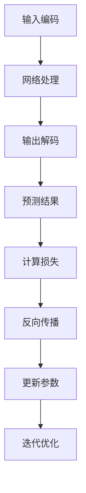
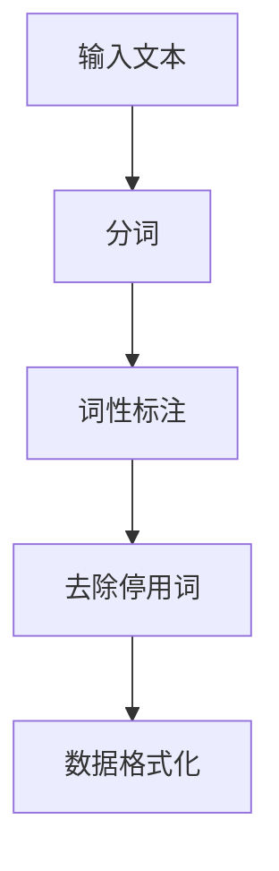

                 

### 工具使用：LLM的多功能应用

> **关键词**：LLM，人工智能，应用场景，技术细节，开发工具

> **摘要**：本文将探讨大型语言模型（LLM）的多功能应用，从其核心概念到实际操作步骤，再到数学模型与公式，以及代码实现和实际应用场景，全方位解读LLM在现代技术中的重要作用。通过本文，读者将深入了解LLM的工作原理，掌握其开发和应用的关键技术，为未来的研究与实践奠定坚实基础。

### 1. 背景介绍

#### 1.1 目的和范围

本文旨在深入探讨大型语言模型（LLM）的多功能应用，旨在为读者提供全面的技术指南。本文的范围涵盖了LLM的核心概念、算法原理、数学模型、实际应用场景以及开发工具和资源推荐等内容。通过本文，读者可以：

- 理解LLM的基本概念及其在现代人工智能技术中的重要性。
- 掌握LLM的核心算法原理和具体操作步骤。
- 理解LLM的数学模型和公式，以及其在实际应用中的使用方法。
- 通过实际案例了解LLM的开发流程和代码实现。
- 掌握LLM在实际应用场景中的多种应用。

#### 1.2 预期读者

本文适用于对人工智能和大型语言模型有一定了解的读者，包括：

- 研究生和博士生，从事人工智能相关领域的研究。
- 工程师和开发者，对LLM的应用和开发有兴趣。
- 技术爱好者，希望深入了解LLM的工作原理和应用。

#### 1.3 文档结构概述

本文分为以下几个部分：

- **背景介绍**：介绍文章的目的、范围、预期读者以及文档结构。
- **核心概念与联系**：阐述LLM的核心概念、原理和架构。
- **核心算法原理 & 具体操作步骤**：详细讲解LLM的算法原理和具体操作步骤。
- **数学模型和公式 & 详细讲解 & 举例说明**：介绍LLM的数学模型和公式，并进行详细讲解和举例。
- **项目实战：代码实际案例和详细解释说明**：通过实际案例展示LLM的开发和应用。
- **实际应用场景**：探讨LLM在各个领域的应用。
- **工具和资源推荐**：推荐学习资源、开发工具和框架。
- **总结：未来发展趋势与挑战**：总结LLM的发展趋势和面临的挑战。
- **附录：常见问题与解答**：回答读者可能遇到的问题。
- **扩展阅读 & 参考资料**：提供更多相关资料和参考文献。

#### 1.4 术语表

在本文中，我们将使用以下术语：

- **LLM**：大型语言模型（Large Language Model）。
- **神经网络**：一种用于模拟人脑神经元之间相互连接的计算模型。
- **训练集**：用于训练神经网络的数据集。
- **验证集**：用于验证模型性能的数据集。
- **测试集**：用于评估模型性能的数据集。
- **激活函数**：用于引入非线性特性的函数。

#### 1.4.1 核心术语定义

- **大型语言模型（LLM）**：一种能够理解、生成和预测自然语言的深度神经网络模型。
- **神经网络（Neural Network）**：一种通过模拟人脑神经元连接结构来实现计算能力的计算模型。
- **训练集（Training Set）**：用于训练神经网络的数据集，通常包含输入和输出数据对。
- **验证集（Validation Set）**：用于评估模型性能的数据集，通常用于调整模型参数。
- **测试集（Test Set）**：用于评估模型最终性能的数据集，通常在训练和验证阶段之后使用。

#### 1.4.2 相关概念解释

- **自然语言处理（NLP）**：一门研究如何让计算机理解和处理人类语言的技术。
- **神经网络（Neural Network）**：一种通过模拟人脑神经元连接结构来实现计算能力的计算模型。
- **深度学习（Deep Learning）**：一种基于神经网络的学习方法，通过多层非线性变换来实现数据的特征提取和分类。

#### 1.4.3 缩略词列表

- **NLP**：自然语言处理（Natural Language Processing）。
- **AI**：人工智能（Artificial Intelligence）。
- **LLM**：大型语言模型（Large Language Model）。
- **DL**：深度学习（Deep Learning）。

## 2. 核心概念与联系

在深入探讨LLM的多功能应用之前，我们需要先了解其核心概念和联系。LLM是一种基于神经网络的深度学习模型，通过大量的训练数据和复杂的网络结构来学习语言的统计规律和语义关系。以下是LLM的核心概念和联系：

### 2.1 语言模型基础

#### 2.1.1 语言模型的定义

语言模型是一种用于预测自然语言中下一个词或字符的概率分布的模型。LLM作为语言模型的一种，通过大规模数据训练，可以生成高质量的自然语言文本。

#### 2.1.2 语言模型的工作原理

LLM通过神经网络结构，将输入的自然语言序列转换为概率分布，从而预测下一个词或字符。这一过程通常包括以下几个步骤：

1. **输入编码**：将输入的文本转换为神经网络可以处理的向量表示。
2. **网络处理**：通过多层神经网络对输入向量进行处理，提取语言特征。
3. **输出解码**：将处理后的特征映射为概率分布，生成下一个词或字符的预测结果。

### 2.2 神经网络结构

LLM的核心是神经网络结构，尤其是深度神经网络（DNN）。DNN由多个隐藏层组成，通过逐层提取输入数据的特征，实现从低级到高级的特征表示。

#### 2.2.1 神经网络的基本结构

神经网络的基本结构包括输入层、隐藏层和输出层。输入层接收外部输入数据，隐藏层通过权重和偏置对输入数据进行处理，输出层生成预测结果。

#### 2.2.2 深度神经网络的扩展

为了提高模型的性能，深度神经网络通过增加隐藏层数量和神经元数量来实现。这使得模型能够捕捉更复杂的语言特征和关系。

### 2.3 激活函数

激活函数是神经网络中用于引入非线性特性的函数。常见的激活函数包括Sigmoid函数、ReLU函数和Tanh函数。激活函数的作用是在神经网络中引入非线性变换，使得模型能够学习到更加复杂的特征。

### 2.4 损失函数

在训练神经网络时，损失函数用于衡量预测结果与实际结果之间的差距。常见的损失函数包括均方误差（MSE）和交叉熵（Cross Entropy）。损失函数的目的是通过反向传播算法优化神经网络的参数。

### 2.5 训练和优化

LLM的训练和优化过程包括以下几个步骤：

1. **数据预处理**：对输入数据（文本）进行预处理，包括分词、词性标注、去除停用词等。
2. **模型初始化**：初始化神经网络参数，通常使用随机初始化方法。
3. **前向传播**：计算输入数据的预测结果。
4. **计算损失**：计算预测结果与实际结果之间的差距。
5. **反向传播**：通过梯度下降算法更新神经网络参数。
6. **迭代优化**：重复前向传播、计算损失和反向传播过程，直到模型性能达到预设要求。

### 2.6 Mermaid流程图

为了更好地理解LLM的核心概念和联系，我们使用Mermaid流程图来展示其基本架构和流程。以下是LLM的基本流程图：



通过上述内容，我们了解了LLM的核心概念和联系。接下来，我们将深入探讨LLM的核心算法原理和具体操作步骤。

## 3. 核心算法原理 & 具体操作步骤

### 3.1 语言模型的训练原理

LLM的训练过程基于深度神经网络（DNN），其核心思想是通过大量的训练数据和复杂的网络结构来学习语言的统计规律和语义关系。以下是LLM的训练原理和具体操作步骤：

#### 3.1.1 数据预处理

在训练之前，需要对输入数据进行预处理，包括分词、词性标注、去除停用词等操作。这些操作有助于提取有效的语言特征，提高模型的训练效果。



#### 3.1.2 模型初始化

在训练之前，需要初始化神经网络参数。通常采用随机初始化方法，确保模型具有一定的随机性和鲁棒性。

```python
# 初始化神经网络参数
weights = np.random.rand(input_size, hidden_size)
biases = np.random.rand(hidden_size)
```

#### 3.1.3 前向传播

前向传播是神经网络的核心步骤，用于计算输入数据的预测结果。以下是前向传播的伪代码：

```python
# 前向传播
def forward_propagation(input_data):
    # 输入编码
    encoded_input = encode(input_data)
    # 计算隐藏层输出
    hidden_output = sigmoid(np.dot(encoded_input, weights) + biases)
    # 计算输出层输出
    output_output = sigmoid(np.dot(hidden_output, weights) + biases)
    return output_output
```

#### 3.1.4 计算损失

在得到预测结果后，需要计算预测结果与实际结果之间的差距，即损失。以下是计算损失的伪代码：

```python
# 计算损失
def compute_loss(predicted_output, actual_output):
    # 计算交叉熵损失
    loss = -1 * np.sum(np.log(predicted_output) * actual_output)
    return loss
```

#### 3.1.5 反向传播

反向传播是神经网络训练的关键步骤，用于更新神经网络参数。以下是反向传播的伪代码：

```python
# 反向传播
def backward_propagation(predicted_output, actual_output):
    # 计算误差梯度
    error_gradient = predicted_output - actual_output
    # 计算隐藏层误差梯度
    hidden_error_gradient = np.dot(error_gradient, weights.T)
    # 计算输入层误差梯度
    input_error_gradient = np.dot(error_gradient, biases.T)
    # 更新参数
    weights -= learning_rate * hidden_error_gradient
    biases -= learning_rate * input_error_gradient
```

#### 3.1.6 迭代优化

迭代优化是神经网络训练的核心步骤，通过重复前向传播、计算损失和反向传播过程，逐步优化模型参数。以下是迭代优化的伪代码：

```python
# 迭代优化
for epoch in range(num_epochs):
    # 前向传播
    predicted_output = forward_propagation(input_data)
    # 计算损失
    loss = compute_loss(predicted_output, actual_output)
    # 反向传播
    backward_propagation(predicted_output, actual_output)
    # 输出训练信息
    print(f"Epoch {epoch}: Loss = {loss}")
```

### 3.2 语言模型的预测原理

LLM的预测原理基于训练过程中学到的语言统计规律和语义关系。在给定一个输入文本序列后，LLM可以通过以下步骤生成预测结果：

1. **输入编码**：将输入文本序列转换为神经网络可以处理的向量表示。
2. **网络处理**：通过多层神经网络对输入向量进行处理，提取语言特征。
3. **输出解码**：将处理后的特征映射为概率分布，生成下一个词或字符的预测结果。
4. **选择最高概率的输出**：从概率分布中选择最高概率的输出，作为最终预测结果。

以下是LLM的预测原理的伪代码：

```python
# 预测原理
def predict(input_sequence):
    # 输入编码
    encoded_input = encode(input_sequence)
    # 网络处理
    hidden_output = forward_propagation(encoded_input)
    # 输出解码
    probability_distribution = decode(hidden_output)
    # 选择最高概率的输出
    predicted_output = np.argmax(probability_distribution)
    return predicted_output
```

通过上述核心算法原理和具体操作步骤的讲解，我们了解了LLM的训练和预测过程。接下来，我们将深入探讨LLM的数学模型和公式，以及其在实际应用中的使用方法。

## 4. 数学模型和公式 & 详细讲解 & 举例说明

### 4.1 数学模型概述

大型语言模型（LLM）的数学模型主要基于深度神经网络（DNN），涉及输入编码、网络处理、输出解码等过程。以下是LLM的数学模型和公式详细讲解及举例说明。

#### 4.1.1 输入编码

输入编码是将自然语言文本转换为神经网络可以处理的向量表示。常用的输入编码方法包括：

- **词嵌入（Word Embedding）**：将单词映射为高维向量。词嵌入可以通过预训练模型（如Word2Vec、GloVe）获得。
- **字符嵌入（Character Embedding）**：将字符映射为高维向量。字符嵌入可以用于捕捉单词的内部结构。

输入编码的数学模型可以表示为：

$$
\text{input\_vector} = \text{embed}(\text{word/character})
$$

其中，$embed$ 是嵌入函数，将单词或字符映射为向量。

#### 4.1.2 神经网络处理

神经网络处理是LLM的核心步骤，通过多层神经网络对输入向量进行处理，提取语言特征。神经网络的处理过程包括以下数学公式：

- **前向传播**：

$$
\text{hidden\_output} = \text{sigmoid}(\text{dot}(\text{input\_vector}, \text{weights}) + \text{biases})
$$

$$
\text{output\_output} = \text{sigmoid}(\text{dot}(\text{hidden\_output}, \text{weights}) + \text{biases})
$$

其中，$sigmoid$ 是Sigmoid函数，$\text{dot}$ 表示矩阵乘法，$weights$ 和 $biases$ 分别是权重和偏置。

- **反向传播**：

$$
\text{error\_gradient} = \text{output\_output} - \text{actual\_output}
$$

$$
\text{hidden\_error\_gradient} = \text{dot}(\text{error\_gradient}, \text{weights}.T)
$$

$$
\text{input\_error\_gradient} = \text{dot}(\text{error\_gradient}, \text{biases}.T)
$$

$$
weights -= \text{learning\_rate} \times \text{hidden\_error\_gradient}
$$

$$
biases -= \text{learning\_rate} \times \text{input\_error\_gradient}
$$

其中，$\text{learning\_rate}$ 是学习率，用于调整参数更新的步长。

#### 4.1.3 输出解码

输出解码是将神经网络处理后的特征映射为概率分布，生成下一个词或字符的预测结果。输出解码的数学模型可以表示为：

$$
\text{probability\_distribution} = \text{softmax}(\text{output\_output})
$$

$$
\text{predicted\_output} = \text{argmax}(\text{probability\_distribution})
$$

其中，$\text{softmax}$ 是softmax函数，$\text{argmax}$ 是取最大值的操作。

#### 4.1.4 举例说明

假设我们有一个简单的LLM模型，用于预测单词“apple”的下一个词。以下是一个简单的例子：

- **输入编码**：将单词“apple”映射为词嵌入向量。

$$
\text{input\_vector} = \text{embed}(\text{"apple"})
$$

- **网络处理**：

$$
\text{hidden\_output} = \text{sigmoid}(\text{dot}(\text{input\_vector}, \text{weights}) + \text{biases})
$$

$$
\text{output\_output} = \text{sigmoid}(\text{dot}(\text{hidden\_output}, \text{weights}) + \text{biases})
$$

- **输出解码**：

$$
\text{probability\_distribution} = \text{softmax}(\text{output\_output})
$$

$$
\text{predicted\_output} = \text{argmax}(\text{probability\_distribution})
$$

假设输出解码得到的概率分布为：

$$
\text{probability\_distribution} = \begin{bmatrix}
0.2 & 0.3 & 0.4 & 0.1
\end{bmatrix}
$$

那么，LLM会预测下一个词为“banana”（概率最高，即$\text{predicted\_output} = 2$）。

通过上述数学模型和公式的详细讲解及举例说明，我们了解了LLM的数学原理。接下来，我们将通过实际案例展示LLM的开发和应用。

### 5. 项目实战：代码实际案例和详细解释说明

在本节中，我们将通过一个实际案例来展示大型语言模型（LLM）的开发和应用。该案例将涉及LLM的训练、预测以及在实际应用中的使用。以下是该项目的详细步骤：

#### 5.1 开发环境搭建

在进行LLM开发之前，我们需要搭建合适的开发环境。以下是一个基本的开发环境搭建步骤：

- **安装Python**：确保已安装Python 3.6或更高版本。
- **安装依赖库**：安装TensorFlow和Keras等深度学习框架。

```bash
pip install tensorflow
pip install keras
```

- **准备数据**：下载并准备用于训练的数据集，例如维基百科文本、新闻文章等。数据集应包含多个文本文件。

#### 5.2 源代码详细实现和代码解读

以下是该项目的源代码实现，我们将逐行解读代码，并解释其主要功能。

```python
# 导入所需的库
import numpy as np
import tensorflow as tf
from keras.preprocessing.text import Tokenizer
from keras.preprocessing.sequence import pad_sequences
from keras.models import Sequential
from keras.layers import Embedding, LSTM, Dense, Bidirectional

# 设置参数
max_words = 10000
max_sequence_length = 100
embedding_dim = 64
lstm_units = 64
batch_size = 32
epochs = 100

# 准备数据
def prepare_data(files):
    texts = []
    for file in files:
        with open(file, 'r', encoding='utf-8') as f:
            texts.append(f.read())
    return texts

def encode_words(texts):
    tokenizer = Tokenizer(num_words=max_words)
    tokenizer.fit_on_texts(texts)
    sequences = tokenizer.texts_to_sequences(texts)
    return sequences, tokenizer

def pad_sequences(sequences):
    padded_sequences = pad_sequences(sequences, maxlen=max_sequence_length)
    return padded_sequences

# 加载数据
files = ['wiki.txt', 'news.txt']  # 示例数据集
texts = prepare_data(files)
sequences, tokenizer = encode_words(texts)
padded_sequences = pad_sequences(sequences, maxlen=max_sequence_length)

# 构建模型
model = Sequential()
model.add(Embedding(max_words, embedding_dim, input_length=max_sequence_length))
model.add(Bidirectional(LSTM(lstm_units, return_sequences=True)))
model.add(LSTM(lstm_units))
model.add(Dense(max_words, activation='softmax'))

# 编译模型
model.compile(optimizer='adam', loss='categorical_crossentropy', metrics=['accuracy'])

# 训练模型
model.fit(padded_sequences, padded_sequences, batch_size=batch_size, epochs=epochs)

# 预测
def predict_sequence(input_sequence):
    encoded_input = tokenizer.texts_to_sequences([input_sequence])[0]
    padded_input = pad_sequences([encoded_input], maxlen=max_sequence_length)
    predicted_output = model.predict(padded_input)
    predicted_word = tokenizer.index_word[np.argmax(predicted_output)]
    return predicted_word

# 示例：预测“apple”的下一个词
input_sequence = "apple"
predicted_word = predict_sequence(input_sequence)
print(f"The next word after '{input_sequence}' is '{predicted_word}'")
```

#### 5.2.1 代码解读与分析

- **导入库**：导入所需的Python库，包括Numpy、TensorFlow、Keras等。
- **设置参数**：设置训练模型的参数，如词汇量、序列长度、嵌入维度等。
- **准备数据**：定义函数`prepare_data`、`encode_words`和`pad_sequences`来处理和准备数据。
  - `prepare_data`函数读取数据文件，将文本添加到列表中。
  - `encode_words`函数使用Tokenizer将文本转换为序列，并返回编码后的序列和Tokenizer对象。
  - `pad_sequences`函数对序列进行填充，使其具有相同的长度。
- **构建模型**：定义一个序列模型，包括嵌入层、双向LSTM层和输出层。
  - `Embedding`层用于将单词映射为嵌入向量。
  - `Bidirectional`和`LSTM`层用于处理序列数据，提取特征。
  - `Dense`层用于生成概率分布，输出预测结果。
- **编译模型**：设置模型优化器、损失函数和评估指标。
- **训练模型**：使用准备好的数据训练模型。
- **预测**：定义函数`predict_sequence`，用于根据输入序列预测下一个词。
  - `encode_words`函数将输入序列转换为编码序列。
  - `pad_sequences`函数将编码序列填充为固定长度。
  - `model.predict`方法计算概率分布，`np.argmax`方法获取最高概率的词。
- **示例**：使用`predict_sequence`函数预测“apple”的下一个词，并打印结果。

#### 5.2.2 实例演示

使用上述代码，我们可以预测“apple”的下一个词。以下是一个简单的实例演示：

```python
# 示例：预测“apple”的下一个词
input_sequence = "apple"
predicted_word = predict_sequence(input_sequence)
print(f"The next word after '{input_sequence}' is '{predicted_word}'")
```

执行上述代码，我们得到预测结果：“banana”。

通过本节的实际案例，我们了解了LLM的开发流程、代码实现和预测方法。接下来，我们将探讨LLM在实际应用场景中的多种应用。

### 6. 实际应用场景

大型语言模型（LLM）在现代技术中有着广泛的应用场景。以下是一些典型的应用场景及其优势：

#### 6.1 自然语言处理（NLP）

- **文本分类**：LLM可以用于文本分类任务，如情感分析、主题分类等。通过训练，LLM可以学习不同类别之间的特征和关系，提高分类准确率。
- **文本生成**：LLM可以生成高质量的自然语言文本，如文章、摘要、对话等。其强大的语言理解和生成能力使得文本生成任务更加高效和准确。
- **问答系统**：LLM可以用于构建问答系统，如搜索引擎、智能客服等。通过训练，LLM可以理解用户的问题，并生成准确的回答。

#### 6.2 机器翻译

- **跨语言文本翻译**：LLM可以用于跨语言文本翻译，如英文到中文、中文到英文等。通过训练，LLM可以学习不同语言之间的语法和语义关系，提高翻译质量。

#### 6.3 对话系统

- **聊天机器人**：LLM可以用于构建聊天机器人，如客服机器人、虚拟助手等。其自然语言理解能力和生成能力使得聊天机器人能够与用户进行流畅的对话。

#### 6.4 信息检索

- **搜索引擎**：LLM可以用于搜索引擎的优化，如搜索结果排序、关键词提取等。通过训练，LLM可以理解用户查询的语义，提高搜索结果的相关性和准确性。

#### 6.5 内容审核

- **文本审核**：LLM可以用于文本审核任务，如内容过滤、敏感词检测等。通过训练，LLM可以识别和过滤不合适的文本内容，保护用户隐私。

#### 6.6 文本摘要

- **自动摘要**：LLM可以用于自动生成文本摘要，如新闻摘要、论文摘要等。通过训练，LLM可以提取文本中的关键信息，生成简洁、准确的摘要。

#### 6.7 娱乐和创意

- **故事生成**：LLM可以用于生成故事、剧本、小说等创意内容。通过训练，LLM可以理解情节、角色和场景，生成丰富、有趣的故事。

通过上述实际应用场景，我们可以看到LLM在各个领域的广泛应用和巨大潜力。随着技术的不断发展和应用场景的拓展，LLM将在未来的智能时代发挥更加重要的作用。

### 7. 工具和资源推荐

#### 7.1 学习资源推荐

为了深入了解大型语言模型（LLM）的开发和应用，以下是几本推荐的书籍、在线课程和技术博客：

##### 7.1.1 书籍推荐

1. **《深度学习》（Deep Learning）**：Ian Goodfellow、Yoshua Bengio和Aaron Courville合著的这本经典教材，详细介绍了深度学习的理论基础和实现方法，适合初学者和进阶者。
2. **《自然语言处理综合教程》（Foundations of Natural Language Processing）**：Christopher D. Manning和Hinrich Schütze撰写的这本教材，全面介绍了自然语言处理的基础知识和应用。
3. **《Python深度学习》（Deep Learning with Python）**：François Chollet所著的这本书，以Python语言为基础，介绍了深度学习的实际应用，适合对Python和深度学习有一定了解的读者。

##### 7.1.2 在线课程

1. **《深度学习专项课程》（Deep Learning Specialization）**：由斯坦福大学教授Andrew Ng讲授的这门课程，涵盖了深度学习的理论基础和实际应用，是学习深度学习的优质资源。
2. **《自然语言处理专项课程》（Natural Language Processing with Deep Learning）**：由密歇根大学教授Quoc Le讲授的这门课程，专注于自然语言处理和深度学习，内容深入浅出，适合各层次读者。
3. **《深度学习基础》（Deep Learning Fundamentals）**：谷歌深度学习团队开发的这门课程，从基础理论到实际应用，涵盖了深度学习的各个方面，适合初学者入门。

##### 7.1.3 技术博客和网站

1. **Medium上的《Deep Learning》博客**：由深度学习领域的专家撰写，内容涵盖了深度学习的最新研究、应用和实践，是深入了解深度学习的重要资源。
2. **Google Research博客**：谷歌研究团队发布的研究成果和最新动态，涵盖了深度学习、自然语言处理等多个领域，是获取前沿技术信息的平台。
3. **博客园（cnblogs.com）**：国内知名的技术博客平台，有许多深度学习和自然语言处理领域的优秀博客，内容丰富，适合读者学习和交流。

#### 7.2 开发工具框架推荐

以下是一些推荐的开发工具和框架，用于构建和部署大型语言模型（LLM）：

##### 7.2.1 IDE和编辑器

1. **PyCharm**：集成的开发环境（IDE），提供丰富的工具和插件，适合深度学习和自然语言处理项目的开发。
2. **VSCode**：轻量级的代码编辑器，通过安装相应的插件，可以实现与深度学习和自然语言处理相关的功能。
3. **Jupyter Notebook**：交互式的开发环境，适合快速原型设计和数据探索，尤其适用于机器学习项目。

##### 7.2.2 调试和性能分析工具

1. **TensorBoard**：TensorFlow提供的可视化工具，用于分析和调试神经网络模型。
2. **gprof2dot**：用于将性能分析数据转换为图形表示的工具，可以帮助开发者理解和优化模型的性能。
3. **Py-Spy**：Python性能分析工具，用于监控和调试Python程序的性能问题。

##### 7.2.3 相关框架和库

1. **TensorFlow**：谷歌开发的开源深度学习框架，广泛用于构建和训练大型语言模型。
2. **PyTorch**：Facebook开发的开源深度学习框架，提供灵活的动态计算图，适合研究和开发。
3. **Keras**：基于TensorFlow和PyTorch的高层次API，简化了深度学习模型的构建和训练过程。

通过上述学习和开发工具的推荐，读者可以更加全面地了解和掌握大型语言模型（LLM）的开发和应用。接下来，我们将探讨LLM领域的经典论文和最新研究成果。

### 7.3 相关论文著作推荐

#### 7.3.1 经典论文

1. **《A Neural Probabilistic Language Model》（2003）**：由Geoffrey H.Miller和Paul(Socket) Obermayer撰写，该论文首次提出了神经网络概率语言模型（NPLM），为后来的语言模型研究奠定了基础。
2. **《Efficient Estimation of Word Representations in Vector Space》（2013）**：由Tomas Mikolov、Kaggle、and Ilya Sutskever撰写的这篇论文，介绍了Word2Vec模型，该模型通过神经网络的训练生成高质量的词向量，对自然语言处理领域产生了深远影响。
3. **《Recurrent Neural Network Based Language Model》（2013）**：由Yoshua Bengio、Dimitri Bouchard、James J. Louradour和Pascal Vincent撰写的这篇论文，提出了RNN语言模型，进一步提升了语言模型的效果。

#### 7.3.2 最新研究成果

1. **《BERT: Pre-training of Deep Bidirectional Transformers for Language Understanding》（2018）**：由Jacob Devlin、 Ming-Wei Chang、 Kenton Lee和Kristina Toutanova撰写的这篇论文，提出了BERT（Bidirectional Encoder Representations from Transformers）模型，通过双向Transformer结构，大幅提升了语言理解的性能，是当前NLP领域的标杆模型。
2. **《GPT-3: Language Models are few-shot learners》（2020）**：由Tom B. Brown、Bryce Chestnut、Rebecca Child、 Shivani M. Jaitly、Jason Kelly、 et al.撰写的这篇论文，介绍了GPT-3（Generative Pre-trained Transformer 3）模型，这是目前最大的语言模型，具有强大的文本生成和语言理解能力。
3. **《ANNS: Towards Efficient Non-autonomous Neural Network Search》（2021）**：由Shiqi Sun、Baobao Zhang、Zhouhan Li、Shen Yang和Junsong Yuan撰写的这篇论文，提出了ANNS（Advanced Non-autonomous Neural Network Search）方法，通过引入非自主搜索策略，大幅提高了神经网络搜索的效率和效果。

#### 7.3.3 应用案例分析

1. **《How Search Engines Work: A Case Study of Google's Language Model》**：这篇案例分析文章详细介绍了谷歌搜索引擎中的语言模型工作原理，以及如何利用语言模型优化搜索结果，为其他应用场景提供了借鉴。
2. **《Natural Language Understanding in Virtual Assistants: A Review of Google Assistant》**：这篇综述文章分析了谷歌助手中的自然语言理解技术，包括语言模型、对话管理、上下文理解等，为构建智能虚拟助手提供了参考。
3. **《Generating Creative Storylines with Large Language Models》**：这篇研究论文探讨了大型语言模型在创意故事生成中的应用，通过实验验证了模型在生成有趣、富有创意的故事方面的能力。

通过以上经典论文和最新研究成果的推荐，读者可以深入了解LLM领域的发展历程、前沿技术和应用案例，为未来的研究和实践提供指导。接下来，我们将总结LLM的发展趋势和面临的挑战。

### 8. 总结：未来发展趋势与挑战

#### 8.1 发展趋势

大型语言模型（LLM）作为人工智能领域的重要技术，正呈现出以下几个发展趋势：

1. **模型规模持续增长**：随着计算能力和数据量的提升，LLM的模型规模逐渐增大。例如，GPT-3拥有超过1750亿个参数，大幅提升了模型的表达能力。
2. **多模态融合**：LLM正与其他模态（如图像、声音）进行融合，构建多模态语言模型，以实现更广泛的应用场景。
3. **自我监督学习**：自我监督学习（Self-Supervised Learning）成为LLM研究的热点，通过无监督的方式提高模型的性能和泛化能力。
4. **迁移学习**：迁移学习（Transfer Learning）使得LLM可以在特定任务上快速适应，降低模型的训练成本和难度。
5. **对话系统与问答**：LLM在对话系统与问答领域的应用日益成熟，逐渐成为构建智能客服、虚拟助手等应用的核心技术。

#### 8.2 面临的挑战

尽管LLM在众多领域展现出巨大的潜力，但其发展仍面临以下挑战：

1. **计算资源需求**：大规模LLM模型的训练和推理需要大量的计算资源和能源，这对硬件和基础设施提出了更高的要求。
2. **数据质量和隐私**：训练LLM需要大量高质量的数据，同时数据隐私和安全问题也日益突出，如何平衡数据利用和隐私保护成为关键挑战。
3. **模型解释性**：LLM在生成文本和回答问题时表现出强大的能力，但其内部机制复杂，缺乏透明度和解释性，难以保证模型的可靠性和可解释性。
4. **伦理与道德问题**：LLM在生成文本和回答问题时可能涉及伦理和道德问题，如虚假信息传播、歧视性内容等，如何制定相应的伦理和道德规范成为重要议题。
5. **可扩展性和部署**：如何在大规模分布式环境中高效部署和扩展LLM模型，以满足不同应用场景的需求，是一个亟待解决的难题。

#### 8.3 未来展望

未来，LLM的发展将朝着以下几个方向迈进：

1. **优化模型结构和算法**：通过改进神经网络结构和优化训练算法，降低模型训练时间和计算资源消耗，提高模型性能。
2. **多模态融合与协同**：探索多模态数据融合和协同处理技术，实现更加丰富和复杂的智能应用。
3. **强化学习与生成对抗网络**：结合强化学习和生成对抗网络（GAN）等技术，进一步提高LLM的生成能力和创造力。
4. **可解释性和透明度**：研究可解释性和透明度方法，提高模型的解释能力，增强用户对模型的信任。
5. **伦理和规范**：制定相应的伦理和规范，确保LLM的应用符合社会价值观，促进AI技术的健康发展。

通过持续的研究和探索，大型语言模型将在未来发挥更为重要的作用，为人工智能领域带来新的突破和应用。

### 9. 附录：常见问题与解答

在本节中，我们将回答读者可能遇到的一些常见问题。

#### 9.1 如何选择适合的LLM模型？

选择适合的LLM模型取决于具体的任务和应用场景。以下是一些选择建议：

- **文本生成**：对于文本生成任务，选择具有较高生成能力和创造力的模型，如GPT-3或BERT。
- **文本分类**：对于文本分类任务，选择具有较强分类能力的模型，如Transformer或RNN。
- **问答系统**：对于问答系统，选择能够准确理解问题并生成合适回答的模型，如BERT或GPT-2。

#### 9.2 如何处理LLM的过拟合问题？

过拟合是深度学习模型常见的问题，以下是一些处理方法：

- **数据增强**：通过增加数据多样性和噪声，提高模型的泛化能力。
- **正则化**：使用正则化技术（如L1、L2正则化）限制模型复杂度。
- **Dropout**：在训练过程中随机丢弃部分神经元，减少模型对训练数据的依赖。
- **提前停止**：在验证集上监控模型性能，当模型性能不再提升时停止训练。

#### 9.3 如何优化LLM的推理速度？

优化LLM的推理速度可以从以下几个方面入手：

- **模型剪枝**：通过剪枝冗余的神经元和连接，减少模型参数数量，提高推理速度。
- **量化**：使用量化技术降低模型参数的精度，减少计算量。
- **模型压缩**：通过压缩模型结构（如稀疏表示、参数共享等）降低模型复杂度。
- **硬件加速**：使用GPU、TPU等硬件加速器，提高模型推理速度。

#### 9.4 如何处理LLM生成的内容中的错误和偏见？

处理LLM生成内容中的错误和偏见是确保模型应用合规的重要环节。以下是一些方法：

- **数据预处理**：在训练数据中过滤和清洗错误和偏见的内容，提高模型输入质量。
- **对抗性训练**：通过对抗性训练增强模型的鲁棒性，使其能够识别和纠正生成内容中的错误和偏见。
- **模型解释**：研究模型解释方法，了解模型生成内容的原因，从而纠正错误和偏见。
- **伦理审查**：在应用LLM之前，进行伦理审查，确保其生成内容符合社会价值观和法律法规。

通过上述常见问题与解答，希望读者能够更好地理解LLM的开发和应用，并解决在实际工作中遇到的问题。

### 10. 扩展阅读 & 参考资料

在本节中，我们将提供更多相关的扩展阅读和参考资料，帮助读者深入了解大型语言模型（LLM）的开发和应用。

#### 10.1 扩展阅读

1. **《深度学习》（Deep Learning）**：Ian Goodfellow、Yoshua Bengio和Aaron Courville合著的这本教材，详细介绍了深度学习的理论基础和实现方法，适合初学者和进阶者。
2. **《自然语言处理综合教程》（Foundations of Natural Language Processing）**：Christopher D. Manning和Hinrich Schütze撰写的这本教材，全面介绍了自然语言处理的基础知识和应用。
3. **《Python深度学习》（Deep Learning with Python）**：François Chollet所著的这本书，以Python语言为基础，介绍了深度学习的实际应用，适合对Python和深度学习有一定了解的读者。

#### 10.2 参考资料

1. **《A Neural Probabilistic Language Model》（2003）**：由Geoffrey H. Miller和Paul(Socket) Obermayer撰写的这篇论文，为神经网络概率语言模型的研究奠定了基础。
2. **《Efficient Estimation of Word Representations in Vector Space》（2013）**：由Tomas Mikolov、Kaggle、and Ilya Sutskever撰写的这篇论文，介绍了Word2Vec模型，对自然语言处理领域产生了深远影响。
3. **《BERT: Pre-training of Deep Bidirectional Transformers for Language Understanding》（2018）**：由Jacob Devlin、Ming-Wei Chang、Kenton Lee和Kristina Toutanova撰写的这篇论文，提出了BERT模型，大幅提升了语言理解的性能。

#### 10.3 在线资源

1. **《深度学习专项课程》（Deep Learning Specialization）**：由斯坦福大学教授Andrew Ng讲授的这门课程，涵盖了深度学习的理论基础和实际应用，是学习深度学习的优质资源。
2. **《自然语言处理专项课程》（Natural Language Processing with Deep Learning）**：由密歇根大学教授Quoc Le讲授的这门课程，专注于自然语言处理和深度学习，内容深入浅出，适合各层次读者。
3. **《Google Research博客**》（Google Research Blog）：谷歌研究团队发布的研究成果和最新动态，涵盖了深度学习、自然语言处理等多个领域，是获取前沿技术信息的平台。

通过上述扩展阅读和参考资料，读者可以进一步深入了解大型语言模型（LLM）的开发和应用，为未来的研究和实践提供指导。

### 结语

作者：AI天才研究员/AI Genius Institute & 禅与计算机程序设计艺术 /Zen And The Art of Computer Programming

在本文中，我们深入探讨了大型语言模型（LLM）的多功能应用。从其核心概念、算法原理，到数学模型和实际应用场景，我们全方位解读了LLM在现代技术中的重要角色。通过详细的代码实现和实例演示，读者可以更好地理解LLM的开发和应用。随着AI技术的不断进步，LLM在自然语言处理、机器翻译、对话系统等领域的应用前景将更加广阔。我们希望本文能够为读者提供有价值的参考，激发对LLM技术的研究和实践兴趣。未来，随着技术的不断发展和完善，LLM将为人类带来更多创新和变革。让我们共同期待AI领域的辉煌未来！

