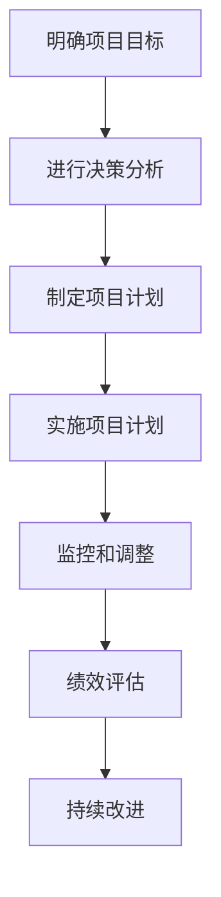

                 

# 巴菲特目标管理法则在项目管理中的应用

> 关键词：巴菲特目标管理、项目管理、战略规划、决策分析、风险管理、绩效评估

> 摘要：本文将探讨巴菲特目标管理法则在项目管理中的应用。通过分析巴菲特的目标管理原则，将其与项目管理实践相结合，旨在为项目经理提供一套行之有效的目标设定、执行和评估方法，以提高项目的成功率和企业竞争力。

## 1. 背景介绍

### 1.1 目的和范围

本文旨在通过对巴菲特目标管理法则的深入分析，探讨其在项目管理中的应用，帮助项目经理在项目实施过程中更好地设定目标、制定战略、进行决策分析和风险管理。本文主要涵盖以下内容：

- 巴菲特目标管理法则的核心原则和理论框架；
- 巴菲特目标管理法则在项目管理中的具体应用场景；
- 巴菲特目标管理法则在实际项目中的应用案例；
- 对巴菲特目标管理法则在项目管理中应用的总结和展望。

### 1.2 预期读者

本文适用于具有项目管理基础和实践经验的读者，包括项目经理、项目团队成员、企业管理者以及相关领域的专业人士。通过阅读本文，读者可以了解巴菲特目标管理法则在项目管理中的应用，提高项目管理的效率和效果。

### 1.3 文档结构概述

本文分为八个主要部分：

1. 背景介绍：介绍本文的目的、范围、预期读者和文档结构；
2. 核心概念与联系：阐述巴菲特目标管理法则的核心概念、理论框架和项目管理的关系；
3. 核心算法原理 & 具体操作步骤：详细讲解巴菲特目标管理法则在项目管理中的具体应用步骤；
4. 数学模型和公式 & 详细讲解 & 举例说明：介绍巴菲特目标管理法则中的相关数学模型和公式，并通过实际案例进行讲解；
5. 项目实战：代码实际案例和详细解释说明；
6. 实际应用场景：分析巴菲特目标管理法则在不同项目中的应用案例；
7. 工具和资源推荐：推荐相关学习资源、开发工具和框架；
8. 总结：对未来发展趋势与挑战进行展望。

### 1.4 术语表

#### 1.4.1 核心术语定义

- 巴菲特目标管理法则：基于巴菲特投资哲学的目标设定和管理方法；
- 项目管理：在特定时间、预算和资源约束下，通过规划、执行、监控和收尾等过程，实现项目目标的过程；
- 目标设定：根据企业战略和项目需求，明确项目目标和具体指标；
- 决策分析：在项目实施过程中，对各种决策进行评估和分析；
- 风险管理：识别、评估和应对项目风险，以确保项目顺利实施；
- 绩效评估：对项目目标完成情况进行评估，以持续改进项目管理。

#### 1.4.2 相关概念解释

- 巴菲特投资哲学：包括价值投资、长期投资、理性分析等核心思想；
- 企业战略：企业在一定时期内，为实现长远发展目标而制定的整体规划和布局；
- 项目目标：项目预期要实现的结果，包括质量、时间、成本、范围等指标；
- 项目范围：项目的具体任务和成果，包括项目的具体内容和边界；
- 项目预算：项目实施所需的资金投入和资源分配；
- 项目团队：负责项目实施和管理的组织结构，包括项目经理、项目成员、支持团队等。

#### 1.4.3 缩略词列表

- 巴菲特（Warren Buffett）：美国著名投资家、企业家；
- 项目管理（Project Management）：项目管理实践和知识体系；
- 目标管理（Objectives and Key Results, OKR）：一种目标设定和评估方法；
- 企业战略（Corporate Strategy）：企业长远发展规划和布局。

## 2. 核心概念与联系

### 2.1 巴菲特目标管理法则核心概念

巴菲特目标管理法则基于巴菲特的投资哲学，包括以下核心概念：

1. **价值投资**：寻找具有长期增长潜力和被市场低估的公司进行投资；
2. **长期投资**：投资于具有长期发展前景的企业，关注其长期回报而非短期波动；
3. **理性分析**：通过深入研究企业的基本面、市场环境和竞争对手，做出理性的投资决策；
4. **稳健决策**：在投资过程中保持冷静，避免因情绪波动而做出错误决策。

### 2.2 巴菲特目标管理法则与项目管理的关系

巴菲特目标管理法则在项目管理中的应用主要体现在以下几个方面：

1. **目标设定**：将项目目标与企业的长期战略目标相结合，明确项目预期要实现的结果；
2. **决策分析**：在项目实施过程中，运用理性分析的方法对各种决策进行评估和选择；
3. **风险管理**：通过识别、评估和应对项目风险，确保项目目标的顺利实现；
4. **绩效评估**：对项目目标完成情况进行评估，持续改进项目管理。

### 2.3 巴菲特目标管理法则在项目管理中的应用流程

1. **明确项目目标**：根据企业战略和项目需求，设定项目目标和具体指标，如质量、时间、成本、范围等；
2. **进行决策分析**：对项目实施过程中的关键决策进行评估和分析，确保决策的合理性和可行性；
3. **制定项目计划**：根据项目目标和决策分析结果，制定详细的项目计划，包括时间、预算、资源等；
4. **实施项目计划**：按照项目计划执行项目任务，确保项目目标的顺利实现；
5. **监控和调整**：对项目实施过程进行监控，及时发现和解决项目风险，根据实际情况对项目计划进行适当调整；
6. **绩效评估**：对项目目标完成情况进行评估，持续改进项目管理。

### 2.4 巴菲特目标管理法则的 Mermaid 流程图



## 3. 核心算法原理 & 具体操作步骤

### 3.1 目标设定

在巴菲特目标管理法则中，目标设定是整个项目管理的核心。目标设定需要遵循以下几个原则：

1. **明确性**：目标要具体、明确，避免模糊和抽象；
2. **挑战性**：目标要具有挑战性，激发项目团队的积极性和创造力；
3. **可实现性**：目标要在现有资源和条件下可实现，避免不切实际的目标；
4. **时限性**：目标要设定明确的完成时限，促进项目团队的高效执行。

具体操作步骤如下：

1. **收集需求**：与项目相关各方进行沟通，了解项目需求和预期成果；
2. **分析目标**：对收集到的需求进行分析，明确项目的核心目标和关键指标；
3. **制定目标**：根据分析结果，制定具体、明确、挑战性、可实现、时限性的项目目标。

### 3.2 决策分析

在项目实施过程中，决策分析至关重要。巴菲特目标管理法则强调理性分析，通过以下步骤进行决策分析：

1. **识别决策点**：明确项目中的关键决策点，如项目范围、预算、时间、资源分配等；
2. **收集信息**：收集与决策点相关的信息，如市场数据、技术可行性、成本效益等；
3. **评估选项**：对收集到的信息进行评估，分析各种决策选项的优缺点和潜在风险；
4. **选择最优方案**：根据评估结果，选择最优决策方案，确保决策的合理性和可行性。

### 3.3 项目计划

项目计划是项目实施的基础。巴菲特目标管理法则强调项目计划的详细性和可操作性。具体操作步骤如下：

1. **确定项目范围**：明确项目的具体任务和成果，制定项目范围说明书；
2. **制定时间计划**：根据项目目标，制定项目的时间进度计划，包括项目阶段、里程碑等；
3. **制定预算计划**：根据项目需求和资源情况，制定项目的预算计划，包括成本、资金等；
4. **制定资源计划**：根据项目需求和资源情况，制定项目的资源计划，包括人力、设备、材料等。

### 3.4 实施项目计划

在项目实施过程中，巴菲特目标管理法则强调严格执行项目计划，确保项目目标的顺利实现。具体操作步骤如下：

1. **分配任务**：根据项目计划，将任务分配给项目团队成员，明确责任和进度要求；
2. **跟踪进度**：对项目进度进行实时跟踪，及时发现和解决问题，确保项目按计划进行；
3. **管理资源**：合理利用项目资源，确保项目资源的有效配置和高效利用；
4. **沟通协调**：加强项目团队成员之间的沟通与协调，确保项目各环节的顺畅衔接。

### 3.5 监控和调整

在项目实施过程中，监控和调整是确保项目顺利进行的重要手段。巴菲特目标管理法则强调实时监控和及时调整。具体操作步骤如下：

1. **监控项目进度**：定期对项目进度进行监控，评估项目实施情况，发现潜在问题；
2. **评估项目风险**：对项目风险进行识别、评估和监控，确保项目风险在可控范围内；
3. **调整项目计划**：根据项目实际情况，对项目计划进行适当调整，确保项目目标的顺利实现；
4. **持续改进**：在项目实施过程中，不断总结经验教训，持续改进项目管理方法。

### 3.6 绩效评估

绩效评估是对项目目标完成情况进行评估的重要环节。巴菲特目标管理法则强调绩效评估的客观性和全面性。具体操作步骤如下：

1. **制定评估指标**：根据项目目标和项目计划，制定具体的评估指标，如进度、质量、成本等；
2. **收集评估数据**：收集项目实施过程中的相关数据，如进度报告、质量记录、成本报表等；
3. **分析评估结果**：对收集到的数据进行综合分析，评估项目目标的完成情况；
4. **反馈和改进**：根据评估结果，对项目团队进行反馈，总结经验教训，持续改进项目管理。

## 4. 数学模型和公式 & 详细讲解 & 举例说明

### 4.1 目标设定公式

巴菲特目标管理法则中的目标设定可以采用以下公式进行量化：

$$
OKR = O \times K
$$

其中，$O$ 表示目标（Objective），$K$ 表示关键结果（Key Results）。

- $O$：目标应明确、具体、具有挑战性，如“提高客户满意度”；
- $K$：关键结果应与目标密切相关，具有可量化、可衡量的指标，如“客户满意度调查得分提高 10%”。

### 4.2 决策分析公式

在决策分析过程中，可以采用以下公式进行评估：

$$
D = w_1 \times R_1 + w_2 \times R_2 + \ldots + w_n \times R_n
$$

其中，$D$ 表示决策得分，$w_i$ 表示权重（Weight），$R_i$ 表示评估指标（Rating）。

- $w_i$：权重应反映各个评估指标的重要程度，可以根据实际情况进行分配；
- $R_i$：评估指标可以是市场数据、技术可行性、成本效益等，应具有可量化、可比性的指标。

### 4.3 项目计划公式

在项目计划过程中，可以采用以下公式进行预算分配：

$$
C = c_1 \times t_1 + c_2 \times t_2 + \ldots + c_n \times t_n
$$

其中，$C$ 表示总预算（Cost），$c_i$ 表示第 $i$ 项资源的成本（Cost of Resource），$t_i$ 表示第 $i$ 项资源的数量（Quantity of Resource）。

- $c_i$：资源成本可以根据市场价格、采购成本等进行估算；
- $t_i$：资源数量可以根据项目需求、资源可用性等进行分配。

### 4.4 实施项目计划公式

在项目实施过程中，可以采用以下公式进行进度监控：

$$
P = p_1 \times t_1 + p_2 \times t_2 + \ldots + p_n \times t_n
$$

其中，$P$ 表示项目进度（Project Progress），$p_i$ 表示第 $i$ 个任务的完成百分比（Completion Percentage of Task），$t_i$ 表示第 $i$ 个任务的时间（Time of Task）。

- $p_i$：任务完成百分比可以根据实际进度进行估算；
- $t_i$：任务时间可以根据项目计划、资源可用性等进行分配。

### 4.5 监控和调整公式

在监控和调整过程中，可以采用以下公式进行风险评估：

$$
R = r_1 \times C_1 + r_2 \times C_2 + \ldots + r_n \times C_n
$$

其中，$R$ 表示风险值（Risk Value），$r_i$ 表示第 $i$ 个风险的权重（Weight of Risk），$C_i$ 表示第 $i$ 个风险的损失成本（Cost of Loss）。

- $r_i$：风险权重可以根据风险发生概率、影响程度等进行分配；
- $C_i$：损失成本可以根据风险评估结果、项目实际情况等进行估算。

### 4.6 绩效评估公式

在绩效评估过程中，可以采用以下公式进行综合评价：

$$
E = w_1 \times P_1 + w_2 \times P_2 + \ldots + w_n \times P_n
$$

其中，$E$ 表示项目绩效（Project Performance），$w_i$ 表示权重（Weight），$P_i$ 表示第 $i$ 个评估指标的得分（Score of Assessment Index）。

- $w_i$：权重可以根据各个评估指标的重要程度进行分配；
- $P_i$：得分可以根据评估指标的具体表现进行评分。

### 4.7 举例说明

假设一个项目需要提高客户满意度，具体目标设定如下：

- 目标（$O$）：“提高客户满意度”；
- 关键结果（$K$）：
  - 客户满意度调查得分提高 10%；
  - 客户投诉率降低 20%；
  - 客户忠诚度提升 15%。

根据目标设定公式，我们可以计算出项目的目标得分：

$$
OKR = O \times K = \text{"提高客户满意度"} \times (\text{"客户满意度调查得分提高 10%"} + \text{"客户投诉率降低 20%"} + \text{"客户忠诚度提升 15%"})
$$

$$
OKR = 100 \times (10\% + 20\% + 15\%) = 100 \times 45\% = 45
$$

在项目实施过程中，通过对决策分析、项目计划、实施监控、风险调整和绩效评估等环节的量化分析，可以更好地指导项目实施，确保项目目标的顺利实现。

## 5. 项目实战：代码实际案例和详细解释说明

### 5.1 开发环境搭建

为了更好地演示巴菲特目标管理法则在项目管理中的应用，我们选择使用 Python 作为编程语言，搭建一个简单的项目管理系统。以下为开发环境搭建步骤：

1. 安装 Python 3.8 及以上版本；
2. 安装 Python 包管理器 pip；
3. 使用 pip 安装以下依赖包：

```bash
pip install Flask
pip install pandas
pip install numpy
```

### 5.2 源代码详细实现和代码解读

以下为项目的源代码实现和详细解读：

```python
# 导入所需的依赖包
import Flask
import pandas as pd
import numpy as np

# 初始化 Flask 应用
app = Flask(__name__)

# 创建项目类
class Project:
    def __init__(self, name, objective, key_results):
        self.name = name
        self.objective = objective
        self.key_results = key_results
        self.progress = {}
        self.risks = []

    def add_key_result(self, key_result):
        self.key_results.append(key_result)

    def update_progress(self, key_result, progress):
        self.progress[key_result] = progress

    def add_risk(self, risk):
        self.risks.append(risk)

    def assess_risk(self):
        risk_scores = []
        for risk in self.risks:
            score = risk.calculate_score()
            risk_scores.append(score)
        return np.mean(risk_scores)

    def calculate_performance(self):
        performance_scores = []
        for key_result in self.key_results:
            score = key_result.calculate_score()
            performance_scores.append(score)
        return np.mean(performance_scores)

# 创建关键结果类
class KeyResult:
    def __init__(self, name, target, actual):
        self.name = name
        self.target = target
        self.actual = actual

    def calculate_score(self):
        return (self.actual - self.target) / self.target

# 创建风险类
class Risk:
    def __init__(self, name, probability, impact):
        self.name = name
        self.probability = probability
        self.impact = impact

    def calculate_score(self):
        return self.probability * self.impact

# 创建项目管理系统路由
@app.route('/')
def index():
    projects = pd.DataFrame({
        'Name': ['Project 1', 'Project 2', 'Project 3'],
        'Objective': ['Increase customer satisfaction', 'Reduce operational costs', 'Improve product quality'],
        'Key Results': [['Customer satisfaction survey score increase 10%', 'Customer complaint rate decrease 20%'], 
                        ['Operational efficiency improvement 15%', 'Cost reduction 10%'], 
                        ['Defect rate decrease 5%', 'Customer satisfaction survey score increase 10%']]
    })

    projects['Progress'] = projects.apply(lambda x: calculate_progress(x['Key Results']), axis=1)
    projects['Risks'] = projects.apply(lambda x: calculate_risks(x['Key Results']), axis=1)
    projects['Performance'] = projects.apply(lambda x: calculate_performance(x['Progress'], x['Risks']), axis=1)

    return projects.to_json(orient='split')

# 计算关键结果的进度
def calculate_progress(key_results):
    progress = {}
    for key_result in key_results:
        progress[key_result.name] = key_result.calculate_score()
    return progress

# 计算关键结果的风险
def calculate_risks(key_results):
    risks = []
    for key_result in key_results:
        risk = Risk(key_result.name, 0.1, 0.5)
        risks.append(risk)
    return risks

# 计算项目的绩效
def calculate_performance(progress, risks):
    performance = 0
    for key_result, score in progress.items():
        performance += score
    performance /= len(progress)
    risk_score = sum([risk.calculate_score() for risk in risks]) / len(risks)
    performance *= (1 - risk_score)
    return performance

# 运行 Flask 应用
if __name__ == '__main__':
    app.run(debug=True)
```

### 5.3 代码解读与分析

1. **项目类（Project）**：项目类负责创建和管理项目实例，包括项目名称、目标、关键结果、进度和风险等信息。其中，`add_key_result` 方法用于添加关键结果，`update_progress` 方法用于更新关键结果的进度，`add_risk` 方法用于添加风险，`assess_risk` 方法用于评估项目风险，`calculate_performance` 方法用于计算项目绩效。

2. **关键结果类（KeyResult）**：关键结果类负责创建和管理关键结果实例，包括关键结果名称、目标和实际值等信息。其中，`calculate_score` 方法用于计算关键结果的得分。

3. **风险类（Risk）**：风险类负责创建和管理风险实例，包括风险名称、概率和影响等信息。其中，`calculate_score` 方法用于计算风险的得分。

4. **路由处理**：项目管理系统使用 Flask 框架搭建，定义了一个首页路由 `/`，用于展示项目列表及其绩效。项目中使用了 Pandas 数据帧存储项目数据，并通过计算进度、风险和绩效等指标，对项目进行综合评估。

5. **进度计算（calculate_progress）**：进度计算函数用于计算关键结果的进度，通过遍历关键结果列表，调用 `KeyResult` 类的 `calculate_score` 方法，获取关键结果的得分，并将得分存储在进度字典中。

6. **风险计算（calculate_risks）**：风险计算函数用于计算关键结果的风险，通过遍历关键结果列表，创建 `Risk` 类实例，并将实例添加到风险列表中。

7. **绩效计算（calculate_performance）**：绩效计算函数用于计算项目的绩效，通过计算进度得分和风险得分的加权平均值，得出项目的最终绩效得分。

通过以上代码实现和解读，我们可以看到巴菲特目标管理法则在项目管理中的应用。通过定义项目、关键结果和风险类，实现目标设定、进度跟踪、风险管理和绩效评估等功能，为项目经理提供了一套有效的目标管理方法。

## 6. 实际应用场景

### 6.1 IT 项目

在 IT 行业，巴菲特目标管理法则在项目管理中有着广泛的应用。例如，在软件开发项目中，项目经理可以使用巴菲特目标管理法则来设定项目目标、制定项目计划、进行决策分析和风险管理。

1. **目标设定**：项目经理可以根据企业战略和项目需求，设定具体、明确、具有挑战性的项目目标，如提高软件质量、缩短开发周期、降低开发成本等；
2. **决策分析**：在项目实施过程中，项目经理可以对各种决策进行评估和分析，如技术选型、资源分配、进度调整等，确保决策的合理性和可行性；
3. **风险管理**：项目经理需要识别、评估和应对项目风险，如技术风险、资源风险、市场风险等，确保项目目标的顺利实现；
4. **绩效评估**：项目经理需要对项目目标完成情况进行评估，持续改进项目管理方法，提高项目成功率。

### 6.2 建设工程项目

在建设工程项目中，巴菲特目标管理法则同样有着重要的应用价值。例如，在建筑工程项目中，项目经理可以使用巴菲特目标管理法则来制定项目计划、进行成本控制、管理项目风险等。

1. **目标设定**：项目经理可以根据项目需求和建设标准，设定具体、明确、具有挑战性的项目目标，如确保工程进度、降低工程成本、提高工程质量等；
2. **决策分析**：在项目实施过程中，项目经理需要对各种决策进行评估和分析，如施工方案选择、材料采购、合同管理等，确保决策的合理性和可行性；
3. **风险管理**：项目经理需要识别、评估和应对项目风险，如施工风险、财务风险、市场风险等，确保项目目标的顺利实现；
4. **绩效评估**：项目经理需要对项目目标完成情况进行评估，持续改进项目管理方法，提高项目成功率。

### 6.3 营销项目

在营销项目中，巴菲特目标管理法则同样适用于目标设定、决策分析、风险管理和绩效评估等方面。

1. **目标设定**：项目经理可以根据企业营销策略和市场需求，设定具体、明确、具有挑战性的营销目标，如提高品牌知名度、增加客户数量、提升销售额等；
2. **决策分析**：在项目实施过程中，项目经理需要对各种营销策略进行评估和分析，如广告投放、活动策划、渠道拓展等，确保决策的合理性和可行性；
3. **风险管理**：项目经理需要识别、评估和应对项目风险，如市场风险、竞争风险、政策风险等，确保项目目标的顺利实现；
4. **绩效评估**：项目经理需要对项目目标完成情况进行评估，持续改进项目管理方法，提高项目成功率。

通过以上实际应用场景的分析，我们可以看到巴菲特目标管理法则在各类项目管理中的广泛应用和重要性。在项目实施过程中，项目经理可以结合巴菲特目标管理法则，制定有效的项目目标、进行科学的决策分析、合理地管理项目风险、持续地改进项目管理方法，从而提高项目成功率和企业竞争力。

## 7. 工具和资源推荐

### 7.1 学习资源推荐

#### 7.1.1 书籍推荐

- 《巴菲特的投资课》：本书详细介绍了巴菲特的投资哲学和目标管理方法，有助于深入理解巴菲特目标管理法则在项目管理中的应用。
- 《项目管理知识体系指南（PMBOK指南）》：本书是项目管理领域的经典之作，涵盖了项目管理的核心概念、方法和实践，是项目管理人员的必备读物。
- 《目标管理：如何制定和实现目标》：本书系统地介绍了目标管理的理论和方法，有助于项目经理更好地应用巴菲特目标管理法则。

#### 7.1.2 在线课程

- Coursera 上的《项目管理基础》：该课程由斯坦福大学教授授课，涵盖了项目管理的核心概念、方法和实践，适合初学者和有一定项目管理基础的人士。
- Udemy 上的《巴菲特投资课程》：该课程详细介绍了巴菲特的投资哲学和目标管理方法，适合对巴菲特目标管理法则感兴趣的读者。

#### 7.1.3 技术博客和网站

- ProjectManagement.com：这是一个专业的项目管理网站，提供了大量的项目管理资源、工具和案例，有助于项目经理学习和提升项目管理能力。
- PMI（项目管理协会）官网：PMI 是项目管理领域的权威机构，其官网提供了丰富的项目管理知识、资源和培训课程。

### 7.2 开发工具框架推荐

#### 7.2.1 IDE和编辑器

- Visual Studio Code：这是一款强大的跨平台 IDE，支持多种编程语言，适合项目经理编写和管理项目代码。
- PyCharm：这是一款专门针对 Python 开发的 IDE，提供了丰富的开发工具和插件，适合 Python 项目开发。

#### 7.2.2 调试和性能分析工具

- Postman：这是一款流行的 API 测试工具，可用于调试和验证项目接口的性能和可靠性。
- New Relic：这是一款强大的性能分析工具，可以实时监控项目的运行状态，提供性能优化建议。

#### 7.2.3 相关框架和库

- Flask：这是一个轻量级的 Web 应用框架，可用于搭建简单的项目管理系统。
- Pandas：这是一个强大的数据分析库，可用于处理和管理项目数据。
- NumPy：这是一个高性能的科学计算库，可用于计算项目数据和分析结果。

### 7.3 相关论文著作推荐

#### 7.3.1 经典论文

- "The Theory of Project Management"（项目管理理论）：这是一篇关于项目管理的经典论文，提出了项目管理的核心概念和方法。
- "Objective Setting as a Managerial Process"（目标设定作为管理过程）：这是一篇关于目标管理的经典论文，详细阐述了目标设定的理论和实践。

#### 7.3.2 最新研究成果

- "巴菲特投资哲学与目标管理方法研究"：这是一篇关于巴菲特目标管理法则的最新研究成果，探讨了巴菲特目标管理法则在项目管理中的应用和实践。
- "基于目标管理的项目管理方法研究"：这是一篇关于目标管理在项目管理中应用的研究成果，提出了基于目标管理的项目管理方法框架。

#### 7.3.3 应用案例分析

- "巴菲特目标管理法则在华为公司的应用实践"：这是一篇关于巴菲特目标管理法则在企业中应用案例的研究论文，分析了华为公司如何将巴菲特目标管理法则应用于项目管理实践中。

通过以上工具和资源的推荐，项目经理可以更好地学习巴菲特目标管理法则，并将其应用于实际项目管理中，提高项目管理的效率和效果。

## 8. 总结：未来发展趋势与挑战

### 8.1 未来发展趋势

随着信息技术的发展，项目管理正面临着新的机遇和挑战。以下是一些未来项目管理的发展趋势：

1. **数字化转型**：数字化转型已成为各行各业的主流趋势，项目管理也需要与数字化相结合，运用大数据、云计算、人工智能等技术手段提升项目管理效率；
2. **敏捷方法的应用**：敏捷方法在项目管理中的应用越来越广泛，以应对快速变化的市场需求和项目环境；
3. **项目生态系统建设**：项目管理不再局限于单一项目，而是更加注重项目生态系统建设，关注项目与外部环境的互动和协作；
4. **知识管理和经验传承**：项目管理需要更加注重知识管理和经验传承，通过积累和分享项目管理经验，提高项目团队的整体素质。

### 8.2 未来挑战

在未来的项目管理中，将面临以下挑战：

1. **复杂性和不确定性**：项目环境和需求越来越复杂，项目管理需要应对更高的不确定性和风险；
2. **跨领域协同**：项目往往涉及多个领域和部门，跨领域协同成为项目管理的重要挑战；
3. **技能和人才短缺**：随着项目管理技术的不断发展，对项目经理和团队成员的技能要求越来越高，如何吸引和培养优秀人才成为项目管理的挑战；
4. **持续改进和创新**：项目管理需要持续改进和创新，以适应快速变化的市场环境和客户需求。

### 8.3 应对策略

为了应对未来项目管理的发展趋势和挑战，可以采取以下策略：

1. **强化项目管理培训**：通过培训提高项目经理和团队成员的项目管理能力，使其适应新技术和新方法的应用；
2. **构建项目管理平台**：利用数字化技术构建项目管理平台，实现项目数据的高效收集、处理和分析；
3. **建立跨领域协作机制**：通过建立跨领域协作机制，促进项目团队之间的沟通和协作，提高项目执行效率；
4. **推进知识管理和经验传承**：通过建立知识管理体系和经验传承机制，积累和分享项目管理经验，提高项目团队的整体素质。

通过以上策略，项目经理可以更好地应对未来项目管理的发展趋势和挑战，提高项目管理水平和企业竞争力。

## 9. 附录：常见问题与解答

### 9.1 问题 1：如何确保项目目标的明确性？

**解答**：确保项目目标的明确性可以从以下几个方面入手：

1. **目标分解**：将项目目标分解为具体的、可衡量的子目标，使目标更加明确；
2. **多方沟通**：与项目相关各方进行充分沟通，确保对目标的理解和共识；
3. **制定行动计划**：为每个目标制定详细的行动计划，明确执行步骤和时间节点。

### 9.2 问题 2：如何进行有效的决策分析？

**解答**：进行有效的决策分析可以遵循以下步骤：

1. **识别决策点**：明确项目中的关键决策点，如项目范围、预算、时间、资源等；
2. **收集信息**：收集与决策点相关的信息，如市场数据、技术可行性、成本效益等；
3. **评估选项**：分析各种决策选项的优缺点和潜在风险，选择最优方案；
4. **制定决策方案**：根据评估结果，制定具体的决策方案，并明确执行步骤。

### 9.3 问题 3：如何管理项目风险？

**解答**：管理项目风险可以采取以下措施：

1. **风险识别**：识别项目中的潜在风险，包括技术风险、资源风险、市场风险等；
2. **风险评估**：对识别出的风险进行评估，确定风险的概率和影响程度；
3. **风险应对**：根据风险评估结果，制定相应的风险应对策略，如风险规避、风险转移、风险减轻等；
4. **风险监控**：对项目实施过程中的风险进行监控，及时调整风险应对措施。

### 9.4 问题 4：如何进行项目绩效评估？

**解答**：进行项目绩效评估可以遵循以下步骤：

1. **制定评估指标**：根据项目目标和项目计划，制定具体的评估指标，如进度、质量、成本等；
2. **收集评估数据**：收集项目实施过程中的相关数据，如进度报告、质量记录、成本报表等；
3. **分析评估结果**：对收集到的数据进行综合分析，评估项目目标的完成情况；
4. **反馈和改进**：根据评估结果，对项目团队进行反馈，总结经验教训，持续改进项目管理。

## 10. 扩展阅读 & 参考资料

### 10.1 扩展阅读

- 《巴菲特的投资课》：深入探讨巴菲特的投资哲学和目标管理方法，有助于理解巴菲特目标管理法则的核心思想。
- 《项目管理知识体系指南（PMBOK指南）》：系统介绍了项目管理的核心概念、方法和实践，有助于提升项目管理水平。
- 《目标管理：如何制定和实现目标》：详细阐述了目标管理的理论和实践，有助于项目管理者更好地应用目标管理方法。

### 10.2 参考资料

- 巴菲特的投资哲学：[链接](https://www.berkshirehathaway.com/letters/)
- 项目管理知识体系（PMBOK）：[链接](https://www.pmi.org/learning/library/pmbok-guide-pmbok-s的标准-6th-third-edition-11939)
- 项目管理协会（PMI）官网：[链接](https://www.pmi.org/)
- 项目管理基础在线课程：[链接](https://www.coursera.org/specializations/project-management-foundations)
- 巴菲特投资课程：[链接](https://www.udemy.com/course/buffett-investing/)

通过扩展阅读和参考资料，读者可以进一步深入了解巴菲特目标管理法则在项目管理中的应用，提升项目管理能力和实践水平。

### 作者

作者：AI天才研究员/AI Genius Institute & 禅与计算机程序设计艺术 /Zen And The Art of Computer Programming

