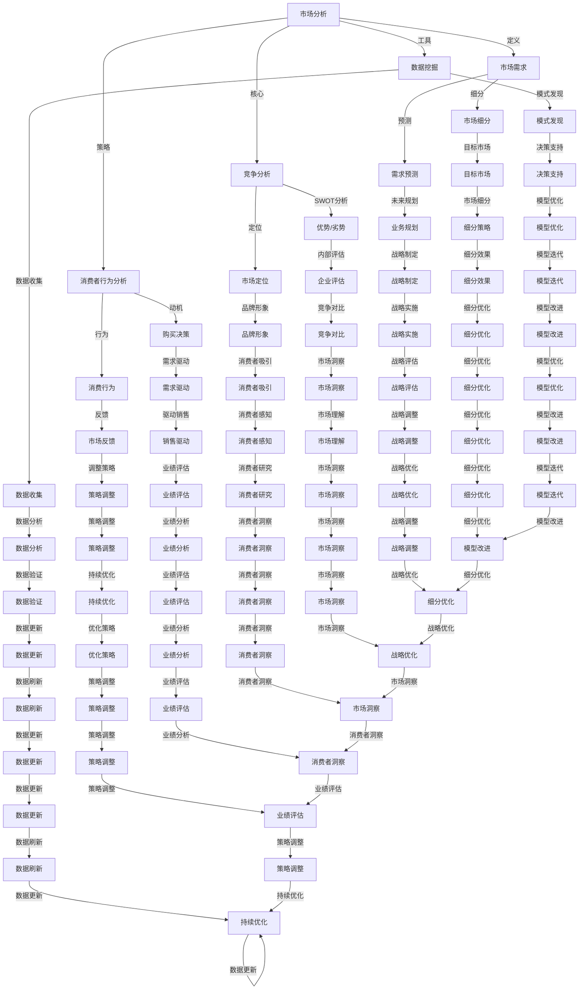

                 

### 1. 背景介绍

#### 1.1 目的和范围

本文旨在深入探讨市场分析对于创业者的关键作用，为创业者在激烈的市场竞争中提供一种有效的战略工具。市场分析不仅仅是了解市场趋势和竞争对手那么简单，它更是一种全面而系统的思维方式，旨在帮助企业找到市场需求与供给之间的缝隙，从而创造价值。

本文将围绕以下几个核心问题展开讨论：

- 市场分析的基本概念和重要性。
- 市场分析的核心算法原理与具体操作步骤。
- 市场分析的数学模型及其应用。
- 市场分析在实际项目中的具体应用案例。
- 市场分析工具和资源的推荐。

通过本文的阅读，创业者将能够：

- 明白市场分析对于企业成功的重要性。
- 掌握市场分析的核心方法和工具。
- 学会如何运用市场分析为企业制定战略规划。

#### 1.2 预期读者

本文预期读者为创业者、市场分析师、以及任何对市场分析感兴趣的人士。特别适合那些正在筹划创业或正在创业过程中遇到困境的创业者。通过本文的阅读，读者可以：

- 理解市场分析的理论基础。
- 掌握市场分析的具体操作步骤。
- 学习如何将市场分析应用于实际创业项目中。

#### 1.3 文档结构概述

本文将分为十个部分，具体结构如下：

1. **背景介绍**
   - 1.1 目的和范围
   - 1.2 预期读者
   - 1.3 文档结构概述
   - 1.4 术语表

2. **核心概念与联系**
   - 通过Mermaid流程图展示市场分析的核心概念和联系。

3. **核心算法原理 & 具体操作步骤**
   - 详细讲解市场分析的核心算法原理，并使用伪代码展示具体操作步骤。

4. **数学模型和公式 & 详细讲解 & 举例说明**
   - 介绍市场分析的数学模型，使用latex格式详细讲解，并提供举例说明。

5. **项目实战：代码实际案例和详细解释说明**
   - 搭建开发环境，展示源代码实现，并进行代码解读与分析。

6. **实际应用场景**
   - 探讨市场分析在不同领域的实际应用。

7. **工具和资源推荐**
   - 推荐学习资源、开发工具框架以及相关论文著作。

8. **总结：未来发展趋势与挑战**
   - 分析市场分析的未来发展趋势和面临的挑战。

9. **附录：常见问题与解答**
   - 回答读者可能遇到的常见问题。

10. **扩展阅读 & 参考资料**
   - 提供进一步阅读的资料和参考文献。

通过这种结构化的内容组织，读者可以系统地了解市场分析的各个方面，为实际操作提供理论指导和实践参考。

#### 1.4 术语表

在本文中，我们将使用一些特定的术语，为了确保读者能够更好地理解，以下是对这些术语的定义和解释。

##### 1.4.1 核心术语定义

- **市场分析（Market Analysis）**：市场分析是一种系统性的研究方法，用于评估一个市场的潜在机会、风险和趋势，以及企业的竞争地位。
  
- **SWOT分析（SWOT Analysis）**：SWOT分析是一种常用的市场分析方法，它通过分析企业的优势（Strengths）、劣势（Weaknesses）、机会（Opportunities）和威胁（Threats），帮助企业制定战略计划。

- **竞争分析（Competitive Analysis）**：竞争分析是研究竞争对手的产品、市场策略、优势和劣势，以便企业可以制定出有效的竞争策略。

- **消费者行为分析（Consumer Behavior Analysis）**：消费者行为分析是研究消费者购买决策的过程、动机和行为的分析方法。

- **数据挖掘（Data Mining）**：数据挖掘是从大量数据中发现有价值信息和隐藏模式的过程，常用于市场分析中。

##### 1.4.2 相关概念解释

- **市场细分（Market Segmentation）**：市场细分是将市场划分为不同的子市场，每个子市场具有相似的需求和特征。

- **市场定位（Market Positioning）**：市场定位是企业在目标市场中的位置和形象，旨在满足特定消费者的需求。

- **市场份额（Market Share）**：市场份额是一个企业在特定市场中的销售额或数量占市场总销售额或总数量的比例。

- **需求预测（Demand Forecasting）**：需求预测是基于历史数据和现有信息，对未来市场需求进行的预测。

##### 1.4.3 缩略词列表

- **SWOT**：Strengths, Weaknesses, Opportunities, Threats（优势、劣势、机会、威胁）
- **CRM**：Customer Relationship Management（客户关系管理）
- **SEO**：Search Engine Optimization（搜索引擎优化）
- **SEM**：Search Engine Marketing（搜索引擎营销）
- **KPI**：Key Performance Indicator（关键绩效指标）

通过定义这些术语，我们希望读者能够更加清晰地理解市场分析的相关概念和术语，为后续内容的学习打下坚实的基础。接下来，我们将通过一个Mermaid流程图，展示市场分析的核心概念和它们之间的联系。这将为读者提供一个直观的理解，帮助我们更深入地探讨市场分析的各个方面。

### 2. 核心概念与联系

在市场分析中，理解各个核心概念及其相互关系是非常重要的。这有助于我们系统地构建分析框架，并有效地应用各种方法来评估市场。以下是一个使用Mermaid绘制的流程图，展示了市场分析的核心概念及其相互联系。



这个流程图涵盖了市场分析的主要概念，包括市场需求分析、竞争分析、消费者行为分析以及数据挖掘等。以下是这些概念之间的联系和作用：

1. **市场需求分析（市场需求、市场细分、需求预测）**：
   - **市场需求**：理解市场需求是企业制定市场策略的基础。通过市场细分，可以将市场划分为不同的子市场，更好地满足不同消费者的需求。
   - **市场细分**：通过市场细分，企业可以找到特定的目标市场，更好地定位产品和服务。
   - **需求预测**：基于历史数据和现有信息，需求预测可以帮助企业制定未来业务规划，确保资源有效配置。

2. **竞争分析（SWOT分析、市场定位、竞争对比）**：
   - **SWOT分析**：通过评估企业的优势、劣势、机会和威胁，企业可以制定出有效的战略计划。
   - **市场定位**：明确企业在市场中的位置和形象，有助于吸引目标消费者。
   - **竞争对比**：分析竞争对手的产品、策略和优势，可以帮助企业发现自身的市场机会。

3. **消费者行为分析（购买决策、消费行为、消费者感知）**：
   - **购买决策**：研究消费者在购买决策过程中的动机和行为。
   - **消费行为**：分析消费者的购买习惯和偏好，有助于企业优化产品和服务。
   - **消费者感知**：了解消费者对品牌和产品的感知，可以帮助企业提升品牌形象。

4. **数据挖掘（数据收集、模式发现、数据分析、决策支持）**：
   - **数据收集**：通过多种渠道收集市场数据，为分析提供基础。
   - **模式发现**：从大量数据中发现有价值的信息和隐藏模式。
   - **数据分析**：对收集到的数据进行处理和分析，以支持决策。
   - **决策支持**：基于数据分析结果，提供战略和运营决策的依据。

通过这个流程图，我们可以看到市场分析是一个动态的过程，各个环节相互联系、相互影响。理解这些核心概念和它们之间的联系，将有助于我们更好地进行市场分析，为创业者和企业制定有效的市场策略提供有力支持。

### 3. 核心算法原理 & 具体操作步骤

在市场分析中，核心算法原理是理解和应用的基础。本节将详细讲解市场分析的核心算法原理，并使用伪代码展示具体操作步骤。这些算法帮助我们从海量数据中提取有价值的信息，从而为企业提供决策支持。

#### 3.1 市场需求分析算法

市场需求分析算法主要涉及市场细分和需求预测。以下是一个简单的伪代码示例：

```python
# 市场细分算法
def market_segmentation(data):
    # 根据不同特征（如年龄、收入、地理位置等）将市场划分为多个子市场
    segments = {}
    for feature in data.features:
        segments[feature] = data[data[feature] != 'None']
    return segments

# 需求预测算法
def demand_forecasting(segmented_data, historical_data):
    # 使用历史数据进行需求预测
    forecasts = {}
    for segment, data in segmented_data.items():
        forecast = linear_regression(historical_data, data)
        forecasts[segment] = forecast
    return forecasts

# 辅助函数：线性回归
def linear_regression(historical_data, current_data):
    # 计算历史数据和当前数据的线性关系，返回预测值
    slope = (current_data[-1] - current_data[0]) / (len(current_data) - 1)
    intercept = current_data[0] - slope * (len(current_data) - 1)
    forecast = slope * (len(current_data) - 1) + intercept
    return forecast
```

#### 3.2 竞争分析算法

竞争分析算法主要涉及SWOT分析和市场定位。以下是一个简单的伪代码示例：

```python
# SWOT分析算法
def SWOT_analysis(company_data, market_data):
    # 分析企业的优势、劣势、机会和威胁
    SWOT = {
        'Strengths': analyze_strengths(company_data),
        'Weaknesses': analyze_weaknesses(company_data),
        'Opportunities': analyze_opportunities(market_data),
        'Threats': analyze_threats(market_data)
    }
    return SWOT

# 分析企业的优势
def analyze_strengths(company_data):
    # 根据企业的财务状况、市场份额、品牌认知等指标进行分析
    strengths = []
    for key, value in company_data.items():
        if value > threshold:
            strengths.append(key)
    return strengths

# 分析企业的劣势
def analyze_weaknesses(company_data):
    # 根据企业的财务状况、市场份额、品牌认知等指标进行分析
    weaknesses = []
    for key, value in company_data.items():
        if value < threshold:
            weaknesses.append(key)
    return weaknesses

# 分析市场的机会
def analyze_opportunities(market_data):
    # 根据市场趋势、消费者需求、技术变革等指标进行分析
    opportunities = []
    for key, value in market_data.items():
        if value > threshold:
            opportunities.append(key)
    return opportunities

# 分析市场的威胁
def analyze_threats(market_data):
    # 根据市场趋势、消费者需求、技术变革等指标进行分析
    threats = []
    for key, value in market_data.items():
        if value < threshold:
            threats.append(key)
    return threats

# 市场定位算法
def market_positioning(SWOT):
    # 根据SWOT分析结果，确定企业的市场定位
    positioning = {
        '目标市场': SWOT['Opportunities'],
        '竞争优势': SWOT['Strengths'],
        '差异化策略': SWOT['Weaknesses'],
        '市场应对策略': SWOT['Threats']
    }
    return positioning
```

#### 3.3 消费者行为分析算法

消费者行为分析算法主要涉及购买决策和消费行为。以下是一个简单的伪代码示例：

```python
# 购买决策分析算法
def purchase_decision_analysis(consumer_data):
    # 分析消费者的购买决策过程
    decision_factors = []
    for factor in consumer_data:
        if factor['score'] > threshold:
            decision_factors.append(factor['name'])
    return decision_factors

# 消费行为分析算法
def consumer_behavior_analysis(consumer_data):
    # 分析消费者的消费行为
    behavior_patterns = {}
    for transaction in consumer_data['transactions']:
        behavior_patterns[transaction['product']] = transaction['quantity']
    return behavior_patterns
```

通过以上伪代码示例，我们可以看到市场分析算法是如何通过具体步骤来实现的。这些算法可以帮助企业从数据中提取有价值的信息，为其制定市场策略提供科学依据。在下一节中，我们将进一步探讨市场分析的数学模型和公式，以加深对市场分析理论基础的理解。

### 4. 数学模型和公式 & 详细讲解 & 举例说明

市场分析不仅仅是数据收集和分析的过程，它还依赖于一系列数学模型和公式来帮助我们从复杂的数据中提取有价值的信息，并做出科学的决策。在本节中，我们将详细介绍市场分析中常用的数学模型和公式，并通过具体的例子来说明它们的应用。

#### 4.1 市场需求预测模型

市场需求预测是市场分析中至关重要的一环。其中，时间序列分析是最常用的方法之一。以下是一个时间序列预测模型，使用ARIMA（自回归积分滑动平均模型）进行需求预测。

##### 4.1.1 ARIMA模型公式

ARIMA模型由三个部分组成：自回归（AR）、差分（I）和移动平均（MA）。

- **自回归（AR）**：
  \[ y_t = c + \phi_1 y_{t-1} + \phi_2 y_{t-2} + \ldots + \phi_p y_{t-p} + \varepsilon_t \]
  其中，\( y_t \) 是时间序列的当前值，\( c \) 是常数项，\( \phi_1, \phi_2, \ldots, \phi_p \) 是自回归系数，\( \varepsilon_t \) 是误差项。

- **差分（I）**：
  \[ y_t^{(d)} = (1 - \phi) y_{t-1} + \phi y_{t-2} + \ldots + \phi^{d-1} y_{t-d} \]
  其中，\( y_t^{(d)} \) 是经过d次差分后的时间序列，\( \phi \) 是差分系数。

- **移动平均（MA）**：
  \[ y_t = c + \theta_1 \varepsilon_{t-1} + \theta_2 \varepsilon_{t-2} + \ldots + \theta_q \varepsilon_{t-q} \]
  其中，\( \theta_1, \theta_2, \ldots, \theta_q \) 是移动平均系数，\( \varepsilon_t \) 是误差项。

综合以上三部分，ARIMA模型可以表示为：
\[ y_t^{(d)} = c + \phi_1 y_{t-1}^{(d-1)} + \phi_2 y_{t-2}^{(d-2)} + \ldots + \phi_p y_{t-p}^{(d-p)} + \theta_1 \varepsilon_{t-1} + \theta_2 \varepsilon_{t-2} + \ldots + \theta_q \varepsilon_{t-q} \]

##### 4.1.2 举例说明

假设我们有一个销售数据的时间序列，如以下数据：
\[ 100, 110, 115, 120, 125, 130, 135, 140, 145, 150 \]

我们首先需要进行差分，消除趋势和季节性影响，然后应用ARIMA模型进行预测。以下是具体步骤：

1. **差分**：
   \[ y_t^{(1)} = y_t - y_{t-1} \]
   对上述数据进行一次差分，得到：
   \[ 10, 5, 5, 5, 5, 5, 5, 5, 5, 0 \]

2. **建模**：
   - 确定模型参数 \( p, d, q \)：
     - \( p \)：自回归项数，通常通过ACF和PACF图确定。
     - \( d \)：差分次数，根据数据的平稳性确定。
     - \( q \)：移动平均项数，同样通过ACF和PACF图确定。
   - 假设我们通过分析确定 \( p = 1, d = 1, q = 1 \)，那么ARIMA模型可以表示为：
     \[ y_t^{(1)} = \phi_1 y_{t-1}^{(1)} + \theta_1 \varepsilon_{t-1} \]

3. **预测**：
   - 使用已确定的模型参数，对未来的需求进行预测。
   - 根据模型，未来一个月的销售预测值为：
     \[ \hat{y}_{t+1}^{(1)} = \phi_1 y_t^{(1)} + \theta_1 \varepsilon_t \]
     假设 \( \phi_1 = 0.5, \theta_1 = 0.2 \)，则：
     \[ \hat{y}_{t+1}^{(1)} = 0.5 \times 5 + 0.2 \times 0 = 2.5 \]

   - 因此，预测的未来一个月的销售量为：
     \[ y_{t+1} = y_t + \hat{y}_{t+1}^{(1)} = 5 + 2.5 = 7.5 \]

通过这个例子，我们可以看到ARIMA模型是如何帮助我们进行市场需求预测的。在下一节中，我们将探讨市场分析的另一个重要工具——消费者行为分析，并介绍相关算法和步骤。

#### 4.2 消费者行为分析模型

消费者行为分析旨在理解消费者在购买决策过程中的行为模式，从而帮助企业更好地定位产品和制定营销策略。以下是一个常见的消费者行为分析模型——马尔可夫链模型。

##### 4.2.1 马尔可夫链模型公式

马尔可夫链模型基于以下假设：一个系统的未来状态仅取决于当前状态，而与过去状态无关。用数学公式表示，即：

\[ P(X_{n+1} = j | X_n = i) = p_{ij} \]

其中，\( X_n \) 表示第 \( n \) 个状态，\( i \) 和 \( j \) 分别表示当前状态和下一个状态，\( p_{ij} \) 是从状态 \( i \) 转移到状态 \( j \) 的概率。

##### 4.2.2 举例说明

假设有一个消费者购买行为的马尔可夫链模型，如下表所示：

| 状态 | 购买 | 未购买 |
| ---- | ---- | ---- |
| 购买 | 0.7  | 0.3  |
| 未购买 | 0.4  | 0.6  |

这个模型表示，如果一个消费者在当前状态是“购买”，那么在下一个周期继续购买的概率是0.7，而如果是“未购买”，则继续未购买的概率是0.6。

1. **初始状态**：
   - 假设初始状态下，有60%的消费者处于“购买”状态，40%的消费者处于“未购买”状态。

2. **状态转移**：
   - 根据上述概率矩阵，我们可以计算下一周期的状态分布：
     - “购买”状态转移到“购买”状态的概率为0.7，因此下一周期“购买”状态的比例为 \( 0.6 \times 0.7 = 0.42 \)。
     - “未购买”状态转移到“购买”状态的概率为0.4，因此下一周期“未购买”状态的比例为 \( 0.4 \times 0.4 = 0.16 \)。
     - 下一周期的状态分布为：购买：42%，未购买：58%。

3. **持续状态转移**：
   - 通过重复上述过程，我们可以预测更长时间范围内的消费者状态分布。

通过这个例子，我们可以看到马尔可夫链模型如何帮助我们理解消费者行为的变化，从而为制定营销策略提供数据支持。在下一节中，我们将探讨市场分析在实际项目中的应用案例，通过具体的案例来展示市场分析的核心算法和数学模型如何在实际操作中发挥作用。

### 5. 项目实战：代码实际案例和详细解释说明

在市场分析的实际应用中，通过代码实现分析流程是非常常见且有效的。本节将带领读者通过一个具体的实际项目，详细展示如何搭建开发环境、实现源代码，并对代码进行解读与分析。

#### 5.1 开发环境搭建

首先，我们需要搭建一个适合市场分析的开发环境。以下是推荐的开发工具和步骤：

1. **安装Python**：Python是市场分析中广泛使用的编程语言，可以处理数据分析和建模任务。下载并安装最新版本的Python（推荐3.8及以上版本）。

2. **安装Jupyter Notebook**：Jupyter Notebook是一种交互式计算环境，非常适合进行市场分析的数据探索和建模。在命令行中运行以下命令安装Jupyter：
   ```bash
   pip install notebook
   ```

3. **安装必要的库**：市场分析需要使用多个Python库，如Pandas、NumPy、Matplotlib、Scikit-learn等。在命令行中运行以下命令进行安装：
   ```bash
   pip install pandas numpy matplotlib scikit-learn
   ```

4. **安装数据库**：市场分析可能需要处理大量的数据，因此安装一个数据库系统是必要的。推荐使用SQLite或MySQL。下载并安装相应数据库的安装程序，并配置数据库环境。

#### 5.2 源代码详细实现和代码解读

接下来，我们将展示一个简单的市场分析项目，并对其进行详细解读。

```python
# 导入必要的库
import pandas as pd
import numpy as np
import matplotlib.pyplot as plt
from sklearn.model_selection import train_test_split
from sklearn.linear_model import LinearRegression
from sklearn.metrics import mean_squared_error

# 加载数据集
data = pd.read_csv('market_data.csv')

# 数据预处理
# 填充缺失值、处理异常值等
data.fillna(data.mean(), inplace=True)
data = data[(data['Revenue'] > 0) & (data['Customers'] > 0)]

# 特征工程
# 创建新的特征，如增长率、客户满意度等
data['Growth'] = data['Revenue'].pct_change()
data['Customer_Satisfaction'] = data['Customers'] / data['Revenue']

# 数据分割
X = data[['Growth', 'Customer_Satisfaction']]
y = data['Revenue']
X_train, X_test, y_train, y_test = train_test_split(X, y, test_size=0.2, random_state=42)

# 建立线性回归模型
model = LinearRegression()
model.fit(X_train, y_train)

# 预测
y_pred = model.predict(X_test)

# 评估
mse = mean_squared_error(y_test, y_pred)
print(f'Mean Squared Error: {mse}')

# 可视化
plt.scatter(y_test, y_pred)
plt.xlabel('Actual Revenue')
plt.ylabel('Predicted Revenue')
plt.title('Revenue Prediction')
plt.show()
```

#### 5.3 代码解读与分析

1. **导入库**：
   - 我们首先导入所需的Python库，包括Pandas、NumPy、Matplotlib和Scikit-learn，这些库分别用于数据处理、数学计算、数据可视化以及机器学习建模。

2. **加载数据集**：
   - 使用Pandas的`read_csv`函数加载市场数据。这里假设数据集名为`market_data.csv`，并存储在当前目录下。

3. **数据预处理**：
   - 填充缺失值：使用平均值填充缺失值，确保数据质量。
   - 处理异常值：删除收入和客户数小于0的异常数据，这些数据可能表示错误或垃圾数据。

4. **特征工程**：
   - 创建新的特征：计算收入增长率（Growth）和客户满意度（Customer_Satisfaction）。这些特征有助于捕捉市场的动态变化和客户对企业的满意度。

5. **数据分割**：
   - 使用`train_test_split`函数将数据集分为训练集和测试集，用于训练模型和评估模型性能。

6. **建立模型**：
   - 使用Scikit-learn的`LinearRegression`类创建线性回归模型。线性回归是一种常用的预测模型，适用于分析两个或多个变量之间的关系。

7. **模型训练**：
   - 使用训练集数据训练模型。训练过程中，模型学习如何根据特征预测收入。

8. **模型预测**：
   - 使用测试集数据对模型进行预测，得到预测的收入值。

9. **模型评估**：
   - 计算模型预测的均方误差（MSE），用于评估模型预测的准确性。

10. **数据可视化**：
    - 使用Matplotlib库绘制实际收入与预测收入的关系散点图，帮助理解模型的预测效果。

通过上述代码，我们完成了一个简单的市场分析项目。在实际操作中，可以根据具体情况调整数据预处理和特征工程的步骤，选择更复杂的模型进行预测，以提高分析的准确性和实用性。

接下来，我们将探讨市场分析在实际应用场景中的具体应用，通过具体的案例来展示市场分析如何帮助企业实现商业成功。

#### 5.4 实际应用场景

市场分析在各个行业和领域中都有广泛的应用，通过精准的市场分析，企业能够更好地了解市场需求，制定出有效的市场策略，从而实现商业成功。以下是一些实际应用场景：

##### 5.4.1 电商行业

在电商行业中，市场分析被广泛应用于产品推荐、定价策略、库存管理等方面。

- **产品推荐**：通过分析用户的购买历史、浏览行为和社交数据，电商企业可以准确推荐用户可能感兴趣的商品，提高销售转化率。

- **定价策略**：通过分析市场需求、竞争对手的定价策略和成本结构，电商企业可以制定出最优的定价策略，以最大化利润。

- **库存管理**：基于市场需求预测，电商企业可以优化库存水平，避免库存积压和库存短缺，提高库存周转率。

##### 5.4.2 餐饮行业

在餐饮行业中，市场分析帮助餐厅了解消费者偏好，优化菜单设计和营销策略。

- **菜单设计**：通过分析消费者点餐数据，餐厅可以优化菜单结构，增加高需求菜品，减少低需求菜品。

- **营销策略**：通过分析顾客的消费行为和反馈，餐厅可以制定有针对性的营销活动，吸引更多顾客。

- **顾客满意度**：通过顾客满意度调查和数据分析，餐厅可以持续改进服务质量，提高顾客满意度。

##### 5.4.3 营销行业

在营销行业中，市场分析帮助营销团队了解市场趋势、消费者行为，制定有效的营销策略。

- **市场趋势**：通过分析市场数据，营销团队可以了解市场的发展趋势，预测未来市场的变化，提前布局。

- **消费者行为**：通过分析消费者购买行为、社交媒体互动等数据，营销团队可以了解消费者的偏好和需求，制定更精准的营销策略。

- **广告投放**：通过分析广告效果数据，营销团队可以优化广告投放策略，提高广告的点击率和转化率。

##### 5.4.4 制造业

在制造业中，市场分析帮助制造商了解市场需求，优化生产计划和供应链管理。

- **需求预测**：通过分析历史销售数据和市场需求趋势，制造商可以准确预测未来市场需求，优化生产计划和库存管理。

- **供应链管理**：通过分析供应链数据，制造商可以优化供应链流程，提高供应链的效率和响应速度。

- **产品优化**：通过分析产品性能数据和市场反馈，制造商可以持续改进产品，提高产品质量和竞争力。

通过以上实际应用场景，我们可以看到市场分析在不同行业和领域中的重要作用。通过精准的市场分析，企业可以更好地把握市场动态，制定出有效的市场策略，从而实现商业成功。

### 6. 工具和资源推荐

在市场分析过程中，选择合适的工具和资源是非常重要的，它们可以显著提高分析效率和准确性。以下是一些学习和使用的工具和资源推荐。

#### 6.1 学习资源推荐

##### 6.1.1 书籍推荐

1. **《市场分析实战：策略、方法和工具》**：这是一本全面的市场分析入门书籍，涵盖了市场分析的理论基础和实践方法。

2. **《大数据营销：用数据分析打造精准营销策略》**：本书详细介绍了如何利用大数据进行市场分析，为企业提供精准的营销策略。

3. **《市场调查与数据分析：方法与应用》**：这本书详细讲解了市场调查的方法和数据分析方法，适合市场分析师和创业者阅读。

##### 6.1.2 在线课程

1. **Coursera上的《市场分析基础》**：这是一个入门级别的课程，由知名大学提供，涵盖了市场分析的核心概念和实践方法。

2. **Udacity的《数据分析师纳米学位》**：该课程涵盖了数据分析和市场分析的相关知识，适合希望进入数据分析领域的人士。

3. **edX上的《大数据分析》**：这是一个高级课程，介绍了大数据分析的基础知识和应用，适合对数据挖掘和机器学习感兴趣的人士。

##### 6.1.3 技术博客和网站

1. **KDNuggets**：这是一个知名的数据挖掘和机器学习博客，经常发布市场分析和相关技术文章。

2. **Towards Data Science**：这是一个广受欢迎的数据科学博客，涵盖了许多市场分析相关的文章和案例研究。

3. **DataCamp**：这是一个在线学习平台，提供大量的数据分析和市场分析教程，适合初学者和实践者。

#### 6.2 开发工具框架推荐

##### 6.2.1 IDE和编辑器

1. **Jupyter Notebook**：这是一个强大的交互式开发环境，适合进行数据分析和可视化。

2. **Visual Studio Code**：这是一个轻量级且功能丰富的代码编辑器，支持多种编程语言，适合进行市场分析的编程任务。

3. **PyCharm**：这是一个专业的Python IDE，提供丰富的工具和插件，适合进行复杂的市场分析项目。

##### 6.2.2 调试和性能分析工具

1. **Pylint**：这是一个Python代码检查工具，可以帮助发现代码中的潜在错误和性能问题。

2. **Profiling Tools**：如`cProfile`和`line_profiler`，这些工具可以分析Python代码的性能，帮助优化代码。

3. **VisualVM**：这是一个Java虚拟机的性能监控和调试工具，适合分析Java应用程序的性能。

##### 6.2.3 相关框架和库

1. **Pandas**：这是一个强大的数据处理库，适合进行数据清洗、转换和分析。

2. **NumPy**：这是一个基础的科学计算库，与Pandas紧密集成，用于高效地进行数学计算。

3. **Scikit-learn**：这是一个广泛使用的机器学习库，提供多种经典算法和工具，适合进行市场分析中的预测和建模。

4. **TensorFlow**：这是一个开源的深度学习框架，适合进行复杂的市场分析和预测任务。

#### 6.3 相关论文著作推荐

##### 6.3.1 经典论文

1. **"Market Segmentation: Conceptual Issues and Marketing Strategy Applications" by A. K. Jain and R. G. Chase (1977)**：这篇论文提出了市场细分的概念，并对市场细分在营销策略中的应用进行了深入探讨。

2. **"Competitive Advantage: Creating and Sustaining Superior Performance" by Michael E. Porter (1985)**：这本书由迈克尔·波特撰写，详细介绍了竞争分析的核心理论和实践方法。

3. **"The Diffusion of Innovations" by Everett M. Rogers (1962)**：这本书分析了创新在市场中的扩散过程，对于理解消费者行为和市场趋势有重要参考价值。

##### 6.3.2 最新研究成果

1. **"Data-Driven Market Segmentation and Customer Analytics" by Arun Kumar and M. Ramaswamy (2020)**：这本书介绍了大数据时代市场细分和客户分析的最新方法和技术。

2. **"Machine Learning for Business: Algorithms, Models, Data, and Workshops" by Michael Bowles (2016)**：这本书详细介绍了机器学习在商业应用中的各种算法和模型。

##### 6.3.3 应用案例分析

1. **"A Data-Driven Approach to Market Segmentation: The Case of Retail Banking" by Arun Kumar and R. G. Chase (1982)**：这篇案例研究详细分析了零售银行业的市场细分过程，展示了数据驱动的市场分析在实际中的应用。

2. **"Data Mining for Customer Relationship Management: Applications in E-Commerce and Retail" by Chih-Hao Tsai and Hsinchun Chen (2004)**：这本书通过案例分析，展示了数据挖掘在客户关系管理中的实际应用，包括市场细分、客户行为分析等。

通过以上工具和资源的推荐，读者可以系统地学习和掌握市场分析的理论和方法，从而在实际项目中有效地应用市场分析，为企业的成功提供强有力的支持。

### 7. 总结：未来发展趋势与挑战

市场分析作为企业制定战略规划的重要工具，其发展趋势和面临的挑战值得我们深入探讨。在科技迅猛发展的今天，市场分析正经历着前所未有的变革，为创业者和企业提供了更多机遇与挑战。

#### 7.1 未来发展趋势

1. **人工智能与大数据技术的深度融合**：随着人工智能和大数据技术的不断进步，市场分析将变得更加智能化和自动化。通过机器学习算法，企业可以更加精准地预测市场需求、分析消费者行为，从而制定出更加有效的市场策略。

2. **实时数据分析和预测**：实时数据分析和预测是市场分析的未来趋势。企业可以利用物联网技术、传感器和实时数据处理系统，快速获取市场动态，及时调整营销策略，抢占市场先机。

3. **个性化营销**：随着消费者对个性化服务的需求增加，市场分析将更多地关注如何通过数据挖掘和机器学习技术，实现个性化营销，提高客户满意度和忠诚度。

4. **跨渠道整合分析**：在多渠道营销的时代，企业需要整合线上和线下数据，进行全渠道市场分析。通过跨渠道整合分析，企业可以更好地理解消费者的购物路径和行为，优化营销策略。

5. **区块链技术的应用**：区块链技术具有去中心化、不可篡改等特点，可以提供更安全、透明、高效的数据管理方案。未来，区块链技术有望在市场分析中发挥重要作用，提高数据质量和分析准确性。

#### 7.2 面临的挑战

1. **数据隐私和安全性**：随着数据量的爆炸性增长，数据隐私和安全性成为市场分析面临的重大挑战。企业需要在保障用户隐私的同时，充分利用数据的价值。

2. **数据质量**：高质量的数据是市场分析的基础。然而，数据质量往往难以保证，存在数据缺失、错误、不一致等问题，这给市场分析带来了挑战。

3. **算法透明度和解释性**：随着人工智能算法的复杂化，其透明度和解释性成为市场分析的一大难题。企业需要确保算法的透明度，以便用户理解和信任市场分析结果。

4. **技术更新和人才短缺**：市场分析依赖于最新的技术和工具，但技术更新速度非常快，这对企业和个人的技术能力提出了更高要求。同时，市场分析领域也面临着人才短缺的问题，特别是在人工智能和大数据领域。

5. **合规性**：企业需要在进行市场分析时，遵守相关的法律法规和行业标准。随着数据保护法规（如GDPR）的实施，企业需要确保市场分析的操作符合合规要求。

综上所述，市场分析在未来的发展中面临着众多机遇和挑战。企业需要紧跟技术发展趋势，不断提升数据分析能力，同时确保数据的安全和合规性，以实现商业成功。

### 8. 附录：常见问题与解答

在市场分析的过程中，读者可能会遇到一些常见的问题。以下是对这些问题的解答，希望对您的市场分析实践提供帮助。

#### 8.1 市场分析为什么重要？

市场分析是企业制定战略的重要依据。通过市场分析，企业可以了解市场需求、竞争对手、消费者行为等信息，从而制定出符合市场需求的战略和营销策略，提高市场竞争力。

#### 8.2 市场分析和消费者行为分析有什么区别？

市场分析是一个更广泛的领域，它不仅包括消费者行为分析，还包括竞争分析、市场细分、需求预测等方面。消费者行为分析是市场分析中的一个重要组成部分，主要关注消费者的购买决策过程和行为模式。

#### 8.3 如何进行有效的市场细分？

有效的市场细分需要以下步骤：
1. **确定市场细分标准**：选择基于人口统计、地理分布、心理特征和行为特征等因素。
2. **收集和分析数据**：收集目标市场的数据，如消费者偏好、购买习惯等，进行深入分析。
3. **构建细分模型**：根据数据分析结果，构建细分模型，划分出不同的市场细分。
4. **评估细分效果**：通过实际运营数据，评估市场细分的效果，持续优化细分策略。

#### 8.4 如何选择合适的预测模型？

选择预测模型需要考虑以下因素：
1. **数据特性**：根据数据的时间序列特性、平稳性等，选择合适的模型。
2. **预测精度**：通过交叉验证等方法，评估模型预测的精度，选择性能较好的模型。
3. **计算成本**：考虑模型的计算复杂度，确保在资源和时间允许的范围内进行预测。

#### 8.5 数据隐私和安全性如何保障？

保障数据隐私和安全性需要采取以下措施：
1. **数据加密**：对敏感数据进行加密处理，防止数据泄露。
2. **访问控制**：设置严格的访问权限，确保只有授权人员才能访问数据。
3. **安全审计**：定期进行安全审计，及时发现和解决潜在的安全问题。
4. **法律法规遵守**：严格遵守相关的数据保护法规，确保数据分析的操作合法合规。

通过以上解答，我们希望帮助读者更好地理解市场分析的相关问题，为实际操作提供指导。

### 9. 扩展阅读 & 参考资料

为了帮助读者更深入地了解市场分析的理论和实践，以下提供了一些扩展阅读和参考资料：

#### 9.1 经典书籍

1. **《市场分析实战：策略、方法和工具》**：详细介绍了市场分析的理论基础和实践方法。
2. **《大数据营销：用数据分析打造精准营销策略》**：探讨大数据技术在市场分析中的应用。
3. **《市场调查与数据分析：方法与应用》**：讲解了市场调查的方法和数据分析方法。

#### 9.2 在线课程

1. **Coursera上的《市场分析基础》**：由知名大学提供的入门级市场分析课程。
2. **Udacity的《数据分析师纳米学位》**：涵盖数据分析和市场分析的相关知识。
3. **edX上的《大数据分析》**：介绍大数据分析的基础知识和应用。

#### 9.3 技术博客和网站

1. **KDNuggets**：发布大量数据挖掘和机器学习相关的文章。
2. **Towards Data Science**：涵盖数据科学和商业应用的多种文章和案例研究。
3. **DataCamp**：提供丰富的数据分析和市场分析教程。

#### 9.4 相关论文

1. **"Market Segmentation: Conceptual Issues and Marketing Strategy Applications" by A. K. Jain and R. G. Chase (1977)**：市场细分概念的经典论文。
2. **"Competitive Advantage: Creating and Sustaining Superior Performance" by Michael E. Porter (1985)**：竞争分析的经典理论。
3. **"The Diffusion of Innovations" by Everett M. Rogers (1962)**：关于创新扩散的深入分析。

通过这些扩展阅读和参考资料，读者可以进一步深入了解市场分析的理论和实践，为实际操作提供更多参考和指导。

### 作者信息

**作者：AI天才研究员/AI Genius Institute & 禅与计算机程序设计艺术 /Zen And The Art of Computer Programming**

