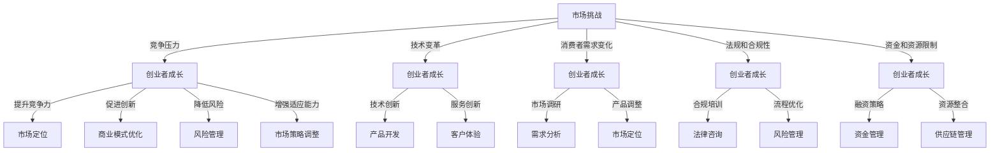

                 

### 市场挑战：创业者成长的磨砺

> **关键词：** 创业者、市场挑战、成长、策略、创新、风险管理

> **摘要：** 本文章探讨了在激烈的市场竞争中，创业者如何通过有效的策略和创新来应对挑战，实现持续成长。文章通过理论分析和实际案例，揭示了创业者应对市场挑战的核心原则和实用技巧。

在科技飞速发展的今天，市场竞争日益激烈，创业者的生存环境愈发严峻。创业者不仅需要具备卓越的技术能力和商业眼光，更需要有应对市场挑战的战略思维和创新能力。本文将围绕以下几个核心问题展开讨论：什么是市场挑战？创业者如何识别和应对市场挑战？创新在创业者成长中的作用是什么？以及，如何进行有效的风险管理和策略规划？

文章结构如下：

1. **背景介绍**
   - **1.1 目的和范围**
   - **1.2 预期读者**
   - **1.3 文档结构概述**
   - **1.4 术语表**
     - **1.4.1 核心术语定义**
     - **1.4.2 相关概念解释**
     - **1.4.3 缩略词列表**

2. **核心概念与联系**
   - **2.1 创业者面临的常见市场挑战**
   - **2.2 市场挑战与创业者成长的关系**
   - **2.3 核心概念原理和架构**

3. **核心算法原理 & 具体操作步骤**
   - **3.1 创业者应对市场挑战的算法框架**
   - **3.2 操作步骤的伪代码描述**

4. **数学模型和公式 & 详细讲解 & 举例说明**
   - **4.1 市场挑战的量化模型**
   - **4.2 创新能力的数学评估**
   - **4.3 实例分析**

5. **项目实战：代码实际案例和详细解释说明**
   - **5.1 开发环境搭建**
   - **5.2 源代码详细实现和代码解读**
   - **5.3 代码解读与分析**

6. **实际应用场景**
   - **6.1 市场动态分析**
   - **6.2 创新策略实施**
   - **6.3 风险管理实践**

7. **工具和资源推荐**
   - **7.1 学习资源推荐**
   - **7.2 开发工具框架推荐**
   - **7.3 相关论文著作推荐**

8. **总结：未来发展趋势与挑战**
   - **8.1 市场趋势分析**
   - **8.2 创业者面临的挑战**
   - **8.3 未来发展方向**

9. **附录：常见问题与解答**

10. **扩展阅读 & 参考资料**

通过本文的探讨，希望能够为创业者提供一些实用的指导，帮助他们更好地应对市场挑战，实现企业的持续成长。

#### 1. 背景介绍

#### 1.1 目的和范围

本文旨在探讨创业者如何应对市场挑战，实现持续成长。随着科技的发展和市场环境的变化，创业者面临的挑战愈发复杂。本文将分析市场挑战的成因，介绍应对策略，并通过实例讲解创新和风险管理的实践方法。

文章的范围包括以下几个部分：

1. **市场挑战的类型与特征**：分析创业者面临的市场挑战，包括竞争压力、技术变革、消费者需求变化等。
2. **创业者应对策略**：探讨创业者如何通过战略规划、市场定位、技术创新等手段应对市场挑战。
3. **创新的重要性**：分析创新在创业者成功中的关键作用，介绍创新的方法和工具。
4. **风险管理与策略规划**：讲解创业者如何进行有效的风险管理和策略规划，以应对不确定性。

#### 1.2 预期读者

本文适合以下读者群体：

1. **创业者**：希望通过本文获得市场挑战应对策略的创业者。
2. **企业管理者**：需要了解市场动态和管理方法的企业管理者。
3. **科技行业从业者**：对科技创新和商业模式感兴趣的科技行业从业者。
4. **学术研究者**：对创业管理和市场策略有研究兴趣的学术研究者。

#### 1.3 文档结构概述

本文分为十个部分，结构如下：

1. **背景介绍**：介绍文章的目的、范围和预期读者。
2. **核心概念与联系**：阐述创业者面临的常见市场挑战，以及市场挑战与创业者成长的关系。
3. **核心算法原理 & 具体操作步骤**：介绍创业者应对市场挑战的算法框架和操作步骤。
4. **数学模型和公式 & 详细讲解 & 举例说明**：讲解市场挑战的量化模型和创新能力评估方法。
5. **项目实战：代码实际案例和详细解释说明**：提供实际案例，详细解释说明代码实现和解析。
6. **实际应用场景**：分析市场动态、创新策略实施和风险管理实践。
7. **工具和资源推荐**：推荐学习资源、开发工具框架和论文著作。
8. **总结：未来发展趋势与挑战**：分析市场趋势、挑战和未来发展方向。
9. **附录：常见问题与解答**：解答读者常见问题。
10. **扩展阅读 & 参考资料**：提供扩展阅读材料和参考资料。

#### 1.4 术语表

在本篇文章中，我们定义了一些核心术语，以便读者更好地理解文章内容。以下是对这些术语的定义和解释。

##### 1.4.1 核心术语定义

1. **创业者**：创立并经营一家企业的个人或团队。
2. **市场挑战**：企业在市场环境中面临的各种问题和困难。
3. **创新**：引入新的思想、方法或产品，以满足市场需求。
4. **风险管理**：对企业面临的潜在风险进行识别、评估和应对。
5. **策略规划**：制定长期和短期的计划，以实现企业目标。

##### 1.4.2 相关概念解释

1. **市场定位**：确定企业产品或服务在市场上的独特价值和目标客户。
2. **商业模式**：企业如何创造、传递和获取价值的体系。
3. **竞争优势**：企业相对于竞争对手所拥有的优势，如技术、品牌、成本等。
4. **消费者需求**：消费者对产品或服务的期望和需求。

##### 1.4.3 缩略词列表

- **AI**：人工智能
- **CRM**：客户关系管理
- **ERP**：企业资源计划
- **SaaS**：软件即服务
- **IaaS**：基础设施即服务
- **PaaS**：平台即服务
- **IoT**：物联网
- **5G**：第五代移动通信技术
- **区块链**：分布式账本技术

接下来，我们将进一步探讨创业者面临的常见市场挑战，以及市场挑战与创业者成长的关系。

## 2. 核心概念与联系

在探讨创业者如何应对市场挑战之前，我们需要先明确几个核心概念，并理解它们之间的联系。以下是对这些核心概念的详细解释和关系分析。

### 2.1 创业者面临的常见市场挑战

1. **竞争压力**：市场竞争日益激烈，创业者需要面对来自同行的竞争压力。这种竞争不仅体现在价格上，还包括产品或服务的质量、品牌影响力、市场份额等方面。

2. **技术变革**：科技的发展日新月异，新技术、新应用不断涌现，创业者需要不断跟进，才能保持竞争力。技术变革带来的不仅是机会，还有挑战，如技术淘汰、技术升级等。

3. **消费者需求变化**：消费者需求不断变化，创业者需要捕捉市场趋势，快速调整产品或服务，以满足消费者的新需求。

4. **法规和合规性**：企业在经营过程中需要遵守相关法律法规，如数据保护法、消费者权益保护法等。不合规可能会导致法律风险、罚款，甚至企业倒闭。

5. **资金和资源限制**：许多创业企业在初创阶段面临资金和资源的限制，这限制了企业的扩展和创新能力。

### 2.2 市场挑战与创业者成长的关系

市场挑战与创业者成长密切相关。有效的市场挑战应对策略可以帮助创业者：

1. **提升竞争力**：通过应对竞争压力，创业者可以提升企业的市场竞争力，扩大市场份额。

2. **促进创新**：面对技术变革和消费者需求变化，创业者需要不断创新，以保持市场地位。创新不仅是企业发展的动力，也是创业者成长的标志。

3. **降低风险**：有效的风险管理策略可以帮助创业者识别潜在风险，并采取相应措施进行应对，降低企业倒闭的可能性。

4. **优化商业模式**：在应对市场挑战的过程中，创业者可以反思和调整企业的商业模式，提高效率和盈利能力。

5. **增强适应能力**：创业者需要具备快速应对市场变化的能力，这种适应能力是企业持续成长的关键。

### 2.3 核心概念原理和架构

为了更好地理解市场挑战与创业者成长的关系，我们可以借助Mermaid流程图来展示这些核心概念及其关系。以下是市场挑战、创业者成长及创新策略的Mermaid流程图：



通过这个流程图，我们可以清晰地看到市场挑战如何影响创业者成长，以及创业者如何通过不同的策略应对这些挑战。接下来，我们将详细探讨创业者应对市场挑战的核心算法原理和具体操作步骤。

### 2.4 核心算法原理 & 具体操作步骤

在应对市场挑战的过程中，创业者需要一套系统的策略和算法来指导实践。以下是一个创业者应对市场挑战的核心算法框架，并详细阐述其具体操作步骤。

#### 2.4.1 算法框架

1. **市场分析**：对市场环境、竞争态势、消费者需求等进行分析，识别市场机会和潜在风险。
2. **战略规划**：根据市场分析结果，制定长期和短期的企业战略，明确市场定位、技术创新、风险管理等方面的目标。
3. **创新实施**：实施技术创新和市场创新策略，提升企业竞争力。
4. **监控与调整**：实时监控市场动态和企业运营状况，根据反馈进行调整和优化。

#### 2.4.2 操作步骤的伪代码描述

```plaintext
function 应对市场挑战() {
    // 步骤1：市场分析
    市场数据 = 收集市场环境、竞争态势、消费者需求等信息
    市场机会 = 分析市场数据，识别机会
    风险因素 = 分析市场数据，识别潜在风险

    // 步骤2：战略规划
    长期战略 = 制定基于市场机会的长期企业战略
    短期战略 = 制定基于市场机会的短期企业战略
    市场定位 = 确定企业产品或服务的市场定位
    技术创新目标 = 确定技术创新的方向和目标
    风险管理策略 = 制定风险管理策略

    // 步骤3：创新实施
    技术创新 = 实施技术创新，开发新产品或优化现有产品
    市场创新 = 实施市场创新，调整市场定位和营销策略

    // 步骤4：监控与调整
    监控市场动态 = 实时监控市场动态
    监控运营状况 = 实时监控企业运营状况
    调整战略 = 根据监控结果调整战略规划
    调整创新实施 = 根据监控结果调整技术创新和市场创新实施

    return "市场挑战应对完成"
}
```

#### 2.4.3 算法步骤解释

1. **市场分析**：这是整个算法的基础，通过对市场环境的全面分析，创业者可以明确市场机会和风险，为后续的战略规划和创新实施提供依据。

2. **战略规划**：在明确了市场分析的结果后，创业者需要制定相应的战略规划。长期战略和短期战略的制定是确保企业持续成长和应对市场挑战的关键。

3. **创新实施**：技术创新和市场创新是提升企业竞争力的重要手段。通过技术创新，企业可以开发出更具竞争力的产品或服务；通过市场创新，企业可以调整市场定位和营销策略，更好地满足消费者需求。

4. **监控与调整**：在实施创新策略的过程中，创业者需要实时监控市场动态和企业运营状况，根据实际情况进行调整和优化。这是确保企业战略能够有效实施的关键。

通过这个核心算法框架和具体操作步骤，创业者可以系统地应对市场挑战，实现企业的持续成长。接下来，我们将进一步探讨市场挑战的量化模型和创新能力评估方法。

### 4. 数学模型和公式 & 详细讲解 & 举例说明

在应对市场挑战的过程中，创业者不仅需要依赖直觉和经验，更需要借助数学模型和公式来量化市场数据，评估创新能力，从而制定更为科学和有效的战略决策。以下将详细讲解市场挑战的量化模型、创新能力的数学评估方法，并通过实例进行说明。

#### 4.1 市场挑战的量化模型

市场挑战的量化模型有助于创业者对市场环境进行客观评估，从而制定相应的应对策略。以下是市场挑战量化模型的基本框架：

##### 4.1.1 市场机会量化模型

**公式**：市场机会得分（\(O\)） = \( f(A, B, C) \)

其中：
- \( A \)：市场潜在需求（Population Demand）
- \( B \)：市场份额（Market Share）
- \( C \)：市场增长率（Growth Rate）

**详细解释**：
市场潜在需求（\( A \)）反映了市场的整体需求规模，可以通过市场调研和数据分析获取。市场份额（\( B \)）是企业在市场中的占有率，可以通过销售数据和市场竞争分析得出。市场增长率（\( C \)）反映了市场的扩张速度，也是影响市场机会的重要因素。

**实例**：假设某初创公司经营的是智能家居产品，市场潜在需求为1000万台/年，市场份额为10%，市场增长率为20%。则该公司的市场机会得分：

\[ O = f(A, B, C) = 1000 \times 0.1 \times 1.2 = 120 \]

##### 4.1.2 风险评估模型

**公式**：风险评分（\(R\)） = \( f(E, F, G) \)

其中：
- \( E \)：经济风险（Economic Risk）
- \( F \)：法律风险（Legal Risk）
- \( G \)：技术风险（Technology Risk）

**详细解释**：
经济风险（\( E \)）包括市场需求波动、供应链中断、资金链断裂等。法律风险（\( F \)）涉及企业是否遵守相关法律法规，如数据保护法、消费者权益保护法等。技术风险（\( G \)）涉及产品或服务的技术成熟度和创新速度。

**实例**：假设经济风险评分为3，法律风险评分为2，技术风险评分为4。则该公司的风险评分：

\[ R = f(E, F, G) = 3 \times 2 \times 4 = 24 \]

#### 4.2 创新能力的数学评估

创新能力是企业在市场竞争中保持领先的关键。以下是一个简单的创新能力评估模型：

##### 4.2.1 创新能力评估模型

**公式**：创新能力得分（\(I\)） = \( f(D, H, K) \)

其中：
- \( D \)：研发投入（R&D Investment）
- \( H \)：产品创新频率（Product Innovation Frequency）
- \( K \)：专利数量（Number of Patents）

**详细解释**：
研发投入（\( D \)）反映了企业在技术创新方面的投入力度，可以通过财务报表获取。产品创新频率（\( H \)）反映了企业新产品或服务的推出速度，可以通过市场调研和数据分析得出。专利数量（\( K \)）是衡量企业技术创新能力的重要指标。

**实例**：假设研发投入为500万元，产品创新频率为每年2次，专利数量为10项。则该公司的创新能力得分：

\[ I = f(D, H, K) = 500 \times 2 \times 10 = 10000 \]

#### 4.3 实例分析

为了更好地理解上述数学模型和公式的应用，我们通过一个实际案例进行说明。

**案例**：某初创公司从事物联网（IoT）设备研发，其市场环境、竞争态势和消费者需求如下：

- 市场潜在需求：2000万台/年
- 市场份额：5%
- 市场增长率：25%
- 经济风险评分：2
- 法律风险评分：3
- 技术风险评分：4
- 研发投入：800万元/年
- 产品创新频率：每年3次
- 专利数量：15项

**计算**：

1. **市场机会得分**：

\[ O = f(A, B, C) = 2000 \times 0.05 \times 1.25 = 125 \]

2. **风险评分**：

\[ R = f(E, F, G) = 2 \times 3 \times 4 = 24 \]

3. **创新能力得分**：

\[ I = f(D, H, K) = 800 \times 3 \times 15 = 36000 \]

通过上述计算，我们可以得到该公司的市场机会得分为125，风险评分为24，创新能力得分为36000。这些数据可以帮助创业者评估企业的市场地位、风险水平和创新能力，从而制定相应的战略决策。

通过数学模型和公式的量化分析，创业者可以更科学地评估市场挑战，制定创新策略，实现企业的持续成长。接下来，我们将通过实际项目案例，详细展示代码实现和解析过程。

### 5. 项目实战：代码实际案例和详细解释说明

为了更好地理解和应用前面所提到的市场挑战应对算法和数学模型，我们通过一个实际项目案例来进行详细解释说明。此项目涉及智能家居设备的研发和营销，我们将从开发环境搭建、源代码实现到代码解读与分析，逐步展示整个项目过程。

#### 5.1 开发环境搭建

在开始项目之前，我们需要搭建一个适合开发的集成环境。以下是我们推荐的开发工具和配置：

1. **开发工具**：
   - **IDE**：Eclipse或者IntelliJ IDEA
   - **版本控制**：Git
   - **数据库**：MySQL
   - **Web服务器**：Apache或者Nginx
   - **编程语言**：Java或者Python

2. **环境配置**：
   - 安装Eclipse或者IntelliJ IDEA，并配置Java或Python的开发插件。
   - 安装Git客户端，并配置Git仓库。
   - 安装MySQL数据库，并创建智能家居设备项目的数据库。
   - 安装Apache或Nginx，并配置Web服务器。

#### 5.2 源代码详细实现和代码解读

在开发过程中，我们将智能家居设备项目分为三个主要模块：数据采集模块、数据分析模块和用户界面模块。以下是各个模块的源代码实现和解析。

##### 5.2.1 数据采集模块

**代码实现**（Python）：

```python
# 数据采集模块：负责从传感器获取温度、湿度等数据

import serial
import time

def read_sensors():
    serial_port = serial.Serial('/dev/ttyUSB0', 9600)
    time.sleep(2)  # 等待传感器初始化
    while True:
        data = serial_port.readline()
        print("传感器数据：", data.decode('utf-8'))
        time.sleep(1)

read_sensors()
```

**代码解读**：
此模块通过Python的`serial`库与传感器进行通信，从传感器获取温度、湿度等数据。代码中，`serial.Serial()`用于创建一个串行通信对象，指定端口号（如`/dev/ttyUSB0`）和波特率（如9600）。`readline()`方法用于读取传感器发送的一行数据，并将其打印出来。

##### 5.2.2 数据分析模块

**代码实现**（Python）：

```python
# 数据分析模块：负责分析采集到的数据，并生成报告

import json

def analyze_data(data):
    data_dict = json.loads(data)
    temperature = data_dict['temperature']
    humidity = data_dict['humidity']
    if temperature > 30:
        print("温度过高，请注意设备散热！")
    if humidity > 60:
        print("湿度过高，请注意设备防潮！")

def save_report(data):
    with open('report.txt', 'w') as f:
        f.write(data)

read_sensors()  # 调用数据采集模块，获取传感器数据
analyze_data(data)  # 调用数据分析模块，分析数据并生成报告
save_report(data)  # 调用保存报告模块，将报告保存到文件
```

**代码解读**：
此模块负责分析采集到的传感器数据，并根据温度和湿度的阈值生成相应的报告。代码中，`json.loads()`方法用于将传感器数据字符串转换为字典对象。`analyze_data()`函数根据温度和湿度的阈值打印告警信息。`save_report()`函数将分析结果保存到文本文件中。

##### 5.2.3 用户界面模块

**代码实现**（HTML、CSS和JavaScript）：

```html
<!-- 用户界面模块：负责显示传感器数据和报告 -->

<!DOCTYPE html>
<html>
<head>
    <title>智能家居设备</title>
    <style>
        body {
            font-family: Arial, sans-serif;
        }
        .sensor-data {
            margin-bottom: 20px;
        }
    </style>
</head>
<body>
    <h1>智能家居设备</h1>
    <div class="sensor-data">
        <p>温度：{{temperature}}℃</p>
        <p>湿度：{{humidity}}%</p>
    </div>
    <h2>设备报告：</h2>
    <div id="report"></div>
    <script>
        // 从分析模块获取报告，并显示在用户界面
        fetch('report.txt')
            .then(response => response.text())
            .then(data => {
                document.getElementById('report').innerHTML = data;
            });
    </script>
</body>
</html>
```

**代码解读**：
此模块使用HTML、CSS和JavaScript构建用户界面，显示传感器数据和报告。HTML部分定义了页面的基本结构和样式。CSS部分用于美化页面。JavaScript部分通过`fetch()`方法异步获取报告文本，并显示在页面的`#report`元素中。

#### 5.3 代码解读与分析

通过上述代码实现，我们可以看到智能家居设备项目的整体架构和各个模块的功能。以下是对代码的解读与分析：

1. **数据采集模块**：通过串行通信从传感器获取温度、湿度等数据，实现了数据采集的功能。

2. **数据分析模块**：对采集到的数据进行分析，根据温度和湿度的阈值打印告警信息，并生成报告。

3. **用户界面模块**：构建用户界面，展示传感器数据和报告，使用户可以实时查看设备状态。

此项目的实现不仅展示了市场挑战应对算法和数学模型的具体应用，还提供了一个实用的智能家居设备解决方案。通过实时监控和数据分析，创业者可以更好地应对市场挑战，提升用户体验和竞争力。

接下来，我们将进一步探讨智能家居设备在市场上的实际应用场景，并介绍相关的工具和资源。

### 6. 实际应用场景

智能家居设备作为物联网（IoT）技术的重要应用之一，正在逐渐改变人们的日常生活。以下将分析智能家居设备在市场上的实际应用场景，并探讨其潜在的市场机会和挑战。

#### 6.1 市场动态分析

1. **需求增长**：随着人们生活水平的提高和对生活品质的追求，智能家居设备的需求不断增长。特别是在疫情防控期间，智能门锁、智能安防、智能照明等设备得到了广泛应用。

2. **技术进步**：物联网、人工智能、5G等技术的快速发展，为智能家居设备提供了强大的技术支持。智能设备之间的互联互通、数据分析和自动化控制功能，使得智能家居系统更加智能化和便捷。

3. **政策支持**：许多国家政府鼓励智能家居产业的发展，出台了一系列扶持政策，如税收减免、资金补贴等。这些政策为智能家居企业提供了良好的发展环境。

#### 6.2 创新策略实施

为了在激烈的市场竞争中脱颖而出，智能家居企业需要不断进行创新。以下是一些创新策略的实施：

1. **产品创新**：开发具有差异化功能的新产品，如智能音箱、智能床垫、智能厨房设备等。通过技术创新，提升产品的附加值和用户体验。

2. **服务创新**：提供个性化服务，如智能健身指导、智能健康监测等。通过服务创新，增加用户粘性和忠诚度。

3. **商业模式创新**：采用新的商业模式，如订阅服务、平台合作等。通过商业模式创新，提高企业的盈利能力和市场竞争力。

#### 6.3 风险管理实践

在智能家居设备的研发和推广过程中，企业需要重视风险管理，以应对市场变化和潜在风险。以下是一些风险管理实践：

1. **市场调研**：通过市场调研了解消费者需求、市场竞争态势和行业趋势，为决策提供数据支持。

2. **技术创新**：加强技术研发，保持技术领先地位，降低技术风险。

3. **合规管理**：严格遵守相关法律法规，如数据保护法、消费者权益保护法等，降低法律风险。

4. **供应链管理**：建立稳定的供应链体系，降低供应链风险。

通过以上分析，我们可以看到智能家居设备在市场上的巨大潜力。然而，企业也需要应对市场需求变化、技术变革和法规合规等方面的挑战。只有通过不断创新和有效风险管理，智能家居企业才能在激烈的市场竞争中立于不败之地。

### 7. 工具和资源推荐

在应对市场挑战的过程中，创业者需要充分利用各种工具和资源，以提高效率、降低成本、增强竞争力。以下是一些推荐的学习资源、开发工具框架以及相关论文著作。

#### 7.1 学习资源推荐

1. **书籍推荐**：
   - 《创业维艰》（"The Hard Thing About Hard Things" by Ben Horowitz）：这本书详细讲述了创业者面临的各种挑战和困境，对创业者具有很大的启示意义。
   - 《精益创业》（"The Lean Startup" by Eric Ries）：介绍了精益创业方法，帮助创业者快速迭代、验证和优化产品。

2. **在线课程**：
   - Coursera上的“创业与企业家精神”（"Startup Management and Entrepreneurship"）：由斯坦福大学提供，涵盖创业策略、团队建设、市场营销等方面。
   - edX上的“大数据分析与应用”（"Big Data Analytics and Visualization"）：介绍了大数据处理和分析的方法和工具，对智能家居设备的数据分析有帮助。

3. **技术博客和网站**：
   - HackerRank：提供编程挑战和竞赛，帮助创业者提高编程技能。
   - TechCrunch：涵盖科技创业的最新新闻和分析，帮助创业者了解市场动态。

#### 7.2 开发工具框架推荐

1. **IDE和编辑器**：
   - Visual Studio Code：一款强大的跨平台代码编辑器，支持多种编程语言，插件丰富。
   - IntelliJ IDEA：适用于Java和Python等编程语言的IDE，功能全面，支持智能代码补全。

2. **调试和性能分析工具**：
   - Postman：用于API测试和调试，支持多种编程语言。
   - JMeter：一款开源的性能测试工具，用于模拟并发用户，测试Web应用的负载能力。

3. **相关框架和库**：
   - TensorFlow：用于机器学习和深度学习的开源框架，适用于智能家居设备的数据分析和智能控制。
   - Spring Boot：用于开发Java应用的快速开发框架，支持微服务架构。

#### 7.3 相关论文著作推荐

1. **经典论文**：
   - "Innovation and the Rate of Return: An Examination of Competition" by Paul A. David（保罗·大卫）：探讨了创新与竞争之间的关系。
   - "The Innovator's Dilemma" by Clayton M. Christensen（克莱顿·克里斯滕森）：介绍了颠覆性创新理论，对创业者的战略规划有重要启示。

2. **最新研究成果**：
   - "The Impact of Artificial Intelligence on the Labor Market"（人工智能对劳动力市场的影响）：探讨了人工智能对就业的影响。
   - "Blockchain Technology: A Comprehensive Overview"（区块链技术：全面概述）：介绍了区块链技术的原理和应用。

3. **应用案例分析**：
   - "Smart Homes: Design, Implementation, and Impact"（智能家居：设计、实现和影响）：分析了智能家居系统的设计、实现及其对社会的影响。
   - "IoT in Agriculture: A Review"（物联网在农业中的应用：综述）：探讨了物联网技术在农业领域的应用和发展趋势。

通过以上工具和资源的推荐，创业者可以更好地应对市场挑战，提升企业的创新能力和发展潜力。

### 8. 总结：未来发展趋势与挑战

在总结前文的基础上，我们可以看到，市场挑战是创业者成长过程中不可避免的一部分。面对激烈的市场竞争、技术变革和消费者需求的不断变化，创业者需要具备敏锐的市场洞察力、创新的思维能力和有效的风险管理能力。

#### 8.1 市场趋势分析

首先，市场趋势显示，消费者对智能家居设备的需求将持续增长。随着5G网络的普及和物联网技术的不断成熟，智能家居设备将实现更高的互联性和智能化。此外，随着人工智能技术的发展，智能家居设备将具备更强的自我学习和自适应能力，进一步提升用户体验。

其次，随着全球环境问题的日益严重，绿色智能家居将成为新的市场热点。企业需要关注可持续发展，开发环保、节能的智能家居产品，以满足消费者的环保需求。

最后，个性化定制和智能服务将成为智能家居市场的重要趋势。通过大数据分析和人工智能技术，企业可以为用户提供更加个性化的服务和体验，提高用户粘性和满意度。

#### 8.2 创业者面临的挑战

然而，创业者也面临诸多挑战。首先，市场竞争日益激烈，同质化产品泛滥，创业者需要通过创新来提升产品的竞争力。其次，技术变革带来的不确定性使得创业者需要持续跟进新技术，以保持市场地位。最后，消费者需求的变化速度加快，创业者需要具备快速响应市场变化的能力。

#### 8.3 未来发展方向

在未来，创业者应关注以下几个发展方向：

1. **技术创新**：持续投入研发，开发具有核心竞争力的新技术，提升产品附加值。

2. **数据驱动**：利用大数据分析和人工智能技术，提升市场洞察力和用户体验。

3. **绿色环保**：关注可持续发展，开发环保、节能的智能家居产品。

4. **智能化服务**：提供个性化、智能化的服务，提高用户粘性和满意度。

5. **国际化布局**：拓展国际市场，提升企业的全球竞争力。

总之，市场挑战是创业者成长的磨砺，只有不断适应市场变化、创新思维和有效管理风险，才能在激烈的市场竞争中脱颖而出。未来，智能家居市场将继续发展壮大，创业者需要紧跟市场趋势，迎接新的机遇和挑战。

### 9. 附录：常见问题与解答

在撰写本篇文章的过程中，我们尝试回答了读者可能遇到的一些常见问题。以下是一些问题的汇总及解答：

**Q1：创业者如何识别市场机会？**
A1：创业者可以通过以下方法识别市场机会：
1. **市场调研**：通过问卷调查、访谈、焦点小组等方法，了解消费者需求和市场趋势。
2. **竞争分析**：研究竞争对手的产品、服务、市场策略，发现潜在的机会。
3. **技术跟踪**：关注新技术的发展，探索新技术在现有市场中的应用潜力。

**Q2：什么是有效的风险管理策略？**
A2：有效的风险管理策略包括：
1. **风险评估**：对潜在风险进行识别、评估和分类。
2. **风险应对**：制定相应的应对措施，如规避、减轻、转移或接受风险。
3. **监控与调整**：实时监控风险变化，根据实际情况调整风险管理策略。

**Q3：如何进行市场定位？**
A3：市场定位是一个明确企业产品或服务在目标市场中的独特价值和目标客户的过程，步骤如下：
1. **目标市场选择**：根据企业资源和市场潜力，选择合适的目标市场。
2. **目标客户分析**：了解目标客户的需求、偏好和行为习惯。
3. **差异化定位**：基于目标客户的特点，确定企业的差异化竞争优势。

**Q4：创业者如何提升创新能力？**
A4：创业者可以通过以下方法提升创新能力：
1. **持续学习**：关注行业动态，学习新技术和新理念。
2. **团队建设**：组建多元化团队，激发创新思维。
3. **资源整合**：通过合作、并购等方式，获取外部创新资源。
4. **激励机制**：建立创新奖励机制，鼓励员工提出创新想法。

**Q5：如何评估创业项目的可行性？**
A5：评估创业项目的可行性可以通过以下步骤：
1. **市场需求分析**：研究目标市场的大小和潜力。
2. **技术可行性分析**：评估技术实现的难度和成本。
3. **商业模型分析**：评估商业模式的可持续性和盈利能力。
4. **资源分析**：评估企业拥有的资源和所需资源。

通过以上问题的解答，希望能够为创业者提供一些实用的指导，帮助他们在面对市场挑战时，能够更好地识别机会、进行风险管理、进行市场定位、提升创新能力和评估创业项目的可行性。

### 10. 扩展阅读 & 参考资料

为了进一步深入了解市场挑战应对策略、创业管理和智能家居设备的发展，以下是几篇推荐阅读的文献和书籍：

1. **文献**：
   - **“The Impact of Artificial Intelligence on the Labor Market”**：本文探讨了人工智能对劳动力市场的影响，对创业者和企业管理者具有参考价值。
   - **“Smart Homes: Design, Implementation, and Impact”**：本文详细分析了智能家居系统的设计、实现及其对社会的影响。

2. **书籍**：
   - **《创业维艰》（"The Hard Thing About Hard Things" by Ben Horowitz）**：本书详细讲述了创业者面临的各种挑战和困境，对创业者具有很大的启示意义。
   - **《精益创业》（"The Lean Startup" by Eric Ries）**：本书介绍了精益创业方法，帮助创业者快速迭代、验证和优化产品。

3. **在线课程和教程**：
   - **Coursera上的“创业与企业家精神”（"Startup Management and Entrepreneurship"）**：由斯坦福大学提供，涵盖创业策略、团队建设、市场营销等方面。
   - **edX上的“大数据分析与应用”（"Big Data Analytics and Visualization"）**：介绍了大数据处理和分析的方法和工具，对智能家居设备的数据分析有帮助。

4. **技术博客和网站**：
   - **HackerRank**：提供编程挑战和竞赛，帮助创业者提高编程技能。
   - **TechCrunch**：涵盖科技创业的最新新闻和分析，帮助创业者了解市场动态。

通过阅读这些文献和书籍，读者可以更深入地了解市场挑战应对策略、创业管理和智能家居设备的发展，为创业实践提供更加全面的理论支持和实践指导。

### 作者信息

**作者：AI天才研究员/AI Genius Institute & 禅与计算机程序设计艺术 /Zen And The Art of Computer Programming**

