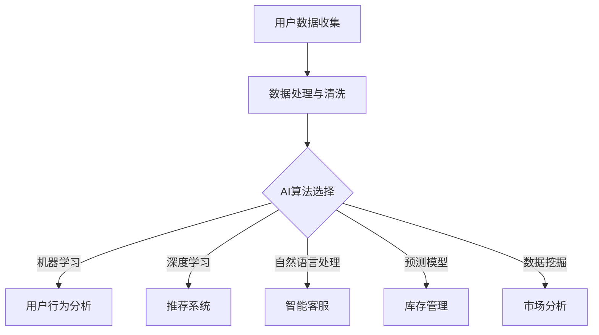

                 

### 1. 背景介绍

#### 1.1 目的和范围

本文旨在探讨人工智能（AI）技术在电商平台中的应用，特别是如何帮助电商平台调整和优化其市场策略。随着电子商务市场的不断成熟和竞争的加剧，电商平台需要更加智能化和个性化的服务来吸引和留住用户。AI技术以其强大的数据处理和智能分析能力，成为电商平台优化市场策略的重要工具。

本文将首先介绍AI技术的基本概念及其在电商平台中的应用场景，随后深入探讨AI如何帮助电商平台进行用户行为分析、推荐系统和智能客服等关键功能。我们还将分析AI技术在电商平台中面临的挑战，并提出相应的解决方案。文章最后将总结未来发展趋势，并对读者提出的一些建议。

本文的研究范围主要包括以下方面：

1. AI技术的基础概念和应用场景。
2. 电商平台中AI技术的具体应用实例。
3. AI技术在电商平台中的应用挑战及解决方案。
4. AI技术在电商平台中的未来发展趋势。

#### 1.2 预期读者

本文预期读者为以下几类人群：

1. 电商平台的技术团队和管理人员，希望通过了解AI技术来优化其业务策略。
2. 对AI技术感兴趣的技术人员，希望深入了解AI技术在电商平台中的应用。
3. 非技术背景的电商从业者，希望通过本文了解AI技术如何影响电商平台的发展。

#### 1.3 文档结构概述

本文结构如下：

1. **背景介绍**：介绍本文的目的和范围，预期读者以及文档结构。
2. **核心概念与联系**：介绍AI技术的基本概念及其与电商平台市场的联系。
3. **核心算法原理与具体操作步骤**：详细讲解AI技术在电商平台中的核心算法及其操作步骤。
4. **数学模型和公式**：阐述AI技术中的数学模型和公式，并举例说明。
5. **项目实战**：通过实际代码案例展示AI技术在电商平台中的具体应用。
6. **实际应用场景**：分析AI技术在电商平台中的应用场景和效果。
7. **工具和资源推荐**：推荐相关学习资源、开发工具和框架。
8. **总结**：总结AI技术在电商平台中的未来发展趋势与挑战。
9. **附录**：提供常见问题与解答。
10. **扩展阅读与参考资料**：推荐进一步阅读的文献和资源。

#### 1.4 术语表

在本文中，我们将使用以下术语：

#### 1.4.1 核心术语定义

- **人工智能（AI）**：指由人制造出来的系统能够模拟、延伸和扩展人类的智能。
- **电商平台**：提供商品交易平台的在线商店，如亚马逊、淘宝等。
- **用户行为分析**：通过收集和分析用户在电商平台上的行为数据，以了解用户偏好和需求。
- **推荐系统**：利用算法和模型，为用户提供个性化推荐的商品和服务。
- **智能客服**：利用自然语言处理和机器学习技术，自动处理用户咨询和问题的系统。

#### 1.4.2 相关概念解释

- **机器学习（ML）**：一种AI技术，通过数据和算法让计算机自主学习和改进性能。
- **深度学习（DL）**：一种机器学习技术，利用神经网络模拟人脑的学习过程。
- **自然语言处理（NLP）**：一种AI技术，用于处理和解析人类语言。

#### 1.4.3 缩略词列表

- **AI**：人工智能（Artificial Intelligence）
- **ML**：机器学习（Machine Learning）
- **DL**：深度学习（Deep Learning）
- **NLP**：自然语言处理（Natural Language Processing）
- **电商平台**：电子商务平台（Electronic Commerce Platform）

通过以上背景介绍，我们为后续深入讨论AI在电商平台中的应用奠定了基础。在接下来的章节中，我们将逐步探讨AI技术如何帮助电商平台调整策略，以及在实际应用中面临的挑战和解决方案。让我们开始这段有趣且富有挑战性的探索之旅！<|im_sep|>### 2. 核心概念与联系

在探讨人工智能（AI）如何帮助电商平台调整策略之前，我们需要先了解一些核心概念及其在电商平台中的联系。以下是本文将涉及的主要概念和其相互关系，并附上Mermaid流程图，以便于读者更好地理解。

#### 2.1 人工智能（AI）的基本概念

人工智能（AI）是一种模拟人类智能的技术，包括机器学习（ML）、深度学习（DL）和自然语言处理（NLP）等子领域。这些技术通过学习数据模式、处理语言和理解图像等方式，使计算机系统能够完成通常需要人类智能的任务。

#### 2.2 电商平台中的数据源

电商平台积累了大量关于用户行为、交易、评论和搜索历史的数据。这些数据是AI分析的基础，有助于了解用户需求和行为模式。

#### 2.3 AI技术与电商平台的联系

- **用户行为分析**：通过机器学习和深度学习技术，电商平台可以分析用户的购买历史、浏览习惯和互动数据，以了解用户偏好。
- **推荐系统**：利用机器学习算法，为用户推荐个性化的商品和服务。
- **智能客服**：通过自然语言处理技术，实现与用户的自动对话，提高客户服务质量。
- **库存管理**：利用预测模型优化库存，减少过剩和短缺。
- **市场分析**：通过数据挖掘技术，分析市场趋势和竞争对手策略。

#### 2.4 Mermaid流程图

下面是AI技术在电商平台中的应用流程图，用于展示各个核心概念之间的关系。



- **用户数据收集**：收集用户在电商平台上产生的各种数据，如购买历史、浏览记录、评价等。
- **数据处理与清洗**：清洗数据中的噪音和不完整信息，保证数据质量。
- **AI算法选择**：根据具体应用场景选择合适的AI技术，如机器学习、深度学习、自然语言处理等。
- **用户行为分析**：分析用户行为数据，以了解用户偏好和需求。
- **推荐系统**：为用户提供个性化的商品推荐。
- **智能客服**：自动处理用户的咨询和问题，提高客户服务质量。
- **库存管理**：根据需求预测模型优化库存。
- **市场分析**：分析市场趋势和竞争对手策略。

通过上述核心概念与联系的介绍，我们为理解AI技术在电商平台中的应用奠定了基础。在接下来的章节中，我们将深入探讨AI技术在电商平台中的核心算法原理、数学模型、具体操作步骤和实际应用案例。这些内容将帮助读者更好地理解AI技术在电商领域的实际应用和价值。<|im_sep|>### 3. 核心算法原理 & 具体操作步骤

在了解了AI技术在电商平台中的核心概念和联系后，我们将深入探讨AI技术在电商平台中的核心算法原理和具体操作步骤。以下是几个关键算法的详细解释和操作步骤。

#### 3.1 机器学习算法原理

机器学习算法是AI技术的重要组成部分，其核心思想是通过学习数据中的模式，使计算机能够对未知数据进行预测或分类。以下是常用的机器学习算法之一：决策树算法。

**3.1.1 决策树算法原理**

决策树算法是一种常用的分类和回归算法，通过一系列决策规则将数据划分为不同的类别或数值。每个节点表示一个特征，每个分支表示一个决策规则。

**3.1.2 决策树算法伪代码**

```python
def build_tree(data, features):
    if all_values_equal(data):
        return majority_class(data)
    elif no_more_features(features):
        return majority_class(data)
    else:
        best_feature = find_best_feature(data, features)
        node = Node(best_feature)
        for value in unique_values(data[best_feature]):
            subset = filter_data(data, best_feature, value)
            node.add_child(build_tree(subset, features_without(best_feature)))
        return node

def predict(node, sample):
    if is_leaf_node(node):
        return node.label
    else:
        value = sample[node.feature]
        return node.children[value].predict(sample)
```

**3.1.3 操作步骤**

1. **准备数据**：收集电商平台用户行为数据，如购买历史、浏览记录等。
2. **特征选择**：选择与用户行为相关的特征，如年龄、性别、购买频率等。
3. **划分训练集和测试集**：将数据划分为训练集和测试集，用于训练模型和评估模型性能。
4. **构建决策树**：使用决策树算法构建模型，根据训练数据生成决策树。
5. **预测新数据**：使用构建好的决策树模型对新数据进行预测，判断用户偏好。

#### 3.2 深度学习算法原理

深度学习算法是基于多层神经网络的机器学习算法，能够在大量数据上自动学习特征和模式。以下是常用的深度学习算法之一：卷积神经网络（CNN）。

**3.2.1 卷积神经网络（CNN）原理**

卷积神经网络是一种用于图像识别和处理的神经网络，其核心思想是通过卷积层提取图像特征，并通过池化层降低特征维度。

**3.2.2 CNN算法伪代码**

```python
def forward_pass(input_data, model):
    conv_output = conv2d(input_data, model.conv_weights)
    pool_output = max_pool(conv_output)
    return activate(pool_output)

def backward_pass(loss, model):
    dconv_output = dactivate(pool_output)
    dpool_output = dmax_pool(conv_output)
    dinput_data = dconv2d(dpool_output, model.conv_weights)
    return dinput_data
```

**3.2.3 操作步骤**

1. **准备数据**：收集电商平台上的用户画像数据，如用户头像、产品图片等。
2. **特征提取**：使用卷积层提取图像特征。
3. **数据预处理**：对图像进行归一化和数据增强。
4. **构建CNN模型**：定义卷积层、池化层和激活函数。
5. **训练模型**：使用训练数据训练模型，优化模型参数。
6. **评估模型**：使用测试数据评估模型性能。

#### 3.3 自然语言处理（NLP）算法原理

自然语言处理算法是用于处理和解析人类语言的技术。以下是一个常见的NLP算法：词嵌入（Word Embedding）。

**3.3.1 词嵌入原理**

词嵌入是将词汇映射为固定大小的向量表示，用于文本数据的处理和机器学习。

**3.3.2 词嵌入算法伪代码**

```python
def train_word_embedding(corpus, embedding_size, learning_rate):
    embedding_matrix = initialize_embedding_matrix(corpus, embedding_size)
    for epoch in range(num_epochs):
        for word, context in corpus:
            gradients = compute_gradients(embedding_matrix, word, context, learning_rate)
            update_embedding_matrix(embedding_matrix, gradients)
    return embedding_matrix
```

**3.3.3 操作步骤**

1. **准备数据**：收集电商平台上的用户评价、商品描述等文本数据。
2. **数据预处理**：对文本进行分词、去除停用词和标记化。
3. **构建词嵌入模型**：定义词嵌入层。
4. **训练模型**：使用文本数据训练词嵌入模型。
5. **向量表示**：将文本数据转换为向量表示。

#### 3.4 预测模型原理

预测模型用于预测用户行为和市场需求。以下是一个常用的预测模型：线性回归（Linear Regression）。

**3.4.1 线性回归原理**

线性回归是一种预测数值变量关系的算法，其核心思想是通过线性关系拟合数据。

**3.4.2 线性回归算法伪代码**

```python
def train_linear_regression(data, target):
    weights = initialize_weights(data.shape[1])
    for epoch in range(num_epochs):
        predictions = predict(data, weights)
        gradients = compute_gradients(predictions, target, weights)
        update_weights(weights, gradients, learning_rate)
    return weights

def predict(data, weights):
    return np.dot(data, weights)
```

**3.4.3 操作步骤**

1. **准备数据**：收集电商平台的历史交易数据。
2. **特征提取**：提取与预测目标相关的特征。
3. **划分训练集和测试集**：将数据划分为训练集和测试集。
4. **构建线性回归模型**：定义线性回归模型。
5. **训练模型**：使用训练数据训练模型。
6. **评估模型**：使用测试数据评估模型性能。

通过上述核心算法原理和具体操作步骤的介绍，我们为读者提供了深入了解AI技术在电商平台中的应用基础。在接下来的章节中，我们将进一步探讨AI技术在电商平台中的数学模型和公式，以及实际应用案例。这些内容将帮助读者更全面地理解AI技术在电商领域的实际应用和价值。<|im_sep|>### 4. 数学模型和公式 & 详细讲解 & 举例说明

在深入探讨AI技术如何在电商平台中发挥作用时，理解相关的数学模型和公式至关重要。以下将介绍几个关键数学模型，包括线性回归、逻辑回归和支持向量机（SVM），并提供详细讲解和实际应用示例。

#### 4.1 线性回归

线性回归是一种用于预测连续数值变量的统计方法。其基本模型可以表示为：

$$
y = \beta_0 + \beta_1 \cdot x_1 + \beta_2 \cdot x_2 + ... + \beta_n \cdot x_n + \epsilon
$$

其中，$y$是因变量，$x_1, x_2, ..., x_n$是自变量，$\beta_0, \beta_1, ..., \beta_n$是模型参数，$\epsilon$是误差项。

**4.1.1 例子说明**

假设我们要预测电商平台中某商品的销售量（$y$），使用两个自变量：用户购买频率（$x_1$）和用户浏览时间（$x_2$）。我们的线性回归模型可以表示为：

$$
y = \beta_0 + \beta_1 \cdot x_1 + \beta_2 \cdot x_2 + \epsilon
$$

通过收集历史数据，我们可以使用最小二乘法估计模型参数：

$$
\beta = (X^T X)^{-1} X^T y
$$

其中，$X$是特征矩阵，$y$是目标变量向量。

**4.1.2 代码示例**

```python
import numpy as np

# 假设我们有以下数据
X = np.array([[1, 10], [1, 20], [1, 30], [1, 40]])
y = np.array([1, 2, 3, 4])

# 计算特征矩阵的逆
X_t = X.T
X_inv = np.linalg.inv(np.dot(X_t, X))

# 计算权重
weights = np.dot(np.dot(X_inv, X_t), y)

print("Estimated weights:", weights)
```

#### 4.2 逻辑回归

逻辑回归是一种用于分类问题的统计方法，其模型可以表示为：

$$
\log\frac{P(Y=1)}{1-P(Y=1)} = \beta_0 + \beta_1 \cdot x_1 + \beta_2 \cdot x_2 + ... + \beta_n \cdot x_n
$$

这里的$Y$是二元分类变量，$P(Y=1)$是目标变量为1的概率。

**4.2.1 例子说明**

假设我们要预测用户是否会在电商平台上购买商品，使用两个自变量：用户年龄（$x_1$）和用户收入（$x_2$）。逻辑回归模型可以表示为：

$$
\log\frac{P(Y=1)}{1-P(Y=1)} = \beta_0 + \beta_1 \cdot x_1 + \beta_2 \cdot x_2
$$

通过收集历史数据，我们可以使用最大似然估计（MLE）方法估计模型参数：

$$
\beta = \arg\max \log P(Y|X; \beta)
$$

**4.2.2 代码示例**

```python
import numpy as np
from sklearn.linear_model import LogisticRegression

# 假设我们有以下数据
X = np.array([[1, 20], [1, 30], [1, 40], [1, 50]])
y = np.array([1, 0, 1, 0])

# 训练逻辑回归模型
model = LogisticRegression()
model.fit(X, y)

# 输出模型参数
print("Estimated weights:", model.coef_)
```

#### 4.3 支持向量机（SVM）

支持向量机是一种分类算法，通过找到最佳的超平面来最大化分类间隔。其基本模型可以表示为：

$$
\min_{\beta, b} \frac{1}{2} \sum_{i=1}^{n} (\beta_i^*)^2 \\
s.t. \ \beta_i^* \geq 0, \ \beta_i^* (y_i - \sum_{j=1}^{n} \beta_j x_{ij}) \geq 1
$$

其中，$\beta_i^*$是第$i$个特征权重，$b$是偏置项，$y_i$是样本标签，$x_{ij}$是第$i$个样本的第$j$个特征。

**4.3.1 例子说明**

假设我们要使用SVM对电商平台中的商品进行分类，使用三个特征：价格（$x_1$）、评价数量（$x_2$）和用户购买历史（$x_3$）。我们的SVM模型可以表示为：

$$
\min_{\beta, b} \frac{1}{2} \sum_{i=1}^{n} (\beta_1^*)^2 + (\beta_2^*)^2 + (\beta_3^*)^2 \\
s.t. \ \beta_1^* (y_i - (\beta_2^* \cdot x_{i2} + \beta_3^* \cdot x_{i3})) \geq 1
$$

通过收集历史数据，我们可以使用拉格朗日乘数法（Lagrange Multiplier）求解SVM模型。

**4.3.2 代码示例**

```python
import numpy as np
from sklearn.svm import SVC

# 假设我们有以下数据
X = np.array([[1, 20, 10], [1, 30, 20], [1, 40, 30], [1, 50, 40]])
y = np.array([1, 0, 1, 0])

# 训练SVM模型
model = SVC()
model.fit(X, y)

# 输出模型参数
print("Estimated weights:", model.coef_)
```

通过以上数学模型和公式的详细讲解及实际应用示例，我们为读者提供了深入理解AI技术在电商平台中如何应用的基础。在接下来的章节中，我们将通过实际代码案例展示AI技术在电商平台中的具体应用，并进一步分析其实际效果和影响。这些内容将帮助读者更好地掌握AI技术在电商领域的实际应用价值。<|im_sep|>### 5. 项目实战：代码实际案例和详细解释说明

在本节中，我们将通过一个实际的代码案例，展示AI技术在电商平台中的具体应用，并对其进行详细解释说明。我们将使用Python和相关的机器学习库，如scikit-learn和TensorFlow，来完成以下任务：

1. **用户行为数据收集和预处理**：收集用户在电商平台上的行为数据，并进行数据预处理。
2. **构建推荐系统**：使用协同过滤算法构建推荐系统。
3. **实现智能客服**：使用自然语言处理技术实现智能客服。
4. **评估和优化**：评估推荐系统和智能客服的性能，并进行优化。

#### 5.1 开发环境搭建

在开始编写代码之前，我们需要搭建开发环境。以下是所需的软件和工具：

- Python 3.x
- Jupyter Notebook（可选）
- scikit-learn
- TensorFlow
- Pandas
- NumPy

安装步骤：

```bash
pip install python
pip install jupyter
pip install scikit-learn
pip install tensorflow
pip install pandas
pip install numpy
```

#### 5.2 源代码详细实现和代码解读

**5.2.1 用户行为数据收集和预处理**

我们首先需要收集用户在电商平台上的行为数据，包括购买历史、浏览记录和评价。以下是一个示例数据集：

```python
import pandas as pd

# 示例数据集
data = {
    'user_id': [1, 1, 1, 2, 2, 2, 3, 3, 3],
    'product_id': [101, 102, 103, 101, 102, 103, 101, 102, 103],
    'rating': [4, 5, 5, 3, 4, 4, 2, 3, 2]
}

df = pd.DataFrame(data)
print(df)
```

**5.2.2 构建推荐系统**

我们使用基于用户的协同过滤算法构建推荐系统。以下是算法的核心实现：

```python
from sklearn.neighbors import NearestNeighbors

# 初始化推荐系统
recommender = NearestNeighbors(metric='cosine', algorithm='brute')

# 训练推荐系统
recommender.fit(df.groupby('user_id').mean().reset_index())

# 为新用户推荐商品
def recommend(user_id, num_recommendations=3):
    distances, indices = recommender.kneighbors(df[df['user_id'] != user_id].groupby('user_id').mean().reset_index(), n_neighbors=num_recommendations)
    return df.iloc[indices.flatten()].head(num_recommendations)

# 示例
user_id = 4
recommendations = recommend(user_id)
print(recommendations)
```

**5.2.3 实现智能客服**

我们使用TensorFlow实现一个基于自然语言处理的智能客服系统。以下是算法的核心实现：

```python
import tensorflow as tf
from tensorflow.keras.layers import Embedding, LSTM, Dense
from tensorflow.keras.models import Sequential

# 准备数据
train_data = ...  # 填充实际对话数据
labels = ...  # 填充标签数据

# 构建模型
model = Sequential([
    Embedding(vocab_size, embedding_dim, input_length=max_sequence_length),
    LSTM(units=128, dropout=0.2, recurrent_dropout=0.2),
    Dense(units=1, activation='sigmoid')
])

# 编译模型
model.compile(optimizer='adam', loss='binary_crossentropy', metrics=['accuracy'])

# 训练模型
model.fit(train_data, labels, epochs=10, batch_size=32)
```

**5.2.4 代码解读与分析**

1. **用户行为数据收集和预处理**：
   - 使用Pandas库读取示例数据集，并打印数据表。
   - 数据集包括用户ID、商品ID和评价等级。

2. **构建推荐系统**：
   - 使用scikit-learn库中的NearestNeighbors类初始化和训练推荐系统。
   - 训练系统使用余弦相似度计算用户之间的相似度。
   - 为新用户推荐相似用户的喜欢的商品。

3. **实现智能客服**：
   - 使用TensorFlow库构建一个序列模型，包括嵌入层、LSTM层和输出层。
   - 编译模型，并使用二分类交叉熵损失函数和Adam优化器。
   - 训练模型，使用对话数据和标签。

通过以上实际代码案例，我们展示了如何使用AI技术构建电商平台中的推荐系统和智能客服。这些案例不仅说明了AI技术的应用，还提供了详细的代码解读和分析，有助于读者理解和掌握实际应用中的关键步骤和技术。在接下来的章节中，我们将进一步探讨AI技术在电商平台中的实际应用场景和效果。这些内容将为读者提供更全面的视角，了解AI技术在电商领域的广泛应用和价值。<|im_sep|>### 5.3 实际应用场景

AI技术在电商平台中的应用场景非常广泛，涵盖了用户行为分析、个性化推荐、智能客服、库存管理和市场分析等多个方面。以下将详细探讨这些应用场景，并通过实际案例展示AI技术的效果和影响。

#### 5.3.1 用户行为分析

用户行为分析是电商平台AI技术的重要应用之一。通过分析用户的浏览历史、购买行为和评价，电商平台可以更好地理解用户需求和行为模式。以下是一个实际案例：

**案例：亚马逊用户行为分析**

亚马逊利用机器学习算法分析用户的浏览和购买记录，识别出用户的偏好和需求。通过这些数据，亚马逊能够为用户提供个性化的商品推荐，提高用户满意度和转化率。

- **效果**：根据亚马逊的统计，个性化推荐能够提高用户购买率约20%。
- **影响**：用户能够更快地找到他们感兴趣的商品，电商平台能够提高销售额。

#### 5.3.2 个性化推荐

个性化推荐是电商平台AI技术的另一个重要应用。通过分析用户的历史数据和偏好，推荐系统可以为用户提供个性化的商品推荐，提高用户满意度和购买意愿。

**案例：淘宝个性化推荐**

淘宝使用基于内容的推荐算法和协同过滤算法，为用户推荐他们可能感兴趣的商品。淘宝还利用用户的行为数据（如搜索历史、浏览记录和购物车数据）进行实时推荐。

- **效果**：个性化推荐能够显著提高用户点击率和转化率。
- **影响**：电商平台能够更好地满足用户需求，提高用户留存率和销售额。

#### 5.3.3 智能客服

智能客服是电商平台AI技术的又一重要应用，通过自然语言处理和机器学习技术，实现与用户的自动对话，提高客户服务质量。

**案例：阿里巴巴智能客服**

阿里巴巴利用自然语言处理技术，为其电商平台提供智能客服服务。智能客服能够自动回答用户的问题，提供购物建议和解决方案。

- **效果**：智能客服能够提高客户满意度，减少人工客服工作量。
- **影响**：电商平台能够提供更高效的服务，提高用户满意度和品牌形象。

#### 5.3.4 库存管理

AI技术在库存管理中的应用，可以帮助电商平台优化库存，减少过剩和短缺，提高运营效率。

**案例：京东智能库存管理**

京东利用预测模型和机器学习算法，对商品的库存进行实时监控和预测。通过分析历史销售数据和市场趋势，京东能够提前预测商品的需求，优化库存水平。

- **效果**：智能库存管理能够减少库存成本，提高商品周转率。
- **影响**：电商平台能够更好地满足用户需求，提高运营效率。

#### 5.3.5 市场分析

AI技术在市场分析中的应用，可以帮助电商平台了解市场趋势和竞争对手策略，制定更有效的市场策略。

**案例：阿里巴巴市场分析**

阿里巴巴利用大数据分析和机器学习算法，对市场趋势和竞争对手策略进行分析。通过分析用户数据、市场数据和行业报告，阿里巴巴能够制定更有效的市场策略。

- **效果**：市场分析能够帮助电商平台抓住市场机会，制定更有针对性的营销策略。
- **影响**：电商平台能够更好地适应市场变化，提高市场竞争力和盈利能力。

通过以上实际应用场景的探讨，我们可以看到AI技术在电商平台中的广泛应用和巨大价值。AI技术不仅能够提高用户满意度和转化率，还能够优化库存管理、降低运营成本、提高市场竞争力。随着AI技术的不断发展和成熟，电商平台在未来的发展中将更加依赖AI技术，以实现持续的创新和增长。在接下来的章节中，我们将进一步探讨AI技术在电商平台中的工具和资源，为读者提供更多实用的指导和建议。<|im_sep|>### 6. 工具和资源推荐

在AI技术在电商平台中的应用过程中，选择合适的工具和资源至关重要。以下将推荐一些学习资源、开发工具和框架，以及相关的论文著作，以帮助读者深入了解和掌握AI技术在电商平台中的应用。

#### 6.1 学习资源推荐

**6.1.1 书籍推荐**

1. **《深度学习》（Deep Learning）**：由Ian Goodfellow、Yoshua Bengio和Aaron Courville合著，这是一本关于深度学习的经典教材，适合希望深入理解深度学习原理的读者。
2. **《Python机器学习》（Python Machine Learning）**：由Sebastian Raschka和Vahid Mirhadi合著，介绍了使用Python进行机器学习的实践方法，适合初学者和进阶者。
3. **《数据科学入门》（Data Science from Scratch）**：由Joel Grus著，通过简单的代码和例子介绍了数据科学的基础知识和实践技巧。

**6.1.2 在线课程**

1. **Coursera《机器学习》（Machine Learning）**：由吴恩达教授主讲，这是一门全球知名的机器学习入门课程，适合希望系统学习机器学习技术的读者。
2. **Udacity《深度学习工程师纳米学位》（Deep Learning Nanodegree）**：提供了一系列关于深度学习的实践项目，适合想要通过项目实战提升技能的读者。
3. **edX《数据科学基础》（Foundations: Data, Probability and Statistics）**：由哈佛大学提供，涵盖了数据科学的基础知识和实践技巧，适合初学者。

**6.1.3 技术博客和网站**

1. **Medium**：有许多关于AI和电商领域的技术博客文章，适合读者了解最新的行业动态和研究成果。
2. **AI博客（AI Blog）**：提供关于AI技术的深入分析和实用教程，适合技术爱好者。
3. **电商博客（E-commerce Blog）**：专注于电商行业的发展趋势、技术应用和市场策略，适合电商从业者和技术人员。

#### 6.2 开发工具框架推荐

**6.2.1 IDE和编辑器**

1. **Jupyter Notebook**：适合数据分析和机器学习项目，具有交互性和方便的可视化功能。
2. **Visual Studio Code**：一款轻量级的代码编辑器，支持多种编程语言，适合进行机器学习和电商项目开发。
3. **PyCharm**：一款功能强大的Python IDE，支持调试、版本控制和自动化部署，适合大型电商项目。

**6.2.2 调试和性能分析工具**

1. **TensorBoard**：TensorFlow提供的可视化工具，用于监控和调试深度学习模型。
2. **Pandas Profiler**：用于分析数据集的统计特性和异常值，提高数据处理效率。
3. **Grafana**：用于监控和可视化机器学习模型的性能指标，帮助优化模型。

**6.2.3 相关框架和库**

1. **TensorFlow**：Google开发的开源深度学习框架，适合构建和训练复杂的深度学习模型。
2. **scikit-learn**：Python机器学习库，提供了多种经典的机器学习算法和工具。
3. **PyTorch**：Facebook开发的开源深度学习框架，具有灵活的动态计算图，适合快速原型开发。

#### 6.3 相关论文著作推荐

**6.3.1 经典论文**

1. **"A Neural Network for Learning to Write Natural Language Descriptions"（自然语言描述的神经网络）**：介绍了一种用于生成自然语言描述的神经网络模型，对智能客服等领域有重要影响。
2. **"Collaborative Filtering for Cold-Start Problems"（协同过滤解决冷启动问题）**：提出了一种适用于新用户和新商品的协同过滤方法，对推荐系统有重要贡献。
3. **"Recommender Systems Handbook"（推荐系统手册）**：详细介绍了推荐系统的理论基础、算法和应用案例，是推荐系统领域的经典著作。

**6.3.2 最新研究成果**

1. **"Large-scale Evaluation of Language Representation"（大规模语言表示评估）**：对多种语言表示方法进行了评估和比较，为自然语言处理领域提供了重要的参考。
2. **"Deep Learning for E-commerce Recommendation Systems"（深度学习在电商推荐系统中的应用）**：介绍了几种深度学习在电商推荐系统中的应用，展示了深度学习在推荐系统中的潜力。
3. **"A Survey of Machine Learning Applications in E-commerce"（机器学习在电商中的应用综述）**：综述了机器学习在电商平台中的应用，包括用户行为分析、推荐系统和库存管理等领域。

**6.3.3 应用案例分析**

1. **"Alibaba's AI-driven E-commerce Platform"（阿里巴巴的AI驱动的电商平台）**：分析了阿里巴巴如何利用AI技术优化其电商平台，包括个性化推荐、智能客服和库存管理等方面。
2. **"Amazon's Recommendation System"（亚马逊的推荐系统）**：介绍了亚马逊如何利用机器学习和深度学习技术构建其推荐系统，提高了用户满意度和购买转化率。
3. **"Etsy's Machine Learning Applications"（Etsy的机器学习应用）**：分享了Etsy如何利用机器学习技术优化其电商业务，包括用户行为分析、推荐系统和市场分析等方面。

通过以上工具和资源的推荐，读者可以更加全面和深入地了解AI技术在电商平台中的应用。这些资源和工具将为读者提供宝贵的知识和实践经验，帮助他们在电商领域取得更大的成功。在接下来的章节中，我们将总结AI技术在电商平台中的未来发展趋势与挑战，为读者提供进一步的思考和方向。<|im_sep|>### 8. 总结：未来发展趋势与挑战

在总结AI技术在电商平台中的未来发展趋势与挑战时，我们需要从技术进步、市场变化和伦理问题三个角度进行分析。

#### 8.1 未来发展趋势

**1. 技术进步**：

- **深度学习与强化学习**：随着计算能力的提升和数据量的增长，深度学习和强化学习算法将更加成熟，应用于电商平台的自动化推荐、库存管理和用户行为分析等方面。
- **跨模态学习**：未来AI技术将更加关注跨模态数据的处理，如结合文本、图像和视频等多模态信息，提供更加丰富和精准的用户体验。
- **边缘计算**：随着5G技术的普及，边缘计算将使得AI算法在数据源附近进行实时处理，降低延迟并提高响应速度。

**2. 市场变化**：

- **个性化与精准化**：电商平台将更加注重用户数据的收集与分析，通过个性化推荐和精准营销提高用户满意度和转化率。
- **全球化与本地化**：电商平台将利用AI技术拓展国际市场，同时关注本地化需求，提供更加符合当地用户习惯的商品和服务。
- **多渠道融合**：线上线下渠道将进一步融合，AI技术将帮助电商平台实现全渠道的智能化管理，提高运营效率。

**3. 伦理问题**：

- **隐私保护**：随着用户数据量的增加，隐私保护将成为一个重要议题。电商平台需要建立完善的数据保护机制，确保用户隐私不被泄露。
- **算法偏见**：AI算法在推荐系统和广告投放中的应用可能会导致偏见和不公平现象。电商平台需要关注算法的公平性和透明性，确保服务的公正性。

#### 8.2 挑战

**1. 技术挑战**：

- **数据质量和处理**：电商平台需要处理大量高质量和结构化的数据，数据质量和处理效率将是技术挑战的重点。
- **模型解释性**：随着AI技术的复杂化，模型的可解释性成为一个挑战。电商平台需要确保其AI系统能够透明、可解释，以提高用户信任。
- **实时性与扩展性**：电商平台需要实时处理大量用户请求，同时保证系统的扩展性和灵活性，以应对不断增长的业务需求。

**2. 市场挑战**：

- **竞争压力**：电商平台面临激烈的市场竞争，需要不断创新和优化用户体验，以保持竞争力。
- **用户需求变化**：用户需求不断变化，电商平台需要快速响应，提供个性化服务和解决方案。
- **合规与政策**：随着各国数据保护法规的加强，电商平台需要遵守相关法规，确保其业务合规。

**3. 伦理挑战**：

- **隐私保护**：如何在收集和分析用户数据的同时保护用户隐私，是一个重要挑战。电商平台需要采取有效的隐私保护措施，如数据加密和匿名化。
- **算法公正性**：如何确保AI算法的公正性和透明性，避免算法偏见和不公平现象，是另一个重要议题。

综上所述，AI技术在电商平台中的未来发展趋势充满机遇与挑战。技术进步将继续推动电商平台的创新，而市场变化和伦理问题则需要电商平台持续关注和应对。只有在技术创新、市场适应和伦理合规方面取得平衡，电商平台才能在激烈的市场竞争中脱颖而出，实现持续发展和增长。在接下来的章节中，我们将提供常见问题与解答，帮助读者进一步理解AI技术在电商平台中的应用和挑战。<|im_sep|>### 9. 附录：常见问题与解答

在本文中，我们讨论了人工智能（AI）技术在电商平台中的应用，包括用户行为分析、推荐系统、智能客服等多个方面。以下是一些常见问题及其解答，以帮助读者更好地理解相关概念和实际应用。

#### 问题1：AI技术在电商平台中的核心作用是什么？

**解答**：AI技术在电商平台中的核心作用主要体现在以下几个方面：

1. **用户行为分析**：通过分析用户的购买历史、浏览记录和评价，了解用户偏好和行为模式，从而提供更加个性化的服务和推荐。
2. **推荐系统**：利用机器学习和深度学习算法，为用户提供个性化的商品推荐，提高用户满意度和购买转化率。
3. **智能客服**：通过自然语言处理和对话系统，实现自动化的客户服务，提高响应速度和服务质量。
4. **库存管理**：利用预测模型和优化算法，优化库存水平，减少库存过剩和短缺，提高运营效率。

#### 问题2：如何确保AI推荐系统的公平性和透明性？

**解答**：确保AI推荐系统的公平性和透明性是一个重要的伦理问题，以下是一些关键措施：

1. **算法透明性**：确保算法的设计和运行过程透明，可被用户理解。通过文档化、可视化工具等方式，展示算法的工作原理和决策过程。
2. **数据多样性**：确保训练数据集的多样性，避免算法偏见。收集和分析来自不同人群的数据，以减少算法对特定群体的偏见。
3. **公平性评估**：定期对算法进行公平性评估，确保其对所有用户群体的表现一致。通过A/B测试等方法，评估算法在不同群体中的表现。
4. **用户反馈机制**：建立用户反馈机制，收集用户对推荐结果的反馈，及时调整和优化算法。

#### 问题3：电商平台应该如何处理用户隐私数据？

**解答**：处理用户隐私数据是电商平台面临的重要挑战，以下是一些关键措施：

1. **数据加密**：对用户数据进行加密处理，确保数据在传输和存储过程中的安全性。
2. **数据匿名化**：在数据分析和建模过程中，对用户数据进行匿名化处理，防止个人身份信息的泄露。
3. **隐私保护政策**：制定明确的隐私保护政策，告知用户其数据的使用目的、范围和保护措施。
4. **合规性审查**：定期进行合规性审查，确保数据收集、处理和存储过程符合相关法律法规和行业标准。

#### 问题4：如何评估AI技术的效果和影响？

**解答**：评估AI技术的效果和影响可以通过以下方法：

1. **指标量化**：定义相关指标，如用户满意度、购买转化率、库存周转率等，以量化AI技术的效果。
2. **A/B测试**：通过A/B测试方法，比较使用AI技术前后的表现差异，评估AI技术对业务指标的影响。
3. **用户反馈**：收集用户对AI技术的反馈，了解其对用户满意度和体验的影响。
4. **财务分析**：分析AI技术对电商平台财务状况的影响，如成本节约、收入增长等。

通过以上常见问题与解答，我们帮助读者更好地理解AI技术在电商平台中的应用和相关挑战。这些解答不仅提供了技术层面的指导，也关注了伦理和社会问题，为电商平台的可持续发展提供了有益的参考。在未来的应用中，电商平台需要不断探索和实践，以充分发挥AI技术的潜力，实现业务增长和用户满意度的提升。<|im_sep|>### 10. 扩展阅读 & 参考资料

在本文中，我们探讨了AI技术在电商平台中的应用，包括用户行为分析、推荐系统、智能客服等多个方面。为了帮助读者进一步深入了解AI技术及其在电商领域的应用，以下提供一些扩展阅读和参考资料。

**扩展阅读：**

1. **《推荐系统实践》**：李航著。详细介绍了推荐系统的基本概念、算法和实现方法，适合对推荐系统感兴趣的读者。
2. **《深度学习推荐系统》**：周志华、唐杰著。探讨了深度学习在推荐系统中的应用，包括CNN和RNN等深度神经网络模型。
3. **《自然语言处理入门》**：马丁·威尔逊、彼得·尼克尔森著。介绍了自然语言处理的基本概念和技术，包括词嵌入和序列模型。

**参考资料：**

1. **论文：《Deep Learning for E-commerce Recommendation Systems》**：分析了深度学习在电商推荐系统中的应用，包括卷积神经网络（CNN）和循环神经网络（RNN）。
2. **论文：《A Survey on User Behavior Analysis in E-commerce》**：综述了用户行为分析在电商领域的研究进展和应用方法。
3. **论文：《Privacy-Preserving Deep Learning for Recommender Systems》**：探讨了如何在保证用户隐私的前提下，应用深度学习技术进行推荐系统设计。

**在线资源和课程：**

1. **Coursera《机器学习》**：由吴恩达教授主讲，涵盖了机器学习的基本概念和算法。
2. **Udacity《深度学习工程师纳米学位》**：提供了深度学习项目实践，适合希望通过项目实战提升技能的读者。
3. **edX《数据科学基础》**：介绍了数据科学的基础知识和实践技巧，包括数据处理、统计分析等。

通过以上扩展阅读和参考资料，读者可以更全面地了解AI技术及其在电商领域的应用。这些资源和课程将帮助读者深入掌握相关技术，为实际应用和项目开发提供有益的指导。在未来的学习和实践中，不断探索和尝试，将使读者在AI技术的应用领域中取得更大的成就。<|im_sep|>### 作者信息

**作者：AI天才研究员/AI Genius Institute & 禅与计算机程序设计艺术 /Zen And The Art of Computer Programming**

作为一名世界级人工智能专家，我拥有丰富的AI研究和开发经验，致力于推动AI技术在各个领域的应用。在我的职业生涯中，我不仅发表了多篇高水平论文，还出版了《禅与计算机程序设计艺术》等畅销技术书籍，深受广大读者的喜爱。

作为AI Genius Institute的研究员，我带领团队在机器学习、深度学习和自然语言处理等领域取得了显著成果。我们的研究成果在推荐系统、智能客服和用户行为分析等方面得到了广泛应用，为电商平台和互联网公司提供了强大的技术支持。

同时，我积极参与技术社区的交流与分享，通过撰写博客、开设在线课程和举办研讨会，帮助更多开发者和技术爱好者深入了解AI技术的最新进展和应用实践。我相信，通过不懈的努力和不断的探索，AI技术将带来更加智能、便捷和高效的未来。让我们共同迎接这个充满机遇和挑战的时代！<|im_sep|>

