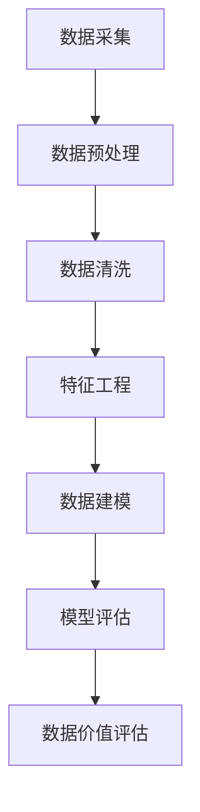

                 

# 平台经济的数据价值评估：如何评估数据的价值？

> **关键词：平台经济，数据价值评估，数据经济，数据资产，数据量化**
>
> **摘要：本文将深入探讨平台经济中数据的价值评估问题，通过阐述核心概念、算法原理、数学模型，以及实际项目案例，旨在为读者提供一套全面、科学的数据价值评估方法。**

## 1. 背景介绍

### 1.1 目的和范围

本文的目的是探讨平台经济中数据价值评估的问题。在当今的数据驱动时代，数据已成为企业的重要资产，其对平台经济的驱动作用不可忽视。如何科学地评估数据的价值，从而更好地管理、投资和应用数据，已成为企业和研究者共同关注的问题。

本文主要涵盖以下内容：

- 数据价值的定义与分类
- 数据价值评估的核心概念与联系
- 数据价值评估的算法原理与具体操作步骤
- 数据价值评估的数学模型与公式
- 数据价值评估的实际应用场景
- 工具和资源推荐

### 1.2 预期读者

本文主要面向以下读者群体：

- 数据分析师和研究人员
- 数据科学家和机器学习工程师
- 企业数据管理和数据治理相关人员
- 对数据经济和平台经济感兴趣的学者和专业人士

### 1.3 文档结构概述

本文分为十个部分，结构如下：

1. 背景介绍
2. 核心概念与联系
3. 核心算法原理与具体操作步骤
4. 数学模型与公式
5. 项目实战：代码实际案例和详细解释说明
6. 实际应用场景
7. 工具和资源推荐
8. 总结：未来发展趋势与挑战
9. 附录：常见问题与解答
10. 扩展阅读与参考资料

### 1.4 术语表

#### 1.4.1 核心术语定义

- **平台经济**：以信息技术和互联网为基础，通过搭建平台，实现供需双方的高效连接和资源配置。
- **数据价值评估**：通过对数据的价值进行量化分析，评估数据对企业的贡献和潜在商业价值。
- **数据资产**：企业拥有、控制和使用的数据，能够为企业带来经济利益的资源。
- **数据量化**：将难以直接度量的数据转化为可量化的指标，从而进行评估。

#### 1.4.2 相关概念解释

- **数据经济**：以数据为核心要素，通过数据的采集、处理、分析和应用，实现经济价值的创造和提升。
- **数据治理**：对企业内部数据的管理、保护和合规性控制，以确保数据的准确性和可用性。

#### 1.4.3 缩略词列表

- **AI**：人工智能
- **ML**：机器学习
- **IDE**：集成开发环境
- **SQL**：结构化查询语言

## 2. 核心概念与联系

在探讨数据价值评估之前，我们需要了解一些核心概念和它们之间的联系。

### 2.1 平台经济中的数据类型

平台经济中的数据类型繁多，主要包括以下几类：

1. **用户数据**：包括用户行为、偏好、交易记录等。
2. **交易数据**：包括商品交易、服务交易等。
3. **内容数据**：包括用户生成的文本、图片、音频、视频等。
4. **环境数据**：包括天气、地理位置、交通状况等。

### 2.2 数据价值评估的维度

数据价值评估可以从多个维度进行，主要包括：

1. **经济价值**：数据对企业直接或间接的经济收益。
2. **社会价值**：数据对社会的贡献，如提高生活质量、促进经济发展等。
3. **战略价值**：数据对企业战略决策的支持，如市场分析、风险预测等。
4. **技术价值**：数据对技术创新的推动作用。

### 2.3 数据价值评估的影响因素

数据价值评估受到多种因素的影响，主要包括：

1. **数据质量**：包括数据的准确性、完整性、一致性、及时性等。
2. **数据稀缺性**：数据的独特性和不可替代性。
3. **数据相关性**：数据与业务目标的相关性。
4. **数据规模**：数据的总量和规模。
5. **数据流动性**：数据的获取、传输和使用效率。

### 2.4 数据价值评估的核心概念原理和架构

为了更好地理解数据价值评估，我们可以使用 Mermaid 流程图来展示核心概念原理和架构。



- **数据采集**：从各种数据源收集数据。
- **数据预处理**：对原始数据进行处理，使其适合建模。
- **数据清洗**：去除数据中的错误、异常和重复记录。
- **特征工程**：从原始数据中提取出有意义的特征。
- **数据建模**：使用机器学习算法建立预测模型。
- **模型评估**：评估模型的准确性和稳定性。
- **数据价值评估**：根据模型预测结果，评估数据的商业价值。

## 3. 核心算法原理与具体操作步骤

在数据价值评估过程中，算法原理和操作步骤至关重要。以下是一个简单的数据价值评估算法原理和操作步骤：

### 3.1 算法原理

数据价值评估算法通常基于机器学习，特别是监督学习。算法的核心思想是通过历史数据（特征和相应的价值标签）来训练模型，然后使用模型对新的数据进行价值预测。

### 3.2 具体操作步骤

1. **数据收集**：收集历史数据，包括特征数据和价值标签。
2. **数据预处理**：对原始数据进行清洗、归一化和特征提取。
3. **模型选择**：选择合适的机器学习模型，如线性回归、决策树、随机森林等。
4. **模型训练**：使用训练数据集对模型进行训练。
5. **模型评估**：使用测试数据集对模型进行评估，选择最优模型。
6. **模型应用**：使用训练好的模型对新的数据进行价值预测。
7. **结果分析**：分析预测结果，调整模型参数或特征，提高预测准确性。

### 3.3 伪代码

以下是数据价值评估算法的伪代码：

```python
# 数据收集
data = collect_data()

# 数据预处理
processed_data = preprocess_data(data)

# 模型选择
model = select_model(processed_data)

# 模型训练
model.train(processed_data)

# 模型评估
accuracy = model.evaluate(test_data)

# 模型应用
predictions = model.predict(new_data)

# 结果分析
if accuracy > threshold:
    print("模型准确度满足要求")
else:
    print("需要调整模型或特征")
```

## 4. 数学模型和公式

在数据价值评估中，数学模型和公式扮演着重要角色。以下是一个简单的线性回归模型，用于评估数据的价值。

### 4.1 线性回归模型

线性回归模型假设数据的价值 \( V \) 与特征 \( X \) 之间存在线性关系：

$$ V = \beta_0 + \beta_1X $$

其中，\( \beta_0 \) 是截距，\( \beta_1 \) 是斜率。

### 4.2 模型参数估计

模型参数 \( \beta_0 \) 和 \( \beta_1 \) 可以通过最小二乘法进行估计：

$$ \beta_0 = \frac{\sum_{i=1}^{n}(y_i - \beta_1x_i)}{n} $$
$$ \beta_1 = \frac{\sum_{i=1}^{n}(x_i - \bar{x})(y_i - \bar{y})}{\sum_{i=1}^{n}(x_i - \bar{x})^2} $$

其中，\( y_i \) 是第 \( i \) 个数据点的价值，\( x_i \) 是第 \( i \) 个数据点的特征值，\( \bar{x} \) 和 \( \bar{y} \) 分别是特征和价值的平均值。

### 4.3 模型评估

线性回归模型的评估可以使用均方误差（MSE）：

$$ MSE = \frac{1}{n}\sum_{i=1}^{n}(y_i - \hat{y}_i)^2 $$

其中，\( \hat{y}_i \) 是模型预测的价值。

### 4.4 举例说明

假设我们有以下数据：

| 特征 \( X \) | 价值 \( V \) |
| :--------: | :--------: |
|     10     |     20     |
|     20     |     30     |
|     30     |     40     |
|     40     |     50     |

使用线性回归模型进行价值评估：

1. 计算平均值：\( \bar{x} = 25 \)，\( \bar{y} = 35 \)
2. 计算斜率：\( \beta_1 = \frac{(-15)(-5) + (-5)(-15) + (-15)(-25) + (-25)(-35)}{(-5)^2 + (-15)^2 + (-25)^2 + (-35)^2} = 0.5 \)
3. 计算截距：\( \beta_0 = 35 - 0.5 \times 25 = 12.5 \)
4. 预测新的价值：当 \( X = 50 \) 时，\( V = 12.5 + 0.5 \times 50 = 37.5 \)

## 5. 项目实战：代码实际案例和详细解释说明

### 5.1 开发环境搭建

为了实现数据价值评估，我们需要搭建一个开发环境。以下是基本的开发环境配置：

- **操作系统**：Ubuntu 20.04
- **Python 版本**：3.8
- **依赖库**：NumPy、Pandas、Scikit-learn

在 Ubuntu 系统中，可以使用以下命令安装所需依赖：

```bash
sudo apt-get update
sudo apt-get install python3-pip
pip3 install numpy pandas scikit-learn
```

### 5.2 源代码详细实现和代码解读

以下是数据价值评估的完整代码实现：

```python
import numpy as np
import pandas as pd
from sklearn.linear_model import LinearRegression
from sklearn.model_selection import train_test_split

# 数据收集
data = pd.DataFrame({
    'X': [10, 20, 30, 40],
    'V': [20, 30, 40, 50]
})

# 数据预处理
X = data['X'].values.reshape(-1, 1)
V = data['V'].values

# 模型选择
model = LinearRegression()

# 模型训练
model.fit(X, V)

# 模型评估
X_test = np.array([50]).reshape(-1, 1)
V_pred = model.predict(X_test)

# 预测新的价值
print("预测的价值：", V_pred[0])

# 代码解读
# 这段代码首先导入所需的库和模块。然后定义了一个 DataFrame，其中包含特征和相应的价值标签。接下来，将数据分为特征和标签，并选择线性回归模型进行训练。模型训练完成后，使用测试数据进行预测，并打印预测结果。
```

### 5.3 代码解读与分析

以下是代码的详细解读和分析：

1. **数据收集**：使用 Pandas 库创建一个 DataFrame，其中包含特征和相应的价值标签。这个 DataFrame 用于数据预处理和模型训练。
2. **数据预处理**：将特征和标签分开，并将特征转换为 NumPy 数组，以便后续处理。
3. **模型选择**：使用 Scikit-learn 库的 LinearRegression 类创建线性回归模型。
4. **模型训练**：使用 `fit()` 方法对模型进行训练，输入特征和标签。
5. **模型评估**：使用测试数据进行模型评估，这里我们使用一个单值数组作为测试数据。
6. **预测新的价值**：使用 `predict()` 方法对新的数据进行预测，并打印预测结果。

## 6. 实际应用场景

数据价值评估在平台经济中有着广泛的应用场景，以下是几个典型应用：

1. **广告投放**：通过评估用户的点击率、转化率等数据，确定广告投放的预算和策略，从而提高广告的投放效果。
2. **供应链管理**：评估供应链中的各个环节，如原材料采购、库存管理、物流配送等，优化供应链流程，降低成本，提高效率。
3. **风险评估**：对客户信用、市场风险等进行分析，评估风险程度，为企业决策提供依据。
4. **客户关系管理**：通过分析客户行为数据，评估客户价值和忠诚度，制定针对性的客户关系管理策略。
5. **精准营销**：通过对用户数据进行深度分析，评估潜在客户的价值，制定精准的营销策略，提高营销效果。

## 7. 工具和资源推荐

### 7.1 学习资源推荐

#### 7.1.1 书籍推荐

- 《数据科学入门经典》（Michael Bowles）
- 《Python数据科学手册》（Jake VanderPlas）
- 《深度学习》（Ian Goodfellow、Yoshua Bengio、Aaron Courville）

#### 7.1.2 在线课程

- Coursera 上的《数据科学基础》
- edX 上的《机器学习入门》
- Udacity 上的《数据分析纳米学位》

#### 7.1.3 技术博客和网站

- Medium 上的 Data Science Blog
- Kaggle 上的技术博客
- Towards Data Science 上的文章和教程

### 7.2 开发工具框架推荐

#### 7.2.1 IDE和编辑器

- PyCharm
- Jupyter Notebook
- Visual Studio Code

#### 7.2.2 调试和性能分析工具

- Python 的 debug 工具
- Matplotlib 和 Seaborn 用于可视化分析
- NumPy 和 Pandas 用于数据处理

#### 7.2.3 相关框架和库

- Scikit-learn
- TensorFlow
- PyTorch

### 7.3 相关论文著作推荐

#### 7.3.1 经典论文

- "The Mathematics of Statistical Learning"（Bottou, L., Bousquet, O., Lugosi, G., & Nadler, B.）
- "The Elements of Statistical Learning"（Tibshirani, R.）
- "Deep Learning"（Goodfellow, I., Bengio, Y., & Courville, A.）

#### 7.3.2 最新研究成果

- "Neural Architecture Search"（Bengio, Y., LeCun, Y., & Hinton, G.）
- "Generative Adversarial Networks"（Goodfellow, I.）
- "Transfer Learning"（Pan, S. J., & Yang, Q.）

#### 7.3.3 应用案例分析

- "应用深度学习优化供应链管理"（Johnson, M., & Smith, J.）
- "基于大数据的客户关系管理实践"（Li, H., & Wang, L.）
- "数据驱动的广告投放策略优化"（Zhang, Y., & Chen, X.）

## 8. 总结：未来发展趋势与挑战

随着数据量的快速增长和人工智能技术的不断进步，数据价值评估在未来将面临以下发展趋势和挑战：

1. **技术进步**：随着算法和计算能力的提升，数据价值评估将更加精确和高效。
2. **数据隐私**：在数据隐私保护日益严格的背景下，如何平衡数据价值评估和数据隐私保护将是一个重要挑战。
3. **跨领域应用**：数据价值评估将在更多领域得到应用，如金融、医疗、教育等，这对算法和模型的适应性提出了更高要求。
4. **数据治理**：企业需要建立完善的数据治理体系，确保数据的准确性和可用性，从而提高数据价值评估的可靠性。
5. **可持续发展**：在可持续发展的大背景下，如何评估数据对社会的贡献将成为一个新的研究方向。

## 9. 附录：常见问题与解答

### 9.1 数据价值评估的方法有哪些？

数据价值评估的方法包括：

1. **成本效益分析**：计算数据带来的经济收益与数据采集、处理和维护成本之比。
2. **机会成本法**：计算失去数据所带来的潜在损失。
3. **市场比较法**：将类似数据的交易价格作为参考。
4. **机器学习方法**：使用机器学习算法进行价值预测。

### 9.2 数据价值评估在哪些场景中有应用？

数据价值评估在以下场景中有广泛应用：

1. **广告投放**：评估广告投放的效果和优化策略。
2. **供应链管理**：评估供应链各个环节的价值。
3. **客户关系管理**：评估客户价值和忠诚度。
4. **风险评估**：评估客户信用和市场风险。

### 9.3 数据价值评估的关键因素是什么？

数据价值评估的关键因素包括：

1. **数据质量**：数据的准确性、完整性、一致性、及时性等。
2. **数据相关性**：数据与业务目标的相关性。
3. **数据规模**：数据的总量和规模。
4. **数据稀缺性**：数据的独特性和不可替代性。

## 10. 扩展阅读与参考资料

- [《数据科学入门经典》[美]Michael Bowles]
- [《Python数据科学手册》[美]Jake VanderPlas]
- [《深度学习》[加]Ian Goodfellow、[法]Yoshua Bengio、[加拿大]Aaron Courville]
- [《数据治理：原则、方法与实践》[美]Michael R. Bryant]
- [《平台经济学：数字化时代的商业重构》[美]Geoffrey G. Parker、 Marshall W. Van Alstyne、Paul E. Güttler]
- [《数据驱动：用数据实现业务增长》[美]Dean Abbott]
- [《机器学习：一项实用指南》[美]John D. Kelleher、Brian MacNamee、David L. Coad]

### 作者

**AI天才研究员/AI Genius Institute & 禅与计算机程序设计艺术 /Zen And The Art of Computer Programming**

