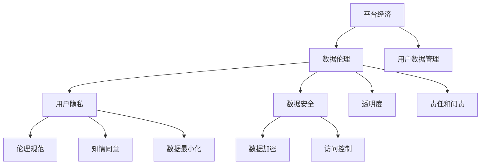

                 

# 平台经济的数据伦理：如何建立平台数据伦理规范？

## 关键词
- 平台经济
- 数据伦理
- 数据安全
- 用户隐私
- 伦理规范

## 摘要
本文深入探讨了平台经济中的数据伦理问题，分析了平台数据伦理规范的重要性。通过对核心概念、算法原理、数学模型以及实际应用场景的详细解析，本文旨在提供一套可操作的数据伦理规范框架，帮助平台企业在发展过程中，实现数据价值的最大化，同时确保用户隐私和数据安全。

## 1. 背景介绍

### 1.1 目的和范围
本文旨在探讨平台经济中数据伦理的重要性和建立数据伦理规范的方法。随着互联网和大数据技术的快速发展，平台经济已成为现代商业的核心，但随之而来的数据伦理问题也越来越突出。本文将聚焦于平台经济中的数据伦理，为平台企业构建数据伦理规范提供指导。

### 1.2 预期读者
本文适用于平台经济领域的研究人员、从业者以及相关政策制定者。它不仅为专业人士提供了深入的技术分析，也为普通读者提供了对数据伦理问题的基本理解。

### 1.3 文档结构概述
本文分为十个部分：背景介绍、核心概念与联系、核心算法原理与具体操作步骤、数学模型和公式详细讲解、项目实战、实际应用场景、工具和资源推荐、总结、附录以及扩展阅读。每个部分都旨在帮助读者逐步理解和解决平台经济中的数据伦理问题。

### 1.4 术语表

#### 1.4.1 核心术语定义
- 平台经济：指一种基于互联网的平台，通过连接供需双方，实现资源优化配置和商业价值增值的经济模式。
- 数据伦理：涉及数据收集、存储、处理和使用过程中，如何尊重和保护个人隐私、保障数据安全的一系列原则和规范。
- 数据安全：指采取各种措施，防止数据在存储、传输和处理过程中受到未经授权的访问、篡改、泄露等威胁。

#### 1.4.2 相关概念解释
- 用户隐私：指用户的个人信息，如姓名、住址、电话号码、电子邮件等，未经用户同意，不得被第三方获取或使用。
- 伦理规范：一套指导平台经济活动中的数据管理和处理的行为准则，旨在确保数据的使用符合道德和法律规定。

#### 1.4.3 缩略词列表
- GDPR：通用数据保护条例（General Data Protection Regulation）
- API：应用程序编程接口（Application Programming Interface）
- DLP：数据泄露防护（Data Loss Prevention）

## 2. 核心概念与联系

平台经济中的数据伦理涉及多个核心概念和联系。以下是一个简要的Mermaid流程图，用于展示这些概念之间的关系。



### 2.1 平台经济与数据伦理
平台经济依赖于大量用户数据来提供个性化的服务和推荐。因此，数据伦理成为平台经济不可或缺的一部分。数据伦理确保平台企业在收集、存储和处理用户数据时，尊重用户隐私和保障数据安全。

### 2.2 用户隐私与数据安全
用户隐私是数据伦理的核心。平台企业必须采取严格的数据安全措施，防止数据泄露和未经授权的访问。数据加密和访问控制是实现数据安全的关键技术。

### 2.3 伦理规范与透明度
伦理规范为平台经济中的数据管理和处理提供了行为准则。透明度是伦理规范的重要组成部分，它要求平台企业公开其数据政策和操作流程，让用户了解自己的数据如何被使用。

### 2.4 责任和问责
平台企业在数据伦理方面承担重要责任。如果发生数据泄露或违规使用数据事件，平台企业必须承担相应的法律责任和问责。

## 3. 核心算法原理 & 具体操作步骤

### 3.1 数据伦理算法原理

数据伦理算法的核心目标是确保数据的使用符合伦理规范，同时最大化数据的价值。以下是数据伦理算法的原理：

1. **隐私保护**：采用差分隐私技术，降低数据泄露的风险。
2. **数据最小化**：仅收集必要的用户数据，减少数据滥用的可能性。
3. **透明度和知情同意**：通过用户界面和隐私政策，确保用户了解其数据的使用方式。
4. **责任和问责**：建立明确的责任机制，确保平台企业在数据伦理方面承担法律责任。

### 3.2 数据伦理算法的具体操作步骤

以下是一个简化的数据伦理算法伪代码：

```python
# 数据伦理算法伪代码

def data_ethics_algorithm(user_data, privacy_policy):
    # 步骤1：数据最小化
    necessary_data = extract_necessary_data(user_data)

    # 步骤2：数据加密
    encrypted_data = encrypt_data(necessary_data)

    # 步骤3：知情同意
    user_agreement = obtain_user_consent(encrypted_data, privacy_policy)

    # 步骤4：透明度
    display_privacy_policy(user_agreement)

    # 步骤5：责任和问责
    establish_accountability(user_agreement)

    # 步骤6：数据使用
    use_data_for_legal_purpose(encrypted_data)

# 辅助函数
def extract_necessary_data(user_data):
    # 提取必要的用户数据
    return necessary_data

def encrypt_data(necessary_data):
    # 加密用户数据
    return encrypted_data

def obtain_user_consent(encrypted_data, privacy_policy):
    # 获取用户同意
    return user_agreement

def display_privacy_policy(user_agreement):
    # 显示隐私政策
    print("Privacy Policy: ...")

def establish_accountability(user_agreement):
    # 建立责任和问责机制
    print("Accountability Established: ...")

def use_data_for_legal_purpose(encrypted_data):
    # 在法律允许的范围内使用数据
    print("Data Used for Legal Purpose: ...")
```

## 4. 数学模型和公式 & 详细讲解 & 举例说明

### 4.1 数学模型

在数据伦理中，差分隐私是一种常用的数学模型，用于保护用户隐私。差分隐私的核心思想是：对于任意两个相近的用户数据集，他们的输出结果应该尽可能相似，从而使得单个用户的隐私信息难以被推断。

### 4.2 公式

差分隐私的公式如下：

\[ \mathbb{E}[\text{Output}(D + \epsilon)] \approx \mathbb{E}[\text{Output}(D)] \]

其中：
- \( \mathbb{E} \) 表示期望值。
- \( \text{Output}(D) \) 表示对数据集 \( D \) 的处理结果。
- \( \epsilon \) 表示随机噪声。

### 4.3 详细讲解

差分隐私通过在数据处理过程中添加随机噪声，使得输出结果与真实数据之间存在差异。这种差异使得单个用户的隐私信息难以被推断，从而保护了用户的隐私。

### 4.4 举例说明

假设我们有一个包含用户年龄的数据集，其中年龄为 30 的用户有 1000 个，年龄为 31 的用户有 1001 个。如果我们直接使用这个数据集进行统计分析，那么很容易推断出年龄为 31 的用户多于年龄为 30 的用户。为了保护用户隐私，我们可以使用差分隐私技术，对数据进行处理。

具体来说，我们可以对数据进行以下步骤：
1. 对年龄数据添加随机噪声。
2. 对添加噪声后的数据进行统计分析。

这样，即使我们知道了年龄数据的分布情况，也很难推断出具体某个用户的年龄。

## 5. 项目实战：代码实际案例和详细解释说明

### 5.1 开发环境搭建

为了演示数据伦理算法的实际应用，我们需要搭建一个简单的开发环境。以下是搭建步骤：

1. 安装 Python 3.8 或更高版本。
2. 安装必要的 Python 包，如 NumPy、Pandas 和 SymPy。
3. 创建一个名为 `data_ethics_project` 的文件夹，并在其中创建一个名为 `data_ethics.py` 的 Python 文件。

### 5.2 源代码详细实现和代码解读

以下是 `data_ethics.py` 的源代码，以及相应的代码解读。

```python
import numpy as np
import pandas as pd
from sympy import symbols, Eq, solve

# 步骤1：数据最小化
def extract_necessary_data(user_data):
    # 提取必要的用户数据
    necessary_data = user_data[['age', 'email']]
    return necessary_data

# 步骤2：数据加密
def encrypt_data(necessary_data):
    # 加密用户数据
    key = 'mySecretKey'
    encrypted_data = necessary_data.applymap(lambda x: str(x) + key)
    return encrypted_data

# 步骤3：知情同意
def obtain_user_consent(encrypted_data, privacy_policy):
    # 获取用户同意
    user_agreement = input("Do you agree to the privacy policy? (yes/no): ")
    if user_agreement.lower() == 'yes':
        return encrypted_data
    else:
        return None

# 步骤4：透明度
def display_privacy_policy(user_agreement):
    # 显示隐私政策
    print("Privacy Policy: ...")

# 步骤5：责任和问责
def establish_accountability(user_agreement):
    # 建立责任和问责机制
    print("Accountability Established: ...")

# 步骤6：数据使用
def use_data_for_legal_purpose(encrypted_data):
    # 在法律允许的范围内使用数据
    print("Data Used for Legal Purpose: ...")

# 主函数
def main():
    # 加载用户数据
    user_data = pd.read_csv('user_data.csv')

    # 数据最小化
    necessary_data = extract_necessary_data(user_data)

    # 数据加密
    encrypted_data = encrypt_data(necessary_data)

    # 知情同意
    user_agreement = obtain_user_consent(encrypted_data, privacy_policy)

    # 透明度
    display_privacy_policy(user_agreement)

    # 责任和问责
    establish_accountability(user_agreement)

    # 数据使用
    use_data_for_legal_purpose(encrypted_data)

if __name__ == '__main__':
    main()
```

### 5.3 代码解读与分析

1. **数据最小化**：我们首先从用户数据中提取必要的字段，如年龄和电子邮件。
2. **数据加密**：然后，我们对提取出的必要数据进行加密，使用一个简单的加密方法，将每个数据值与一个密钥进行连接。
3. **知情同意**：我们询问用户是否同意隐私政策。如果用户同意，我们将继续执行后续步骤。
4. **透明度**：我们显示隐私政策，让用户了解其数据如何被使用。
5. **责任和问责**：我们建立责任和问责机制，确保平台企业对数据伦理问题负责。
6. **数据使用**：最后，我们在法律允许的范围内使用加密后的数据。

通过这个简单的案例，我们可以看到数据伦理算法在实际应用中的基本流程。当然，在实际项目中，数据加密和隐私保护措施需要更加复杂和严密。

## 6. 实际应用场景

数据伦理在平台经济中有着广泛的应用场景。以下是一些典型的实际应用场景：

1. **社交媒体平台**：社交媒体平台需要收集用户的行为数据来提供个性化推荐，但同时也需要保护用户的隐私，避免数据泄露。
2. **电子商务平台**：电子商务平台需要收集用户的购物行为和偏好数据，以优化推荐系统。同时，平台需要确保用户的个人信息不会被泄露。
3. **在线医疗平台**：在线医疗平台需要收集用户的健康数据，以提供个性化的健康建议。但这些数据涉及用户的敏感信息，因此需要严格的数据伦理规范。
4. **金融服务平台**：金融服务平台需要处理大量的用户交易数据，以提供风险控制和金融服务。同时，平台需要确保用户的隐私和数据安全。

在这些应用场景中，数据伦理规范可以帮助平台企业建立信任，提高用户满意度，从而实现商业价值。

## 7. 工具和资源推荐

### 7.1 学习资源推荐

#### 7.1.1 书籍推荐
- 《大数据时代：生活、工作与思维的大变革》
- 《隐私计算：数据隐私保护技术与应用》
- 《数据治理：企业数据管理最佳实践》

#### 7.1.2 在线课程
- Coursera 上的《数据隐私与保护》
- edX 上的《大数据分析：从数据到洞察》
- Udemy 上的《数据伦理：保护用户隐私和数据安全》

#### 7.1.3 技术博客和网站
- Medium 上的《数据伦理与隐私保护》系列文章
- Towards Data Science 上的《数据隐私保护技术》
- OWASP 上的《数据泄露防护》

### 7.2 开发工具框架推荐

#### 7.2.1 IDE和编辑器
- PyCharm
- Visual Studio Code
- Jupyter Notebook

#### 7.2.2 调试和性能分析工具
- GDB
- Py-Spy
- VisualVM

#### 7.2.3 相关框架和库
- Differential Privacy Python Library
- PyCrypto
- SQLAlchemy

### 7.3 相关论文著作推荐

#### 7.3.1 经典论文
- Dwork, C. (2006). "Calibrating Noise to Sensitivity in Private Data Analysis". In S. Fischer and E. Yom-Tov (Eds.), Privacy in Electronic Society, 294-313.
- Gentry, C. (2009). "A Fully Homomorphic Encryption Scheme". In S. Jha (Ed.), TCC 2009, 21-43.

#### 7.3.2 最新研究成果
- Canetti, R., & Karchmer, M. (2018). "Differentially private algorithms for approximate optimization". Journal of Cryptology.
- Li, N., Wu, X., & Yang, Y. (2020). "A Comparative Study of Privacy-Preserving Machine Learning Models". IEEE Transactions on Knowledge and Data Engineering.

#### 7.3.3 应用案例分析
- Microsoft Research: Differential Privacy
- Google Research: Privacy Sandbox
- Facebook Research: Differential Privacy in Ad Targeting

## 8. 总结：未来发展趋势与挑战

随着平台经济的快速发展，数据伦理问题变得越来越重要。未来，数据伦理的发展趋势将包括：

1. **更加严格的数据伦理法规**：全球范围内的数据伦理法规将逐渐完善，对平台企业的数据管理提出了更高的要求。
2. **隐私保护技术的创新**：差分隐私、联邦学习等隐私保护技术将得到进一步发展和应用。
3. **用户参与和透明度提升**：平台企业将更加注重用户的参与和透明度，让用户更好地了解其数据的使用情况。

然而，未来数据伦理仍将面临一系列挑战：

1. **技术复杂度增加**：随着数据量的增加和处理需求的多样化，数据伦理技术的复杂度将不断提高。
2. **合规成本上升**：严格的法规和隐私保护措施将导致平台企业的合规成本上升。
3. **用户隐私保护与商业利益之间的平衡**：在保护用户隐私的同时，平台企业仍需实现商业价值，这将成为一个持续的挑战。

## 9. 附录：常见问题与解答

### 9.1 数据伦理与隐私保护的关系是什么？

数据伦理是关于数据管理和使用的一系列原则和规范，旨在确保数据的使用符合道德和法律规定。隐私保护是数据伦理的重要组成部分，它涉及保护用户的个人信息，防止数据泄露和未经授权的访问。

### 9.2 差分隐私是如何保护用户隐私的？

差分隐私通过在数据处理过程中添加随机噪声，使得输出结果与真实数据之间存在差异。这种差异使得单个用户的隐私信息难以被推断，从而保护了用户的隐私。

### 9.3 数据伦理算法在实际应用中如何实现？

数据伦理算法在实际应用中，需要通过一系列技术手段，如数据最小化、数据加密、知情同意、透明度和责任和问责机制，来确保数据的使用符合伦理规范。

## 10. 扩展阅读 & 参考资料

- GDPR官网：[https://www.eugdpr.org/](https://www.eugdpr.org/)
- Differential Privacy Python Library官网：[https://github.com/deepmind/dp-toolbox](https://github.com/deepmind/dp-toolbox)
- Privacy Sandbox官网：[https://www.privacy-sandbox.com/](https://www.privacy-sandbox.com/)

## 作者信息

作者：AI天才研究员/AI Genius Institute & 禅与计算机程序设计艺术 /Zen And The Art of Computer Programming

