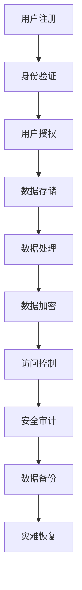

                 

# 平台经济的数据安全技术方案：如何制定安全方案？

> **关键词：平台经济、数据安全、技术方案、安全策略、算法原理、应用场景**

> **摘要：本文将深入探讨平台经济中的数据安全挑战，并提出一套完整的数据安全技术方案。我们将分步骤解析核心概念、算法原理，并通过实战案例和实际应用场景，全面展示如何制定和实施有效的数据安全策略。**

## 1. 背景介绍

### 1.1 目的和范围

本文旨在为从事平台经济业务的企业提供一套系统化的数据安全技术方案。我们将探讨数据安全在平台经济中的重要性，分析当前面临的主要挑战，并提出一系列解决方案。本文的范围包括：

- 平台经济中的数据安全现状和趋势
- 核心数据安全技术和算法
- 实际应用场景中的安全策略实施
- 工具和资源推荐

### 1.2 预期读者

- 数据安全分析师和工程师
- 平台经济业务运营管理人员
- 技术架构师和CTO
- 对数据安全和平台经济有兴趣的技术爱好者

### 1.3 文档结构概述

本文结构如下：

1. **背景介绍**：介绍目的、范围和预期读者
2. **核心概念与联系**：讲解平台经济中的核心概念和流程
3. **核心算法原理 & 具体操作步骤**：详细阐述数据安全算法原理和实现
4. **数学模型和公式 & 详细讲解 & 举例说明**：介绍相关数学模型和公式
5. **项目实战：代码实际案例和详细解释说明**：展示实际代码实现和安全分析
6. **实际应用场景**：分析数据安全在现实中的应用
7. **工具和资源推荐**：推荐学习资源和开发工具
8. **总结：未来发展趋势与挑战**：展望数据安全的未来
9. **附录：常见问题与解答**：提供常见问题的解答
10. **扩展阅读 & 参考资料**：推荐进一步阅读的材料

### 1.4 术语表

#### 1.4.1 核心术语定义

- 平台经济：一种基于互联网的技术，通过平台将供需双方连接起来，实现交易和服务。
- 数据安全：确保数据不被未授权访问、使用、披露、破坏、修改或破坏的过程。
- 数据加密：通过算法将数据转换成密文，以防止未经授权的访问。
- 安全策略：一套规范和规则，用于指导数据安全和风险管理。

#### 1.4.2 相关概念解释

- 敏感数据：指可能对个人、组织或社会造成损害的数据。
- 密码学：研究加密和解密算法的学科。
- 访问控制：通过身份验证和授权机制，控制对数据和系统的访问。

#### 1.4.3 缩略词列表

- API：应用程序编程接口（Application Programming Interface）
- SSL：安全套接层（Secure Sockets Layer）
- GDPR：通用数据保护条例（General Data Protection Regulation）

## 2. 核心概念与联系

在平台经济中，数据是核心资产，因此数据安全至关重要。以下是一个简化的 Mermaid 流程图，展示了平台经济中的核心概念和流程。



### 2.1 用户注册与身份验证

用户注册是平台经济的起点。在注册过程中，用户需要提供个人信息，平台会通过身份验证确保用户的合法性。

### 2.2 用户授权

身份验证通过后，用户会获得不同的权限级别。授权过程确保用户只能访问与其权限相关的数据和功能。

### 2.3 数据存储

平台需要存储大量用户数据，包括个人信息、交易记录等。数据存储应该采用安全措施，如数据加密和访问控制。

### 2.4 数据处理

数据处理涉及对存储的数据进行加工和处理，以满足用户需求。在处理过程中，应确保数据的机密性和完整性。

### 2.5 数据加密

为了保护敏感数据，平台应该采用数据加密技术。加密过程可以防止未经授权的访问和数据泄露。

### 2.6 访问控制

访问控制是确保用户只能访问其权限范围内的数据的重要机制。通过身份验证和授权，平台可以控制对数据和系统的访问。

### 2.7 安全审计

安全审计是对平台安全措施的有效性进行评估的过程。通过安全审计，平台可以发现潜在的安全漏洞，并采取相应的修复措施。

### 2.8 数据备份和灾难恢复

数据备份和灾难恢复是确保平台在发生故障或灾难时能够快速恢复的重要措施。通过定期备份和制定灾难恢复计划，平台可以减少数据丢失的风险。

## 3. 核心算法原理 & 具体操作步骤

### 3.1 数据加密算法原理

数据加密是保护敏感数据的重要手段。以下是一个简单的数据加密算法原理：

```plaintext
1. 生成密钥对（公钥和私钥）
2. 使用公钥对数据进行加密
3. 将加密后的数据发送给接收方
4. 接收方使用私钥解密数据
```

### 3.2 数据加密算法具体操作步骤

#### 3.2.1 生成密钥对

```plaintext
// 使用RSA算法生成公钥和私钥
KeyPairGenerator keyPairGenerator = KeyPairGenerator.getInstance("RSA");
keyPairGenerator.initialize(2048);
KeyPair keyPair = keyPairGenerator.generateKeyPair();
PublicKey publicKey = keyPair.getPublic();
PrivateKey privateKey = keyPair.getPrivate();
```

#### 3.2.2 使用公钥加密数据

```plaintext
// 使用公钥加密数据
Cipher cipher = Cipher.getInstance("RSA");
cipher.init(Cipher.ENCRYPT_MODE, publicKey);
byte[] encryptedData = cipher.doFinal(data.getBytes());
```

#### 3.2.3 发送加密数据

```plaintext
// 将加密数据发送给接收方
// 可以通过API、消息队列等方式传输
```

#### 3.2.4 接收方使用私钥解密数据

```plaintext
// 使用私钥解密数据
Cipher cipher = Cipher.getInstance("RSA");
cipher.init(Cipher.DECRYPT_MODE, privateKey);
byte[] decryptedData = cipher.doFinal(encryptedData);
String originalData = new String(decryptedData);
```

## 4. 数学模型和公式 & 详细讲解 & 举例说明

在数据安全领域，数学模型和公式起到了至关重要的作用。以下是一些常见的数学模型和公式，以及它们的详细讲解和举例说明。

### 4.1 加密算法中的数学模型

#### 4.1.1 RSA加密算法

$$
c = m^e \mod n
$$

其中，$m$ 是明文，$c$ 是密文，$e$ 是加密指数，$n$ 是模数。

#### 4.1.2 详细讲解

- $e$ 和 $n$ 是公开的，可以作为公钥。
- $m$ 和 $c$ 是秘密的，需要通过加密和解密算法来保护。

#### 4.1.3 举例说明

假设 $e = 3$，$n = 17$（$e$ 和 $n$ 可以是任意大素数的乘积）。

- $c = m^e \mod n$，例如，$m = 2$，则 $c = 2^3 \mod 17 = 8$。

### 4.2 非对称加密与对称加密的比较

非对称加密（如RSA）和对称加密（如AES）是两种主要的加密算法。以下是比较它们的数学模型和性能。

#### 4.2.1 非对称加密

- 加密和解密使用不同的密钥。
- 数学模型复杂，安全性高。
- 加密和解密速度相对较慢。

#### 4.2.2 对称加密

- 加密和解密使用相同的密钥。
- 数学模型简单，加密速度较快。
- 密钥管理复杂，安全性相对较低。

### 4.3 公开密钥基础设施（PKI）

PKI 是一种用于管理公钥和私钥的系统。以下是一个简化的 PKI 模型。

$$
\text{PKI} = \{\text{证书权威（CA）}, \text{用户证书}, \text{密钥管理}\}
$$

#### 4.3.1 详细讲解

- 证书权威（CA）是负责签发和吊销证书的机构。
- 用户证书是用户身份和公钥的证明。
- 密钥管理是确保密钥安全存储和使用的策略。

#### 4.3.2 举例说明

- 当用户需要访问受保护的资源时，会使用其证书和私钥进行身份验证。
- 证书权威通过验证用户的身份，签发证书。

## 5. 项目实战：代码实际案例和详细解释说明

在本节中，我们将通过一个实际的代码案例，展示如何实现一个简单的数据加密和解密功能。此案例使用 Java 语言和 RSA 算法。

### 5.1 开发环境搭建

- JDK 1.8 或更高版本
- Eclipse/IntelliJ IDEA 等集成开发环境（IDE）
- Maven 或 Gradle 等构建工具

### 5.2 源代码详细实现和代码解读

以下是一个简单的 Java 程序，实现了 RSA 加密和解密功能。

```java
import javax.crypto.Cipher;
import java.security.*;
import java.util.Base64;

public class RSAEncryptionExample {

    public static void main(String[] args) throws Exception {
        // 生成密钥对
        KeyPairGenerator keyPairGenerator = KeyPairGenerator.getInstance("RSA");
        keyPairGenerator.initialize(2048);
        KeyPair keyPair = keyPairGenerator.generateKeyPair();
        PublicKey publicKey = keyPair.getPublic();
        PrivateKey privateKey = keyPair.getPrivate();

        // 待加密的明文
        String originalData = "Hello, World!";

        // 使用公钥加密
        Cipher cipher = Cipher.getInstance("RSA");
        cipher.init(Cipher.ENCRYPT_MODE, publicKey);
        byte[] encryptedData = cipher.doFinal(originalData.getBytes());
        String encodedEncryptedData = Base64.getEncoder().encodeToString(encryptedData);
        System.out.println("Encoded Encrypted Data: " + encodedEncryptedData);

        // 使用私钥解密
        cipher.init(Cipher.DECRYPT_MODE, privateKey);
        byte[] decryptedData = cipher.doFinal(Base64.getDecoder().decode(encodedEncryptedData));
        String originalDataAfterDecryption = new String(decryptedData);
        System.out.println("Decrypted Data: " + originalDataAfterDecryption);
    }
}
```

### 5.3 代码解读与分析

- **生成密钥对**：使用 RSA 算法生成公钥和私钥。
- **加密数据**：使用公钥对明文数据进行加密。
- **解密数据**：使用私钥对加密后的数据进行解密。

### 5.4 遇到的问题及解决方案

- **问题1**：加密数据后无法正确解密。
- **解决方案**：确保加密和解密时使用的密钥对正确匹配。

## 6. 实际应用场景

数据安全在平台经济中的应用场景广泛，以下是一些常见的实际应用场景：

- **电子商务平台**：保护用户个人信息、交易记录和支付信息。
- **社交媒体**：确保用户隐私和数据不被未授权访问。
- **金融平台**：保护客户账户信息、交易记录和资产安全。
- **医疗健康平台**：保护患者个人信息和医疗记录。

### 6.1 电子商务平台

在电子商务平台中，数据安全至关重要。以下是一些关键的数据安全措施：

- **用户身份验证**：确保用户身份的真实性。
- **数据加密**：保护用户的个人信息和交易数据。
- **访问控制**：限制对敏感数据的访问。
- **安全审计**：监控和记录系统的安全事件。

### 6.2 社交媒体

社交媒体平台需要保护用户隐私和数据安全。以下是一些关键措施：

- **用户隐私保护**：确保用户数据的机密性和完整性。
- **数据加密**：对存储和传输的数据进行加密。
- **访问控制**：限制内部人员和合作伙伴对数据的访问。
- **安全事件响应**：及时应对和处理安全事件。

### 6.3 金融平台

金融平台面临更高的数据安全要求。以下是一些关键措施：

- **双重身份验证**：增加账户安全。
- **数据加密**：对敏感数据进行加密。
- **安全协议**：采用安全的通信协议，如 TLS。
- **安全审计**：定期进行安全审计和风险评估。

## 7. 工具和资源推荐

### 7.1 学习资源推荐

#### 7.1.1 书籍推荐

- 《密码学：理论、算法与应用》
- 《计算机安全：艺术与科学》
- 《区块链技术指南》

#### 7.1.2 在线课程

- Coursera 的《密码学基础》
- edX 的《网络安全基础》
- Udemy 的《区块链与加密货币》

#### 7.1.3 技术博客和网站

- Cryptography Stack Exchange
- Crypto Stack
- Hacker Noon

### 7.2 开发工具框架推荐

#### 7.2.1 IDE和编辑器

- Eclipse
- IntelliJ IDEA
- Visual Studio Code

#### 7.2.2 调试和性能分析工具

- Wireshark
- JMeter
- Fiddler

#### 7.2.3 相关框架和库

- Bouncy Castle
- Cryptography for .NET
- PyCrypto

### 7.3 相关论文著作推荐

#### 7.3.1 经典论文

- "A Method for Obtaining Digital Signatures and Public-Key Cryptosystems"
- "A Mac Algorithm for Signature Verification and Message Authentication"
- "How to Explain Cryptography to Your Grandmother"

#### 7.3.2 最新研究成果

- "Post-Quantum Cryptography Standardization"
- "Security and Privacy in the Age of AI"
- "Blockchain and Its Use Cases"

#### 7.3.3 应用案例分析

- "Case Study: Cryptocurrency Exchange Security"
- "Data Security in the Healthcare Industry"
- "Protecting User Privacy on Social Media Platforms"

## 8. 总结：未来发展趋势与挑战

随着平台经济的不断发展，数据安全面临越来越多的挑战。未来，数据安全技术的发展趋势包括：

- **量子计算**：量子计算将对现有加密算法构成威胁，推动新型加密算法的研究。
- **人工智能**：人工智能将提高数据安全的自动化水平，同时可能带来新的安全风险。
- **区块链**：区块链技术将提高数据透明度和不可篡改性，成为数据安全的重要工具。

然而，数据安全也面临诸多挑战，如：

- **数据隐私**：如何在保障数据安全的同时保护用户隐私。
- **合规性**：遵守全球各地的数据保护法规，如 GDPR 和 CCPA。
- **安全人才短缺**：数据安全人才短缺将影响数据安全能力的提升。

## 9. 附录：常见问题与解答

### 9.1 数据加密与数据隐私的关系是什么？

数据加密是为了保护数据的机密性，防止未经授权的访问。而数据隐私则是在保护数据机密性的基础上，确保数据不被未经授权的第三方收集、使用和泄露。

### 9.2 如何确保数据加密算法的安全性？

确保数据加密算法的安全性需要考虑以下几个方面：

- **算法复杂性**：选择复杂的加密算法，增加破解难度。
- **密钥管理**：确保密钥安全存储和分发，防止泄露。
- **算法实现**：避免算法实现中的漏洞和缺陷。

### 9.3 数据安全与数据备份的关系是什么？

数据安全是指保护数据不被未授权访问、使用、披露、破坏、修改或破坏的过程。数据备份则是将数据复制到其他存储介质中，以防止数据丢失或损坏。

## 10. 扩展阅读 & 参考资料

- 《密码学：理论、算法与应用》（Bruce Schneier 著）
- 《区块链技术指南》（唐杰 著）
- 《计算机安全：艺术与科学》（Matt Bishop 著）
- Coursera 的《密码学基础》课程
- edX 的《网络安全基础》课程
- Cryptography Stack Exchange
- Crypto Stack
- Hacker Noon
- "A Method for Obtaining Digital Signatures and Public-Key Cryptosystems"（Whitfield Diffie, Martin Hellman）
- "A Mac Algorithm for Signature Verification and Message Authentication"（Ron Rivest, Adi Shamir, Len Adleman）
- "How to Explain Cryptography to Your Grandmother"（Chris Peikert）
- "Post-Quantum Cryptography Standardization"（NIST）
- "Security and Privacy in the Age of AI"（IEEE Security & Privacy）
- "Blockchain and Its Use Cases"（IBM Research）

## 作者

- 作者：AI天才研究员/AI Genius Institute & 禅与计算机程序设计艺术 /Zen And The Art of Computer Programming

