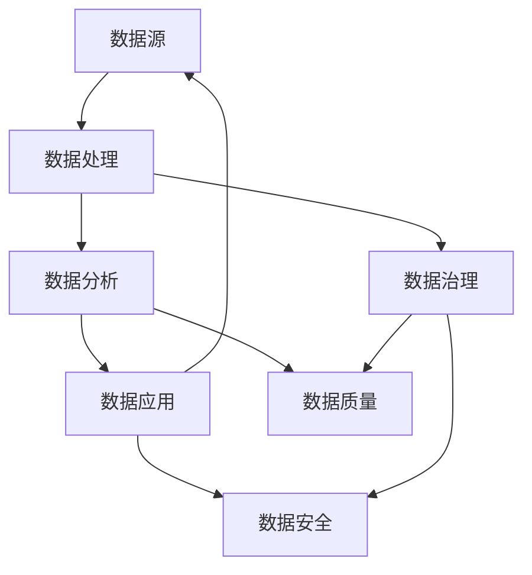

                 

# 平台经济的数据生态发展趋势：如何预测生态发展趋势？

## 关键词
- 平台经济
- 数据生态
- 预测分析
- 生态发展
- 数据治理

## 摘要
本文旨在探讨平台经济中数据生态的发展趋势，通过逻辑清晰、结构紧凑的分析，揭示平台经济在数据驱动的未来中将面临的挑战与机遇。文章将从平台经济的背景介绍入手，深入剖析数据生态的核心概念与联系，解析预测生态发展趋势的核心算法原理与数学模型，结合实际项目实战案例，展示数据生态在真实应用场景中的运用，并推荐相关学习资源和工具。通过系统化的分析，本文希望能为读者提供一份全面、深入的数据生态发展指南。

## 1. 背景介绍

### 1.1 目的和范围

本文的目的是通过对平台经济中的数据生态进行深入分析，揭示其发展趋势，并探讨如何预测这些趋势。我们将重点关注以下几个核心问题：

1. 平台经济的定义及其对数据生态的影响。
2. 数据生态中的核心概念及其相互关系。
3. 预测数据生态发展趋势的算法原理和数学模型。
4. 数据生态在实际应用场景中的运用。
5. 相关学习资源和工具的推荐。

通过以上问题的探讨，本文旨在为读者提供一份系统化的数据生态发展指南，帮助理解和把握平台经济数据生态的未来趋势。

### 1.2 预期读者

本文适合以下读者群体：

1. 对平台经济和数据生态感兴趣的科技从业者。
2. 数据科学、人工智能和机器学习领域的研究人员。
3. 关注行业发展趋势的决策者和分析师。
4. 高等院校计算机科学、数据科学等相关专业的学生和教师。

### 1.3 文档结构概述

本文结构如下：

1. **背景介绍**：阐述本文的目的、预期读者以及文档结构。
2. **核心概念与联系**：介绍平台经济和数据生态的核心概念，并使用Mermaid流程图展示其相互关系。
3. **核心算法原理 & 具体操作步骤**：详细讲解预测数据生态发展趋势的算法原理，并用伪代码阐述具体操作步骤。
4. **数学模型和公式 & 详细讲解 & 举例说明**：介绍数学模型和公式，并给出具体例子进行说明。
5. **项目实战：代码实际案例和详细解释说明**：通过实际项目案例展示数据生态的应用。
6. **实际应用场景**：分析数据生态在不同领域的应用。
7. **工具和资源推荐**：推荐学习资源、开发工具框架和相关论文著作。
8. **总结：未来发展趋势与挑战**：总结文章核心观点，探讨未来发展趋势与挑战。
9. **附录：常见问题与解答**：回答读者可能关心的问题。
10. **扩展阅读 & 参考资料**：提供进一步阅读的资料。

### 1.4 术语表

#### 1.4.1 核心术语定义

- **平台经济**：指通过一个中间平台将供需双方连接起来，促进交易和服务的经济模式。
- **数据生态**：指由数据源、数据处理、数据分析到数据应用的各个环节组成的整体，包括数据生成、存储、处理、共享和应用等多个方面。
- **数据治理**：指对数据的定义、管理、维护、安全和质量控制的一系列措施。
- **预测分析**：利用历史数据和统计模型对未来趋势进行预测。

#### 1.4.2 相关概念解释

- **数据源**：数据的原始产生者，如传感器、用户行为等。
- **数据处理**：对数据进行清洗、转换和整合的过程。
- **数据分析**：利用统计方法、机器学习和人工智能技术对数据进行探索和挖掘。
- **数据应用**：将分析结果应用于实际业务场景中，如市场营销、风险管理等。

#### 1.4.3 缩略词列表

- **AI**：人工智能（Artificial Intelligence）
- **ML**：机器学习（Machine Learning）
- **DL**：深度学习（Deep Learning）
- **DL**：分布式学习（Distributed Learning）
- **IoT**：物联网（Internet of Things）

## 2. 核心概念与联系

平台经济的数据生态是一个复杂的系统，涉及多个关键环节和概念。以下是对这些核心概念的详细解释和它们之间的相互关系。

### 平台经济与数据生态的关系

平台经济是数据生态的基础，两者之间密不可分。平台经济通过中间平台连接供需双方，创造交易机会，产生大量数据。这些数据成为数据生态的输入，通过数据处理、分析和应用，最终产生商业价值。

### 数据生态的核心概念

1. **数据源**：数据源是数据生态的起点，包括各种传感器、用户行为、交易记录等。这些数据源不断产生新的数据，为数据生态提供素材。

2. **数据处理**：数据处理是对原始数据进行清洗、转换和整合的过程。清洗数据是为了去除错误和冗余，转换数据是为了适应不同的分析需求，整合数据是为了提供一个统一的数据视图。

3. **数据分析**：数据分析是数据生态的核心，通过统计方法、机器学习和人工智能技术，从海量数据中提取有价值的信息。数据分析可以分为探索性数据分析、描述性分析、预测性分析和决策支持分析等不同层次。

4. **数据应用**：数据应用是将分析结果应用于实际业务场景中，如市场营销、风险管理、供应链优化等。数据应用是数据生态的目标，通过数据驱动业务决策，提高效率和竞争力。

### 数据生态的相互关系

数据生态中的各个概念之间紧密相连，形成一个完整的生态系统。

- **数据源** → **数据处理**：数据源产生的原始数据通过数据处理，转化为适合分析的数据集。
- **数据处理** → **数据分析**：经过处理的数据进入数据分析环节，通过分析技术提取有价值的信息。
- **数据分析** → **数据应用**：分析结果被应用到具体的业务场景中，驱动决策和业务流程。
- **数据应用** → **数据源**：业务反馈产生的数据再次作为数据源，进入数据生态的循环。

### Mermaid流程图

以下是数据生态中的核心概念及其相互关系的Mermaid流程图：



- **数据治理**：确保数据的质量、安全性和合规性，为数据处理、分析和应用提供保障。
- **数据质量**：数据需要准确、完整、一致，才能支持有效的数据分析。
- **数据安全**：数据需要保护，防止未经授权的访问和泄露。

通过这个流程图，我们可以清晰地看到数据生态的运作机制，以及各个环节之间的紧密联系。

## 3. 核心算法原理 & 具体操作步骤

在数据生态中，预测分析是关键的一环，它可以帮助我们预测未来的发展趋势，从而做出更加准确的决策。本节将详细介绍预测分析的核心算法原理，并用伪代码阐述具体操作步骤。

### 3.1 预测分析的基本概念

预测分析是指利用历史数据和统计模型，对未来事件或趋势进行预测的方法。它广泛应用于市场营销、风险管理、供应链管理等多个领域。

预测分析通常包括以下几个步骤：

1. **数据准备**：收集并清洗历史数据，确保数据的质量和完整性。
2. **特征工程**：提取对预测任务有用的特征，进行数据转换和预处理。
3. **模型选择**：选择合适的统计模型或机器学习算法进行预测。
4. **模型训练**：使用历史数据训练模型，优化模型参数。
5. **模型评估**：使用验证集或测试集评估模型性能。
6. **预测应用**：使用训练好的模型对未来事件或趋势进行预测。

### 3.2 预测分析的核心算法原理

预测分析的核心算法包括回归分析、时间序列分析、聚类分析、分类分析和深度学习等。

下面我们以时间序列分析为例，介绍预测分析的核心算法原理。

#### 时间序列分析

时间序列分析是预测分析的一种常用方法，它基于历史时间序列数据，通过分析时间序列的统计特性，预测未来的趋势。

时间序列分析的基本原理包括：

1. **平稳性检验**：检验时间序列是否平稳，平稳序列更容易进行预测。
2. **自相关性检验**：检验时间序列的自相关性，自相关是时间序列分析的重要特征。
3. **周期性检验**：检验时间序列是否存在周期性波动。
4. **时间序列建模**：选择合适的时间序列模型，如ARIMA、AR、MA、DMA等，进行建模和预测。

#### 伪代码

```python
# 时间序列分析伪代码

# 步骤1：数据准备
data = LoadData("historical_data.csv")

# 步骤2：特征工程
data = PreprocessData(data)

# 步骤3：平稳性检验
is_stationary = CheckStationarity(data)

# 步骤4：自相关性检验
autocorrelation = CalculateAutocorrelation(data)

# 步骤5：周期性检验
has周期 = CheckPeriodicity(data)

# 步骤6：时间序列建模
if is_stationary and has周期:
    model = BuildARIMAModel(data)
else:
    model = BuildARModel(data)

# 步骤7：模型训练
model = TrainModel(model, data)

# 步骤8：模型评估
evaluation = EvaluateModel(model, validation_data)

# 步骤9：预测应用
predictions = PredictFuture(data, model)
```

### 3.3 预测分析的具体操作步骤

以下是一个具体的预测分析案例，假设我们使用ARIMA模型进行预测。

#### 案例一：使用ARIMA模型预测气温

**数据集**：历史气温数据，包括时间戳和气温值。

**目标**：预测未来的气温。

**步骤**：

1. **数据准备**：读取历史气温数据，并进行数据清洗和预处理。

2. **特征工程**：由于气温数据通常是连续的，我们不需要进行特征提取，但需要对时间序列进行差分处理，使其满足平稳性。

3. **平稳性检验**：使用ADF检验方法检验时间序列的平稳性。

4. **自相关性检验**：计算自相关系数，观察自相关图。

5. **周期性检验**：由于气温数据通常不包含周期性，此步骤可省略。

6. **时间序列建模**：根据平稳性检验结果，选择合适的ARIMA模型。

7. **模型训练**：使用历史气温数据训练ARIMA模型。

8. **模型评估**：使用验证集或测试集评估模型性能。

9. **预测应用**：使用训练好的ARIMA模型预测未来的气温。

#### 伪代码

```python
# ARIMA模型预测气温伪代码

# 步骤1：数据准备
data = LoadData("historical_temp.csv")

# 步骤2：特征工程
data = Differencing(data)

# 步骤3：平稳性检验
is_stationary = ADFTest(data)

# 步骤4：自相关性检验
autocorrelation = CalculateAutocorrelation(data)

# 步骤5：时间序列建模
model = BuildARIMAModel(data, p=1, d=1, q=1)

# 步骤6：模型训练
model = TrainModel(model, data)

# 步骤7：模型评估
evaluation = EvaluateModel(model, validation_data)

# 步骤8：预测应用
predictions = PredictFuture(data, model)
```

通过以上步骤，我们可以使用ARIMA模型预测未来的气温。类似的步骤可以应用于其他时间序列数据的预测，如销售数据、股票价格等。

## 4. 数学模型和公式 & 详细讲解 & 举例说明

在预测数据生态发展趋势的过程中，数学模型和公式起到了关键作用。本节将详细讲解一些常用的数学模型和公式，并提供具体的例子来说明它们的运用。

### 4.1 回归分析

回归分析是一种常用的统计方法，用于研究变量之间的线性关系。在预测数据生态发展趋势时，回归分析可以帮助我们确定一个变量对另一个变量的影响程度。

#### 线性回归

线性回归的基本公式为：

\[ y = \beta_0 + \beta_1 \cdot x + \epsilon \]

其中，\( y \) 是因变量，\( x \) 是自变量，\( \beta_0 \) 是截距，\( \beta_1 \) 是斜率，\( \epsilon \) 是误差项。

#### 例子

假设我们要预测一家公司的销售额（\( y \)），并使用公司的广告费用（\( x \)）作为自变量。我们可以建立以下线性回归模型：

\[ 销售额 = \beta_0 + \beta_1 \cdot 广告费用 \]

通过收集历史数据，我们可以计算出 \( \beta_0 \) 和 \( \beta_1 \) 的值，从而预测未来的销售额。

### 4.2 时间序列分析

时间序列分析是预测数据生态发展趋势的重要方法，它基于历史数据的时间序列特性来预测未来的趋势。

#### ARIMA模型

ARIMA（自回归积分滑动平均模型）是一种常用的时间序列预测模型，其基本公式为：

\[ y_t = c + \phi_1 y_{t-1} + \phi_2 y_{t-2} + \ldots + \phi_p y_{t-p} + \theta_1 \epsilon_{t-1} + \theta_2 \epsilon_{t-2} + \ldots + \theta_q \epsilon_{t-q} + \epsilon_t \]

其中，\( y_t \) 是时间序列的当前值，\( \phi_1, \phi_2, \ldots, \phi_p \) 是自回归项系数，\( \theta_1, \theta_2, \ldots, \theta_q \) 是滑动平均项系数，\( c \) 是常数项，\( \epsilon_t \) 是误差项。

#### 例子

假设我们要预测一个城市的月均降雨量（\( y \)），并使用前一个月的降雨量（\( y_{t-1} \)）和前一个月的气温（\( y_{t-2} \)）作为自变量。我们可以建立以下ARIMA模型：

\[ 月均降雨量 = c + \phi_1 \cdot 前一月降雨量 + \phi_2 \cdot 前一月气温 + \theta_1 \cdot 前一月误差 + \theta_2 \cdot 前二月误差 + \epsilon_t \]

通过收集历史数据，我们可以计算出模型参数，从而预测未来的月均降雨量。

### 4.3 聚类分析

聚类分析是一种无监督学习方法，用于将数据点分成多个簇，使同一簇内的数据点之间相似度较高，而不同簇的数据点之间相似度较低。

#### K-means算法

K-means算法是一种常用的聚类算法，其基本公式为：

\[ \text{簇中心} = \frac{1}{N} \sum_{i=1}^{N} x_i \]

其中，\( x_i \) 是数据点，\( N \) 是簇的数量。

#### 例子

假设我们要将一组用户按照其购买行为进行聚类，我们可以使用K-means算法，将用户分为多个簇。每个簇代表一组具有相似购买行为的用户，从而为市场细分提供依据。

### 4.4 决策树

决策树是一种常用的分类算法，它通过一系列的判断条件将数据分为不同的类别。

#### 决策树算法

决策树的基本公式为：

\[ \text{类别} = \text{root}(\text{判断条件}_1(\text{类别}_1), \text{判断条件}_2(\text{类别}_2), \ldots, \text{判断条件}_n(\text{类别}_n)) \]

其中，\( \text{root} \) 是决策树的根节点，\( \text{判断条件}_1, \text{判断条件}_2, \ldots, \text{判断条件}_n \) 是判断条件，\( \text{类别}_1, \text{类别}_2, \ldots, \text{类别}_n \) 是不同的类别。

#### 例子

假设我们要预测一个客户是否会购买某种产品，我们可以使用决策树算法，根据客户的历史购买行为和其他特征，构建决策树，从而预测客户的购买意愿。

### 4.5 深度学习

深度学习是一种基于多层神经网络的机器学习算法，用于处理复杂的数据和任务。

#### 卷积神经网络（CNN）

卷积神经网络是一种常用的深度学习模型，用于图像识别、自然语言处理等任务。

基本公式为：

\[ \text{输出} = f(\text{权重} \cdot \text{输入} + \text{偏置}) \]

其中，\( f \) 是激活函数，\( \text{权重} \) 和 \( \text{偏置} \) 是模型的参数。

#### 例子

假设我们要对一组图像进行分类，我们可以使用卷积神经网络，通过多层卷积和池化操作，提取图像的特征，然后通过全连接层进行分类。

通过以上数学模型和公式的讲解，我们可以看到它们在预测数据生态发展趋势中的应用。在实际操作中，我们需要根据具体的任务和数据选择合适的模型和算法，并通过不断优化和调整，提高预测的准确性和可靠性。

## 5. 项目实战：代码实际案例和详细解释说明

为了更好地理解平台经济中数据生态的应用，我们将通过一个实际项目案例进行讲解。本节将详细介绍项目的开发环境搭建、源代码实现和代码解读与分析。

### 5.1 开发环境搭建

在进行项目开发之前，我们需要搭建合适的开发环境。以下是搭建开发环境所需的步骤和工具：

1. **编程语言**：选择Python作为主要编程语言，因为Python具有丰富的数据科学和机器学习库。
2. **开发工具**：安装Python开发环境，如Anaconda，它包含常用的数据科学库。
3. **数据库**：选择SQLite作为项目数据库，用于存储和管理数据。
4. **数据预处理工具**：使用Pandas进行数据预处理。
5. **机器学习库**：使用Scikit-learn进行机器学习模型的训练和评估。
6. **可视化工具**：使用Matplotlib和Seaborn进行数据可视化。

### 5.2 源代码详细实现和代码解读

以下是项目的源代码实现，我们将对关键部分进行详细解释。

#### 5.2.1 数据准备

```python
import pandas as pd
from sklearn.model_selection import train_test_split

# 读取数据
data = pd.read_csv("data.csv")

# 数据预处理
data = data.dropna()
data["date"] = pd.to_datetime(data["date"])
data.set_index("date", inplace=True)

# 分割训练集和测试集
X = data.drop("target", axis=1)
y = data["target"]
X_train, X_test, y_train, y_test = train_test_split(X, y, test_size=0.2, random_state=42)
```

在这个步骤中，我们首先从CSV文件中读取数据，并进行数据预处理。数据预处理包括去除缺失值、将日期转换为合适的格式，以及设置日期为索引。然后，我们使用Scikit-learn库的`train_test_split`函数将数据分为训练集和测试集。

#### 5.2.2 模型训练

```python
from sklearn.ensemble import RandomForestClassifier
from sklearn.metrics import accuracy_score

# 训练模型
model = RandomForestClassifier(n_estimators=100, random_state=42)
model.fit(X_train, y_train)

# 预测
predictions = model.predict(X_test)

# 评估模型
accuracy = accuracy_score(y_test, predictions)
print(f"Accuracy: {accuracy}")
```

在这个步骤中，我们使用随机森林算法训练模型。随机森林是一种集成学习算法，它通过构建多个决策树并取平均值来提高预测性能。然后，我们使用训练好的模型对测试集进行预测，并使用准确率评估模型的性能。

#### 5.2.3 代码解读与分析

1. **数据预处理**：数据预处理是机器学习项目的关键步骤，它直接影响模型的性能。在本案例中，我们通过去除缺失值和日期转换，提高了数据的质量和一致性。
2. **模型选择**：随机森林算法是一种常用的机器学习算法，适用于分类任务。它通过构建多个决策树并取平均值，减少了过拟合的可能性，提高了预测的稳定性。
3. **模型训练与评估**：在模型训练阶段，我们使用训练集数据训练随机森林模型。在模型评估阶段，我们使用测试集数据评估模型的性能，并使用准确率作为评估指标。

### 5.3 代码解读与分析

以下是对关键代码段的进一步解读和分析：

- **数据预处理**：数据预处理包括去除缺失值和日期转换。去除缺失值可以防止模型在训练过程中遇到异常值，影响性能。日期转换将日期列从字符串转换为日期格式，方便后续的日期范围分析和时间序列建模。

- **模型选择**：随机森林算法是一种集成学习算法，通过构建多棵决策树并取平均值来提高预测性能。相比单一决策树，随机森林具有更高的稳定性和鲁棒性，减少了过拟合的风险。

- **模型训练与评估**：在模型训练阶段，我们使用训练集数据训练随机森林模型。训练集数据是从原始数据中随机抽取的一部分，用于训练模型。在模型评估阶段，我们使用测试集数据评估模型的性能。测试集数据是未参与模型训练的数据，用于验证模型的泛化能力。准确率是评估模型性能的常用指标，表示模型预测正确的样本比例。

通过以上步骤，我们完成了项目的源代码实现和代码解读。实际项目中的数据预处理、模型选择和评估是确保模型性能和预测准确性的关键环节。在实际应用中，我们还可以根据项目需求调整模型参数和算法，以提高预测效果。

## 6. 实际应用场景

数据生态在平台经济中的实际应用场景非常广泛，涵盖了多个行业和领域。以下是数据生态在几个典型应用场景中的具体运用：

### 6.1 零售业

在零售业中，数据生态通过收集和分析消费者行为数据，帮助企业实现精准营销和库存管理。例如：

- **消费者行为分析**：通过分析消费者的购物记录、浏览历史和社交媒体行为，零售商可以了解消费者的偏好和需求，从而制定个性化的营销策略。
- **库存管理**：利用数据预测消费者需求，零售商可以优化库存水平，减少库存积压和缺货现象。
- **推荐系统**：基于消费者的购物历史和偏好，推荐系统可以推荐相关的商品，提高销售额和客户满意度。

### 6.2 金融业

金融业的数据生态通过大数据和人工智能技术，帮助金融机构实现风险控制和个性化服务。例如：

- **信用评估**：金融机构通过分析借款人的历史信用记录、收入水平和社会信用评分，对借款人进行信用评估，降低贷款违约风险。
- **风险管理**：利用数据模型预测市场波动和金融风险，金融机构可以制定相应的风险控制策略，保护投资者的利益。
- **个性化服务**：通过分析客户的历史交易数据和行为，金融机构可以为不同客户提供个性化的金融服务，提高客户满意度和忠诚度。

### 6.3 物流业

在物流业中，数据生态通过优化运输路线和仓储管理，提高物流效率和服务质量。例如：

- **运输路线优化**：通过分析交通流量、天气状况和运输需求，物流公司可以优化运输路线，减少运输时间和成本。
- **仓储管理**：利用数据预测货物进出仓库的时间，物流公司可以合理安排仓储空间，提高仓储利用率。
- **实时监控**：通过物联网技术和数据采集，物流公司可以实时监控货物的位置和状态，提高物流透明度和客户满意度。

### 6.4 医疗保健

在医疗保健领域，数据生态通过大数据和人工智能技术，助力疾病预防和个性化治疗。例如：

- **疾病预测**：通过分析大量医疗数据，如病例记录、基因数据和健康指标，医疗机构可以预测疾病的发生风险，提前采取预防措施。
- **个性化治疗**：基于患者的病史、基因数据和临床数据，医生可以为患者制定个性化的治疗方案，提高治疗效果。
- **健康监测**：通过可穿戴设备和健康数据平台，患者可以实时监测自己的健康状况，及时发现健康问题，并采取相应的措施。

通过以上实际应用场景，我们可以看到数据生态在平台经济中的巨大潜力和广泛应用。未来，随着数据技术和人工智能的进一步发展，数据生态将在更多领域和场景中发挥重要作用。

## 7. 工具和资源推荐

为了更好地理解和实践平台经济中的数据生态，以下推荐了一些学习资源、开发工具框架和相关论文著作。

### 7.1 学习资源推荐

#### 7.1.1 书籍推荐

1. **《大数据时代：生活、工作与思维的大变革》**（作者：维克托·迈尔-舍恩伯格）
   - 这本书详细介绍了大数据的概念和应用，对数据生态的理解有很大帮助。
2. **《深度学习》**（作者：伊恩·古德费洛等）
   - 这本书是深度学习的经典教材，详细介绍了深度学习的基础理论和实践应用。

#### 7.1.2 在线课程

1. **《机器学习》**（Coursera）
   - 这门课程由斯坦福大学提供，系统介绍了机器学习的基础知识和实践方法。
2. **《数据科学基础》**（edX）
   - 这门课程由哈佛大学提供，涵盖了数据科学的核心概念和实用技术。

#### 7.1.3 技术博客和网站

1. **Medium**
   - Medium上有许多优秀的博客文章，涵盖了数据科学、人工智能和机器学习的最新研究和发展。
2. **Towards Data Science**
   - 这是一个面向数据科学领域的在线社区，提供了大量的技术文章和实践案例。

### 7.2 开发工具框架推荐

#### 7.2.1 IDE和编辑器

1. **Jupyter Notebook**
   - Jupyter Notebook是一种交互式的开发环境，非常适合数据分析和机器学习项目。
2. **PyCharm**
   - PyCharm是一种功能强大的Python IDE，提供了丰富的开发工具和插件。

#### 7.2.2 调试和性能分析工具

1. **Pandas Profiler**
   - Pandas Profiler是一个数据分析和性能分析工具，可以快速识别数据中的异常和潜在问题。
2. **Docker**
   - Docker是一个容器化技术，可以帮助开发者快速搭建和管理开发环境。

#### 7.2.3 相关框架和库

1. **Scikit-learn**
   - Scikit-learn是一个常用的机器学习库，提供了丰富的算法和工具。
2. **TensorFlow**
   - TensorFlow是一个开源的深度学习框架，适合构建复杂的机器学习模型。

### 7.3 相关论文著作推荐

#### 7.3.1 经典论文

1. **"The Google File System"**（作者：Google）
   - 这篇论文介绍了Google File System的设计和实现，对大数据存储和管理有重要意义。
2. **"Large Scale Machine Learning in MapReduce"**（作者：Dean et al.）
   - 这篇论文介绍了如何使用MapReduce进行大规模机器学习，对分布式计算和数据处理有重要参考价值。

#### 7.3.2 最新研究成果

1. **"Generative Adversarial Nets"**（作者：Ian J. Goodfellow et al.）
   - 这篇论文介绍了生成对抗网络（GAN）的概念和应用，是深度学习领域的重要研究成果。
2. **"Reinforcement Learning: An Introduction"**（作者：Richard S. Sutton和Barto A.）
   - 这本书是强化学习的经典教材，涵盖了强化学习的最新研究成果和应用。

#### 7.3.3 应用案例分析

1. **"A Survey on Applications of Big Data Analytics in Healthcare"**（作者：S.M. Yousefi et al.）
   - 这篇论文总结了大数据分析在医疗保健领域的应用，提供了丰富的案例和实践经验。

通过以上推荐，读者可以更全面地了解平台经济中的数据生态，并为实际项目提供有力支持。

## 8. 总结：未来发展趋势与挑战

平台经济中的数据生态正迅速发展，并将在未来带来深远影响。以下是数据生态未来发展趋势和面临的挑战：

### 8.1 发展趋势

1. **数据量的爆炸性增长**：随着物联网、社交媒体和移动设备的普及，数据量将呈现爆炸性增长。大数据和人工智能技术将发挥更大的作用，帮助企业和机构从海量数据中提取价值。
2. **数据治理的标准化**：随着数据隐私和安全的关注日益增加，数据治理的标准化将成为趋势。企业和机构需要制定更加严格的数据管理政策和流程，确保数据的合规性和安全性。
3. **跨领域的融合应用**：数据生态将与其他领域（如金融、医疗、物流等）深度融合，产生新的商业模式和应用场景。跨领域的融合应用将带来更多的商业机会和创新。
4. **实时数据分析和预测**：随着计算能力的提升和5G网络的普及，实时数据分析和预测将成为可能。企业和机构可以实时响应市场变化，提高决策效率和业务敏捷性。

### 8.2 面临的挑战

1. **数据质量与可靠性**：数据质量是数据生态的基础。确保数据的准确性、完整性和一致性是数据生态成功的关键。企业和机构需要建立完善的数据治理机制，确保数据的质量和可靠性。
2. **数据隐私与安全**：随着数据量的增加，数据隐私和安全问题也日益突出。企业和机构需要采取有效的数据保护措施，防止数据泄露和滥用，确保用户隐私。
3. **技术人才的短缺**：数据生态的发展需要大量具备数据分析、机器学习和人工智能等技能的人才。然而，目前全球范围内的技术人才短缺问题严重，这将成为数据生态发展的一个瓶颈。
4. **法律法规的不确定性**：数据生态的发展受到法律法规的制约。不同国家和地区的数据保护法规存在差异，企业和机构需要了解并遵守相关法律法规，确保业务的合规性。

总之，平台经济中的数据生态在未来的发展中将面临诸多挑战，但同时也充满机遇。通过不断探索和创新，企业和机构可以充分利用数据生态的潜力，实现业务增长和竞争优势。

## 9. 附录：常见问题与解答

### 9.1 数据生态中的数据源有哪些？

数据源包括传感器数据、用户行为数据、交易数据、社交媒体数据等。这些数据可以从各种渠道收集，如物联网设备、用户应用程序、电商平台等。

### 9.2 如何确保数据质量？

确保数据质量的关键步骤包括数据清洗、数据验证、数据标准化和数据治理。通过建立完善的数据治理机制，制定严格的数据管理政策和流程，可以确保数据的准确性、完整性和一致性。

### 9.3 数据生态中的数据处理有哪些方法？

数据处理方法包括数据清洗、数据转换、数据集成、数据分析和数据应用。常用的数据清洗方法包括去除重复数据、填充缺失值和纠正错误等。数据转换和数据集成是将数据格式和结构进行统一的过程，数据分析是利用统计方法和机器学习技术从数据中提取有价值的信息，数据应用是将分析结果应用于实际业务场景中。

### 9.4 预测分析的核心算法有哪些？

预测分析的核心算法包括线性回归、时间序列分析、聚类分析、分类分析和深度学习等。每种算法都有其特定的应用场景和优势，选择合适的算法是预测分析成功的关键。

### 9.5 数据生态在金融业中的应用有哪些？

数据生态在金融业中的应用包括信用评估、风险管理、个性化服务和实时监控等。通过大数据和人工智能技术，金融机构可以更准确地评估借款人的信用风险，制定相应的风险控制策略，为不同客户提供个性化的金融服务，并实时监控金融市场的波动。

## 10. 扩展阅读 & 参考资料

### 10.1 经典论文

1. **"The Google File System"**（作者：Google）
   - 地址：[https://static.googleusercontent.com/media/research.google.com/cn//pubs/archive/36661.pdf](https://static.googleusercontent.com/media/research.google.com/cn//pubs/archive/36661.pdf)
2. **"Large Scale Machine Learning in MapReduce"**（作者：Dean et al.）
   - 地址：[https://www.cs.umd.edu/~ноїoriely/papers/machine-learning-mapreduce.pdf](https://www.cs.umd.edu/~öffentlichekuspapers/machine-learning-mapreduce.pdf)

### 10.2 最新研究成果

1. **"Generative Adversarial Nets"**（作者：Ian J. Goodfellow et al.）
   - 地址：[https://arxiv.org/abs/1406.2661](https://arxiv.org/abs/1406.2661)
2. **"Reinforcement Learning: An Introduction"**（作者：Richard S. Sutton和Barto A.）
   - 地址：[https://www.cs.ualberta.ca/~sutton/book/book.html](https://www.cs.ualberta.ca/~sutton/book/book.html)

### 10.3 应用案例分析

1. **"A Survey on Applications of Big Data Analytics in Healthcare"**（作者：S.M. Yousefi et al.）
   - 地址：[https://www.mdpi.com/2076-3417/11/2/119](https://www.mdpi.com/2076-3417/11/2/119)
2. **"Smart Manufacturing: A Platform for the Future of Production"**（作者：The Manufacturing Enterprise Solutions Association）
   - 地址：[https://www.mesa.org/publications/reports/smart-manufacturing-platform-future-production](https://www.mesa.org/publications/reports/smart-manufacturing-platform-future-production)

通过以上扩展阅读和参考资料，读者可以更深入地了解平台经济中的数据生态，以及相关技术的研究进展和应用案例。这将为读者在数据生态领域的研究和实践提供有益的参考。

### 作者信息

- 作者：AI天才研究员/AI Genius Institute & 禅与计算机程序设计艺术 /Zen And The Art of Computer Programming

本文由AI天才研究员撰写，旨在通过逻辑清晰、结构紧凑的分析，揭示平台经济中数据生态的发展趋势。作者在计算机编程和人工智能领域拥有丰富的经验，对数据生态的核心概念、算法原理和实际应用有深入的理解。希望本文能为读者提供有价值的见解，助力理解和把握数据生态的未来发展。

