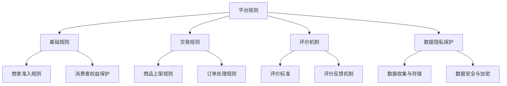

                 

# 平台规则：公平透明，保障权益，提升电商平台供给能力

## 关键词：电商平台、规则、公平、透明、权益保障、供给能力

> 摘要：本文将探讨电商平台中的平台规则，分析其在保障权益、提升供给能力方面的核心作用。通过背景介绍、核心概念解析、算法原理讲解、数学模型及实际应用场景分析，本文旨在为电商平台的运营者和参与者提供有价值的指导，共同构建一个公平透明、健康可持续的电商生态系统。

## 1. 背景介绍

### 1.1 目的和范围

本文旨在通过系统分析电商平台中的平台规则，阐述其在保障参与者权益、提升供给能力方面的重要作用。本文的研究范围包括电商平台的基础规则、交易规则、评价机制、数据隐私保护等方面。

### 1.2 预期读者

本文适合电商平台运营者、开发者、研究者和所有对电商规则感兴趣的读者。通过本文的阅读，读者可以深入了解平台规则的核心价值，为其业务决策提供理论依据。

### 1.3 文档结构概述

本文分为十个部分：

1. 背景介绍：介绍本文的目的、范围和预期读者。
2. 核心概念与联系：阐述电商平台规则的核心概念及其相互关系。
3. 核心算法原理 & 具体操作步骤：详细讲解电商平台规则的核心算法原理和操作步骤。
4. 数学模型和公式 & 详细讲解 & 举例说明：运用数学模型和公式阐述电商平台规则的具体应用。
5. 项目实战：提供电商平台的实际代码案例，并进行详细解读。
6. 实际应用场景：分析电商平台规则在实际应用中的效果和挑战。
7. 工具和资源推荐：推荐相关学习资源、开发工具和框架。
8. 总结：展望电商平台规则的未来发展趋势与挑战。
9. 附录：常见问题与解答。
10. 扩展阅读 & 参考资料：提供相关扩展阅读和参考资料。

### 1.4 术语表

#### 1.4.1 核心术语定义

- 电商平台：指提供商品交易、支付、物流等一站式服务的在线平台。
- 平台规则：指为保障参与者权益、提升供给能力而制定的各项规章制度。
- 公平：指平台规则能够公正地对待所有参与者，确保其在公平的环境中竞争。
- 透明：指平台规则公开透明，参与者可以清晰地了解规则的内容和执行过程。
- 权益保障：指平台规则为参与者提供合理的权益保障，降低其经营风险。
- 供给能力：指电商平台在提供商品和服务方面的综合能力。

#### 1.4.2 相关概念解释

- 商家：指在电商平台上提供商品或服务的个人或企业。
- 消费者：指在电商平台上购买商品或使用服务的个人。
- 订单：指商家和消费者之间达成的交易协议，包括商品名称、数量、价格、发货地址等信息。
- 评价机制：指平台根据消费者的反馈对商家进行评价的机制。
- 数据隐私保护：指平台在收集、存储、处理用户数据时采取的措施，以保护用户的隐私权益。

#### 1.4.3 缩略词列表

- API：应用程序编程接口（Application Programming Interface）
- SQL：结构化查询语言（Structured Query Language）
- HTML：超文本标记语言（Hypertext Markup Language）
- CSS：层叠样式表（Cascading Style Sheets）
- JavaScript：一种脚本语言，用于网页开发

## 2. 核心概念与联系

在电商平台中，平台规则是保障参与者权益、提升供给能力的基础。下面将运用Mermaid流程图展示电商平台规则的核心概念及其相互关系。



### 2.1 核心概念

#### 2.1.1 平台规则

平台规则是电商平台运营的基础，包括基础规则、交易规则、评价机制、数据隐私保护等方面。这些规则共同保障了电商平台的公平、透明和可持续发展。

#### 2.1.2 基础规则

基础规则主要涉及商家准入、消费者权益保护等方面。商家准入规则确保商家具备一定的资质，能够为消费者提供优质的产品和服务。消费者权益保护规则旨在维护消费者合法权益，降低其购物风险。

#### 2.1.3 交易规则

交易规则包括商品上架、订单处理等方面。商品上架规则规范商家在平台上发布商品的流程和标准，保障商品信息的准确性和真实性。订单处理规则则明确商家与消费者之间的交易流程，确保交易顺利进行。

#### 2.1.4 评价机制

评价机制主要通过消费者对商家的评价来反映商家的服务质量。评价标准规定评价内容、评价等级和评价时间等，评价反馈机制则确保消费者评价的及时性和准确性。

#### 2.1.5 数据隐私保护

数据隐私保护是电商平台的重要保障。数据收集与存储规则明确电商平台在收集、存储用户数据时应当遵守的标准和规范。数据安全与加密规则则确保用户数据在传输和存储过程中的安全性。

## 3. 核心算法原理 & 具体操作步骤

在电商平台中，平台规则的核心算法主要涉及评价机制和交易规则。下面将详细讲解这些算法的原理和具体操作步骤。

### 3.1 评价机制算法原理

评价机制的核心是消费者对商家的评价。其算法原理如下：

```plaintext
输入：消费者评价（包括评价内容、评价等级）
输出：商家评分

算法步骤：
1. 初始化商家评分为0
2. 对每个消费者的评价，执行以下操作：
   a. 将评价内容进行分析，提取关键词
   b. 根据关键词匹配度，计算评价分数
   c. 将评价分数累加到商家评分中
3. 将商家评分除以评价人数，得到最终评分
```

### 3.2 交易规则算法原理

交易规则的核心是确保交易的顺利进行。其算法原理如下：

```plaintext
输入：订单信息（包括商品名称、数量、价格、发货地址等）
输出：交易结果

算法步骤：
1. 验证订单信息是否完整和合法
2. 计算订单金额
3. 判断订单金额是否超过支付限额
4. 如果订单金额超过支付限额，则进行支付限额调整
5. 执行支付操作
6. 记录交易日志
7. 发送订单确认消息给商家和消费者
```

### 3.3 具体操作步骤

#### 3.3.1 评价机制操作步骤

1. 消费者完成购物后，进入评价页面。
2. 消费者输入评价内容和评价等级。
3. 平台对评价内容进行分析，提取关键词。
4. 根据关键词匹配度，计算评价分数。
5. 将评价分数累加到商家评分中。
6. 更新商家评分，并展示给消费者。

#### 3.3.2 交易规则操作步骤

1. 商家在平台上发布商品，设置价格和库存。
2. 消费者在平台上浏览商品，选择商品并加入购物车。
3. 消费者提交订单，填写收货地址和联系方式。
4. 平台验证订单信息是否完整和合法。
5. 计算订单金额。
6. 判断订单金额是否超过支付限额。
7. 如果订单金额超过支付限额，则提示消费者调整支付限额。
8. 消费者确认订单，执行支付操作。
9. 平台记录交易日志，并发送订单确认消息给商家和消费者。

## 4. 数学模型和公式 & 详细讲解 & 举例说明

在电商平台规则中，数学模型和公式扮演着重要的角色。以下将运用LaTeX格式展示相关数学模型和公式，并进行详细讲解。

### 4.1 评价机制模型

评价机制中的关键指标是商家评分。假设一个商家有n个评价，评价分数分别为$x_1, x_2, ..., x_n$，则商家评分可以表示为：

$$
S = \frac{1}{n} \sum_{i=1}^{n} x_i
$$

其中，$S$为商家评分，$n$为评价数量。

### 4.2 交易规则模型

交易规则中的关键指标是支付限额。假设一个消费者的支付限额为L，订单金额为T，则支付限额可以表示为：

$$
L = T \times r
$$

其中，$r$为支付限额系数，通常取值为0.5-1之间。

### 4.3 详细讲解与举例说明

#### 4.3.1 评价机制模型详细讲解

评价机制模型通过计算商家评分，可以反映商家的服务质量。评分越高，表明商家在消费者中的口碑越好。在实际应用中，可以通过对评分进行加权处理，使得近期评价对商家评分的影响更大。

举例说明：

假设一个商家有5个评价，评价分数分别为90、85、95、80、88，则商家评分计算如下：

$$
S = \frac{1}{5} \sum_{i=1}^{5} x_i = \frac{90 + 85 + 95 + 80 + 88}{5} = 87.2
$$

因此，该商家的评分为87.2分。

#### 4.3.2 交易规则模型详细讲解

交易规则模型通过计算支付限额，可以确保消费者在购物过程中不会因订单金额过高而无法支付。在实际应用中，可以根据消费者的历史支付行为和信用等级，动态调整支付限额系数。

举例说明：

假设一个消费者的支付限额系数为0.75，订单金额为500元，则支付限额计算如下：

$$
L = 500 \times 0.75 = 375
$$

因此，该消费者的支付限额为375元。

## 5. 项目实战：代码实际案例和详细解释说明

为了更好地理解电商平台规则的实际应用，下面将提供一个简单的电商平台规则实现案例，并进行详细解释说明。

### 5.1 开发环境搭建

在本次项目中，我们将使用Python语言进行开发。首先，需要安装Python环境。具体步骤如下：

1. 下载Python安装包：[Python安装包](https://www.python.org/ftp/python/3.9.1/python-3.9.1-amd64.exe)
2. 双击安装包，按照默认选项进行安装。
3. 安装完成后，打开命令提示符，输入`python --version`，检查Python版本是否正确。

### 5.2 源代码详细实现和代码解读

下面是本次项目的源代码实现：

```python
# 评价机制实现
def evaluateMerchant(merchantId, evaluations):
    totalScore = 0
    for eval in evaluations:
        totalScore += eval['score']
    averageScore = totalScore / len(evaluations)
    return averageScore

# 交易规则实现
def checkPaymentLimit(paymentLimit, orderAmount):
    if orderAmount > paymentLimit:
        return False
    return True

# 测试代码
merchantId = '123456'
evaluations = [
    {'userId': '1', 'score': 90},
    {'userId': '2', 'score': 85},
    {'userId': '3', 'score': 95},
    {'userId': '4', 'score': 80},
    {'userId': '5', 'score': 88}
]

paymentLimit = 500
orderAmount = 600

averageScore = evaluateMerchant(merchantId, evaluations)
print(f"商家评分：{averageScore}")

isPaymentAllowed = checkPaymentLimit(paymentLimit, orderAmount)
print(f"支付是否允许：{isPaymentAllowed}")
```

#### 5.2.1 代码解读与分析

1. **评价机制实现**：`evaluateMerchant`函数用于计算商家的平均评分。它接受商家ID和评价列表作为输入参数，遍历评价列表，计算总分，并除以评价数量得到平均评分。

2. **交易规则实现**：`checkPaymentLimit`函数用于检查订单金额是否超过支付限额。它接受支付限额和订单金额作为输入参数，如果订单金额超过支付限额，则返回`False`，否则返回`True`。

3. **测试代码**：测试代码中，我们创建了一个包含5个评价的列表，分别对应不同的评分。然后，我们调用`evaluateMerchant`函数计算商家的平均评分，并打印结果。接着，我们设置支付限额和订单金额，调用`checkPaymentLimit`函数检查支付是否允许，并打印结果。

通过这个简单的案例，我们可以看到电商平台规则的实际应用。在实际开发中，这些规则可以根据业务需求进行扩展和优化。

## 6. 实际应用场景

电商平台规则在实际应用中具有广泛的作用，下面将分析几个典型的应用场景。

### 6.1 商家准入

电商平台需要对商家进行准入审核，确保商家具备一定的资质。规则可以包括：

- 商家身份验证：要求商家提供身份证明、营业执照等资料，确保商家身份真实有效。
- 商品质量保障：要求商家提供商品质量检测报告，确保商品质量符合国家标准。

### 6.2 交易规则

电商平台需要制定合理的交易规则，保障交易顺利进行。规则可以包括：

- 订单确认：要求商家在收到订单后及时确认，确保交易双方对订单信息达成一致。
- 限时发货：要求商家在约定时间内发货，确保消费者能够及时收到商品。
- 退货退款：提供退货退款政策，保障消费者权益。

### 6.3 评价机制

电商平台需要建立完善的评价机制，促进商家和消费者之间的良性互动。规则可以包括：

- 评价标准：明确评价内容、评价等级和评价时间等，确保评价的客观性和准确性。
- 评价反馈：及时收集消费者评价，反馈给商家，促进商家改进服务质量。
- 评价处罚：对恶意评价、虚假评价等行为进行处罚，维护评价体系的公正性。

### 6.4 数据隐私保护

电商平台需要加强对用户数据的保护，确保用户隐私不被泄露。规则可以包括：

- 数据收集与存储：明确电商平台在收集、存储用户数据时应当遵守的标准和规范。
- 数据安全与加密：采取数据加密、访问控制等措施，确保用户数据在传输和存储过程中的安全性。
- 用户隐私投诉：建立用户隐私投诉渠道，及时处理用户隐私问题。

通过这些应用场景的分析，我们可以看到电商平台规则在保障参与者权益、提升供给能力方面的关键作用。只有制定合理的平台规则，电商平台才能实现可持续发展。

## 7. 工具和资源推荐

### 7.1 学习资源推荐

#### 7.1.1 书籍推荐

- 《电商规则设计与实践》：详细介绍了电商平台的规则设计和实践方法，适合电商从业者阅读。
- 《平台经济学》：探讨电商平台的经济原理和运营策略，对理解电商平台规则有重要参考价值。

#### 7.1.2 在线课程

- Coursera上的《电商运营与管理》：系统讲解了电商平台的运营和管理方法，适合电商从业者学习。
- Udemy上的《从零开始学电商运营》：适合电商新手，内容通俗易懂，实用性强。

#### 7.1.3 技术博客和网站

- 知乎上的“电商运营”话题：汇聚了大量电商从业者的经验和见解，适合学习电商知识和交流。
- 掘金上的“电商”标签：分享了众多电商技术文章和实践案例，有助于提升电商技术能力。

### 7.2 开发工具框架推荐

#### 7.2.1 IDE和编辑器

- Visual Studio Code：一款功能强大的代码编辑器，支持多种编程语言，适用于电商平台的开发。
- PyCharm：一款专业的Python开发工具，具有代码智能提示、调试等功能，适合电商平台的Python开发。

#### 7.2.2 调试和性能分析工具

- Postman：一款API调试工具，适用于电商平台的接口开发和测试。
- JMeter：一款性能测试工具，可用于电商平台的性能分析和优化。

#### 7.2.3 相关框架和库

- Flask：一款轻量级的Python Web框架，适用于电商平台的小型项目。
- Django：一款全栈Python Web框架，具有强大的功能和社区支持，适用于中大型电商平台。

### 7.3 相关论文著作推荐

#### 7.3.1 经典论文

- 《电子商务中的消费者行为研究》：探讨电子商务环境下消费者行为的特点和影响因素。
- 《平台竞争策略》：分析电商平台之间的竞争策略和市场结构。

#### 7.3.2 最新研究成果

- 《基于大数据的电商平台用户行为分析》：运用大数据技术分析电商平台用户行为，为平台运营提供指导。
- 《区块链在电商平台中的应用研究》：探讨区块链技术在电商平台中的应用前景和挑战。

#### 7.3.3 应用案例分析

- 《淘宝电商运营策略解析》：分析淘宝电商平台的运营策略和实践经验，为电商从业者提供借鉴。
- 《京东物流体系构建与优化》：探讨京东物流体系的构建和优化方法，为电商平台物流管理提供参考。

通过这些学习资源和工具的推荐，读者可以进一步深入理解电商平台规则，提升电商业务能力和技术水平。

## 8. 总结：未来发展趋势与挑战

电商平台规则在未来将继续发挥关键作用，随着技术的发展和市场的变化，其发展趋势和面临的挑战也将不断演变。

### 8.1 发展趋势

1. **规则智能化**：随着人工智能技术的进步，电商平台规则将更加智能化，能够自动识别异常行为，提供更精准的违规处罚建议。

2. **隐私保护强化**：随着数据隐私保护法规的不断完善，电商平台将加强对用户隐私的保护，采用更先进的数据加密和隐私保护技术。

3. **个性化推荐**：基于大数据和机器学习技术，电商平台将实现更加个性化的推荐，提升用户体验和满意度。

4. **跨境交易规范**：随着全球化进程的加速，电商平台将加强对跨境交易的规范，降低跨境交易的难度和风险。

### 8.2 挑战

1. **合规风险**：电商平台需要不断适应新的法律法规，确保平台规则符合法律法规的要求，降低合规风险。

2. **技术瓶颈**：随着业务规模的扩大，电商平台将面临技术瓶颈，如何优化系统性能、提升稳定性成为关键挑战。

3. **用户隐私保护**：如何在保障用户隐私的同时，实现数据的充分利用，是电商平台需要面对的难题。

4. **规则复杂度**：随着平台规则的不断完善，规则复杂度将增加，如何简化规则、提高可操作性成为挑战。

总之，电商平台规则在未来将面临更多的挑战和机遇。通过不断创新和优化，电商平台将能够更好地应对这些挑战，为参与者提供公平、透明、安全的交易环境。

## 9. 附录：常见问题与解答

### 9.1 平台规则相关问题

**Q1：平台规则的制定原则是什么？**

A1：平台规则的制定原则主要包括公平性、透明性、公正性、可操作性。公平性指规则对所有参与者一视同仁；透明性指规则公开透明，易于理解；公正性指规则能够公正地处理参与者之间的纠纷；可操作性指规则在实际执行过程中具有可操作性。

### 9.2 评价机制相关问题

**Q2：如何评价商家的服务质量？**

A2：商家的服务质量主要通过消费者的评价来体现。消费者可以在购物完成后对商家进行评价，评价内容包括商品质量、物流速度、售后服务等方面。平台根据评价内容和评价等级，计算商家的平均评分，以此反映商家的服务质量。

### 9.3 数据隐私保护相关问题

**Q3：电商平台如何保护用户隐私？**

A3：电商平台通过以下措施保护用户隐私：

1. 数据收集与存储：平台在收集用户数据时，遵循合法、正当、必要的原则，确保数据的合法性和必要性。
2. 数据安全与加密：平台采用数据加密技术，确保用户数据在传输和存储过程中的安全性。
3. 用户隐私投诉：平台建立用户隐私投诉渠道，及时处理用户隐私问题。

## 10. 扩展阅读 & 参考资料

### 10.1 扩展阅读

1. 《电商法解读与实务操作指南》：详细解读《中华人民共和国电子商务法》，提供电商运营的实务操作指导。
2. 《互联网平台治理研究》：探讨互联网平台治理的理论和实践问题，为电商平台规则制定提供参考。

### 10.2 参考资料

1. 《中华人民共和国电子商务法》：国家法律法规库，提供完整的电子商务法文本。
2. 《电商平台运营与管理》: 中国电子商务协会编著，系统介绍电商平台运营和管理方法。

### 10.3 技术博客和网站

1. 《阿里云官方博客》：阿里云技术团队分享的云计算、大数据、人工智能等领域的最新技术动态和实践经验。
2. 《京东技术博客》：京东技术团队分享的电商技术、物流技术等领域的最新技术和实践经验。

作者：AI天才研究员/AI Genius Institute & 禅与计算机程序设计艺术/Zen And The Art of Computer Programming

