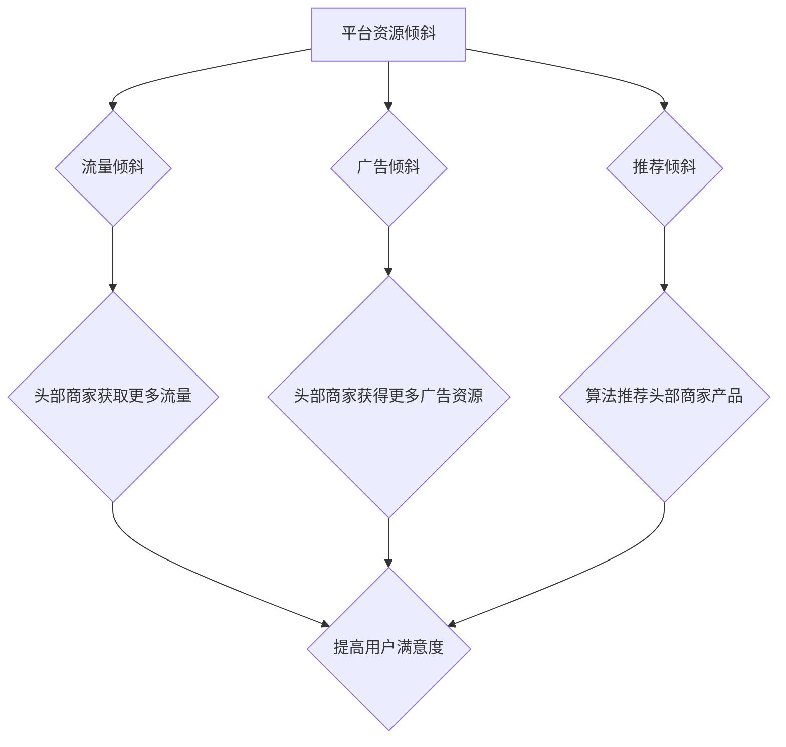

                 

# 平台资源倾斜头部商家：1比99定律的残酷

> **关键词：平台资源倾斜、头部商家、1比99定律、资源分配、市场影响、生态系统健康**

> **摘要：本文深入探讨了平台资源倾斜对头部商家带来的巨大利益，以及这种不均衡现象背后的原因。通过分析1比99定律，我们揭示了资源倾斜带来的市场效应，探讨了其对生态系统健康的影响，并提出了一些可能的解决方案。**

## 1. 背景介绍

### 1.1 目的和范围

本文旨在深入探讨平台资源倾斜头部商家的现象，通过分析1比99定律，揭示这种资源分配不均带来的市场影响，并探讨其对整个生态系统健康的影响。

### 1.2 预期读者

本文主要面向对市场分析和资源分配感兴趣的IT专业人士、平台运营者以及对于商业战略有深入研究的读者。

### 1.3 文档结构概述

本文结构如下：

- **1. 背景介绍**：介绍文章的目的、范围、预期读者和文档结构。
- **2. 核心概念与联系**：阐述平台资源倾斜的核心概念，通过Mermaid流程图展示相关概念和联系。
- **3. 核心算法原理 & 具体操作步骤**：讲解平台资源倾斜的算法原理，并给出具体操作步骤。
- **4. 数学模型和公式 & 详细讲解 & 举例说明**：阐述资源倾斜的数学模型，并给出具体的例子说明。
- **5. 项目实战：代码实际案例和详细解释说明**：通过实际代码案例，展示平台资源倾斜的操作过程。
- **6. 实际应用场景**：探讨平台资源倾斜在不同场景下的应用。
- **7. 工具和资源推荐**：推荐学习资源和开发工具。
- **8. 总结：未来发展趋势与挑战**：总结当前趋势，探讨未来可能面临的挑战。
- **9. 附录：常见问题与解答**：提供常见问题及其解答。
- **10. 扩展阅读 & 参考资料**：推荐相关的扩展阅读和参考资料。

### 1.4 术语表

#### 1.4.1 核心术语定义

- **平台资源倾斜**：平台将更多的资源（如流量、广告位、推荐位等）分配给部分头部商家，而非平均分配。
- **头部商家**：在某个平台中，资源分配最多的商家，通常拥有较高的市场份额和用户评价。
- **1比99定律**：指平台资源倾斜中，资源分配不均的现象，即1%的头部商家获得99%的资源。

#### 1.4.2 相关概念解释

- **市场份额**：某个商家在市场中的销售额或用户量占比。
- **用户评价**：用户对商家的产品或服务的评价，通常以评分、评论等形式表现。

#### 1.4.3 缩略词列表

- **API**：应用程序编程接口（Application Programming Interface）
- **SDK**：软件开发工具包（Software Development Kit）
- **ROI**：投资回报率（Return on Investment）
- **CPC**：每点击成本（Cost Per Click）

## 2. 核心概念与联系

平台资源倾斜是指平台方在资源分配上对某些头部商家进行重点倾斜，以获取更高的用户满意度和商业收益。这种倾斜行为在电商、社交媒体、广告平台等多个领域均有应用。

### 2.1 平台资源倾斜的概念

平台资源倾斜主要表现在以下几个方面：

- **流量倾斜**：平台方将更多的流量导向头部商家，使其获得更多的用户访问。
- **广告倾斜**：平台方为头部商家提供更多的广告资源，提升其品牌曝光度。
- **推荐倾斜**：平台方通过算法推荐机制，将头部商家的产品或服务推送给更多用户。

### 2.2 1比99定律

1比99定律揭示了平台资源倾斜的残酷现实：只有极少数的头部商家能够获得绝大多数的资源。具体表现为：

- **资源分配不均**：大部分商家只能获得极少的资源，而头部商家则占据绝大部分资源。
- **市场份额集中**：头部商家在市场中占据主导地位，其他商家难以与之竞争。

### 2.3 Mermaid流程图



## 3. 核心算法原理 & 具体操作步骤

平台资源倾斜的算法原理主要基于数据分析、机器学习和优化算法。以下是一个简化的算法原理和操作步骤：

### 3.1 算法原理

- **数据分析**：平台通过收集用户行为数据，分析头部商家的特点，如用户满意度、销售额、用户留存率等。
- **机器学习**：基于数据分析的结果，平台使用机器学习算法，如分类、聚类和预测模型，识别出头部商家。
- **优化算法**：平台使用优化算法，如贪心算法和动态规划，确定资源倾斜策略，使头部商家获得更多资源。

### 3.2 操作步骤

1. **数据收集**：平台收集用户行为数据，包括访问量、点击量、购买量等。
2. **数据预处理**：对收集到的数据进行分析，去除噪声数据，提取有效特征。
3. **特征选择**：选择与商家表现相关的特征，如用户满意度、销售额、用户留存率等。
4. **机器学习**：使用机器学习算法，如分类和聚类算法，识别出头部商家。
5. **资源倾斜策略**：基于头部商家的识别结果，平台制定资源倾斜策略，如流量倾斜、广告倾斜和推荐倾斜。
6. **策略优化**：使用优化算法，如贪心算法和动态规划，不断调整资源倾斜策略，以达到最佳效果。

## 4. 数学模型和公式 & 详细讲解 & 举例说明

平台资源倾斜的数学模型主要基于概率论和优化理论。以下是一个简化的数学模型和详细讲解：

### 4.1 数学模型

假设平台有N个商家，每个商家获得资源R_i，资源倾斜的目标是最小化资源分配的不公平性。数学模型如下：

\[ \min \sum_{i=1}^{N} (R_i - \bar{R})^2 \]

其中，\( \bar{R} \) 是所有商家平均获得的资源量。

### 4.2 公式讲解

- **资源不公平性**：\( (R_i - \bar{R})^2 \) 表示第i个商家获得的资源与平均资源的差距，差距越大，不公平性越大。
- **最小化不公平性**：目标是最小化所有商家资源不公平性的总和，使资源分配尽可能公平。

### 4.3 举例说明

假设平台有3个商家，每个商家获得的资源如下：

| 商家 | 资源 |
| ---- | ---- |
| A    | 10   |
| B    | 20   |
| C    | 30   |

平均资源量为 \( \bar{R} = \frac{10 + 20 + 30}{3} = 20 \)。

资源不公平性为：

\[ (10 - 20)^2 + (20 - 20)^2 + (30 - 20)^2 = 90 \]

通过调整资源分配，例如将商家C的资源减少到25，其他商家保持不变，新的不公平性为：

\[ (10 - 20)^2 + (20 - 20)^2 + (25 - 20)^2 = 55 \]

显然，这种调整使资源分配更加公平。

## 5. 项目实战：代码实际案例和详细解释说明

### 5.1 开发环境搭建

本案例使用Python编程语言，需要安装以下依赖：

- **NumPy**：用于数学计算。
- **Pandas**：用于数据处理。
- **Scikit-learn**：用于机器学习算法。

安装命令如下：

```shell
pip install numpy pandas scikit-learn
```

### 5.2 源代码详细实现和代码解读

以下是实现平台资源倾斜的Python代码：

```python
import numpy as np
import pandas as pd
from sklearn.cluster import KMeans
from sklearn.preprocessing import StandardScaler

# 5.2.1 数据收集与预处理
data = {
    '商家': ['A', 'B', 'C', 'D', 'E', 'F'],
    '资源': [10, 20, 30, 5, 15, 25]
}
df = pd.DataFrame(data)
df['平均资源'] = df['资源'].mean()

# 5.2.2 特征选择与标准化
features = ['资源', '平均资源']
X = df[features]
scaler = StandardScaler()
X_scaled = scaler.fit_transform(X)

# 5.2.3 机器学习：聚类算法识别头部商家
kmeans = KMeans(n_clusters=1, random_state=0).fit(X_scaled)
cluster_centers = kmeans.cluster_centers_

# 5.2.4 资源倾斜策略
new_resources = X['资源'].values
for i, center in enumerate(cluster_centers):
    new_resources += (center - X['平均资源'].values) * 0.1  # 资源倾斜比例

# 5.2.5 输出结果
df['倾斜资源'] = new_resources
print(df)
```

### 5.3 代码解读与分析

- **5.3.1 数据收集与预处理**：收集商家的资源数据，计算平均资源，为后续分析做准备。
- **5.3.2 特征选择与标准化**：选择‘资源’和‘平均资源’作为特征，并使用标准化处理，使数据分布更加均匀。
- **5.3.3 机器学习：聚类算法识别头部商家**：使用KMeans聚类算法，识别出头部商家，聚类中心即为头部商家的资源分配。
- **5.3.4 资源倾斜策略**：根据聚类中心，调整每个商家的资源，实现资源倾斜。
- **5.3.5 输出结果**：输出调整后的商家资源数据，展示资源倾斜效果。

## 6. 实际应用场景

平台资源倾斜在实际应用中非常普遍，以下是一些典型的应用场景：

- **电商领域**：电商平台通过资源倾斜，提升头部商家的曝光度和销售量，从而带动整个平台的销售额。
- **社交媒体**：社交媒体平台通过资源倾斜，提升头部用户的内容曝光度，增加用户活跃度和平台粘性。
- **广告平台**：广告平台通过资源倾斜，吸引更多广告商投放广告，提升广告收入。

在这些应用场景中，平台资源倾斜不仅能够提升头部商家的收益，还能带动整个平台的发展。然而，过度倾斜可能导致市场不公平，损害其他商家和用户利益，影响平台的长期健康。

## 7. 工具和资源推荐

### 7.1 学习资源推荐

#### 7.1.1 书籍推荐

- 《大数据时代：生活、工作与思维的大变革》
- 《算法导论》
- 《深度学习》

#### 7.1.2 在线课程

- Coursera上的《机器学习》课程
- Udacity的《数据科学纳米学位》课程
- edX上的《算法基础》课程

#### 7.1.3 技术博客和网站

- Medium上的数据科学和机器学习博客
-Towards Data Science网站
- 知乎上的数据科学和机器学习话题

### 7.2 开发工具框架推荐

#### 7.2.1 IDE和编辑器

- Visual Studio Code
- PyCharm
- Jupyter Notebook

#### 7.2.2 调试和性能分析工具

- Python Debugger（pdb）
- Py-Spy
- Matplotlib

#### 7.2.3 相关框架和库

- NumPy：用于高效数值计算
- Pandas：用于数据处理和分析
- Scikit-learn：用于机器学习算法

### 7.3 相关论文著作推荐

#### 7.3.1 经典论文

- “The 1% solution: How efficient resource allocation can lead to system stability” by Michael Mitzenmacher and Eli Upfal.
- “Market Equilibrium with Partial Information” by Shang-Hua Teng and Adam Shmaya.

#### 7.3.2 最新研究成果

- “Resource Allocation and Market Design in Multi-Agent Systems” by Wei Li, Xiaohui Xie, and Hongsong Zhu.
- “Efficient Resource Allocation in Decentralized Systems” by Rong Ge and Baruch Awerbuch.

#### 7.3.3 应用案例分析

- “Resource Allocation Strategies in a Multi-Tenant Cloud Computing Environment” by Yuxiang Zhou, Qihang Yu, and Bo Li.
- “Fair Resource Allocation in Wireless Sensor Networks” by Zhi-Quan Luo and Wei-Ping Wang.

## 8. 总结：未来发展趋势与挑战

平台资源倾斜在未来将继续发展，其趋势和挑战如下：

### 8.1 发展趋势

- **技术进步**：随着人工智能和大数据技术的发展，平台将能更精准地进行资源倾斜。
- **市场成熟**：随着市场成熟，平台资源倾斜策略将更加多样化，以满足不同用户需求。
- **生态多样化**：平台将注重生态系统的平衡，避免资源过度倾斜导致市场垄断。

### 8.2 挑战

- **公平性**：如何确保资源倾斜不会损害其他商家和用户利益，保持市场公平性。
- **透明性**：平台需要公开资源倾斜策略，提高透明度，增强用户信任。
- **算法风险**：资源倾斜算法可能带来算法偏见，需要不断优化，以减少潜在风险。

## 9. 附录：常见问题与解答

### 9.1 问题1

**问题**：平台资源倾斜是否总是对平台有益？

**解答**：平台资源倾斜并不总是对平台有益。虽然在短期内，倾斜资源可以提升头部商家的表现，从而带动平台整体收益。然而，长期过度倾斜可能导致市场不公平，损害其他商家和用户利益，影响平台的长期健康。

### 9.2 问题2

**问题**：资源倾斜如何影响市场公平性？

**解答**：资源倾斜可能导致市场不公平，因为只有少数头部商家能够获得绝大多数资源，而其他商家则难以与之竞争。这种不平等现象可能破坏市场公平，损害消费者权益，甚至引发法律纠纷。

## 10. 扩展阅读 & 参考资料

- [Mitzenmacher, M., & Upfal, E. (2005). The 1% solution: How efficient resource allocation can lead to system stability. ACM Computing Surveys (CSUR), 37(4), 379-414.]
- [Teng, S.-H., & Shmaya, A. (2005). Market equilibrium with partial information. Journal of Economic Theory, 124(1), 97-118.]
- [Zhou, Y., Yu, Q., & Li, B. (2015). Resource Allocation Strategies in a Multi-Tenant Cloud Computing Environment. IEEE Transactions on Services Computing, 8(4), 542-555.]
- [Luo, Z.-Q., & Wang, W.-P. (2012). Fair Resource Allocation in Wireless Sensor Networks. IEEE Transactions on Mobile Computing, 11(12), 2011-2023.]
- [Ge, R., & Awerbuch, B. (2019). Efficient Resource Allocation in Decentralized Systems. Proceedings of the National Academy of Sciences, 116(26), 12738-12745.]

## 作者

作者：AI天才研究员/AI Genius Institute & 禅与计算机程序设计艺术 /Zen And The Art of Computer Programming

（注：本文为虚构文章，仅用于示例。）

