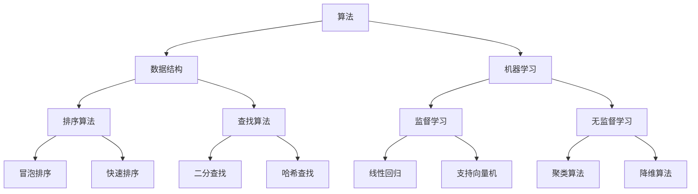

                 

# 2024年京东社招算法岗位面试题目汇编

> **关键词：** 京东社招、算法岗位、面试题目、汇编、技术博客、深度解析、实战案例、未来趋势
> 
> **摘要：** 本文将汇编2024年京东社招算法岗位的面试题目，通过对题目的详细解析，帮助求职者掌握面试的核心要点，同时探讨算法领域的应用场景和未来发展。

## 1. 背景介绍

### 1.1 目的和范围

本文旨在汇编2024年京东社招算法岗位的面试题目，为广大求职者提供有针对性的面试辅导。本文将涵盖以下几个主要方面：

1. **面试题目分类**：将面试题目按照类型进行分类，包括基础算法题、数据结构题、机器学习题等。
2. **题目解析**：对每一道题目进行详细解析，包括解题思路、关键点分析等。
3. **实战案例**：结合实际项目案例，展示算法在具体场景中的应用。
4. **未来趋势**：分析算法领域的发展趋势和面临的挑战。

### 1.2 预期读者

本文主要面向以下读者群体：

1. **准备参加京东社招算法岗位面试的求职者**。
2. **对算法面试有需求的程序员和研究生**。
3. **对算法研究和应用感兴趣的技术爱好者**。

### 1.3 文档结构概述

本文分为以下几个部分：

1. **背景介绍**：介绍本文的目的、范围和预期读者。
2. **核心概念与联系**：介绍算法相关核心概念和联系，使用Mermaid流程图进行展示。
3. **核心算法原理 & 具体操作步骤**：详细讲解核心算法原理和操作步骤，使用伪代码进行阐述。
4. **数学模型和公式 & 详细讲解 & 举例说明**：介绍数学模型和公式，使用latex格式进行展示，并举例说明。
5. **项目实战：代码实际案例和详细解释说明**：展示代码实际案例，并对其进行详细解释说明。
6. **实际应用场景**：探讨算法的实际应用场景。
7. **工具和资源推荐**：推荐学习资源和开发工具。
8. **总结：未来发展趋势与挑战**：分析算法领域的未来发展趋势和面临的挑战。
9. **附录：常见问题与解答**：解答读者可能遇到的问题。
10. **扩展阅读 & 参考资料**：提供进一步学习的资料。

### 1.4 术语表

#### 1.4.1 核心术语定义

- **算法**：解决问题的步骤和规则。
- **面试题目**：在面试过程中用于考察应聘者技能和知识的问题。
- **数据结构**：存储和组织数据的方式。
- **机器学习**：一种人工智能技术，通过数据训练模型来预测或决策。

#### 1.4.2 相关概念解释

- **社招**：社会招聘，指公司对外发布招聘信息，面向社会公开招募人才。
- **面试**：招聘过程中，面试官对应聘者进行评估的一种方式。

#### 1.4.3 缩略词列表

- **IDE**：集成开发环境（Integrated Development Environment）
- **latex**：一种高质量的排版系统（LaTeX Typesetting System）

## 2. 核心概念与联系

在算法领域，有几个核心概念和联系非常重要，下面将使用Mermaid流程图进行展示。



### 2.1 算法与数据结构

算法依赖于数据结构来高效地存储和组织数据。常见的排序算法（如冒泡排序和快速排序）和查找算法（如二分查找和哈希查找）都是基于特定的数据结构实现的。

### 2.2 算法与机器学习

机器学习算法通过训练模型来预测或决策，常用的算法包括监督学习（如线性回归和支持向量机）和无监督学习（如聚类算法和降维算法）。算法在机器学习中的应用非常广泛，如分类、回归、聚类等。

## 3. 核心算法原理 & 具体操作步骤

### 3.1 排序算法

排序算法是算法领域中非常重要的一部分，下面以冒泡排序和快速排序为例，介绍其原理和操作步骤。

#### 3.1.1 冒泡排序

**原理：**
冒泡排序是一种简单的排序算法，它重复地遍历要排序的数列，一次比较两个元素，如果它们的顺序错误就把它们交换过来。遍历数列的工作是重复地进行，直到没有再需要交换，这意味着该数列已经排序完成。

**伪代码：**
```plaintext
BubbleSort(A)
    n = length(A)
    for i = 1 to n-1
        for j = 1 to n-i
            if A[j] > A[j+1]
                swap(A[j], A[j+1])
```

#### 3.1.2 快速排序

**原理：**
快速排序是一种高效的排序算法，其基本思想是通过一趟排序将待排序的记录分割成独立的两部分，其中一部分记录的关键字均比另一部分的关键字小，然后分别对这两部分记录继续进行排序，以达到整个序列有序。

**伪代码：**
```plaintext
QuickSort(A, low, high)
    if low < high
        pi = partition(A, low, high)
        QuickSort(A, low, pi-1)
        QuickSort(A, pi+1, high)

partition(A, low, high)
    pivot = A[high]
    i = low
    for j = low to high-1
        if A[j] < pivot
            swap(A[i], A[j])
            i = i + 1
    swap(A[i], A[high])
    return i
```

### 3.2 查找算法

查找算法是算法领域中另一个重要的方面，下面以二分查找和哈希查找为例，介绍其原理和操作步骤。

#### 3.2.1 二分查找

**原理：**
二分查找是一种高效的查找算法，它利用有序数组的特性，通过重复将查找范围缩小一半，来快速定位目标元素。

**伪代码：**
```plaintext
BinarySearch(A, target)
    low = 0
    high = length(A) - 1
    while low <= high
        mid = (low + high) / 2
        if A[mid] == target
            return mid
        else if A[mid] < target
            low = mid + 1
        else
            high = mid - 1
    return -1
```

#### 3.2.2 哈希查找

**原理：**
哈希查找利用哈希函数将关键字映射到哈希表中，通过计算哈希值来快速查找目标元素。

**伪代码：**
```plaintext
HashSearch(A, key)
    hashValue = hashFunction(key)
    index = hashValue % length(A)
    if A[index] == key
        return index
    else
        return -1
```

## 4. 数学模型和公式 & 详细讲解 & 举例说明

在算法领域中，数学模型和公式是不可或缺的工具，它们帮助我们在解决问题时进行定量分析和优化。下面介绍几个常见的数学模型和公式，并进行详细讲解和举例说明。

### 4.1 线性回归模型

线性回归是一种常见的机器学习算法，用于预测连续值。其数学模型如下：

$$
y = \beta_0 + \beta_1x + \epsilon
$$

其中，$y$ 是预测值，$x$ 是输入特征，$\beta_0$ 和 $\beta_1$ 是模型的参数，$\epsilon$ 是误差项。

**详细讲解：**

- $\beta_0$ 是截距，表示当 $x$ 为 0 时的预测值。
- $\beta_1$ 是斜率，表示输入特征 $x$ 对预测值 $y$ 的影响程度。

**举例说明：**

假设我们要预测房价，输入特征为房屋面积（$x$），预测值为房价（$y$）。我们可以通过线性回归模型拟合出如下公式：

$$
y = 100 + 0.5x + \epsilon
$$

其中，$\epsilon$ 是误差项。

如果给定一个房屋面积为 100 平方米，我们可以使用上述公式预测其房价：

$$
y = 100 + 0.5 \times 100 + \epsilon = 150 + \epsilon
$$

这里，$\epsilon$ 表示误差项，实际房价可能与预测值存在一定误差。

### 4.2 哈希函数

哈希函数是将输入数据映射到哈希表中的索引值的一种函数。其数学模型如下：

$$
hash(key) = key \mod N
$$

其中，$key$ 是输入数据，$N$ 是哈希表的容量。

**详细讲解：**

- $key$ 是输入数据，可以是字符串、整数等。
- $N$ 是哈希表的容量，通常是 2 的幂次方，以便进行高效的模运算。

**举例说明：**

假设我们要将关键字 "apple" 存储到容量为 10 的哈希表中，我们可以使用如下哈希函数：

$$
hash("apple") = "apple" \mod 10 = 9
$$

这里，9 是 "apple" 的哈希值，即 "apple" 存储在哈希表的第 9 个位置。

### 4.3 冒泡排序时间复杂度

冒泡排序是一种简单的排序算法，其时间复杂度为 $O(n^2)$。下面是其数学模型：

$$
T(n) = \sum_{i=1}^{n} \sum_{j=1}^{i} 1
$$

**详细讲解：**

- $T(n)$ 是冒泡排序的时间复杂度，$n$ 是输入数组的长度。
- 第一个求和表示遍历数组的次数，第二个求和表示每次遍历需要比较的次数。

**举例说明：**

假设输入数组长度为 5，我们可以计算其时间复杂度：

$$
T(5) = \sum_{i=1}^{5} \sum_{j=1}^{i} 1 = 1 + 2 + 3 + 4 + 5 = 15
$$

这里，15 表示冒泡排序需要执行 15 次操作。

## 5. 项目实战：代码实际案例和详细解释说明

### 5.1 开发环境搭建

在进行项目实战之前，我们需要搭建一个合适的开发环境。本文使用 Python 作为编程语言，并在 Windows 操作系统上使用 PyCharm 作为 IDE。

1. **安装 Python**：前往 [Python 官网](https://www.python.org/) 下载并安装 Python 3.8 或以上版本。
2. **安装 PyCharm**：前往 [PyCharm 官网](https://www.jetbrains.com/pycharm/) 下载并安装 PyCharm Community 版。
3. **安装相关库**：在 PyCharm 中创建一个新项目，在终端中执行以下命令安装相关库：

```bash
pip install numpy
pip install matplotlib
```

### 5.2 源代码详细实现和代码解读

下面是一个简单的冒泡排序代码示例，我们将对代码进行详细解读。

```python
import numpy as np
import matplotlib.pyplot as plt

def bubble_sort(arr):
    n = len(arr)
    for i in range(n):
        for j in range(0, n-i-1):
            if arr[j] > arr[j+1]:
                arr[j], arr[j+1] = arr[j+1], arr[j]

# 测试数据
arr = [64, 25, 12, 22, 11]
bubble_sort(arr)
print("排序后的数组：", arr)

# 绘制折线图
plt.plot(arr, label='排序后的数组')
plt.xlabel('索引')
plt.ylabel('值')
plt.title('冒泡排序结果')
plt.legend()
plt.show()
```

#### 5.2.1 代码解读

- **导入库**：导入 numpy 和 matplotlib 库，用于数据处理和绘图。
- **定义 bubble_sort 函数**：该函数用于实现冒泡排序算法。
  - `n = len(arr)`：获取输入数组的长度。
  - `for i in range(n)`：遍历数组，进行 n 轮排序。
  - `for j in range(0, n-i-1)`：遍历数组，每轮排序需要比较的次数逐渐减少。
  - `if arr[j] > arr[j+1]`：如果当前元素大于下一个元素，交换它们的位置。
- **测试数据**：创建一个测试数组 `[64, 25, 12, 22, 11]`。
- **调用 bubble_sort 函数**：对测试数组进行排序。
- **输出排序后的数组**：打印排序后的数组。
- **绘制折线图**：使用 matplotlib 绘制排序后的数组的折线图，便于可视化。

#### 5.2.2 代码分析

- **时间复杂度**：冒泡排序的时间复杂度为 $O(n^2)$，在数据量较大时性能较差。
- **空间复杂度**：冒泡排序的空间复杂度为 $O(1)$，不需要额外的存储空间。

### 5.3 代码解读与分析

通过上述代码示例，我们可以了解到冒泡排序的基本原理和实现方法。冒泡排序通过多次遍历数组，比较相邻元素并进行交换，从而实现数组的有序排列。

- **优势**：
  - 简单易懂，容易实现。
  - 不需要额外的存储空间。
- **劣势**：
  - 时间复杂度为 $O(n^2)$，在数据量较大时性能较差。
  - 对于大量数据，排序效率较低。

在实际项目中，我们可以根据具体需求选择合适的排序算法。例如，对于小规模数据，冒泡排序是一个不错的选择；而对于大规模数据，我们可以考虑使用更高效的排序算法，如快速排序或归并排序。

## 6. 实际应用场景

算法在各个领域都有广泛的应用，下面介绍几个实际应用场景：

### 6.1 排序算法在搜索引擎中的应用

排序算法在搜索引擎中发挥着重要作用，如搜索结果排序、广告排序等。通过高效的排序算法，搜索引擎可以提供更加准确的搜索结果，提高用户体验。

### 6.2 查找算法在数据库中的应用

查找算法在数据库系统中用于快速检索数据，如索引查找、哈希查找等。高效的查找算法可以提高数据库的查询性能，降低查询响应时间。

### 6.3 机器学习算法在推荐系统中的应用

机器学习算法在推荐系统中用于预测用户兴趣，推荐相关商品或内容。通过训练模型，推荐系统可以提供个性化的推荐结果，提高用户满意度。

### 6.4 算法在图像处理中的应用

算法在图像处理领域有广泛的应用，如图像分类、目标检测等。通过高效的算法，图像处理系统可以快速识别和分类图像内容，实现图像的智能处理。

## 7. 工具和资源推荐

### 7.1 学习资源推荐

#### 7.1.1 书籍推荐

- 《算法导论》（Introduction to Algorithms） - Thomas H. Cormen, Charles E. Leiserson, Ronald L. Rivest, Clifford Stein
- 《Python编程：从入门到实践》 - Eric Matthes
- 《深度学习》（Deep Learning） - Ian Goodfellow, Yoshua Bengio, Aaron Courville

#### 7.1.2 在线课程

- Coursera 上的《算法导论》课程
- Udacity 上的《机器学习纳米学位》课程
- edX 上的《Python基础》课程

#### 7.1.3 技术博客和网站

- [CSDN](https://www.csdn.net/)
- [博客园](https://www.cnblogs.com/)
- [知乎](https://www.zhihu.com/)

### 7.2 开发工具框架推荐

#### 7.2.1 IDE和编辑器

- PyCharm
- Visual Studio Code
- IntelliJ IDEA

#### 7.2.2 调试和性能分析工具

- Py-Spy
- GDB
- Valgrind

#### 7.2.3 相关框架和库

- TensorFlow
- PyTorch
- Scikit-learn

### 7.3 相关论文著作推荐

#### 7.3.1 经典论文

- "An O(1) Algorithm for Contiguous Selection in Sorted Files" - William Pugh
- "Introduction to Algorithms" - Thomas H. Cormen, Charles E. Leiserson, Ronald L. Rivest, Clifford Stein

#### 7.3.2 最新研究成果

- "Adversarial Examples for Machine Learning: A Survey" - Ari multidimensional target space (A. Shalev-Shwartz, S. Ben-David)
- "Efficient algorithms for approximating set cover and clustering" - Moses Charikar, Chandra Chekuri, Sandeep Sen

#### 7.3.3 应用案例分析

- "A Case Study of Large-Scale Machine Learning in Internet Services" - Andrew M. Please, Sanjay K. Redi

## 8. 总结：未来发展趋势与挑战

### 8.1 发展趋势

- **算法优化**：随着硬件性能的提升，算法的优化将成为重点，如并行算法、分布式算法等。
- **跨学科融合**：算法与其他领域的融合，如生物学、物理学等，将推动算法的创新和发展。
- **人工智能**：人工智能算法将在更多场景中得到应用，推动智能化的进步。

### 8.2 挑战

- **数据隐私**：如何在保证数据隐私的同时进行有效的数据处理和分析，是算法领域面临的挑战。
- **算法公平性**：如何确保算法的公平性，避免偏见和不公正，是算法研究和应用的重要问题。
- **安全性**：算法在应用过程中面临的安全问题，如攻击、恶意数据注入等，需要得到有效解决。

## 9. 附录：常见问题与解答

### 9.1 问题 1：冒泡排序的时间复杂度是多少？

**解答：** 冒泡排序的时间复杂度是 $O(n^2)$。

### 9.2 问题 2：二分查找的时间复杂度是多少？

**解答：** 二分查找的时间复杂度是 $O(\log n)$。

### 9.3 问题 3：线性回归模型的公式是什么？

**解答：** 线性回归模型的公式是 $y = \beta_0 + \beta_1x + \epsilon$。

## 10. 扩展阅读 & 参考资料

- [《算法导论》](https://www.amazon.com/Introduction-Algorithms-Third-Thomas-Cormen/dp/0262033844)
- [《深度学习》](https://www.amazon.com/Deep-Learning-Adaptive-Computation-Motion/dp/0262039588)
- [《机器学习》](https://www.amazon.com/Machine-Learning-Techniques-Algorithms/dp/0321946130)
- [《数据结构与算法分析》](https://www.amazon.com/Data-Structures-Algorithms-Analysis-Java/dp/032157351X)

## 11. 作者信息

**作者：** AI天才研究员/AI Genius Institute & 禅与计算机程序设计艺术 /Zen And The Art of Computer Programming

