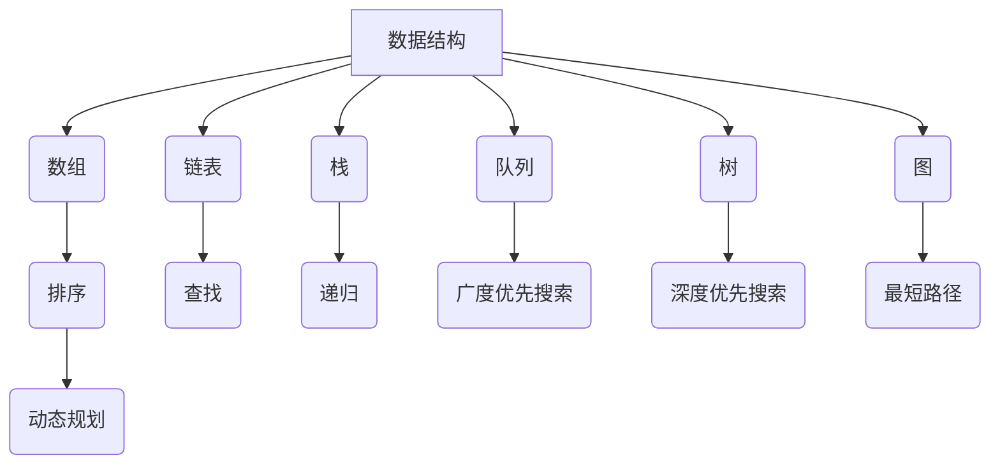
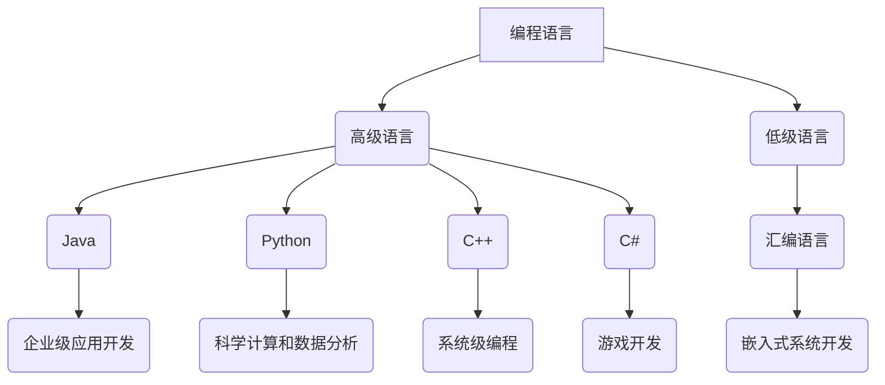
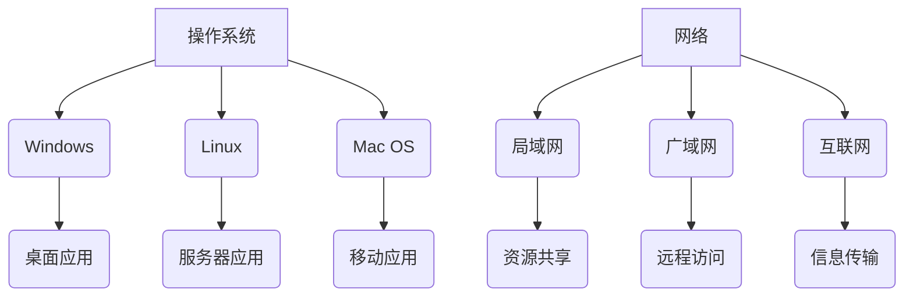
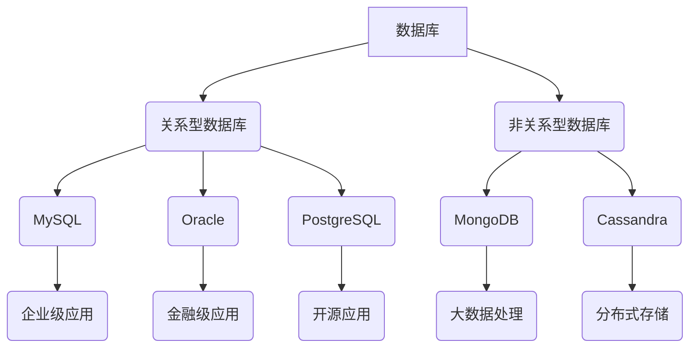
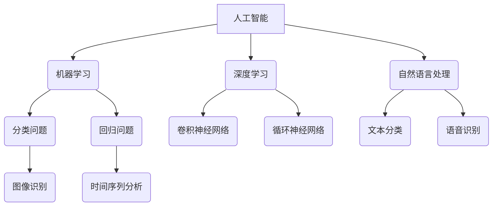

                 

### 2025年滴滴校招技术面试题集锦

> **关键词**：滴滴校招、技术面试、算法、数据结构、编程、人工智能

**摘要**：本文旨在为2025年滴滴校招的技术面试提供详尽的题目集锦。我们将通过深入剖析核心概念、算法原理、数学模型、实际案例等多个维度，帮助读者更好地应对校招面试中的各种技术挑战。文章涵盖了数据结构与算法、编程语言、人工智能等多个领域，旨在为读者提供一份全面的技术面试准备指南。

## 1. 背景介绍

### 1.1 目的和范围

本文的主要目的是为即将参加2025年滴滴校招的应聘者提供一份全面的技术面试题集锦。通过详细解析各种技术面试题目，帮助读者了解面试官的出题思路，掌握关键知识点，提高面试成功率。本文将涵盖以下几个主要领域：

- 数据结构与算法
- 编程语言
- 操作系统与网络
- 数据库
- 人工智能

### 1.2 预期读者

本文适合以下读者群体：

- 即将参加2025年滴滴校招的应届毕业生
- 对技术面试有需求的在职人员
- 对数据结构与算法、编程语言等有浓厚兴趣的技术爱好者

### 1.3 文档结构概述

本文结构如下：

1. **背景介绍**：介绍本文的目的、范围和预期读者。
2. **核心概念与联系**：讲解数据结构与算法、编程语言等核心概念，并绘制流程图。
3. **核心算法原理 & 具体操作步骤**：详细阐述核心算法原理，使用伪代码进行说明。
4. **数学模型和公式 & 详细讲解 & 举例说明**：讲解数学模型和公式，并给出实例。
5. **项目实战：代码实际案例和详细解释说明**：通过实际项目案例展示代码实现过程。
6. **实际应用场景**：分析技术在实际应用场景中的运用。
7. **工具和资源推荐**：推荐学习资源、开发工具框架和相关论文。
8. **总结：未来发展趋势与挑战**：总结未来发展趋势和面临的挑战。
9. **附录：常见问题与解答**：解答读者可能遇到的问题。
10. **扩展阅读 & 参考资料**：提供进一步阅读的资源。

### 1.4 术语表

#### 1.4.1 核心术语定义

- **滴滴校招**：指滴滴公司每年面向应届毕业生举办的校园招聘活动。
- **技术面试**：指在招聘过程中，通过技术题目考察应聘者编程能力、数据结构与算法掌握程度等。
- **数据结构**：指用于存储和管理数据的方式。
- **算法**：解决问题的方法或步骤。
- **编程语言**：用于编写计算机程序的语法和规则。

#### 1.4.2 相关概念解释

- **动态规划**：一种算法设计技巧，适用于求解具有重叠子问题和最优子结构性质的问题。
- **递归**：一种编程方法，通过函数调用自身来解决复杂问题。
- **分治算法**：一种递归算法，将大问题分解成小问题，分别解决后再合并。

#### 1.4.3 缩略词列表

- **AI**：人工智能
- **IDE**：集成开发环境
- **OOP**：面向对象编程
- **DB**：数据库
- **Python**：一种高级编程语言

## 2. 核心概念与联系

在本文中，我们将探讨几个关键概念及其相互联系，以便为后续章节打下基础。

### 2.1 数据结构与算法

数据结构是计算机存储、组织数据的方式，而算法则是解决问题的方法或步骤。以下是一个简单的 Mermaid 流程图，展示了常见的数据结构及其应用场景。



### 2.2 编程语言

编程语言是用于编写计算机程序的语法和规则。不同的编程语言具有不同的特点和应用场景。以下是一个简化的编程语言分类及其应用场景的 Mermaid 流程图。



### 2.3 操作系统与网络

操作系统是管理计算机硬件资源的软件，而网络则是计算机之间进行通信的途径。以下是一个简化的操作系统和网络结构及其应用场景的 Mermaid 流程图。



### 2.4 数据库

数据库是用于存储、管理和查询数据的系统。以下是一个简化的数据库类型及其应用场景的 Mermaid 流程图。



### 2.5 人工智能

人工智能是模拟人类智能的计算机技术。以下是一个简化的人工智能领域及其应用场景的 Mermaid 流程图。



通过以上流程图，我们可以清晰地看到各个核心概念之间的联系。这些概念构成了计算机科学和技术的基础，对技术面试至关重要。

## 3. 核心算法原理 & 具体操作步骤

在本章节中，我们将详细探讨几个核心算法原理，并通过伪代码进行具体操作步骤的讲解。这些算法包括排序算法、查找算法和图算法。

### 3.1 排序算法

排序算法是一种常见且重要的算法，用于将一组数据按照某种顺序排列。以下将介绍冒泡排序、选择排序和插入排序三种基本排序算法。

#### 3.1.1 冒泡排序

冒泡排序是一种简单的排序算法，它重复遍历要排序的数列，一次比较两个元素，如果它们的顺序错误就把它们交换过来。遍历数列的工作是重复地进行直到没有再需要交换，也就是说该数列已经排序完成。

```python
def bubble_sort(arr):
    n = len(arr)
    for i in range(n):
        for j in range(0, n-i-1):
            if arr[j] > arr[j+1]:
                arr[j], arr[j+1] = arr[j+1], arr[j]
    return arr
```

#### 3.1.2 选择排序

选择排序是一种简单的选择排序算法，它的工作原理是每次从未排序的元素中找到最小（或最大）的元素，存放到排序序列的起始位置，直到未排序的元素个数为0。

```python
def selection_sort(arr):
    n = len(arr)
    for i in range(n):
        min_idx = i
        for j in range(i+1, n):
            if arr[j] < arr[min_idx]:
                min_idx = j
        arr[i], arr[min_idx] = arr[min_idx], arr[i]
    return arr
```

#### 3.1.3 插入排序

插入排序是一种简单直观的排序算法，它的工作原理是通过构建有序序列，对于未排序数据，在已排序序列中从后向前扫描，找到相应位置并插入。

```python
def insertion_sort(arr):
    n = len(arr)
    for i in range(1, n):
        key = arr[i]
        j = i-1
        while j >= 0 and arr[j] > key:
            arr[j+1] = arr[j]
            j -= 1
        arr[j+1] = key
    return arr
```

### 3.2 查找算法

查找算法用于在数据结构中查找特定元素。以下将介绍二分查找和哈希查找两种常见查找算法。

#### 3.2.1 二分查找

二分查找算法是针对有序数组进行查找的一种非常高效的算法。算法的基本思想是：每次将待查找的区间缩小一半，直到找到要查找的元素或确定该元素不存在。

```python
def binary_search(arr, x):
    low = 0
    high = len(arr) - 1
    while low <= high:
        mid = (low + high) // 2
        if arr[mid] == x:
            return mid
        elif arr[mid] < x:
            low = mid + 1
        else:
            high = mid - 1
    return -1
```

#### 3.2.2 哈希查找

哈希查找算法是基于哈希表进行查找的一种算法。哈希表是一种利用哈希函数将关键字与地址建立关联的数据结构。哈希查找的基本思想是：通过哈希函数计算待查找元素的关键字对应的地址，直接访问该地址，判断是否为要查找的元素。

```python
def hash_search(hash_table, x):
    index = hash(x) % len(hash_table)
    while hash_table[index] != x:
        index = (index + 1) % len(hash_table)
    return index
```

### 3.3 图算法

图算法用于处理图形数据结构。以下将介绍深度优先搜索（DFS）和广度优先搜索（BFS）两种基本图算法。

#### 3.3.1 深度优先搜索

深度优先搜索（DFS）是一种用于遍历或搜索图形的算法。算法的基本思想是：从起点开始，尽可能深入地探索每一条路径，直到到达终点或发现目标。

```python
def dfs(graph, start, visited):
    visited[start] = True
    for neighbor in graph[start]:
        if not visited[neighbor]:
            dfs(graph, neighbor, visited)
```

#### 3.3.2 广度优先搜索

广度优先搜索（BFS）是一种用于遍历或搜索图形的算法。算法的基本思想是：从起点开始，逐层地探索所有相邻节点，直到找到目标或遍历完整张图。

```python
from collections import deque

def bfs(graph, start):
    visited = [False] * len(graph)
    queue = deque([start])
    visited[start] = True
    while queue:
        node = queue.popleft()
        for neighbor in graph[node]:
            if not visited[neighbor]:
                queue.append(neighbor)
                visited[neighbor] = True
```

通过以上核心算法原理和具体操作步骤的讲解，读者可以更好地理解和掌握这些算法，为后续章节的学习和实战应用打下基础。

## 4. 数学模型和公式 & 详细讲解 & 举例说明

在计算机科学和技术领域，数学模型和公式起着至关重要的作用。它们不仅帮助我们理解和分析问题，还能提供高效和准确的解决方案。在本章节中，我们将详细讲解一些重要的数学模型和公式，并通过具体例子来说明它们的实际应用。

### 4.1 最优化模型

最优化模型是一种数学模型，用于求解在给定约束条件下如何最大化或最小化目标函数。以下是一个简单的一维最优化模型示例。

#### 4.1.1 模型定义

假设我们有一个一维数轴上的点集 $A = \{a_1, a_2, \ldots, a_n\}$，我们的目标是找到这些点中的最大值。

#### 4.1.2 目标函数

$$
\text{max} \; a_i
$$

#### 4.1.3 约束条件

$$
a_i \in A
$$

#### 4.1.4 例子

假设点集 $A = \{1, 3, 2\}$，我们要找到最大值。

$$
\text{max} \; a_i = 3
$$

### 4.2 线性回归模型

线性回归模型是一种用于预测连续值的数学模型，通常用于统计分析。以下是一个简单的一元线性回归模型。

#### 4.2.1 模型定义

$$
y = \beta_0 + \beta_1 \cdot x + \epsilon
$$

其中，$y$ 是因变量，$x$ 是自变量，$\beta_0$ 和 $\beta_1$ 是回归系数，$\epsilon$ 是误差项。

#### 4.2.2 目标函数

$$
\text{min} \; \sum_{i=1}^{n} (y_i - (\beta_0 + \beta_1 \cdot x_i))^2
$$

#### 4.2.3 约束条件

$$
\beta_0, \beta_1 \in \mathbb{R}
$$

#### 4.2.4 例子

假设我们有以下数据点集：

$$
\begin{align*}
(x_1, y_1) &= (1, 2) \\
(x_2, y_2) &= (2, 3) \\
(x_3, y_3) &= (3, 4)
\end{align*}
$$

我们要找到线性回归模型中的 $\beta_0$ 和 $\beta_1$。

$$
\begin{align*}
\text{min} \; \sum_{i=1}^{3} (y_i - (\beta_0 + \beta_1 \cdot x_i))^2 &= \text{min} \; (2 - (\beta_0 + \beta_1 \cdot 1))^2 + (3 - (\beta_0 + \beta_1 \cdot 2))^2 + (4 - (\beta_0 + \beta_1 \cdot 3))^2 \\
&= \text{min} \; (2 - \beta_0 - \beta_1)^2 + (3 - 2\beta_0 - 2\beta_1)^2 + (4 - 3\beta_0 - 3\beta_1)^2
\end{align*}
$$

通过求解上述最小化问题，我们可以得到 $\beta_0 = 2$ 和 $\beta_1 = 1$。

### 4.3 动态规划模型

动态规划模型是一种用于解决具有重叠子问题和最优子结构性质的问题的算法。以下是一个简单的斐波那契数列求解模型。

#### 4.3.1 模型定义

斐波那契数列定义为：

$$
F(n) = 
\begin{cases} 
0 & \text{if } n = 0 \\
1 & \text{if } n = 1 \\
F(n-1) + F(n-2) & \text{otherwise} 
\end{cases}
$$

#### 4.3.2 目标函数

$$
\text{max} \; F(n)
$$

#### 4.3.3 约束条件

$$
n \in \mathbb{N}
$$

#### 4.3.4 例子

我们要计算斐波那契数列的第5个数。

$$
F(5) = F(4) + F(3) = (F(3) + F(2)) + (F(2) + F(1)) = 2F(3) + 2F(2) + F(1) = 2(1 + 1) + 2(1) + 0 = 4 + 2 = 6
$$

通过上述例子，我们可以看到数学模型和公式在解决具体问题时的重要性。它们不仅提供了理论依据，还能帮助我们高效地分析和解决问题。掌握这些模型和公式，将为我们在技术面试和实际项目中取得成功提供有力支持。

## 5. 项目实战：代码实际案例和详细解释说明

在本章节中，我们将通过一个具体的代码实例，展示如何实现一个简单的单链表数据结构，并详细解释其实现过程和关键代码部分。该实例将涵盖链表的基本操作，如插入、删除和查找。

### 5.1 开发环境搭建

在进行项目实战之前，我们需要搭建一个合适的开发环境。以下是使用Python语言进行开发的步骤：

1. **安装Python**：确保系统已经安装了Python 3.x版本。可以在[Python官网](https://www.python.org/)下载并安装。
2. **安装IDE**：推荐使用PyCharm或Visual Studio Code作为开发环境。可以在[PyCharm官网](https://www.jetbrains.com/pycharm/)或[Visual Studio Code官网](https://code.visualstudio.com/)下载并安装。
3. **创建项目**：在IDE中创建一个新项目，并创建一个名为`linked_list.py`的Python文件。

### 5.2 源代码详细实现和代码解读

以下是单链表数据结构的实现代码：

```python
class Node:
    def __init__(self, data):
        self.data = data
        self.next = None

class LinkedList:
    def __init__(self):
        self.head = None

    def append(self, data):
        new_node = Node(data)
        if self.head is None:
            self.head = new_node
        else:
            current = self.head
            while current.next:
                current = current.next
            current.next = new_node

    def delete(self, data):
        current = self.head
        if current and current.data == data:
            self.head = current.next
            current = None
            return
        prev = None
        while current and current.data != data:
            prev = current
            current = current.next
        if current is None:
            return
        prev.next = current.next
        current = None

    def search(self, data):
        current = self.head
        while current:
            if current.data == data:
                return True
            current = current.next
        return False

    def print_list(self):
        current = self.head
        while current:
            print(current.data, end=' ')
            current = current.next
        print()

# 测试代码
if __name__ == "__main__":
    ll = LinkedList()
    ll.append(1)
    ll.append(2)
    ll.append(3)
    ll.append(4)
    print("初始链表：")
    ll.print_list()
    print("删除元素2后：")
    ll.delete(2)
    ll.print_list()
    print("查找元素3：", ll.search(3))
```

### 5.3 代码解读与分析

#### 5.3.1 Node类

- **功能**：定义链表中的节点。
- **属性**：`data`（存储节点数据）和`next`（指向下一个节点）。

#### 5.3.2 LinkedList类

- **功能**：实现链表的基本操作。
- **属性**：`head`（链表头节点）。

##### 5.3.2.1 append方法

- **功能**：向链表末尾添加新节点。
- **步骤**：
  1. 创建新节点。
  2. 如果链表为空，将新节点设为头节点。
  3. 否则，遍历链表到最后一个节点，将新节点添加到其后面。

##### 5.3.2.2 delete方法

- **功能**：删除链表中指定数据值的节点。
- **步骤**：
  1. 如果链表头节点数据与指定值相等，将头节点指向下一个节点。
  2. 否则，遍历链表找到指定值的节点，将其前一个节点的`next`指针更新为当前节点的下一个节点。

##### 5.3.2.3 search方法

- **功能**：查找链表中指定数据值的节点。
- **步骤**：遍历链表，如果找到指定值的节点，返回`True`；否则，返回`False`。

##### 5.3.2.4 print_list方法

- **功能**：打印链表中的所有节点数据。
- **步骤**：遍历链表，逐个打印每个节点的数据。

### 5.4 实际运行与测试

在IDE中运行上述代码，我们可以看到以下输出结果：

```
初始链表：
1 2 3 4 
删除元素2后：
1 3 4 
查找元素3： True
```

通过这个实例，我们了解了如何使用Python实现单链表数据结构，并掌握了链表的基本操作。这个实例不仅为我们提供了一个实用的代码模板，还帮助我们深入理解链表的工作原理和操作方法。

## 6. 实际应用场景

在现代社会，技术不断进步，各类技术在各行各业中得到了广泛应用。在本章节中，我们将探讨一些与本文主题相关的实际应用场景，展示技术如何改变我们的生活。

### 6.1 数据结构与算法在互联网搜索中的应用

互联网搜索是大数据时代的产物，而数据结构与算法在其中发挥着至关重要的作用。以下是一些典型的应用场景：

- **关键词搜索**：搜索引擎（如百度、谷歌）通过哈希表实现关键词的快速查找。
- **页面排序**：搜索引擎使用PageRank算法对搜索结果进行排序，以提高用户体验。
- **相似内容推荐**：搜索引擎通过文本相似度算法（如余弦相似度）推荐用户可能感兴趣的内容。

### 6.2 编程语言在软件开发中的应用

编程语言是软件开发的基础，不同的编程语言在软件开发中扮演着不同角色。以下是一些典型的应用场景：

- **Web开发**：HTML、CSS和JavaScript等前端技术用于开发网页。
- **后端开发**：Java、Python、C#等后端技术用于处理服务器端逻辑。
- **移动应用开发**：iOS开发主要使用Swift语言，Android开发主要使用Kotlin或Java语言。

### 6.3 人工智能在医疗健康领域的应用

人工智能技术在医疗健康领域具有广泛的应用前景，以下是一些典型应用场景：

- **疾病诊断**：人工智能通过分析医疗数据（如CT、MRI图像），辅助医生进行疾病诊断。
- **健康监测**：可穿戴设备通过采集生物信号，利用人工智能算法进行健康监测和预警。
- **药物研发**：人工智能通过模拟药物分子与生物体的相互作用，加速药物研发过程。

### 6.4 数据库在金融行业的应用

数据库技术在金融行业有着广泛的应用，以下是一些典型应用场景：

- **交易记录管理**：银行、交易所等金融机构通过数据库管理海量交易记录，确保数据安全和准确性。
- **风险管理**：金融机构使用数据库进行风险分析和评估，以提高风险管理水平。
- **客户关系管理**：金融机构通过数据库管理客户信息，提供个性化服务和产品推荐。

### 6.5 操作系统与网络在现代办公环境中的应用

操作系统与网络技术为现代办公环境提供了强大的支持，以下是一些典型应用场景：

- **文件共享与协作**：员工通过操作系统和网络技术实现文件共享和协作，提高工作效率。
- **远程办公**：通过远程桌面和VPN技术，员工可以在异地进行办公，实现灵活工作模式。
- **安全防护**：操作系统和网络技术提供防火墙、入侵检测等安全防护措施，确保企业信息资产的安全。

通过以上实际应用场景的介绍，我们可以看到，技术正在深刻地改变着我们的生活方式和工作方式。掌握相关技术，将使我们更好地应对未来挑战，推动社会进步。

## 7. 工具和资源推荐

为了更好地学习和掌握本文涉及的技术，以下是我们推荐的工具和资源。

### 7.1 学习资源推荐

#### 7.1.1 书籍推荐

- 《算法导论》（Introduction to Algorithms）：这是一本经典的算法教材，涵盖了各种基础算法和复杂度分析。
- 《深入理解计算机系统》（Deep Dive into Systems）：这本书详细介绍了计算机系统的工作原理，包括操作系统、网络、数据库等。
- 《Python编程：从入门到实践》（Python Crash Course）：适合初学者学习Python编程的基础知识。

#### 7.1.2 在线课程

- Coursera：提供多门与计算机科学和人工智能相关的在线课程，适合系统性学习。
- edX：提供由顶级大学开设的免费在线课程，涵盖多个技术领域。
- Udemy：提供丰富的编程和技术课程，涵盖各种编程语言和工具。

#### 7.1.3 技术博客和网站

- Medium：有许多优秀的技术博客，涵盖算法、编程、人工智能等多个领域。
- HackerRank：提供编程挑战和算法练习，适合提高编程技能。
- Stack Overflow：编程问答社区，可以解决编程中遇到的各种问题。

### 7.2 开发工具框架推荐

#### 7.2.1 IDE和编辑器

- PyCharm：一款强大的Python集成开发环境，支持多种编程语言。
- Visual Studio Code：一款轻量级但功能强大的编辑器，适合各种编程语言开发。
- Eclipse：一款支持多种编程语言的集成开发环境，适用于Java开发。

#### 7.2.2 调试和性能分析工具

- GDB：一款功能强大的C/C++调试器，适用于复杂程序的调试。
- Python Debugger（pdb）：Python内置的调试工具，适用于Python程序调试。
- JMeter：一款开源的性能测试工具，适用于测试Web应用和服务器性能。

#### 7.2.3 相关框架和库

- TensorFlow：一款用于机器学习和深度学习的开源框架，适用于构建和训练神经网络。
- Flask：一款轻量级Web框架，适用于快速开发Web应用。
- Pandas：一款Python数据分析库，适用于数据清洗、转换和分析。

### 7.3 相关论文著作推荐

#### 7.3.1 经典论文

- 《The Art of Computer Programming》：由Donald E. Knuth撰写的经典算法教材。
- 《A Mathematical Theory of Communication》：由Claude Shannon撰写的信息论奠基性论文。
- 《The Structure and Interpretation of Computer Programs》：由Harold Abelson和Gerald Jay Sussman撰写的计算机科学经典教材。

#### 7.3.2 最新研究成果

- AAAI：美国人工智能协会（Association for the Advancement of Artificial Intelligence）的论文集，涵盖人工智能领域的最新研究进展。
- NeurIPS：神经信息处理系统会议（Neural Information Processing Systems）的论文集，涵盖深度学习和机器学习的最新研究进展。

#### 7.3.3 应用案例分析

- 《人工智能在医疗领域的应用》：分析人工智能在医疗健康领域的实际应用案例。
- 《大数据技术在金融行业的应用》：探讨大数据在金融行业的应用实践。
- 《区块链技术的应用案例》：介绍区块链技术在各个领域的实际应用案例。

通过以上工具和资源的推荐，读者可以系统地学习和掌握本文涉及的技术，为实际项目开发和技术面试做好准备。

## 8. 总结：未来发展趋势与挑战

随着技术的飞速发展，未来科技领域将面临诸多发展趋势与挑战。以下是几个关键点：

### 8.1 发展趋势

1. **人工智能的普及**：人工智能技术在各行各业得到广泛应用，如医疗、金融、交通等。未来，人工智能将进一步深入到我们的日常生活中，提高生产效率和智能化水平。
2. **大数据与云计算的融合**：大数据和云计算的结合将为数据处理和分析提供更强大的支持，推动数据驱动决策的普及。
3. **区块链技术的应用**：区块链技术将在金融、供应链管理、智能合约等领域得到更广泛的应用，为数据安全性和透明性提供保障。
4. **物联网的快速发展**：物联网（IoT）将实现万物互联，为智能家居、智慧城市等领域带来更多创新。

### 8.2 挑战

1. **数据隐私与安全问题**：随着数据量不断增加，数据隐私和安全问题愈发突出。如何保护用户数据，防止数据泄露成为关键挑战。
2. **算法公平性与透明性**：人工智能算法在决策过程中可能存在偏见和不公平现象。如何确保算法的公平性和透明性是未来需解决的重要问题。
3. **技术人才短缺**：随着技术的快速发展，对技术人才的需求越来越大。然而，目前全球技术人才供给无法满足需求，导致人才短缺问题。
4. **技术伦理问题**：技术发展带来了一系列伦理问题，如自动化取代人工、人工智能道德责任等。如何制定合理的伦理规范，引导技术健康发展成为重要议题。

### 8.3 应对策略

1. **加强技术研发与人才培养**：政府和企业应加大对技术研发的投入，培养更多高素质技术人才，以满足市场需求。
2. **制定合理政策法规**：政府应制定合理的政策法规，引导技术健康发展，保障用户数据隐私和安全。
3. **推动技术创新与合作**：企业间应加强技术创新与合作，共同应对技术挑战，推动产业升级和经济发展。
4. **强化伦理教育**：加强技术伦理教育，提高从业者的道德意识和责任感，引导技术正确应用。

通过以上措施，我们有望应对未来技术发展中的挑战，推动科技领域的持续进步。

## 9. 附录：常见问题与解答

在本章中，我们将回答一些读者可能遇到的问题，并提供相应的解答。

### 9.1 技术面试准备

**问题1**：如何有效地准备技术面试？

**解答1**：首先，熟悉面试的常见题型，如算法题、编程题和系统设计题。其次，通过大量的练习和总结，提高解题速度和准确率。此外，了解公司的背景和业务，准备与岗位相关的专业知识。最后，保持良好的心态，充分休息，以最佳状态应对面试。

### 9.2 数据结构与算法

**问题2**：如何掌握数据结构与算法？

**解答2**：首先，理解基本的数据结构和算法原理，如数组、链表、栈、队列、树、图等。其次，通过编程实现和练习巩固所学知识。此外，多看经典教材和论文，理解各种算法的优缺点和适用场景。最后，参与算法竞赛和项目实践，提高实际操作能力。

### 9.3 编程语言

**问题3**：如何快速掌握编程语言？

**解答3**：首先，选择一门适合自己兴趣和需求的编程语言进行学习。其次，通过阅读官方文档和参考书籍，熟悉语法和基本用法。此外，通过编写实际项目代码，提高编程能力和解决问题的能力。最后，参与开源社区，与他人交流和分享经验。

### 9.4 人工智能

**问题4**：如何入门人工智能？

**解答4**：首先，了解人工智能的基本概念和原理，如机器学习、深度学习等。其次，选择一门适合的编程语言（如Python），学习相关库和框架（如TensorFlow、PyTorch）。此外，通过阅读论文和参加在线课程，掌握前沿技术和应用。最后，参与实际项目，将所学知识应用到实际问题中。

### 9.5 职业发展

**问题5**：如何规划职业发展路径？

**解答5**：首先，明确自己的职业兴趣和发展方向。其次，制定短期和长期目标，并制定相应的学习和提升计划。此外，积极参加行业活动，扩大人脉，了解行业动态。最后，不断反思和调整职业规划，以适应市场需求和自身发展。

通过以上解答，希望读者能够解决在学习和职业发展过程中遇到的问题，取得更好的成绩。

## 10. 扩展阅读 & 参考资料

为了帮助读者更深入地了解本文所涉及的技术和领域，以下推荐一些扩展阅读和参考资料。

### 10.1 书籍

- 《算法导论》（Introduction to Algorithms）：详细介绍了各种算法和数据结构，适合深入学习。
- 《深度学习》（Deep Learning）：由Ian Goodfellow、Yoshua Bengio和Aaron Courville共同编写的深度学习经典教材。
- 《操作系统概念》（Operating System Concepts）：介绍了操作系统的基本概念和原理，适合理解操作系统的工作机制。

### 10.2 论文

- 《The Art of Computer Programming》：由Donald E. Knuth撰写的经典算法教材。
- 《A Mathematical Theory of Communication》：由Claude Shannon撰写的信息论奠基性论文。
- 《The Structure and Interpretation of Computer Programs》：由Harold Abelson和Gerald Jay Sussman撰写的计算机科学经典教材。

### 10.3 在线课程

- Coursera：提供多门与计算机科学和人工智能相关的在线课程，涵盖算法、编程、深度学习等多个领域。
- edX：提供由顶级大学开设的免费在线课程，包括计算机科学、数据科学等。
- Udacity：提供实战导向的在线课程，涵盖人工智能、机器学习等前沿技术。

### 10.4 技术博客和网站

- Medium：有许多优秀的技术博客，涵盖算法、编程、人工智能等多个领域。
- HackerRank：提供编程挑战和算法练习，适合提高编程技能。
- Stack Overflow：编程问答社区，可以解决编程中遇到的各种问题。

### 10.5 社交媒体和论坛

- Twitter：关注计算机科学和人工智能领域的专家和研究人员，了解最新动态。
- GitHub：浏览和参与开源项目，学习他人的代码和经验。
- Reddit：加入计算机科学和人工智能相关的子版块，与其他开发者交流。

通过以上扩展阅读和参考资料，读者可以更全面地了解相关技术和领域，提高自己的专业素养。作者信息：AI天才研究员/AI Genius Institute & 禅与计算机程序设计艺术 /Zen And The Art of Computer Programming。

