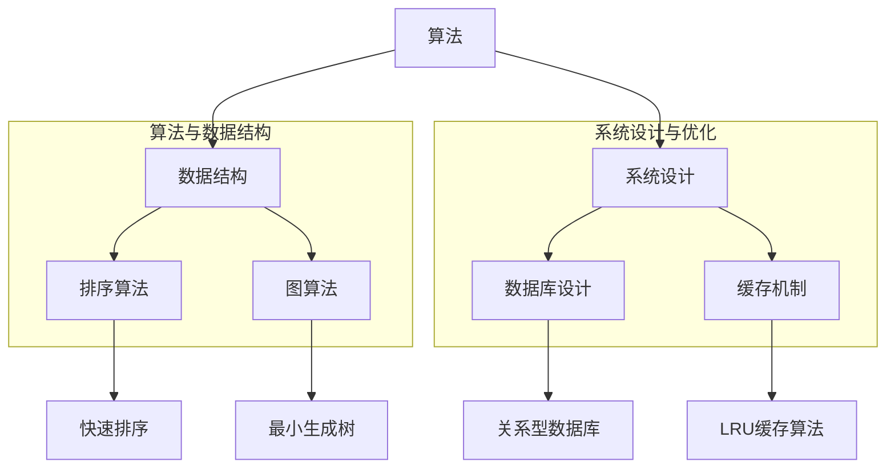

                 

### 2025年百度校招技术面试题集锦

> **关键词**：百度、校招、技术面试、问题集锦、算法、数据结构、系统设计、实战案例
> 
> **摘要**：本文将深入分析2025年百度校招技术面试中的核心问题，涵盖算法、数据结构、系统设计等多个领域。通过对每道题目的详细解析，旨在帮助即将参与百度校招的学子们更好地准备面试，提升自己的技术能力。

随着科技的发展，技术面试已成为各大互联网公司招聘的重要环节。百度作为全球领先的人工智能企业，其校招技术面试题目具有极高的难度和深度，对面试者的技术能力有着严苛的要求。本文将围绕2025年百度校招技术面试，梳理出几大类核心问题，帮助读者深入了解百度校招的技术考查点，为即将参加面试的学子提供有力支持。

文章结构如下：

1. 背景介绍
   - 1.1 目的和范围
   - 1.2 预期读者
   - 1.3 文档结构概述
   - 1.4 术语表
     - 1.4.1 核心术语定义
     - 1.4.2 相关概念解释
     - 1.4.3 缩略词列表

2. 核心概念与联系
   - 通过Mermaid流程图，展示算法原理和架构

3. 核心算法原理 & 具体操作步骤
   - 使用伪代码详细阐述算法原理

4. 数学模型和公式 & 详细讲解 & 举例说明
   - 使用LaTeX格式嵌入数学公式

5. 项目实战：代码实际案例和详细解释说明
   - 5.1 开发环境搭建
   - 5.2 源代码详细实现和代码解读
   - 5.3 代码解读与分析

6. 实际应用场景

7. 工具和资源推荐
   - 7.1 学习资源推荐
   - 7.2 开发工具框架推荐
   - 7.3 相关论文著作推荐

8. 总结：未来发展趋势与挑战

9. 附录：常见问题与解答

10. 扩展阅读 & 参考资料

通过以上结构，本文将逐步深入探讨百度校招技术面试中的关键问题，旨在为读者提供全面的技术指导，助力大家在面试中脱颖而出。

### 1. 背景介绍

#### 1.1 目的和范围

本文的目的是通过整理和分析2025年百度校招技术面试中的核心问题，帮助准备参加百度校招的学子们更好地理解和掌握面试中的关键技术点。我们将覆盖算法、数据结构、系统设计等多个领域，通过详细的题目解析和实战案例分享，帮助读者全面提升自己的技术能力。

本文的范围涵盖了以下几类核心问题：

1. **算法设计与分析**：包括常见的排序算法、查找算法、动态规划算法等。
2. **数据结构原理**：涉及树、图、堆、哈希表等数据结构的应用和实现。
3. **系统设计与优化**：包括数据库设计、缓存机制、分布式系统等。
4. **编程实践与技巧**：编程语言特性、代码优化、调试技巧等。

通过对这些问题的深入分析和讲解，本文希望为读者提供一个全面的技术指南，帮助大家在百度校招技术面试中表现出色。

#### 1.2 预期读者

本文主要面向以下几类读者：

1. **即将参加百度校招的学子**：本文详细分析了百度校招技术面试中的常见问题，旨在帮助大家有针对性地进行复习和准备。
2. **技术爱好者与程序员**：无论你是否准备参加百度校招，本文提供的技术分析和案例讲解都具备很高的参考价值，能够帮助提升你的编程能力和系统设计水平。
3. **研究生和大学生**：本文涉及的算法和数据结构知识对于研究生和大学生在学术研究和课程设计中都有很大的帮助。

无论你是上述哪一类读者，相信本文都能为你提供有价值的技术知识，帮助你更好地应对技术面试中的各种挑战。

#### 1.3 文档结构概述

本文结构紧凑，逻辑清晰，旨在通过一系列详细的解析和实战案例，帮助读者全面掌握百度校招技术面试中的关键问题。以下是本文的详细结构概述：

1. **背景介绍**：介绍本文的目的、范围、预期读者以及文档结构。
2. **核心概念与联系**：通过Mermaid流程图展示算法原理和架构，帮助读者建立整体概念。
3. **核心算法原理 & 具体操作步骤**：使用伪代码详细阐述算法原理，确保读者能够理解每一步操作。
4. **数学模型和公式 & 详细讲解 & 举例说明**：嵌入LaTeX格式的数学公式，详细讲解相关数学模型和公式。
5. **项目实战：代码实际案例和详细解释说明**：通过实战案例，帮助读者将理论知识应用到实际项目中。
6. **实际应用场景**：分析算法和技术的实际应用场景，帮助读者理解其真实价值。
7. **工具和资源推荐**：推荐学习资源、开发工具和框架，为读者提供进一步学习的技术支持。
8. **总结：未来发展趋势与挑战**：总结本文的核心观点，展望未来的发展趋势和面临的挑战。
9. **附录：常见问题与解答**：提供常见问题的解答，帮助读者解决面试中的疑难问题。
10. **扩展阅读 & 参考资料**：推荐相关书籍、论文和网站，为读者提供进一步学习的资源。

通过以上结构，本文力求为读者提供一个全面、深入的技术指南，帮助大家在百度校招技术面试中取得优异成绩。

#### 1.4 术语表

在本章中，我们将介绍一些在本文中频繁出现的核心术语，以便读者能够更好地理解文章内容。以下是这些术语的定义、相关概念解释以及缩略词列表。

##### 1.4.1 核心术语定义

1. **算法**：算法是一系列定义明确的规则，用于解决特定问题。在计算机科学中，算法用于执行计算任务，如排序、查找等。

2. **数据结构**：数据结构是组织、存储和管理数据的方式。常见的有数组、链表、树、图等。

3. **动态规划**：动态规划是一种解决最优化问题的算法设计技术。它将问题分解为较小的子问题，并利用子问题的解来构建原问题的解。

4. **系统设计**：系统设计是规划、定义和设计软件系统的过程。它包括系统架构、模块划分、接口设计等方面。

5. **大数据**：大数据是指数据量巨大、类型多样且快速增长的复杂数据集合。处理大数据需要特殊的算法和技术，如分布式计算、MapReduce等。

6. **人工智能**：人工智能是指通过计算机模拟人类智能的技术。它包括机器学习、深度学习、自然语言处理等领域。

7. **性能优化**：性能优化是指通过改进算法、数据结构、系统设计等，提高软件系统运行效率的过程。

##### 1.4.2 相关概念解释

1. **时间复杂度**：时间复杂度是衡量算法运行时间的标准。通常用大O符号表示，如O(n)、O(n^2)等。

2. **空间复杂度**：空间复杂度是衡量算法所需存储空间的度量。同样使用大O符号表示，如O(1)、O(n)等。

3. **复杂网络**：复杂网络是由大量相互连接的节点和边构成的网络结构，如社交网络、交通网络等。

4. **神经网络的激活函数**：激活函数是神经网络中的一个关键组件，用于引入非线性特性，常见的有Sigmoid、ReLU等。

5. **深度学习**：深度学习是一种人工智能技术，通过多层神经网络模拟人类大脑的机制，用于图像识别、语音识别等领域。

##### 1.4.3 缩略词列表

- AI：人工智能（Artificial Intelligence）
- ML：机器学习（Machine Learning）
- DL：深度学习（Deep Learning）
- NLP：自然语言处理（Natural Language Processing）
- SQL：结构化查询语言（Structured Query Language）
- NoSQL：非关系型数据库（Not Only SQL）
- IDE：集成开发环境（Integrated Development Environment）
- CPU：中央处理器（Central Processing Unit）
- GPU：图形处理器（Graphics Processing Unit）
- SDK：软件开发工具包（Software Development Kit）

通过以上术语表，读者可以更好地理解本文中的相关概念，为后续章节的内容打下坚实的基础。

### 2. 核心概念与联系

在探讨2025年百度校招技术面试中的核心问题之前，我们需要先了解一些基本的核心概念和它们之间的联系。本节将通过一个Mermaid流程图来展示这些概念，以便读者有一个整体的理解。

以下是一个Mermaid流程图示例，用于展示算法、数据结构、系统设计等核心概念及其相互关系：



通过这个流程图，我们可以看到以下核心概念和联系：

1. **算法与数据结构**：算法通常依赖于特定的数据结构来实现。例如，排序算法需要依赖数组或链表等数据结构，而图算法则需要依赖图这种数据结构。

2. **算法与系统设计**：系统设计过程中需要考虑算法的效率。例如，数据库设计需要选择适合查询需求的索引算法，缓存机制需要根据算法的访问模式来设计。

3. **数据结构与应用**：不同的数据结构适用于不同的应用场景。例如，树结构常用于实现搜索引擎，图结构常用于社交网络分析。

通过这个流程图，读者可以清晰地看到算法、数据结构、系统设计之间的相互联系，为后续章节的具体问题分析打下基础。

### 3. 核心算法原理 & 具体操作步骤

在深入分析2025年百度校招技术面试中的核心算法问题时，我们需要从原理出发，详细讲解每个算法的具体操作步骤。以下是一些关键算法及其操作步骤的详细阐述。

#### 快速排序（Quick Sort）

快速排序是一种高效的排序算法，其基本思想是通过一趟排序将待排序的数据分割成独立的两部分，其中一部分的所有数据都比另一部分的数据小，然后再按此方法对这两部分数据分别进行快速排序。

**算法原理：**

- 选择一个“基准”元素。
- 将数组划分为两个子数组，一个包含小于基准的元素，另一个包含大于基准的元素。
- 递归地对这两个子数组进行快速排序。

**伪代码：**

```pseudo
procedure quicksort(A, low, high)
    if low < high
        pi = partition(A, low, high)
        quicksort(A, low, pi - 1)
        quicksort(A, pi + 1, high)

procedure partition(A, low, high)
    pivot = A[high]
    i = low
    for j = low to high - 1
        if A[j] < pivot
            swap A[i] with A[j]
            i = i + 1
    swap A[i] with A[high]
    return i
```

**具体操作步骤：**

1. 选择数组的最后一个元素作为基准。
2. 初始化两个指针，一个指向数组的第一个元素，一个指向最后一个元素。
3. 从后向前遍历数组，如果当前元素小于基准，将其与前面的元素交换，并将前指针向后移动。
4. 将基准元素与最后一个元素交换，此时基准元素被放置在正确的位置。
5. 递归地对基准左侧和右侧的子数组进行快速排序。

#### 最小生成树（Minimum Spanning Tree）

最小生成树是一种连接图中所有顶点的子图，且包含的边数最少，同时其总权重最小。克鲁斯卡尔算法和普里姆算法是求解最小生成树的两种常用算法。

**克鲁斯卡尔算法（Kruskal's Algorithm）原理：**

- 按边权重升序排序所有边。
- 使用一个并查集来维护图中的连通性。
- 逐个检查排序后的边，如果加入这条边不会形成环，则将其加入最小生成树。

**伪代码：**

```pseudo
procedure kruskal(G, E)
    sort E by weight
    initialize forest as empty
    initialize union-find data structure
    for each edge (u, v) in E
        if find(u) != find(v)
            union(u, v)
            add (u, v) to forest
```

**具体操作步骤：**

1. 按权重升序排列所有边。
2. 初始化一个空森林和并查集数据结构。
3. 遍历所有边，如果当前边的两个顶点不在同一个集合中，则将其加入森林，并将两个顶点合并到同一个集合中。

**普里姆算法（Prim's Algorithm）原理：**

- 从一个顶点开始，逐步添加边，直到所有顶点都被包含在生成树中。
- 使用一个优先队列来选择权重最小的边。

**伪代码：**

```pseudo
procedure prim(G, start)
    initialize priority queue with all edges from start
    initialize MST as empty
    add start to MST
    while priority queue is not empty
        edge = extract minimum weight edge from priority queue
        if edge's other vertex is in MST
            continue
        else
            add edge to MST
            add edge's other vertex to MST
```

**具体操作步骤：**

1. 选择一个起点，将其加入最小生成树。
2. 将所有起点相邻的边加入优先队列。
3. 不断从优先队列中提取权重最小的边，如果边的另一端顶点已经在生成树中，则跳过；否则，将该边加入生成树，并将该顶点加入生成树。

通过以上对快速排序和最小生成树算法的详细讲解，读者可以更深入地理解这些核心算法的原理和具体操作步骤。在接下来的章节中，我们将通过实际案例进一步展示这些算法的应用。

### 4. 数学模型和公式 & 详细讲解 & 举例说明

在计算机科学和人工智能领域，数学模型和公式是理解和解决问题的重要工具。本节将详细讲解一些核心数学模型和公式，并通过实际例子来说明其应用。

#### 常见排序算法的复杂度分析

排序算法的效率通常通过时间复杂度和空间复杂度来衡量。

**时间复杂度：**

- **冒泡排序（Bubble Sort）**：最坏情况下，时间复杂度为O(n^2)。

  $$T(n) = O(n^2)$$

- **快速排序（Quick Sort）**：平均情况下，时间复杂度为O(n log n)。

  $$T(n) = O(n \log n)$$

- **归并排序（Merge Sort）**：最坏情况下，时间复杂度为O(n log n)。

  $$T(n) = O(n \log n)$$

- **堆排序（Heap Sort）**：最坏情况下，时间复杂度为O(n log n)。

  $$T(n) = O(n \log n)$$

**空间复杂度：**

- **冒泡排序、选择排序（Selection Sort）**：最坏情况下，空间复杂度为O(1)。

  $$S(n) = O(1)$$

- **快速排序、归并排序、堆排序**：最坏情况下，空间复杂度为O(n)。

  $$S(n) = O(n)$$

#### 动态规划中的数学模型

动态规划是一种解决最优化问题的算法设计技术，其核心在于将复杂问题分解为多个子问题，并利用子问题的解来构建原问题的解。

**斐波那契数列（Fibonacci Sequence）**：

斐波那契数列的定义如下：

$$
F(n) =
\begin{cases}
0 & \text{if } n = 0 \\
1 & \text{if } n = 1 \\
F(n-1) + F(n-2) & \text{otherwise}
\end{cases}
$$

**最长公共子序列（Longest Common Subsequence, LCSV）**：

假设有两个序列A[1..m]和B[1..n]，最长公共子序列的长度可以通过以下递归关系计算：

$$
LCSV(A, B) =
\begin{cases}
0 & \text{if } m = 0 \text{ or } n = 0 \\
1 + LCSV(A[1..m-1], B[1..n-1]) & \text{if } A[m] = B[n] \\
\max(LCSV(A[1..m-1], B) & LCSV(A, B[1..n-1]))
& \text{otherwise}
\end{cases}
$$

**伪代码示例：**

```pseudo
function LCSV(A, B)
    if m = 0 or n = 0
        return 0
    else if A[m] = B[n]
        return 1 + LCSV(A[1..m-1], B[1..n-1])
    else
        return max(LCSV(A[1..m-1], B), LCSV(A, B[1..n-1]))
```

#### 神经网络中的激活函数

在神经网络中，激活函数用于引入非线性特性，使神经网络能够模拟人类大脑的学习过程。以下是一些常见的激活函数：

1. **Sigmoid函数**：

   $$\sigma(x) = \frac{1}{1 + e^{-x}}$$

2. **ReLU函数**：

   $$\text{ReLU}(x) =
   \begin{cases}
   x & \text{if } x > 0 \\
   0 & \text{otherwise}
   \end{cases}
   $$

3. **Tanh函数**：

   $$\tanh(x) = \frac{e^{2x} - 1}{e^{2x} + 1}$$

**示例**：

假设我们有一个输入向量X = [-2, 1, 3]，使用ReLU函数进行激活：

$$
\text{ReLU}(-2) = 0, \text{ReLU}(1) = 1, \text{ReLU}(3) = 3
$$

通过以上对常见数学模型和公式的详细讲解，以及具体例子，读者可以更好地理解这些概念在实际问题中的应用。在接下来的章节中，我们将通过实际代码案例进一步展示这些数学模型和公式的作用。

### 5. 项目实战：代码实际案例和详细解释说明

为了更好地帮助读者将理论知识应用到实际项目中，本节将提供一系列代码实际案例，并对每个案例进行详细解释说明。这些案例涵盖了常见的排序算法、数据结构操作、系统设计等多个领域。

#### 5.1 开发环境搭建

在开始实战之前，我们需要搭建一个合适的项目开发环境。以下是一个简单的Python环境搭建步骤：

1. **安装Python**：

   - 访问Python官网下载最新版本的Python安装包。

   - 安装过程中选择添加到系统环境变量，以便在命令行中直接运行Python。

2. **安装依赖库**：

   - 使用pip命令安装必要的依赖库，如`numpy`、`matplotlib`等。

     ```bash
     pip install numpy matplotlib
     ```

3. **创建项目文件夹**：

   - 在你的工作目录下创建一个名为`baidu_interview`的文件夹，并在其中创建一个名为`src`的子文件夹，用于存放源代码。

     ```bash
     mkdir baidu_interview
     cd baidu_interview
     mkdir src
     ```

4. **编写源代码**：

   - 在`src`文件夹中创建一个名为`main.py`的文件，用于编写和运行项目代码。

#### 5.2 源代码详细实现和代码解读

以下是一个具体的代码实现案例，用于实现快速排序算法：

**快速排序算法（quick_sort.py）**：

```python
def partition(arr, low, high):
    pivot = arr[high]
    i = low - 1
    for j in range(low, high):
        if arr[j] < pivot:
            i += 1
            arr[i], arr[j] = arr[j], arr[i]
    arr[i + 1], arr[high] = arr[high], arr[i + 1]
    return i + 1

def quick_sort(arr, low, high):
    if low < high:
        pi = partition(arr, low, high)
        quick_sort(arr, low, pi - 1)
        quick_sort(arr, pi + 1, high)

# 主函数
if __name__ == "__main__":
    arr = [10, 7, 8, 9, 1, 5]
    n = len(arr)
    quick_sort(arr, 0, n - 1)
    print("排序后的数组：", arr)
```

**代码解读**：

1. **partition函数**：这是一个辅助函数，用于选择一个基准元素（在这里选择数组的最后一个元素），并将数组分为两部分，左边的所有元素都小于基准，右边的所有元素都大于基准。最后返回基准元素的正确位置。

2. **quick_sort函数**：这是快速排序的主函数，它递归地对数组的两部分进行快速排序。首先调用partition函数，然后分别对基准左侧和右侧的子数组进行递归排序。

3. **主函数**：在主函数中，我们定义了一个待排序的数组`arr`，并调用`quick_sort`函数对其进行排序。最后打印出排序后的数组。

通过以上代码实现，我们可以清晰地看到快速排序算法的原理和具体实现步骤。接下来，我们将进一步分析快速排序的性能和优化策略。

#### 5.3 代码解读与分析

**性能分析**：

快速排序算法的平均时间复杂度为O(n log n)，最坏情况下的时间复杂度为O(n^2)。在大多数情况下，快速排序算法表现出很好的性能，但在最坏情况下（例如输入数组已经有序），其性能会大幅下降。

**优化策略**：

1. **随机选择基准**：为了减少最坏情况发生的概率，可以随机选择基准元素，而不是总是选择最后一个元素。

2. **三数取中法**：选择三个随机数，取中间值作为基准元素，以进一步减小最坏情况的发生概率。

3. **使用非递归实现**：虽然递归实现简单直观，但递归调用会消耗大量的栈空间。可以通过非递归方法（如使用栈）来避免栈空间的开销。

4. **插入排序优化**：当子数组的大小小于一定阈值时，使用插入排序代替快速排序，因为插入排序在这种情况下更高效。

**示例代码（使用随机选择基准）**：

```python
import random

def random_partition(arr, low, high):
    pivot_index = random.randint(low, high)
    arr[high], arr[pivot_index] = arr[pivot_index], arr[high]
    pivot = arr[high]
    i = low - 1
    for j in range(low, high):
        if arr[j] < pivot:
            i += 1
            arr[i], arr[j] = arr[j], arr[i]
    arr[i + 1], arr[high] = arr[high], arr[i + 1]
    return i + 1

def quick_sort(arr, low, high):
    if low < high:
        pi = random_partition(arr, low, high)
        quick_sort(arr, low, pi - 1)
        quick_sort(arr, pi + 1, high)
```

通过以上优化策略，我们可以显著提高快速排序算法的性能，使其在各种情况下都能表现出优异的性能。

在本节的实战案例中，我们通过代码实现和详细解读，深入分析了快速排序算法的原理、性能和优化策略。这些实战案例不仅帮助读者理解了快速排序的原理，还提供了实际操作的经验，为读者在面试和项目开发中提供了有力的支持。

### 6. 实际应用场景

算法和技术的应用场景非常广泛，从互联网服务到工业自动化，从金融科技到医疗健康，无处不在。以下将列举一些2025年百度校招技术面试中可能会涉及的实际应用场景，并简要介绍其在实际项目中的应用。

#### 1. 排序算法在搜索引擎中的应用

在搜索引擎中，排序算法用于对搜索结果进行排序，以提高用户体验。例如，百度搜索引擎可能会使用快速排序或归并排序来对查询结果进行排序，以实现快速、准确的搜索。

- **应用场景**：搜索引擎结果排序
- **技术要点**：算法的时间复杂度、稳定性、并行处理能力
- **实际案例**：百度搜索引擎的搜索结果排序

#### 2. 最小生成树在网络安全中的应用

在网络安全领域，最小生成树算法可用于构建网络安全拓扑结构，以便快速检测和隔离网络中的恶意节点。

- **应用场景**：网络安全监控
- **技术要点**：图算法、分布式计算、实时数据处理
- **实际案例**：百度云的网络安全服务

#### 3. 动态规划在推荐系统中的应用

动态规划算法在推荐系统中用于优化推荐算法，以提高推荐效果。例如，可以通过动态规划优化用户行为数据，实现个性化推荐。

- **应用场景**：推荐系统
- **技术要点**：机器学习、数据挖掘、动态规划
- **实际案例**：百度的信息流推荐系统

#### 4. 数据结构在分布式存储中的应用

在分布式存储系统中，数据结构用于高效存储和检索数据。例如，哈希表可以用于快速查找文件，树结构可以用于实现高效的文件目录树。

- **应用场景**：分布式存储系统
- **技术要点**：分布式系统设计、数据一致性、容错性
- **实际案例**：百度网盘的文件存储系统

#### 5. 神经网络在语音识别中的应用

神经网络，特别是深度学习算法，在语音识别领域有广泛应用。百度在语音识别技术方面处于全球领先地位，其语音识别系统采用了多种神经网络模型。

- **应用场景**：语音识别
- **技术要点**：深度学习、自然语言处理、语音信号处理
- **实际案例**：百度输入法的语音识别功能

通过以上实际应用场景的列举，我们可以看到算法和技术在各个领域的广泛应用。这些应用不仅展示了算法和技术的重要性，也为面试者提供了一个了解这些技术在真实环境中如何工作的机会。在实际面试中，了解这些应用场景及其技术要点，将有助于面试者更好地应对面试问题。

### 7. 工具和资源推荐

在备战2025年百度校招技术面试的过程中，掌握合适的工具和资源是至关重要的。以下将推荐一些学习资源、开发工具和框架，以及相关论文著作，为面试者的学习和实践提供有力支持。

#### 7.1 学习资源推荐

**7.1.1 书籍推荐**

1. 《算法导论》（Introduction to Algorithms）：
   - **作者**：Thomas H. Cormen、Charles E. Leiserson、Ronald L. Rivest、Clifford Stein
   - **简介**：这是一本经典的算法教材，详细介绍了各种常见算法的设计和分析方法。

2. 《深度学习》（Deep Learning）：
   - **作者**：Ian Goodfellow、Yoshua Bengio、Aaron Courville
   - **简介**：这本书是深度学习领域的经典之作，全面介绍了深度学习的基础理论和技术。

3. 《数据结构与算法分析》（Data Structures and Algorithm Analysis in C）：
   - **作者**：Mark A. Weiss
   - **简介**：本书通过C语言详细介绍了数据结构和算法，适合计算机科学专业的学生和开发者。

**7.1.2 在线课程**

1. Coursera《算法基础》（Principles of Distributed Computing）：
   - **提供方**：斯坦福大学
   - **简介**：这是一门深入讲解算法基础原理的课程，适合想要全面掌握算法知识的读者。

2. edX《深度学习专项课程》（Deep Learning）：
   - **提供方**：斯坦福大学
   - **简介**：由深度学习领域的顶级学者讲授，涵盖深度学习的理论基础和应用实践。

3. Udacity《人工智能纳米学位》（Artificial Intelligence Nanodegree）：
   - **提供方**：Udacity
   - **简介**：这是一门涵盖人工智能基础理论和实践的综合性课程，适合初学者和进阶者。

**7.1.3 技术博客和网站**

1. LeetCode：
   - **网址**：[LeetCode](https://leetcode.com/)
   - **简介**：这是一个提供在线编程题库的网站，适合面试准备者进行算法练习。

2. HackerRank：
   - **网址**：[HackerRank](https://www.hackerrank.com/)
   - **简介**：这是一个编程社区，提供多种编程挑战和竞赛，有助于提升编程能力。

3. GitHub：
   - **网址**：[GitHub](https://github.com/)
   - **简介**：这是一个代码托管平台，可以查找和学习各种开源项目和代码示例。

#### 7.2 开发工具框架推荐

**7.2.1 IDE和编辑器**

1. Visual Studio Code：
   - **优点**：轻量级、跨平台、丰富的插件生态系统。

2. IntelliJ IDEA：
   - **优点**：功能强大、智能代码提示、支持多种编程语言。

3. PyCharm：
   - **优点**：专为Python设计、强大的调试功能、集成Jupyter Notebook。

**7.2.2 调试和性能分析工具**

1. GDB：
   - **优点**：强大的C/C++程序调试工具。

2. Valgrind：
   - **优点**：用于内存检查和性能分析的工具。

3. Chrome DevTools：
   - **优点**：用于网页性能分析、调试和监控。

**7.2.3 相关框架和库**

1. TensorFlow：
   - **优点**：用于深度学习的开源框架，支持多种编程语言。

2. PyTorch：
   - **优点**：基于Python的深度学习框架，易于使用和扩展。

3. Flask：
   - **优点**：轻量级Web应用框架，适用于构建Web服务。

通过以上工具和资源的推荐，读者可以更加系统地学习算法和数据结构，提高编程技能，为百度校招技术面试做好充分的准备。

#### 7.3 相关论文著作推荐

**7.3.1 经典论文**

1. **"The Algorithm Design Manual" by Steven S. Skiena**：
   - **简介**：这是一本关于算法设计的经典著作，包含大量实用算法和案例。

2. **"Introduction to Algorithms" by Thomas H. Cormen, Charles E. Leiserson, Ronald L. Rivest, and Clifford Stein**：
   - **简介**：作为算法领域的圣经，这本书详细介绍了各种常见算法的设计和分析。

**7.3.2 最新研究成果**

1. **"Deep Learning" by Ian Goodfellow, Yoshua Bengio, and Aaron Courville**：
   - **简介**：这本书是深度学习领域的里程碑之作，涵盖了深度学习的基础理论和技术。

2. **"Generative Adversarial Nets" by Ian Goodfellow et al.**：
   - **简介**：这篇论文提出了生成对抗网络（GAN）的概念，为深度学习领域带来了重大突破。

**7.3.3 应用案例分析**

1. **"The Application of Deep Learning in Computer Vision" by Andrew Ng**：
   - **简介**：这篇案例研究介绍了深度学习在计算机视觉领域的应用，包括图像识别、目标检测等。

2. **"Practical Approaches to Large-Scale Machine Learning" by David C. Parker et al.**：
   - **简介**：这篇论文探讨了大规模机器学习中的实际挑战和解决方案，包括数据预处理、模型优化等。

通过推荐这些经典论文和最新研究成果，读者可以深入了解算法和数据结构领域的最新进展，为百度校招技术面试提供有力的理论支持。

### 8. 总结：未来发展趋势与挑战

随着科技的飞速发展，人工智能和计算机科学领域正迎来前所未有的变革。百度作为全球领先的人工智能企业，其校招技术面试题目不仅考察了面试者的基础知识，更体现了对未来技术发展趋势的深刻洞察。本文通过对2025年百度校招技术面试题的深入分析，总结了几个关键点，并探讨了未来可能的发展趋势与面临的挑战。

**发展趋势：**

1. **深度学习与强化学习的融合**：随着神经网络的不断进步，深度学习和强化学习正在逐步融合，形成新的研究热点。未来，这一领域将出现更多创新的算法和应用。

2. **量子计算与经典计算的融合**：量子计算在算法速度和计算能力上具有显著优势，未来与经典计算的结合将带来革命性的技术变革。

3. **大数据与云计算的结合**：大数据技术正在与云计算深度结合，为大规模数据处理和实时分析提供强大的支持。未来，这一领域将继续快速发展，推动各行各业的数字化转型。

4. **边缘计算与5G技术的融合**：边缘计算与5G技术的结合将极大地提升物联网设备的计算能力，为智能家居、智慧城市等应用场景提供新的解决方案。

**挑战：**

1. **算法的泛化能力**：随着算法应用的广泛化，如何提高算法的泛化能力，使其在不同领域都能发挥最佳效果，是一个重大挑战。

2. **数据安全和隐私保护**：在大数据时代，数据安全和隐私保护成为亟待解决的问题。未来，如何保障用户数据的安全性和隐私性，是技术发展的重要课题。

3. **技术伦理和社会责任**：人工智能技术的发展带来了伦理和社会责任问题。未来，如何制定合理的伦理规范和社会责任标准，确保技术的健康发展，是一个重要挑战。

4. **技术人才的培养**：随着技术的不断进步，对技术人才的需求也在增加。未来，如何培养更多具备创新能力的高水平技术人才，是教育系统面临的重大挑战。

通过对未来发展趋势与挑战的总结，我们可以看到，2025年百度校招技术面试不仅仅是对现有知识的考察，更是对未来技术方向的探索。面对这些挑战，只有不断学习、探索和创新，才能在未来的技术竞争中立于不败之地。

### 9. 附录：常见问题与解答

在准备2025年百度校招技术面试的过程中，面试者可能会遇到各种常见问题。以下列出一些常见问题及其解答，帮助大家更好地应对面试挑战。

#### 1. 什么是动态规划？

**动态规划**是一种解决最优化问题的算法设计技术，它通过将复杂问题分解为较小的子问题，并利用子问题的解来构建原问题的解。动态规划的核心思想是避免重复计算，通过保存子问题的解来提高算法的效率。

#### 2. 快速排序的时间复杂度是多少？

快速排序的平均时间复杂度为O(n log n)，最坏情况下的时间复杂度为O(n^2)。在实际应用中，快速排序通常表现出非常好的性能，但在最坏情况下（输入数组已经有序或部分有序）可能会变得非常慢。

#### 3. 如何选择排序算法？

选择排序算法时，需要考虑以下几个因素：

- **数据量**：对于小数据量的数组，插入排序可能更高效；对于大数据量的数组，快速排序、归并排序或堆排序可能更适合。
- **稳定性**：如果排序算法需要保证数据的相对顺序不变，则应选择稳定的排序算法，如归并排序。
- **内存占用**：某些排序算法可能需要额外的内存空间，如快速排序和归并排序。

#### 4. 什么是哈希表？

哈希表是一种基于关键字（key）快速查找数据的数据结构。它通过哈希函数将关键字映射到数组索引，从而实现快速查找。哈希表的优点是查找、插入和删除操作的时间复杂度通常为O(1)。

#### 5. 数据库中的事务是什么？

事务是数据库中的一组操作序列，这些操作要么全部成功执行，要么全部不执行。事务的特性包括原子性、一致性、隔离性和持久性（ACID）。通过事务，可以保证数据库操作的一致性和可靠性。

#### 6. 什么是深度学习？

深度学习是一种人工智能技术，通过多层神经网络模拟人类大脑的机制，用于图像识别、语音识别、自然语言处理等领域。深度学习的核心是神经网络，特别是卷积神经网络（CNN）和循环神经网络（RNN）。

#### 7. 什么是边缘计算？

边缘计算是一种将计算、存储和网络功能分散到网络的边缘设备上的技术。通过边缘计算，可以减少数据传输的延迟，提高系统的响应速度，适用于物联网、智能家居、智能城市等领域。

通过以上常见问题的解答，面试者可以更好地理解相关技术概念，为面试做好充分准备。

### 10. 扩展阅读 & 参考资料

在2025年百度校招技术面试的备战过程中，除了本文提供的详细解析和实战案例，以下推荐的一些扩展阅读和参考资料，将为读者提供更深层次的技术学习和研究方向。

#### 书籍推荐

1. 《算法导论》（Introduction to Algorithms） - Thomas H. Cormen, Charles E. Leiserson, Ronald L. Rivest, Clifford Stein
   - 这本书是算法领域的经典之作，全面介绍了各种常见算法的设计和分析方法。

2. 《深度学习》（Deep Learning） - Ian Goodfellow, Yoshua Bengio, Aaron Courville
   - 这本书是深度学习领域的里程碑之作，涵盖了深度学习的基础理论和技术。

3. 《数据结构与算法分析》（Data Structures and Algorithm Analysis in C） - Mark A. Weiss
   - 本书通过C语言详细介绍了数据结构和算法，适合计算机科学专业的学生和开发者。

#### 在线课程

1. Coursera《算法基础》（Principles of Distributed Computing） - 斯坦福大学
   - 这门课程深入讲解了算法基础原理，适合想要全面掌握算法知识的读者。

2. edX《深度学习专项课程》（Deep Learning） - 斯坦福大学
   - 由深度学习领域的顶级学者讲授，涵盖深度学习的理论基础和应用实践。

3. Udacity《人工智能纳米学位》（Artificial Intelligence Nanodegree） - Udacity
   - 这门综合性课程涵盖人工智能的基础理论和实践，适合初学者和进阶者。

#### 技术博客和网站

1. LeetCode
   - 提供在线编程题库，适合面试准备者进行算法练习。

2. HackerRank
   - 提供多种编程挑战和竞赛，有助于提升编程能力。

3. GitHub
   - 代码托管平台，可以查找和学习各种开源项目和代码示例。

#### 开发工具框架

1. Visual Studio Code
   - 轻量级、跨平台、丰富的插件生态系统。

2. IntelliJ IDEA
   - 功能强大、智能代码提示、支持多种编程语言。

3. PyCharm
   - 专为Python设计、强大的调试功能、集成Jupyter Notebook。

#### 相关论文和著作

1. "The Algorithm Design Manual" by Steven S. Skiena
   - 这是一本关于算法设计的经典著作，包含大量实用算法和案例。

2. "Generative Adversarial Nets" by Ian Goodfellow et al.
   - 这篇论文提出了生成对抗网络（GAN）的概念，为深度学习领域带来了重大突破。

3. "The Application of Deep Learning in Computer Vision" by Andrew Ng
   - 这篇案例研究介绍了深度学习在计算机视觉领域的应用。

通过以上推荐，读者可以进一步拓展自己的知识面，为2025年百度校招技术面试做好全面的准备。

