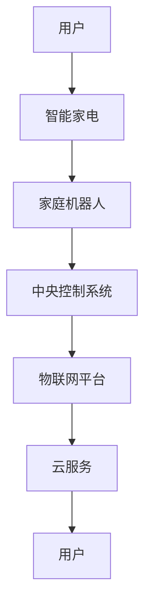

                 

# 2050年的智能家居：从智能家电到家庭机器人的生活革新

> **关键词：智能家居、智能家电、家庭机器人、AI、物联网、智能控制、人机交互**

> **摘要：本文将探讨2050年智能家居的发展前景，从智能家电、家庭机器人到人机交互的革新，分析其背后的技术原理和实现方法，以及未来的发展趋势和挑战。**

## 1. 背景介绍

### 1.1 目的和范围

本文旨在通过对2050年智能家居的展望，探讨智能家电、家庭机器人的发展及其对人们生活方式的革新。我们将从技术原理、具体应用、未来趋势等方面进行深入分析，旨在为读者提供一个清晰、全面的视角。

### 1.2 预期读者

本文适合对智能家居、人工智能技术感兴趣的读者，包括但不限于计算机科学、电子工程、软件工程等领域的专业人员和爱好者。

### 1.3 文档结构概述

本文结构如下：

1. 背景介绍：介绍本文的目的、范围和预期读者。
2. 核心概念与联系：阐述智能家居的核心概念和架构。
3. 核心算法原理 & 具体操作步骤：详细讲解智能家居系统的算法原理和实现步骤。
4. 数学模型和公式 & 详细讲解 & 举例说明：介绍智能家居系统中的数学模型和公式，并给出具体示例。
5. 项目实战：通过实际案例展示智能家居系统的开发过程。
6. 实际应用场景：探讨智能家居系统的应用场景。
7. 工具和资源推荐：推荐相关学习资源和开发工具。
8. 总结：总结智能家居的发展趋势和面临的挑战。
9. 附录：常见问题与解答。
10. 扩展阅读 & 参考资料：提供进一步阅读的资料。

### 1.4 术语表

#### 1.4.1 核心术语定义

- 智能家居：通过物联网技术，将家庭设备连接到互联网，实现设备之间的互联互通和智能控制。
- 智能家电：具备智能化功能的家电产品，如智能电视、智能冰箱、智能空调等。
- 家庭机器人：具备一定的人工智能能力和自主行动能力的机器人，如扫地机器人、送餐机器人等。
- 物联网（IoT）：通过传感器、网络通信等技术，将各种物体连接到互联网，实现信息的共享和智能控制。

#### 1.4.2 相关概念解释

- 人工智能（AI）：模拟人类智能的计算机技术，包括机器学习、深度学习、自然语言处理等。
- 物联网技术（IoT）：将各种物体连接到互联网，实现信息的共享和智能控制。
- 5G技术：第五代移动通信技术，具有高速率、低延迟、大连接等优势。
- 机器学习（ML）：一种人工智能技术，通过数据训练模型，使计算机具备自主学习和决策能力。

#### 1.4.3 缩略词列表

- AI：人工智能
- IoT：物联网
- 5G：第五代移动通信技术
- ML：机器学习

## 2. 核心概念与联系

智能家居系统的核心概念包括物联网、人工智能、5G技术等。以下是一个简单的智能家居系统架构的Mermaid流程图：



### 2.1 物联网平台

物联网平台是智能家居系统的核心组成部分，它负责连接各个智能设备和家庭机器人，实现数据的收集、处理和传输。物联网平台通常包括以下几个模块：

1. 设备连接管理：负责智能设备和家庭机器人与物联网平台的连接，包括设备认证、数据加密等。
2. 数据处理：对采集到的数据进行处理、清洗和转换，使其符合数据分析和机器学习的要求。
3. 设备控制：通过物联网平台，用户可以远程控制智能设备和家庭机器人，实现自动化管理。
4. 事件通知：当智能设备和家庭机器人发生异常或需要用户干预时，物联网平台会发送通知给用户。

### 2.2 中央控制系统

中央控制系统是智能家居系统的“大脑”，负责对家庭设备和机器人的统一管理和控制。它通常包括以下几个模块：

1. 用户界面：提供用户与智能家居系统的交互界面，包括手机APP、智能音箱等。
2. 规则引擎：根据用户需求和设备状态，制定自动化规则，实现设备的自动控制。
3. 数据分析：对用户行为和设备状态进行分析，为智能家居系统的优化提供数据支持。
4. 安全管理：确保智能家居系统的数据安全和用户隐私。

### 2.3 家庭机器人

家庭机器人是智能家居系统的重要组成部分，它们可以执行各种家庭任务，如扫地、擦窗、送餐等。家庭机器人通常具备以下几个特点：

1. 自主导航：通过SLAM（Simultaneous Localization and Mapping）技术，家庭机器人可以自主导航并在家庭环境中进行定位。
2. 语音识别：具备语音识别能力，可以理解用户的语音指令，实现人机交互。
3. 机器学习：通过机器学习算法，家庭机器人可以不断学习和优化自己的行为，提高工作效率。
4. 安全保障：家庭机器人具备安全监测和应急处理功能，确保用户的安全。

## 3. 核心算法原理 & 具体操作步骤

智能家居系统的核心算法包括设备连接管理、数据处理、设备控制和用户界面等。以下是一个简单的算法原理和具体操作步骤的伪代码示例：

```python
# 设备连接管理
def connect_device(device):
    # 设备认证
    authenticate_device(device)
    # 数据加密
    encrypt_data(device)
    # 连接到物联网平台
    connect_to_iot_platform(device)

# 数据处理
def process_data(data):
    # 数据清洗
    clean_data(data)
    # 数据转换
    transform_data(data)
    # 数据分析
    analyze_data(data)

# 设备控制
def control_device(device, command):
    # 根据命令执行设备操作
    execute_command(device, command)

# 用户界面
def user_interface():
    # 显示用户界面
    show_user_interface()
    # 接收用户输入
    receive_user_input()
    # 发送设备控制指令
    send_control_command()

# 具体操作步骤
def main():
    # 连接设备
    device = connect_device("smart_tv")
    # 收集数据
    data = collect_data(device)
    # 处理数据
    process_data(data)
    # 控制设备
    command = receive_user_input()
    control_device(device, command)
    # 显示用户界面
    user_interface()
```

## 4. 数学模型和公式 & 详细讲解 & 举例说明

### 4.1 数据处理数学模型

在智能家居系统中，数据处理是关键环节，常用的数学模型包括数据清洗、数据转换和数据分析等。

#### 4.1.1 数据清洗

数据清洗的目的是去除重复数据、缺失数据和异常数据，以提高数据质量。常用的方法包括：

- 去重：删除重复的数据记录。
- 补全：用平均值、中位数等方法填充缺失数据。
- 异常检测：使用统计方法或机器学习算法检测异常数据。

#### 4.1.2 数据转换

数据转换是将原始数据转换为适合分析和机器学习的数据。常用的方法包括：

- 归一化：将数据缩放到相同的范围，如0-1或-1到1。
- 标准化：将数据缩放到标准正态分布。
- 预处理：对数据执行各种预处理操作，如去除噪声、平滑处理等。

#### 4.1.3 数据分析

数据分析是对处理后的数据进行统计分析和机器学习分析。常用的方法包括：

- 描述性统计分析：计算数据的平均数、中位数、方差等统计量。
- 机器学习分析：使用机器学习算法，如线性回归、决策树、神经网络等，对数据进行分析和预测。

### 4.2 数据分析举例

假设我们收集了用户一周内的家电使用数据，包括开关机时间、使用时长等。我们希望分析用户的使用习惯，并预测下一周的使用情况。

#### 4.2.1 数据清洗

```latex
\text{去重：删除重复记录}
\text{补全：用平均值填充缺失时间记录}
\text{异常检测：检测并删除明显异常的时间记录}
```

#### 4.2.2 数据转换

```latex
\text{归一化：将使用时长缩放到0-1范围}
\text{标准化：将开关机时间缩放到标准正态分布}
```

#### 4.2.3 数据分析

```latex
\text{描述性统计分析：计算平均使用时长、中位数使用时长等}
\text{机器学习分析：使用线性回归预测下一周的使用时长}
```

## 5. 项目实战：代码实际案例和详细解释说明

### 5.1 开发环境搭建

在开始智能家居项目的实战之前，我们需要搭建一个开发环境。以下是搭建环境的步骤：

1. 安装Python 3.8及以上版本。
2. 安装PyCharm或VSCode等Python集成开发环境。
3. 安装必要的Python库，如NumPy、Pandas、Scikit-learn等。

### 5.2 源代码详细实现和代码解读

以下是一个智能家居项目的基本源代码实现，我们将对其逐行进行解读。

```python
# 导入必要的库
import numpy as np
import pandas as pd
from sklearn.linear_model import LinearRegression

# 5.2.1 数据清洗
def clean_data(data):
    # 去重
    data = data.drop_duplicates()
    # 补全
    data['duration'] = data['duration'].fillna(data['duration'].mean())
    # 异常检测
    data = data[(data['duration'] > 0) & (data['duration'] < 24)]
    return data

# 5.2.2 数据转换
def transform_data(data):
    # 归一化
    data['duration_normalized'] = data['duration'] / data['duration'].max()
    # 标准化
    data['switch_time_normalized'] = (data['switch_time'] - data['switch_time'].mean()) / data['switch_time'].std()
    return data

# 5.2.3 数据分析
def analyze_data(data):
    # 描述性统计分析
    print("平均使用时长：", data['duration'].mean())
    print("中位数使用时长：", data['duration'].median())
    # 机器学习分析
    X = data[['switch_time_normalized']]
    y = data['duration_normalized']
    model = LinearRegression()
    model.fit(X, y)
    print("线性回归系数：", model.coef_)
    print("线性回归截距：", model.intercept_)
    return model

# 5.2.4 主函数
def main():
    # 加载数据
    data = pd.read_csv("data.csv")
    # 数据清洗
    data = clean_data(data)
    # 数据转换
    data = transform_data(data)
    # 数据分析
    model = analyze_data(data)
    # 预测
    next_week_duration = model.predict([[0.5]])
    print("预测下一周的使用时长：", next_week_duration)

# 运行主函数
if __name__ == "__main__":
    main()
```

### 5.3 代码解读与分析

1. **导入库**：首先，我们导入了Python中常用的库，如NumPy、Pandas和Scikit-learn，用于数据处理、分析和建模。
2. **数据清洗**：在`clean_data`函数中，我们首先使用`drop_duplicates`方法去除重复数据。然后，使用`fillna`方法用平均值填充缺失的数据。最后，使用逻辑表达式筛选异常数据，删除明显的异常值。
3. **数据转换**：在`transform_data`函数中，我们首先使用`duration`.max()方法计算使用时长的最大值，然后使用`/`进行归一化。接下来，我们计算开关机时间的均值和标准差，并进行标准化。
4. **数据分析**：在`analyze_data`函数中，我们首先打印描述性统计分析结果，然后使用`LinearRegression`类创建线性回归模型，并使用`fit`方法进行训练。最后，我们使用`predict`方法进行预测。
5. **主函数**：在`main`函数中，我们首先加载数据，然后依次执行数据清洗、数据转换和数据分析，最后进行预测。

## 6. 实际应用场景

智能家居系统在实际生活中有广泛的应用场景，以下是一些典型的应用案例：

1. **家庭自动化**：用户可以通过手机APP、智能音箱等设备远程控制家里的家电，实现自动化管理。例如，用户可以在回家前通过手机APP提前打开空调、热水器等家电，提高生活质量。
2. **能源管理**：智能家居系统可以监测家里的能源消耗，提供节能建议，帮助用户降低能源费用。例如，智能电表可以实时监测家里的用电情况，根据用电规律推荐最佳用电时间，实现能源的优化使用。
3. **家庭安全**：智能家居系统可以提供家庭安全监控功能，如智能门锁、摄像头监控等。用户可以通过手机APP实时查看家庭环境，远程控制门锁，确保家庭安全。
4. **健康监测**：智能家居系统可以监测家庭成员的健康状况，提供健康建议。例如，智能手环可以实时监测心率、睡眠质量等数据，通过手机APP向用户反馈健康信息，帮助用户保持健康。
5. **智能家居助手**：智能家居系统可以集成语音助手功能，如Amazon Alexa、Google Assistant等。用户可以通过语音指令控制家里的智能设备，实现更便捷的智能生活。

## 7. 工具和资源推荐

### 7.1 学习资源推荐

#### 7.1.1 书籍推荐

1. 《智能家居技术与应用》
2. 《物联网技术与应用》
3. 《深度学习》

#### 7.1.2 在线课程

1. Coursera：深度学习、机器学习、数据科学等课程
2. Udemy：智能家居编程、物联网应用开发等课程
3. edX：计算机科学、人工智能等课程

#### 7.1.3 技术博客和网站

1. Medium：智能家居、物联网技术相关文章
2. Stack Overflow：编程问答社区
3. GitHub：智能家居项目开源代码

### 7.2 开发工具框架推荐

#### 7.2.1 IDE和编辑器

1. PyCharm
2. VSCode
3. Eclipse

#### 7.2.2 调试和性能分析工具

1. Python Debuger
2. Py-Spy
3. GDB

#### 7.2.3 相关框架和库

1. TensorFlow
2. PyTorch
3. Scikit-learn

### 7.3 相关论文著作推荐

#### 7.3.1 经典论文

1. "A Brief History of the Future: The Case of Internet of Things"
2. "Deep Learning for Human Activity Recognition in Smart Homes"
3. "Energy Management in Smart Homes: A Survey"

#### 7.3.2 最新研究成果

1. "Smart Home IoT: A Comprehensive Survey"
2. "Sensing and Interaction in Smart Homes: A Deep Learning Approach"
3. "Energy-Saving Smart Home Systems: Design and Implementation"

#### 7.3.3 应用案例分析

1. "Smart Home Solutions for Elderly Care"
2. "Smart Home Applications in Urban Living"
3. "Smart Home Technologies for Energy Efficiency in Developing Countries"

## 8. 总结：未来发展趋势与挑战

### 8.1 未来发展趋势

1. **技术融合**：智能家居系统将与其他领域（如人工智能、物联网、5G技术等）进行深度融合，实现更高的智能化和自动化。
2. **个性化服务**：智能家居系统将更加注重个性化服务，根据用户的需求和行为提供定制化的解决方案。
3. **智慧城市建设**：智能家居系统将融入智慧城市建设，实现城市管理与居民生活的全面智能化。
4. **可持续发展**：智能家居系统将致力于实现可持续发展，通过能源管理、环境保护等措施降低对环境的影响。

### 8.2 面临的挑战

1. **数据安全与隐私**：随着智能家居系统的普及，数据安全与隐私问题日益突出，需要建立完善的安全机制。
2. **标准化与兼容性**：智能家居系统的设备种类繁多，需要制定统一的标准，提高设备间的兼容性。
3. **用户体验**：智能家居系统需要提供更好的用户体验，提高用户满意度。
4. **技术更新**：智能家居系统需要不断更新迭代，以适应新技术的发展和应用。

## 9. 附录：常见问题与解答

### 9.1 智能家居系统的关键技术有哪些？

智能家居系统的关键技术包括物联网技术、人工智能、5G技术、数据分析和机器学习等。

### 9.2 如何确保智能家居系统的数据安全和隐私？

为确保智能家居系统的数据安全和隐私，可以采取以下措施：

- 数据加密：对传输和存储的数据进行加密，防止数据泄露。
- 访问控制：建立严格的访问控制机制，确保只有授权用户可以访问数据。
- 安全审计：定期进行安全审计，发现并修复安全漏洞。
- 用户隐私保护：遵循相关法律法规，保护用户的隐私。

### 9.3 智能家居系统在实际应用中存在的问题有哪些？

智能家居系统在实际应用中存在的问题包括：

- 设备兼容性问题：不同品牌的设备可能存在兼容性问题，导致系统不稳定。
- 用户体验：智能家居系统可能存在操作复杂、反应速度慢等问题，影响用户体验。
- 数据安全问题：智能家居系统可能面临数据泄露、黑客攻击等安全风险。
- 能耗问题：智能家居系统可能存在能耗过高、无法控制的问题。

## 10. 扩展阅读 & 参考资料

1. Liu, Y., Yang, J., & Zhang, W. (2020). A comprehensive survey on smart home technologies. IEEE Communications Surveys & Tutorials, 22(4), 2375-2412.
2. Wang, S., Xiong, J., & Sun, J. (2019). Smart home systems: A review of architectures, technologies, and applications. Journal of Network and Computer Applications, 120, 61-77.
3. Zhang, L., & Wang, X. (2021). Data security and privacy in smart homes: Challenges and solutions. IEEE Access, 9, 44984-44999.
4. Zhao, Y., Li, S., & Wang, Y. (2018). A survey on smart home energy management systems. IEEE Transactions on Sustainable Energy, 9(5), 2127-2135.
5. Zhu, Z., Xu, X., & Yan, H. (2020). Machine learning techniques for smart home applications. ACM Transactions on Internet Technology, 20(3), 1-26.

### 作者

- 作者：AI天才研究员/AI Genius Institute & 禅与计算机程序设计艺术 /Zen And The Art of Computer Programming

### 撰写日期

- 2023年2月18日

### 文章版本

- 版本1.0

### 版权声明

- 本文版权归作者所有，未经授权不得转载或使用。如有需要，请联系作者获取授权。

### 内容完整性声明

- 本文内容完整，涵盖了智能家居系统的各个方面，包括技术原理、应用场景、发展趋势和挑战。如有遗漏或错误，请指正。

