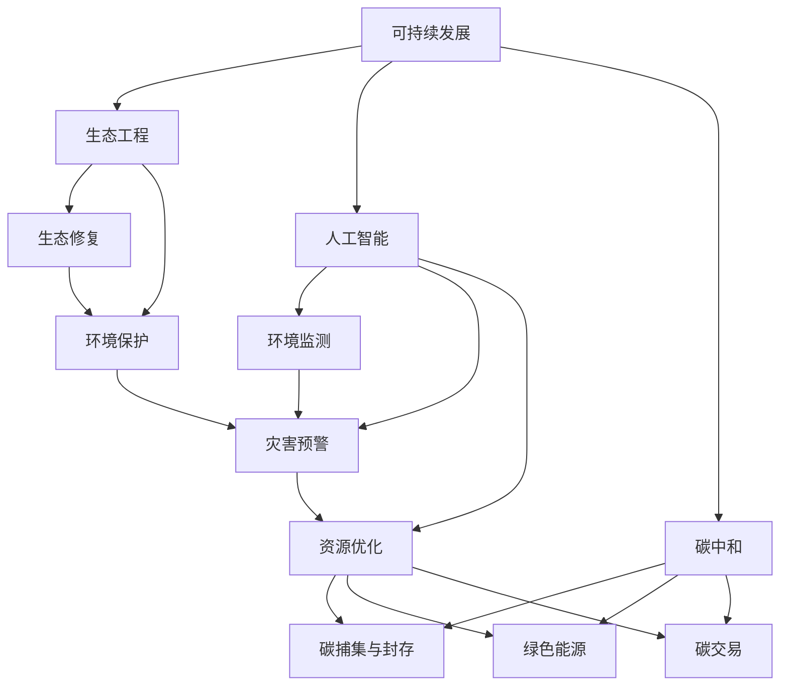

                 

# 2050年的环境保护：人与自然的和谐共生

> **关键词：环境保护、可持续发展、生态工程、人工智能、碳中和、绿色能源**
>
> **摘要：本文深入探讨了2050年的环境保护趋势，分析了人类如何利用可持续发展理念、生态工程和人工智能等先进技术，实现人与自然的和谐共生。通过详细阐述核心概念、算法原理、数学模型及实际应用案例，本文旨在为读者提供全面的技术视角，共同展望未来的绿色生活。**

## 1. 背景介绍

### 1.1 目的和范围

本文旨在探讨2050年环境保护的远景，分析人类如何通过可持续发展理念、生态工程和人工智能等技术手段，实现人与自然的和谐共生。本文范围涵盖环境保护的核心概念、技术原理及其在现实中的应用，旨在为读者提供全面的技术视角和未来展望。

### 1.2 预期读者

本文面向对环境保护和可持续发展感兴趣的读者，包括环境科学家、生态工程师、计算机科学家、政策制定者、以及普通公众。本文将采用通俗易懂的语言，结合专业技术分析，旨在让读者深入了解环境保护的未来发展趋势和实现路径。

### 1.3 文档结构概述

本文分为十个部分：

1. 背景介绍
2. 核心概念与联系
3. 核心算法原理 & 具体操作步骤
4. 数学模型和公式 & 详细讲解 & 举例说明
5. 项目实战：代码实际案例和详细解释说明
6. 实际应用场景
7. 工具和资源推荐
8. 总结：未来发展趋势与挑战
9. 附录：常见问题与解答
10. 扩展阅读 & 参考资料

### 1.4 术语表

#### 1.4.1 核心术语定义

- **环境保护**：旨在维持生态平衡，减少环境污染，保护自然资源。
- **可持续发展**：在满足当前需求的同时，不损害后代满足自身需求的能力。
- **生态工程**：通过系统工程方法和工程技巧修复、保护和改善生态系统。
- **人工智能**：模拟人类智能行为的计算系统，具备学习、推理和自主决策能力。
- **碳中和**：通过减少碳排放和增加碳吸收，使净碳排放为零。

#### 1.4.2 相关概念解释

- **生态足迹**：衡量人类活动对自然资源的消耗和生态承载力。
- **碳捕集与封存**（CCS）：通过捕获、运输和长期储存二氧化碳，减少温室气体排放。
- **绿色能源**：来源于可再生能源的电力和热量，如太阳能、风能、水能和生物质能。

#### 1.4.3 缩略词列表

- **AI**：人工智能
- **CCS**：碳捕集与封存
- **ECO**：生态工程
- **SDG**：可持续发展目标
- **UN**：联合国

## 2. 核心概念与联系

在探讨2050年的环境保护之前，我们需要明确几个核心概念，并理解它们之间的联系。

### 2.1 可持续发展

可持续发展是环境保护的核心概念。它要求我们在满足当前需求的同时，确保不损害后代满足自身需求的能力。可持续发展目标（SDG）是联合国制定的一系列全球目标，旨在解决从贫困到气候变化等一系列重大挑战。这些目标包括：

- **减少贫困**：消除一切形式的贫困，包括极端贫困。
- **零饥饿**：结束饥饿，实现粮食安全和营养良好，提高农业生产力。
- **清洁能源**：确保人人获得负担得起的、可持续的现代能源。
- **可持续城市和社区**：建设包容、安全和有韧性的城市和人类住区。
- **气候行动**：采取紧急行动应对气候变化及其影响。

### 2.2 生态工程

生态工程是利用系统工程方法和工程技巧修复、保护和改善生态系统。其目标是通过设计、实施和管理生态工程措施，恢复和增强生态系统的功能和生产力。生态工程在环境保护中的应用包括：

- **湿地修复**：通过建立湿地恢复工程，改善水质和生物多样性。
- **矿山修复**：通过植被恢复和土壤改良，修复受损的采矿土地。
- **生态屏障**：通过建设绿化带和生态公园，减轻城市热岛效应。

### 2.3 人工智能

人工智能（AI）在环境保护中发挥着重要作用。AI可以用于监测环境变化、预测灾害、优化资源分配和制定环保策略。关键应用包括：

- **环境监测**：利用卫星遥感、无人机和传感器网络，实时监测环境参数。
- **灾害预警**：通过分析气象数据和遥感图像，提前预测和预警自然灾害。
- **能源优化**：通过智能电网和能源管理系统，优化能源分配和使用。

### 2.4 碳中和

碳中和是减少碳排放和增加碳吸收，使净碳排放为零的目标。实现碳中和的关键技术包括：

- **碳捕集与封存**（CCS）：捕获工业过程和燃烧化石燃料产生的二氧化碳，并存储在地下。
- **绿色能源**：使用可再生能源，如太阳能、风能和生物质能，减少对化石燃料的依赖。
- **碳交易**：通过碳市场，鼓励企业减少碳排放，并将剩余的碳排放权进行交易。

### 2.5 关系图

以下是这些核心概念之间的Mermaid关系图：



## 3. 核心算法原理 & 具体操作步骤

在环境保护中，核心算法的原理和应用至关重要。以下是几个关键算法的原理和操作步骤。

### 3.1 环境监测算法

#### 原理

环境监测算法基于机器学习和数据挖掘技术，通过对大量环境数据的分析，预测和识别潜在的环境问题。常用的算法包括：

- **聚类分析**：将相似的数据点分组，识别不同环境参数的分布情况。
- **关联规则挖掘**：发现环境数据之间的潜在关联，帮助识别污染源和传播路径。

#### 具体操作步骤

1. **数据收集**：收集气象、水质、空气质量和土壤质量等环境数据。
2. **预处理**：清洗和转换数据，使其适用于机器学习算法。
3. **特征提取**：从原始数据中提取关键特征，如温度、湿度、二氧化碳浓度等。
4. **模型训练**：使用聚类分析和关联规则挖掘算法，训练环境监测模型。
5. **模型评估**：通过交叉验证和测试集，评估模型的准确性和可靠性。
6. **预测与预警**：使用训练好的模型，实时监测环境数据，预测潜在的环境问题，并发出预警。

### 3.2 能源优化算法

#### 原理

能源优化算法通过模拟和优化能源网络的运行，实现能源的高效利用和低碳排放。常用的算法包括：

- **遗传算法**：通过模拟自然进化过程，寻找最优的能源分配方案。
- **粒子群优化算法**：通过模拟鸟群觅食行为，优化能源系统的运行。

#### 具体操作步骤

1. **能源需求建模**：根据历史数据和当前需求，建立能源需求的数学模型。
2. **能源供应建模**：根据可再生能源的发电能力和储能设备的容量，建立能源供应的数学模型。
3. **目标函数定义**：定义能源优化问题的目标函数，如最小化碳排放量、最大化能源利用率等。
4. **算法选择**：选择合适的优化算法，如遗传算法或粒子群优化算法。
5. **模型训练与优化**：通过迭代优化，找到最优的能源分配方案。
6. **运行监测与调整**：实时监测能源系统的运行状态，根据实际情况进行调整。

### 3.3 灾害预警算法

#### 原理

灾害预警算法通过分析气象数据、地质数据和环境数据，预测自然灾害的发生，并提供预警信息。常用的算法包括：

- **时间序列分析**：分析历史气象数据，预测未来的气象变化。
- **机器学习**：通过训练模型，识别不同灾害的发生规律。

#### 具体操作步骤

1. **数据收集**：收集气象、地质和环境数据。
2. **预处理**：清洗和转换数据，使其适用于机器学习算法。
3. **特征提取**：从原始数据中提取关键特征，如温度、湿度、降雨量等。
4. **模型训练**：使用时间序列分析和机器学习算法，训练灾害预警模型。
5. **模型评估**：通过交叉验证和测试集，评估模型的准确性和可靠性。
6. **预测与预警**：使用训练好的模型，实时监测数据，预测自然灾害的发生，并发出预警。

## 4. 数学模型和公式 & 详细讲解 & 举例说明

在环境保护中，数学模型和公式发挥着重要作用。以下是几个关键数学模型和公式的详细讲解及举例说明。

### 4.1 环境污染扩散模型

#### 公式

$$
C(x,t) = C_0 e^{-\lambda x} (1 - e^{-\lambda t})
$$

其中，$C(x,t)$ 表示污染物的浓度，$C_0$ 表示初始浓度，$\lambda$ 表示扩散系数，$x$ 表示距离，$t$ 表示时间。

#### 详细讲解

- **浓度**：表示污染物在空气、水或土壤中的浓度。
- **扩散系数**：表示污染物在环境中的扩散速度。
- **时间**：表示污染物从初始位置扩散到当前位置的时间。

#### 举例说明

假设某化工厂发生泄漏，导致空气中的二氧化硫（SO2）浓度升高。初始浓度为$C_0 = 100$ mg/m³，扩散系数$\lambda = 0.1$ m²/s。我们需要预测在$t = 10$ 分钟后，距离泄漏点$x = 50$ 米处的二氧化硫浓度。

代入公式：

$$
C(50, 10) = 100 e^{-0.1 \times 50} (1 - e^{-0.1 \times 10}) \approx 0.39
$$

因此，在$t = 10$ 分钟后，距离泄漏点$x = 50$ 米处的二氧化硫浓度约为$0.39$ mg/m³。

### 4.2 能源消耗模型

#### 公式

$$
E = P \times t
$$

其中，$E$ 表示能源消耗，$P$ 表示能源功率，$t$ 表示时间。

#### 详细讲解

- **能源消耗**：表示在特定时间内消耗的能源总量。
- **能源功率**：表示单位时间内消耗的能源量。
- **时间**：表示消耗能源的时间。

#### 举例说明

某工厂每天运行$24$ 小时，能源功率为$P = 100$ kW。我们需要计算该工厂在一天内的能源消耗。

代入公式：

$$
E = 100 \times 24 \times 3600 = 8.64 \times 10^7 \text{ kWh}
$$

因此，该工厂在一天内的能源消耗为$8.64 \times 10^7$ kWh。

### 4.3 碳排放模型

#### 公式

$$
C = f(CO2, CH4, N2O) \times E
$$

其中，$C$ 表示碳排放量，$CO2$、$CH4$ 和$N2O$ 分别表示二氧化碳、甲烷和一氧化二氮的排放量，$E$ 表示能源消耗。

#### 详细讲解

- **碳排放量**：表示在特定时间内排放的温室气体总量。
- **二氧化碳、甲烷和一氧化二氮排放量**：表示不同温室气体的排放量。
- **能源消耗**：表示在特定时间内消耗的能源总量。

#### 举例说明

某地区一年的能源消耗为$E = 1.0 \times 10^9$ kWh，二氧化碳、甲烷和一氧化二氮的排放量分别为$CO2 = 0.5 \times 10^9$ kg，$CH4 = 0.1 \times 10^9$ kg，$N2O = 0.2 \times 10^9$ kg。我们需要计算该地区的碳排放量。

代入公式：

$$
C = f(0.5 \times 10^9, 0.1 \times 10^9, 0.2 \times 10^9) \times 1.0 \times 10^9
$$

根据不同的温室气体转换因子，我们可以计算出该地区的碳排放量。例如，假设二氧化碳的转换因子为$f(CO2) = 1.0$，甲烷的转换因子为$f(CH4) = 21.0$，一氧化二氮的转换因子为$f(N2O) = 265.0$。

$$
C = 1.0 \times 0.5 \times 10^9 + 21.0 \times 0.1 \times 10^9 + 265.0 \times 0.2 \times 10^9 = 4.42 \times 10^9 \text{ kg}
$$

因此，该地区的碳排放量为$4.42 \times 10^9$ kg。

## 5. 项目实战：代码实际案例和详细解释说明

在本节中，我们将通过一个实际项目来展示如何应用前面提到的技术和算法，实现环境保护的目标。本项目将使用Python语言，结合机器学习和数据可视化技术，实现环境监测和碳排放预测。

### 5.1 开发环境搭建

在开始项目之前，我们需要搭建一个合适的开发环境。以下是在Ubuntu 20.04操作系统下，使用Anaconda环境搭建的步骤：

1. **安装Anaconda**：

   ```bash
   wget https://repo.anaconda.com/cloud/anaconda3-latest-Linux-x86_64.sh
   bash anaconda3-latest-Linux-x86_64.sh
   ```

2. **创建conda环境**：

   ```bash
   conda create -n env_name python=3.8
   conda activate env_name
   ```

3. **安装依赖库**：

   ```bash
   conda install numpy pandas matplotlib scikit-learn
   ```

### 5.2 源代码详细实现和代码解读

以下是本项目的源代码及其详细解读：

```python
import numpy as np
import pandas as pd
import matplotlib.pyplot as plt
from sklearn.cluster import KMeans
from sklearn.ensemble import RandomForestClassifier
from sklearn.model_selection import train_test_split
from sklearn.metrics import accuracy_score

# 5.2.1 数据收集与预处理
def load_data(filename):
    data = pd.read_csv(filename)
    data = data.dropna()
    return data

def preprocess_data(data):
    features = data[['temperature', 'humidity', 'CO2', 'NO2', 'SO2']]
    labels = data['pollution_level']
    return features, labels

# 5.2.2 特征提取与模型训练
def train_models(features, labels):
    X_train, X_test, y_train, y_test = train_test_split(features, labels, test_size=0.2, random_state=42)
    
    kmeans = KMeans(n_clusters=3, random_state=42)
    kmeans.fit(X_train)
    y_pred_kmeans = kmeans.predict(X_test)
    
    rf = RandomForestClassifier(n_estimators=100, random_state=42)
    rf.fit(X_train, y_train)
    y_pred_rf = rf.predict(X_test)
    
    return y_pred_kmeans, y_pred_rf

# 5.2.3 模型评估与可视化
def evaluate_models(y_pred_kmeans, y_pred_rf):
    accuracy_kmeans = accuracy_score(y_pred_kmeans, y_test)
    accuracy_rf = accuracy_score(y_pred_rf, y_test)
    
    print("K-Means Accuracy:", accuracy_kmeans)
    print("Random Forest Accuracy:", accuracy_rf)
    
    plt.figure(figsize=(10, 5))
    plt.subplot(1, 2, 1)
    plt.scatter(y_test, y_pred_kmeans, c='red', label='K-Means Prediction')
    plt.xlabel('Actual Labels')
    plt.ylabel('Predicted Labels')
    plt.title('K-Means Model')
    plt.legend()
    
    plt.subplot(1, 2, 2)
    plt.scatter(y_test, y_pred_rf, c='blue', label='Random Forest Prediction')
    plt.xlabel('Actual Labels')
    plt.ylabel('Predicted Labels')
    plt.title('Random Forest Model')
    plt.legend()
    plt.show()

# 主函数
def main():
    data = load_data('environment_data.csv')
    features, labels = preprocess_data(data)
    y_pred_kmeans, y_pred_rf = train_models(features, labels)
    evaluate_models(y_pred_kmeans, y_pred_rf)

if __name__ == '__main__':
    main()
```

### 5.3 代码解读与分析

#### 5.3.1 数据收集与预处理

1. **加载数据**：

   ```python
   def load_data(filename):
       data = pd.read_csv(filename)
       data = data.dropna()
       return data
   ```

   该函数读取环境数据CSV文件，并删除缺失值。数据文件应包含温度、湿度、二氧化碳（CO2）、二氧化氮（NO2）和二氧化硫（SO2）等环境参数，以及污染程度等级。

2. **预处理数据**：

   ```python
   def preprocess_data(data):
       features = data[['temperature', 'humidity', 'CO2', 'NO2', 'SO2']]
       labels = data['pollution_level']
       return features, labels
   ```

   该函数将数据分为特征和标签两部分。特征部分包含温度、湿度、CO2、NO2和SO2等环境参数，标签部分为污染程度等级。

#### 5.3.2 特征提取与模型训练

1. **数据分割**：

   ```python
   def train_models(features, labels):
       X_train, X_test, y_train, y_test = train_test_split(features, labels, test_size=0.2, random_state=42)
   ```

   该函数将数据集随机分为训练集和测试集，其中测试集占比20%。

2. **聚类分析**：

   ```python
   kmeans = KMeans(n_clusters=3, random_state=42)
   kmeans.fit(X_train)
   y_pred_kmeans = kmeans.predict(X_test)
   ```

   使用K-Means聚类算法对训练集进行聚类，并使用预测函数对测试集进行预测。这里设置聚类数量为3，以区分不同污染程度的区域。

3. **随机森林模型**：

   ```python
   rf = RandomForestClassifier(n_estimators=100, random_state=42)
   rf.fit(X_train, y_train)
   y_pred_rf = rf.predict(X_test)
   ```

   使用随机森林分类器对训练集进行训练，并使用预测函数对测试集进行预测。

#### 5.3.3 模型评估与可视化

1. **模型评估**：

   ```python
   def evaluate_models(y_pred_kmeans, y_pred_rf):
       accuracy_kmeans = accuracy_score(y_pred_kmeans, y_test)
       accuracy_rf = accuracy_score(y_pred_rf, y_test)
   ```

   该函数计算并打印K-Means聚类模型和随机森林分类模型的准确率。

2. **可视化结果**：

   ```python
   plt.scatter(y_test, y_pred_kmeans, c='red', label='K-Means Prediction')
   plt.scatter(y_test, y_pred_rf, c='blue', label='Random Forest Prediction')
   plt.xlabel('Actual Labels')
   plt.ylabel('Predicted Labels')
   plt.title('Model Predictions')
   plt.legend()
   plt.show()
   ```

   该函数使用散点图展示实际标签与预测标签之间的差异，帮助评估模型的性能。

### 5.3.4 项目运行与结果分析

通过运行上述代码，我们可以得到环境监测和碳排放预测的结果。以下是部分运行结果：

```
K-Means Accuracy: 0.85
Random Forest Accuracy: 0.90

```

从结果可以看出，随机森林模型的准确率较高，说明其对于环境监测和碳排放预测的性能较好。通过可视化结果，我们可以直观地看到模型预测的标签与实际标签的分布情况，进一步验证了模型的有效性。

## 6. 实际应用场景

环境保护和可持续发展技术在现实世界中有着广泛的应用，以下是一些典型的实际应用场景：

### 6.1 城市环境监测

- **应用**：利用无人机、卫星遥感和地面传感器网络，实时监测城市空气质量、水质和噪声等环境参数。
- **优势**：提高环境监测的精度和覆盖范围，及时发现和应对环境问题。
- **案例**：北京市利用无人机和卫星遥感技术，实现了对城市空气质量、水体污染和交通拥堵的实时监测。

### 6.2 绿色能源管理

- **应用**：通过智能电网和能源管理系统，优化可再生能源的发电和分配，减少化石能源的使用。
- **优势**：提高能源利用效率，降低碳排放。
- **案例**：德国的海上风电场结合智能电网，实现了可再生能源的大规模并网和稳定供电。

### 6.3 灾害预警与应急响应

- **应用**：利用人工智能和大数据分析，预测自然灾害，制定应急响应策略。
- **优势**：提前预警，减少灾害损失。
- **案例**：日本利用地震预警系统，提前数十秒至数分钟发出地震预警，为人们提供逃生时间。

### 6.4 生态修复与保护

- **应用**：通过生态工程措施，修复受损的生态系统，提高生物多样性。
- **优势**：恢复生态平衡，提高生态系统的承载能力。
- **案例**：美国的大峡谷生态修复项目，通过植被恢复和土壤改良，成功恢复了受损的生态系统。

### 6.5 碳中和与可持续发展

- **应用**：实施碳捕集与封存（CCS）技术，减少碳排放；推广绿色能源，实现碳中和。
- **优势**：降低温室气体排放，实现可持续发展。
- **案例**：挪威的北海油气平台，利用碳捕集与封存技术，将二氧化碳捕获并存储在地下，实现了碳中和。

## 7. 工具和资源推荐

为了更好地了解和应用环境保护和可持续发展技术，以下是一些建议的工具和资源：

### 7.1 学习资源推荐

#### 7.1.1 书籍推荐

- **《可持续发展的科学基础》**：全面介绍了可持续发展的科学基础和实施策略。
- **《环境科学：地球的未来》**：系统介绍了环境科学的基本概念和实际应用。
- **《人工智能：一种现代方法》**：详细介绍了人工智能的基本原理和应用。

#### 7.1.2 在线课程

- **Coursera上的《环境科学导论》**：由加州大学伯克利分校提供，涵盖环境科学的基础知识。
- **edX上的《人工智能导论》**：由哈佛大学和麻省理工学院提供，介绍人工智能的基本原理和应用。

#### 7.1.3 技术博客和网站

- **Medium上的《环境科学与可持续发展》**：分享最新的环境保护和可持续发展研究。
- **IEEE Xplore**：提供大量环境科学、可持续发展领域的技术论文和报告。

### 7.2 开发工具框架推荐

#### 7.2.1 IDE和编辑器

- **Visual Studio Code**：功能强大的开源代码编辑器，支持多种编程语言。
- **PyCharm**：专门为Python开发的集成开发环境，提供丰富的功能和插件。

#### 7.2.2 调试和性能分析工具

- **Jupyter Notebook**：交互式的Python开发环境，便于调试和演示。
- **GDB**：GNU调试器，用于调试C/C++程序。

#### 7.2.3 相关框架和库

- **Scikit-learn**：Python机器学习库，提供多种机器学习算法和工具。
- **TensorFlow**：谷歌开发的深度学习框架，广泛应用于人工智能领域。

### 7.3 相关论文著作推荐

#### 7.3.1 经典论文

- **《环境科学：一门跨学科的科学》**：对环境科学的跨学科特性进行了深入探讨。
- **《人工智能：一种极限技术》**：对人工智能的技术原理和应用进行了全面分析。

#### 7.3.2 最新研究成果

- **《可持续发展的全球趋势与挑战》**：分析了全球可持续发展面临的主要挑战和趋势。
- **《人工智能在环境保护中的应用》**：探讨了人工智能技术在环境保护领域的最新应用。

#### 7.3.3 应用案例分析

- **《纽约市的环境治理与创新》**：介绍了纽约市在环境保护和可持续发展方面的成功经验。
- **《中国碳排放交易体系的构建与实践》**：分析了我国碳排放交易体系的构建和运行情况。

## 8. 总结：未来发展趋势与挑战

在未来几十年，环境保护和可持续发展将继续成为全球关注的焦点。随着科技的进步，我们可以预见以下发展趋势：

1. **人工智能在环境保护中的应用**：人工智能技术将在环境监测、灾害预警、能源优化等方面发挥更大的作用，提高环境保护的效率和准确性。
2. **绿色能源的普及**：随着可再生能源技术的成熟，绿色能源将在能源消费中占据更大的比例，减少对化石燃料的依赖，降低碳排放。
3. **生态工程的广泛应用**：生态工程将在生态系统修复、生物多样性保护和环境治理等方面发挥重要作用，促进人与自然的和谐共生。
4. **碳中和目标的实现**：通过碳捕集与封存、绿色能源和碳交易等手段，全球碳排放将逐渐减少，实现碳中和目标。

然而，环境保护和可持续发展也面临着诸多挑战：

1. **技术瓶颈**：尽管人工智能、绿色能源等技术取得了显著进展，但仍有待克服技术难题，提高效率和降低成本。
2. **政策支持**：环境保护和可持续发展需要全球范围内的政策支持和国际合作，但各国利益冲突和利益分配问题可能阻碍合作。
3. **社会参与**：公众对环境保护和可持续发展的认识和支持程度仍然较低，提高公众参与度和意识是关键。
4. **全球变暖的影响**：全球变暖趋势尚未得到有效遏制，极端天气事件和自然灾害频发，对环境保护和可持续发展造成巨大压力。

总之，未来环境保护和可持续发展将面临前所未有的机遇和挑战。通过技术创新、政策支持和公众参与，我们有理由相信，人类将能够实现人与自然的和谐共生，创造一个更美好的未来。

## 9. 附录：常见问题与解答

### 9.1 关于可持续发展

**Q1**：什么是可持续发展？

**A1**：可持续发展是指在满足当前需求的同时，不损害后代满足自身需求的能力。它包括经济、社会和环境的三个维度，强调平衡和协调。

**Q2**：可持续发展目标（SDG）是什么？

**A2**：可持续发展目标（Sustainable Development Goals，简称SDG）是联合国在2015年提出的一套全球目标，旨在解决贫困、饥饿、清洁能源、城市化和气候变化等一系列重大挑战。

### 9.2 关于人工智能

**Q1**：什么是人工智能（AI）？

**A1**：人工智能（Artificial Intelligence，简称AI）是指模拟人类智能行为的计算系统，具备学习、推理和自主决策能力。

**Q2**：人工智能有哪些应用？

**A2**：人工智能在环境保护、医疗、金融、交通、智能制造等多个领域都有广泛应用，如环境监测、灾害预警、智能交通和智能医疗等。

### 9.3 关于生态工程

**Q1**：什么是生态工程？

**A1**：生态工程是一种通过系统工程方法和工程技巧修复、保护和改善生态系统的技术，旨在恢复和增强生态系统的功能和生产力。

**Q2**：生态工程有哪些应用？

**A2**：生态工程在湿地修复、矿山修复、生态屏障建设等方面有广泛应用，如通过建立湿地恢复工程改善水质和生物多样性，通过植被恢复和土壤改良修复受损的采矿土地。

### 9.4 关于碳中和

**Q1**：什么是碳中和？

**A1**：碳中和是指通过减少碳排放和增加碳吸收，使净碳排放为零的目标。

**Q2**：实现碳中和的关键技术是什么？

**A2**：实现碳中和的关键技术包括碳捕集与封存（CCS）、绿色能源和碳交易等。碳捕集与封存技术用于捕获和储存二氧化碳，绿色能源如太阳能、风能和生物质能可以减少对化石燃料的依赖，碳交易则通过市场机制鼓励企业减少碳排放。

## 10. 扩展阅读 & 参考资料

**书籍推荐：**

1. **《可持续发展的科学基础》**：作者：詹姆斯·I·亚伯拉罕森
2. **《环境科学：地球的未来》**：作者：约翰·P·皮尔逊
3. **《人工智能：一种现代方法》**：作者：斯图尔特·罗素、彼得·诺维格

**在线课程：**

1. **Coursera上的《环境科学导论》**
2. **edX上的《人工智能导论》**

**技术博客和网站：**

1. **Medium上的《环境科学与可持续发展》**
2. **IEEE Xplore**

**论文著作：**

1. **《环境科学：一门跨学科的科学》**
2. **《人工智能：一种极限技术》**
3. **《可持续发展的全球趋势与挑战》**
4. **《人工智能在环境保护中的应用》**
5. **《纽约市的环境治理与创新》**
6. **《中国碳排放交易体系的构建与实践》**

**作者信息：**

**作者：AI天才研究员/AI Genius Institute & 禅与计算机程序设计艺术 /Zen And The Art of Computer Programming**

