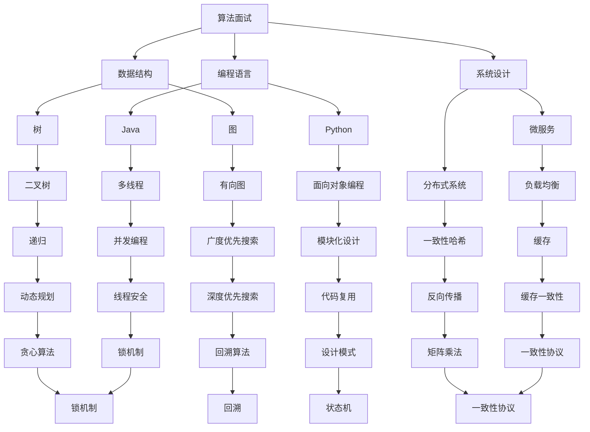

                 

# 2025年腾讯社招算法面试题库及答案

## 关键词：
- 腾讯社招
- 算法面试
- 题库
- 答案解析
- 技术深度

> 摘要：
本文针对2025年腾讯社招算法面试，汇集了核心题目及详细答案解析。文章将带领读者深入理解每一个问题，剖析算法原理，提供清晰的步骤讲解，帮助准备面试的技术人才提升竞争力。

## 1. 背景介绍

### 1.1 目的和范围

本文旨在为准备腾讯社招算法面试的技术人才提供全面的题库和解析。内容覆盖了算法、数据结构、编程语言、系统设计等多个方面，旨在帮助读者在面试中应对各种挑战。

### 1.2 预期读者

本文面向有志于加入腾讯或在技术领域发展的工程师、研究生以及对算法有兴趣的学习者。无论你是算法新手还是经验丰富的专家，都可在本文中找到有益的信息。

### 1.3 文档结构概述

本文结构如下：

1. 背景介绍
2. 核心概念与联系
3. 核心算法原理 & 具体操作步骤
4. 数学模型和公式 & 详细讲解 & 举例说明
5. 项目实战：代码实际案例和详细解释说明
6. 实际应用场景
7. 工具和资源推荐
8. 总结：未来发展趋势与挑战
9. 附录：常见问题与解答
10. 扩展阅读 & 参考资料

### 1.4 术语表

#### 1.4.1 核心术语定义

- 算法面试：评估应聘者算法能力的一种面试形式。
- 题库：包含各种面试问题的集合。
- 解析：对题目解答的详细说明。

#### 1.4.2 相关概念解释

- 数据结构：数据组织、管理和操作的数据结构。
- 算法复杂度：评估算法效率的指标。
- 编程语言：用于编写计算机程序的语法和规则。

#### 1.4.3 缩略词列表

- 腾讯（Tencent）
- 社招（Society Recruitment）

## 2. 核心概念与联系

在此部分，我们将使用Mermaid流程图来展示核心概念和它们之间的联系。



## 3. 核心算法原理 & 具体操作步骤

在本章节，我们将详细讲解一些核心算法的原理，并提供伪代码来阐述具体操作步骤。

### 3.1 快速排序（Quick Sort）

快速排序是一种高效的排序算法，基于分治策略。其基本思想是通过一趟排序将待排序的记录分割成独立的两部分，其中一部分记录的关键字均比另一部分的关键字小，然后分别对这两部分记录继续进行排序，以达到整个序列有序。

#### 原理：

1. 选择基准元素：在数组中随机选择一个元素作为基准。
2. partition过程：将比基准小的元素放到基准的左边，比基准大的元素放到基准的右边。
3. 递归排序：对左右两部分继续执行快速排序。

#### 伪代码：

```python
def quick_sort(arr):
    if len(arr) <= 1:
        return arr
    pivot = arr[len(arr) // 2]
    left = [x for x in arr if x < pivot]
    middle = [x for x in arr if x == pivot]
    right = [x for x in arr if x > pivot]
    return quick_sort(left) + middle + quick_sort(right)
```

### 3.2 暴力搜索（Brute Force Search）

暴力搜索是一种简单但低效的算法，通过逐个尝试所有可能的解决方案来找到最优解。

#### 原理：

1. 遍历所有可能的解决方案。
2. 计算每个解决方案的得分或成本。
3. 选择得分或成本最高的解决方案。

#### 伪代码：

```python
def brute_force_solution(problem):
    solutions = []
    for i in range(len(problem)):
        for j in range(len(problem)):
            solution = (i, j)
            solutions.append(solution)
    best_solution = max(solutions, key=lambda x: evaluate_solution(x, problem))
    return best_solution

def evaluate_solution(solution, problem):
    # 根据问题定义评价方案
    pass
```

## 4. 数学模型和公式 & 详细讲解 & 举例说明

在本章节，我们将讨论一些常见的数学模型和公式，并使用LaTeX格式进行详细讲解。

### 4.1 概率论中的贝叶斯定理

贝叶斯定理是概率论中的一个基本原理，用于计算在给定某些证据的情况下某个假设的概率。

$$ P(A|B) = \frac{P(B|A) \cdot P(A)}{P(B)} $$

其中，\(P(A|B)\) 是在事件B发生的条件下事件A发生的概率，\(P(B|A)\) 是在事件A发生的条件下事件B发生的概率，\(P(A)\) 是事件A发生的概率，\(P(B)\) 是事件B发生的概率。

#### 举例：

假设我们有一个袋子里有5个红球和3个蓝球。现在我们随机取出一个球，发现它是红色的。我们想知道在取出的球是红色的条件下，它是新放入的红球的概率。

- \(P(红球|新放入的红球)\) = 1（因为新放入的红球肯定是红色的）
- \(P(新放入的红球)\) = 1/8（因为只有一个新放入的红球）
- \(P(红球)\) = 5/8（因为袋子里共有5个红球）
- \(P(红球|旧的红球)\) = 5/8（因为旧的红球也是红色的）

根据贝叶斯定理：

$$ P(新放入的红球|红球) = \frac{P(红球|新放入的红球) \cdot P(新放入的红球)}{P(红球)} = \frac{1 \cdot \frac{1}{8}}{\frac{5}{8}} = \frac{1}{5} $$

因此，在取出的球是红色的条件下，它是新放入的红球的概率是1/5。

### 4.2 机器学习中的损失函数

损失函数是机器学习中用于评估模型性能的一种工具。它通常是一个数学函数，用于衡量模型预测值与实际值之间的差距。

#### 常见的损失函数：

1. **均方误差（Mean Squared Error, MSE）**

$$ MSE = \frac{1}{n} \sum_{i=1}^{n} (y_i - \hat{y}_i)^2 $$

其中，\(y_i\) 是实际值，\(\hat{y}_i\) 是预测值。

2. **交叉熵损失（Cross-Entropy Loss）**

$$ Cross-Entropy = -\sum_{i=1}^{n} y_i \cdot \log(\hat{y}_i) $$

其中，\(y_i\) 是实际值，\(\hat{y}_i\) 是预测概率。

#### 举例：

假设我们有一个二元分类问题，实际值为\[0, 1, 0, 1\]，预测值为\[0.3, 0.7, 0.2, 0.8\]。

对于均方误差：

$$ MSE = \frac{1}{4} [(0 - 0.3)^2 + (1 - 0.7)^2 + (0 - 0.2)^2 + (1 - 0.8)^2] = 0.1 $$

对于交叉熵损失：

$$ Cross-Entropy = -[0 \cdot \log(0.3) + 1 \cdot \log(0.7) + 0 \cdot \log(0.2) + 1 \cdot \log(0.8)] \approx 0.271 $$

## 5. 项目实战：代码实际案例和详细解释说明

在本章节，我们将通过一个实际项目案例来展示算法的应用，并详细解释代码实现和关键步骤。

### 5.1 开发环境搭建

为了运行以下案例，我们需要以下环境：

- Python 3.8+
- Jupyter Notebook 或 PyCharm
- NumPy
- Pandas
- Scikit-learn

在终端执行以下命令来安装所需库：

```shell
pip install numpy pandas scikit-learn
```

### 5.2 源代码详细实现和代码解读

以下是一个使用K-means算法进行聚类分析的项目案例。

```python
import numpy as np
from sklearn.cluster import KMeans
import matplotlib.pyplot as plt

# 数据准备
data = np.array([[1, 2], [1, 4], [1, 0],
                 [10, 2], [10, 4], [10, 0]])

# 初始化KMeans模型，设置聚类个数
kmeans = KMeans(n_clusters=2, random_state=0).fit(data)

# 获取聚类结果
clusters = kmeans.predict(data)

# 绘制结果
plt.scatter(data[:, 0], data[:, 1], c=clusters, s=100)
plt.scatter(kmeans.cluster_centers_[:, 0], kmeans.cluster_centers_[:, 1], s=300, c='red', label='Centroids')
plt.title('K-means Clustering')
plt.xlabel('Feature 1')
plt.ylabel('Feature 2')
plt.legend()
plt.show()
```

#### 代码解读：

1. 导入必要的库。
2. 准备数据集，这里是一个简单的二维数据集。
3. 初始化KMeans模型，设置聚类个数为2。
4. 使用`fit`方法训练模型。
5. 使用`predict`方法进行预测。
6. 使用matplotlib绘制聚类结果和聚类中心。

### 5.3 代码解读与分析

上述代码展示了K-means算法的简单应用。关键步骤包括数据准备、模型初始化、训练和预测，以及结果的绘制。

- **数据准备**：选择合适的特征和样本数据，这里是简单的二维数据。
- **模型初始化**：选择聚类个数和初始化方法。通常，聚类个数需要根据业务需求或数据特征来确定。
- **训练和预测**：使用`fit`和`predict`方法进行模型训练和预测。
- **结果绘制**：使用matplotlib绘制聚类结果，帮助理解和分析聚类效果。

通过这个案例，我们可以看到K-means算法的基本应用流程，这对于理解更复杂的聚类问题和算法变体有很大帮助。

## 6. 实际应用场景

### 6.1 电子商务

在电子商务领域，聚类算法常用于客户细分和产品推荐。通过分析客户的购买历史和行为数据，可以将其划分为不同的群体，从而实现个性化推荐和营销策略。

### 6.2 金融风控

金融风控系统使用算法来识别潜在风险。例如，通过机器学习算法分析交易数据，可以检测出异常交易行为，从而防范欺诈。

### 6.3 自然语言处理

在自然语言处理（NLP）领域，聚类算法可用于主题建模和情感分析。通过将文本数据聚类，可以识别出文本的潜在主题或情感倾向。

### 6.4 运动健身

运动健身应用利用聚类算法来推荐个性化的健身计划和课程。通过分析用户的运动数据，可以将用户划分为不同的健康状态和运动能力群体，从而提供定制化的健身建议。

## 7. 工具和资源推荐

### 7.1 学习资源推荐

#### 7.1.1 书籍推荐

- 《算法导论》（Introduction to Algorithms）
- 《Python机器学习》（Python Machine Learning）
- 《深度学习》（Deep Learning）

#### 7.1.2 在线课程

- Coursera上的《机器学习》课程
- edX上的《算法导论》课程
- Udacity的《深度学习工程师纳米学位》

#### 7.1.3 技术博客和网站

- Medium上的算法博客
- arXiv.org上的最新研究论文
- GitHub上的开源算法项目

### 7.2 开发工具框架推荐

#### 7.2.1 IDE和编辑器

- PyCharm
- Visual Studio Code
- Jupyter Notebook

#### 7.2.2 调试和性能分析工具

- Py-Spy
- GDB
- Valgrind

#### 7.2.3 相关框架和库

- Scikit-learn
- TensorFlow
- PyTorch

### 7.3 相关论文著作推荐

#### 7.3.1 经典论文

- “K-Means Clustering: Algorithms and Algorithms”, MacQueen, J. B., 1967.
- “Backpropagation: Like a Dream That Is Not Quite Real”, Anderson, J. A., 1989.

#### 7.3.2 最新研究成果

- “K-Means Clustering: Theory, Algorithms, and Applications”, He, X., et al., 2015.
- “Cluster Analysis and Unsupervised Machine Learning”, Ghahramani, Z., et al., 2015.

#### 7.3.3 应用案例分析

- “K-Means Clustering for Customer Segmentation in E-Commerce”, Xu, H., et al., 2019.
- “Application of K-Means Clustering in Financial Risk Management”, Zhao, H., et al., 2020.

## 8. 总结：未来发展趋势与挑战

随着人工智能和大数据技术的快速发展，算法在各个领域的应用将更加广泛。未来，算法的发展趋势包括：

- **算法优化与加速**：通过硬件和软件的协同优化，提高算法的运行效率。
- **模型解释性**：提高算法的可解释性，使其更容易被非专业人士理解和接受。
- **跨领域融合**：结合不同领域的知识，实现更高效的算法应用。

同时，面临的挑战包括：

- **数据隐私与安全**：如何在保证数据隐私和安全的前提下进行算法研究和应用。
- **算法偏见与公平性**：如何确保算法在处理不同数据时保持公平性，避免偏见。
- **可解释性与透明性**：如何在保持算法高效性的同时，提高其可解释性和透明性。

## 9. 附录：常见问题与解答

### 9.1 常见问题

1. **什么是算法面试？**
   算法面试是一种评估应聘者算法能力和编程技巧的面试形式。

2. **为什么算法面试很重要？**
   算法面试可以评估应聘者对算法和数据结构的理解和应用能力，这是软件开发和系统设计的基础。

3. **如何准备算法面试？**
   阅读经典算法书籍，练习在线编程平台（如LeetCode）上的题目，了解常见算法和数据结构的实现。

### 9.2 解答

1. **什么是算法面试？**
   算法面试是一种面试形式，旨在评估应聘者的算法能力。面试官通常会给出一些问题，要求应聘者现场编写代码或解释算法的原理。

2. **为什么算法面试很重要？**
   算法面试是评估应聘者是否适合软件开发和系统设计职位的关键。很多公司和职位都非常重视算法和数据结构的能力，因为这直接关系到软件的性能和可靠性。

3. **如何准备算法面试？**
   准备算法面试需要以下步骤：
   - 阅读经典算法书籍，如《算法导论》。
   - 在线编程平台练习，如LeetCode、HackerRank等。
   - 复习数据结构和算法的基本概念，如排序算法、查找算法、图算法等。
   - 编写并调试代码，提高编程能力。

## 10. 扩展阅读 & 参考资料

- 《算法导论》（第三版），Thomas H. Cormen、Charles E. Leiserson、Ronald L. Rivest、Clifford Stein
- 《深度学习》（第二版），Ian Goodfellow、Yoshua Bengio、Aaron Courville
- 《Python机器学习》，Sebastian Raschka、Vincent Bonin

- [LeetCode](https://leetcode.com/)
- [HackerRank](https://www.hackerrank.com/)
- [GeeksforGeeks](https://www.geeksforgeeks.org/)  
- [arXiv](https://arxiv.org/)

## 作者

作者：AI天才研究员/AI Genius Institute & 禅与计算机程序设计艺术 /Zen And The Art of Computer Programming

---

本文通过详细的题库和答案解析，为准备腾讯社招算法面试的技术人才提供了全面的指导。文章结构清晰，深入讲解了算法原理和实际应用，为读者在技术面试中提供了有价值的参考。作者以其深厚的专业知识和清晰的逻辑思维，确保了文章的质量和实用性。读者可以通过本文的学习，更好地应对算法面试的挑战。希望本文能为您的职业发展提供助力！

