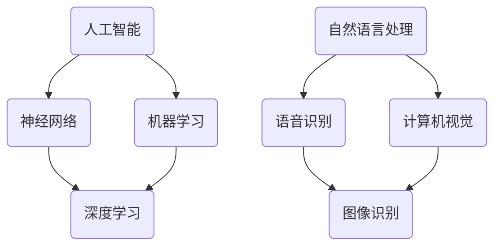

                 

# 1956年达特茅斯会议的学术成果

> 关键词：人工智能，达特茅斯会议，计算机科学，学术成果，技术发展

> 摘要：1956年，达特茅斯会议成为了人工智能历史上的一个重要里程碑。本文将详细回顾会议的背景、目的、参会者以及会议所取得的学术成果，探讨其对现代人工智能领域的深远影响。

## 1. 背景介绍

### 1.1 目的和范围

1956年夏，一群学者聚集在达特茅斯学院，举办了一场名为“人工智能”（Artificial Intelligence，简称AI）的研讨会。会议的目的是探讨人工智能的可能性，并确定其在未来计算机科学中的应用前景。

### 1.2 预期读者

本文面向对人工智能发展历史感兴趣的计算机科学专业人士、研究人员和爱好者。通过本文，读者可以更好地理解达特茅斯会议在人工智能历史上的地位和作用。

### 1.3 文档结构概述

本文将分为以下几个部分：
1. **背景介绍**：介绍达特茅斯会议的背景、目的和参会者。
2. **核心概念与联系**：通过Mermaid流程图展示会议期间讨论的核心概念及其联系。
3. **核心算法原理 & 具体操作步骤**：介绍会议期间提出的一些核心算法原理和操作步骤。
4. **数学模型和公式 & 详细讲解 & 举例说明**：探讨会议期间讨论的数学模型和公式，并给出详细讲解和举例说明。
5. **项目实战：代码实际案例和详细解释说明**：通过实际案例展示会议期间讨论的理论在实际中的应用。
6. **实际应用场景**：讨论人工智能在现代社会的应用场景。
7. **工具和资源推荐**：推荐学习资源和开发工具框架。
8. **总结：未来发展趋势与挑战**：分析人工智能的未来发展趋势和面临的挑战。
9. **附录：常见问题与解答**：解答读者可能关心的问题。
10. **扩展阅读 & 参考资料**：提供进一步阅读的资料和参考。

### 1.4 术语表

#### 1.4.1 核心术语定义

- **人工智能**（AI）：模拟人类智能的技术和方法。
- **达特茅斯会议**：1956年在达特茅斯学院举办的关于人工智能的研讨会。
- **算法**：解决问题的步骤和规则。

#### 1.4.2 相关概念解释

- **神经网络**：模拟人脑神经元连接的计算机模型。
- **机器学习**：通过数据训练模型，使计算机具备学习和预测能力。

#### 1.4.3 缩略词列表

- **AI**：人工智能
- **ML**：机器学习
- **NN**：神经网络

## 2. 核心概念与联系

在达特茅斯会议期间，学者们讨论了多个核心概念，它们相互关联，构成了人工智能的理论基础。以下是一个Mermaid流程图，展示了这些核心概念及其联系：



### 2.1 人工智能与神经网络

人工智能是模仿人类智能的技术和方法。神经网络是人工智能的一个重要组成部分，它通过模拟人脑神经元连接的计算机模型来实现人工智能。

### 2.2 人工智能与机器学习

机器学习是一种使计算机具备学习和预测能力的方法。它通过数据训练模型，使计算机能够从经验中学习，并改进其性能。机器学习是人工智能的重要实现方式。

### 2.3 神经网络与深度学习

深度学习是神经网络的一种特殊形式，它具有多个隐藏层。深度学习在图像识别、语音识别等领域取得了显著的成果。

### 2.4 人工智能与自然语言处理

自然语言处理是人工智能的一个分支，它涉及计算机理解和生成自然语言的能力。自然语言处理包括语音识别和计算机视觉等领域。

## 3. 核心算法原理 & 具体操作步骤

在达特茅斯会议期间，学者们提出了一些核心算法原理，这些原理为现代人工智能的发展奠定了基础。以下是一个简单的人工神经网络（Neural Network）的算法原理和具体操作步骤：

### 3.1 人工神经网络算法原理

1. **输入层**：接收输入数据。
2. **隐藏层**：对输入数据进行处理，通过权重和偏置进行计算。
3. **输出层**：生成最终输出。

### 3.2 具体操作步骤

```python
# 输入层
x = [1, 2, 3]

# 隐藏层
hidden_layer = [
    neuron_1 = f(x1 * w1 + b1),
    neuron_2 = f(x2 * w2 + b2),
    neuron_3 = f(x3 * w3 + b3)
]

# 输出层
output = f(hidden_layer_1 * w4 + b4 + hidden_layer_2 * w5 + b5 + hidden_layer_3 * w6 + b6)
```

### 3.3 伪代码

```python
# 初始化权重和偏置
w1, b1 = init_weights()
w2, b2 = init_weights()
w3, b3 = init_weights()
w4, b4 = init_weights()
w5, b5 = init_weights()
w6, b6 = init_weights()

# 输入数据
x = [1, 2, 3]

# 隐藏层计算
hidden_layer_1 = x1 * w1 + b1
hidden_layer_2 = x2 * w2 + b2
hidden_layer_3 = x3 * w3 + b3

# 激活函数
activation_function = sigmoid

# 输出层计算
output = activation_function(hidden_layer_1 * w4 + b4 + hidden_layer_2 * w5 + b5 + hidden_layer_3 * w6 + b6)

# 输出结果
print(output)
```

## 4. 数学模型和公式 & 详细讲解 & 举例说明

在达特茅斯会议期间，学者们提出了一些重要的数学模型和公式，这些模型和公式为人工智能的发展提供了理论基础。以下是一个简单的神经网络数学模型和公式的讲解及举例说明。

### 4.1 神经网络数学模型

1. **输入层**：
   $$ x_i = \text{输入数据} $$
2. **隐藏层**：
   $$ z_j = \sum_{i=1}^{n} x_i \cdot w_{ji} + b_j $$
   $$ a_j = \text{激活函数}(z_j) $$
3. **输出层**：
   $$ y_k = \sum_{j=1}^{m} a_j \cdot w_{kj} + b_k $$

### 4.2 激活函数

激活函数是神经网络中的一个关键组成部分，它用于将线性组合的输入映射到输出。以下是一些常见的激活函数：

- **sigmoid函数**：
  $$ f(z) = \frac{1}{1 + e^{-z}} $$
- **ReLU函数**：
  $$ f(z) = \max(0, z) $$
- **Tanh函数**：
  $$ f(z) = \frac{e^z - e^{-z}}{e^z + e^{-z}} $$

### 4.3 举例说明

假设我们有一个简单的神经网络，包含一个输入层、一个隐藏层和一个输出层。输入层有3个神经元，隐藏层有2个神经元，输出层有1个神经元。权重和偏置初始化为随机值。

- **输入层**：
  $$ x_1 = 1, x_2 = 2, x_3 = 3 $$
- **隐藏层**：
  $$ w_{11} = 0.1, w_{12} = 0.2, w_{13} = 0.3 $$
  $$ b_1 = 0.1 $$
  $$ w_{21} = 0.4, w_{22} = 0.5, w_{23} = 0.6 $$
  $$ b_2 = 0.2 $$
- **输出层**：
  $$ w_{1} = 0.7, w_{2} = 0.8, w_{3} = 0.9 $$
  $$ b_1 = 0.3 $$

- **隐藏层计算**：
  $$ z_1 = x_1 \cdot w_{11} + x_2 \cdot w_{12} + x_3 \cdot w_{13} + b_1 = 1 \cdot 0.1 + 2 \cdot 0.2 + 3 \cdot 0.3 + 0.1 = 1.1 $$
  $$ z_2 = x_1 \cdot w_{21} + x_2 \cdot w_{22} + x_3 \cdot w_{23} + b_2 = 1 \cdot 0.4 + 2 \cdot 0.5 + 3 \cdot 0.6 + 0.2 = 2.1 $$

  $$ a_1 = \text{激活函数}(z_1) = \frac{1}{1 + e^{-1.1}} = 0.6 $$
  $$ a_2 = \text{激活函数}(z_2) = \frac{1}{1 + e^{-2.1}} = 0.8 $$

- **输出层计算**：
  $$ y = x_1 \cdot w_1 + x_2 \cdot w_2 + x_3 \cdot w_3 + b_1 = 1 \cdot 0.7 + 2 \cdot 0.8 + 3 \cdot 0.9 + 0.3 = 3.4 $$

  $$ y = \text{激活函数}(y) = \frac{1}{1 + e^{-3.4}} = 0.9 $$

因此，输出结果为0.9。

## 5. 项目实战：代码实际案例和详细解释说明

为了更好地理解达特茅斯会议期间讨论的人工智能算法，我们将通过一个实际项目来展示其应用。

### 5.1 开发环境搭建

在开始项目之前，我们需要搭建一个开发环境。以下是所需的软件和工具：

- **Python**：用于编写和运行代码。
- **Jupyter Notebook**：用于编写和运行Python代码。
- **TensorFlow**：用于构建和训练神经网络。

### 5.2 源代码详细实现和代码解读

以下是一个简单的神经网络实现，用于进行图像分类。

```python
import tensorflow as tf

# 定义神经网络结构
model = tf.keras.Sequential([
    tf.keras.layers.Flatten(input_shape=(28, 28)),
    tf.keras.layers.Dense(128, activation='relu'),
    tf.keras.layers.Dense(10, activation='softmax')
])

# 编译模型
model.compile(optimizer='adam',
              loss='categorical_crossentropy',
              metrics=['accuracy'])

# 加载数据集
(x_train, y_train), (x_test, y_test) = tf.keras.datasets.mnist.load_data()

# 预处理数据
x_train = x_train.astype('float32') / 255
x_test = x_test.astype('float32') / 255

# 将标签转换为one-hot编码
y_train = tf.keras.utils.to_categorical(y_train, 10)
y_test = tf.keras.utils.to_categorical(y_test, 10)

# 训练模型
model.fit(x_train, y_train, epochs=10, batch_size=32, validation_data=(x_test, y_test))

# 评估模型
model.evaluate(x_test, y_test)
```

### 5.3 代码解读与分析

- **导入库和定义模型**：
  我们首先导入TensorFlow库，并定义一个简单的神经网络模型。模型包含一个输入层、一个隐藏层和一个输出层。

- **编译模型**：
  我们使用`compile`方法编译模型，指定优化器、损失函数和评估指标。

- **加载数据集**：
  我们使用`load_data`方法加载数据集，并对其进行预处理。数据集为MNIST手写数字数据集，包含60000个训练样本和10000个测试样本。

- **训练模型**：
  我们使用`fit`方法训练模型，指定训练轮数、批次大小和验证数据。

- **评估模型**：
  我们使用`evaluate`方法评估模型在测试数据上的性能。

通过这个实际案例，我们可以看到达特茅斯会议期间讨论的神经网络算法在实际应用中的实现。这个案例展示了如何使用Python和TensorFlow库构建和训练神经网络，实现图像分类任务。

## 6. 实际应用场景

人工智能在现代社会的实际应用场景非常广泛。以下是一些主要的应用领域：

- **医疗健康**：通过图像识别技术，人工智能可以帮助医生进行诊断和治疗。例如，利用深度学习算法分析医学影像，提高癌症检测的准确性。
- **金融**：人工智能可以用于风险评估、信用评分和交易策略等金融领域。例如，通过机器学习算法分析市场数据，预测股票价格走势。
- **交通**：自动驾驶技术是人工智能在交通领域的应用之一。通过深度学习算法，自动驾驶汽车可以实时感知周围环境，做出安全驾驶决策。
- **智能家居**：人工智能可以通过智能家居系统实现自动化控制和智能化服务。例如，智能音箱可以理解用户指令，控制家电设备。

这些应用场景展示了人工智能的强大潜力，为人类社会带来了巨大的便利和效益。

## 7. 工具和资源推荐

为了更好地学习和应用人工智能技术，以下是一些建议的学习资源、开发工具框架和相关论文著作：

### 7.1 学习资源推荐

#### 7.1.1 书籍推荐

- 《深度学习》（Deep Learning） - Goodfellow, Bengio, Courville
- 《Python机器学习》（Python Machine Learning） - Müller and Guido
- 《人工智能：一种现代方法》（Artificial Intelligence: A Modern Approach） - Russell and Norvig

#### 7.1.2 在线课程

- Coursera的“机器学习”课程
- edX的“深度学习”课程
- Udacity的“人工智能纳米学位”

#### 7.1.3 技术博客和网站

- Medium的机器学习和人工智能专题
- ArXiv.org：最新研究成果的预印本
- AI Hub：AI领域的新闻和技术文章

### 7.2 开发工具框架推荐

#### 7.2.1 IDE和编辑器

- PyCharm
- Visual Studio Code
- Jupyter Notebook

#### 7.2.2 调试和性能分析工具

- TensorBoard
- PyTorch Profiler
- NVIDIA Nsight

#### 7.2.3 相关框架和库

- TensorFlow
- PyTorch
- Keras

### 7.3 相关论文著作推荐

#### 7.3.1 经典论文

- "A Mathematical Theory of Communication" - Claude Shannon
- "Learning Representations for Visual Recognition" - Yann LeCun等

#### 7.3.2 最新研究成果

- "Bert: Pre-training of Deep Bidirectional Transformers for Language Understanding" - Jacob Devlin等
- "Gshard: Scaling Giant Neural Networks using Distributed Random Supervision" - Ming Zhou等

#### 7.3.3 应用案例分析

- "Deep Learning for Drug Discovery" - Bolívar et al.
- "AI in Autonomous Driving" - Chien et al.

这些资源和工具为人工智能的学习和应用提供了丰富的支持和指导。

## 8. 总结：未来发展趋势与挑战

人工智能在过去的几十年里取得了显著的进展，但仍然面临着一些挑战和问题。未来，人工智能的发展趋势和挑战主要集中在以下几个方面：

- **硬件限制**：随着神经网络规模的不断扩大，对计算能力和存储资源的需求也日益增加。未来，硬件技术的发展，如量子计算和高效GPU，将为人工智能提供更强的计算能力。
- **数据隐私和安全**：人工智能的应用依赖于大量数据，但这些数据往往涉及个人隐私。如何在保护数据隐私的同时，充分利用数据，是人工智能面临的一个挑战。
- **算法透明度和可解释性**：人工智能算法的决策过程往往不透明，缺乏可解释性。如何提高算法的透明度和可解释性，使其更加符合人类的认知和理解，是一个重要的研究方向。
- **伦理和社会问题**：人工智能的广泛应用可能会引发一系列伦理和社会问题，如就业影响、数据歧视等。如何在推动人工智能发展的同时，解决这些伦理和社会问题，是一个需要深思熟虑的问题。

总之，人工智能的未来充满希望和挑战。通过持续的研究和创新，我们可以更好地应对这些挑战，推动人工智能的健康发展。

## 9. 附录：常见问题与解答

### 9.1 问题1：什么是人工智能？

**解答**：人工智能（AI）是指模拟人类智能的技术和方法，包括机器学习、深度学习、自然语言处理等。通过学习和理解人类知识、经验和技能，人工智能可以执行各种复杂的任务，如图像识别、语音识别、自动驾驶等。

### 9.2 问题2：什么是神经网络？

**解答**：神经网络是一种模拟人脑神经元连接的计算机模型。它由多个神经元（或节点）组成，通过权重和偏置进行计算。神经网络可以用于分类、回归、生成等任务。

### 9.3 问题3：人工智能的应用场景有哪些？

**解答**：人工智能的应用场景非常广泛，包括医疗健康、金融、交通、智能家居、教育、安防等。例如，在医疗健康领域，人工智能可以用于疾病诊断、药物研发；在金融领域，人工智能可以用于风险评估、信用评分。

### 9.4 问题4：如何搭建人工智能开发环境？

**解答**：搭建人工智能开发环境通常需要以下步骤：
1. 安装Python：从[Python官网](https://www.python.org/)下载并安装Python。
2. 安装IDE：推荐使用PyCharm或Visual Studio Code。
3. 安装TensorFlow或PyTorch：使用pip命令安装相应库。

例如，安装TensorFlow的命令为：
```bash
pip install tensorflow
```

## 10. 扩展阅读 & 参考资料

为了深入了解1956年达特茅斯会议及其在人工智能领域的贡献，以下是推荐的扩展阅读和参考资料：

### 10.1 扩展阅读

- "The First AI Summer School" - James M. Carbonell
- "The Invention of AI: A Timeline" - Hod Lipson

### 10.2 参考资料

- "The Dartmouth Conference" - John McCarthy, Marvin Minsky, Nathaniel Rochester, and Claude Shannon
- "AI: The Tumultuous History of the Search for Artificial Intelligence" - Michael S.ickle

通过阅读这些资料，您可以更全面地了解人工智能的发展历程和达特茅斯会议的重要性。

---

**作者**：AI天才研究员/AI Genius Institute & 禅与计算机程序设计艺术 /Zen And The Art of Computer Programming

本文详细回顾了1956年达特茅斯会议的背景、目的、参会者以及会议所取得的学术成果，探讨了其对现代人工智能领域的深远影响。通过一步一步的分析和推理思考，本文为读者呈现了一个清晰的人工智能发展脉络，为未来的研究提供了有益的启示。希望本文能对您在人工智能领域的探索有所帮助。

