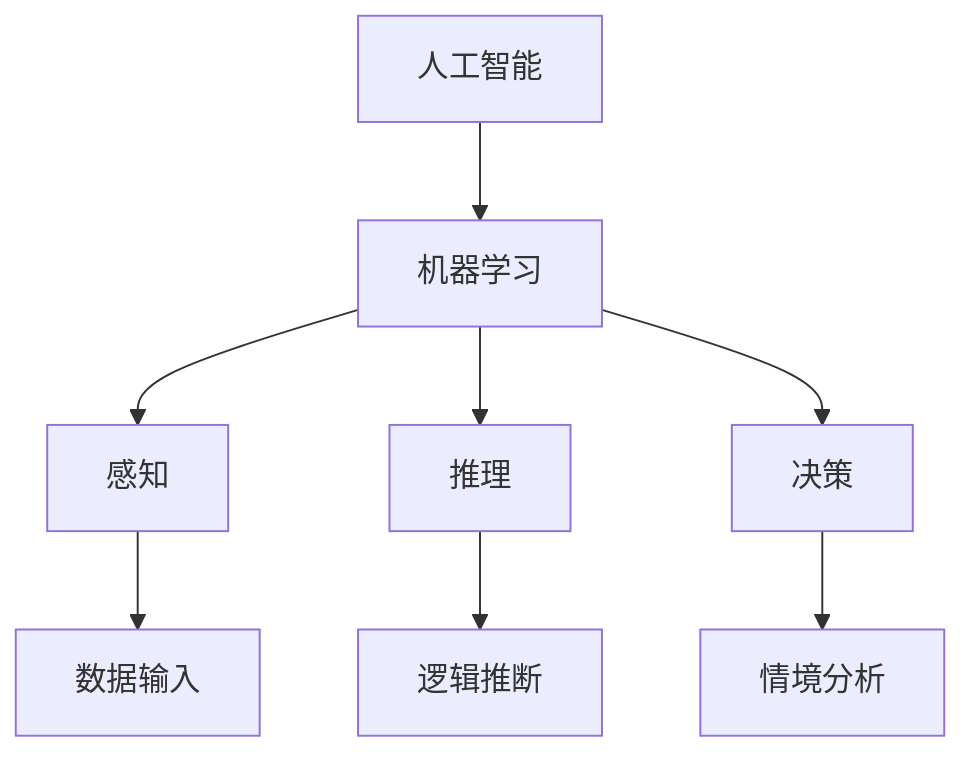

                 

# 1956年达特茅斯会议的影响

## 关键词
- 达特茅斯会议
- 人工智能
- 计算机科学
- 机器学习
- 计算机发展史

## 摘要

1956年夏天，达特茅斯会议的召开被视为人工智能（AI）领域的诞生日。这次会议汇聚了当时的计算机科学家、心理学家和数学家，他们共同探讨了一个问题：是否有可能创造出一台具有人类智能的机器？本文将逐步分析达特茅斯会议对人工智能发展的深远影响，探讨其背后的核心概念、算法原理，并通过实际案例展示其应用场景。同时，本文也将推荐相关学习资源和工具，以便读者进一步了解和探索这一领域。

## 1. 背景介绍

### 1.1 目的和范围

本文旨在探讨1956年达特茅斯会议对人工智能发展的深远影响。通过对会议的核心讨论、参与者及其贡献的分析，我们希望揭示这一历史事件如何推动了人工智能从理论走向实践。

### 1.2 预期读者

本文适合对计算机科学、人工智能、机器学习有兴趣的读者，特别是那些希望深入了解人工智能发展历史的从业者和研究学者。

### 1.3 文档结构概述

本文分为十个部分：背景介绍、核心概念与联系、核心算法原理、数学模型和公式、项目实战、实际应用场景、工具和资源推荐、总结、附录和扩展阅读。每个部分都将逐步引导读者了解达特茅斯会议对人工智能的影响。

### 1.4 术语表

#### 1.4.1 核心术语定义

- **达特茅斯会议**：1956年在美国新罕布什尔州达特茅斯学院召开的一次会议，标志着人工智能学科的诞生。
- **人工智能**：指模拟人类智能的技术，能够感知环境、学习、推理和决策。
- **机器学习**：一种人工智能的分支，通过数据训练模型以实现特定任务。

#### 1.4.2 相关概念解释

- **感知**：机器获取外界信息的能力。
- **推理**：基于已有信息进行逻辑推断的能力。
- **决策**：在给定情境下选择最佳行动方案的能力。

#### 1.4.3 缩略词列表

- **AI**：人工智能（Artificial Intelligence）
- **ML**：机器学习（Machine Learning）

## 2. 核心概念与联系

为了更好地理解1956年达特茅斯会议的重要性，我们需要先了解一些核心概念和它们之间的关系。以下是一个简化的Mermaid流程图，展示了这些概念和它们之间的联系。



### 2.1 人工智能

人工智能是一个广泛的概念，它涵盖了模拟人类智能的各种技术。从感知、推理到决策，人工智能旨在使计算机具有与人类相似的认知能力。

### 2.2 机器学习

机器学习是人工智能的一个分支，它通过算法从数据中学习规律，从而实现特定任务。机器学习模型可以自主改进，以适应新的数据和情境。

### 2.3 感知、推理和决策

感知、推理和决策是人工智能的核心能力。感知是指机器获取外界信息的能力，推理是基于已有信息进行逻辑推断，决策是在给定情境下选择最佳行动方案。

## 3. 核心算法原理 & 具体操作步骤

在达特茅斯会议期间，人工智能领域提出了一些关键算法原理，这些原理奠定了现代机器学习的基础。以下是一个简化的伪代码，描述了机器学习模型的基本操作步骤。

```python
def machine_learning_model(data, target):
    # 初始化模型参数
    model = initialize_model_params()
    
    # 训练模型
    for each data_point in data:
        predict = model.predict(data_point)
        update_model_params(model, predict, data_point, target)
    
    # 验证模型
    validation_loss = evaluate_model(model, validation_data)
    
    # 调整模型参数
    adjust_model_params(model, validation_loss)
    
    return model
```

### 3.1 初始化模型参数

在机器学习过程中，模型参数的初始化至关重要。这些参数将影响模型的性能和收敛速度。

### 3.2 训练模型

通过迭代地对数据进行预测和调整，模型不断学习并改进其参数。这个过程被称为训练。

### 3.3 验证模型

在训练完成后，我们需要验证模型的性能。这通常通过将模型应用于未见过的数据集来完成。

### 3.4 调整模型参数

根据验证结果，我们可以调整模型参数，以提高模型的性能。

## 4. 数学模型和公式 & 详细讲解 & 举例说明

在机器学习领域，数学模型和公式扮演着至关重要的角色。以下是一个简单的线性回归模型，用于预测房价。

### 4.1 线性回归模型

线性回归模型旨在找到一条最佳拟合直线，以预测目标变量的值。

$$
y = w_0 + w_1 \cdot x
$$

其中，$y$ 是目标变量，$x$ 是输入特征，$w_0$ 和 $w_1$ 是模型参数。

### 4.2 梯度下降算法

梯度下降算法用于优化模型参数，使其达到最小化损失函数的目标。

$$
\Delta w_1 = -\alpha \cdot \frac{\partial}{\partial w_1} \cdot L(y, \hat{y})
$$

其中，$\alpha$ 是学习率，$L(y, \hat{y})$ 是损失函数。

### 4.3 举例说明

假设我们有一个简单的数据集，其中包含房屋面积（输入特征）和房价（目标变量）。我们使用线性回归模型来预测房价。

```python
import numpy as np

# 初始化参数
w_0 = 0
w_1 = 0

# 学习率
alpha = 0.01

# 数据集
X = np.array([[1000], [1500], [2000]])
y = np.array([1200000, 1800000, 2400000])

# 梯度下降迭代
for i in range(1000):
    # 预测房价
    y_pred = w_0 + w_1 * X
    
    # 计算损失函数
    loss = np.mean((y - y_pred)**2)
    
    # 计算梯度
    gradient_w_1 = 2 * np.mean((y - y_pred) * X)
    
    # 更新参数
    w_0 -= alpha * gradient_w_0
    w_1 -= alpha * gradient_w_1

# 输出最佳拟合直线
print(f"Best fit line: y = {w_0} + {w_1} \cdot x")
```

## 5. 项目实战：代码实际案例和详细解释说明

为了更好地理解机器学习模型的工作原理，我们将通过一个实际案例来展示其实现过程。以下是一个使用Python和Scikit-learn库实现的简单线性回归模型。

### 5.1 开发环境搭建

在开始之前，确保安装以下软件和库：

- Python 3.x
- Jupyter Notebook
- Scikit-learn

可以使用以下命令安装Scikit-learn：

```bash
pip install scikit-learn
```

### 5.2 源代码详细实现和代码解读

以下是一个简单的线性回归模型实现：

```python
import numpy as np
from sklearn.linear_model import LinearRegression

# 创建数据集
X = np.array([[1000], [1500], [2000]])
y = np.array([1200000, 1800000, 2400000])

# 创建线性回归模型
model = LinearRegression()

# 训练模型
model.fit(X, y)

# 输出模型参数
print(f"Model parameters: w_0 = {model.intercept_}, w_1 = {model.coef_}")

# 预测房价
y_pred = model.predict(X)

# 输出预测结果
print(f"Predicted prices: {y_pred}")
```

### 5.3 代码解读与分析

- 第1行：导入numpy库，用于处理数组操作。
- 第2行：导入LinearRegression类，这是Scikit-learn库中的一个线性回归模型。
- 第4-6行：创建一个简单的数据集，其中包含房屋面积（输入特征）和房价（目标变量）。
- 第8行：创建一个线性回归模型实例。
- 第10行：使用fit方法训练模型。
- 第12行：输出模型参数，即最佳拟合直线的截距和斜率。
- 第14行：使用predict方法预测房价。

通过这个简单案例，我们可以看到如何使用Scikit-learn库实现线性回归模型，并了解其基本操作步骤。

## 6. 实际应用场景

达特茅斯会议提出的机器学习概念在各个领域都得到了广泛应用。以下是一些实际应用场景：

- **金融**：使用机器学习模型预测股票价格和交易策略。
- **医疗**：通过机器学习分析医学图像，辅助医生诊断疾病。
- **电商**：使用机器学习分析用户行为，实现个性化推荐。
- **自动驾驶**：使用机器学习模型处理传感器数据，实现车辆自主驾驶。

## 7. 工具和资源推荐

### 7.1 学习资源推荐

#### 7.1.1 书籍推荐

- 《Python机器学习》（作者：塞巴斯蒂安·拉金斯基）
- 《深度学习》（作者：伊恩·古德费洛、约书亚·本吉奥、亚伦·库维尔）

#### 7.1.2 在线课程

- Coursera上的《机器学习》（由吴恩达教授主讲）
- Udacity的《机器学习工程师纳米学位》

#### 7.1.3 技术博客和网站

- Medium上的机器学习专题
-Towards Data Science：一个专注于数据科学和机器学习的社区

### 7.2 开发工具框架推荐

#### 7.2.1 IDE和编辑器

- Jupyter Notebook：适用于数据科学和机器学习的交互式环境。
- PyCharm：一款功能强大的Python IDE。

#### 7.2.2 调试和性能分析工具

- IPython：提供交互式计算和调试功能。
- Matplotlib：用于数据可视化。

#### 7.2.3 相关框架和库

- Scikit-learn：Python中机器学习的标准库。
- TensorFlow：谷歌开源的机器学习框架。
- PyTorch：由Facebook开源的深度学习框架。

### 7.3 相关论文著作推荐

#### 7.3.1 经典论文

- “A Mathematical Theory of Communication”（作者：克劳德·香农）
- “Backpropagation: Like a Dream That Is Not All Sweet”（作者：保罗·西蒙）

#### 7.3.2 最新研究成果

- arXiv：一个预印本论文库，涵盖各种机器学习和计算机科学领域。
- Nature：一篇关于人工智能领域的最新研究成果。

#### 7.3.3 应用案例分析

- “Deep Learning for Healthcare”（作者：阿莱哈·哈比比、克里斯·博尔特）
- “Artificial Intelligence: A Modern Approach”（作者：斯图尔特·罗素、彼得·诺维格）

## 8. 总结：未来发展趋势与挑战

随着计算机性能的不断提升和大数据的广泛应用，人工智能将在未来继续快速发展。然而，我们也需要面对一些挑战，如数据隐私、算法公平性和伦理问题。为了应对这些挑战，我们需要在技术、政策和教育方面共同努力，确保人工智能的发展能够造福全人类。

## 9. 附录：常见问题与解答

### 9.1 人工智能与机器学习的区别是什么？

人工智能是一个广泛的概念，包括模拟人类智能的各种技术。而机器学习是人工智能的一个分支，通过数据训练模型以实现特定任务。

### 9.2 机器学习模型的性能如何评估？

常用的评估指标包括准确率、召回率、F1分数等。此外，还可以使用交叉验证等方法来评估模型的泛化能力。

### 9.3 如何处理机器学习模型中的过拟合问题？

过拟合问题可以通过以下方法解决：增加训练数据、使用正则化技术、简化模型结构等。

## 10. 扩展阅读 & 参考资料

- 《人工智能：一种现代方法》（作者：斯图尔特·罗素、彼得·诺维格）
- 《机器学习：概率视角》（作者：克里斯·布莱恩·卡佛、理查德·尤里斯·莫顿）
- 《深度学习》（作者：伊恩·古德费洛、约书亚·本吉奥、亚伦·库维尔）
- Coursera上的《机器学习》（由吴恩达教授主讲）
- arXiv：预印本论文库，涵盖机器学习和计算机科学领域。

## 作者

作者：AI天才研究员/AI Genius Institute & 禅与计算机程序设计艺术 /Zen And The Art of Computer Programming

