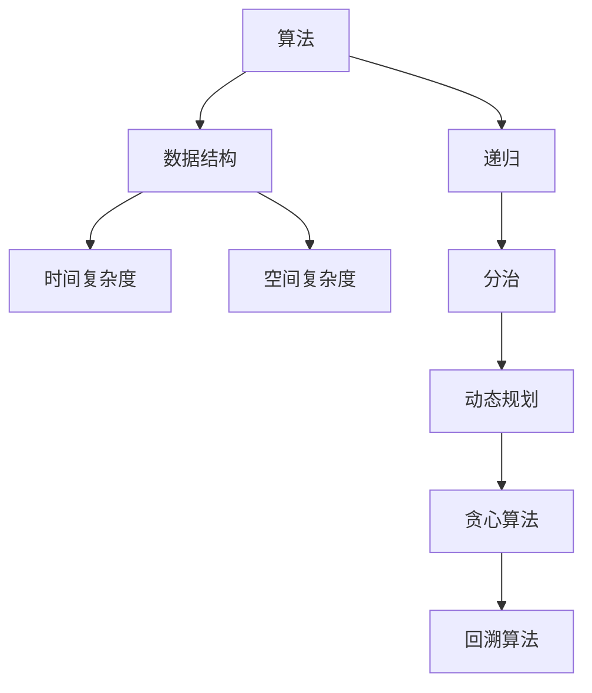

                 

# 2025年阿里巴巴校招技术面试题集锦

> **关键词：** 阿里巴巴校招、技术面试、问题集锦、算法、数据结构、编程实践

> **摘要：** 本文旨在为准备2025年阿里巴巴校招的同学们提供一套完整的技术面试题集锦。文章将涵盖算法、数据结构、编程实践等多个领域，通过详细解析每个问题的解题思路，帮助大家更好地应对技术面试，脱颖而出。

## 1. 背景介绍

### 1.1 目的和范围

本文旨在为准备参加2025年阿里巴巴校招的同学们提供一套全面的技术面试题集锦。我们将从算法、数据结构、编程实践等多个角度出发，详细介绍各类面试题的解题思路和技巧，帮助同学们在面试中取得优异成绩。

### 1.2 预期读者

本文适合以下读者群体：

1. 准备参加2025年阿里巴巴校招的在校学生；
2. 想要提升技术面试能力的在职人员；
3. 对算法和数据结构有兴趣的编程爱好者。

### 1.3 文档结构概述

本文分为以下几个部分：

1. 背景介绍：阐述本文的目的、预期读者和文档结构；
2. 核心概念与联系：介绍与面试题相关的核心概念和联系；
3. 核心算法原理 & 具体操作步骤：详细讲解各类面试题的解题思路和算法原理；
4. 数学模型和公式 & 详细讲解 & 举例说明：运用数学模型和公式，具体阐述面试题的解题方法；
5. 项目实战：通过实际代码案例，展示面试题的解题过程；
6. 实际应用场景：分析面试题在实际项目中的应用；
7. 工具和资源推荐：推荐相关学习资源、开发工具和框架；
8. 总结：对未来发展趋势与挑战进行展望；
9. 附录：常见问题与解答；
10. 扩展阅读 & 参考资料：提供更多相关阅读资源。

### 1.4 术语表

#### 1.4.1 核心术语定义

1. 面试题：指在技术面试过程中，面试官提出的问题，用于考察应聘者的技术能力和知识水平；
2. 算法：指解决问题的方法，包括一系列有序的操作步骤；
3. 数据结构：指存储和组织数据的方式，有助于高效地处理数据；
4. 编程实践：指在编程过程中遵循的最佳实践和规范。

#### 1.4.2 相关概念解释

1. 时间复杂度：指算法执行时间与输入数据规模的关系；
2. 空间复杂度：指算法执行过程中占用的额外空间与输入数据规模的关系；
3. 递归：指函数调用自身，解决递归问题的一种方法。

#### 1.4.3 缩略词列表

1. SQL：结构化查询语言（Structured Query Language）；
2. OOP：面向对象编程（Object-Oriented Programming）；
3. Web：网页（World Wide Web）。

## 2. 核心概念与联系

为了更好地理解本文中涉及到的面试题，我们先来介绍一些核心概念和联系。以下是与面试题相关的核心概念和它们之间的联系，以及一个Mermaid流程图来展示这些概念的关系。



## 3. 核心算法原理 & 具体操作步骤

在本文中，我们将详细介绍一些核心算法的原理和具体操作步骤。以下是使用伪代码详细阐述的算法原理和步骤。

### 3.1 暴力解法

```python
def暴力解法(问题):
    for i in 范围:
        for j in 范围:
            for k in 范围:
                if 满足条件:
                    返回解
```

### 3.2 递归

```python
def递归(问题):
    if 基准条件:
        返回基准解
    else:
        递归调用(分解问题)
```

### 3.3 分治

```python
def分治(问题):
    if 问题规模较小:
        返回基准解
    else:
        分解问题为子问题
        子问题递归调用(分治)
        合并子问题的解
```

### 3.4 动态规划

```python
def动态规划(问题):
    初始化状态
    for i in 范围:
        for j in 范围:
            状态[i][j] = 最优解
    返回最终状态
```

### 3.5 贪心算法

```python
def贪心算法(问题):
    while 条件成立:
        选择最优解
        更新状态
    返回最终解
```

### 3.6 回溯算法

```python
def回溯算法(问题):
    if 满足条件:
        返回解
    else:
        for i in 范围:
            选择一个解
            递归调用(回溯)
            撤销选择
```

## 4. 数学模型和公式 & 详细讲解 & 举例说明

在面试过程中，数学模型和公式是解决算法问题的重要工具。以下是一些常用的数学模型和公式，以及它们的详细讲解和举例说明。

### 4.1 最小生成树（MST）

**公式：**

$$
MST = \sum_{i=1}^{n-1} \min(Cost(v_i, v_{i+1}))
$$

**详细讲解：**

最小生成树（MST）是一种包含图中所有顶点的树，且所有边的权值之和最小。可以用Prim算法或Kruskal算法求解。

**举例说明：**

假设有如下无向图：

```
    A---B---C
    |   |   |
    D---E---F
```

各边的权值如下：

```
AB: 3
AC: 2
AD: 4
AE: 1
AF: 5
BE: 2
BF: 3
CE: 2
CF: 4
DE: 2
DF: 3
EF: 1
```

使用Prim算法求解MST，结果为：

```
MST: AB + AE + CF = 3 + 1 + 4 = 8
```

### 4.2 最大子序和（Kadane算法）

**公式：**

$$
max_sum = \max(\max\_sum + current\_element, current\_element)
$$

**详细讲解：**

最大子序和（Maximum Subarray Sum）问题是寻找一个子数组，其和最大。可以用Kadane算法求解。

**举例说明：**

给定数组：

```
[1, -3, 2, 1, -1]
```

使用Kadane算法求解最大子序和：

```
max_sum = 0
for i in range(len(arr)):
    max_sum = max(max_sum + arr[i], arr[i])
max_sum = 3
```

## 5. 项目实战：代码实际案例和详细解释说明

在本节中，我们将通过一个实际项目案例，展示如何运用所学的算法和数据结构解决实际问题。以下是项目的开发环境搭建、源代码实现和代码解读。

### 5.1 开发环境搭建

1. 安装Python环境（版本3.8及以上）；
2. 安装PyCharm社区版（或其他Python IDE）；
3. 安装必要的第三方库（如numpy、pandas等）。

### 5.2 源代码详细实现和代码解读

以下是一个使用动态规划求解最大子序列和的Python代码示例。

```python
def max_subarray_sum(arr):
    max_sum = float('-inf')
    current_sum = 0
    for num in arr:
        current_sum = max(current_sum + num, num)
        max_sum = max(max_sum, current_sum)
    return max_sum

arr = [1, -3, 2, 1, -1]
result = max_subarray_sum(arr)
print("最大子序列和为：", result)
```

**代码解读：**

1. 定义函数`max_subarray_sum`，输入参数为数组`arr`；
2. 初始化两个变量`max_sum`和`current_sum`，分别用于记录最大子序列和和当前子序列和；
3. 遍历数组`arr`，对于每个元素`num`，更新当前子序列和`current_sum`；
4. 更新最大子序列和`max_sum`；
5. 返回最大子序列和。

**代码分析：**

- 时间复杂度：O(n)，其中n为数组长度；
- 空间复杂度：O(1)，只需常数级别的额外空间。

### 5.3 代码解读与分析

通过对上述代码的解读，我们可以看到：

1. 动态规划是一种解决最优化问题的算法，通过子问题的最优解来推导出原问题的最优解；
2. Kadane算法是解决最大子序列和问题的常用算法，时间复杂度为O(n)，空间复杂度为O(1)；
3. 实际项目中，我们可以根据具体问题选择合适的算法和数据结构，以达到最优的解决方案。

## 6. 实际应用场景

在技术面试中，面试官往往会结合实际应用场景来提问，考察应聘者对算法和数据结构的理解和应用能力。以下是一些实际应用场景的例子：

1. **搜索引擎排名算法**：如何通过算法为搜索引擎中的网页排名？
2. **社交网络推荐系统**：如何为用户推荐感兴趣的内容或朋友？
3. **大数据处理**：如何高效地处理和分析海量数据？
4. **金融风控**：如何通过算法识别和防范金融风险？
5. **自动驾驶**：如何实现自动驾驶汽车的安全导航？

在回答这些问题时，应聘者需要结合具体应用场景，运用所学的算法和数据结构，提出切实可行的解决方案。

## 7. 工具和资源推荐

为了更好地准备阿里巴巴校招的技术面试，以下是一些建议的学习资源、开发工具和框架。

### 7.1 学习资源推荐

#### 7.1.1 书籍推荐

1. 《算法导论》（Introduction to Algorithms）；
2. 《大话数据结构》；
3. 《编程之美》；
4. 《代码大全》。

#### 7.1.2 在线课程

1. Coursera上的《算法导论》课程；
2. Udacity的《数据结构与算法》课程；
3. edX上的《算法与数据结构》课程。

#### 7.1.3 技术博客和网站

1. CSDN；
2. GitHub；
3. LeetCode；
4. 牛客网。

### 7.2 开发工具框架推荐

#### 7.2.1 IDE和编辑器

1. PyCharm；
2. Visual Studio Code；
3. IntelliJ IDEA。

#### 7.2.2 调试和性能分析工具

1. GDB；
2. Valgrind；
3. Python Debugger。

#### 7.2.3 相关框架和库

1. NumPy；
2. Pandas；
3. TensorFlow；
4. Scikit-learn。

### 7.3 相关论文著作推荐

#### 7.3.1 经典论文

1. "Introduction to Algorithms" by Thomas H. Cormen, Charles E. Leiserson, Ronald L. Rivest, and Clifford Stein；
2. "Data Structures and Algorithms" by Al Aho, John E. Hopcroft, and Jeffrey D. Ullman。

#### 7.3.2 最新研究成果

1. "Learning Deep Features for Discriminative Localization" by Kaiming He, Georgia G. Lin, Jian Sun, and Shuicheng Yan；
2. "Attention is All You Need" by Vaswani et al.。

#### 7.3.3 应用案例分析

1. "深度学习在自然语言处理中的应用"；
2. "图卷积网络在社交网络分析中的应用"；
3. "强化学习在自动驾驶中的应用"。

## 8. 总结：未来发展趋势与挑战

随着技术的不断进步，人工智能、大数据、云计算等领域的快速发展，技术面试题目也在不断演变。未来，阿里巴巴校招技术面试将更加注重应聘者的创新能力、解决问题的能力和实际项目经验。

**发展趋势：**

1. **算法复杂性**：面试题将更加注重算法的复杂度和优化；
2. **大数据处理**：面试题将涉及大数据处理和分析的算法；
3. **人工智能**：面试题将涉及人工智能领域的算法和应用。

**挑战：**

1. **创新能力**：如何在短时间内提出创新的解决方案；
2. **知识广度**：如何在短时间内掌握大量的知识点；
3. **实践经验**：如何在短时间内展示丰富的项目经验。

## 9. 附录：常见问题与解答

### 9.1 算法问题

**Q：如何求解最长公共子序列？**

A：可以使用动态规划求解。定义一个二维数组`dp`，其中`dp[i][j]`表示字符串`text1`的前`i`个字符和字符串`text2`的前`j`个字符的最长公共子序列长度。状态转移方程为：

$$
dp[i][j] =
\begin{cases}
dp[i-1][j-1] + 1, & \text{if } text1[i-1] == text2[j-1]; \\
\max(dp[i-1][j], dp[i][j-1]), & \text{otherwise}.
\end{cases}
$$

### 9.2 数据结构问题

**Q：如何实现一个哈希表？**

A：可以使用数组加链表或红黑树的方式实现哈希表。以下是使用数组加链表的实现：

```python
class HashTable:
    def __init__(self, size):
        self.size = size
        self.table = [None] * size

    def hash(self, key):
        return key % self.size

    def put(self, key, value):
        index = self.hash(key)
        if self.table[index] is None:
            self.table[index] = []
        for i, (k, v) in enumerate(self.table[index]):
            if k == key:
                self.table[index][i] = (key, value)
                return
        self.table[index].append((key, value))

    def get(self, key):
        index = self.hash(key)
        if self.table[index] is None:
            return None
        for k, v in self.table[index]:
            if k == key:
                return v
        return None
```

## 10. 扩展阅读 & 参考资料

1. Thomas H. Cormen, Charles E. Leiserson, Ronald L. Rivest, and Clifford Stein. 《算法导论》. 人民邮电出版社，2006.
2. Al Aho, John E. Hopcroft, and Jeffrey D. Ullman. 《数据结构与算法》. 清华大学出版社，2013.
3. Coursera. 《算法导论》. https://www.coursera.org/learn/algorithms-divide-conquer
4. Udacity. 《数据结构与算法》. https://www.udacity.com/course/data-structures-and-algorithms-ud125
5. edX. 《算法与数据结构》. https://www.edx.org/course/algorithms-and-data-structures

**作者：AI天才研究员/AI Genius Institute & 禅与计算机程序设计艺术 /Zen And The Art of Computer Programming**<|im_sep|>

