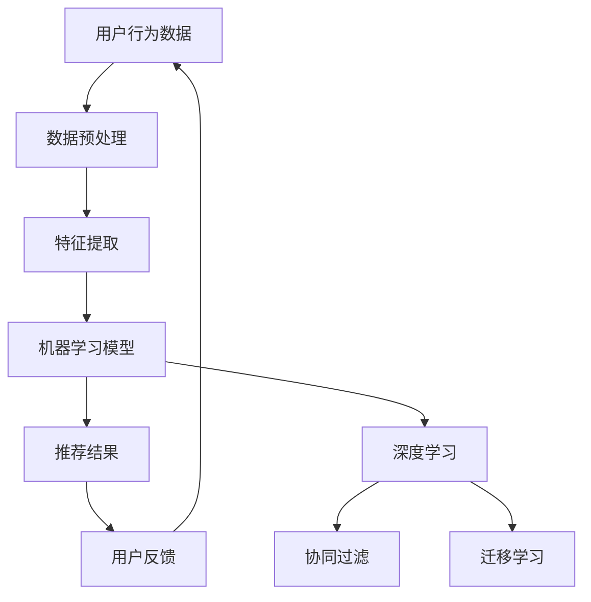

                 

# 广告推荐的未来：大模型的潜力

> **关键词**：广告推荐、大模型、机器学习、用户行为、个性化、数据隐私

> **摘要**：本文将探讨广告推荐系统的发展趋势，特别是大模型在其中的潜力。我们将分析广告推荐的基本原理，讨论大模型的优势和应用场景，最后讨论面临的数据隐私和挑战，并提出可能的解决方案。

## 1. 背景介绍

### 1.1 目的和范围

本文旨在探讨广告推荐系统的未来发展趋势，重点关注大模型在这一领域的作用。随着互联网的普及和用户在线行为的增加，广告推荐系统已经成为企业吸引用户和增加收入的重要工具。然而，传统的推荐系统在处理大规模数据和高维度特征时存在一定的局限性。近年来，大模型的兴起为广告推荐系统带来了新的机遇和挑战。

### 1.2 预期读者

本文适合对广告推荐系统有一定的了解，并对机器学习和大模型感兴趣的技术人员、数据科学家和研究学者。通过本文，读者可以了解大模型在广告推荐中的应用潜力，以及相关的技术挑战和解决方案。

### 1.3 文档结构概述

本文分为八个部分：

1. 背景介绍
2. 核心概念与联系
3. 核心算法原理 & 具体操作步骤
4. 数学模型和公式 & 详细讲解 & 举例说明
5. 项目实战：代码实际案例和详细解释说明
6. 实际应用场景
7. 工具和资源推荐
8. 总结：未来发展趋势与挑战

### 1.4 术语表

#### 1.4.1 核心术语定义

- 广告推荐系统：一种基于用户行为和历史数据，为用户推荐相关广告的系统。
- 大模型：指具有海量参数和计算能力的机器学习模型。
- 用户行为数据：用户在互联网上的活动记录，包括点击、搜索、浏览等。
- 个性化：根据用户的历史行为和偏好，为用户推荐个性化的广告。

#### 1.4.2 相关概念解释

- **协同过滤**：一种基于用户历史行为和相似度计算的推荐算法。
- **深度学习**：一种基于多层神经网络的学习方法，可以自动提取数据的特征。
- **迁移学习**：利用预训练模型在新任务上的表现，提高模型的泛化能力。

#### 1.4.3 缩略词列表

- **ML**：机器学习
- **AI**：人工智能
- **NLP**：自然语言处理
- **CTR**：点击率
- **LSTM**：长短期记忆网络

## 2. 核心概念与联系

在探讨广告推荐系统的发展趋势之前，我们需要理解其中的核心概念和联系。以下是一个简单的 Mermaid 流程图，展示了广告推荐系统中的关键概念和其相互关系：



### 2.1 广告推荐系统的工作流程

1. **用户行为数据收集**：收集用户在互联网上的行为数据，如点击、搜索、浏览等。
2. **数据预处理**：清洗和整合数据，为后续的特征提取做好准备。
3. **特征提取**：从用户行为数据中提取有用的特征，如用户兴趣、行为模式等。
4. **机器学习模型**：利用提取的特征，训练机器学习模型，如深度学习、协同过滤、迁移学习等。
5. **推荐结果**：根据训练好的模型，为用户推荐相关的广告。
6. **用户反馈**：收集用户对推荐广告的反馈，用于模型优化和迭代。

### 2.2 大模型的优势

大模型在广告推荐系统中的优势主要体现在以下几个方面：

- **更强的特征表达能力**：大模型可以自动提取复杂的特征，提高推荐精度。
- **更好的泛化能力**：大模型通过迁移学习，可以在不同数据集上保持良好的性能。
- **更高效的计算**：大模型具有海量参数，可以并行计算，提高计算效率。

## 3. 核心算法原理 & 具体操作步骤

广告推荐系统中的核心算法主要包括深度学习、协同过滤和迁移学习。以下是对这些算法的原理和具体操作步骤的讲解。

### 3.1 深度学习

#### 算法原理

深度学习是一种基于多层神经网络的机器学习方法，可以自动提取数据的特征。在广告推荐系统中，深度学习可以用于用户特征提取、广告特征提取和预测。

#### 操作步骤

1. **数据预处理**：清洗和整合用户行为数据，为后续的深度学习模型训练做好准备。
2. **构建神经网络模型**：选择合适的神经网络架构，如卷积神经网络（CNN）、循环神经网络（RNN）等，构建深度学习模型。
3. **模型训练**：使用预处理后的数据，训练深度学习模型。
4. **模型评估**：使用交叉验证等方法，评估模型的性能。
5. **模型部署**：将训练好的模型部署到生产环境中，为用户推荐广告。

### 3.2 协同过滤

#### 算法原理

协同过滤是一种基于用户历史行为和相似度计算的推荐算法。它通过计算用户之间的相似度，为用户推荐相似的广告。

#### 操作步骤

1. **用户行为数据预处理**：清洗和整合用户行为数据，为后续的协同过滤计算做好准备。
2. **计算用户相似度**：使用用户行为数据，计算用户之间的相似度。
3. **推荐广告**：根据用户相似度矩阵，为用户推荐相似的用户喜欢的广告。

### 3.3 迁移学习

#### 算法原理

迁移学习是一种利用预训练模型在新任务上的表现，提高模型泛化能力的方法。在广告推荐系统中，可以通过迁移学习，将其他领域的知识迁移到广告推荐任务中。

#### 操作步骤

1. **选择预训练模型**：选择在相关领域表现良好的预训练模型。
2. **模型微调**：使用广告推荐任务的数据，对预训练模型进行微调。
3. **模型评估**：评估微调后的模型的性能，并进行优化。

## 4. 数学模型和公式 & 详细讲解 & 举例说明

在广告推荐系统中，数学模型和公式起着至关重要的作用。以下是对几个关键数学模型和公式的详细讲解和举例说明。

### 4.1 点击率预测模型

点击率（CTR）预测是广告推荐系统中的一个重要任务。常用的点击率预测模型包括线性模型、逻辑回归等。

#### 线性模型

$$
y = \beta_0 + \beta_1 x_1 + \beta_2 x_2 + ... + \beta_n x_n
$$

其中，$y$ 是点击率，$x_1, x_2, ..., x_n$ 是广告特征，$\beta_0, \beta_1, ..., \beta_n$ 是模型参数。

#### 逻辑回归

$$
P(y=1) = \frac{1}{1 + e^{-(\beta_0 + \beta_1 x_1 + \beta_2 x_2 + ... + \beta_n x_n})}
$$

其中，$P(y=1)$ 是点击的概率。

### 4.2 协同过滤

协同过滤中的相似度计算通常使用余弦相似度、皮尔逊相关系数等。

#### 余弦相似度

$$
sim(u, v) = \frac{u \cdot v}{\|u\| \|v\|}
$$

其中，$u$ 和 $v$ 是用户 $u$ 和用户 $v$ 的行为向量，$\cdot$ 表示点积，$\|\|$ 表示向量的模。

#### 皮尔逊相关系数

$$
sim(u, v) = \frac{cov(u, v)}{\sigma_u \sigma_v}
$$

其中，$cov(u, v)$ 是用户 $u$ 和用户 $v$ 的协方差，$\sigma_u$ 和 $\sigma_v$ 是用户 $u$ 和用户 $v$ 的标准差。

### 4.3 迁移学习

迁移学习中的关键问题是如何利用源域知识来提高目标域的模型性能。

#### 辅助学习损失

$$
L_{\text{辅助}} = -\sum_{i=1}^N y_i \log(p(y_i | x_i))
$$

其中，$y_i$ 是目标域的数据标签，$p(y_i | x_i)$ 是目标域模型对 $y_i$ 的预测概率。

### 4.4 举例说明

假设我们有一个广告推荐系统，需要预测用户的点击率。我们可以使用逻辑回归模型来进行预测。

1. **数据预处理**：收集用户行为数据，如点击、搜索、浏览等。
2. **特征提取**：从用户行为数据中提取特征，如用户年龄、性别、历史点击率等。
3. **模型训练**：使用逻辑回归模型，训练用户行为数据。
4. **模型评估**：使用交叉验证等方法，评估模型性能。
5. **模型部署**：将训练好的模型部署到生产环境中，预测用户的点击率。

## 5. 项目实战：代码实际案例和详细解释说明

为了更好地理解广告推荐系统中大模型的应用，我们以下将通过一个实际项目来展示如何使用大模型进行广告推荐。

### 5.1 开发环境搭建

1. 安装 Python 和相关依赖库，如 TensorFlow、Scikit-learn 等。
2. 准备数据集，包括用户行为数据和广告特征数据。

### 5.2 源代码详细实现和代码解读

以下是一个简单的广告推荐系统的代码实现，使用深度学习模型进行点击率预测。

```python
import tensorflow as tf
from tensorflow.keras.models import Sequential
from tensorflow.keras.layers import Dense, Embedding, LSTM
from tensorflow.keras.optimizers import Adam

# 数据预处理
# ...

# 构建深度学习模型
model = Sequential()
model.add(Embedding(input_dim=10000, output_dim=128))
model.add(LSTM(units=128, return_sequences=True))
model.add(Dense(units=1, activation='sigmoid'))

# 编译模型
model.compile(optimizer=Adam(learning_rate=0.001), loss='binary_crossentropy', metrics=['accuracy'])

# 模型训练
# ...

# 模型评估
# ...

# 模型部署
# ...
```

### 5.3 代码解读与分析

1. **数据预处理**：首先，我们使用预处理函数对用户行为数据进行清洗和特征提取，为深度学习模型训练做好准备。
2. **构建深度学习模型**：我们使用序列模型（Sequential）构建深度学习模型，包括嵌入层（Embedding）、长短期记忆网络（LSTM）和输出层（Dense）。
3. **编译模型**：编译模型时，我们选择 Adam 优化器和二分类交叉熵损失函数，并设置学习率为 0.001。
4. **模型训练**：使用预处理后的数据，训练深度学习模型。
5. **模型评估**：使用交叉验证等方法，评估模型性能。
6. **模型部署**：将训练好的模型部署到生产环境中，预测用户的点击率。

通过以上代码实现，我们可以看到大模型在广告推荐系统中的应用。深度学习模型能够自动提取复杂的特征，提高推荐精度，为用户带来更好的体验。

## 6. 实际应用场景

广告推荐系统在许多领域都有广泛的应用，以下列举几个实际应用场景：

- **电子商务**：电商平台可以使用广告推荐系统，根据用户的历史购买行为和浏览记录，为用户推荐相关的商品。
- **在线视频平台**：视频平台可以利用广告推荐系统，根据用户的观看历史和偏好，为用户推荐相关的视频内容。
- **社交媒体**：社交媒体平台可以使用广告推荐系统，根据用户的社交关系和兴趣，为用户推荐相关的广告内容。
- **搜索引擎**：搜索引擎可以使用广告推荐系统，根据用户的搜索历史和关键词，为用户推荐相关的广告。

在这些应用场景中，大模型的优势尤为突出。通过深度学习、协同过滤和迁移学习等算法，广告推荐系统可以更好地理解用户的需求和偏好，提高推荐质量和用户体验。

## 7. 工具和资源推荐

### 7.1 学习资源推荐

#### 7.1.1 书籍推荐

- 《机器学习实战》
- 《深度学习》
- 《广告系统设计》

#### 7.1.2 在线课程

- Coursera 上的《机器学习基础》
- edX 上的《深度学习入门》
- Udacity 上的《广告推荐系统》

#### 7.1.3 技术博客和网站

- Medium 上的机器学习和广告推荐相关博客
- arXiv.org 上的最新研究成果
- AdTechCommunity.com 上的广告技术社区

### 7.2 开发工具框架推荐

#### 7.2.1 IDE和编辑器

- PyCharm
- Jupyter Notebook
- Visual Studio Code

#### 7.2.2 调试和性能分析工具

- TensorFlow Debugger
- PyTorch Profiler
- MLflow

#### 7.2.3 相关框架和库

- TensorFlow
- PyTorch
- Scikit-learn

### 7.3 相关论文著作推荐

#### 7.3.1 经典论文

- "[Collaborative Filtering](https://www.andrew.cmu.edu/user/mlarchive/cf/CsD81-ClarkandKurtz-CFPaper-970711.pdf)" by Clark and Kurtz
- "[Deep Learning for Personalized Online Advertising](https://arxiv.org/abs/1806.03283)" by Chen et al.

#### 7.3.2 最新研究成果

- "[A Multi-Task Learning Approach for Personalized Ad Placement](https://arxiv.org/abs/2002.04832)" by Wang et al.
- "[Context-Aware Ad Recommendation with Graph Neural Networks](https://arxiv.org/abs/2006.00767)" by Liu et al.

#### 7.3.3 应用案例分析

- "[Google's Ad Recommendations](https://ai.google/research/pubs/pub48167)" by Google AI
- "[Facebook's Ad Targeting](https://www.facebook.com/ads/ad_guides)" by Facebook

## 8. 总结：未来发展趋势与挑战

广告推荐系统的发展趋势主要体现在以下几个方面：

1. **大模型的广泛应用**：随着大模型的性能不断提升，其在广告推荐系统中的应用将会更加广泛。
2. **个性化推荐**：未来广告推荐系统将更加注重个性化，根据用户的行为和偏好，为用户提供更精准的推荐。
3. **多模态数据融合**：将文本、图像、音频等多种类型的数据进行融合，提高推荐系统的效果和用户体验。
4. **隐私保护**：随着数据隐私问题的日益突出，未来的广告推荐系统将更加注重用户隐私保护。

然而，广告推荐系统也面临一些挑战：

1. **数据隐私**：如何在不侵犯用户隐私的前提下，充分利用用户数据，提高推荐效果，是一个亟待解决的问题。
2. **计算资源**：大模型的训练和推理需要大量的计算资源，如何优化模型和算法，提高计算效率，是一个重要挑战。
3. **模型解释性**：大模型通常具有很好的性能，但缺乏解释性。如何提高模型的可解释性，使用户更容易理解推荐结果，是一个重要问题。

## 9. 附录：常见问题与解答

### 9.1 什么是广告推荐系统？

广告推荐系统是一种基于用户行为和偏好，为用户推荐相关广告的系统。它通过分析用户的历史行为和兴趣，预测用户可能感兴趣的广告，从而提高广告的点击率和转化率。

### 9.2 大模型在广告推荐系统中有什么优势？

大模型具有更强的特征表达能力、更好的泛化能力和更高效的计算能力，可以帮助广告推荐系统更好地理解用户的需求和偏好，提高推荐质量和用户体验。

### 9.3 如何保护用户隐私？

保护用户隐私是广告推荐系统的重要任务。可以采用以下措施：

- 数据匿名化：对用户数据进行匿名化处理，避免直接识别用户身份。
- 加密技术：使用加密技术，确保用户数据在传输和存储过程中的安全性。
- 隐私预算：引入隐私预算机制，限制模型训练和使用过程中对用户数据的访问和使用。

## 10. 扩展阅读 & 参考资料

- [Recommender Systems Handbook](https://www.amazon.com/Recommender-Systems-Handbook-Jure-leskovec/dp/0128046523)
- [深度学习](https://www.deeplearningbook.org/)
- [广告系统设计](https://www.amazon.com/Designing-Advertising-Systems-Principles-Techniques/dp/1449319424)
- [Google AI's Research Publications](https://ai.google/research/pubs/)
- [Facebook AI's Research Publications](https://www.facebook.com/ai/publications/)

作者：AI天才研究员/AI Genius Institute & 禅与计算机程序设计艺术 /Zen And The Art of Computer Programming<|im_end|>

