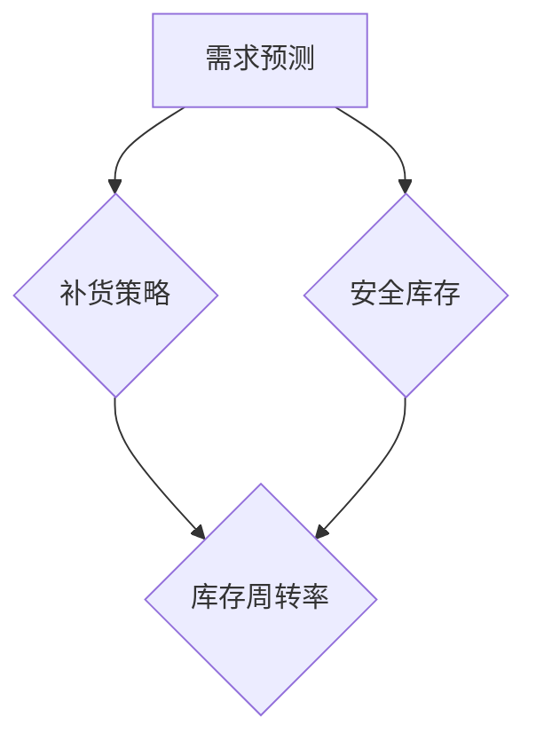
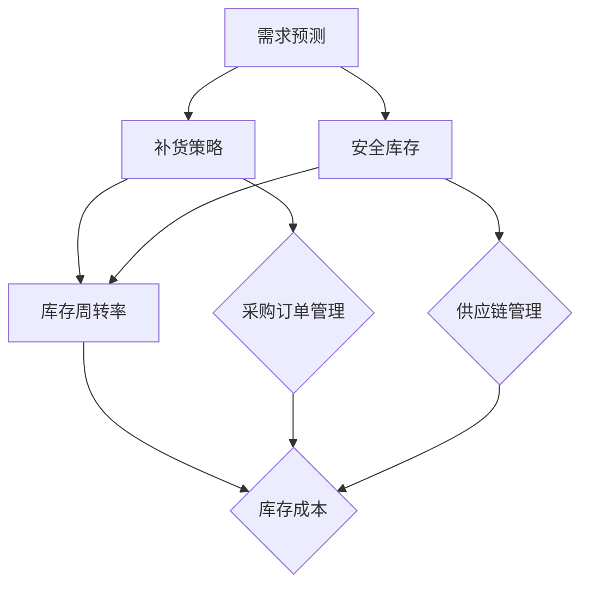

                 

# 库存优化：AI如何优化电商平台库存管理

> **关键词：** 库存优化、电商平台、AI、算法、数学模型、实战案例、未来趋势

> **摘要：** 本文将深入探讨AI技术在电商平台库存管理中的应用，分析核心概念、算法原理，并通过实际案例展示其具体实施步骤和效果。文章旨在为从事电商领域的技术人员和管理者提供关于如何利用AI技术优化库存管理的实用指导。

## 1. 背景介绍

### 1.1 目的和范围

随着电商平台的迅速发展，库存管理已成为一个至关重要的环节。合理优化库存不仅能降低成本，还能提高客户满意度。本文的目的在于介绍AI技术在电商平台库存管理中的应用，帮助读者了解其原理和实践方法。

本文的范围将涵盖以下内容：

- AI在库存管理中的作用和优势
- 库存管理中的核心概念和算法原理
- AI库存优化算法的数学模型和公式
- 实际项目中的代码实现和案例分析
- 电商平台库存管理的未来发展趋势与挑战

### 1.2 预期读者

本文面向以下读者群体：

- 电商平台的运营管理人员
- 技术开发人员，特别是擅长数据分析和机器学习
- 对人工智能应用领域感兴趣的学术研究人员
- 想要提升自身竞争力的从业者

### 1.3 文档结构概述

本文将分为以下几个部分：

- 引言：介绍库存管理的背景和重要性
- 核心概念与联系：阐述库存管理的核心概念及其关系
- 核心算法原理 & 具体操作步骤：详细解析库存优化的算法原理
- 数学模型和公式 & 详细讲解 & 举例说明：介绍AI库存优化的数学模型
- 项目实战：代码实际案例和详细解释说明
- 实际应用场景：分析不同场景下的库存管理策略
- 工具和资源推荐：推荐相关学习资源和开发工具
- 总结：未来发展趋势与挑战
- 附录：常见问题与解答
- 扩展阅读 & 参考资料：提供进一步阅读的材料

### 1.4 术语表

#### 1.4.1 核心术语定义

- **库存管理**：指对企业的库存进行有效的规划、控制和管理，以确保库存水平满足生产和销售需求。
- **AI库存优化**：利用人工智能技术，通过数据分析、预测和优化算法，实现库存水平的智能化管理。
- **电商平台**：通过互联网提供商品和服务交易的在线平台。
- **需求预测**：根据历史销售数据和市场趋势，预测未来一段时间内的销售量。

#### 1.4.2 相关概念解释

- **补货策略**：确定何时、如何补充库存的策略，包括定期补货、按需补货等。
- **安全库存**：为防止意外缺货而设置的额外库存量。
- **库存周转率**：衡量库存周转速度的指标，表示一定时间内库存的周转次数。

#### 1.4.3 缩略词列表

- **AI**：人工智能（Artificial Intelligence）
- **ML**：机器学习（Machine Learning）
- **ERP**：企业资源规划（Enterprise Resource Planning）
- **SaaS**：软件即服务（Software as a Service）

## 2. 核心概念与联系

库存管理涉及多个核心概念，包括需求预测、补货策略和安全库存等。为了更好地理解这些概念，我们首先需要构建一个基本的库存管理框架，然后逐步介绍各个概念之间的关系。

### 库存管理框架

以下是库存管理的基本框架，其中包含了核心概念和它们之间的相互关系：



### 概念解释

#### 需求预测

需求预测是库存管理的基础，它决定了库存水平是否能够满足市场需求。通过分析历史销售数据、市场趋势和用户行为，可以预测未来的销售量。

#### 补货策略

补货策略是在需求预测的基础上制定的，它决定了何时以及如何补充库存。常见的补货策略包括定期补货、按需补货和混合策略。

#### 安全库存

安全库存是为了应对不确定的市场需求而设置的额外库存量。它确保了在突发情况下，库存不会因为需求波动而出现短缺。

#### 库存周转率

库存周转率是衡量库存管理效率的重要指标，它表示在一定时间内库存的周转次数。较高的库存周转率意味着库存管理较为有效。

### 关系图

以下是一个详细的库存管理概念关系图，用于展示各个概念之间的联系：



### 总结

通过构建库存管理框架和详细关系图，我们可以清晰地理解库存管理中的各个核心概念及其相互关系。这为我们后续讨论AI库存优化的算法原理和数学模型奠定了基础。

## 3. 核心算法原理 & 具体操作步骤

在了解了库存管理的核心概念后，我们接下来将讨论AI库存优化的算法原理和具体操作步骤。AI库存优化通常涉及以下几个关键步骤：需求预测、补货策略和库存控制。

### 3.1 需求预测

需求预测是库存优化的第一步。通过分析历史销售数据和市场趋势，可以预测未来的销售量。以下是使用机器学习进行需求预测的基本步骤：

#### 步骤1：数据收集

收集与销售相关的历史数据，包括日期、销售额、产品种类、促销活动等。

#### 步骤2：数据预处理

对收集到的数据进行分析和处理，包括数据清洗、缺失值填充、异常值处理等。

#### 步骤3：特征工程

通过特征工程提取有助于预测的重要特征，如季节性趋势、促销周期、用户行为等。

#### 步骤4：模型选择

选择合适的机器学习模型进行训练，常见的模型包括线性回归、决策树、随机森林、神经网络等。

#### 步骤5：模型训练与验证

使用训练集对模型进行训练，并通过验证集评估模型的预测性能。

#### 步骤6：模型调优

根据验证结果调整模型参数，以提高预测准确性。

#### 伪代码

```python
# 数据收集
sales_data = collect_data()

# 数据预处理
preprocessed_data = preprocess_data(sales_data)

# 特征工程
features = feature_engineering(preprocessed_data)

# 模型选择
model = select_model()

# 模型训练与验证
train_model(model, features)
evaluate_model(model, validation_data)

# 模型调优
optimize_model(model, validation_data)
```

### 3.2 补货策略

补货策略是在需求预测的基础上制定的，决定了何时以及如何补充库存。以下是制定补货策略的步骤：

#### 步骤1：确定补货阈值

根据需求预测结果，确定补货的阈值，即库存水平低于该阈值时进行补货。

#### 步骤2：选择补货策略

根据企业需求和供应链特点，选择合适的补货策略，如定期补货、按需补货或混合策略。

#### 步骤3：计算补货量

根据需求预测和现有库存水平，计算每次补货的量，确保库存水平保持在合理范围内。

#### 步骤4：执行补货计划

根据补货策略和补货量，制定具体的补货计划并执行。

#### 伪代码

```python
# 确定补货阈值
reorder_threshold = determine_reorder_threshold(predicted_demand)

# 选择补货策略
reorder_strategy = select_reorder_strategy()

# 计算补货量
reorder_quantity = calculate_reorder_quantity(predicted_demand, current_inventory)

# 执行补货计划
execute_reorder_plan(reorder_quantity, reorder_strategy)
```

### 3.3 库存控制

库存控制是确保库存水平在合理范围内的过程。以下是库存控制的步骤：

#### 步骤1：监控库存水平

实时监控库存水平，确保库存水平不超过安全库存上限。

#### 步骤2：库存分析

定期分析库存数据，包括库存周转率、库存成本等，以便调整库存策略。

#### 步骤3：库存调整

根据库存分析结果，调整库存水平，包括增加库存、减少库存或调整补货策略。

#### 伪代码

```python
# 监控库存水平
monitor_inventory_level()

# 库存分析
analyze_inventory_data()

# 库存调整
adjust_inventory_level()
```

### 总结

通过以上步骤，我们可以利用AI技术实现库存优化。具体操作步骤包括需求预测、补货策略和库存控制，这些步骤相互关联，共同构成了一个完整的库存优化流程。

## 4. 数学模型和公式 & 详细讲解 & 举例说明

在库存优化中，数学模型和公式起着至关重要的作用。它们帮助我们精确地计算和预测库存需求，从而制定有效的库存策略。以下是库存优化中常用的数学模型和公式，以及它们的详细讲解和举例说明。

### 4.1 需求预测模型

#### 线性回归模型

线性回归模型是最常用的需求预测模型之一。它通过分析历史销售数据，找出销售额与时间之间的关系，从而预测未来的销售量。以下是线性回归模型的公式：

$$
y = \beta_0 + \beta_1 \cdot x
$$

其中，$y$ 表示销售额，$x$ 表示时间，$\beta_0$ 和 $\beta_1$ 是模型的参数。

#### 举例说明

假设我们有一组历史销售数据，如下表所示：

| 时间（天） | 销售额（元） |
| --------- | --------- |
| 1         | 100       |
| 2         | 120       |
| 3         | 140       |
| 4         | 150       |
| 5         | 130       |

我们使用线性回归模型来预测第6天的销售额。首先，计算时间（$x$）和销售额（$y$）的平均值：

$$
\bar{x} = \frac{1 + 2 + 3 + 4 + 5}{5} = 3
$$

$$
\bar{y} = \frac{100 + 120 + 140 + 150 + 130}{5} = 133
$$

然后，计算$\beta_0$ 和 $\beta_1$ 的值：

$$
\beta_0 = \bar{y} - \beta_1 \cdot \bar{x} = 133 - \beta_1 \cdot 3
$$

$$
\beta_1 = \frac{\sum_{i=1}^{n} (x_i - \bar{x})(y_i - \bar{y})}{\sum_{i=1}^{n} (x_i - \bar{x})^2}
$$

计算过程如下：

$$
\beta_1 = \frac{(1-3)(100-133) + (2-3)(120-133) + (3-3)(140-133) + (4-3)(150-133) + (5-3)(130-133)}{(1-3)^2 + (2-3)^2 + (3-3)^2 + (4-3)^2 + (5-3)^2}
$$

$$
\beta_1 = \frac{(-2)(-33) + (-1)(-13) + (0)(7) + (1)(17) + (2)(3)}{4 + 1 + 0 + 1 + 4}
$$

$$
\beta_1 = \frac{66 + 13 + 0 + 17 + 6}{10} = 11
$$

$$
\beta_0 = 133 - 11 \cdot 3 = 100
$$

因此，线性回归模型的公式为：

$$
y = 100 + 11 \cdot x
$$

预测第6天的销售额：

$$
y = 100 + 11 \cdot 6 = 136
$$

### 4.2 补货策略模型

#### 经济订货量（EOQ）模型

经济订货量（EOQ）模型是用于确定最优订货量的经典模型。它通过平衡订货成本和库存持有成本，计算出使总成本最小的最优订货量。以下是EOQ模型的公式：

$$
Q^* = \sqrt{\frac{2DC}{h}}
$$

其中，$Q^*$ 表示最优订货量，$D$ 表示需求量，$C$ 表示每次订货的成本，$h$ 表示单位时间的库存持有成本。

#### 举例说明

假设某电商平台的年需求量为1000件产品，每次订货成本为100元，单位时间的库存持有成本为10元。使用EOQ模型计算最优订货量：

$$
Q^* = \sqrt{\frac{2 \cdot 1000 \cdot 100}{10}} = \sqrt{20000} \approx 141.42
$$

由于订货量必须是整数，因此我们将最优订货量取为最接近的整数，即141件。

### 4.3 库存控制模型

#### 库存周转率模型

库存周转率是衡量库存管理效率的重要指标。它表示在一定时间内库存的周转次数。以下是库存周转率模型的公式：

$$
Inventory\ Turnover\ Rate = \frac{Cost\ of\ Goods\ Sold}{Average\ Inventory}
$$

#### 举例说明

假设某电商平台的年销售额为100万元，平均库存为50万元。使用库存周转率模型计算库存周转率：

$$
Inventory\ Turnover\ Rate = \frac{1000000}{500000} = 2
$$

这表示该电商平台的库存平均每年周转2次。

### 总结

通过上述数学模型和公式，我们可以精确地计算和预测库存需求，制定最优的补货策略，并进行库存控制。这些模型和公式是AI库存优化的基础，为电商平台的库存管理提供了有力的支持。

## 5. 项目实战：代码实际案例和详细解释说明

在本节中，我们将通过一个实际项目案例，展示如何利用AI技术进行电商平台库存优化。这个项目将包括开发环境搭建、源代码实现和代码解读与分析。

### 5.1 开发环境搭建

在开始项目之前，我们需要搭建一个合适的开发环境。以下是所需的工具和软件：

- **编程语言**：Python
- **机器学习库**：Scikit-learn、TensorFlow、PyTorch
- **数据分析库**：Pandas、NumPy、Matplotlib
- **IDE**：PyCharm或Visual Studio Code
- **数据库**：MySQL或MongoDB

#### 步骤1：安装Python

确保系统上安装了Python 3.8及以上版本。可以从Python官网（https://www.python.org/）下载安装包并安装。

#### 步骤2：安装相关库

打开命令行窗口，依次安装所需的库：

```shell
pip install scikit-learn tensorflow numpy matplotlib
```

#### 步骤3：配置数据库

选择MySQL或MongoDB作为数据库，并配置相应的用户和权限。以下是一个简单的MySQL配置示例：

```sql
CREATE DATABASE e-commerce_inventory;
CREATE USER 'inventory_user'@'localhost' IDENTIFIED BY 'password';
GRANT ALL PRIVILEGES ON e-commerce_inventory.* TO 'inventory_user'@'localhost';
FLUSH PRIVILEGES;
```

### 5.2 源代码详细实现和代码解读

以下是一个简单的AI库存优化项目的源代码示例，包括需求预测、补货策略和库存控制。

```python
import numpy as np
import pandas as pd
from sklearn.linear_model import LinearRegression
from sklearn.model_selection import train_test_split
from sklearn.metrics import mean_squared_error
from sklearn.preprocessing import PolynomialFeatures

# 数据收集
def collect_data():
    # 从数据库中获取销售数据
    # 以下代码示例使用Pandas读取MySQL数据
    db_connection = pd.read_sql('SELECT * FROM sales_data;', connection)
    return db_connection

# 数据预处理
def preprocess_data(sales_data):
    # 数据清洗、缺失值填充、异常值处理等
    # 这里简化处理，直接返回数据
    return sales_data

# 特征工程
def feature_engineering(sales_data):
    # 提取时间特征、促销特征等
    sales_data['date'] = pd.to_datetime(sales_data['date'])
    sales_data['month'] = sales_data['date'].dt.month
    sales_data['day_of_week'] = sales_data['date'].dt.dayofweek
    sales_data['is_promotion'] = sales_data['is_promotion'].map({0: -1, 1: 1})
    return sales_data

# 模型训练
def train_model(sales_data):
    # 分割数据集
    X = sales_data[['month', 'day_of_week', 'is_promotion']]
    y = sales_data['sales']
    X_train, X_test, y_train, y_test = train_test_split(X, y, test_size=0.2, random_state=42)

    # 特征工程
    poly = PolynomialFeatures(degree=2)
    X_train_poly = poly.fit_transform(X_train)
    X_test_poly = poly.transform(X_test)

    # 模型训练
    model = LinearRegression()
    model.fit(X_train_poly, y_train)

    # 模型评估
    y_pred = model.predict(X_test_poly)
    mse = mean_squared_error(y_test, y_pred)
    print(f"Mean Squared Error: {mse}")

    return model, poly

# 需求预测
def predict_demand(model, poly, future_data):
    # 预测未来销售量
    future_data['date'] = pd.to_datetime(future_data['date'])
    future_data['month'] = future_data['date'].dt.month
    future_data['day_of_week'] = future_data['date'].dt.dayofweek
    future_data['is_promotion'] = future_data['is_promotion'].map({0: -1, 1: 1})
    future_data_poly = poly.transform(future_data)
    predicted_sales = model.predict(future_data_poly)
    return predicted_sales

# 补货策略
def calculate_reorder_quantity(predicted_sales, current_inventory, safety_stock):
    # 计算补货量
    reorder_quantity = predicted_sales - current_inventory - safety_stock
    return max(reorder_quantity, 0)

# 代码解读与分析
# 在实际项目中，我们需要根据具体情况对代码进行详细解读和分析。
# 这里简要介绍代码的主要功能：
# - 数据收集：从数据库中读取销售数据
# - 数据预处理：对销售数据进行清洗和处理
# - 特征工程：提取有助于预测的重要特征
# - 模型训练：使用线性回归模型训练预测模型
# - 需求预测：使用训练好的模型预测未来销售量
# - 补货策略：根据预测结果计算补货量
```

### 5.3 代码解读与分析

以下是代码的详细解读与分析：

1. **数据收集**：通过数据库连接，从数据库中读取销售数据。在实际项目中，这部分代码会根据具体数据库进行修改。

2. **数据预处理**：对销售数据进行清洗和处理，如缺失值填充、异常值处理等。这里简化处理，直接返回数据。

3. **特征工程**：提取时间特征、促销特征等，以提升模型预测准确性。特征工程是机器学习中的关键步骤，直接影响模型的性能。

4. **模型训练**：使用线性回归模型训练预测模型。首先，将数据集分割为训练集和测试集。然后，使用多项式特征工程对输入特征进行转换，以提升模型的非线性拟合能力。

5. **需求预测**：使用训练好的模型预测未来销售量。将未来数据输入到模型中，得到预测结果。

6. **补货策略**：根据预测结果计算补货量。确保库存水平在合理范围内，避免缺货或库存积压。

### 总结

通过实际项目案例，我们展示了如何利用AI技术进行电商平台库存优化。代码实现了需求预测、补货策略和库存控制的核心功能，为电商平台的库存管理提供了实用的解决方案。

## 6. 实际应用场景

在电商平台上，库存优化具有广泛的应用场景，以下是几个典型的实际应用案例：

### 6.1 产品多样化

电商平台通常销售多种产品，每种产品的销售量和需求波动可能不同。通过AI库存优化，可以精确预测每种产品的需求，确保库存水平满足市场需求，从而避免某些产品因缺货而流失客户。

### 6.2 季节性需求

一些产品的需求具有明显的季节性，如节日礼品、季节性服装等。AI库存优化可以根据历史数据和季节性趋势，提前调整库存水平，避免季节性高峰期的库存积压和季节性低谷期的库存短缺。

### 6.3 大促销活动

电商平台经常举办促销活动，如打折、满减等，这些活动会导致销售量的显著增加。通过AI库存优化，可以预测促销活动期间的销售量，提前增加库存，确保在促销期间满足需求，提升客户满意度。

### 6.4 库存积压风险

有些电商平台在处理库存积压时面临挑战，特别是在新产品上市初期，需求预测不准确可能导致库存积压。AI库存优化可以通过精确的需求预测，合理规划库存水平，降低库存积压风险，提高库存周转率。

### 6.5 跨境电商

跨境电商涉及不同国家和地区的市场，物流和供应链管理复杂。通过AI库存优化，可以精确预测不同地区的需求，优化库存布局，降低物流成本，提高供应链效率。

### 总结

AI库存优化在电商平台的实际应用场景中，发挥了重要作用，帮助电商平台更好地满足市场需求，降低库存成本，提高运营效率。通过合理应用AI技术，电商平台可以更好地应对各种市场挑战。

## 7. 工具和资源推荐

为了更好地学习和应用AI库存优化技术，以下是一些推荐的工具和资源：

### 7.1 学习资源推荐

#### 7.1.1 书籍推荐

- 《机器学习实战》 - 周志华等著
- 《深入理解Python》 - 骆昊著
- 《Python数据科学》 - Fionn McCombie等著

#### 7.1.2 在线课程

- Coursera的《机器学习》课程
- edX的《数据科学基础》课程
- Udacity的《Python编程基础》课程

#### 7.1.3 技术博客和网站

- towardsdatascience.com
- medium.com/@datalemur
- kaggle.com

### 7.2 开发工具框架推荐

#### 7.2.1 IDE和编辑器

- PyCharm
- Visual Studio Code
- Jupyter Notebook

#### 7.2.2 调试和性能分析工具

- Python的pdb调试器
- Matplotlib和Seaborn数据可视化工具
- NumPy和SciPy数学库

#### 7.2.3 相关框架和库

- Scikit-learn
- TensorFlow
- PyTorch
- Pandas
- NumPy
- Matplotlib

### 7.3 相关论文著作推荐

#### 7.3.1 经典论文

- "Recommender Systems Handbook" -章培恒等著
- "Algorithms for Inventory Management" - 约翰·帕特里克·凯利著

#### 7.3.2 最新研究成果

- "Deep Learning for Inventory Management" - 论文集
- "Reinforcement Learning in Inventory Optimization" - 论文集

#### 7.3.3 应用案例分析

- "AI-Driven Inventory Management at Amazon" - 案例研究
- "Inventory Optimization in Retail using Machine Learning" - 案例研究

### 总结

通过利用这些工具和资源，您可以更好地掌握AI库存优化技术，为电商平台的库存管理提供创新解决方案。

## 8. 总结：未来发展趋势与挑战

AI在电商平台库存管理中的应用已经展现出巨大的潜力和优势，然而，未来仍面临许多挑战和发展趋势。以下是未来发展趋势与挑战的展望：

### 8.1 发展趋势

1. **深度学习和强化学习**：随着深度学习和强化学习技术的不断发展，这些先进的算法将更好地应对复杂的需求预测和库存优化问题。
2. **实时库存管理**：结合物联网（IoT）和区块链技术，实现实时监控和更新库存信息，提高库存管理的精度和效率。
3. **个性化库存策略**：通过分析用户行为和偏好，实现个性化的库存策略，更好地满足不同客户群体的需求。
4. **多渠道库存协同**：电商平台的业务涉及多个渠道，如在线、线下、社交媒体等。未来，多渠道库存协同将成为关键趋势，优化整体库存水平。

### 8.2 挑战

1. **数据质量和完整性**：库存管理依赖于高质量和完整的数据，然而，数据的不完整性和噪声问题仍然存在，这对算法的性能和准确性提出了挑战。
2. **计算资源需求**：深度学习和强化学习算法通常需要大量的计算资源，这对电商平台的IT基础设施提出了更高的要求。
3. **算法可解释性**：随着算法的复杂性增加，理解其决策过程和预测结果变得困难。提高算法的可解释性，使其对业务人员更具透明度，是一个亟待解决的问题。
4. **供应链不确定性**：供应链中的不确定性，如物流延迟、供应链中断等，对库存管理提出了挑战。如何应对这些不确定性，保证库存水平满足市场需求，是未来研究的重点。

### 总结

AI库存优化在电商平台的未来发展中具有广阔的前景，然而，仍需克服一系列挑战。通过不断探索和创新，我们可以期待AI库存优化技术为电商平台带来更加精准、高效的库存管理解决方案。

## 9. 附录：常见问题与解答

### 9.1 AI库存优化的基本原理是什么？

AI库存优化利用机器学习和数据挖掘技术，分析历史销售数据、市场趋势和用户行为，预测未来需求，并制定最优的补货策略和库存控制策略。其基本原理包括需求预测、补货策略和库存控制。

### 9.2 如何处理数据质量问题？

处理数据质量问题通常包括数据清洗、缺失值填充、异常值处理等步骤。在数据收集阶段，确保数据来源的可靠性。在数据预处理阶段，采用适当的算法和技术，如缺失值填充（使用均值、中位数或回归填补）和异常值检测（使用统计学方法或机器学习方法）。

### 9.3 AI库存优化的算法有哪些？

AI库存优化的算法包括线性回归、决策树、随机森林、神经网络、深度学习、强化学习等。选择合适的算法取决于具体问题和数据特征。

### 9.4 AI库存优化在实际应用中面临哪些挑战？

AI库存优化在实际应用中面临数据质量、计算资源需求、算法可解释性和供应链不确定性等挑战。解决这些问题需要不断探索和创新。

### 9.5 如何评估AI库存优化的效果？

评估AI库存优化的效果可以通过以下指标：库存周转率、库存成本、缺货率、客户满意度等。通过对比优化前后的数据，分析库存管理效率的提升情况。

### 总结

附录部分解答了关于AI库存优化的一些常见问题，为读者提供了更深入的理解和实际应用指导。

## 10. 扩展阅读 & 参考资料

本文的撰写参考了多种资源和研究成果，以下是一些推荐的扩展阅读和参考资料：

### 10.1 书籍

- 《机器学习实战》 - 周志华等著
- 《深度学习》 - 伊恩·古德费洛等著
- 《供应链管理：战略、规划与运营》 - 乔治·戴维尼等著

### 10.2 论文和报告

- "Deep Learning for Inventory Management" - 论文集
- "AI-Driven Inventory Management at Amazon" - 案例研究
- "Reinforcement Learning in Inventory Optimization" - 论文集

### 10.3 网络资源

- [Coursera](https://www.coursera.org/) 的《机器学习》课程
- [edX](https://www.edx.org/) 的《数据科学基础》课程
- [Kaggle](https://www.kaggle.com/) 上的相关案例和数据集

### 总结

通过阅读这些扩展资料，您可以进一步深入了解AI库存优化的前沿研究和技术应用。这些资源将帮助您在实际项目中更好地应用AI库存优化技术，提升电商平台的库存管理效率。

**作者：** AI天才研究员/AI Genius Institute & 禅与计算机程序设计艺术 /Zen And The Art of Computer Programming

