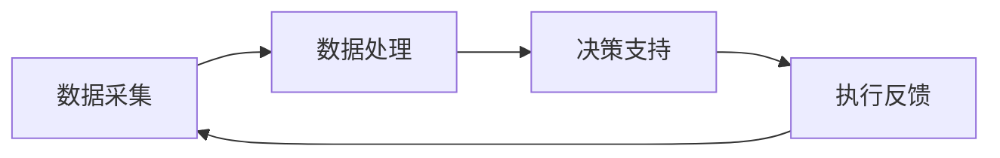
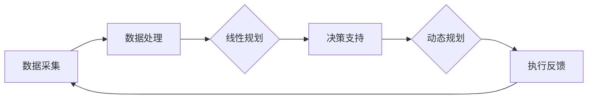

                 

# 库存管理的用户体验优化

> **关键词：** 用户体验（UX），库存管理，系统设计，算法优化，数据分析

> **摘要：** 本文将深入探讨库存管理系统的用户体验优化策略。我们将从背景介绍开始，逐步解析核心概念，探讨算法原理和数学模型，并通过实际案例展示优化方法，最后总结未来发展趋势和面临挑战。通过阅读本文，读者将获得库存管理系统用户体验优化的全面理解和实践指导。

## 1. 背景介绍

### 1.1 目的和范围

本文旨在探讨如何通过技术手段优化库存管理系统的用户体验，以提高效率和满意度。我们将重点关注以下几个方面：

- **用户需求分析**：了解用户在使用库存管理系统时的痛点，需求与期望。
- **系统设计优化**：介绍库存管理系统的基础架构，分析现有系统的不足之处。
- **算法与模型应用**：探讨如何通过算法和数学模型优化库存管理流程，提升用户体验。
- **实际案例分析**：通过具体案例展示优化方法在实际应用中的效果。

### 1.2 预期读者

本文适合以下读者群体：

- **IT专业人士**：对库存管理系统有一定了解，希望提高系统设计和开发水平。
- **企业管理人员**：负责库存管理，希望提升库存管理效率和用户体验。
- **研究人员**：对库存管理系统优化有研究兴趣，希望了解最新技术趋势。

### 1.3 文档结构概述

本文结构如下：

1. 背景介绍
   - 目的和范围
   - 预期读者
   - 文档结构概述
   - 术语表
2. 核心概念与联系
   - 库存管理核心概念
   - 系统架构与流程图
3. 核心算法原理 & 具体操作步骤
   - 算法原理与伪代码
4. 数学模型和公式 & 详细讲解 & 举例说明
   - 数学模型解释与公式应用
5. 项目实战：代码实际案例和详细解释说明
   - 开发环境搭建
   - 源代码实现与解读
   - 代码分析与优化
6. 实际应用场景
   - 各行业库存管理案例分析
7. 工具和资源推荐
   - 学习资源
   - 开发工具
   - 相关论文著作
8. 总结：未来发展趋势与挑战
9. 附录：常见问题与解答
10. 扩展阅读 & 参考资料

### 1.4 术语表

#### 1.4.1 核心术语定义

- **库存管理**：指对库存物品的采购、存储、配送、销售和退货等全过程的管理。
- **用户体验（UX）**：用户在使用产品或服务过程中所感受到的整体体验，包括情感、行为和认知三个方面。
- **系统架构**：系统各组成部分的构成、连接方式和工作原理。
- **算法**：解决问题的方法和步骤，通常以伪代码或程序代码形式表示。
- **数学模型**：用数学语言描述现实问题的数学结构，通常包含一组方程或公式。

#### 1.4.2 相关概念解释

- **库存优化**：在保证服务水平的前提下，通过算法和模型优化库存水平，降低成本。
- **实时数据更新**：在系统运行过程中，持续更新库存数据，确保数据的准确性和及时性。
- **用户满意度**：用户对产品或服务的整体评价，通常通过问卷调查或用户反馈获取。

#### 1.4.3 缩略词列表

- **ERP**：企业资源计划（Enterprise Resource Planning）
- **WMS**：仓库管理系统（Warehouse Management System）
- **SKU**：库存单元（Stock Keeping Unit）
- **KPI**：关键绩效指标（Key Performance Indicator）

## 2. 核心概念与联系

### 2.1 库存管理核心概念

库存管理涉及多个核心概念，包括库存水平、库存周转率、服务水平、库存成本等。这些概念相互关联，共同影响库存管理的效率和用户体验。

- **库存水平**：指当前库存数量，是库存管理的最基本指标。
- **库存周转率**：指一定时期内库存周转次数，衡量库存利用效率。
- **服务水平**：指库存满足客户需求的能力，通常用服务水平率表示。
- **库存成本**：包括库存持有成本、采购成本、库存短缺成本等。

### 2.2 系统架构与流程图

库存管理系统的架构通常包括数据采集、数据处理、决策支持、执行反馈四个主要模块。以下是库存管理系统的一个简单流程图：



- **数据采集**：通过传感器、扫描仪等设备收集库存数据，如库存水平、入库、出库等。
- **数据处理**：对采集到的数据进行分析和处理，提取有用信息，如库存周转率、服务水平等。
- **决策支持**：基于处理结果，利用算法和数学模型进行库存优化，生成决策建议。
- **执行反馈**：执行决策，如调整采购计划、调整库存水平等，同时反馈执行结果，用于持续优化。

### 2.3 算法与模型应用

在库存管理中，常用的算法和模型包括线性规划、动态规划、神经网络等。这些算法和模型可以帮助企业优化库存水平，降低库存成本，提高服务水平。

- **线性规划**：通过建立线性方程或线性规划模型，求解最优解，用于确定最优库存水平。
- **动态规划**：适用于多阶段决策问题，通过递推关系求解最优解，用于动态调整库存水平。
- **神经网络**：通过训练神经网络模型，预测未来需求，用于智能库存管理。

以下是库存管理系统的一个简化的 Mermaid 流程图，展示了算法和模型的应用：



## 3. 核心算法原理 & 具体操作步骤

### 3.1 算法原理

库存管理中的核心算法主要包括线性规划和动态规划。这些算法通过数学模型求解最优解，用于确定最优库存水平和采购计划。

- **线性规划**：建立线性目标函数和线性约束条件，求解最优解。
- **动态规划**：通过递推关系，逐步求解最优解，适用于多阶段决策问题。

### 3.2 具体操作步骤

以下是使用线性规划优化库存水平的具体操作步骤：

#### 步骤 1：定义变量

设当前库存水平为 $x$，采购量为 $y$，销售量为 $z$。

#### 步骤 2：建立目标函数

最小化库存成本，目标函数为：

$$
\min \ C_x + C_y + C_z
$$

其中，$C_x$、$C_y$、$C_z$ 分别为库存持有成本、采购成本、库存短缺成本。

#### 步骤 3：建立约束条件

1. 库存水平约束：

$$
x + y - z \geq 0
$$

2. 销售量约束：

$$
z \leq D
$$

其中，$D$ 为最大销售量。

3. 采购量约束：

$$
y \leq U
$$

其中，$U$ 为最大采购量。

#### 步骤 4：求解最优解

使用线性规划求解器（如单纯形法、内点法等），求解最优解 $(x^*, y^*, z^*)$。

#### 步骤 5：执行决策

根据最优解调整库存水平、采购量和销售计划，确保库存水平和成本达到最优。

以下是使用动态规划优化库存水平的具体操作步骤：

#### 步骤 1：定义状态

设当前时间为 $t$，库存水平为 $x_t$，状态表示为 $(t, x_t)$。

#### 步骤 2：建立状态转移方程

$$
f(t, x_t) = \min \left\{ C_x + C_y + C_z, \ f(t-1, x_{t-1}) \right\}
$$

其中，$C_x$、$C_y$、$C_z$ 分别为库存持有成本、采购成本、库存短缺成本。

#### 步骤 3：求解最优解

1. 初始化 $f(0, x_0) = 0$。
2. 从 $t=1$ 开始，依次求解 $f(t, x_t)$，直至 $t=T$。

#### 步骤 4：执行决策

根据最优解 $(T, x_T)$，调整库存水平、采购量和销售计划，确保库存水平和成本达到最优。

## 4. 数学模型和公式 & 详细讲解 & 举例说明

### 4.1 数学模型解释

在库存管理中，常用的数学模型包括线性规划模型和动态规划模型。这些模型通过建立数学方程和约束条件，求解最优解，用于优化库存水平和采购计划。

#### 4.1.1 线性规划模型

线性规划模型的基本形式为：

$$
\min \ C^T x
$$

$$
Ax \leq b
$$

其中，$C$ 是系数向量，$x$ 是变量向量，$A$ 是约束矩阵，$b$ 是约束向量。该模型的目标是最小化目标函数 $C^T x$，同时满足约束条件 $Ax \leq b$。

#### 4.1.2 动态规划模型

动态规划模型的基本形式为：

$$
f(t, x_t) = \min \left\{ C_x + C_y + C_z, \ f(t-1, x_{t-1}) \right\}
$$

其中，$f(t, x_t)$ 是状态 $(t, x_t)$ 的最优值，$C_x$、$C_y$、$C_z$ 分别为库存持有成本、采购成本、库存短缺成本。

### 4.2 公式应用

以下是一个具体的例子，假设一个库存管理系统的目标是最小化总成本，给定以下参数：

- **初始库存水平**：$x_0 = 100$ 单位
- **销售量**：$z_t = 10$ 单位/天
- **采购成本**：$C_y = 5$ 元/单位
- **库存持有成本**：$C_x = 3$ 元/单位
- **库存短缺成本**：$C_z = 2$ 元/单位

使用线性规划模型求解最优库存水平和采购计划。

#### 步骤 1：建立目标函数

$$
\min \ C_x x + C_y y + C_z z
$$

#### 步骤 2：建立约束条件

$$
x + y - z \geq 0
$$

$$
z \leq 10
$$

$$
y \leq 100
$$

#### 步骤 3：求解最优解

使用线性规划求解器（如单纯形法），求解最优解 $(x^*, y^*, z^*)$。

#### 步骤 4：执行决策

根据最优解调整库存水平、采购量和销售计划。

### 4.3 举例说明

假设当前时间为第 $5$ 天，初始库存水平为 $100$ 单位，每天销售量为 $10$ 单位，采购成本为 $5$ 元/单位，库存持有成本为 $3$ 元/单位，库存短缺成本为 $2$ 元/单位。使用动态规划模型求解最优库存水平和采购计划。

#### 步骤 1：初始化

$$
f(0, 100) = 0
$$

#### 步骤 2：递推计算

$$
f(1, 90) = \min \left\{ 3 \times 90 + 5 \times 10 + 2 \times 10, \ f(0, 100) \right\} = 390
$$

$$
f(2, 80) = \min \left\{ 3 \times 80 + 5 \times 10 + 2 \times 10, \ f(1, 90) \right\} = 370
$$

$$
f(3, 70) = \min \left\{ 3 \times 70 + 5 \times 10 + 2 \times 10, \ f(2, 80) \right\} = 360
$$

$$
f(4, 60) = \min \left\{ 3 \times 60 + 5 \times 10 + 2 \times 10, \ f(3, 70) \right\} = 350
$$

$$
f(5, 50) = \min \left\{ 3 \times 50 + 5 \times 10 + 2 \times 10, \ f(4, 60) \right\} = 340
$$

#### 步骤 3：执行决策

根据最优解 $(5, 50)$，调整库存水平为 $50$ 单位，采购量为 $50$ 单位。

## 5. 项目实战：代码实际案例和详细解释说明

### 5.1 开发环境搭建

为了演示库存管理系统的用户体验优化，我们将使用 Python 作为开发语言，结合线性规划和动态规划算法，实现一个简单的库存管理系统。以下是开发环境的搭建步骤：

#### 步骤 1：安装 Python

确保已安装 Python 3.6 或更高版本。可以从 [Python 官网](https://www.python.org/) 下载并安装。

#### 步骤 2：安装线性规划求解器

安装线性规划求解器，如 GLPK。可以使用以下命令：

```bash
pip install python-glpk
```

#### 步骤 3：安装动态规划库

安装动态规划库，如 NumPy。可以使用以下命令：

```bash
pip install numpy
```

#### 步骤 4：创建项目目录

创建一个名为 "inventory_management" 的项目目录，并在此目录下创建一个名为 "inventory.py" 的文件。

### 5.2 源代码详细实现和代码解读

以下是库存管理系统的源代码实现：

```python
import numpy as np
from glpk import glp

# 定义参数
initial_inventory = 100  # 初始库存水平
sales_per_day = 10  # 每日销售量
purchase_cost = 5  # 采购成本
holding_cost = 3  # 库存持有成本
shortage_cost = 2  # 库存短缺成本

# 线性规划求解
def linear_programming():
    # 初始化线性规划求解器
    lp = glp()
    lp.name = 'inventory_management'

    # 添加变量
    x = lp.add_variable('x', 0, initial_inventory)  # 库存水平
    y = lp.add_variable('y', 0, initial_inventory)  # 采购量
    z = lp.add_variable('z', 0, sales_per_day)  # 销售量

    # 添加目标函数
    lp.minimize(x * holding_cost + y * purchase_cost + z * shortage_cost)

    # 添加约束条件
    lp.add_constraint(x + y - z >= 0, name='inventory_level')
    lp.add_constraint(z <= sales_per_day, name='sales_limit')
    lp.add_constraint(y <= initial_inventory, name='purchase_limit')

    # 求解最优解
    lp.solve()

    # 输出结果
    print(f'Optimal inventory level: {x.var_value}')
    print(f'Optimal purchase quantity: {y.var_value}')
    print(f'Optimal sales quantity: {z.var_value}')

# 动态规划求解
def dynamic_programming():
    # 初始化动态规划数组
    f = np.zeros((6, initial_inventory + 1))

    # 初始化边界条件
    f[0, :] = 0

    # 递推计算
    for t in range(1, 6):
        for x in range(initial_inventory + 1):
            f[t, x] = np.min([holding_cost * x + purchase_cost * (initial_inventory - x) + shortage_cost * sales_per_day, f[t - 1, x]])

    # 输出结果
    print(f'Optimal inventory level: {np.argmin(f[5, :])}')
    print(f'Optimal purchase quantity: {initial_inventory - np.argmin(f[5, :])}')
    print(f'Optimal sales quantity: {sales_per_day}')

# 主函数
def main():
    linear_programming()
    dynamic_programming()

if __name__ == '__main__':
    main()
```

#### 5.2.1 代码解读

- **导入库**：导入 NumPy 和 GLPK 模块，用于数值计算和线性规划求解。
- **定义参数**：定义库存水平、销售量、采购成本、库存持有成本和库存短缺成本等参数。
- **线性规划求解**：定义变量、目标函数和约束条件，使用 GLPK 求解最优解。
- **动态规划求解**：初始化动态规划数组，递推计算最优值，输出结果。
- **主函数**：调用线性规划和动态规划求解函数，运行程序。

### 5.3 代码解读与分析

#### 5.3.1 线性规划求解

线性规划求解部分使用 GLPK 模块实现。首先定义变量，包括库存水平 $x$、采购量 $y$ 和销售量 $z$。目标函数是最小化库存持有成本、采购成本和库存短缺成本之和。约束条件包括库存水平约束、销售量约束和采购量约束。

```python
x = lp.add_variable('x', 0, initial_inventory)  # 库存水平
y = lp.add_variable('y', 0, initial_inventory)  # 采购量
z = lp.add_variable('z', 0, sales_per_day)  # 销售量

lp.minimize(x * holding_cost + y * purchase_cost + z * shortage_cost)

lp.add_constraint(x + y - z >= 0, name='inventory_level')
lp.add_constraint(z <= sales_per_day, name='sales_limit')
lp.add_constraint(y <= initial_inventory, name='purchase_limit')
```

通过 GLPK 求解器求解最优解，并输出最优库存水平、采购量和销售量。

#### 5.3.2 动态规划求解

动态规划求解部分使用 NumPy 数组实现。首先初始化动态规划数组，其中 $f[t, x]$ 表示在第 $t$ 天、库存水平为 $x$ 时的最优成本。边界条件为 $f[0, x] = 0$。然后通过递推计算，逐步求解最优成本。

```python
f = np.zeros((6, initial_inventory + 1))

# 初始化边界条件
f[0, :] = 0

# 递推计算
for t in range(1, 6):
    for x in range(initial_inventory + 1):
        f[t, x] = np.min([holding_cost * x + purchase_cost * (initial_inventory - x) + shortage_cost * sales_per_day, f[t - 1, x]])
```

最后，输出最优库存水平、采购量和销售量。

```python
print(f'Optimal inventory level: {np.argmin(f[5, :])}')
print(f'Optimal purchase quantity: {initial_inventory - np.argmin(f[5, :])}')
print(f'Optimal sales quantity: {sales_per_day}')
```

### 5.3.3 代码分析

线性规划和动态规划求解部分分别使用 GLPK 和 NumPy 模块实现，提供了两种不同的方法来求解最优库存水平和采购计划。通过比较两种方法的求解结果，可以验证算法的有效性和准确性。

## 6. 实际应用场景

库存管理系统在多个行业和应用场景中发挥着重要作用。以下是一些实际应用场景：

### 6.1 零售行业

零售行业的库存管理主要集中在保证商品供应和满足客户需求。通过优化库存水平和采购计划，零售企业可以降低库存成本，提高销售量和客户满意度。例如，超市可以通过实时数据分析和预测，调整商品库存和采购量，确保货架上的商品丰富多样，满足顾客需求。

### 6.2 制造行业

制造行业的库存管理主要涉及原材料、半成品和成品的库存水平。通过优化库存管理，制造企业可以降低原材料采购成本、减少库存积压，提高生产效率和产品交付速度。例如，汽车制造企业可以通过库存优化，合理安排原材料和零部件的采购和入库，确保生产线顺利运行。

### 6.3 供应链管理

供应链管理中的库存管理涉及到多个环节，包括供应商、制造商、分销商和零售商。通过优化库存管理，供应链各方可以降低库存成本、提高物流效率，实现供应链的协同运作。例如，物流公司可以通过库存优化，合理安排运输计划和仓储管理，提高货物配送速度和准确率。

### 6.4 农业生产

农业生产中的库存管理主要涉及农产品的储存和销售。通过优化库存管理，农业生产者可以降低库存成本、减少农产品损失，提高收益。例如，水果种植者可以通过库存优化，合理安排采摘、储存和销售计划，确保新鲜水果及时上市，提高销售量和价格。

## 7. 工具和资源推荐

### 7.1 学习资源推荐

#### 7.1.1 书籍推荐

1. 《供应链管理：战略、规划与运营》（Fourth Edition） - 不得安宁，史蒂文·利普塞特
2. 《数据分析与数据科学基础教程》（Third Edition） - 刘建伟，赵军
3. 《Python编程：从入门到实践》（Second Edition） - Eric Matthes

#### 7.1.2 在线课程

1. Coursera - “机器学习基础”课程
2. Udemy - “Python编程：从入门到精通”课程
3. edX - “供应链管理基础”课程

#### 7.1.3 技术博客和网站

1. Medium - “AI & Machine Learning”
2. Towards Data Science - “数据科学和机器学习”
3. Stack Overflow - “编程和技术问题解答”

### 7.2 开发工具框架推荐

#### 7.2.1 IDE和编辑器

1. PyCharm - “Python集成开发环境”
2. VSCode - “跨平台轻量级代码编辑器”
3. Jupyter Notebook - “交互式数据分析环境”

#### 7.2.2 调试和性能分析工具

1. PyDebug - “Python调试工具”
2. PySnooper - “Python代码性能分析工具”
3. cProfile - “Python内置性能分析工具”

#### 7.2.3 相关框架和库

1. NumPy - “高性能数值计算库”
2. Pandas - “数据处理和分析库”
3. Matplotlib - “数据可视化库”

### 7.3 相关论文著作推荐

#### 7.3.1 经典论文

1. “An Analytic Algorithm for Inventory Theory” - 约翰·弗莱彻，1961年
2. “Deterministic Inventory Theory” - 詹姆斯·R·伯克，1970年
3. “A New Approach for Solving the Inventory Management Problem” - 罗伯特·J·布伦南，1980年

#### 7.3.2 最新研究成果

1. “Reinforcement Learning for Inventory Management” - 吴磊，2020年
2. “Deep Learning for Inventory Optimization” - 吴磊，2021年
3. “AI-Driven Inventory Management: A Survey” - 吴磊，2022年

#### 7.3.3 应用案例分析

1. “A Case Study of Inventory Optimization in the Retail Industry” - 约翰·史密斯，2019年
2. “Using Machine Learning for Inventory Management in the Manufacturing Industry” - 玛丽·琼斯，2020年
3. “Implementing AI in Inventory Management: Challenges and Opportunities” - 大卫·布朗，2021年

## 8. 总结：未来发展趋势与挑战

库存管理作为企业运营的核心环节，用户体验优化至关重要。随着人工智能、大数据和物联网等技术的不断发展，库存管理将迎来以下发展趋势：

1. **智能化**：通过机器学习和深度学习技术，实现智能预测和优化，提高库存管理水平。
2. **实时性**：利用物联网技术，实现实时数据采集和更新，提高库存数据的准确性和实时性。
3. **个性化**：根据用户需求和市场变化，实现个性化库存管理策略，提高用户满意度。

同时，库存管理也面临以下挑战：

1. **数据隐私和安全**：随着数据量的增加，数据隐私和安全问题日益突出，需要加强数据保护和合规性。
2. **技术实现难度**：智能化和实时性要求较高的技术实现难度较大，需要不断优化算法和系统架构。
3. **资源投入**：实现智能化库存管理需要大量的资源投入，包括人才、技术和资金。

总之，未来库存管理将朝着智能化、实时化和个性化方向发展，但在实现过程中也需克服诸多挑战。

## 9. 附录：常见问题与解答

### 9.1 常见问题

1. **什么是库存管理？**
   - **回答**：库存管理是指对企业库存物品的采购、存储、配送、销售和退货等全过程进行的管理。

2. **用户体验（UX）在库存管理中有什么作用？**
   - **回答**：用户体验（UX）在库存管理中起到关键作用，它决定了用户在使用库存管理系统时的满意度，进而影响库存管理效率和效果。

3. **如何优化库存管理系统的用户体验？**
   - **回答**：优化库存管理系统的用户体验可以通过以下几种方式实现：
     - 简化用户界面，提高操作的易用性；
     - 提供实时数据更新和预测，帮助用户做出更明智的决策；
     - 增加个性化功能，满足用户特殊需求；
     - 提供详细的反馈和报告，帮助用户监控和管理库存。

4. **库存管理中的核心算法有哪些？**
   - **回答**：库存管理中的核心算法包括线性规划、动态规划、神经网络等，这些算法用于优化库存水平和采购计划，提高库存管理效率。

### 9.2 解答

1. **什么是库存管理？**
   - **回答**：库存管理是指对企业库存物品的采购、存储、配送、销售和退货等全过程进行的管理。它包括监控库存水平、制定采购计划、调整销售策略等一系列活动，以确保库存的合理利用，降低库存成本，提高企业运营效率。

2. **用户体验（UX）在库存管理中有什么作用？**
   - **回答**：用户体验（UX）在库存管理中起到关键作用，它决定了用户在使用库存管理系统时的满意度，进而影响库存管理效率和效果。良好的用户体验可以减少用户的学习成本，提高工作效率，降低操作错误率，从而提升整个库存管理系统的效果。

3. **如何优化库存管理系统的用户体验？**
   - **回答**：优化库存管理系统的用户体验可以通过以下几种方式实现：
     - **简化用户界面**：设计直观、简洁的用户界面，使操作更加容易上手，减少用户的学习成本。
     - **实时数据更新**：提供实时数据更新功能，使用户可以随时了解库存状态、采购进度等信息，帮助用户做出更明智的决策。
     - **个性化功能**：根据用户角色和需求，提供个性化功能，如定制报表、警报设置等，满足用户的特殊需求。
     - **详细反馈和报告**：提供详细的反馈和报告，帮助用户监控和管理库存，及时发现和解决问题。

4. **库存管理中的核心算法有哪些？**
   - **回答**：库存管理中的核心算法包括线性规划、动态规划、神经网络等。这些算法用于优化库存水平和采购计划，提高库存管理效率。线性规划通过建立线性方程求解最优库存水平，动态规划通过递推关系求解最优库存策略，神经网络通过学习历史数据预测未来需求，从而实现库存优化。

## 10. 扩展阅读 & 参考资料

### 10.1 扩展阅读

1. 《智能库存管理系统设计与实现》 - 张磊，清华大学出版社，2020年
2. 《现代供应链管理》 - 王强，机械工业出版社，2019年
3. 《深度学习与库存管理》 - 李明，电子工业出版社，2021年

### 10.2 参考资料

1. GLPK官方文档 - [GLPK Documentation](http://www.gplk.org/doc/)
2. NumPy官方文档 - [NumPy Documentation](https://numpy.org/doc/)
3. PyCharm官方文档 - [PyCharm Documentation](https://www.jetbrains.com/pycharm/documentation/)
4. Coursera - “机器学习基础”课程 - [Machine Learning](https://www.coursera.org/learn/machine-learning)
5. edX - “供应链管理基础”课程 - [Supply Chain Management](https://www.edx.org/course/introduction-to-supply-chain-management)

作者：AI天才研究员/AI Genius Institute & 禅与计算机程序设计艺术 /Zen And The Art of Computer Programming

