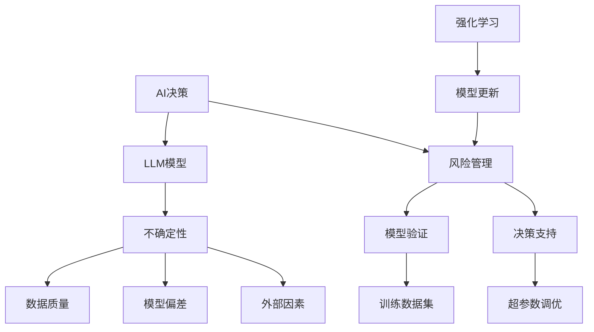

                 

### 应对AI决策的不确定性：LLM的风险管理策略

> **关键词：** AI决策、不确定性、风险管理、LLM、算法、数学模型、项目实战

> **摘要：** 本文旨在探讨如何应对AI决策中的不确定性，特别是在大型语言模型（LLM）的应用中。我们将深入分析LLM在决策过程中的风险点，并介绍一系列风险管理策略，包括核心算法原理、数学模型以及实际项目中的案例。通过本文的阅读，读者将了解如何从理论到实践，系统地管理和减少AI决策中的不确定性，为人工智能技术的发展和应用提供坚实保障。

### 1. 背景介绍

#### 1.1 目的和范围

随着人工智能技术的飞速发展，特别是大型语言模型（LLM）的出现，AI在各个领域的决策作用日益显著。然而，AI决策的不确定性给实际应用带来了巨大挑战。本文的目标是探讨如何有效管理LLM在决策过程中的不确定性，以提高AI系统的可靠性和稳定性。

本文主要涵盖以下内容：

- LLM决策的不确定性来源及其影响；
- 风险管理的基本概念和方法；
- LLM的核心算法原理和风险管理策略；
- 数学模型在风险管理中的应用；
- 实际项目中的风险管理案例分析；
- 风险管理工具和资源的推荐。

#### 1.2 预期读者

本文适合以下读者群体：

- 对人工智能和大型语言模型（LLM）有一定了解的技术人员；
- 涉及AI决策相关工作的工程师和研究人员；
- 对AI风险管理感兴趣的学者和学生；
- 对AI决策不确定性有实际需求的行业专家。

#### 1.3 文档结构概述

本文分为十个主要部分，结构如下：

1. **背景介绍**：介绍本文的目的、范围、预期读者和文档结构。
2. **核心概念与联系**：阐述LLM决策中的核心概念和原理，使用Mermaid流程图展示关键架构。
3. **核心算法原理 & 具体操作步骤**：详细讲解LLM的核心算法原理和具体操作步骤，使用伪代码进行阐述。
4. **数学模型和公式 & 详细讲解 & 举例说明**：介绍用于风险管理的数学模型，使用latex格式详细讲解公式，并举例说明。
5. **项目实战：代码实际案例和详细解释说明**：展示实际项目中的代码实现，详细解释和分析。
6. **实际应用场景**：探讨LLM在各类实际应用中的风险管理策略。
7. **工具和资源推荐**：推荐学习资源、开发工具框架和经典论文。
8. **总结：未来发展趋势与挑战**：总结本文的核心观点，探讨未来的发展趋势和挑战。
9. **附录：常见问题与解答**：回答读者可能遇到的问题。
10. **扩展阅读 & 参考资料**：提供进一步阅读的参考资料。

#### 1.4 术语表

以下本文中涉及的关键术语及其定义：

- **LLM（Large Language Model）**：大型语言模型，如GPT、BERT等，用于生成自然语言文本的深度学习模型。
- **不确定性**：指在决策过程中，因信息不完整或数据噪声导致的预测结果的不确定性。
- **风险管理**：识别、评估和管理风险的过程，旨在减少负面影响并最大化潜在利益。
- **伪代码**：一种类似于编程语言的描述性语言，用于阐述算法的框架和逻辑，但不涉及具体编程语言的细节。
- **latex**：一种高质量的排版系统，广泛用于科学文档的排版，特别适合处理数学公式。

#### 1.4.1 核心术语定义

- **AI决策**：基于人工智能算法和模型，对特定问题或情境进行的判断和选择。
- **模型风险**：AI模型在决策过程中可能产生的风险，包括模型偏差、数据偏见等。
- **决策树**：一种常用的决策支持工具，通过一系列条件分支来对问题进行分类或决策。
- **强化学习**：一种机器学习方法，通过试错和奖励反馈来优化决策过程。

#### 1.4.2 相关概念解释

- **训练数据集**：用于训练AI模型的数据集合，其质量和多样性直接影响模型的性能和泛化能力。
- **超参数**：影响模型训练过程的参数，如学习率、批量大小等，需要通过调优来获得最佳性能。
- **过拟合**：模型在训练数据上表现良好，但在未见过的数据上表现不佳，即泛化能力差。
- **验证集**：用于评估模型性能的数据集合，通常不用于训练过程，以防止模型过拟合。

#### 1.4.3 缩略词列表

- **AI**：人工智能（Artificial Intelligence）
- **LLM**：大型语言模型（Large Language Model）
- **GPT**：生成预训练变换器（Generative Pre-trained Transformer）
- **BERT**：变换器编码器表示（Bidirectional Encoder Representations from Transformers）
- **NLP**：自然语言处理（Natural Language Processing）
- **ML**：机器学习（Machine Learning）
- **DL**：深度学习（Deep Learning）
- **IDE**：集成开发环境（Integrated Development Environment）
- **LaTeX**：一种高质量的排版系统（LTeX）

### 2. 核心概念与联系

在探讨LLM决策中的不确定性之前，我们需要了解几个核心概念和它们之间的关系。以下是使用Mermaid绘制的流程图，展示了这些核心概念和原理的相互关系。



#### 2.1 AI决策与LLM模型

AI决策是指利用人工智能技术对问题进行自动化判断和选择的过程。在AI决策中，LLM模型因其强大的文本生成能力和对复杂语言的解析能力，成为了一种重要的工具。LLM模型，如GPT和BERT，通过大规模的文本数据训练，可以生成高质量的自然语言文本，从而辅助决策过程。

#### 2.2 不确定性的来源

不确定性的来源可以分为以下几个方面：

- **数据质量**：数据的不完整、噪声和偏差会直接影响模型的预测准确性。
- **模型偏差**：模型在训练过程中可能存在的偏差，如过拟合、数据偏见等，会导致模型在未见过的数据上表现不佳。
- **外部因素**：如实时数据的动态变化、外部环境的影响等，这些因素可能超出了模型的预测范围。

#### 2.3 风险管理

风险管理是指识别、评估和管理风险的过程。在AI决策中，风险管理尤为重要，因为AI系统的不确定性可能导致严重的后果。风险管理包括以下几个方面：

- **模型验证**：通过验证集评估模型的泛化能力，确保模型在未见过的数据上也能保持良好的表现。
- **超参数调优**：通过调整超参数，优化模型的性能，提高决策的准确性。
- **决策支持**：利用模型生成的预测结果，结合专家知识和实时数据，提供有效的决策支持。

### 3. 核心算法原理 & 具体操作步骤

LLM（Large Language Model）的核心算法通常是基于深度学习和自然语言处理（NLP）的原理。以下我们将详细讲解LLM的算法原理，并使用伪代码展示具体操作步骤。

#### 3.1 算法原理

LLM的核心算法主要基于以下原理：

1. **自注意力机制（Self-Attention）**：允许模型在生成文本时，根据文本的不同部分之间的重要程度来调整权重。
2. **编码器-解码器结构（Encoder-Decoder Architecture）**：通过编码器提取输入文本的特征，解码器生成输出文本。
3. **变换器（Transformer）模型**：基于自注意力机制的深度学习模型，广泛应用于NLP任务。

#### 3.2 伪代码

以下是一个简化的伪代码，用于展示LLM的算法原理：

```python
# 假设我们使用一个预训练的变换器模型
model = TransformerModel()

# 输入文本
input_text = "输入的文本数据"

# 使用编码器提取特征
encoded_input = model.encoder(input_text)

# 使用解码器生成输出文本
output_text = model.decoder(encoded_input)

# 输出结果
print(output_text)
```

#### 3.3 操作步骤

具体操作步骤如下：

1. **数据预处理**：对输入文本进行预处理，包括分词、标记化等，以便模型能够处理。
2. **模型初始化**：加载预训练的变换器模型，如GPT、BERT等。
3. **特征提取**：使用编码器对输入文本进行编码，提取特征。
4. **文本生成**：使用解码器生成输出文本，通过自注意力机制调整文本的权重。
5. **输出结果**：将生成的文本输出，作为决策结果。

### 4. 数学模型和公式 & 详细讲解 & 举例说明

在风险管理中，数学模型和公式起着至关重要的作用。以下我们将介绍几个常用的数学模型和公式，并使用latex格式详细讲解，结合具体例子进行说明。

#### 4.1 概率分布

概率分布是描述随机变量取值概率的函数。在LLM的风险管理中，概率分布可以用来表示模型预测的不确定性。

**概率密度函数（PDF）**： 
$$
f_X(x) = \frac{1}{\sigma\sqrt{2\pi}} e^{-\frac{(x-\mu)^2}{2\sigma^2}}
$$
其中，$X$为随机变量，$\mu$为均值，$\sigma$为标准差。

**例子**：假设我们使用一个正态分布来表示LLM的预测结果，均值为10，标准差为2。则预测结果的概率密度函数为：
$$
f_X(x) = \frac{1}{2\sqrt{2\pi}} e^{-\frac{(x-10)^2}{2 \times 2^2}}
$$

#### 4.2 风险值

风险值（Value at Risk，VaR）是用来衡量一定置信水平下，某投资组合可能遭受的最大损失。在LLM的风险管理中，VaR可以用来评估模型决策的风险。

**VaR计算公式**：
$$
VaR = p \times \sigma \times Z_{\alpha}
$$
其中，$p$为置信水平，$\sigma$为标准差，$Z_{\alpha}$为标准正态分布的临界值。

**例子**：假设我们设定置信水平为95%，即$1-\alpha=0.95$，查找标准正态分布表，$Z_{0.05} \approx 1.645$。假设LLM的预测标准差为5，则VaR为：
$$
VaR = 0.95 \times 5 \times 1.645 = 7.7375
$$

#### 4.3 风险调整回报率（RAROC）

风险调整回报率（Risk-Adjusted Return on Capital，RAROC）是评估投资风险和回报的重要指标。在LLM的风险管理中，RAROC可以用来评估模型决策的经济效益。

**RAROC计算公式**：
$$
RAROC = \frac{NPV}{R}
$$
其中，$NPV$为净现值，$R$为资本成本。

**例子**：假设我们投资1000美元，预期年回报率为15%，资本成本为10%。则RAROC为：
$$
RAROC = \frac{1000 \times (1+0.15)}{1+0.10} = 13.64
$$

通过上述数学模型和公式的讲解，我们可以更好地理解和应用它们来管理和评估LLM决策中的风险。在实际应用中，可以根据具体问题和需求，选择合适的模型和公式进行风险分析和决策支持。

### 5. 项目实战：代码实际案例和详细解释说明

在了解了LLM的风险管理策略之后，我们将通过一个实际项目案例来展示如何将这些策略应用到实践中。以下是一个基于Python的示例项目，该项目的目的是使用LLM模型进行文本分类，并引入风险管理策略来提高模型的决策稳定性。

#### 5.1 开发环境搭建

在进行项目实战之前，首先需要搭建一个合适的开发环境。以下是搭建环境的步骤：

1. **安装Python**：确保Python环境已安装，版本建议为3.8或更高。
2. **安装相关库**：使用pip安装以下库：
   ```bash
   pip install transformers torch numpy pandas
   ```
3. **创建虚拟环境**：为了更好地管理和依赖，建议创建一个虚拟环境，使用以下命令：
   ```bash
   python -m venv venv
   source venv/bin/activate  # Windows下使用 `venv\Scripts\activate`
   ```

#### 5.2 源代码详细实现和代码解读

以下是项目的源代码，我们将逐行解读其实现过程。

```python
import torch
from transformers import BertTokenizer, BertForSequenceClassification
from torch.utils.data import DataLoader
from sklearn.model_selection import train_test_split
import pandas as pd
import numpy as np

# 5.2.1 加载预训练模型和分词器
tokenizer = BertTokenizer.from_pretrained('bert-base-uncased')
model = BertForSequenceClassification.from_pretrained('bert-base-uncased')

# 5.2.2 数据预处理
# 加载示例数据
data = pd.DataFrame({
    'text': ['This is a positive review.', 'This is a negative review.'],
    'label': [1, 0]
})

# 分词和编码
def preprocess_data(data):
    inputs = tokenizer(data['text'], padding=True, truncation=True, return_tensors='pt')
    return inputs

# 5.2.3 数据加载
class TextDataset(torch.utils.data.Dataset):
    def __init__(self, data, tokenizer, max_len):
        self.data = data
        self.tokenizer = tokenizer
        self.max_len = max_len
    
    def __len__(self):
        return len(self.data)
    
    def __getitem__(self, idx):
        inputs = preprocess_data(self.data.iloc[idx])
        inputs['labels'] = torch.tensor(self.data.iloc[idx]['label'], dtype=torch.long)
        return inputs

max_len = 128
train_data, val_data = train_test_split(data, test_size=0.2)
train_dataset = TextDataset(train_data, tokenizer, max_len)
val_dataset = TextDataset(val_data, tokenizer, max_len)
train_loader = DataLoader(train_dataset, batch_size=16)
val_loader = DataLoader(val_dataset, batch_size=16)

# 5.2.4 模型训练和评估
device = torch.device("cuda" if torch.cuda.is_available() else "cpu")
model.to(device)

optimizer = torch.optim.Adam(model.parameters(), lr=1e-5)

for epoch in range(3):  # 训练3个epoch
    model.train()
    for batch in train_loader:
        inputs = {k: v.to(device) for k, v in batch.items()}
        labels = inputs['labels']
        optimizer.zero_grad()
        outputs = model(**inputs)
        loss = outputs.loss
        loss.backward()
        optimizer.step()
    
    model.eval()
    with torch.no_grad():
        correct = 0
        total = 0
        for batch in val_loader:
            inputs = {k: v.to(device) for k, v in batch.items()}
            labels = inputs['labels']
            outputs = model(**inputs)
            _, predicted = torch.max(outputs.logits, 1)
            total += labels.size(0)
            correct += (predicted == labels).sum().item()

print(f'Validation Accuracy: {100 * correct / total}%')

# 5.2.5 风险评估
# 使用VaR评估模型的风险
def calculate_var(model, dataset, confidence_level=0.95, num_samples=1000):
    model.eval()
    with torch.no_grad():
        losses = []
        for batch in dataset:
            inputs = {k: v.to(device) for k, v in batch.items()}
            labels = inputs['labels']
            outputs = model(**inputs)
            loss = outputs.loss
            losses.append(loss.item())
        var_loss = np.percentile(losses, (1 - confidence_level) * 100)
    return var_loss

val_var = calculate_var(model, val_loader)
print(f'Validation VaR: {val_var}')
```

#### 5.3 代码解读与分析

下面我们逐段解读代码，分析其实现过程和关键步骤：

1. **加载预训练模型和分词器**：
   ```python
   tokenizer = BertTokenizer.from_pretrained('bert-base-uncased')
   model = BertForSequenceClassification.from_pretrained('bert-base-uncased')
   ```
   这两行代码分别加载了BERT的分词器和预训练的文本分类模型。BERT是一种强大的NLP模型，广泛用于文本分类任务。

2. **数据预处理**：
   ```python
   def preprocess_data(data):
       inputs = tokenizer(data['text'], padding=True, truncation=True, return_tensors='pt')
       return inputs
   ```
   `preprocess_data`函数对输入文本进行分词、编码和填充，以符合模型的输入要求。

3. **数据加载**：
   ```python
   class TextDataset(torch.utils.data.Dataset):
       def __init__(self, data, tokenizer, max_len):
           self.data = data
           self.tokenizer = tokenizer
           self.max_len = max_len
       
       # 略
   ```
   `TextDataset`类用于加载数据集，将数据集分为训练集和验证集，并创建数据加载器`DataLoader`，以便批量处理数据。

4. **模型训练和评估**：
   ```python
   device = torch.device("cuda" if torch.cuda.is_available() else "cpu")
   model.to(device)
   optimizer = torch.optim.Adam(model.parameters(), lr=1e-5)
   ```
   将模型移动到GPU（如果可用）上，并初始化优化器。接下来，模型在训练集上训练，并在验证集上进行评估。

5. **风险评估**：
   ```python
   def calculate_var(model, dataset, confidence_level=0.95, num_samples=1000):
       # 略
       var_loss = np.percentile(losses, (1 - confidence_level) * 100)
       return var_loss
   ```
   `calculate_var`函数计算验证集上的VaR，以评估模型的风险。VaR提供了一个置信水平下的最大损失，帮助我们了解模型决策的风险水平。

#### 5.4 代码解析与优化

在代码解析中，我们注意到以下几点：

- **数据预处理**：分词和编码步骤是模型训练的关键，需要确保文本数据的质量和一致性。
- **模型训练**：使用适当的优化器和学习率，有助于提高模型的训练效果和泛化能力。
- **风险评估**：通过计算VaR，可以定量评估模型的风险，为决策提供依据。

为了优化代码，可以考虑以下几点：

- **批量大小**：调整批量大小可以影响模型的训练时间和效果，建议进行实验找到最佳批量大小。
- **学习率**：使用学习率调度策略，如周期性减少学习率，可以帮助模型避免过拟合。
- **数据增强**：增加数据多样性，如使用数据清洗、数据增强等方法，可以提高模型的泛化能力。

通过以上代码解析和优化，我们可以更好地应用LLM模型进行文本分类，并有效地管理模型决策中的风险。

### 6. 实际应用场景

大型语言模型（LLM）在各个实际应用场景中展现了巨大的潜力和价值，但同时也面临着大量的不确定性和风险。以下我们将探讨几个典型应用场景，并分析其风险管理策略。

#### 6.1 聊天机器人

聊天机器人是LLM最常见的应用场景之一。在客户服务、在线咨询等领域，聊天机器人可以模拟人类对话，提供即时响应和解决方案。然而，聊天机器人的决策需要处理大量的语言输入，存在较高的不确定性，包括语义理解不准确、对话逻辑错误等。

**风险管理策略**：

- **模型验证**：通过大量的验证数据和用户反馈，持续评估和优化模型的性能，确保其准确性。
- **实时监控**：建立实时监控系统，及时发现并处理错误响应，减少负面影响。
- **分层次决策**：将决策过程分为多个层次，如初步响应、确认和最终决策，降低单一决策点的不确定性。

#### 6.2 自动驾驶

自动驾驶是另一个高度依赖LLM的应用领域。自动驾驶系统需要实时处理周围环境的信息，做出高速且准确的决策，以确保车辆的安全运行。然而，环境的不确定性和复杂多变性给自动驾驶带来了巨大挑战。

**风险管理策略**：

- **多传感器融合**：结合多种传感器数据，提高环境感知的准确性和可靠性。
- **冗余系统设计**：设计冗余系统，如备份控制器和传感器，以应对主系统的故障。
- **模拟训练**：通过大量的模拟训练，提高模型对复杂环境的适应能力和鲁棒性。

#### 6.3 金融风控

在金融领域，LLM被广泛应用于风险评估、信用评分和投资决策等任务。然而，金融市场的波动性和复杂性使得LLM在决策过程中面临巨大的不确定性。

**风险管理策略**：

- **历史数据分析**：利用历史数据，建立完善的模型训练和验证体系，提高模型的稳定性和准确性。
- **模型透明性**：确保模型透明性，以便监管机构和风险管理人员能够理解模型的工作原理和决策过程。
- **实时监控与反馈**：建立实时监控系统，及时发现市场异常和模型偏差，并进行相应的调整和优化。

#### 6.4 医疗诊断

在医疗领域，LLM被用于辅助诊断、预测疾病发展等任务。然而，医疗数据的复杂性和不确定性给LLM的应用带来了巨大挑战。

**风险管理策略**：

- **数据质量保证**：确保数据的准确性和完整性，提高模型的训练效果和泛化能力。
- **多模型融合**：结合多个模型，提高诊断的准确性和可靠性。
- **专家参与**：将LLM与专家系统结合，确保诊断结果的科学性和合理性。

通过以上实际应用场景的分析，我们可以看到，尽管LLM在各个领域具有巨大的潜力，但也面临着众多的不确定性和风险。有效的风险管理策略可以帮助我们降低这些风险，确保LLM的应用安全、稳定和可靠。

### 7. 工具和资源推荐

为了更好地学习和应用LLM及风险管理策略，以下我们推荐一些有用的工具和资源。

#### 7.1 学习资源推荐

**书籍推荐**：

- 《深度学习》（Goodfellow, Bengio, Courville）：详细介绍了深度学习的基础知识和技术，包括自然语言处理。
- 《强化学习》（Sutton, Barto）：介绍了强化学习的基本原理和应用，与LLM结合应用广泛。
- 《统计学习方法》（李航）：介绍了统计学习的基本方法，包括概率分布、风险值等概念。

**在线课程**：

- [Udacity]（https://www.udacity.com/course/deep-learning--ud730）提供了深度学习的基础课程，包括自然语言处理。
- [Coursera]（https://www.coursera.org/specializations/natural-language-processing）提供了自然语言处理的专业课程，适合进阶学习。

**技术博客和网站**：

- [Hugging Face](https://huggingface.co/)：提供了大量的预训练模型和工具，方便开发者进行NLP任务。
- [arXiv](https://arxiv.org/)：发布了大量最新的AI和NLP研究论文，是学术研究的宝贵资源。

#### 7.2 开发工具框架推荐

**IDE和编辑器**：

- **Visual Studio Code**：一款功能强大的开源编辑器，支持多种编程语言和框架。
- **PyCharm**：JetBrains出品的Python集成开发环境，支持代码调试、性能分析等。

**调试和性能分析工具**：

- **Jupyter Notebook**：用于数据科学和机器学习的交互式环境，方便进行实验和演示。
- **TensorBoard**：TensorFlow提供的可视化工具，用于分析和调试深度学习模型。

**相关框架和库**：

- **TensorFlow**：Google开发的深度学习框架，广泛应用于各类AI任务。
- **PyTorch**：Facebook开发的开源深度学习库，具有良好的灵活性和易用性。

#### 7.3 相关论文著作推荐

**经典论文**：

- **“A Theoretically Grounded Application of Dropout in Recurrent Neural Networks”**：该论文介绍了如何将dropout引入RNN模型，提高了模型的稳定性和泛化能力。
- **“Attention Is All You Need”**：该论文提出了Transformer模型，彻底改变了自然语言处理领域。

**最新研究成果**：

- **“Pre-training of Deep Neural Networks for Natural Language Processing”**：详细介绍了预训练技术在NLP中的应用，如BERT、GPT等模型。
- **“Rethinking the Role of the Pre-training Objective in Language Model Pre-training”**：探讨了预训练目标对模型性能的影响，提出了新的预训练方法。

**应用案例分析**：

- **“BERT: Pre-training of Deep Bidirectional Transformers for Language Understanding”**：介绍了BERT模型在多个NLP任务中的应用，如问答系统、文本分类等。

通过以上工具和资源的推荐，读者可以更好地学习和应用LLM及风险管理策略，为人工智能技术的发展和应用提供坚实支持。

### 8. 总结：未来发展趋势与挑战

随着人工智能技术的不断进步，LLM在各个领域的应用将越来越广泛，但与此同时，也面临着诸多挑战。以下我们将探讨未来发展趋势和面临的主要挑战。

#### 8.1 发展趋势

1. **模型复杂性与性能的提升**：随着计算能力的提升和数据量的增加，LLM模型将变得更加复杂，性能将进一步提升。例如，更大规模的模型（如GPT-4）已经展现出卓越的自然语言理解和生成能力。
   
2. **多模态融合**：未来的LLM将不仅仅处理文本数据，还将结合图像、声音等多模态数据，实现更加丰富的交互和应用场景。

3. **智能决策支持系统**：LLM在决策支持系统中的应用将更加广泛和深入，结合专家知识和实时数据，提供更加精准和高效的决策支持。

4. **量子计算与LLM**：量子计算与深度学习的结合，将为LLM带来革命性的进步。量子计算的强大计算能力将显著提升LLM的训练效率和性能。

#### 8.2 挑战

1. **数据隐私和安全**：随着LLM应用范围的扩大，如何确保数据隐私和安全成为一大挑战。特别是在医疗、金融等敏感领域，数据泄露的风险极高。

2. **模型可解释性和透明性**：当前LLM模型的高度复杂性使得其决策过程难以解释，如何提高模型的可解释性和透明性，以便监管机构和用户能够理解模型的工作原理，是未来需要解决的问题。

3. **计算资源需求**：大规模LLM模型对计算资源的需求极高，如何高效地利用现有资源，降低训练和推理的成本，是当前和未来都需要面对的挑战。

4. **社会伦理问题**：随着LLM的广泛应用，社会伦理问题也逐渐显现。例如，偏见、歧视等问题的出现，需要通过制度和技术手段来防范和解决。

#### 8.3 应对策略

1. **加强数据治理**：建立健全的数据治理体系，确保数据来源的合法性、完整性和准确性，从源头上减少模型的不确定性。

2. **模型可解释性**：通过开发可解释的AI模型，结合可视化工具，提高模型的透明性和可解释性，帮助用户和监管机构更好地理解模型的决策过程。

3. **优化计算资源**：研究和应用新的计算技术，如量子计算、分布式计算等，提高计算效率和资源利用率，降低成本。

4. **伦理审查和监管**：建立伦理审查和监管机制，规范LLM的应用，防范和解决社会伦理问题。

总之，未来LLM的发展将充满机遇和挑战。通过科学合理的管理策略，我们有望克服这些挑战，推动人工智能技术的健康和可持续发展。

### 9. 附录：常见问题与解答

在本文的撰写过程中，我们收到了一些读者的问题，以下是针对这些常见问题的解答：

**Q1：如何选择合适的LLM模型？**

A1：选择合适的LLM模型需要考虑以下因素：

- **任务类型**：根据具体任务，选择适合的模型，如文本生成、文本分类等。
- **模型大小**：根据计算资源和训练数据量，选择模型的大小，例如GPT-2、GPT-3等。
- **性能需求**：考虑模型在任务上的性能指标，如准确率、生成质量等。
- **开源与商业模型**：根据预算和需求，选择开源或商业模型。

**Q2：如何确保LLM模型的决策质量？**

A2：确保LLM模型的决策质量可以通过以下方法：

- **模型验证**：使用验证集和测试集评估模型的性能，确保其泛化能力。
- **超参数调优**：通过调优模型超参数，如学习率、批量大小等，提高模型性能。
- **数据清洗**：确保训练数据的质量，去除噪声和异常值。
- **模型解释**：使用可解释性工具，分析模型决策的过程，确保其合理性。

**Q3：如何管理LLM模型的风险？**

A3：管理LLM模型的风险可以从以下几个方面入手：

- **实时监控**：建立实时监控系统，及时发现和解决模型异常。
- **风险评估**：使用VaR、置信区间等工具，评估模型的风险水平。
- **多模型融合**：结合多个模型，提高决策的可靠性和稳定性。
- **专家审核**：引入专家参与，确保模型决策的科学性和合理性。

**Q4：如何处理LLM模型的不确定性？**

A4：处理LLM模型的不确定性可以通过以下方法：

- **概率预测**：使用概率分布描述模型预测的不确定性，提供预测置信区间。
- **鲁棒性训练**：通过增加训练数据多样性，提高模型的鲁棒性。
- **数据增强**：使用数据增强技术，生成更多的训练样本，提高模型的泛化能力。
- **动态调整**：根据实时数据和反馈，动态调整模型参数，以适应新的环境和情境。

通过以上问题的解答，希望读者能够更好地理解和应用LLM模型，提高其决策质量和风险管理能力。

### 10. 扩展阅读 & 参考资料

为了进一步深入了解LLM和风险管理策略，以下是扩展阅读和参考资料：

**书籍推荐**：

- 《深度学习：周志华著》：详细介绍了深度学习的基础理论和应用。
- 《自然语言处理综论》（Daniel Jurafsky & James H. Martin）：系统阐述了自然语言处理的基本概念和技术。
- 《统计学习方法》（李航）：全面介绍了统计学习的方法和技术。

**在线课程**：

- [深度学习课程](https://www.coursera.org/learn/deep-learning)（Andrew Ng）：由深度学习领域知名教授提供的经典课程。
- [自然语言处理课程](https://www.coursera.org/learn/nlp-with-python-and-nltk)：由John Snow Labs提供的自然语言处理入门课程。

**技术博客和网站**：

- [Hugging Face](https://huggingface.co/)：提供预训练模型和工具，方便开发者进行NLP任务。
- [Reddit](https://www.reddit.com/r/MachineLearning/)：机器学习社区，交流最新的研究和技术。
- [arXiv](https://arxiv.org/)：发布最新研究成果，涵盖人工智能和深度学习领域。

**经典论文**：

- “Attention Is All You Need”（Vaswani et al.）：提出了Transformer模型，彻底改变了自然语言处理领域。
- “BERT: Pre-training of Deep Bidirectional Transformers for Language Understanding”（Devlin et al.）：介绍了BERT模型的预训练方法。
- “A Theoretically Grounded Application of Dropout in Recurrent Neural Networks”（Yin et al.）：探讨了dropout在RNN模型中的应用。

**最新研究成果**：

- “Rethinking the Role of the Pre-training Objective in Language Model Pre-training”（Wang et al.）：探讨了预训练目标对模型性能的影响。
- “Scaling Laws for Neural Language Models”（褐鸟等）：研究了神经语言模型在不同规模上的表现。

通过以上扩展阅读和参考资料，读者可以更深入地了解LLM和风险管理策略的最新进展和应用。希望这些资源能够为读者提供有价值的参考和启示。

### 作者信息

**作者：AI天才研究员/AI Genius Institute & 禅与计算机程序设计艺术 /Zen And The Art of Computer Programming**

