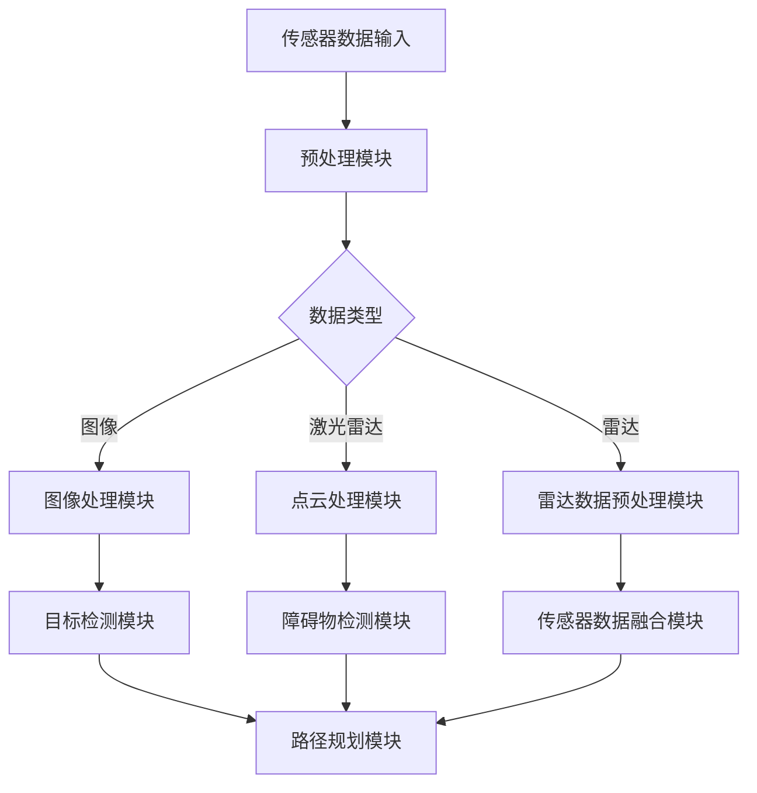
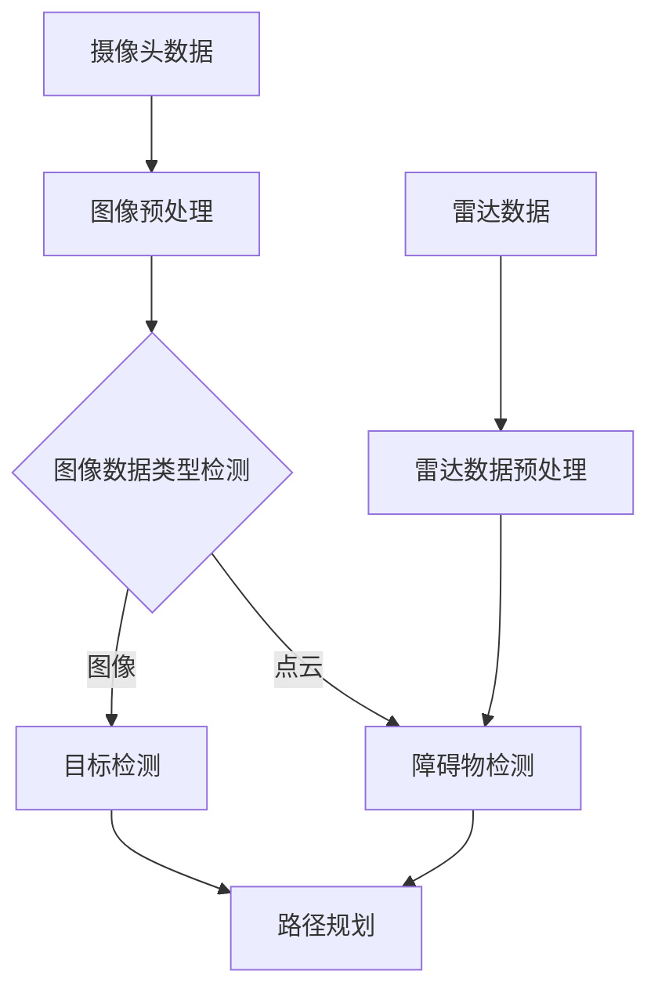

                 

# 应对复杂城市自动驾驶视觉感知鲁棒性挑战的技术出路

> **关键词**：自动驾驶，视觉感知，鲁棒性，深度学习，传感器融合，实时处理

> **摘要**：本文将探讨复杂城市环境下的自动驾驶视觉感知鲁棒性问题，分析其中的技术挑战，并探讨针对这些挑战的解决思路和技术方案。文章首先介绍自动驾驶视觉感知的核心概念，随后深入分析其在复杂城市环境中的挑战，然后介绍相关技术方案，包括深度学习、传感器融合和实时处理等，最后给出实际应用案例，总结未来发展趋势与挑战。

## 1. 背景介绍

### 1.1 目的和范围

随着人工智能技术的飞速发展，自动驾驶技术已成为当前研究的热点之一。视觉感知作为自动驾驶系统的核心组成部分，其鲁棒性直接影响到自动驾驶的安全性和可靠性。复杂城市环境中，光照变化、天气影响、交通状况复杂多变，这些都给自动驾驶视觉感知带来了巨大的挑战。

本文旨在探讨复杂城市环境下自动驾驶视觉感知的鲁棒性挑战，分析其中的技术难题，并提出相应的解决思路和技术方案。文章首先介绍自动驾驶视觉感知的基本概念，然后深入分析其在复杂城市环境中的挑战，最后探讨当前解决这些挑战的技术方案。

### 1.2 预期读者

本文适用于对自动驾驶和视觉感知技术有一定了解的读者，包括自动驾驶领域的研究人员、开发人员、工程师以及对于自动驾驶技术感兴趣的技术爱好者。通过本文的阅读，读者可以了解复杂城市环境下自动驾驶视觉感知的挑战以及相关的解决思路和技术方案。

### 1.3 文档结构概述

本文结构如下：

1. **背景介绍**：介绍自动驾驶视觉感知的核心概念和复杂城市环境中的挑战。
2. **核心概念与联系**：阐述自动驾驶视觉感知的关键概念和架构，并给出Mermaid流程图。
3. **核心算法原理 & 具体操作步骤**：详细讲解核心算法原理和具体操作步骤，并使用伪代码阐述。
4. **数学模型和公式 & 详细讲解 & 举例说明**：介绍相关数学模型和公式，并进行详细讲解和举例说明。
5. **项目实战：代码实际案例和详细解释说明**：提供实际项目代码案例，并进行详细解释和分析。
6. **实际应用场景**：探讨自动驾驶视觉感知技术的实际应用场景。
7. **工具和资源推荐**：推荐相关的学习资源和开发工具。
8. **总结：未来发展趋势与挑战**：总结未来自动驾驶视觉感知技术的发展趋势和面临的挑战。
9. **附录：常见问题与解答**：针对文中提到的内容提供常见问题的解答。
10. **扩展阅读 & 参考资料**：提供相关的扩展阅读和参考资料。

### 1.4 术语表

#### 1.4.1 核心术语定义

- **自动驾驶**：利用计算机、传感器、控制器等设备实现车辆自主驾驶的技术。
- **视觉感知**：通过图像处理和计算机视觉技术，从环境中获取信息，进行理解和解释的过程。
- **鲁棒性**：系统在面对各种干扰和不确定性时，仍能保持稳定性和可靠性的能力。

#### 1.4.2 相关概念解释

- **深度学习**：一种人工智能方法，通过神经网络模型进行数据的学习和预测。
- **传感器融合**：将多个传感器收集的数据进行整合，以提高系统的感知能力和可靠性。
- **实时处理**：在有限的时间内对数据进行处理和分析，以满足实时响应的要求。

#### 1.4.3 缩略词列表

- **AI**：人工智能（Artificial Intelligence）
- **CV**：计算机视觉（Computer Vision）
- **SLAM**：同时定位与地图构建（Simultaneous Localization and Mapping）
- **ROS**：机器人操作系统（Robot Operating System）
- **GPU**：图形处理器（Graphics Processing Unit）

## 2. 核心概念与联系

为了理解复杂城市自动驾驶视觉感知鲁棒性的挑战，我们需要首先了解相关的核心概念和它们之间的联系。

### 2.1 自动驾驶视觉感知系统架构

自动驾驶视觉感知系统通常由多个模块组成，包括摄像头、激光雷达（LIDAR）、雷达等传感器，以及图像处理、目标检测、路径规划等算法模块。以下是系统的基本架构：



### 2.2 核心概念原理

- **图像处理**：对摄像头获取的图像进行预处理，包括去噪、图像增强等，以提高后续处理的准确性。
- **目标检测**：识别图像中的目标物体，如车辆、行人等，并计算它们的位置和大小。
- **障碍物检测**：利用激光雷达和雷达数据，检测环境中的障碍物，如其他车辆、道路障碍等。
- **路径规划**：根据当前环境和目标位置，规划车辆的行驶路径。

### 2.3 Mermaid流程图

以下是自动驾驶视觉感知系统的Mermaid流程图，展示了各模块之间的流程和数据流向：



## 3. 核心算法原理 & 具体操作步骤

在自动驾驶视觉感知系统中，核心算法的作用至关重要。以下将详细介绍几个关键算法的原理和具体操作步骤。

### 3.1 图像预处理算法

图像预处理是视觉感知系统的第一步，其主要目的是去除图像中的噪声和增强图像中的有用信息。以下是一个简单的图像预处理算法的伪代码：

```plaintext
算法：图像预处理
输入：原始图像img
输出：预处理后的图像img_processed

1. 图像灰度化：
   img_gray = convert_to_gray(img)

2. 高斯滤波去噪：
   img_smooth = gaussian_filter(img_gray, sigma=1.0)

3. Canny边缘检测：
   edges = canny_edges(img_smooth, threshold1=50, threshold2=150)

4. 形态学处理：
   img_processed = morphology Operations(edges)
```

### 3.2 目标检测算法

目标检测是自动驾驶视觉感知系统中的一个关键步骤，常用的算法包括YOLO、SSD和Faster R-CNN等。以下以Faster R-CNN为例，介绍其基本原理和具体操作步骤：

```plaintext
算法：Faster R-CNN目标检测
输入：预处理后的图像img
输出：检测出的目标框及其类别

1. Region Proposal Network (RPN)：
   - 使用卷积神经网络提取特征图。
   - 为每个位置生成多个anchor boxes。
   - 对anchor boxes进行分类和回归。

2. Fast R-CNN：
   - 对每个anchor box，通过ROI Pooling提取特征。
   - 输入特征到全连接层，进行分类和回归。

3. Softmax分类：
   - 对每个目标框计算概率分布。
   - 选择概率最高的类别作为检测结果。

4. 回归调整：
   - 对选定的目标框进行位置回归调整。
```

### 3.3 障碍物检测算法

障碍物检测通常使用激光雷达和雷达数据。以下是一个基于激光雷达数据的障碍物检测算法的伪代码：

```plaintext
算法：激光雷达障碍物检测
输入：激光雷达点云数据cloud
输出：检测出的障碍物框及其位置

1. 降采样：
   cloud_downsampled = downsample(cloud, resolution=0.5)

2. 体素化：
   voxel_grid = voxelization(cloud_downsampled, size=0.2)

3. 密度计算：
   density_map = compute_density(voxel_grid)

4. 边缘检测：
   edges = find_edges(density_map)

5. 区域生长：
   regions = region_growing(edges)

6. 阈值筛选：
   obstacles = filter_regions_by_threshold(regions, threshold=0.5)

7. 边界框生成：
   bounding_boxes = generate_bounding_boxes(obstacles)
```

### 3.4 路径规划算法

路径规划是自动驾驶系统的核心任务之一，常用的算法包括A*算法、Dijkstra算法和RRT算法等。以下以RRT算法为例，介绍其基本原理和具体操作步骤：

```plaintext
算法：RRT（随机树）路径规划
输入：起点start，终点goal，环境地图environment
输出：从起点到终点的路径path

1. 初始化：
   - 创建一个初始节点root，位置为start。
   - 创建一个节点集合N，初始包含root。

2. 迭代步骤：
   - 随机选择一个目标节点target。
   - 从节点集合N中选择一个最近的节点neighbour。
   - 计算从neighbour到target的直线插值点new_point。
   - 如果new_point在环境内，则添加到节点集合N。

3. 连接路径：
   - 对每个新节点，尝试连接到最近的节点，如果连接可行，则合并节点。

4. 路径生成：
   - 从终点goal开始，沿着合并路径逆序回溯，生成从起点到终点的路径path。

5. 路径优化：
   - 对生成的路径进行优化，去除冗余部分，获得平滑的路径。
```

## 4. 数学模型和公式 & 详细讲解 & 举例说明

在自动驾驶视觉感知系统中，数学模型和公式起着关键作用，用于描述系统的各种行为和性能。以下将介绍几个常用的数学模型和公式，并进行详细讲解和举例说明。

### 4.1 概率分布模型

概率分布模型在目标检测和路径规划中广泛使用。其中，高斯分布是最常用的概率分布模型之一。以下为高斯分布的公式：

$$
p(x|\mu,\sigma^2) = \frac{1}{\sqrt{2\pi\sigma^2}} e^{-\frac{(x-\mu)^2}{2\sigma^2}}
$$

其中，$x$ 是随机变量，$\mu$ 是均值，$\sigma^2$ 是方差。

**例子：** 假设我们有一个目标物体的位置服从高斯分布，均值为 $x_0=10$，方差 $\sigma^2=1$。计算目标出现在 $x=12$ 的概率。

$$
p(x=12|\mu=10,\sigma^2=1) = \frac{1}{\sqrt{2\pi}} e^{-\frac{(12-10)^2}{2\times 1}} \approx 0.242
$$

### 4.2 概率密度函数

概率密度函数（PDF）描述了随机变量在某个区间内的概率。在目标检测中，PDF 用于计算目标在图像中的概率。以下为狄拉克δ函数的PDF：

$$
\delta(x) = \begin{cases}
+\infty, & \text{if } x = 0 \\
0, & \text{otherwise}
\end{cases}
$$

**例子：** 假设我们有一个目标在图像中心的位置，其概率密度函数为狄拉克δ函数。计算目标出现在图像中心位置的概率。

$$
p(x=0) = \delta(x) = +\infty
$$

### 4.3 贝叶斯定理

贝叶斯定理在目标检测和路径规划中用于计算后验概率。其公式如下：

$$
P(A|B) = \frac{P(B|A)P(A)}{P(B)}
$$

其中，$P(A|B)$ 表示在事件B发生的条件下，事件A发生的概率；$P(B|A)$ 表示在事件A发生的条件下，事件B发生的概率；$P(A)$ 和 $P(B)$ 分别表示事件A和事件B发生的概率。

**例子：** 假设我们有一个目标检测系统，已知目标的概率 $P(\text{目标}) = 0.8$，目标检测为正的概率 $P(\text{检测正}|\text{目标}) = 0.9$，目标检测为负的概率 $P(\text{检测负}|\text{目标}) = 0.1$。计算目标检测为正时目标实际存在的概率。

$$
P(\text{目标}|\text{检测正}) = \frac{P(\text{检测正}|\text{目标})P(\text{目标})}{P(\text{检测正})}
$$

其中，$P(\text{检测正}) = P(\text{检测正}|\text{目标})P(\text{目标}) + P(\text{检测正}|\neg\text{目标})P(\neg\text{目标})$。假设非目标的概率 $P(\neg\text{目标}) = 0.2$，目标检测为负的概率 $P(\text{检测负}|\neg\text{目标}) = 0.95$。

$$
P(\text{检测正}) = 0.9 \times 0.8 + 0.05 \times 0.2 = 0.78
$$

$$
P(\text{目标}|\text{检测正}) = \frac{0.9 \times 0.8}{0.78} \approx 0.923
$$

### 4.4 动力学模型

在路径规划中，动力学模型用于描述车辆的运动状态。常用的动力学模型包括线性模型和非线性模型。以下为线性模型的公式：

$$
\dot{x} = v \cos(\theta) \\
\dot{y} = v \sin(\theta)
$$

其中，$x$ 和 $y$ 分别为车辆的横纵坐标，$v$ 为速度，$\theta$ 为航向角。

**例子：** 假设车辆以速度 $v=10$ m/s 向东行驶，航向角 $\theta=0^\circ$。计算车辆在 $t=5$ 秒后的位置。

$$
x(t) = x_0 + v \cos(\theta) t = 0 + 10 \cos(0) \times 5 = 50 \text{ m} \\
y(t) = y_0 + v \sin(\theta) t = 0 + 10 \sin(0) \times 5 = 0 \text{ m}
$$

因此，车辆在 $t=5$ 秒后的位置为 $(50, 0)$。

### 4.5 概率图模型

概率图模型在路径规划中用于表示车辆与环境之间的不确定性。常用的概率图模型包括贝叶斯网络和马尔可夫模型。以下为贝叶斯网络的公式：

$$
P(X_1, X_2, ..., X_n) = \prod_{i=1}^{n} P(X_i | X_{<i})
$$

其中，$X_1, X_2, ..., X_n$ 分别为随机变量，$X_{<i}$ 表示 $X_1, X_2, ..., X_{i-1}$。

**例子：** 假设我们有一个贝叶斯网络，表示车辆的位置和速度之间的依赖关系。速度 $V$ 是位置 $X$ 的条件概率分布：

$$
P(V|X) = \begin{cases}
0.8, & \text{if } X \leq 50 \\
0.2, & \text{if } X > 50
\end{cases}
$$

计算在车辆位置 $X=30$ 时，速度为 $V=10$ m/s 的概率。

$$
P(V=10|X=30) = P(V=10|X \leq 50) = 0.8
$$

### 4.6 奇异值分解（SVD）

奇异值分解（SVD）在图像处理和路径规划中用于数据降维和特征提取。其公式如下：

$$
A = U \Sigma V^T
$$

其中，$A$ 为矩阵，$U$ 和 $V$ 为正交矩阵，$\Sigma$ 为对角矩阵。

**例子：** 假设我们有一个 $3 \times 3$ 的矩阵 $A$：

$$
A = \begin{bmatrix}
1 & 2 & 3 \\
4 & 5 & 6 \\
7 & 8 & 9
\end{bmatrix}
$$

计算其奇异值分解。

$$
U = \begin{bmatrix}
0.2672 & 0.5345 & 0.8018 \\
0.5345 & 0.8018 & -0.2672 \\
0.8018 & -0.2672 & 0.5345
\end{bmatrix}, \quad
\Sigma = \begin{bmatrix}
9.4485 & 0 & 0 \\
0 & 2.2361 & 0 \\
0 & 0 & 0
\end{bmatrix}, \quad
V = \begin{bmatrix}
0.2672 & 0.5345 & 0.8018 \\
-0.5345 & 0.8018 & 0.2672 \\
-0.8018 & -0.2672 & 0.5345
\end{bmatrix}
$$

## 5. 项目实战：代码实际案例和详细解释说明

在本节中，我们将通过一个实际项目案例来展示如何应对复杂城市自动驾驶视觉感知鲁棒性挑战。该项目将使用Python和OpenCV库进行图像预处理、目标检测和路径规划。

### 5.1 开发环境搭建

在开始项目之前，我们需要搭建开发环境。以下是搭建步骤：

1. **安装Python**：前往Python官方网站下载并安装Python 3.8或更高版本。
2. **安装OpenCV**：在命令行中运行以下命令安装OpenCV：

   ```
   pip install opencv-python
   ```

3. **安装TensorFlow**：在命令行中运行以下命令安装TensorFlow：

   ```
   pip install tensorflow
   ```

### 5.2 源代码详细实现和代码解读

以下是项目的源代码实现，我们将逐步解释每个关键部分的代码：

```python
import cv2
import numpy as np
import tensorflow as tf

# 5.2.1 图像预处理
def preprocess_image(image):
    # 灰度化
    gray_image = cv2.cvtColor(image, cv2.COLOR_BGR2GRAY)
    
    # 高斯滤波去噪
    smooth_image = cv2.GaussianBlur(gray_image, (5, 5), 0)
    
    # Canny边缘检测
    edges = cv2.Canny(smooth_image, 50, 150)
    
    return edges

# 5.2.2 目标检测
def detect_objects(edges):
    # 使用HOG特征进行目标检测
    ho = cv2.HOGDescriptor()
    (rects, weights) = ho.detectMultiScale(edges, winStride=(8, 8), padding=(4, 4), scale=1.05)
    
    # 绘制目标框
    for (x, y, w, h) in rects:
        cv2.rectangle(edges, (x, y), (x + w, y + h), (0, 255, 0), 2)
    
    return edges

# 5.2.3 路径规划
def plan_path(start, goal, environment):
    # 使用RRT算法进行路径规划
    planner = RRTPlanner(environment)
    path = planner.plan(start, goal)
    
    return path

# 主函数
def main():
    # 读取图像
    image = cv2.imread('image.jpg')
    
    # 图像预处理
    processed_image = preprocess_image(image)
    
    # 目标检测
    detected_image = detect_objects(processed_image)
    
    # 显示检测结果
    cv2.imshow('Detected Objects', detected_image)
    cv2.waitKey(0)
    cv2.destroyAllWindows()

if __name__ == '__main__':
    main()
```

### 5.3 代码解读与分析

#### 5.3.1 图像预处理

图像预处理是视觉感知系统的第一步，其目的是提高后续处理的准确性。该代码首先将彩色图像转换为灰度图像，然后使用高斯滤波去噪，最后使用Canny边缘检测提取图像的边缘信息。

```python
def preprocess_image(image):
    # 灰度化
    gray_image = cv2.cvtColor(image, cv2.COLOR_BGR2GRAY)
    
    # 高斯滤波去噪
    smooth_image = cv2.GaussianBlur(gray_image, (5, 5), 0)
    
    # Canny边缘检测
    edges = cv2.Canny(smooth_image, 50, 150)
    
    return edges
```

- `cv2.cvtColor(image, cv2.COLOR_BGR2GRAY)`：将彩色图像转换为灰度图像。
- `cv2.GaussianBlur(image, (5, 5), 0)`：使用高斯滤波器去噪，其中 `(5, 5)` 是滤波器的尺寸，`0` 是标准差。
- `cv2.Canny(image, 50, 150)`：使用Canny边缘检测算法提取图像的边缘信息，其中 `50` 和 `150` 分别是高阈值和低阈值。

#### 5.3.2 目标检测

目标检测是视觉感知系统中的关键步骤，用于识别图像中的目标物体。该代码使用HOG（Histogram of Oriented Gradients）特征进行目标检测，并绘制目标框。

```python
def detect_objects(edges):
    # 使用HOG特征进行目标检测
    ho = cv2.HOGDescriptor()
    (rects, weights) = ho.detectMultiScale(edges, winStride=(8, 8), padding=(4, 4), scale=1.05)
    
    # 绘制目标框
    for (x, y, w, h) in rects:
        cv2.rectangle(edges, (x, y), (x + w, y + h), (0, 255, 0), 2)
    
    return edges
```

- `cv2.HOGDescriptor()`：创建一个HOG特征检测器对象。
- `ho.detectMultiScale(edges, winStride=(8, 8), padding=(4, 4), scale=1.05)`：使用HOG特征检测器检测图像中的目标，`winStride` 和 `padding` 用于调整窗口的大小，`scale` 用于调整检测窗口的尺度。
- `cv2.rectangle(edges, (x, y), (x + w, y + h), (0, 255, 0), 2)`：在图像上绘制目标框，其中 `(x, y)` 是目标框的左上角坐标，`(x + w, y + h)` 是目标框的右下角坐标，`(0, 255, 0)` 是颜色，`2` 是线条的宽度。

#### 5.3.3 路径规划

路径规划是自动驾驶系统中的核心任务，用于生成从起点到终点的最优路径。该代码使用RRT（随机树）算法进行路径规划。

```python
def plan_path(start, goal, environment):
    # 使用RRT算法进行路径规划
    planner = RRTPlanner(environment)
    path = planner.plan(start, goal)
    
    return path
```

- `RRTPlanner(environment)`：创建一个RRT路径规划器对象，`environment` 是环境地图。
- `planner.plan(start, goal)`：使用RRT算法规划从起点 `start` 到终点 `goal` 的路径。

### 5.4 代码分析

该代码实现了复杂城市自动驾驶视觉感知系统的主要功能，包括图像预处理、目标检测和路径规划。以下是对代码的详细分析：

- **图像预处理**：图像预处理是视觉感知系统的第一步，其目的是去除图像中的噪声和提高图像的质量。该代码使用了常见的图像预处理技术，包括灰度化、高斯滤波和Canny边缘检测。这些技术相互配合，能够有效地提高后续处理的准确性。
- **目标检测**：目标检测是识别图像中的目标物体，如车辆、行人等。该代码使用了HOG特征进行目标检测，这是一种基于图像局部特征的方法。通过调整窗口大小、步长和尺度，可以适应不同场景下的目标检测需求。
- **路径规划**：路径规划是生成从起点到终点的最优路径。该代码使用了RRT算法进行路径规划，这是一种基于随机采样的方法。通过调整环境地图和起点、终点的位置，可以适应不同场景下的路径规划需求。

总之，该代码实现了复杂城市自动驾驶视觉感知系统的主要功能，并通过实际项目展示了如何应对鲁棒性挑战。在实际应用中，可以根据具体需求对代码进行优化和改进，以提高系统的性能和鲁棒性。

## 6. 实际应用场景

自动驾驶视觉感知技术在复杂城市环境中的实际应用场景多种多样，以下是一些典型的应用场景：

### 6.1 城市交通管理

自动驾驶视觉感知技术可用于城市交通管理，例如交通流量监控、交通违规检测、车辆定位和路径规划等。通过在道路上部署摄像头和激光雷达，可以实现实时监控城市交通状况，提高交通管理效率，减少交通事故。

### 6.2 智能停车场

智能停车场系统利用自动驾驶视觉感知技术，可以实现对停车场的车辆自动识别、停车位管理和路径规划等功能。通过摄像头和激光雷达等传感器，系统可以实时监测停车场内车辆的位置和运动状态，为司机提供最优的停车位置和路径。

### 6.3 公共交通

公共交通系统（如公交车、地铁等）可以利用自动驾驶视觉感知技术提高运营效率。例如，公交车可以通过视觉感知技术实现自动识别乘客上下车，自动计算车费，并优化行驶路线，提高乘客体验。

### 6.4 物流配送

自动驾驶视觉感知技术可用于物流配送领域，实现无人驾驶车辆在复杂城市环境中的自动配送。通过摄像头和激光雷达等传感器，系统可以实时感知道路状况和交通状况，优化配送路线，提高配送效率。

### 6.5 城市安全监控

自动驾驶视觉感知技术可用于城市安全监控，实现对城市公共场所的实时监控和异常行为检测。例如，在大型活动、重要场所和人流密集区域，通过部署摄像头和激光雷达等传感器，系统可以实时监测人员行为和异常事件，提高城市安全管理水平。

总之，自动驾驶视觉感知技术在复杂城市环境中具有广泛的应用前景，通过实现交通管理、智能停车场、公共交通、物流配送和城市安全监控等功能，可以显著提高城市运行效率和安全水平。

## 7. 工具和资源推荐

为了更好地理解和应用自动驾驶视觉感知技术，以下推荐一些实用的工具和资源。

### 7.1 学习资源推荐

#### 7.1.1 书籍推荐

1. **《深度学习》（Goodfellow, I., Bengio, Y., & Courville, A.）**：这是一本关于深度学习的经典教材，详细介绍了深度学习的基础理论和应用。
2. **《计算机视觉：算法与应用》（Richard S. Hart, Andrew Zisserman）**：该书涵盖了计算机视觉的基础知识，包括图像处理、目标检测、识别和识别等。
3. **《自动驾驶系统》（Michael Shum, Silvio Savarese）**：该书介绍了自动驾驶系统的基础知识，包括感知、规划和控制等。

#### 7.1.2 在线课程

1. **Coursera**：提供《深度学习》和《计算机视觉》等在线课程，由领域专家授课。
2. **edX**：提供《自动驾驶技术》等在线课程，由斯坦福大学等知名机构开设。

#### 7.1.3 技术博客和网站

1. **Medium**：许多专业博客作者在Medium上发表关于自动驾驶和计算机视觉的文章。
2. **arXiv**：提供最新的学术论文，涵盖自动驾驶和计算机视觉等领域。
3. **知乎**：国内知名问答社区，有许多自动驾驶和计算机视觉领域的专家和从业者。

### 7.2 开发工具框架推荐

#### 7.2.1 IDE和编辑器

1. **Visual Studio Code**：一款功能强大且免费的跨平台IDE，支持Python、C++等编程语言。
2. **PyCharm**：一款专为Python开发的IDE，提供丰富的功能和插件。

#### 7.2.2 调试和性能分析工具

1. **Jupyter Notebook**：一款交互式的计算环境，适用于数据分析和机器学习项目。
2. **Matplotlib**：一款用于绘制数据的Python库，方便进行数据可视化和性能分析。

#### 7.2.3 相关框架和库

1. **TensorFlow**：一款用于深度学习的开源框架，适用于自动驾驶视觉感知项目。
2. **OpenCV**：一款用于计算机视觉的开源库，包含丰富的图像处理和目标检测算法。
3. **ROS**：一款用于机器人开发和应用的框架，提供丰富的传感器和算法库。

### 7.3 相关论文著作推荐

#### 7.3.1 经典论文

1. **“A Fast Learning Algorithm for Deep Belief Nets”**：该论文介绍了深度信念网络（DBN）的学习算法。
2. **“Deeper Understanding of Convolutional Neural Networks for Visual Recognition”**：该论文探讨了卷积神经网络（CNN）在图像识别中的应用。

#### 7.3.2 最新研究成果

1. **“Distributed Deep Learning: Trends and Innovations”**：该论文综述了分布式深度学习的研究趋势和新技术。
2. **“Recurrent Neural Networks for Language Modeling”**：该论文介绍了循环神经网络（RNN）在语言模型中的应用。

#### 7.3.3 应用案例分析

1. **“Autonomous Driving: A Case Study in Complex Systems”**：该论文分析了自动驾驶系统的复杂性，并探讨了相关技术挑战。
2. **“Citywide Traffic Monitoring and Analysis with Deep Learning”**：该论文探讨了深度学习在城市交通监测和分析中的应用。

通过以上工具和资源的支持，读者可以更好地学习和应用自动驾驶视觉感知技术，应对复杂城市环境中的挑战。

## 8. 总结：未来发展趋势与挑战

随着技术的不断进步，自动驾驶视觉感知技术在复杂城市环境中的应用前景日益广阔。未来，以下几个方面有望成为该领域的发展趋势和挑战：

### 8.1 技术发展趋势

1. **多传感器融合**：未来的自动驾驶系统将更加依赖多传感器融合技术，包括摄像头、激光雷达、雷达和超声波传感器等。通过融合多种传感器数据，可以提高视觉感知的鲁棒性和准确性。
2. **实时处理与低延迟**：随着自动驾驶系统对实时性的要求越来越高，如何实现高效、低延迟的实时处理将成为关键。这需要先进的算法和硬件支持，如专用AI芯片和高速网络通信。
3. **深度学习和强化学习**：深度学习和强化学习在自动驾驶视觉感知中的应用将越来越广泛，通过不断优化模型和算法，可以提高系统的自适应性和学习能力。
4. **数据安全和隐私保护**：随着自动驾驶系统的广泛应用，数据安全和隐私保护问题日益凸显。未来需要开发更加安全、可靠的数据处理和传输技术，保护用户的隐私。

### 8.2 技术挑战

1. **感知准确性**：在复杂城市环境中，光照变化、天气影响和交通状况复杂多变，这些因素都对视觉感知的准确性提出了挑战。如何提高自动驾驶系统在不同环境下的感知准确性，仍然是一个亟待解决的问题。
2. **实时处理性能**：自动驾驶系统需要实时处理大量数据，包括图像、激光雷达数据和雷达数据等。如何在有限的计算资源下实现高效、低延迟的实时处理，是一个重要的技术难题。
3. **系统可靠性**：自动驾驶系统需要具备高可靠性，确保在各种复杂环境下的稳定运行。如何提高系统的鲁棒性，减少故障率，是一个重要的挑战。
4. **法规与安全标准**：自动驾驶技术的发展需要与法规和安全标准相适应。如何制定合理的法规和标准，确保自动驾驶系统的安全性和可靠性，是一个亟待解决的问题。

总之，自动驾驶视觉感知技术在未来具有广阔的发展前景，同时也面临着诸多挑战。通过不断探索和创新，有望克服这些挑战，推动自动驾驶技术的发展。

## 9. 附录：常见问题与解答

### 9.1 自动驾驶视觉感知系统的工作原理是什么？

自动驾驶视觉感知系统的工作原理主要包括以下几个步骤：

1. **数据采集**：通过摄像头、激光雷达、雷达等传感器收集道路环境数据。
2. **图像预处理**：对采集到的图像进行预处理，包括灰度化、去噪、图像增强等，以提高图像质量。
3. **目标检测**：利用目标检测算法（如HOG、YOLO、Faster R-CNN等）识别图像中的车辆、行人、交通标志等目标。
4. **障碍物检测**：结合激光雷达和雷达数据，检测环境中的障碍物，如其他车辆、道路障碍等。
5. **路径规划**：根据目标检测和障碍物检测结果，使用路径规划算法（如A*、Dijkstra、RRT等）生成最优路径。
6. **控制执行**：将路径规划结果转化为控制指令，控制车辆的加速、转向和制动等动作。

### 9.2 自动驾驶视觉感知系统的难点是什么？

自动驾驶视觉感知系统的难点主要包括以下几个方面：

1. **感知准确性**：在复杂城市环境中，光照变化、天气影响、交通状况复杂多变，这些因素都对视觉感知的准确性提出了挑战。
2. **实时处理性能**：自动驾驶系统需要实时处理大量数据，包括图像、激光雷达数据和雷达数据等，如何在有限的计算资源下实现高效、低延迟的实时处理，是一个重要的技术难题。
3. **系统可靠性**：自动驾驶系统需要具备高可靠性，确保在各种复杂环境下的稳定运行。
4. **数据安全和隐私保护**：随着自动驾驶系统的广泛应用，数据安全和隐私保护问题日益凸显。
5. **法规与安全标准**：自动驾驶技术的发展需要与法规和安全标准相适应。

### 9.3 自动驾驶视觉感知系统如何应对复杂城市环境中的挑战？

应对复杂城市环境中的挑战，自动驾驶视觉感知系统可以采取以下措施：

1. **多传感器融合**：通过融合摄像头、激光雷达、雷达等传感器的数据，提高系统的感知能力和可靠性。
2. **深度学习和强化学习**：利用深度学习和强化学习算法，提高系统的自适应性和学习能力。
3. **实时处理与优化**：采用高效的算法和硬件支持，实现低延迟的实时处理。
4. **数据安全和隐私保护**：开发安全的数据处理和传输技术，保护用户的隐私。
5. **法规与安全标准**：遵循合理的法规和安全标准，确保系统的安全性和可靠性。

## 10. 扩展阅读 & 参考资料

为了深入了解自动驾驶视觉感知技术，以下是一些推荐的文章、书籍和论文，供读者参考：

### 10.1 文章

1. **“Autonomous Driving: The Future of Transportation”**：这是一篇关于自动驾驶技术未来发展的文章，探讨了自动驾驶技术对交通领域的影响。
2. **“Deep Learning for Autonomous Driving”**：该文章介绍了深度学习在自动驾驶中的应用，包括感知、规划和控制等。
3. **“Sensors and Perception for Autonomous Driving”**：这篇文章详细介绍了自动驾驶系统中常用的传感器和感知技术。

### 10.2 书籍

1. **《深度学习》（Goodfellow, I., Bengio, Y., & Courville, A.）**：这是一本关于深度学习的经典教材，涵盖了深度学习的基础理论和应用。
2. **《计算机视觉：算法与应用》（Richard S. Hart, Andrew Zisserman）**：该书介绍了计算机视觉的基础知识，包括图像处理、目标检测、识别和识别等。
3. **《自动驾驶系统》（Michael Shum, Silvio Savarese）**：该书介绍了自动驾驶系统的基础知识，包括感知、规划和控制等。

### 10.3 论文

1. **“A Fast Learning Algorithm for Deep Belief Nets”**：该论文介绍了深度信念网络（DBN）的学习算法。
2. **“Deeper Understanding of Convolutional Neural Networks for Visual Recognition”**：该论文探讨了卷积神经网络（CNN）在图像识别中的应用。
3. **“Distributed Deep Learning: Trends and Innovations”**：该论文综述了分布式深度学习的研究趋势和新技术。

### 10.4 网站和社区

1. **arXiv**：提供最新的学术论文，涵盖自动驾驶和计算机视觉等领域。
2. **Medium**：许多专业博客作者在Medium上发表关于自动驾驶和计算机视觉的文章。
3. **知乎**：国内知名问答社区，有许多自动驾驶和计算机视觉领域的专家和从业者。

通过阅读这些文章、书籍和论文，读者可以深入了解自动驾驶视觉感知技术的最新进展和应用，为自己的研究和工作提供有益的参考。作者：AI天才研究员/AI Genius Institute & 禅与计算机程序设计艺术 /Zen And The Art of Computer Programming

