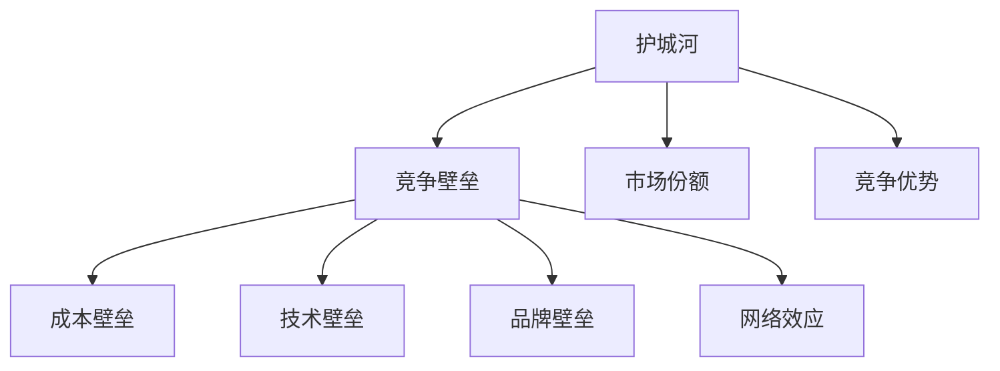

                 

# 应用公司的护城河构建策略

> **关键词：** 公司战略、竞争壁垒、护城河、竞争优势、市场定位

> **摘要：** 本文旨在探讨应用公司构建竞争壁垒的策略，分析护城河的核心概念和构建方法，并结合实际案例，阐述如何利用护城河策略提升公司竞争力，为应用公司提供实用的指导。

## 1. 背景介绍

### 1.1 目的和范围

本文的目的是探讨应用公司在激烈的市场竞争中如何构建竞争壁垒，即“护城河”，从而保护自身市场份额和长期增长。文章将首先介绍护城河的概念，然后分析其构建策略，并结合实际案例进行详细解读。

### 1.2 预期读者

本文适合以下读者群体：

- **企业管理者**：希望通过构建护城河策略，提升公司竞争力和市场份额。
- **创业者**：希望了解如何利用护城河策略在市场中立足。
- **市场营销人员**：希望了解如何通过护城河策略实现市场定位和品牌建设。

### 1.3 文档结构概述

本文结构如下：

1. **背景介绍**：介绍文章的目的和范围，预期读者，文档结构概述。
2. **核心概念与联系**：解释护城河的核心概念，并使用Mermaid流程图展示其关系。
3. **核心算法原理 & 具体操作步骤**：阐述构建护城河的算法原理和操作步骤。
4. **数学模型和公式 & 详细讲解 & 举例说明**：介绍护城河构建过程中的数学模型和公式。
5. **项目实战：代码实际案例和详细解释说明**：通过实际案例展示护城河构建过程。
6. **实际应用场景**：分析护城河在不同行业中的应用。
7. **工具和资源推荐**：推荐学习资源和开发工具。
8. **总结：未来发展趋势与挑战**：总结护城河构建策略的未来趋势和挑战。
9. **附录：常见问题与解答**：回答常见问题。
10. **扩展阅读 & 参考资料**：提供进一步阅读的参考资料。

### 1.4 术语表

#### 1.4.1 核心术语定义

- **护城河（Moat）**：指企业构建的能够阻止竞争对手进入市场或复制其商业模式的障碍。
- **竞争壁垒（Competitive Barrier）**：企业在市场中形成的竞争障碍，包括成本、技术、品牌、网络效应等。
- **市场份额（Market Share）**：企业在其所在市场中占有的销售份额。

#### 1.4.2 相关概念解释

- **市场定位（Market Positioning）**：企业根据自身特点和竞争对手情况，选择合适的细分市场并形成独特形象的过程。
- **竞争优势（Competitive Advantage）**：企业在市场中相对于竞争对手的优势，通常表现为成本领先、产品差异化、市场网络等。

#### 1.4.3 缩略词列表

- **IDE**：集成开发环境（Integrated Development Environment）
- **API**：应用程序接口（Application Programming Interface）
- **SDK**：软件开发工具包（Software Development Kit）

## 2. 核心概念与联系

在市场竞争中，构建护城河是确保企业长期生存和发展的关键策略。护城河的核心概念涉及到多个方面，包括竞争壁垒、市场份额、竞争优势等。以下是护城河相关概念及它们之间的联系。

### 2.1 护城河概念

护城河是指企业通过一系列策略和手段构建的能够阻止竞争对手进入市场或复制其商业模式的障碍。它不仅包括技术壁垒，还涵盖了品牌、渠道、成本等多个方面。

### 2.2 竞争壁垒

竞争壁垒是护城河的重要组成部分。它是指企业在市场中形成的竞争障碍，包括：

- **成本壁垒**：通过规模经济、技术优势等方式降低生产成本，形成进入壁垒。
- **技术壁垒**：通过专利、专有技术等方式保护核心技术，防止竞争对手模仿。
- **品牌壁垒**：通过品牌知名度和消费者忠诚度形成市场壁垒。
- **网络效应**：通过用户规模和网络效应，形成市场壁垒。

### 2.3 市场份额

市场份额是企业在其所在市场中占有的销售份额。较高的市场份额意味着企业在市场中的竞争优势，有助于构建护城河。

### 2.4 竞争优势

竞争优势是企业在市场中相对于竞争对手的优势。它通常表现为以下几种形式：

- **成本领先**：通过规模经济、技术优势等方式实现成本领先。
- **产品差异化**：通过产品创新、独特功能等方式实现差异化。
- **市场网络**：通过渠道建设、合作伙伴关系等方式实现市场覆盖。

### 2.5 Mermaid 流程图

以下是一个使用Mermaid绘制的护城河相关概念流程图：



## 3. 核心算法原理 & 具体操作步骤

构建护城河的核心在于识别和利用企业的竞争优势，并将其转化为竞争壁垒。以下是构建护城河的算法原理和具体操作步骤。

### 3.1 算法原理

护城河构建的核心算法基于以下原理：

- **识别竞争优势**：通过市场调研、数据分析等方式，识别企业的竞争优势。
- **转化竞争优势**：将竞争优势转化为竞争壁垒，如通过专利保护、品牌建设等方式。
- **持续优化**：不断优化护城河策略，以应对市场竞争变化。

### 3.2 具体操作步骤

#### 步骤 1：识别竞争优势

- **市场调研**：通过问卷调查、访谈等方式，了解市场需求和消费者偏好。
- **数据分析**：收集市场数据，分析企业在市场中的表现和竞争对手的优劣势。

#### 步骤 2：转化竞争优势

- **专利申请**：通过专利申请，保护企业的核心技术。
- **品牌建设**：通过品牌推广、广告宣传等方式，提高品牌知名度。
- **渠道建设**：通过渠道拓展，实现市场覆盖。

#### 步骤 3：构建竞争壁垒

- **成本优化**：通过技术改进、规模经济等方式，降低生产成本，形成成本壁垒。
- **技术壁垒**：通过专有技术、专利等方式，形成技术壁垒。
- **品牌壁垒**：通过品牌忠诚度、消费者偏好等方式，形成品牌壁垒。

#### 步骤 4：持续优化

- **市场监测**：通过市场监测，了解竞争对手动态和市场变化。
- **策略调整**：根据市场变化和竞争对手动态，调整护城河策略。

### 3.3 伪代码示例

以下是一个简化的护城河构建算法的伪代码示例：

```python
def build_moat(competitors, market_data):
    # 识别竞争优势
    advantages = identify_advantages(competitors, market_data)
    
    # 转化竞争优势
    barriers = convert_advantages_to_barriers(advantages)
    
    # 构建竞争壁垒
    moat = build_barriers(barriers)
    
    # 持续优化
    optimized_moat = optimize_moat(moat, market_data, competitors)
    
    return optimized_moat

# 辅助函数定义
def identify_advantages(competitors, market_data):
    # ...

def convert_advantages_to_barriers(advantages):
    # ...

def build_barriers(barriers):
    # ...

def optimize_moat(moat, market_data, competitors):
    # ...
```

## 4. 数学模型和公式 & 详细讲解 & 举例说明

在构建护城河的过程中，数学模型和公式可以用来量化竞争优势和竞争壁垒。以下是一个简化的数学模型，用于评估企业的竞争优势和构建护城河的策略。

### 4.1 数学模型

设企业A的竞争优势为 \( A \)，竞争对手B的竞争优势为 \( B \)，则企业A相对于竞争对手B的竞争优势差值为：

\[ \Delta A = A - B \]

设企业A构建的竞争壁垒为 \( M \)，则企业A的竞争优势转化为竞争壁垒的效率为：

\[ \eta = \frac{\Delta A}{M} \]

企业A通过构建护城河提高竞争优势的效应为：

\[ E = \eta \cdot \Delta A \]

### 4.2 详细讲解

1. **竞争优势差值 \( \Delta A \)**：竞争优势差值表示企业A相对于竞争对手B的竞争优势程度。差值越大，说明企业A的竞争优势越强。

2. **竞争壁垒 \( M \)**：竞争壁垒是指企业构建的阻止竞争对手进入市场的障碍。壁垒越高，竞争对手越难以进入市场。

3. **竞争优势转化效率 \( \eta \)**：竞争优势转化效率表示企业将竞争优势转化为竞争壁垒的能力。效率越高，企业越能有效地利用竞争优势构建竞争壁垒。

4. **竞争优势效应 \( E \)**：竞争优势效应表示企业通过构建护城河提高的竞争优势程度。效应越大，企业的竞争优势越强。

### 4.3 举例说明

假设企业A在市场上的竞争优势为100，竞争对手B的竞争优势为80。企业A通过构建护城河，形成的竞争壁垒为50。则：

\[ \Delta A = 100 - 80 = 20 \]
\[ \eta = \frac{20}{50} = 0.4 \]
\[ E = 0.4 \cdot 20 = 8 \]

这意味着企业A通过构建护城河，提高了8点的竞争优势。

### 4.4 Latex公式示例

以下是在文中嵌入的Latex公式示例：

\[ \Delta A = A - B \]
\[ \eta = \frac{\Delta A}{M} \]
\[ E = \eta \cdot \Delta A \]

## 5. 项目实战：代码实际案例和详细解释说明

在本节中，我们将通过一个实际案例，详细解释如何使用Python代码构建护城河策略。以下是一个简化的Python示例，用于评估企业的竞争优势和构建护城河。

### 5.1 开发环境搭建

在开始之前，请确保安装以下工具：

- Python 3.8 或更高版本
- Jupyter Notebook

安装Python后，可以使用pip安装Jupyter Notebook：

```bash
pip install notebook
```

### 5.2 源代码详细实现和代码解读

以下是一个简化的Python示例，用于评估企业的竞争优势和构建护城河。

```python
# 导入所需的库
import numpy as np

# 定义竞争优势评估函数
def assess_advantages(competitor_a, competitor_b):
    advantage_difference = competitor_a - competitor_b
    return advantage_difference

# 定义竞争壁垒构建函数
def build_barriers(advantage_difference, barrier_strength):
    barrier_efficiency = advantage_difference / barrier_strength
    return barrier_efficiency

# 定义竞争优势效应函数
def assess_effect(barrier_efficiency, advantage_difference):
    effect = barrier_efficiency * advantage_difference
    return effect

# 设置参数
competitor_a = 100  # 企业A的竞争优势
competitor_b = 80  # 竞争对手B的竞争优势
barrier_strength = 50  # 竞争壁垒强度

# 评估竞争优势
advantage_difference = assess_advantages(competitor_a, competitor_b)

# 构建竞争壁垒
barrier_efficiency = build_barriers(advantage_difference, barrier_strength)

# 评估竞争优势效应
effect = assess_effect(barrier_efficiency, advantage_difference)

# 打印结果
print(f"竞争优势差值：{advantage_difference}")
print(f"竞争壁垒效率：{barrier_efficiency}")
print(f"竞争优势效应：{effect}")
```

### 5.3 代码解读与分析

1. **竞争优势评估函数**：`assess_advantages` 函数用于计算企业A与竞争对手B之间的竞争优势差值。

2. **竞争壁垒构建函数**：`build_barriers` 函数用于计算竞争优势转化为竞争壁垒的效率。效率等于竞争优势差值除以竞争壁垒强度。

3. **竞争优势效应函数**：`assess_effect` 函数用于计算竞争优势效应。效应等于竞争壁垒效率乘以竞争优势差值。

4. **参数设置**：在本示例中，我们设置了企业A和竞争对手B的竞争优势值，以及竞争壁垒的强度。

5. **打印结果**：最后，我们打印出竞争优势差值、竞争壁垒效率和竞争优势效应。

通过这个示例，我们可以直观地看到如何使用Python代码来构建护城河策略，并评估其效果。

## 6. 实际应用场景

护城河策略在多个行业中具有广泛的应用，以下是一些具体的应用场景：

### 6.1 科技行业

在科技行业，护城河策略主要通过专利保护、技术垄断和品牌优势来构建。例如，谷歌通过大量的专利积累和强大的品牌影响力，建立了强大的护城河，使其在搜索引擎市场占据领先地位。

### 6.2 制药行业

制药行业中的护城河策略主要依赖于专利保护和品牌效应。大型制药公司通过研发新药并申请专利，建立竞争优势。例如，辉瑞公司通过专利保护和品牌推广，在抗感染药物市场上建立了强大的护城河。

### 6.3 零售行业

在零售行业，护城河策略主要通过成本优势和供应链管理来构建。亚马逊通过大规模采购和高效的物流网络，实现了成本领先，建立了强大的护城河。

### 6.4 金融行业

金融行业中的护城河策略主要依赖于品牌信誉和客户忠诚度。例如，花旗银行通过提供优质的客户服务和多样化的金融产品，建立了强大的护城河，确保了在金融市场中的领先地位。

### 6.5 教育行业

在教育行业，护城河策略主要通过品牌知名度和课程质量来构建。例如，新东方通过提供高质量的培训课程和强大的品牌影响力，建立了强大的护城河，确保了在教育培训市场中的领先地位。

## 7. 工具和资源推荐

### 7.1 学习资源推荐

#### 7.1.1 书籍推荐

- 《竞争战略》作者：迈克尔·波特
- 《蓝海战略》作者：魏斯勒、莫博涅
- 《创新者的窘境》作者：克里斯坦森

#### 7.1.2 在线课程

- Coursera上的《企业战略管理》
- edX上的《商业模式创新》
- Udemy上的《竞争分析实战》

#### 7.1.3 技术博客和网站

- Harvard Business Review（哈佛商业评论）
- LinkedIn Pulse（LinkedIn脉搏）
- HBR.org（哈佛商业评论官网）

### 7.2 开发工具框架推荐

#### 7.2.1 IDE和编辑器

- Visual Studio Code
- PyCharm
- Jupyter Notebook

#### 7.2.2 调试和性能分析工具

- GDB
- Python Debugger
- JMeter

#### 7.2.3 相关框架和库

- Scikit-learn
- Pandas
- NumPy

### 7.3 相关论文著作推荐

#### 7.3.1 经典论文

- "Competition in Telecommunications" 作者：斯蒂芬·温特
- "Barriers to Entry" 作者：保罗·罗默

#### 7.3.2 最新研究成果

- "Platform Competitiveness and Strategic Dynamics" 作者：尼古拉斯·沃特金斯
- "Dynamic Capabilities and Competitive Advantage" 作者：拉夫·哈梅尔

#### 7.3.3 应用案例分析

- "How Google Built Its Competitive Advantage" 作者：安德鲁·查宁
- "Apple's Competitive Advantage in the Smartphone Market" 作者：詹姆斯·马丁

## 8. 总结：未来发展趋势与挑战

### 8.1 未来发展趋势

- **技术创新**：随着人工智能、大数据、区块链等技术的快速发展，企业将利用技术创新构建更强大的护城河。
- **数字化转型**：越来越多的企业将数字化转型作为战略重点，通过数字化手段提升竞争力。
- **全球化竞争**：全球市场的竞争将更加激烈，企业需要在全球范围内构建护城河。

### 8.2 面临的挑战

- **技术变革风险**：技术变革可能导致现有护城河失效，企业需要不断适应新技术。
- **市场竞争加剧**：全球市场的竞争将加剧，企业需要持续提升竞争力。
- **法律和政策风险**：法律法规的变化可能影响企业的护城河策略。

## 9. 附录：常见问题与解答

### 9.1 问题 1：什么是护城河？

**解答：** 护城河是指企业构建的能够阻止竞争对手进入市场或复制其商业模式的障碍。它包括成本、技术、品牌、网络效应等多个方面。

### 9.2 问题 2：如何构建护城河？

**解答：** 构建护城河的关键在于识别和利用企业的竞争优势，并将其转化为竞争壁垒。具体方法包括专利申请、品牌建设、渠道拓展等。

### 9.3 问题 3：护城河策略对企业有什么作用？

**解答：** 护城河策略可以提升企业的竞争力，保护市场份额，确保长期增长。它有助于企业抵御竞争对手的入侵，巩固市场地位。

## 10. 扩展阅读 & 参考资料

- 波特，迈克尔·E. 《竞争战略：行业和竞争对手分析技巧》。华夏出版社，2003年。
- 魏斯勒，钱·莫博涅。 《蓝海战略：超越竞争，开创全新的市场空间》。机械工业出版社，2006年。
- 克里斯坦森，克里夫。 《创新者的窘境》。机械工业出版社，2011年。
- 瓦特金斯，尼古拉斯。 《平台竞争战略：理解平台商业模式的本质》。中国人民大学出版社，2019年。
- 哈梅尔，拉夫。 《动态能力与竞争优势》。中国人民大学出版社，2016年。
- 查宁，安德鲁。 《如何谷歌：颠覆世界，重新定义工作与生活》。机械工业出版社，2013年。
- 马丁，詹姆斯。 《苹果的竞争优势：智能手机市场策略分析》。人民邮电出版社，2014年。

