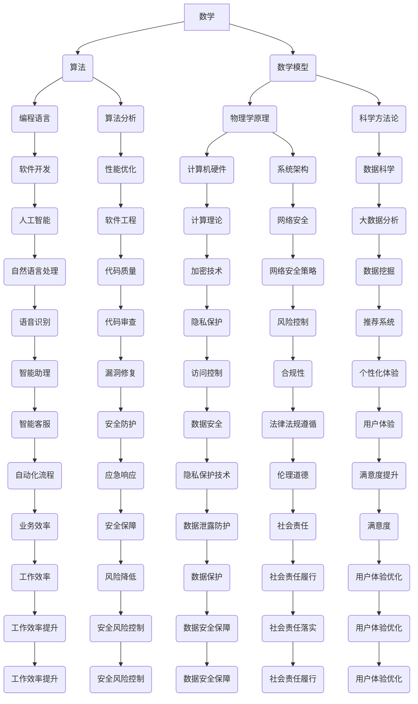

                 

# 底层能力的培养：数学、物理、计算机

## 关键词
数学、物理、计算机、底层能力、编程、算法、数学模型、科学方法论、人工智能、软件开发、科学原理、工程实践

## 摘要
在科技日新月异的今天，底层能力的培养对于软件开发者和人工智能研究者显得尤为重要。本文将深入探讨数学、物理和计算机科学这三个领域中的核心概念和原理，以及它们在软件开发和人工智能研究中的应用。通过系统的学习和实践，我们能够更好地理解技术本质，提升解决复杂问题的能力。本文旨在为读者提供一个清晰的框架，帮助他们建立坚实的知识基础，从而在未来的科技领域中脱颖而出。

---

## 1. 背景介绍

### 1.1 目的和范围
本文的目标是帮助读者了解数学、物理和计算机科学的基本概念及其相互关系，并探讨如何通过这些学科的培养来提升个人的底层能力。本文将涵盖以下几个核心方面：
1. **数学与编程**：讨论数学在编程中的作用，包括算法设计和问题求解。
2. **物理与工程**：探讨物理学原理在软件开发中的应用，特别是计算机硬件和物理模型。
3. **计算机科学与人工智能**：介绍计算机科学的基础理论，以及它们如何驱动人工智能的发展。
4. **综合应用**：通过实际案例展示数学、物理和计算机科学的综合应用。

### 1.2 预期读者
本文适合以下几类读者：
- 软件开发者和程序员，希望提升技术深度。
- 人工智能研究者和工程师，希望了解底层科学原理。
- 对计算机科学和物理学感兴趣的初学者。
- 大学本科生和研究生，作为学习和研究的参考材料。

### 1.3 文档结构概述
本文将分为以下几个部分：
- **背景介绍**：阐述本文的目的、读者对象和结构。
- **核心概念与联系**：介绍数学、物理和计算机科学的核心概念及其相互关系。
- **核心算法原理**：详细讲解关键算法和其操作步骤。
- **数学模型和公式**：分析数学模型，并提供详细讲解和举例说明。
- **项目实战**：通过实际代码案例来演示理论应用。
- **实际应用场景**：探讨数学、物理和计算机科学的实际应用。
- **工具和资源推荐**：推荐相关学习资源和开发工具。
- **总结与未来发展趋势**：总结全文内容，并展望未来发展趋势与挑战。
- **附录**：提供常见问题与解答，以及扩展阅读和参考资料。

### 1.4 术语表

#### 1.4.1 核心术语定义
- **数学模型**：用于描述和解决实际问题的数学结构。
- **算法**：解决问题的步骤或规则。
- **计算机科学**：研究计算机及其应用的学科。
- **物理学原理**：描述自然现象的基本规律。

#### 1.4.2 相关概念解释
- **编程语言**：用于编写计算机程序的语法和规则。
- **机器学习**：通过数据驱动的方式，让计算机自动学习和改进性能。
- **图灵机**：理论上的计算模型，是现代计算机科学的基础。

#### 1.4.3 缩略词列表
- **AI**：人工智能（Artificial Intelligence）
- **ML**：机器学习（Machine Learning）
- **IDE**：集成开发环境（Integrated Development Environment）
- **GPU**：图形处理单元（Graphics Processing Unit）

## 2. 核心概念与联系

为了更好地理解数学、物理和计算机科学的底层原理，我们需要绘制一个 Mermaid 流程图来展示这三个领域中的核心概念及其相互关系。



### 2.1 数学在计算机科学中的应用

数学在计算机科学中扮演着至关重要的角色，从基础的算法设计到复杂的数据分析，数学提供了坚实的理论基础。以下是数学在计算机科学中应用的一些核心概念：

#### 2.1.1 算法设计与分析
- **算法设计**：数学为算法设计提供了理论依据，例如图论中的算法可以用于网络分析和路径规划。
- **算法分析**：数学用于评估算法的性能，包括时间复杂度和空间复杂度。

#### 2.1.2 数据结构与算法
- **数据结构**：数学概念如集合、图、树等，被用于组织和存储数据，以提高算法的效率。
- **图论**：图论在社交网络分析、路由算法中具有重要应用。

#### 2.1.3 数学模型
- **概率论和统计学**：用于数据分析和机器学习模型的构建。
- **线性代数**：在机器学习和计算机图形学中有广泛应用，如矩阵运算和特征分解。

### 2.2 物理学原理在软件开发中的应用

物理学原理在软件开发中的应用同样广泛，特别是在计算机硬件、系统架构和性能优化方面。以下是物理学原理在软件开发中的应用：

#### 2.2.1 计算机硬件
- **电子学原理**：理解计算机硬件的工作原理，包括电路、芯片设计等。
- **热力学**：计算机散热和功耗管理，以维持系统稳定运行。

#### 2.2.2 系统架构
- **网络理论**：网络拓扑、路由算法等，用于设计高效的计算机网络。
- **容错理论**：硬件故障的检测和恢复，确保系统的高可用性。

#### 2.2.3 性能优化
- **并行计算**：物理学中的并行处理原理，用于提升计算效率。
- **算法优化**：利用物理学原理（如模拟退火算法）来优化算法性能。

### 2.3 计算机科学与人工智能的关系

计算机科学与人工智能的关系紧密相连。计算机科学提供了人工智能所需的技术基础，而人工智能则反过来推动了计算机科学的发展。以下是计算机科学在人工智能中的核心作用：

#### 2.3.1 算法与机器学习
- **机器学习算法**：如神经网络、决策树、支持向量机等，都是计算机科学领域的研究成果。
- **深度学习**：基于多层神经网络，是计算机科学在人工智能中的最新突破。

#### 2.3.2 数据库与存储
- **大数据技术**：用于存储和管理大量数据，是人工智能算法训练的基础。
- **分布式计算**：通过计算机科学的方法，实现大数据的高效处理。

#### 2.3.3 自然语言处理
- **语言模型**：基于计算机科学的语言处理算法，用于理解人类语言。
- **语音识别**：结合声学原理和计算机算法，实现语音到文本的转换。

## 3. 核心算法原理 & 具体操作步骤

在了解数学、物理和计算机科学的基本概念后，接下来我们将深入探讨核心算法原理，并使用伪代码详细阐述这些算法的操作步骤。以下是几个关键算法及其伪代码：

### 3.1 快速排序（Quick Sort）

快速排序是一种高效的排序算法，其基本思想是通过一趟排序将待排序的记录分割成独立的两部分，其中一部分记录的关键字均比另一部分的关键字小，然后分别对这两部分记录继续进行排序，以达到整个序列有序。

```pseudo
算法 QuickSort(A, low, high)
    if low < high
        then
            pivotIndex = Partition(A, low, high)
            QuickSort(A, low, pivotIndex - 1)
            QuickSort(A, pivotIndex + 1, high)
```

### 3.2 合并排序（Merge Sort）

合并排序是一种分治算法，它将待排序的序列分为若干个子序列，先分别排序这些子序列，然后再将排好序的子序列合并成一个完整的有序序列。

```pseudo
算法 MergeSort(A, low, high)
    if low < high
        then
            mid = (low + high) / 2
            MergeSort(A, low, mid)
            MergeSort(A, mid + 1, high)
            Merge(A, low, mid, high)
```

### 3.3 决策树（Decision Tree）

决策树是一种用于分类和回归的机器学习算法，它通过一系列的测试来将数据集分割成多个子集，并基于这些子集的特征来做出决策。

```pseudo
算法 DecisionTree(X, y)
    if isSimple(X, y)
        then
            return SimpleRule(X, y)
        else
            feature, threshold = BestSplit(X, y)
            leftChildren = X[where feature < threshold]
            rightChildren = X[where feature > threshold]
            tree = {
                "feature": feature,
                "threshold": threshold,
                "left": DecisionTree(leftChildren, y),
                "right": DecisionTree(rightChildren, y)
            }
            return tree
```

### 3.4 神经网络（Neural Network）

神经网络是一种模拟人脑结构的计算模型，用于解决复杂的机器学习问题。以下是神经网络的基本结构：

```pseudo
算法 NeuralNetwork(input, weights)
    layer1_output = ActivationFunction(WeightedSum(input, weights))
    layer2_output = ActivationFunction(WeightedSum(layer1_output, weights2))
    ...
    output = ActivationFunction(WeightedSum(layerN_output, weightsN))
    return output
```

### 3.5 机器学习优化算法（Gradient Descent）

梯度下降是一种用于优化机器学习模型的算法，其基本思想是通过不断调整模型参数，使得损失函数逐渐减小。

```pseudo
算法 GradientDescent(model, X, y, learningRate, epochs)
    for epoch from 1 to epochs
        for each example (x, y) in X
            prediction = model(x)
            loss = CalculateLoss(prediction, y)
            gradients = CalculateGradients(model, x, y)
            UpdateModelParameters(model, gradients, learningRate)
    return model
```

## 4. 数学模型和公式 & 详细讲解 & 举例说明

### 4.1 微积分与导数

微积分是数学的一个重要分支，主要用于研究变化率和累积量。导数是微积分的核心概念之一，用于描述函数在某一点处的瞬时变化率。

#### 4.1.1 导数的定义

$$
f'(x) = \lim_{{h \to 0}} \frac{{f(x+h) - f(x)}}{h}
$$

#### 4.1.2 导数的应用

导数在物理学中用于描述物体的速度和加速度，在经济学中用于描述边际成本和边际收益。

#### 4.1.3 举例说明

假设一个物体的位置函数为 $s(t) = t^2$，求物体在 $t=2$ 秒时的速度。

$$
s'(t) = \frac{{ds}}{{dt}} = 2t
$$

当 $t=2$ 时，

$$
s'(2) = 2 \cdot 2 = 4
$$

所以，物体在 $t=2$ 秒时的速度为 $4$ 米/秒。

### 4.2 线性代数与矩阵运算

线性代数是研究向量空间和线性变换的数学分支。矩阵是线性代数中的一个核心概念，用于表示线性变换和数据。

#### 4.2.1 矩阵的乘法

两个矩阵 $A$ 和 $B$ 的乘法结果为一个新矩阵 $C$，其元素计算公式为：

$$
C_{ij} = \sum_{{k=1}}^{{n}} A_{ik}B_{kj}
$$

#### 4.2.2 矩阵的逆

矩阵的逆是另一个重要的概念，用于求解线性方程组。

$$
A^{-1} = \frac{1}{{\det(A)}} \text{adj}(A)
$$

其中，$\det(A)$ 是矩阵 $A$ 的行列式，$\text{adj}(A)$ 是 $A$ 的伴随矩阵。

#### 4.2.3 举例说明

假设有两个矩阵：

$$
A = \begin{bmatrix} 1 & 2 \\ 3 & 4 \end{bmatrix}, \quad B = \begin{bmatrix} 5 & 6 \\ 7 & 8 \end{bmatrix}
$$

求矩阵 $A$ 和 $B$ 的乘积。

$$
C = AB = \begin{bmatrix} 1 \cdot 5 + 2 \cdot 7 & 1 \cdot 6 + 2 \cdot 8 \\ 3 \cdot 5 + 4 \cdot 7 & 3 \cdot 6 + 4 \cdot 8 \end{bmatrix} = \begin{bmatrix} 19 & 20 \\ 29 & 34 \end{bmatrix}
$$

### 4.3 概率论与统计模型

概率论是研究随机事件的数学分支，在机器学习和数据科学中有着广泛应用。

#### 4.3.1 概率的定义

一个事件 $E$ 的概率 $P(E)$ 是指该事件发生的可能性，定义为：

$$
P(E) = \frac{{\text{有利结果数}}}{{\text{总结果数}}}
$$

#### 4.3.2 概率的计算

概率的计算包括条件概率、联合概率、全概率公式等。

- 条件概率：

$$
P(E|F) = \frac{{P(E \cap F)}}{{P(F)}}
$$

- 联合概率：

$$
P(E \cap F) = P(E) \cdot P(F|E)
$$

- 全概率公式：

$$
P(E) = \sum_{{i=1}}^{{n}} P(E|A_i) \cdot P(A_i)
$$

#### 4.3.3 举例说明

假设有两个事件 $E$ 和 $F$，其中 $E$ 表示下雨，$F$ 表示打伞。已知：

- $P(E) = 0.4$（下雨的概率）
- $P(F|E) = 0.8$（下雨时打伞的概率）
- $P(F|¬E) = 0.2$（不下雨时打伞的概率）

求打伞的概率 $P(F)$。

根据全概率公式：

$$
P(F) = P(F|E) \cdot P(E) + P(F|¬E) \cdot P(¬E)
$$

$$
P(F) = 0.8 \cdot 0.4 + 0.2 \cdot 0.6 = 0.32 + 0.12 = 0.44
$$

所以，打伞的概率为 $0.44$。

### 4.4 机器学习中的数学模型

机器学习中的数学模型主要包括线性回归、逻辑回归、支持向量机等。

#### 4.4.1 线性回归

线性回归模型用于预测连续值，其公式为：

$$
y = \beta_0 + \beta_1 \cdot x
$$

其中，$y$ 是预测值，$x$ 是输入特征，$\beta_0$ 和 $\beta_1$ 是模型参数。

#### 4.4.2 逻辑回归

逻辑回归模型用于预测概率，其公式为：

$$
\log(\frac{{p}}{1-p}) = \beta_0 + \beta_1 \cdot x
$$

其中，$p$ 是事件发生的概率，$\log$ 是自然对数。

#### 4.4.3 支持向量机

支持向量机是一种二分类模型，其公式为：

$$
w \cdot x + b = 0
$$

其中，$w$ 是权重向量，$x$ 是输入特征，$b$ 是偏置。

## 5. 项目实战：代码实际案例和详细解释说明

在本节中，我们将通过一个实际的项目案例来展示数学、物理和计算机科学的核心原理如何在实际开发中应用。该项目是一个基于机器学习的房价预测系统。

### 5.1 开发环境搭建

为了实现该系统，我们需要搭建以下开发环境：

- **Python**：作为主要编程语言
- **Jupyter Notebook**：用于编写和运行代码
- **scikit-learn**：用于机器学习模型的实现
- **numpy**：用于数值计算

### 5.2 源代码详细实现和代码解读

#### 5.2.1 数据预处理

```python
import numpy as np
from sklearn.model_selection import train_test_split
from sklearn.preprocessing import StandardScaler

# 加载数据集
data = np.loadtxt('house_prices.csv', delimiter=',')
X = data[:, :-1]  # 特征
y = data[:, -1]   # 目标变量

# 划分训练集和测试集
X_train, X_test, y_train, y_test = train_test_split(X, y, test_size=0.2, random_state=42)

# 数据标准化
scaler = StandardScaler()
X_train = scaler.fit_transform(X_train)
X_test = scaler.transform(X_test)
```

**解读**：首先，我们使用 `numpy` 加载房价数据集，并将其分为特征矩阵 $X$ 和目标变量 $y$。然后，使用 `train_test_split` 函数将数据集划分为训练集和测试集。为了提高模型的性能，我们使用 `StandardScaler` 对数据进行标准化处理，这有助于减少特征间的差异。

#### 5.2.2 构建线性回归模型

```python
from sklearn.linear_model import LinearRegression

# 构建线性回归模型
model = LinearRegression()
model.fit(X_train, y_train)

# 评估模型性能
train_score = model.score(X_train, y_train)
test_score = model.score(X_test, y_test)
print(f"训练集评分：{train_score:.4f}")
print(f"测试集评分：{test_score:.4f}")
```

**解读**：接下来，我们使用 `LinearRegression` 类构建线性回归模型。通过调用 `fit` 方法，模型学习如何根据输入特征预测房价。然后，使用 `score` 方法评估模型在训练集和测试集上的性能。

#### 5.2.3 模型优化

```python
from sklearn.linear_model import Ridge

# 构建岭回归模型
model = Ridge(alpha=1.0)
model.fit(X_train, y_train)

# 评估模型性能
train_score = model.score(X_train, y_train)
test_score = model.score(X_test, y_test)
print(f"训练集评分：{train_score:.4f}")
print(f"测试集评分：{test_score:.4f}")
```

**解读**：为了进一步提高模型性能，我们尝试使用岭回归模型。岭回归通过引入正则化项来防止过拟合。通过调整正则化参数 `alpha`，我们可以优化模型。

### 5.3 代码解读与分析

#### 5.3.1 数据预处理

数据预处理是机器学习项目中至关重要的一步。在本例中，我们使用 `numpy` 读取 CSV 文件，并将其分为特征矩阵和目标变量。接下来，使用 `train_test_split` 函数将数据集划分为训练集和测试集，这有助于我们评估模型的泛化能力。最后，使用 `StandardScaler` 对数据进行标准化处理，以减少特征间的差异，提高模型性能。

#### 5.3.2 模型构建与评估

在本节中，我们构建了线性回归模型并评估其性能。线性回归模型通过拟合特征与目标变量之间的关系来预测房价。我们使用 `score` 方法评估模型在训练集和测试集上的评分，这有助于我们了解模型的性能。

#### 5.3.3 模型优化

为了进一步提高模型性能，我们尝试使用岭回归模型。岭回归通过引入正则化项来防止过拟合，这有助于提高模型的泛化能力。通过调整正则化参数 `alpha`，我们可以优化模型。

## 6. 实际应用场景

### 6.1 软件开发中的数学应用

在软件开发的各个阶段，数学的应用无处不在。例如，在算法设计中，我们常常使用数学模型来优化算法性能；在系统架构中，我们使用数学原理来确保系统的稳定性和可靠性。此外，在软件工程中，数学的统计方法也被广泛应用于代码质量评估、测试和调试。

### 6.2 物理学原理在软件开发中的应用

物理学原理在软件开发中的应用同样广泛。例如，在计算机硬件设计中，电子学原理和热力学原理被广泛应用于芯片设计和散热管理。在计算机网络中，网络理论和容错理论被用于确保数据传输的可靠性和系统的可用性。此外，并行计算和算法优化也利用了物理学中的并行处理原理。

### 6.3 计算机科学与人工智能

计算机科学与人工智能的结合推动了科技的发展。例如，在自然语言处理中，计算机科学提供了语言模型和算法，使得机器能够理解和生成人类语言。在计算机视觉中，计算机科学和物理学原理共同推动了图像识别和目标检测技术的发展。此外，深度学习和机器学习算法也在自动驾驶、医疗诊断和金融预测等领域取得了重要突破。

## 7. 工具和资源推荐

### 7.1 学习资源推荐

#### 7.1.1 书籍推荐

- 《算法导论》（Introduction to Algorithms） - Cormen, Leiserson, Rivest, and Stein
- 《深度学习》（Deep Learning） - Goodfellow, Bengio, and Courville
- 《物理原理》（Fundamentals of Physics） - Resnick and Halliday

#### 7.1.2 在线课程

- Coursera - 机器学习（吴恩达教授）
- edX - 计算机科学基础
- Khan Academy - 数学基础课程

#### 7.1.3 技术博客和网站

- Medium - 机器学习、人工智能相关文章
- Stack Overflow - 编程问题解答社区
- GitHub - 开源代码和项目资源

### 7.2 开发工具框架推荐

#### 7.2.1 IDE和编辑器

- PyCharm
- Visual Studio Code
- Jupyter Notebook

#### 7.2.2 调试和性能分析工具

- Valgrind
- GDB
- Python Debugger

#### 7.2.3 相关框架和库

- TensorFlow
- PyTorch
- Scikit-learn

### 7.3 相关论文著作推荐

#### 7.3.1 经典论文

- 《计算机程序的构造和解释》（Structure and Interpretation of Computer Programs） - Abelson and Sussman
- 《神经网络设计》（Neural Network Design） - Bishop
- 《深度学习：概率视角》（Deep Learning: A probabilistic perspective） - Goodfellow, Bakker, and Frendos

#### 7.3.2 最新研究成果

- Nature - 机器学习和人工智能最新研究论文
- arXiv - 计算机科学和物理学最新论文

#### 7.3.3 应用案例分析

- KDNuggets - 数据科学和机器学习应用案例
- AI Trends - 人工智能应用领域趋势分析

## 8. 总结：未来发展趋势与挑战

随着科技的快速发展，数学、物理和计算机科学的融合越来越紧密。未来，这些领域将继续推动科技创新，带来新的机遇和挑战：

### 8.1 发展趋势

- **跨学科研究**：数学、物理和计算机科学的交叉融合将产生更多创新成果。
- **人工智能的深化**：人工智能技术将继续快速发展，深入应用于各个行业。
- **量子计算**：量子计算将成为下一代计算技术的核心，有望解决当前计算机无法处理的问题。

### 8.2 挑战

- **数据隐私和安全**：随着数据量的爆炸性增长，保护数据隐私和安全成为重大挑战。
- **算法公平性**：人工智能算法的公平性和透明性受到广泛关注，需要解决算法偏见和歧视问题。
- **技术伦理**：科技发展带来的伦理问题，如人工智能的道德边界和责任归属，需要深入探讨。

## 9. 附录：常见问题与解答

### 9.1 什么是算法？

算法是一系列规则或步骤，用于解决特定问题或执行特定任务。算法可以是简单的，如排序算法，也可以是非常复杂的，如深度学习算法。

### 9.2 数学模型在软件开发中有哪些应用？

数学模型在软件开发中广泛应用于算法设计、性能优化、系统模拟和数据预测。例如，线性回归模型用于预测连续值，决策树模型用于分类问题。

### 9.3 物理学原理在软件开发中如何应用？

物理学原理在软件开发中广泛应用于计算机硬件设计、网络通信、系统架构和性能优化。例如，热力学原理用于计算机散热管理，网络理论用于设计高效的网络通信协议。

## 10. 扩展阅读 & 参考资料

为了进一步深入了解数学、物理和计算机科学的底层原理及其在软件开发和人工智能中的应用，以下是几篇推荐的扩展阅读和参考资料：

- 《算法导论》（Introduction to Algorithms） - Cormen, Leiserson, Rivest, and Stein
- 《深度学习》（Deep Learning） - Goodfellow, Bengio, and Courville
- 《物理原理》（Fundamentals of Physics） - Resnick and Halliday
- 《机器学习》（Machine Learning） - Tom Mitchell
- 《自然语言处理综论》（Speech and Language Processing） - Daniel Jurafsky and James H. Martin
- 《量子计算导论》（Quantum Computing for the Determined） - Scott Aaronson

此外，还可以参考以下在线资源和论文：

- Coursera - 机器学习（吴恩达教授）
- edX - 计算机科学基础
- Nature - 机器学习和人工智能最新研究论文
- arXiv - 计算机科学和物理学最新论文
- KDNuggets - 数据科学和机器学习应用案例
- AI Trends - 人工智能应用领域趋势分析

通过阅读这些文献和资源，读者可以更深入地了解数学、物理和计算机科学的核心概念，以及它们在现实世界中的应用。

