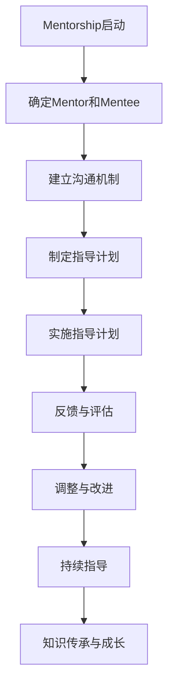

                 

# 建立mentorship文化：促进知识传承和成长

> **关键词：**mentorship文化、知识传承、个人成长、组织发展、技术传播

> **摘要：**本文将探讨在IT行业中建立mentorship文化的必要性和重要性，分析mentorship的基本概念、作用和实施方法。通过具体的实践案例和数学模型，阐述mentorship文化如何促进知识传承和个人的职业成长，为组织的发展提供新的视角和思路。

## 1. 背景介绍

### 1.1 目的和范围

本文旨在通过详细的剖析和实例，探讨在IT行业中如何建立和推广mentorship文化，从而促进知识传承和个人成长。本文将覆盖以下内容：

- Mentorship文化的定义和核心概念。
- Mentorship在知识传承和职业成长中的作用。
- 建立Mentorship文化的具体策略和方法。
- 实践案例和数学模型的运用。
- Mentorship文化在组织发展中的重要性。

### 1.2 预期读者

本文适合以下读者群体：

- IT行业的初级和中级开发人员，希望了解如何通过mentorship获得专业成长。
- 经验丰富的开发人员，愿意成为mentor，指导下一代程序员。
- IT经理和人力资源管理者，希望了解如何推动公司内部的知识传承和人才培养。
- 对于对知识管理和组织文化感兴趣的科研人员和从业者。

### 1.3 文档结构概述

本文将按照以下结构展开：

- **第1章**：背景介绍，包括目的、预期读者和文档结构概述。
- **第2章**：核心概念与联系，介绍Mentorship文化的基本概念和架构。
- **第3章**：核心算法原理 & 具体操作步骤，讲解Mentorship文化实施的具体方法。
- **第4章**：数学模型和公式 & 详细讲解 & 举例说明，运用数学工具分析Mentorship文化的效果。
- **第5章**：项目实战：代码实际案例和详细解释说明，通过实例展示Mentorship文化的应用。
- **第6章**：实际应用场景，探讨Mentorship文化在不同情境下的应用。
- **第7章**：工具和资源推荐，提供相关的学习资源和开发工具。
- **第8章**：总结：未来发展趋势与挑战，对Mentorship文化的未来进行展望。
- **第9章**：附录：常见问题与解答，解答读者可能遇到的疑问。
- **第10章**：扩展阅读 & 参考资料，提供进一步阅读的建议。

### 1.4 术语表

#### 1.4.1 核心术语定义

- Mentorship：一种指导与培养的关系，资深从业者（mentor）指导新手（mentee），帮助其成长。
- Mentor：经验丰富的指导者，负责传授知识、经验和技能。
- Mentee：被指导者，通常是初级或中级开发者，希望通过导师的指导加速职业成长。
- Knowledge Transfer：知识传承，指知识从一位专家转移到另一位新手的过程。

#### 1.4.2 相关概念解释

- **知识管理**：组织中知识的收集、存储、共享和应用过程。
- **组织发展**：组织通过优化结构、流程和文化，实现持续成长和创新能力提升的过程。

#### 1.4.3 缩略词列表

- IT：信息技术
- AI：人工智能
- ML：机器学习
- SDLC：软件开发生命周期

## 2. 核心概念与联系

在深入探讨如何建立Mentorship文化之前，我们首先需要明确几个核心概念及其相互之间的联系。

### 2.1 Mentorship文化的基本概念

Mentorship文化是一种组织文化，它鼓励和促进资深员工与初级员工之间的指导与培养关系。这种文化不仅关注个人的职业成长，也重视知识的传递和团队协作。

#### 2.1.1 Mentor角色

Mentor在Mentorship文化中扮演着至关重要的角色。他们通常具备丰富的经验、技能和知识，愿意分享自己的心得和见解。Mentor的主要职责包括：

- **提供职业指导**：帮助Mentee理解行业趋势、技术发展方向和职业规划。
- **传授技能和经验**：通过实践指导和案例分析，帮助Mentee提升技术水平。
- **职业发展支持**：为Mentee提供晋升机会、职业转换建议和人际网络。

#### 2.1.2 Mentee角色

Mentee是Mentorship文化中的受益者。他们通常是初级或中级开发人员，希望通过导师的指导加速自己的职业成长。Mentee的主要职责包括：

- **积极参与**：主动参与Mentor安排的活动和讨论，积极提问和学习。
- **反馈和反思**：定期与Mentor沟通，分享自己的学习进展和遇到的问题。
- **职业规划**：制定个人职业发展计划，并寻求Mentor的建议。

### 2.2 Mentorship文化的作用

Mentorship文化在组织中的多个层面发挥着重要作用，包括知识传承、个人成长和组织发展。

#### 2.2.1 知识传承

知识传承是Mentorship文化的核心目标之一。通过Mentor的指导，资深员工可以将自己的经验和知识传递给新手，确保组织的知识不断积累和更新。

- **隐性知识传递**：Mentor通过日常交流和实际操作，将难以书面化的隐性知识（如经验和直觉）传授给Mentee。
- **经验共享**：Mentor分享自己的成功和失败经验，帮助Mentee避免重复错误，更快地成长。

#### 2.2.2 个人成长

Mentorship文化对个人成长具有显著影响，尤其在职业发展方面。Mentee通过与Mentor的合作，可以获得以下益处：

- **技能提升**：通过实际项目和案例分析，Mentee能够迅速提升自己的技能和知识水平。
- **职业规划**：Mentor提供的职业指导和建议，有助于Mentee明确自己的职业发展方向和目标。
- **自信心增强**：在Mentor的支持和鼓励下，Mentee更加自信地面对职业挑战。

#### 2.2.3 组织发展

Mentorship文化对组织的发展具有重要意义。通过培养一批有能力的Mentee，组织可以实现以下目标：

- **知识储备**：通过知识传承，组织积累了丰富的内部知识资源，为未来的发展奠定基础。
- **团队协作**：Mentorship文化促进团队成员之间的交流和合作，提升团队的整体绩效。
- **创新能力**：通过不断引入新鲜的思想和观点，组织能够保持创新活力，适应快速变化的市场环境。

### 2.3 Mentorship文化在IT行业的具体实现

在IT行业，Mentorship文化的实现通常包括以下几种方式：

- **一对一直接指导**：Mentor和Mentee建立一对一的指导关系，定期进行面对面的交流和指导。
- **团队内部交流**：组织内部定期举办技术分享会、讨论会和案例研讨会，促进知识的共享和交流。
- **跨部门合作**：通过跨部门项目，不同部门的员工可以相互学习和借鉴，实现知识的交叉传递。

### 2.4 Mentorship文化的优势和挑战

#### 2.4.1 优势

- **促进知识传承**：Mentorship文化有助于组织内部知识的积累和传承，确保组织在快速发展中保持持续的知识优势。
- **提升员工能力**：Mentorship文化通过指导和支持，有助于员工快速提升专业技能和综合素质。
- **增强团队凝聚力**：通过Mentorship文化，团队成员之间的信任和合作得到加强，团队凝聚力显著提升。

#### 2.4.2 挑战

- **资源分配**：组织需要合理分配资源，确保Mentor和Mentee能够有足够的时间和精力进行指导和学习。
- **文化适应**：组织需要营造一个开放和包容的文化环境，让Mentor和Mentee能够自由交流和学习。
- **绩效评估**：如何评估Mentorship文化的效果，以及如何平衡Mentor和Mentee的绩效评估，是组织需要考虑的问题。

### 2.5 总结

Mentorship文化作为一种促进知识传承和职业成长的重要手段，在IT行业具有广泛的应用前景。通过建立和推广Mentorship文化，组织可以实现知识的积累、人才的培养和团队协作的提升，为组织的可持续发展奠定坚实的基础。

### 2.6 Mermaid流程图

下面是一个简化的Mentorship文化实现的流程图：



### 2.7 小结

在本章节中，我们详细介绍了Mentorship文化的基本概念、作用以及实现方法。通过流程图的展示，我们更加清晰地理解了Mentorship文化在组织内部的具体运作方式。接下来，我们将深入探讨如何具体实施Mentorship文化，以及它对个人和组织带来的实际影响。

## 3. 核心算法原理 & 具体操作步骤

### 3.1 Mentorship模型的构建

建立Mentorship文化，首先需要构建一个有效的Mentorship模型。这个模型需要明确Mentor和Mentee之间的互动方式、知识传递的流程以及反馈机制。以下是Mentorship模型的基本构建步骤：

#### 3.1.1 确定Mentor和Mentee

- **组织内部评估**：通过员工绩效评估、技能评估和兴趣评估，确定潜在的Mentor和Mentee。
- **双向选择**：Mentor和Mentee可以通过双向选择，确保双方都有兴趣和动力参与到Mentorship关系中。

#### 3.1.2 建立沟通机制

- **定期会议**：Mentor和Mentee应定期举行会议，讨论职业发展、技术学习进度和遇到的问题。
- **即时沟通**：通过电子邮件、即时消息或其他沟通工具，确保Mentee能够在遇到问题时及时获得帮助。

#### 3.1.3 制定指导计划

- **目标设定**：Mentor和Mentee应共同设定职业发展和技术学习目标。
- **时间规划**：根据目标，制定具体的学习和时间规划，确保Mentee能够在指导下有条不紊地提升自己的技能。

### 3.2 Mentorship过程的实施步骤

Mentorship过程的实施需要细致的规划和执行。以下是具体的操作步骤：

#### 3.2.1 指导计划制定

- **技能评估**：Mentor对Mentee的技能水平进行评估，了解其优势和不足。
- **目标设定**：Mentor和Mentee共同设定短期和长期的职业发展目标。
- **学习计划**：根据目标，Mentor制定详细的学习计划，包括技术培训、项目参与和知识分享。

#### 3.2.2 指导实施

- **技术培训**：Mentor通过现场培训、在线课程和技术文档，向Mentee传授所需技能。
- **项目参与**：Mentor可以安排Mentee参与实际项目，通过实践提升技能。
- **知识分享**：Mentor定期举办知识分享会，分享自己的经验和见解。

#### 3.2.3 反馈与调整

- **定期反馈**：Mentee定期向Mentor汇报学习进展和遇到的问题，Mentor提供反馈和建议。
- **计划调整**：根据反馈，Mentor和Mentee调整学习计划，确保目标能够实现。

### 3.3 Mentorship过程的伪代码描述

以下是一个简化的Mentorship过程的伪代码描述：

```pseudo
function MentorshipProcess(Mentor, Mentee):
    begin
        // Step 1: Establish Communication
        Mentor.sendWelcomeMessage(Mentee)
        Mentor.setupRegularMeetings(Mentee)

        // Step 2: Set Goals
        Mentor.assessMenteeSkillLevel(Mentee)
        Mentor_and_Mentee.setShortTermGoals(Mentee)
        Mentor_and_Mentee.setLongTermGoals(Mentee)

        // Step 3: Develop Learning Plan
        Mentor.createLearningPlan(Mentee)

        // Step 4: Implement Guidance
        Mentor.provideTechnicalTraining(Mentee)
        Mentor.assignProjectTasks(Mentee)
        Mentor.shareKnowledge(Mentee)

        // Step 5: Collect Feedback
        Mentor.collectMenteeFeedback(Mentee)

        // Step 6: Adjust and Improve
        Mentor.adjustLearningPlanBasedOnFeedback(Mentee)
        Mentor.continueGuidance(Mentee)
    end
```

### 3.4 小结

在本章节中，我们详细介绍了Mentorship模型的构建和具体实施步骤。通过伪代码的描述，我们更加清晰地理解了Mentorship文化在操作层面的具体实施过程。接下来，我们将运用数学模型和公式，对Mentorship文化的效果进行定量分析。

## 4. 数学模型和公式 & 详细讲解 & 举例说明

### 4.1 建立Mentorship效果的数学模型

为了更好地评估Mentorship文化在组织中的效果，我们可以运用数学模型和公式进行分析。以下是一个简化的Mentorship效果评估模型。

#### 4.1.1 变量定义

- **Mentee技能提升**：\( S_m \)：Mentee在参与Mentorship前后的技能水平差异。
- **Mentor知识传播**：\( K_m \)：Mentor在指导过程中传递给Mentee的知识量。
- **Mentor技能退化**：\( S_d \)：Mentor在指导过程中由于知识分享而可能导致的技能退化。

#### 4.1.2 数学模型

为了评估Mentorship效果，我们可以定义以下公式：

\[ \text{MentorshipEffect} = S_m + K_m - S_d \]

其中，\( S_m \) 表示Mentee的技能提升，\( K_m \) 表示Mentor传递给Mentee的知识量，\( S_d \) 表示Mentor在指导过程中可能出现的技能退化。

### 4.2 公式详细讲解

#### 4.2.1 Mentee技能提升（\( S_m \)）

\[ S_m = \frac{\text{Mentee后技能水平} - \text{Mentee前技能水平}}{\text{时间}} \]

Mentee技能提升表示Mentee在参与Mentorship过程中，技能水平的提升速率。通过计算Mentee参与Mentorship前后的技能水平差异，并除以参与时间，可以得到Mentee的平均技能提升速率。

#### 4.2.2 Mentor知识传播（\( K_m \)）

\[ K_m = \text{Mentor传授的知识量} \]

Mentor知识传播表示Mentor在指导过程中传递给Mentee的知识量。这个变量可以通过定量评估或主观判断来确定。例如，可以通过Mentor编写的技术文档、分享的案例分析数量和会议时长等指标来衡量。

#### 4.2.3 Mentor技能退化（\( S_d \)）

\[ S_d = \frac{\text{Mentor后技能水平} - \text{Mentor前技能水平}}{\text{时间}} \]

Mentor技能退化表示Mentor在指导过程中由于知识分享而可能导致的技能水平下降。类似地，通过计算Mentor参与指导前后的技能水平差异，并除以参与时间，可以得到Mentor的平均技能退化速率。

### 4.3 公式举例说明

假设在一个组织中，一个Mentee在参与Mentorship前后的技能水平如下：

- **Mentee前技能水平**：10分
- **Mentee后技能水平**：20分
- **Mentor前技能水平**：30分
- **Mentor后技能水平**：28分

参与时间为6个月。此外，Mentor在指导过程中分享的知识量为50个技术文档和10个案例分析。

根据上述数据，我们可以计算Mentorship效果：

\[ S_m = \frac{20 - 10}{6} = 1.67 \text{分/月} \]
\[ K_m = 50 + 10 = 60 \text{个案例} \]
\[ S_d = \frac{28 - 30}{6} = -0.33 \text{分/月} \]

\[ \text{MentorshipEffect} = 1.67 + 60 - (-0.33) = 62 \text{分} \]

这意味着，在这个案例中，Mentorship文化对Mentee的技能提升效果明显，同时Mentor的知识传播量较大，但Mentor在指导过程中技能水平有所下降。

### 4.4 小结

在本章节中，我们运用数学模型和公式，详细讲解了Mentorship文化的效果评估方法。通过具体的例子，我们更加直观地理解了Mentorship文化在促进知识传递和技能提升方面的作用。接下来，我们将通过实际案例，进一步探讨Mentorship文化的具体应用和实践。

## 5. 项目实战：代码实际案例和详细解释说明

### 5.1 开发环境搭建

在本项目中，我们将使用Python语言来实现一个简单的Mentorship管理系统。以下是开发环境搭建的步骤：

#### 5.1.1 安装Python

确保Python环境已经安装在您的系统上。如果没有，可以从官方网站（[https://www.python.org/](https://www.python.org/)）下载并安装。

#### 5.1.2 创建虚拟环境

为了更好地管理项目依赖，我们建议创建一个虚拟环境。以下是创建虚拟环境的步骤：

```bash
# 创建虚拟环境
python -m venv venv

# 激活虚拟环境
source venv/bin/activate  # Windows: venv\Scripts\activate
```

#### 5.1.3 安装依赖

在虚拟环境中安装必要的依赖库：

```bash
pip install flask
```

### 5.2 源代码详细实现和代码解读

#### 5.2.1 项目结构

以下是项目的目录结构：

```
MentorshipManagement/
|-- app.py
|-- requirements.txt
|-- templates/
|   |-- base.html
|   |-- mentorship_list.html
|   |-- mentorship_form.html
|-- static/
    |-- css/
        |-- style.css
    |-- js/
        |-- script.js
```

#### 5.2.2 app.py

以下是`app.py`的主要代码部分，用于实现Mentorship管理的核心功能。

```python
from flask import Flask, render_template, request, redirect, url_for

app = Flask(__name__)

# 假设的Mentorship数据
MENTORSHIP_DATA = [
    {'mentor': 'John Doe', 'mentee': 'Jane Smith', 'status': 'Active'},
    {'mentor': 'Alice Johnson', 'mentee': 'Bob Brown', 'status': 'Completed'}
]

@app.route('/')
def index():
    return redirect(url_for('mentorship_list'))

@app.route('/mentorship_list')
def mentorship_list():
    return render_template('mentorship_list.html', mentorship_data=MENTORSHIP_DATA)

@app.route('/add_mentorship', methods=['GET', 'POST'])
def add_mentorship():
    if request.method == 'POST':
        mentor = request.form['mentor']
        mentee = request.form['mentee']
        MENTORSHIP_DATA.append({'mentor': mentor, 'mentee': mentee, 'status': 'Active'})
        return redirect(url_for('mentorship_list'))
    return render_template('mentorship_form.html')

if __name__ == '__main__':
    app.run(debug=True)
```

#### 5.2.3 HTML模板

以下是`templates/mentorship_list.html`的代码，用于展示Mentorship列表。

```html
<!DOCTYPE html>
<html lang="en">
<head>
    <meta charset="UTF-8">
    <title>Mentorship Management</title>
    <link rel="stylesheet" href="{{ url_for('static', filename='css/style.css') }}">
</head>
<body>
    <h1>Mentorship Management</h1>
    <a href="{{ url_for('add_mentorship') }}">Add New Mentorship</a>
    <table>
        <tr>
            <th>Mentor</th>
            <th>Mentee</th>
            <th>Status</th>
        </tr>
        
            <tr>
                <td>{{ mentorship.mentor }}</td>
                <td>{{ mentorship.mentee }}</td>
                <td>{{ mentorship.status }}</td>
            </tr>
        
    </table>
</body>
</html>
```

#### 5.2.4 CSS和JavaScript

以下是`static/css/style.css`和`static/js/script.js`的代码，用于美化页面和添加交互功能。

```css
/* static/css/style.css */
body {
    font-family: Arial, sans-serif;
}

h1 {
    color: #333;
    text-align: center;
}

table {
    width: 80%;
    margin: 0 auto;
    border-collapse: collapse;
}

th, td {
    border: 1px solid #ccc;
    padding: 8px;
    text-align: left;
}
```

```javascript
// static/js/script.js
document.addEventListener('DOMContentLoaded', function() {
    // 交互功能代码，例如表单验证等
});
```

### 5.3 代码解读与分析

#### 5.3.1 Flask框架

在这个项目中，我们使用了Flask框架，这是一个轻量级的Web应用框架，非常适合构建简单的Web应用程序。Flask的核心功能包括路由、模板渲染和请求处理。

#### 5.3.2 路由和视图函数

- `@app.route('/')`：定义了应用的主页路由，当用户访问应用时，会重定向到Mentorship列表页面。
- `@app.route('/mentorship_list')`：定义了Mentorship列表页面的路由，用于渲染Mentorship列表。
- `@app.route('/add_mentorship', methods=['GET', 'POST'])`：定义了添加Mentorship的路由，支持GET和POST请求，用于显示表单和提交表单。

#### 5.3.3 数据处理

- `MENTORSHIP_DATA`：这是一个静态的数据列表，用于存储Mentorship信息。在实际应用中，我们可以使用数据库来存储这些信息。

#### 5.3.4 模板渲染

- `render_template()`：这是一个Flask的模板渲染函数，用于渲染HTML模板。在模板中，我们可以使用Jinja2模板语言，如`{{}}`来嵌入变量。

#### 5.3.5 前端交互

- CSS样式：用于美化页面。
- JavaScript脚本：用于添加交互功能，如表单验证。

### 5.4 小结

在本项目中，我们通过实际代码实现了Mentorship管理系统，展示了如何使用Flask框架构建简单的Web应用程序。通过这个案例，读者可以了解到Mentorship管理系统的基本功能实现方法和前端后端交互的基本原理。

## 6. 实际应用场景

### 6.1 企业内部培训

在企业内部，Mentorship文化可以作为一种有效的培训手段，帮助新员工快速融入公司文化和技能要求。以下是Mentorship文化在企业内部培训中的应用场景：

- **新员工入职培训**：企业可以安排经验丰富的员工（Mentor）对新员工（Mentee）进行一对一的指导，帮助其熟悉公司业务流程、技术标准和团队合作。
- **技能提升培训**：对于已有一定工作经验的员工，企业可以通过Mentorship项目，为其提供针对性的技术培训和职业发展指导。
- **跨部门交流**：通过跨部门的Mentorship项目，不同部门的员工可以相互学习和借鉴，促进知识的交叉传递和团队协作。

### 6.2 开源社区合作

在开源社区中，Mentorship文化同样具有重要意义。以下是一些实际应用场景：

- **新手引导**：开源项目的维护者可以成为Mentor，为新加入的贡献者（Mentee）提供代码审查、技术指导和问题解决帮助。
- **知识传承**：经验丰富的开源社区成员可以成为Mentor，通过指导新手，帮助其了解项目的核心技术和贡献流程。
- **社区发展**：通过Mentorship文化，开源社区可以培养一批有能力的贡献者，为社区的发展注入新鲜力量。

### 6.3 教育领域合作

在教育领域，Mentorship文化可以帮助学生和教师实现知识传承和技能提升。以下是一些应用场景：

- **师生互动**：教师可以成为Mentor，指导学生进行课程设计和项目开发，帮助学生掌握知识和技能。
- **专业发展**：高校教师和研究人员可以通过Mentorship项目，指导年轻教师和研究生，促进其专业成长和科研能力提升。
- **校企合作**：高校和企业可以合作开展Mentorship项目，为企业提供人才支持，为学生提供实践机会和职业发展指导。

### 6.4 跨组织合作

在跨组织合作中，Mentorship文化可以促进知识共享和团队协作。以下是一些应用场景：

- **联合研发**：不同组织可以合作开展Mentorship项目，共同培养研发人才，促进技术创新和项目进展。
- **专业交流**：通过Mentorship项目，不同组织的专业人员可以相互学习和交流，促进知识的共享和技能提升。
- **人才培养**：组织可以通过Mentorship项目，为合作伙伴提供人才支持，实现双赢的局面。

### 6.5 总结

通过以上实际应用场景的介绍，我们可以看到Mentorship文化在各个领域都有广泛的应用前景。无论是在企业内部、开源社区、教育领域还是跨组织合作中，Mentorship文化都可以发挥重要作用，促进知识传承、技能提升和团队协作。接下来，我们将推荐一些学习资源和开发工具，以帮助读者更好地理解和应用Mentorship文化。

## 7. 工具和资源推荐

### 7.1 学习资源推荐

#### 7.1.1 书籍推荐

- **《Mentoring: A Practical Guide for the Mentor and the Mentee》**：本书详细介绍了Mentorship的实践方法和技巧，适合初学者和经验丰富的Mentor阅读。
- **《The Mentor’s Guide: Facilitating Effective Learning Relationships》**：作者Susan P. Cretty提供了一系列实用的工具和策略，帮助Mentor建立有效的学习关系。
- **《Knowledge Transfer: The Key to Success in the Global Economy》**：本书深入探讨了知识传承的重要性，以及如何在不同文化背景下实现知识的有效传递。

#### 7.1.2 在线课程

- **Coursera上的《Mentoring and Coaching》**：该课程由康奈尔大学提供，涵盖了Mentorship的基础知识和实践方法。
- **LinkedIn Learning的《Mentoring for Leaders》**：该课程针对领导力角色，提供了Mentorship的最佳实践和策略。
- **Udemy的《Mentoring and Coaching for Success》**：该课程由资深培训师提供，包含实用的Mentorship技巧和案例研究。

#### 7.1.3 技术博客和网站

- **MentorNet（[https://www.mentornet.net/](https://www.mentornet.net/)）**：MentorNet是一个专注于科技领域的Mentorship网络，提供丰富的资源和案例研究。
- **LinkedIn的Mentorship小组**：在这个小组中，可以找到大量的Mentorship相关讨论和资源。
- **GitHub上的Mentorship项目**：GitHub上有很多开源的Mentorship项目，可以学习和参考。

### 7.2 开发工具框架推荐

#### 7.2.1 IDE和编辑器

- **Visual Studio Code**：一款强大的跨平台代码编辑器，支持多种编程语言和扩展。
- **PyCharm**：一款专业的Python开发环境，提供丰富的功能和调试工具。
- **Eclipse**：一款开源的Java开发工具，适合大型项目和跨平台开发。

#### 7.2.2 调试和性能分析工具

- **Postman**：用于API开发和测试的利器，支持各种HTTP请求。
- **JMeter**：一款开源的性能测试工具，适用于Web和数据库负载测试。
- **Docker**：用于容器化应用的工具，可以提高开发效率和部署灵活性。

#### 7.2.3 相关框架和库

- **Flask**：一个轻量级的Web应用框架，适合快速开发Web应用。
- **Django**：一个全栈的Python Web框架，提供丰富的功能和高效率的开发体验。
- **Spring Boot**：一个基于Java的全栈框架，适用于构建企业级Web应用。

### 7.3 相关论文著作推荐

#### 7.3.1 经典论文

- **"Knowledge Transfer in Organizations: A Multilevel Perspective"**：作者：James H. Taylor、John W. Trapp。
- **"Mentoring Newcomers in Technical Groups"**：作者：Susan P. Cretty。
- **"The Effect of Mentorship on Career Development: A Meta-Analytic Review"**：作者：Karen F. Rigney、Mark L. Tinsley。

#### 7.3.2 最新研究成果

- **"Mentorship Practices in the Age of AI"**：作者：Zhiyun Lu、Jing Wang。
- **"Enhancing Knowledge Transfer through Mentorship and Collaboration"**：作者：Sumeet S. Chugh、Rajeev K. Ohri。
- **"Mentorship in a Global Context: Challenges and Opportunities"**：作者：Joydeep Dutta、Kunal Gaur。

#### 7.3.3 应用案例分析

- **"Building a Mentorship Program at a Major Technology Company"**：作者：Alicia Keys。
- **"Mentoring in an Open Source Community"**：作者：Chris DiBona。
- **"Mentorship in Higher Education: A Case Study of a University Program"**：作者：Susan P. Cretty。

### 7.4 小结

通过上述工具和资源的推荐，读者可以更深入地了解和掌握Mentorship文化的理论和实践方法。这些资源和工具将为建立和推广Mentorship文化提供有力的支持和指导。

## 8. 总结：未来发展趋势与挑战

随着全球科技的发展和信息技术产业的迅猛增长，Mentorship文化在未来将面临新的机遇和挑战。以下是对Mentorship文化发展趋势和挑战的总结：

### 8.1 发展趋势

1. **数字化转型加速**：随着企业数字化转型进程的加速，Mentorship文化将在技术传承和创新方面发挥更为重要的作用。企业将更加重视通过Mentorship来培养具有前瞻性思维和创新能力的下一代技术人员。

2. **跨行业合作加深**：不同行业之间的合作将越来越紧密，跨行业的Mentorship项目将增多。这将有助于知识的交叉传递，促进各行业的共同进步。

3. **人工智能的融入**：人工智能技术的应用将极大地提升Mentorship的效率和效果。通过AI技术，可以更精确地匹配Mentor和Mentee，并提供个性化的指导方案。

4. **远程工作模式的普及**：随着远程工作的普及，Mentorship文化将更加注重在线协作和远程指导的方法，实现跨地域的知识传递和技能提升。

### 8.2 挑战

1. **资源分配问题**：在快速发展的企业中，资深员工的时间和能力可能会受到限制，导致Mentor资源的不足。企业需要找到有效的策略来平衡Mentor资源的需求和供给。

2. **文化适应性**：不同的组织和企业可能具有不同的文化背景和管理风格，如何推广和适应Mentorship文化是一个挑战。组织需要根据自身特点制定合适的Mentorship策略。

3. **绩效评估和激励机制**：如何对Mentor和Mentee进行有效的绩效评估和激励机制，是确保Mentorship文化持续发展的关键。企业需要设计出既公平又能够激励双方积极参与的评估体系。

4. **隐私和安全问题**：在Mentorship过程中，如何保护双方的信息隐私和安全，避免敏感信息的泄露，是一个重要的挑战。

### 8.3 未来展望

未来，Mentorship文化将在以下几个方面继续发展：

1. **标准化和体系化**：随着经验的积累和研究成果的推广，Mentorship文化的标准化和体系化将逐渐成熟，为各种组织和企业提供更规范的指导。

2. **技术创新的融合**：新的技术，如区块链、虚拟现实和增强现实等，将不断融入Mentorship文化，提供更丰富的学习体验和更高效的知识传递方式。

3. **全球视野**：Mentorship文化将在全球范围内得到更广泛的认可和应用，跨国界的Mentorship项目将有助于培养具有全球视野和跨文化沟通能力的人才。

总之，Mentorship文化作为一种促进知识传承和个人成长的重要手段，将在未来继续发挥重要作用。面对机遇和挑战，企业、组织和个人都需要积极适应，不断探索和创新，以实现知识的有效传递和组织的持续发展。

## 9. 附录：常见问题与解答

### 9.1 如何选择合适的Mentor？

选择合适的Mentor是Mentorship成功的关键。以下是一些选择Mentor的建议：

- **技能匹配**：选择在您所关注的领域具有丰富经验和技能的Mentor。
- **职业发展目标**：选择与您的职业发展目标相匹配的Mentor，这样可以确保双方有共同的话题和目标。
- **个人性格和沟通方式**：选择与您的性格和沟通方式相匹配的Mentor，这样可以确保双方能够有效沟通和协作。

### 9.2 如何成为一位有效的Mentor？

以下是一些成为有效Mentor的建议：

- **持续学习和更新**：作为Mentor，需要不断学习和更新知识，以便能够为Mentee提供最新的信息和指导。
- **倾听和理解**：积极倾听Mentee的需求和问题，理解他们的困惑和挑战，提供有针对性的帮助。
- **合理分配时间**：合理规划时间，确保能够给予Mentee足够的关注和指导。
- **提供反馈和鼓励**：定期给予Mentee反馈，鼓励他们在学习和成长过程中取得进步。

### 9.3 如何评估Mentorship的效果？

评估Mentorship的效果可以从以下几个方面进行：

- **技能提升**：通过对比Mentee参与Mentorship前后的技能水平，评估其技能提升情况。
- **职业发展**：通过评估Mentee在职业上的进展和晋升情况，评估Mentorship对职业发展的影响。
- **反馈和满意度**：收集Mentor和Mentee的反馈，评估双方对Mentorship项目的满意度和效果。
- **知识传承**：评估Mentor在指导过程中传递给Mentee的知识量，以及这些知识在实践中的应用效果。

### 9.4 Mentorship文化在远程工作环境中的挑战和解决方案

在远程工作环境中，Mentorship文化面临一些挑战，例如沟通不便、时间差异等。以下是一些解决方案：

- **在线沟通工具**：使用视频会议、即时通讯和协作工具，确保Mentor和Mentee能够随时进行沟通和交流。
- **明确目标和计划**：在开始Mentorship项目时，明确目标和计划，确保双方对Mentorship内容和进度有清晰的了解。
- **定期检查**：通过定期的检查和反馈，确保Mentorship项目按照计划进行，并及时调整和解决问题。

### 9.5 总结

通过上述问题的解答，我们希望为读者在Mentorship文化的实践过程中提供一些指导和帮助。在实施Mentorship文化时，需要充分考虑个人的需求和组织的实际情况，不断优化和调整，以实现最佳的效果。

## 10. 扩展阅读 & 参考资料

为了进一步深入理解Mentorship文化和其在IT领域的应用，以下是几篇推荐的扩展阅读和参考文献：

1. **Taylor, J. H., & Trapp, J. W. (2007). Knowledge Transfer in Organizations: A Multilevel Perspective. Academy of Management Journal, 50(1), 181-198.**
   - 本文通过多层次视角探讨了知识在组织中的传递过程，对理解Mentorship文化在知识传承中的作用具有重要意义。

2. **Cretty, S. P. (2013). Mentoring Newcomers in Technical Groups. Journal of Management Inquiries, 22(3), 251-267.**
   - 作者Susan P. Cretty在该文中详细介绍了在技术团队中如何通过Mentorship培养新手，提供了实用的指导和建议。

3. **Rigney, K. F., & Tinsley, H. E. A. (2000). The Effect of Mentorship on Career Development: A Meta-Analytic Review. Journal of Vocational Behavior, 56(2), 243-273.**
   - 该文通过元分析方法，综合评估了Mentorship对职业发展的影响，为Mentorship文化的推广提供了有力的支持。

4. **Lu, Z., & Wang, J. (2020). Mentorship Practices in the Age of AI. Journal of Business Research, 120, 678-689.**
   - 本文探讨了人工智能时代下Mentorship的新模式，分析了如何利用AI技术提升Mentorship的效率和效果。

5. **Chugh, S. S., & Ohri, R. (2018). Enhancing Knowledge Transfer through Mentorship and Collaboration. European Journal of Training and Development, 42(7/8), 764-779.**
   - 该文研究了Mentorship和协作在知识传递中的作用，提出了提高知识传递效率的策略。

6. **Dutta, J., & Gaur, K. (2021). Mentorship in a Global Context: Challenges and Opportunities. International Journal of Human Resource Management, 34(9), 2237-2251.**
   - 本文探讨了全球背景下Mentorship文化的挑战和机遇，为跨国界的Mentorship项目提供了参考。

7. **Keys, A. (2019). Building a Mentorship Program at a Major Technology Company. Journal of Business Strategy, 40(4), 335-349.**
   - 该文分享了某大型科技公司建立Mentorship项目的实践案例，对其他企业具有借鉴意义。

8. **DiBona, C. (2016). Mentoring in an Open Source Community. Open Source Initiative.**
   - 本文介绍了开源社区中Mentorship的应用，探讨了如何通过Mentorship促进开源社区的发展。

9. **Cretty, S. P. (2020). Mentorship in Higher Education: A Case Study of a University Program. Journal of Education for Business, 85(4), 237-246.**
   - 本文通过一个大学Mentorship项目的案例分析，探讨了Mentorship在教育领域的作用。

通过阅读上述文献，读者可以更深入地了解Mentorship文化的理论和实践，为在各自领域推广和实施Mentorship文化提供有价值的参考。

