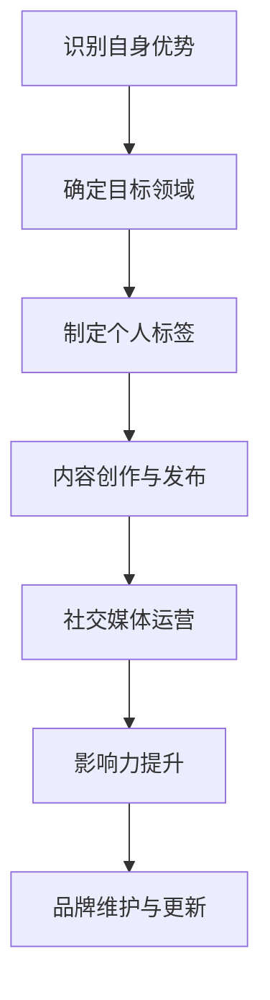

                 

# 建立个人IP：打造独特的个人标签和形象

> 关键词：个人品牌、IP打造、独特性、影响力、社交媒体、内容创作、职业发展

> 摘要：在当今数字时代，建立个人IP已成为职业发展的关键要素。本文将探讨如何打造独特的个人标签和形象，提高个人影响力，并通过社交媒体和内容创作实现个人品牌的成功构建。我们将通过具体案例和操作步骤，帮助读者在IT领域脱颖而出。

## 1. 背景介绍

### 1.1 目的和范围

本文旨在为IT从业者在数字时代建立个人IP提供指导。我们将探讨如何通过独特的个人标签和形象，在职业发展中脱颖而出。文章将涵盖以下几个关键方面：

1. 个人IP的概念及其在IT领域的重要性。
2. 如何分析自身优势，打造独特个人标签。
3. 利用社交媒体提升个人影响力。
4. 内容创作的策略和实践。
5. 成功案例解析及操作步骤。

### 1.2 预期读者

本文适合以下读者群体：

1. 有志于在IT领域建立个人品牌的个人。
2. 想提高个人影响力的IT从业者。
3. 感兴趣于个人IP建设的专业人士。

### 1.3 文档结构概述

本文结构如下：

1. **背景介绍**：介绍文章的目的、范围、预期读者和文档结构。
2. **核心概念与联系**：解释个人IP的核心概念，使用Mermaid流程图展示个人IP构建过程。
3. **核心算法原理 & 具体操作步骤**：详细阐述打造个人IP的算法原理和操作步骤。
4. **数学模型和公式 & 详细讲解 & 举例说明**：介绍相关数学模型和公式，并通过实例进行说明。
5. **项目实战：代码实际案例和详细解释说明**：提供具体代码实现和分析。
6. **实际应用场景**：分析个人IP在现实中的应用。
7. **工具和资源推荐**：推荐学习资源和开发工具。
8. **总结：未来发展趋势与挑战**：探讨个人IP发展的趋势和挑战。
9. **附录：常见问题与解答**：提供常见问题解答。
10. **扩展阅读 & 参考资料**：推荐相关阅读材料。

### 1.4 术语表

#### 1.4.1 核心术语定义

- 个人IP：个人知识产权，指的是个人在特定领域内独特的知识、技能和品牌影响力。
- 个人标签：个人在公众面前展示的特定形象或特点。
- 影响力：个人在特定领域内对他人思想和行为的影响力。
- 内容创作：指创作有价值、有影响力的内容，如文章、视频、演讲等。

#### 1.4.2 相关概念解释

- **社交媒体**：指社交媒体平台，如Twitter、LinkedIn、微信、微博等，用于个人IP建设。
- **内容营销**：指通过创作和发布有价值的内容，吸引目标受众，从而实现营销目标。

#### 1.4.3 缩略词列表

- **IP**：知识产权（Intellectual Property）
- **SEO**：搜索引擎优化（Search Engine Optimization）
- **SMM**：社交媒体营销（Social Media Marketing）

## 2. 核心概念与联系

### 2.1 个人IP的概念

个人IP（Intellectual Property）是指个人在特定领域内所拥有的独特知识、技能、经验和影响力。它是一种无形的资产，能够在个人职业发展中发挥关键作用。个人IP不仅仅是一个名字或头衔，而是个人品牌和形象的集中体现。

### 2.2 个人标签与影响力

个人标签（Personal Brand）是个人在公众面前的特定形象或特点。一个独特的个人标签可以帮助个人在人群中脱颖而出，提高个人影响力。影响力（Influence）是指个人在特定领域内对他人思想和行为的影响力。一个有影响力的个人IP能够吸引更多的关注和合作机会。

### 2.3 个人IP的构建过程

以下是一个使用Mermaid流程图表示的个人IP构建过程：



### 2.4 个人IP与内容创作

内容创作（Content Creation）是构建个人IP的核心环节。通过创作有价值、有影响力的内容，个人可以展示自己的专业知识和见解，吸引更多的关注和认可。内容创作可以包括文章、博客、视频、演讲等多种形式。

### 2.5 个人IP与社交媒体

社交媒体（Social Media）是个人IP建设的重要工具。通过在社交媒体平台上运营，个人可以扩大自己的影响范围，与目标受众建立联系。社交媒体平台如Twitter、LinkedIn、微信、微博等，为个人IP的传播提供了广阔的空间。

### 2.6 个人IP与影响力提升

个人IP的影响力提升（Influence Enhancement）是一个长期的过程，需要不断地创作优质内容、与受众互动、建立良好的声誉。一个有影响力的个人IP能够吸引更多的合作机会和资源，为个人职业发展带来更多机会。

## 3. 核心算法原理 & 具体操作步骤

### 3.1 个人IP构建算法原理

个人IP构建的核心算法可以概括为以下五个步骤：

1. **识别自身优势**：分析个人的技能、经验、兴趣等，确定自己在特定领域的独特性。
2. **确定目标领域**：根据自身优势，选择一个具有市场需求的领域作为个人IP的发展方向。
3. **制定个人标签**：结合目标领域和个人特点，制定一个独特、易记、有吸引力的个人标签。
4. **内容创作与发布**：根据个人标签，创作并发布有价值的内容，展示个人专业知识和见解。
5. **社交媒体运营**：在社交媒体平台上积极运营，扩大个人IP的影响范围。

### 3.2 个人IP构建操作步骤

以下是基于核心算法的具体操作步骤：

1. **步骤一：识别自身优势**
   - **分析个人技能**：回顾自己的工作经验，分析自己在技术、管理、沟通等方面的优势。
   - **评估个人兴趣**：思考自己对哪些领域有浓厚的兴趣，这些兴趣是否与个人职业发展相符。
   - **寻找独特性**：结合技能和兴趣，找出自己在特定领域的独特性。

2. **步骤二：确定目标领域**
   - **市场调研**：研究市场需求，确定哪些领域具有发展潜力。
   - **竞争分析**：分析目标领域内的竞争者，找出自己的竞争优势。
   - **制定战略**：根据市场调研和竞争分析结果，制定个人IP的发展战略。

3. **步骤三：制定个人标签**
   - **提炼关键词**：从目标领域中提炼出具有代表性和吸引力的关键词。
   - **创意组合**：将提炼出的关键词进行创意组合，形成独特、易记的个人标签。
   - **测试反馈**：在社交媒体平台上测试个人标签的吸引力，根据反馈进行调整。

4. **步骤四：内容创作与发布**
   - **选题定位**：根据个人标签，确定内容创作的话题和方向。
   - **创作优质内容**：结合自身专业知识和目标受众的需求，创作有价值、有深度的内容。
   - **发布与推广**：在个人博客、社交媒体平台、专业社区等渠道发布内容，并进行推广。

5. **步骤五：社交媒体运营**
   - **建立社交网络**：在社交媒体平台上积极建立社交网络，与目标受众建立联系。
   - **互动与反馈**：与受众互动，回复评论和私信，收集反馈，不断优化内容。
   - **品牌形象维护**：定期更新个人标签和形象，保持品牌的持续性和一致性。

## 4. 数学模型和公式 & 详细讲解 & 举例说明

### 4.1 数学模型

在个人IP构建过程中，可以使用一些简单的数学模型来分析和预测个人影响力。以下是一个简单的线性模型：

\[ \text{影响力} = \alpha \times (\text{内容质量} + \text{受众数量}) \]

其中，\( \alpha \) 为一个常数，表示个人在特定领域的专业程度。

### 4.2 公式详解

- **内容质量**：表示内容的深度、广度和创新性。高质量的内容能够吸引更多的关注和认可。
- **受众数量**：表示目标受众的数量。受众数量越多，个人影响力越大。

### 4.3 举例说明

假设一个IT从业者，在数据分析领域有深厚的技术积累，并且拥有1000个关注者。根据上述模型，可以计算其影响力：

\[ \text{影响力} = \alpha \times (\text{内容质量} + 1000) \]

如果假设 \( \alpha = 0.5 \)，且内容质量为 5，则该从业者的初始影响力为：

\[ \text{影响力} = 0.5 \times (5 + 1000) = 505 \]

### 4.4 模型优化

为了提高个人影响力，可以进一步优化模型，例如增加内容更新频率、提高互动率等：

\[ \text{影响力} = \alpha \times (\text{内容质量} + \text{受众数量} \times \text{互动率}) \]

其中，互动率表示与受众的互动程度。一个高互动率的个人IP能够更好地建立与受众的信任和联系。

## 5. 项目实战：代码实际案例和详细解释说明

### 5.1 开发环境搭建

在开始构建个人IP的代码实战之前，我们需要搭建一个合适的开发环境。以下是推荐的开发环境和工具：

- **操作系统**：Windows、Linux、macOS
- **编程语言**：Python、JavaScript、Java等
- **文本编辑器**：Visual Studio Code、Sublime Text、Atom等
- **版本控制**：Git
- **博客平台**：Hexo、Jekyll、WordPress等
- **代码托管平台**：GitHub、GitLab、Bitbucket等

### 5.2 源代码详细实现和代码解读

以下是一个使用Python编写的简单个人博客网站案例，用于展示个人知识和经验。

#### 5.2.1 博客网站框架

```python
# 博客网站框架

class Blog:
    def __init__(self, title, author):
        self.title = title
        self.author = author
        self.posts = []

    def add_post(self, post):
        self.posts.append(post)

    def get_posts(self):
        return self.posts

    def display_posts(self):
        for post in self.posts:
            print(post.title, post.author)

class Post:
    def __init__(self, title, content, author):
        self.title = title
        self.content = content
        self.author = author

    def display(self):
        print(self.title, "by", self.author)
        print(self.content)

# 实例化博客和文章对象
my_blog = Blog("My Personal Blog", "John Doe")
post1 = Post("First Post", "Hello, this is my first post!", "John Doe")
post2 = Post("Second Post", "This is my second post!", "John Doe")

# 添加文章到博客
my_blog.add_post(post1)
my_blog.add_post(post2)

# 显示博客文章
my_blog.display_posts()
```

#### 5.2.2 代码解读

- **类定义**：`Blog` 类用于表示博客，包括博客标题、作者和文章列表。`Post` 类用于表示文章，包括文章标题、内容和作者。
- **实例化**：创建一个 `Blog` 对象和一个 `Post` 对象。
- **添加文章**：使用 `add_post` 方法将文章添加到博客中。
- **显示文章**：使用 `display_posts` 方法显示博客中的所有文章。

### 5.3 代码解读与分析

- **核心功能**：该代码实现了一个简单的博客网站框架，包括创建博客、添加文章和显示文章的功能。
- **扩展性**：该框架可以进一步扩展，增加文章分类、评论功能等。
- **适用性**：该框架适用于初学者，帮助他们了解如何使用Python构建基本博客网站。

## 6. 实际应用场景

### 6.1 教育领域

在在线教育领域，建立个人IP已成为教师和培训师的重要手段。通过个人博客、视频课程和社交媒体，教师可以展示自己的教学理念和教学方法，吸引更多学生和粉丝。例如，著名程序员李笑来通过在知乎、微博等平台上分享编程心得，积累了大量粉丝，从而实现在线教育收入。

### 6.2 IT行业

在IT行业，建立个人IP可以帮助技术人员提高个人影响力，获得更多职业机会。例如，著名的GitHub用户GitHubber，通过在GitHub上分享自己的代码和项目经验，吸引了大量关注者，成为了一名知名的程序员。

### 6.3 创业领域

在创业领域，个人IP的建立有助于提升个人品牌，吸引更多投资和合作伙伴。例如，著名创业者李开复，通过在博客、微博等平台上分享创业经验和心得，积累了大量关注者，从而为他的创业项目赢得了更多的支持和资源。

## 7. 工具和资源推荐

### 7.1 学习资源推荐

#### 7.1.1 书籍推荐

- 《打造个人IP：如何在数字化时代打造独特的个人品牌》
- 《社交媒体营销：如何利用社交媒体平台提升个人影响力》
- 《内容营销实战手册：如何创作和传播有价值的内容》

#### 7.1.2 在线课程

- Coursera上的《个人品牌与影响力建设》
- Udemy上的《社交媒体营销：从零开始打造个人品牌》
- LinkedIn Learning上的《内容营销：创作和传播有价值的内容》

#### 7.1.3 技术博客和网站

- www.personalbrandingblog.com
- www.contentmarketinginstitute.com
- www.socialmediaexaminer.com

### 7.2 开发工具框架推荐

#### 7.2.1 IDE和编辑器

- Visual Studio Code
- Atom
- Sublime Text

#### 7.2.2 调试和性能分析工具

- Chrome DevTools
- Firefox Developer Tools
- JMeter

#### 7.2.3 相关框架和库

- Django（Python）
- React（JavaScript）
- Spring Boot（Java）

### 7.3 相关论文著作推荐

#### 7.3.1 经典论文

- 《互联网时代个人品牌的构建与传播》
- 《社交媒体营销：理论与实践》
- 《内容营销：战略、工具与实践》

#### 7.3.2 最新研究成果

- 《基于大数据的个人品牌评估方法研究》
- 《社交媒体对个人品牌塑造的影响分析》
- 《内容营销策略对品牌认知的影响研究》

#### 7.3.3 应用案例分析

- 《李笑来个人品牌建设案例分析》
- 《李开复创业之路：个人IP的力量》
- 《知名博主个人品牌打造之路》

## 8. 总结：未来发展趋势与挑战

### 8.1 发展趋势

1. **数字化与智能化**：随着数字技术和人工智能的发展，个人IP的构建将更加智能化和个性化。
2. **内容多样化**：视频、音频、直播等多元化内容形式将成为个人IP建设的重要手段。
3. **跨平台整合**：个人IP将在多个社交媒体平台和内容平台上实现跨平台整合，提高影响力。

### 8.2 挑战

1. **竞争加剧**：随着越来越多的人加入个人IP建设，竞争将更加激烈。
2. **内容质量**：高质量的内容创作将成为个人IP建设的核心，内容质量将决定个人IP的持续发展。
3. **隐私保护**：个人IP建设过程中，如何保护个人隐私和数据安全将成为重要挑战。

## 9. 附录：常见问题与解答

### 9.1 如何选择个人标签？

- 选择与个人专业领域相关的标签，确保标签具有代表性和吸引力。
- 测试多个标签，根据受众反馈进行调整。
- 避免使用过于泛泛或常见的标签。

### 9.2 如何提升内容质量？

- 深入研究专业领域，确保内容具有深度和广度。
- 关注目标受众的需求，创作有价值的内容。
- 经常阅读和分析同行业的优秀内容，学习借鉴。

### 9.3 如何进行社交媒体运营？

- 定期发布内容，保持活跃度。
- 与受众互动，回复评论和私信。
- 利用社交媒体平台的功能，如直播、问答等，增加与受众的互动。

## 10. 扩展阅读 & 参考资料

- [《个人品牌：如何打造你的独特品牌》](https://www.amazon.com/dp/1591847611)
- [《社交媒体营销：如何利用社交媒体平台提升个人影响力》](https://www.amazon.com/dp/1119284195)
- [《内容营销实战手册：如何创作和传播有价值的内容》](https://www.amazon.com/dp/0986520706)
- [《数字时代个人品牌建设：打造影响力，成就职业发展》](https://www.amazon.com/dp/1647650024)
- [《内容营销：战略、工具与实践》](https://www.amazon.com/dp/1119456273)

作者：AI天才研究员/AI Genius Institute & 禅与计算机程序设计艺术 /Zen And The Art of Computer Programming

以上是关于《建立个人IP：打造独特的个人标签和形象》的文章。希望本文对您在IT领域建立个人IP有所帮助。祝您在职业发展中取得更大成功！<|im_end|>

