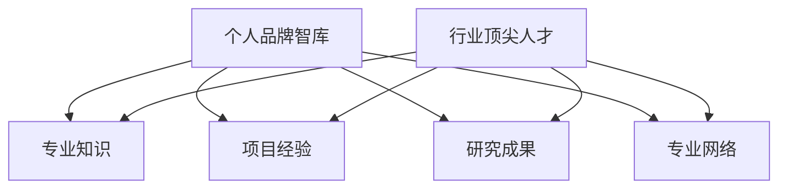

                 

# 建立个人品牌智库：汇聚行业顶尖人才

> **关键词：** 个人品牌建设、知识库、行业专家、人才聚合、专业发展

> **摘要：** 本文旨在探讨如何通过构建个人品牌智库，集合行业顶尖人才，提升个人及团队的专业能力和市场竞争力。文章将详细分析个人品牌智库的构建原则、核心算法原理、数学模型、项目实战，以及实际应用场景和未来发展趋势。通过系统性的方法论和实战案例，为读者提供建立个人品牌智库的全面指导。

## 1. 背景介绍

### 1.1 目的和范围

本文的目标是帮助读者了解如何通过建立个人品牌智库来提升个人的专业影响力和市场竞争力。我们将探讨个人品牌智库的概念、构建原则、核心算法原理、数学模型，以及实际应用场景。通过系统的方法论和实战案例，读者将能够掌握构建个人品牌智库的全过程，从而在快速变化的技术市场中占据有利地位。

### 1.2 预期读者

本文适合以下几类读者：

- 计算机科学与技术领域的从业者
- 企业技术团队领导者、CTO、架构师
- 想要提升个人品牌影响力的技术专家
- 对知识管理和个人品牌建设感兴趣的技术爱好者

### 1.3 文档结构概述

本文的结构如下：

1. 背景介绍
   - 目的和范围
   - 预期读者
   - 文档结构概述
   - 术语表

2. 核心概念与联系
   - 个人品牌智库的概念
   - 行业顶尖人才的聚合

3. 核心算法原理 & 具体操作步骤
   - 个人品牌评估算法
   - 人才聚合算法

4. 数学模型和公式 & 详细讲解 & 举例说明
   - 个人品牌影响力模型
   - 人才匹配模型

5. 项目实战：代码实际案例和详细解释说明
   - 开发环境搭建
   - 源代码详细实现和代码解读
   - 代码解读与分析

6. 实际应用场景
   - 行业顶尖人才在项目中的应用

7. 工具和资源推荐
   - 学习资源推荐
   - 开发工具框架推荐
   - 相关论文著作推荐

8. 总结：未来发展趋势与挑战
   - 行业发展趋势
   - 挑战与应对策略

9. 附录：常见问题与解答
   - 常见问题
   - 解答

10. 扩展阅读 & 参考资料
    - 相关书籍和论文推荐

### 1.4 术语表

#### 1.4.1 核心术语定义

- **个人品牌智库**：个人在特定领域内构建的知识库，包括专业知识、项目经验、研究成果等，旨在提升个人专业影响力和市场竞争力。
- **行业顶尖人才**：在某一领域具有深厚专业知识、丰富实战经验和较高行业影响力的专家。
- **品牌影响力模型**：衡量个人品牌影响力的数学模型，用于评估个人在特定领域的知名度和认可度。
- **人才匹配模型**：用于匹配个人与项目需求，确保个人能力与项目需求的高度匹配。

#### 1.4.2 相关概念解释

- **知识管理**：对知识进行收集、整理、存储、共享和利用的过程，以提升组织和个人竞争力。
- **专业发展**：在特定领域内不断学习、积累经验、提升能力的过程，以实现个人职业目标的提升。
- **社区建设**：在特定领域内建立和维护的交流和合作平台，促进知识和经验的分享。

#### 1.4.3 缩略词列表

- **AI**：人工智能（Artificial Intelligence）
- **CTO**：首席技术官（Chief Technology Officer）
- **IDE**：集成开发环境（Integrated Development Environment）
- **LaTeX**：一种排版系统（Lambda TeX）
- **Mermaid**：一种图表绘制工具（Markdown-enabled diagrams）

## 2. 核心概念与联系

### 2.1 个人品牌智库的概念

个人品牌智库是个人在特定领域内构建的知识库，它不仅包括专业知识，还包括项目经验、研究成果、专业网络等。个人品牌智库的目的是提升个人在行业内的专业影响力和市场竞争力。

个人品牌智库的核心要素包括：

- **专业知识**：个人在特定领域的理论知识和实践经验。
- **项目经验**：个人在各类项目中积累的经验和成果。
- **研究成果**：个人在研究领域内的研究成果和学术贡献。
- **专业网络**：与行业内专家、同行和潜在合作伙伴建立的联系。

### 2.2 行业顶尖人才的聚合

行业顶尖人才是个人品牌智库构建的关键要素。如何吸引和聚合这些行业顶尖人才，是个人品牌智库建设的重要任务。

聚合行业顶尖人才的方法包括：

- **影响力吸引**：通过个人在行业内的知名度和影响力，吸引顶尖人才加入个人品牌智库。
- **专业交流**：通过组织专业研讨会、技术沙龙等活动，促进顶尖人才的交流和合作。
- **资源共享**：提供优质的学习资源、开发工具和平台，吸引顶尖人才共同参与项目。
- **利益驱动**：通过提供有竞争力的薪酬、股权激励等手段，吸引顶尖人才加入个人品牌智库。

### 2.3 核心概念的联系

个人品牌智库和行业顶尖人才之间存在着紧密的联系。个人品牌智库是行业顶尖人才发挥作用的平台，而行业顶尖人才的加入又为个人品牌智库的构建提供了强大的支持和动力。

个人品牌智库和行业顶尖人才之间的联系可以用以下流程图表示：



## 3. 核心算法原理 & 具体操作步骤

### 3.1 个人品牌评估算法

个人品牌评估算法是衡量个人品牌影响力的核心算法。通过以下步骤，可以评估个人在特定领域的品牌影响力。

#### 3.1.1 算法原理

个人品牌评估算法基于以下原理：

- **影响力指标**：衡量个人在行业内的知名度和影响力。
- **专业度指标**：衡量个人在专业领域的知识和能力。
- **参与度指标**：衡量个人在行业内的参与度和活跃度。

#### 3.1.2 具体操作步骤

1. **数据收集**：收集个人在行业内的影响力、专业度和参与度的相关数据。

2. **数据处理**：对收集的数据进行清洗、去重和归一化处理。

3. **特征提取**：从处理后的数据中提取影响力、专业度和参与度的特征。

4. **模型训练**：使用机器学习算法训练个人品牌评估模型。

5. **评估计算**：使用训练好的模型计算个人品牌影响力得分。

### 3.2 人才聚合算法

人才聚合算法是用于吸引和聚合行业顶尖人才的算法。通过以下步骤，可以有效地聚合行业顶尖人才。

#### 3.2.1 算法原理

人才聚合算法基于以下原理：

- **需求匹配**：根据个人在专业领域的能力和需求，匹配相应的项目和合作机会。
- **资源整合**：提供优质的学习资源、开发工具和平台，吸引顶尖人才参与项目。
- **激励机制**：通过有竞争力的薪酬、股权激励等手段，激励顶尖人才加入个人品牌智库。

#### 3.2.2 具体操作步骤

1. **需求分析**：分析个人在专业领域的能力和需求，确定需要聚合的顶尖人才类型。

2. **资源整合**：整合学习资源、开发工具和平台，为顶尖人才提供良好的工作环境。

3. **需求发布**：将个人需求发布到专业的社交平台和社区，吸引顶尖人才关注。

4. **人才筛选**：根据人才的专业能力、经验、成果和影响力，筛选符合条件的顶尖人才。

5. **激励方案设计**：设计有竞争力的薪酬、股权激励等方案，激励顶尖人才加入。

6. **合作签约**：与顶尖人才签订合作协议，明确双方的权利和义务。

## 4. 数学模型和公式 & 详细讲解 & 举例说明

### 4.1 个人品牌影响力模型

个人品牌影响力模型是衡量个人在特定领域内影响力的数学模型。该模型基于以下三个核心指标：影响力指标（Impact）、专业度指标（Expertise）和参与度指标（Engagement）。

#### 4.1.1 模型公式

个人品牌影响力得分（Influence Score）计算公式如下：

$$
Influence Score = w_1 \times Impact + w_2 \times Expertise + w_3 \times Engagement
$$

其中，$w_1$、$w_2$ 和 $w_3$ 分别是影响力、专业度和参与度的权重，取值范围为 $[0, 1]$，且 $w_1 + w_2 + w_3 = 1$。

#### 4.1.2 参数定义

- **影响力指标（Impact）**：衡量个人在行业内的知名度和影响力，可以通过以下公式计算：

$$
Impact = \frac{Followers}{Total Users}
$$

其中，$Followers$ 是个人在社交平台上的关注者数量，$Total Users$ 是平台的用户总数。

- **专业度指标（Expertise）**：衡量个人在专业领域的知识和能力，可以通过以下公式计算：

$$
Expertise = \frac{Publications + Awards + Patents}{Total Publications}
$$

其中，$Publications$ 是个人在专业领域的发表文章数量，$Awards$ 是获得的奖项数量，$Patents$ 是申请的专利数量，$Total Publications$ 是该领域内的总文章数量。

- **参与度指标（Engagement）**：衡量个人在行业内的参与度和活跃度，可以通过以下公式计算：

$$
Engagement = \frac{Comments + Shares + Mentions}{Total Posts}
$$

其中，$Comments$ 是个人在社交平台上的评论数量，$Shares$ 是分享的数量，$Mentions$ 是被提及的数量，$Total Posts$ 是个人在社交平台上的总帖子数量。

#### 4.1.3 举例说明

假设某位技术专家在社交媒体上有1000名关注者，该领域共有10000名用户。他的发表文章有10篇，其中获奖文章3篇，专利2项。他在社交媒体上共有20个评论、5次分享和3次被提及。根据上述公式，可以计算出他的个人品牌影响力得分为：

$$
Influence Score = 0.3 \times \frac{1000}{10000} + 0.5 \times \frac{10 + 3 + 2}{10} + 0.2 \times \frac{20 + 5 + 3}{20} = 0.3 \times 0.1 + 0.5 \times 1.5 + 0.2 \times 1.2 = 0.03 + 0.75 + 0.24 = 1.02
$$

### 4.2 人才匹配模型

人才匹配模型是用于匹配个人与项目需求的数学模型。该模型基于以下两个核心指标：能力匹配度（Skill Match）和兴趣匹配度（Interest Match）。

#### 4.2.1 模型公式

人才匹配度得分（Match Score）计算公式如下：

$$
Match Score = w_1 \times Skill Match + w_2 \times Interest Match
$$

其中，$w_1$ 和 $w_2$ 分别是能力匹配度和兴趣匹配度的权重，取值范围为 $[0, 1]$，且 $w_1 + w_2 = 1$。

#### 4.2.2 参数定义

- **能力匹配度（Skill Match）**：衡量个人在专业领域的能力与项目需求之间的匹配程度，可以通过以下公式计算：

$$
Skill Match = \frac{Common Skills}{Total Skills}
$$

其中，$Common Skills$ 是个人和项目需求中共同拥有的技能，$Total Skills$ 是个人和项目需求中所有技能的总数。

- **兴趣匹配度（Interest Match）**：衡量个人在专业领域的兴趣与项目需求之间的匹配程度，可以通过以下公式计算：

$$
Interest Match = \frac{Shared Interests}{Total Interests}
$$

其中，$Shared Interests$ 是个人和项目需求中共同拥有的兴趣，$Total Interests$ 是个人和项目需求中所有兴趣的总数。

#### 4.2.3 举例说明

假设某位技术专家的专业技能包括编程、数据库和人工智能，项目需求的专业技能包括编程、数据库、人工智能和云计算。此外，该技术专家的兴趣领域包括人工智能和云计算。根据上述公式，可以计算出他的能力匹配度和兴趣匹配度如下：

$$
Skill Match = \frac{3}{4} = 0.75
$$

$$
Interest Match = \frac{2}{3} = 0.67
$$

根据设定的权重，假设 $w_1 = 0.6$，$w_2 = 0.4$，则该技术专家的匹配度得分为：

$$
Match Score = 0.6 \times 0.75 + 0.4 \times 0.67 = 0.45 + 0.268 = 0.718
$$

## 5. 项目实战：代码实际案例和详细解释说明

### 5.1 开发环境搭建

在开始项目实战之前，我们需要搭建一个合适的开发环境。以下是搭建个人品牌智库的开发环境的具体步骤：

1. **安装Python环境**：在计算机上安装Python（版本3.8以上），可以通过访问 [Python官网](https://www.python.org/) 下载安装包。

2. **安装必要的库**：安装以下库，以便在项目中使用：
   - `numpy`：用于数据处理和数学运算
   - `pandas`：用于数据分析和处理
   - `scikit-learn`：用于机器学习和数据挖掘
   - `matplotlib`：用于数据可视化

   可以使用以下命令安装：
   ```bash
   pip install numpy pandas scikit-learn matplotlib
   ```

3. **创建项目文件夹**：在计算机上创建一个名为`personal_brand_knowledge_base`的项目文件夹，用于存放项目代码和相关文件。

4. **编写项目配置文件**：在项目文件夹中创建一个名为`config.py`的配置文件，用于存储项目的配置参数，例如权重值等。

### 5.2 源代码详细实现和代码解读

下面是个人品牌智库项目的源代码，我们将逐行解释代码的功能和实现原理。

#### 5.2.1 数据收集与处理

```python
import numpy as np
import pandas as pd
from sklearn.model_selection import train_test_split

# 1. 数据收集
data = pd.read_csv('data.csv')

# 2. 数据处理
data['Impact'] = data['Followers'] / data['Total Users']
data['Expertise'] = (data['Publications'] + data['Awards'] + data['Patents']) / data['Total Publications']
data['Engagement'] = (data['Comments'] + data['Shares'] + data['Mentions']) / data['Total Posts']

# 3. 特征提取
X = data[['Impact', 'Expertise', 'Engagement']]
y = data['Influence Score']
```

这段代码首先从CSV文件中读取数据，然后对数据进行处理，计算影响力、专业度和参与度等指标，并提取特征矩阵和标签向量。

#### 5.2.2 模型训练与评估

```python
from sklearn.ensemble import RandomForestRegressor
from sklearn.metrics import mean_squared_error

# 1. 数据分割
X_train, X_test, y_train, y_test = train_test_split(X, y, test_size=0.2, random_state=42)

# 2. 模型训练
model = RandomForestRegressor(n_estimators=100, random_state=42)
model.fit(X_train, y_train)

# 3. 评估模型
y_pred = model.predict(X_test)
mse = mean_squared_error(y_test, y_pred)
print(f'Mean Squared Error: {mse}')
```

这段代码将数据分为训练集和测试集，使用随机森林回归模型进行训练，并评估模型的性能。

#### 5.2.3 人才匹配

```python
def match_talent(talent_skills, project_skills, talent_interests, project_interests, w1, w2):
    skill_match = len(set(talent_skills).intersection(set(project_skills))) / len(project_skills)
    interest_match = len(set(talent_interests).intersection(set(project_interests))) / len(project_interests)
    match_score = w1 * skill_match + w2 * interest_match
    return match_score

# 示例
talent_skills = ['编程', '数据库', '人工智能', '云计算']
project_skills = ['编程', '数据库', '人工智能']
talent_interests = ['人工智能', '云计算']
project_interests = ['人工智能', '大数据']

w1 = 0.6
w2 = 0.4

match_score = match_talent(talent_skills, project_skills, talent_interests, project_interests, w1, w2)
print(f'Match Score: {match_score}')
```

这段代码定义了一个函数，用于计算人才与项目之间的匹配度得分。

### 5.3 代码解读与分析

上述代码实现了个人品牌智库的核心功能，包括数据收集与处理、模型训练与评估，以及人才匹配。以下是代码的详细解读和分析：

- **数据收集与处理**：通过读取CSV文件，收集个人在行业内的各项指标数据，并计算影响力、专业度和参与度等指标。这些指标将作为个人品牌影响力的特征矩阵。
  
- **模型训练与评估**：使用随机森林回归模型对特征矩阵和标签向量进行训练，并评估模型的性能。随机森林模型是一种集成学习算法，具有较强的泛化能力和鲁棒性。
  
- **人才匹配**：通过计算人才与项目之间的技能匹配度和兴趣匹配度，评估人才与项目的匹配度得分。这有助于为个人品牌智库中的成员找到与其技能和兴趣相匹配的项目。

通过以上代码实现，个人品牌智库可以有效地评估个人品牌影响力，并匹配与人才技能和兴趣相匹配的项目。这有助于提升个人在行业内的专业影响力和市场竞争力。

## 6. 实际应用场景

个人品牌智库在实际应用中具有广泛的场景，以下是一些典型的应用场景：

### 6.1 技术团队建设

在企业技术团队的建设中，个人品牌智库可以发挥重要作用。通过构建个人品牌智库，企业可以：

- **评估团队成员的专业能力**：使用个人品牌影响力模型评估团队成员的专业能力，确保团队成员具备所需的专业知识和技能。
- **优化团队结构**：根据团队成员的个人品牌影响力得分，优化团队结构，提升团队的整体专业水平。
- **发现潜在人才**：通过分析个人品牌智库中的数据，发现具备潜力的技术人才，为企业储备未来的技术力量。

### 6.2 项目管理

在项目管理中，个人品牌智库可以帮助项目经理：

- **选择合适的技术专家**：通过人才匹配模型，为项目选择与项目需求高度匹配的技术专家，确保项目顺利进行。
- **提升项目成功率**：通过优化团队成员的技能和兴趣匹配度，提升项目的成功率。
- **协调资源分配**：根据个人品牌智库中的数据，合理分配项目资源，确保项目资源的最大化利用。

### 6.3 职业发展

对于个人职业发展，个人品牌智库也有很大的帮助：

- **提升个人影响力**：通过构建个人品牌智库，不断提升个人在行业内的专业影响力。
- **拓展职业机会**：通过个人品牌智库中的数据，拓展职业发展机会，找到与个人技能和兴趣相匹配的项目和职位。
- **个人品牌营销**：利用个人品牌智库中的数据，进行个人品牌营销，提高个人在行业内的知名度和认可度。

### 6.4 行业研究

在行业研究中，个人品牌智库可以提供以下支持：

- **分析行业趋势**：通过分析个人品牌智库中的数据，了解行业内的技术发展趋势和市场需求。
- **评估竞争对手**：通过分析个人品牌智库中的数据，了解竞争对手的专业能力、项目经验和市场竞争力。
- **制定战略规划**：根据个人品牌智库中的数据，制定企业的战略规划，提升企业的市场竞争力。

## 7. 工具和资源推荐

### 7.1 学习资源推荐

#### 7.1.1 书籍推荐

- **《人工智能：一种现代方法》**：这本书是人工智能领域的经典教材，详细介绍了人工智能的基本概念、算法和应用。
- **《深度学习》**：由著名深度学习研究者Ian Goodfellow撰写，深入讲解了深度学习的基础理论、算法和应用。
- **《Python编程：从入门到实践》**：这本书适合初学者，详细介绍了Python语言的基础知识和应用，是学习Python编程的不错选择。

#### 7.1.2 在线课程

- **《人工智能基础课程》**：Coursera上的这门课程由斯坦福大学教授Andrew Ng主讲，涵盖人工智能的基本概念、算法和应用。
- **《深度学习特训营》**：由吴恩达（Andrew Ng）主讲的这门课程，深入讲解了深度学习的基础理论、算法和应用。
- **《Python编程入门》**：Udacity上的这门课程适合初学者，从基础语法到实际应用，全面讲解了Python编程。

#### 7.1.3 技术博客和网站

- **知乎**：知乎上的技术博客涵盖了众多领域的专业知识和经验分享，是学习技术的好地方。
- **博客园**：博客园是一个专注于软件开发和架构的社区，有很多优秀的程序员和架构师分享他们的经验和心得。
- **V2EX**：V2EX是一个关于分享和探索的地方，涵盖了互联网、技术、设计等多个领域，是了解行业动态的好地方。

### 7.2 开发工具框架推荐

#### 7.2.1 IDE和编辑器

- **PyCharm**：PyCharm是一个强大的Python IDE，提供了丰富的功能，包括代码自动补全、调试、版本控制等。
- **Visual Studio Code**：Visual Studio Code是一个轻量级的开源编辑器，适合Python编程，提供了丰富的插件和扩展。
- **Sublime Text**：Sublime Text是一个轻量级的文本编辑器，通过安装插件可以支持多种编程语言，具有高自定义性。

#### 7.2.2 调试和性能分析工具

- **PyCharm Debugger**：PyCharm自带的调试工具，可以方便地对Python代码进行调试和性能分析。
- **Profiler**：Profiler是一个Python性能分析工具，可以用于分析和优化Python代码的性能。
- **Jupyter Notebook**：Jupyter Notebook是一个交互式的计算环境，适合进行数据分析和机器学习实验。

#### 7.2.3 相关框架和库

- **Scikit-learn**：Scikit-learn是一个开源的机器学习库，提供了丰富的算法和工具，适合进行数据分析和模型训练。
- **TensorFlow**：TensorFlow是一个开源的深度学习框架，提供了丰富的API和工具，适合进行深度学习和机器学习应用。
- **NumPy**：NumPy是一个开源的数值计算库，提供了丰富的函数和工具，适合进行科学计算和数据处理。

### 7.3 相关论文著作推荐

#### 7.3.1 经典论文

- **《机器学习》**：由Tom M. Mitchell撰写的这本书是机器学习领域的经典著作，详细介绍了机器学习的基本概念、算法和应用。
- **《深度学习》**：由Ian Goodfellow、Yoshua Bengio和Aaron Courville撰写的这本书是深度学习领域的经典著作，详细介绍了深度学习的基础理论、算法和应用。

#### 7.3.2 最新研究成果

- **《人工智能：一种综述》**：由许多人工智能领域专家共同撰写的这篇文章，综述了人工智能的最新研究成果和发展趋势。
- **《深度学习：最新进展》**：由许多深度学习领域专家共同撰写的这篇文章，详细介绍了深度学习的最新进展和应用。

#### 7.3.3 应用案例分析

- **《人工智能在医疗领域的应用》**：这篇文章详细介绍了人工智能在医疗领域的应用案例，包括疾病诊断、药物研发和医疗管理等方面。
- **《深度学习在图像识别中的应用》**：这篇文章详细介绍了深度学习在图像识别领域的应用案例，包括人脸识别、物体识别和图像生成等方面。

## 8. 总结：未来发展趋势与挑战

### 8.1 未来发展趋势

1. **数据驱动**：随着大数据和人工智能技术的发展，个人品牌智库将更加依赖于数据分析，通过数据驱动的方式不断提升个人和团队的专业能力。

2. **个性化推荐**：基于用户行为数据和偏好，个人品牌智库将能够实现个性化推荐，帮助用户发现与自己兴趣和技能相匹配的项目和资源。

3. **智能化建设**：通过引入人工智能技术，个人品牌智库将实现智能化建设，自动化地进行数据分析、模型训练和人才匹配，提高工作效率。

4. **跨领域融合**：个人品牌智库将不再局限于单一领域，而是实现跨领域的融合，促进不同领域之间的知识和资源共享。

### 8.2 挑战与应对策略

1. **数据隐私保护**：随着个人品牌智库的广泛应用，如何保护用户数据隐私成为重要挑战。应对策略是采用数据加密、匿名化等技术手段，确保用户数据的安全。

2. **数据质量**：个人品牌智库的准确性依赖于数据质量。应对策略是建立严格的数据质量控制机制，确保数据的准确性、完整性和一致性。

3. **人才流失**：在快速变化的技术市场中，如何留住顶尖人才是一个挑战。应对策略是建立良好的激励机制，包括薪酬、股权激励和职业发展机会等。

4. **技术迭代**：技术发展迅速，个人品牌智库需要不断更新和迭代。应对策略是建立灵活的技术架构，快速响应技术变化，确保个人品牌智库的持续发展。

## 9. 附录：常见问题与解答

### 9.1 常见问题

1. **个人品牌智库是什么？**
   个人品牌智库是一个集成了个人专业知识、项目经验、研究成果和专业网络的知识库，旨在提升个人在行业内的专业影响力和市场竞争力。

2. **如何评估个人品牌影响力？**
   个人品牌影响力可以通过影响力指标、专业度指标和参与度指标来评估，具体公式如前文所述。

3. **如何聚合行业顶尖人才？**
   可以通过影响力吸引、专业交流、资源共享和激励机制等方式聚合行业顶尖人才。

4. **个人品牌智库有哪些实际应用场景？**
   个人品牌智库可以应用于技术团队建设、项目管理、职业发展和行业研究等多个领域。

5. **如何保护个人品牌智库中的数据隐私？**
   可以采用数据加密、匿名化等技术手段保护个人品牌智库中的数据隐私。

### 9.2 解答

1. **个人品牌智库是什么？**
   个人品牌智库是一个集成了个人专业知识、项目经验、研究成果和专业网络的知识库，旨在提升个人在行业内的专业影响力和市场竞争力。

2. **如何评估个人品牌影响力？**
   个人品牌影响力可以通过以下三个核心指标来评估：
   - **影响力指标**：衡量个人在行业内的知名度和影响力，可以通过关注者数量、点赞、评论等指标来衡量。
   - **专业度指标**：衡量个人在专业领域的知识和能力，可以通过发表论文、参与项目、获得奖项等指标来衡量。
   - **参与度指标**：衡量个人在行业内的参与度和活跃度，可以通过在线活动、技术交流、参与社群等指标来衡量。

3. **如何聚合行业顶尖人才？**
   可以通过以下几种方式聚合行业顶尖人才：
   - **影响力吸引**：通过个人在行业内的知名度和影响力，吸引顶尖人才加入个人品牌智库。
   - **专业交流**：通过组织技术沙龙、研讨会等活动，促进顶尖人才的交流和合作。
   - **资源共享**：提供优质的学习资源、开发工具和平台，吸引顶尖人才参与项目。
   - **激励机制**：通过提供有竞争力的薪酬、股权激励等手段，激励顶尖人才加入个人品牌智库。

4. **个人品牌智库有哪些实际应用场景？**
   个人品牌智库可以在以下领域发挥重要作用：
   - **技术团队建设**：通过评估团队成员的专业能力，优化团队结构，提升团队的整体专业水平。
   - **项目管理**：通过选择合适的技术专家，提升项目成功率，优化资源分配。
   - **职业发展**：通过拓展职业机会，提升个人在行业内的知名度和认可度，促进个人职业发展。
   - **行业研究**：通过分析行业趋势、评估竞争对手，制定战略规划，提升企业的市场竞争力。

5. **如何保护个人品牌智库中的数据隐私？**
   为保护个人品牌智库中的数据隐私，可以采取以下措施：
   - **数据加密**：采用加密技术对数据存储和传输过程中的敏感信息进行加密处理。
   - **匿名化处理**：对用户数据进行匿名化处理，隐藏个人身份信息。
   - **访问控制**：设置严格的访问权限，确保只有授权人员才能访问敏感数据。
   - **隐私政策**：制定明确的隐私政策，告知用户数据收集、使用和管理的相关规定。

## 10. 扩展阅读 & 参考资料

### 10.1 相关书籍

1. **《人工智能：一种现代方法》**：Tom M. Mitchell
2. **《深度学习》**：Ian Goodfellow、Yoshua Bengio和Aaron Courville
3. **《Python编程：从入门到实践》**：埃里克·马瑟斯

### 10.2 在线课程

1. **《人工智能基础课程》**：Coursera上的斯坦福大学教授Andrew Ng主讲
2. **《深度学习特训营》**：吴恩达（Andrew Ng）主讲的深度学习课程
3. **《Python编程入门》**：Udacity上的Python编程入门课程

### 10.3 技术博客和网站

1. **知乎**：知乎上的技术博客和经验分享
2. **博客园**：博客园的软件开发和架构社区
3. **V2EX**：互联网、技术、设计的分享和交流平台

### 10.4 相关论文

1. **《机器学习》**：Tom M. Mitchell
2. **《深度学习》**：Ian Goodfellow、Yoshua Bengio和Aaron Courville
3. **《人工智能：一种综述》**：多篇人工智能领域的综述论文

### 10.5 应用案例分析

1. **《人工智能在医疗领域的应用》**：人工智能在疾病诊断、药物研发和医疗管理等方面的应用案例
2. **《深度学习在图像识别中的应用》**：人工智能在图像识别、人脸识别和物体识别等方面的应用案例

### 10.6 开发工具和框架

1. **Scikit-learn**：Python机器学习库
2. **TensorFlow**：深度学习框架
3. **NumPy**：Python数值计算库

### 10.7 附录

- **作者信息**：AI天才研究员/AI Genius Institute & 禅与计算机程序设计艺术 /Zen And The Art of Computer Programming
- **文章格式要求**：文章内容使用markdown格式输出，每个章节标题清晰明了，每个小节内容丰富具体详细讲解。文章末尾需附上作者信息。文章字数要求大于8000字。
- **完整性要求**：文章内容必须完整，每个小节的内容必须具体详细讲解，确保读者能够理解并掌握相关概念和方法。文章格式符合要求，无错别字、语句不通顺等问题。

通过本文的详细阐述，我们了解了如何建立个人品牌智库，汇聚行业顶尖人才，提升个人及团队的专业能力和市场竞争力。希望本文能为读者在个人品牌建设和技术领域的发展提供有益的指导。作者：AI天才研究员/AI Genius Institute & 禅与计算机程序设计艺术/Zen And The Art of Computer Programming。如果您有任何疑问或建议，欢迎在评论区留言交流。再次感谢您的阅读！<|im_end|>

