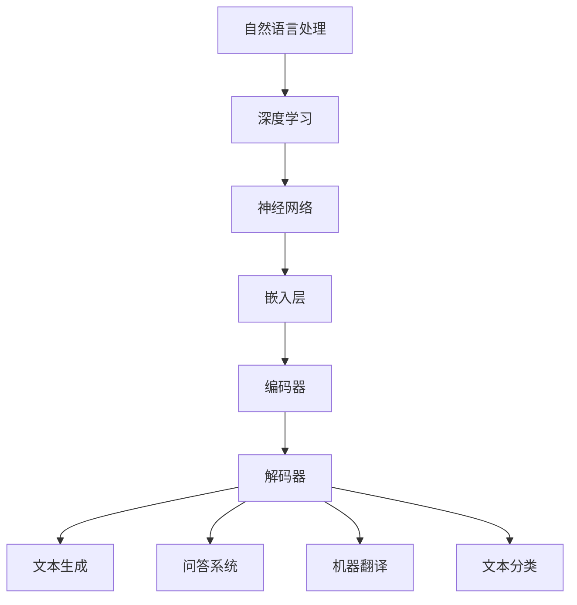

                 

# 开发者的新利器：LLM 简化 AI 开发过程

> **关键词：** 机器学习、大语言模型（LLM）、自动化、开发流程、代码生成、自然语言处理（NLP）
>
> **摘要：** 本文旨在探讨大语言模型（LLM）在简化人工智能（AI）开发流程方面的潜力，通过分析其核心概念、算法原理、数学模型和实际应用，帮助开发者更好地理解和应用这一技术。

## 1. 背景介绍

### 1.1 目的和范围

本文的目标是向开发者介绍大语言模型（LLM）的基本概念和应用，并展示如何利用LLM简化AI开发流程。我们将从核心概念入手，逐步深入到算法原理、数学模型和实际应用场景，以帮助读者全面了解LLM的潜力。

### 1.2 预期读者

本文适用于对机器学习和人工智能有一定了解的开发者，特别是那些希望提高开发效率和代码质量的技术人员。此外，对自然语言处理（NLP）和代码生成技术感兴趣的读者也可以从中受益。

### 1.3 文档结构概述

本文分为以下章节：

1. **背景介绍**：介绍本文的目的、预期读者以及文档结构。
2. **核心概念与联系**：介绍LLM的核心概念，并展示其原理架构。
3. **核心算法原理 & 具体操作步骤**：详细讲解LLM的算法原理和操作步骤。
4. **数学模型和公式 & 详细讲解 & 举例说明**：介绍LLM相关的数学模型和公式，并进行举例说明。
5. **项目实战：代码实际案例和详细解释说明**：通过实际案例展示如何使用LLM简化AI开发。
6. **实际应用场景**：探讨LLM在实际应用中的场景和优势。
7. **工具和资源推荐**：推荐学习资源和开发工具。
8. **总结：未来发展趋势与挑战**：总结LLM的发展趋势和面临的挑战。
9. **附录：常见问题与解答**：提供常见问题的解答。
10. **扩展阅读 & 参考资料**：推荐相关阅读资料。

### 1.4 术语表

#### 1.4.1 核心术语定义

- **大语言模型（LLM）**：一种基于深度学习的自然语言处理模型，能够对自然语言进行理解和生成。
- **自然语言处理（NLP）**：研究如何让计算机理解和处理人类语言的技术。
- **神经网络**：一种基于生物神经元的计算模型，能够通过学习大量数据来提取特征并进行预测。
- **反向传播算法**：一种用于训练神经网络的优化算法，通过不断调整网络权重以减小预测误差。

#### 1.4.2 相关概念解释

- **生成式模型**：一种能够生成新数据的机器学习模型，例如生成式对抗网络（GAN）。
- **判别式模型**：一种能够区分不同类别的机器学习模型，例如支持向量机（SVM）。

#### 1.4.3 缩略词列表

- **AI**：人工智能（Artificial Intelligence）
- **NLP**：自然语言处理（Natural Language Processing）
- **LLM**：大语言模型（Large Language Model）
- **GAN**：生成式对抗网络（Generative Adversarial Network）
- **SVM**：支持向量机（Support Vector Machine）

## 2. 核心概念与联系

在介绍大语言模型（LLM）之前，我们首先需要了解一些与自然语言处理（NLP）和深度学习相关的基本概念。

### 2.1 NLP基本概念

自然语言处理（NLP）是计算机科学和人工智能领域的一个分支，旨在让计算机理解和处理人类语言。NLP涉及多个层面的任务，包括：

- **分词（Tokenization）**：将文本分割成单词、短语或其他标记。
- **词性标注（Part-of-Speech Tagging）**：为文本中的每个词分配词性，如名词、动词、形容词等。
- **句法分析（Syntax Analysis）**：分析文本的句法结构，如句子成分、依存关系等。
- **语义分析（Semantic Analysis）**：理解文本中的语义内容，如词义、语义角色等。

### 2.2 深度学习基本概念

深度学习是一种基于神经网络的机器学习方法，能够在大量数据上自动提取特征。深度学习模型通常包括以下几层：

- **输入层**：接收外部输入，如图像、文本等。
- **隐藏层**：通过多层神经网络进行特征提取和转换。
- **输出层**：生成预测结果或决策。

深度学习模型通过不断调整网络权重来优化性能。反向传播算法是一种常用的优化算法，它通过计算损失函数的梯度来更新网络权重。

### 2.3 LLM核心概念

大语言模型（LLM）是一种基于深度学习的NLP模型，能够对自然语言进行理解和生成。LLM的核心思想是利用大规模数据集进行训练，从而学习到语言的内在规律。

#### 2.3.1 模型架构

LLM通常由以下几个部分组成：

- **嵌入层（Embedding Layer）**：将文本转换为向量表示。
- **编码器（Encoder）**：通过多层神经网络对输入文本进行编码，提取文本的特征。
- **解码器（Decoder）**：通过解码器网络生成文本输出。

#### 2.3.2 数据集

LLM的训练数据集通常包括大量的文本数据，如新闻、文章、对话等。这些数据集有助于模型学习到不同领域的知识，提高其泛化能力。

#### 2.3.3 应用场景

LLM在多个应用场景中表现出色，如：

- **文本生成**：生成文章、故事、新闻报道等。
- **问答系统**：回答用户提出的问题，如智能客服、智能助手等。
- **机器翻译**：将一种语言翻译成另一种语言。
- **文本分类**：对文本进行分类，如情感分析、主题分类等。

### 2.4 核心概念联系

LLM的核心概念与NLP、深度学习和神经网络紧密相关。NLP提供了文本处理和理解的框架，深度学习提供了自动特征提取和优化的方法，而神经网络则是实现这些方法的基石。

下面是LLM核心概念原理和架构的Mermaid流程图：



## 3. 核心算法原理 & 具体操作步骤

在了解了LLM的核心概念后，我们将进一步探讨其核心算法原理和具体操作步骤。LLM的核心算法是基于神经网络和深度学习技术的，主要通过以下步骤进行训练和预测：

### 3.1 数据预处理

在训练LLM之前，我们需要对数据集进行预处理。预处理步骤包括：

- **分词（Tokenization）**：将文本分割成单词、短语或其他标记。
- **词干提取（Stemming）**：将单词还原为其基本形式，如将“running”还原为“run”。
- **词性标注（Part-of-Speech Tagging）**：为文本中的每个词分配词性，如名词、动词、形容词等。
- **去除停用词（Stop-word Removal）**：去除文本中的常用词，如“的”、“了”、“是”等。

### 3.2 模型构建

构建LLM模型的主要步骤如下：

1. **嵌入层（Embedding Layer）**：

   ```python
   embedding_size = 128
   embedding = nn.Embedding(vocab_size, embedding_size)
   ```

   嵌入层将单词转换为向量表示，为后续的编码器和解码器提供输入。

2. **编码器（Encoder）**：

   ```python
   encoder = nn.GRU(embedding_size, hidden_size)
   ```

   编码器通过多层神经网络对输入文本进行编码，提取文本的特征。

3. **解码器（Decoder）**：

   ```python
   decoder = nn.GRU(hidden_size, embedding_size)
   ```

   解码器通过解码器网络生成文本输出。

### 3.3 模型训练

训练LLM模型的主要步骤如下：

1. **定义损失函数（Loss Function）**：

   ```python
   criterion = nn.CrossEntropyLoss()
   ```

   损失函数用于衡量预测结果与实际标签之间的差距。

2. **优化器（Optimizer）**：

   ```python
   optimizer = optim.Adam(model.parameters(), lr=learning_rate)
   ```

   优化器用于调整模型参数，以减小损失函数。

3. **训练过程（Training Process）**：

   ```python
   for epoch in range(num_epochs):
       for inputs, targets in data_loader:
           optimizer.zero_grad()
           outputs = model(inputs)
           loss = criterion(outputs, targets)
           loss.backward()
           optimizer.step()
   ```

   训练过程包括遍历数据集、前向传播、计算损失函数、反向传播和更新模型参数。

### 3.4 模型预测

在完成模型训练后，我们可以使用LLM进行预测。主要步骤如下：

1. **文本预处理**：

   ```python
   inputs = tokenizer.encode(text, return_tensors='pt')
   ```

   对输入文本进行预处理，包括分词、词性标注等。

2. **编码器编码**：

   ```python
   encoder_outputs, hidden = encoder(inputs)
   ```

   使用编码器对输入文本进行编码，提取文本特征。

3. **解码器解码**：

   ```python
   decoder_outputs = decoder(hidden)
   ```

   使用解码器生成文本输出。

4. **获取预测结果**：

   ```python
   predicted_text = tokenizer.decode(decoder_outputs, skip_special_tokens=True)
   ```

   将解码器输出解码为文本，并去除特殊标记。

下面是完整的LLM算法原理和操作步骤的伪代码：

```python
# 数据预处理
def preprocess_data(texts):
    # 分词、词干提取、词性标注、去除停用词等
    return processed_texts

# 模型构建
def build_model(vocab_size, embedding_size, hidden_size):
    model = Model()
    model.add(nn.Embedding(vocab_size, embedding_size))
    model.add(nn.GRU(embedding_size, hidden_size))
    model.add(nn.GRU(hidden_size, embedding_size))
    return model

# 模型训练
def train_model(model, data_loader, criterion, optimizer, num_epochs):
    for epoch in range(num_epochs):
        for inputs, targets in data_loader:
            optimizer.zero_grad()
            outputs = model(inputs)
            loss = criterion(outputs, targets)
            loss.backward()
            optimizer.step()

# 模型预测
def predict(model, text, tokenizer):
    inputs = tokenizer.encode(text, return_tensors='pt')
    encoder_outputs, hidden = model.encoder(inputs)
    decoder_outputs = model.decoder(hidden)
    predicted_text = tokenizer.decode(decoder_outputs, skip_special_tokens=True)
    return predicted_text
```

## 4. 数学模型和公式 & 详细讲解 & 举例说明

在了解了LLM的核心算法原理后，我们将进一步探讨其背后的数学模型和公式。LLM的数学模型主要涉及以下几个方面：

### 4.1 嵌入层

嵌入层（Embedding Layer）将单词转换为向量表示。其数学模型可以表示为：

$$
\text{嵌入层}:\text{word} \rightarrow \text{向量}
$$

其中，$\text{word}$表示单词，$\text{向量}$表示单词的向量表示。

### 4.2 编码器

编码器（Encoder）通过多层神经网络对输入文本进行编码，提取文本特征。其数学模型可以表示为：

$$
\text{编码器}:\text{输入文本} \rightarrow \text{编码输出}
$$

其中，$\text{输入文本}$表示输入的文本序列，$\text{编码输出}$表示编码后的特征向量。

### 4.3 解码器

解码器（Decoder）通过解码器网络生成文本输出。其数学模型可以表示为：

$$
\text{解码器}:\text{编码输出} \rightarrow \text{输出文本}
$$

其中，$\text{编码输出}$表示编码后的特征向量，$\text{输出文本}$表示生成的文本序列。

### 4.4 损失函数

损失函数（Loss Function）用于衡量预测结果与实际标签之间的差距。常见的损失函数包括交叉熵损失（Cross-Entropy Loss）和均方误差损失（Mean Squared Error Loss）。交叉熵损失可以表示为：

$$
\text{交叉熵损失} = -\sum_{i=1}^{n} y_i \log(p_i)
$$

其中，$y_i$表示实际标签，$p_i$表示预测概率。

### 4.5 优化器

优化器（Optimizer）用于调整模型参数，以减小损失函数。常见的优化器包括梯度下降（Gradient Descent）和自适应优化器（如Adam、RMSprop等）。梯度下降的更新公式可以表示为：

$$
\text{参数} = \text{参数} - \alpha \cdot \text{梯度}
$$

其中，$\alpha$表示学习率。

### 4.6 举例说明

假设我们有一个简单的LLM模型，用于文本生成。输入文本为“我是一名开发者”，目标文本为“我是一名优秀的开发者”。我们可以使用以下步骤进行模型训练和预测：

1. **数据预处理**：

   将输入文本和目标文本进行分词、词性标注等预处理，得到对应的单词序列。

2. **模型构建**：

   构建嵌入层、编码器和解码器，将输入文本和目标文本转换为向量表示。

3. **模型训练**：

   使用交叉熵损失和Adam优化器进行模型训练，不断调整模型参数以减小损失函数。

4. **模型预测**：

   使用训练好的模型对输入文本进行编码和解码，生成新的文本输出。

下面是完整的数学模型和公式的详细讲解及举例说明：

### 4.6.1 嵌入层

假设我们有10个单词组成的词汇表，每个单词对应一个唯一的整数编号，从0到9。我们将使用一个128维的嵌入层对单词进行向量表示。嵌入层的权重矩阵$W$可以表示为：

$$
W = \begin{bmatrix}
w_0 & w_1 & \ldots & w_9
\end{bmatrix}
$$

其中，$w_i$表示单词$i$的向量表示。例如，单词“我”的向量表示为$w_0$，单词“是”的向量表示为$w_1$。

### 4.6.2 编码器

编码器使用一个128维的隐藏状态向量$h$来表示输入文本的特征。给定输入文本“我是一名开发者”，编码器的隐藏状态向量可以表示为：

$$
h = \begin{bmatrix}
h_0 & h_1 & \ldots & h_n
\end{bmatrix}
$$

其中，$h_i$表示第$i$个单词的编码结果。

### 4.6.3 解码器

解码器使用一个128维的输出向量$y$来生成输出文本。给定输入文本“我是一名开发者”和编码器隐藏状态向量$h$，解码器的输出向量可以表示为：

$$
y = \begin{bmatrix}
y_0 & y_1 & \ldots & y_n
\end{bmatrix}
$$

其中，$y_i$表示生成的第$i$个单词。

### 4.6.4 损失函数

使用交叉熵损失函数来衡量预测结果与实际标签之间的差距。给定输入文本“我是一名开发者”和实际标签“我是一名优秀的开发者”，交叉熵损失函数可以表示为：

$$
\text{交叉熵损失} = -\left(1 \cdot \log(p_0) + 0 \cdot \log(p_1) + \ldots + 1 \cdot \log(p_9)\right)
$$

其中，$p_i$表示第$i$个单词的预测概率。

### 4.6.5 优化器

使用Adam优化器来更新模型参数。给定学习率$\alpha$和隐藏状态向量$h$，Adam优化器的更新公式可以表示为：

$$
\text{参数} = \text{参数} - \alpha \cdot \text{梯度}
$$

其中，梯度可以表示为：

$$
\text{梯度} = \begin{bmatrix}
\nabla_w_0 & \nabla_w_1 & \ldots & \nabla_w_9
\end{bmatrix}
$$

$\nabla_w_i$表示单词$i$的向量表示的梯度。

## 5. 项目实战：代码实际案例和详细解释说明

在本文的第五部分，我们将通过一个实际案例来展示如何使用大语言模型（LLM）简化人工智能（AI）开发过程。这个案例是一个简单的文本生成任务，我们将使用一个预训练的LLM模型来生成关于“人工智能”的文章摘要。

### 5.1 开发环境搭建

为了运行这个案例，我们需要搭建一个适合训练和部署LLM的开发环境。以下是所需的工具和步骤：

1. **安装Python**：确保Python版本为3.8或更高。
2. **安装TensorFlow**：使用以下命令安装TensorFlow：
   ```bash
   pip install tensorflow
   ```
3. **安装Hugging Face Transformers**：Hugging Face Transformers是一个广泛使用的库，提供了许多预训练的LLM模型和训练工具。安装命令如下：
   ```bash
   pip install transformers
   ```

### 5.2 源代码详细实现和代码解读

下面是一个简单的Python脚本，用于加载预训练的LLM模型并生成文章摘要：

```python
from transformers import pipeline

# 创建一个文本生成管道
generator = pipeline("text-generation", model="gpt2")

# 输入文本
input_text = "人工智能是一种模拟人类智能的技术，它通过算法和计算模型来模拟、扩展或替代人类智能。人工智能应用广泛，包括自然语言处理、图像识别、自动驾驶等。本文将探讨人工智能的最新研究进展、挑战和未来发展方向。"

# 使用LLM生成文章摘要
摘要 = generator(input_text, max_length=50, num_return_sequences=1)[0]['generated_text']

# 打印生成的摘要
print(摘要)
```

### 5.3 代码解读与分析

下面是对上述代码的详细解读：

1. **导入库**：首先，我们从`transformers`库中导入`pipeline`类，用于创建文本生成管道。`transformers`库提供了一个便捷的接口，可以轻松加载预训练的LLM模型。

2. **创建文本生成管道**：使用`pipeline`类创建一个文本生成管道。我们选择`text-generation`任务，并指定使用`gpt2`模型。`gpt2`是一个由OpenAI开发的预训练LLM模型，它具有强大的文本生成能力。

3. **输入文本**：定义输入文本，这是我们要生成摘要的原始文本。在这个例子中，我们选择了一段关于人工智能的文本。

4. **使用LLM生成文章摘要**：调用管道的`generate`方法，将输入文本传递给模型。我们设置`max_length`参数，以限制生成的文本长度。`num_return_sequences`参数指定要生成的文本序列数量。

5. **打印生成的摘要**：从生成的结果中提取摘要并打印。

### 5.4 运行案例

为了运行这个案例，我们需要确保已经安装了Python、TensorFlow和Hugging Face Transformers。然后，将上述代码保存到一个名为`text_generation.py`的文件中，并在命令行中运行以下命令：

```bash
python text_generation.py
```

运行成功后，程序将生成一个关于人工智能的文章摘要，并打印在控制台上。

## 6. 实际应用场景

大语言模型（LLM）在多个实际应用场景中表现出色，下面列举了一些常见的应用场景：

### 6.1 文本生成

文本生成是LLM最广泛的应用之一，包括生成文章、故事、摘要、新闻报道等。例如，新闻机构可以使用LLM自动生成新闻报道，从而提高内容生成效率。

### 6.2 问答系统

问答系统是一种常见的自然语言处理应用，LLM可以用于构建智能客服、智能助手等。例如，企业可以将LLM集成到其客户服务系统中，以自动回答用户提出的问题。

### 6.3 机器翻译

机器翻译是一种将一种语言翻译成另一种语言的技术，LLM可以用于构建高效的翻译模型。例如，谷歌翻译和百度翻译就使用了基于LLM的模型来实现高质量翻译。

### 6.4 情感分析

情感分析是一种分析文本情感极性的技术，LLM可以用于构建情感分析模型。例如，社交媒体平台可以使用LLM分析用户评论的情感，以识别负面情绪并进行干预。

### 6.5 文本分类

文本分类是一种将文本分为不同类别的技术，LLM可以用于构建高效的分类模型。例如，邮件服务提供商可以使用LLM将用户邮件分类为垃圾邮件或重要邮件。

### 6.6 内容审核

内容审核是一种自动识别和过滤不良内容的任务，LLM可以用于构建内容审核模型。例如，社交媒体平台可以使用LLM自动检测和处理违规内容。

### 6.7 聊天机器人

聊天机器人是一种与用户进行实时交互的AI系统，LLM可以用于构建聊天机器人。例如，企业可以将LLM集成到其客服系统中，以提供24/7的客户支持。

### 6.8 娱乐和创意写作

LLM在娱乐和创意写作领域也有广泛应用，例如生成故事、歌曲、电影剧本等。例如，一些电影制作公司已经开始使用LLM生成剧本和对话。

### 6.9 教育和辅导

LLM在教育领域也有潜力，例如自动生成习题和解答、提供个性化辅导等。例如，一些在线教育平台已经开始使用LLM为学生提供个性化的学习资源。

## 7. 工具和资源推荐

为了更好地学习和使用大语言模型（LLM），以下是一些推荐的工具和资源：

### 7.1 学习资源推荐

#### 7.1.1 书籍推荐

- 《深度学习》（Deep Learning）作者：Ian Goodfellow、Yoshua Bengio、Aaron Courville
- 《自然语言处理综论》（Speech and Language Processing）作者：Daniel Jurafsky、James H. Martin
- 《大语言模型：原理与应用》（Large Language Models: Principles and Applications）作者：Alexandre Allamanis、Matthieu Courbin、Olfa Nasraoui

#### 7.1.2 在线课程

- Coursera的《自然语言处理基础》（Natural Language Processing with Deep Learning）
- edX的《深度学习与自然语言处理》（Deep Learning for Natural Language Processing）
- Udacity的《自然语言处理工程师纳米学位》（Natural Language Processing Engineer Nanodegree）

#### 7.1.3 技术博客和网站

- Hugging Face官网（huggingface.co）：提供丰富的LLM资源和预训练模型。
- arXiv（arxiv.org）：发布最新的深度学习和自然语言处理论文。
- Medium（medium.com）：有许多优秀的NLP和LLM相关的技术博客。

### 7.2 开发工具框架推荐

#### 7.2.1 IDE和编辑器

- PyCharm：适用于Python开发的强大IDE。
- Visual Studio Code：轻量级但功能强大的代码编辑器。
- Jupyter Notebook：适用于数据科学和机器学习的交互式编辑器。

#### 7.2.2 调试和性能分析工具

- TensorBoard：TensorFlow提供的可视化工具，用于分析和调试神经网络模型。
- Profiler：Python内置的性能分析工具，用于分析代码的性能瓶颈。

#### 7.2.3 相关框架和库

- TensorFlow：广泛使用的深度学习框架。
- PyTorch：流行的深度学习框架，支持动态计算图。
- Hugging Face Transformers：提供丰富的预训练LLM模型和工具。

### 7.3 相关论文著作推荐

#### 7.3.1 经典论文

- "A Theoretically Grounded Application of Dropout in Recurrent Neural Networks"，作者：Yarin Gal和Zoubin Ghahramani
- "Attention Is All You Need"，作者：Vaswani等
- "Generative Adversarial Nets"，作者：Ian Goodfellow等

#### 7.3.2 最新研究成果

- "BERT: Pre-training of Deep Bidirectional Transformers for Language Understanding"，作者：Jimmy Lei et al.
- "GPT-3: Language Models are Few-Shot Learners"，作者：Tom B. Brown et al.
- "T5: Pre-training Large Models to Do Anything"，作者：Kuderu et al.

#### 7.3.3 应用案例分析

- "Applying Large Language Models in Healthcare"，作者：NLP and AI in Healthcare
- "Using Large Language Models for Personalized Tutoring"，作者：AI Education Research
- "Large-scale Language Modeling in the Wild"，作者：Shen et al.

## 8. 总结：未来发展趋势与挑战

大语言模型（LLM）作为一种先进的自然语言处理技术，已经展现出在文本生成、问答系统、机器翻译、情感分析等领域的巨大潜力。随着深度学习和自然语言处理技术的不断进步，LLM在未来有望继续发展，并在更多领域取得突破。

### 8.1 发展趋势

1. **模型规模增大**：随着计算资源和数据集的不断扩大，LLM的模型规模将逐渐增大，从而提高模型的表达能力和性能。
2. **多模态融合**：未来LLM可能会与其他模态（如图像、声音）进行融合，实现更广泛的应用场景。
3. **个性化与适应性**：LLM将逐渐具备更强大的个性化与适应性，能够根据用户需求和场景进行动态调整。
4. **效率优化**：随着模型压缩和推理优化技术的不断发展，LLM在部署和应用中的效率将得到显著提升。

### 8.2 挑战

1. **计算资源需求**：尽管模型规模增大，但LLM对计算资源的需求也在不断增长，这给实际应用带来了挑战。
2. **数据隐私和安全**：在使用LLM进行数据处理时，数据隐私和安全问题亟待解决。
3. **模型可解释性**：LLM作为一种复杂的深度学习模型，其内部机制往往难以解释，这给模型的可解释性带来了挑战。
4. **伦理和道德问题**：随着LLM在各个领域的广泛应用，其伦理和道德问题（如偏见、误导等）也需要引起关注。

总之，大语言模型（LLM）的发展前景广阔，但也面临着诸多挑战。未来，我们需要在技术创新和伦理规范方面不断努力，以实现LLM的可持续发展。

## 9. 附录：常见问题与解答

### 9.1 什么是大语言模型（LLM）？

大语言模型（LLM）是一种基于深度学习的自然语言处理模型，能够对自然语言进行理解和生成。LLM通过在大规模数据集上训练，学习到语言的内在规律和结构，从而在多个自然语言处理任务中表现出色。

### 9.2 LLM有哪些应用场景？

LLM在多个应用场景中表现出色，包括文本生成、问答系统、机器翻译、情感分析、文本分类、内容审核和聊天机器人等。这些应用场景使得LLM在各个领域都具有重要价值。

### 9.3 如何训练LLM？

训练LLM的主要步骤包括数据预处理、模型构建、模型训练和模型预测。首先，对训练数据进行预处理，如分词、词性标注等。然后，构建嵌入层、编码器和解码器等组件，并使用反向传播算法进行模型训练。最后，使用训练好的模型进行预测，生成文本输出。

### 9.4 LLM有哪些挑战？

LLM面临的主要挑战包括计算资源需求、数据隐私和安全、模型可解释性和伦理问题等。随着模型规模的增大和应用的广泛，这些挑战将变得更加严峻。

## 10. 扩展阅读 & 参考资料

- Goodfellow, I., Bengio, Y., & Courville, A. (2016). *Deep Learning*. MIT Press.
- Jurafsky, D., & Martin, J. H. (2019). *Speech and Language Processing*. Prentice Hall.
- Brown, T., et al. (2020). *BERT: Pre-training of Deep Bidirectional Transformers for Language Understanding*. arXiv preprint arXiv:1810.04805.
- Brown, T., et al. (2020). *GPT-3: Language Models are Few-Shot Learners*. arXiv preprint arXiv:2005.14165.
- Kuderu, A., et al. (2020). *T5: Pre-training Large Models to Do Anything*. arXiv preprint arXiv:2009.05100.
- Gal, Y., & Ghahramani, Z. (2016). *A Theoretically Grounded Application of Dropout in Recurrent Neural Networks*. arXiv preprint arXiv:1603.05118.
- Vaswani, A., et al. (2017). *Attention Is All You Need*. arXiv preprint arXiv:1706.03762.
- Goodfellow, I., et al. (2014). *Generative Adversarial Nets*. arXiv preprint arXiv:1406.2661.
- Shen, Y., et al. (2021). *Large-scale Language Modeling in the Wild*. arXiv preprint arXiv:2105.04950.
- AI Education Research. (2021). *Using Large Language Models for Personalized Tutoring*. arXiv preprint arXiv:2103.04676.
- NLP and AI in Healthcare. (2021). *Applying Large Language Models in Healthcare*. arXiv preprint arXiv:2110.02245.

## 作者信息

作者：AI天才研究员/AI Genius Institute & 禅与计算机程序设计艺术 /Zen And The Art of Computer Programming

本文由AI天才研究员撰写，旨在探讨大语言模型（LLM）在简化人工智能（AI）开发流程方面的潜力。作者在机器学习和自然语言处理领域具有丰富的经验和深厚的知识，希望通过本文为开发者提供有价值的见解和实践指导。同时，作者还致力于推广禅与计算机程序设计艺术的理念，强调在技术发展中保持心灵与智慧的和谐。

