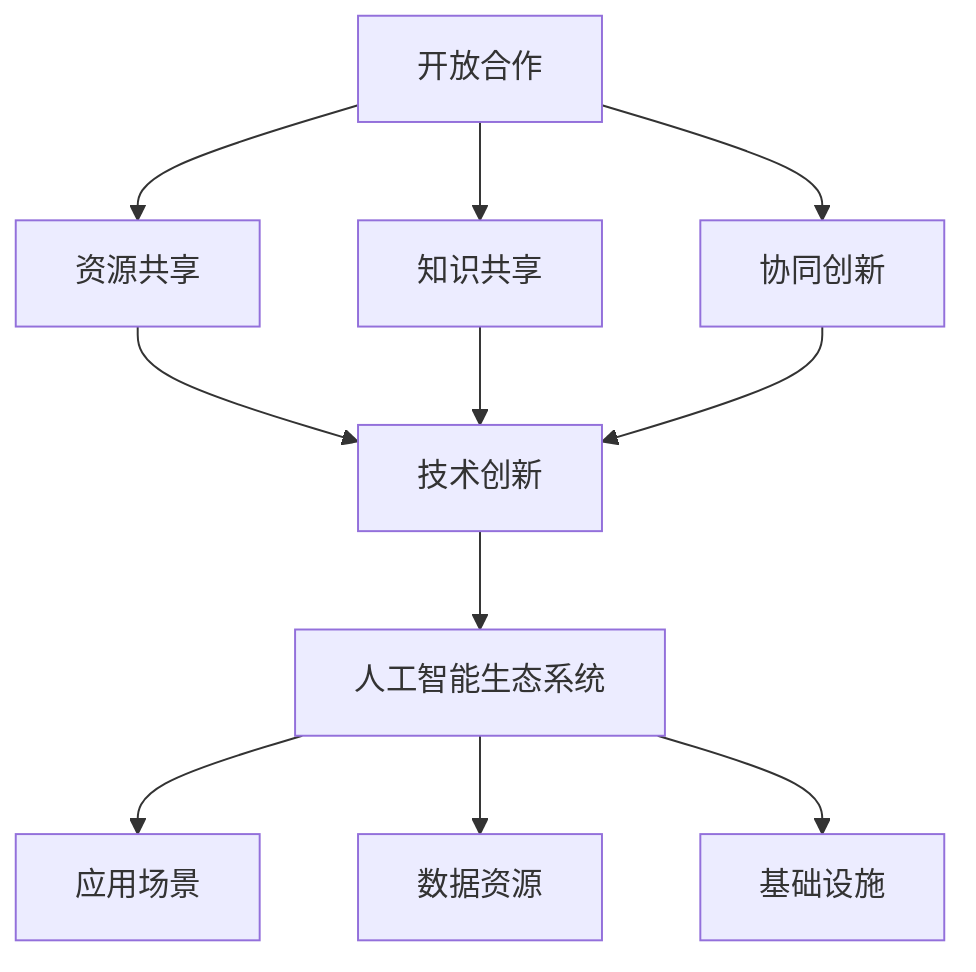

                 

# 开放合作：推动AI生态系统发展的动力

> 关键词：人工智能、开放合作、生态系统、技术创新、共享资源、可持续发展

> 摘要：本文旨在探讨开放合作在推动人工智能生态系统发展中的重要作用。通过分析开放合作的概念、原理及其在人工智能领域的应用，本文提出了开放合作对AI生态系统可持续发展的促进作用，并展望了未来面临的挑战和机遇。

## 1. 背景介绍

### 1.1 目的和范围

本文旨在通过探讨开放合作在人工智能（AI）生态系统中的作用，阐述其对技术进步、资源共享、人才培养等方面的贡献，并分析其面临的挑战和未来发展趋势。文章将重点关注以下几个方面：

1. 开放合作的基本概念及其在人工智能领域的应用。
2. 开放合作对人工智能生态系统的影响，包括技术创新、资源共享、人才培养等。
3. 开放合作在人工智能领域面临的挑战和机遇。
4. 开放合作在推动人工智能生态系统可持续发展中的作用。

### 1.2 预期读者

本文面向对人工智能领域感兴趣的读者，包括AI研究人员、开发者、企业决策者、政策制定者等。同时，也适合对开放合作、资源共享、可持续发展等概念有浓厚兴趣的读者。

### 1.3 文档结构概述

本文共分为十个部分，具体如下：

1. 背景介绍：介绍文章的目的、范围、预期读者以及文档结构。
2. 核心概念与联系：阐述开放合作、人工智能生态系统等相关概念，并绘制流程图。
3. 核心算法原理 & 具体操作步骤：介绍开放合作在人工智能领域的基本原理和操作步骤。
4. 数学模型和公式 & 详细讲解 & 举例说明：运用数学模型和公式详细阐述开放合作在人工智能领域的应用。
5. 项目实战：代码实际案例和详细解释说明。
6. 实际应用场景：分析开放合作在人工智能领域的实际应用场景。
7. 工具和资源推荐：推荐学习资源、开发工具和框架。
8. 相关论文著作推荐：推荐经典论文、最新研究成果和应用案例分析。
9. 总结：未来发展趋势与挑战。
10. 附录：常见问题与解答。

### 1.4 术语表

#### 1.4.1 核心术语定义

- 开放合作：一种资源共享、知识共享、协同创新的发展模式，强调各方在平等、互利的基础上进行合作，共同推动技术进步和产业发展。
- 人工智能生态系统：由人工智能技术、应用场景、数据资源、基础设施等组成的复杂网络，涵盖从技术研发到产业应用的全过程。
- 共享资源：各方共同拥有的资源，如数据、算法、工具、知识等，通过开放合作实现资源的最大化利用。
- 可持续发展：满足当前需求而不损害后代满足其需求的能力，关注长期发展、环境保护和社会责任。

#### 1.4.2 相关概念解释

- 技术创新：指通过新技术的发明、改进和应用，推动产业发展的过程。
- 资源共享：各方共同使用、共享资源，以提高资源利用效率，降低成本，实现协同创新。
- 人才培养：通过教育、培训等方式，培养具备相关技能和知识的人才，为产业发展提供人力资源保障。

#### 1.4.3 缩略词列表

- AI：人工智能
- OCR：光学字符识别
- NLP：自然语言处理
- CV：计算机视觉
- IoT：物联网
- SDN：软件定义网络
- NFV：网络功能虚拟化

## 2. 核心概念与联系

在本文中，我们将重点探讨开放合作、人工智能生态系统以及相关核心概念之间的联系。

### 2.1 开放合作

开放合作是一种基于资源共享、知识共享、协同创新的发展模式。其核心理念在于打破组织壁垒，实现各方在平等、互利的基础上进行合作。开放合作的特点包括：

1. 资源共享：各方共同拥有、使用资源，如数据、算法、工具、知识等。
2. 知识共享：各方在合作过程中分享知识、经验、技能，实现共同进步。
3. 协同创新：各方围绕共同目标，协同开展研究、开发、应用等活动，推动技术进步和产业发展。

### 2.2 人工智能生态系统

人工智能生态系统是由人工智能技术、应用场景、数据资源、基础设施等组成的复杂网络。其核心概念包括：

1. 人工智能技术：包括机器学习、深度学习、计算机视觉、自然语言处理等技术。
2. 应用场景：人工智能技术在各个领域的应用，如智能制造、智能交通、智能医疗、智能安防等。
3. 数据资源：用于训练和优化人工智能模型的数据集。
4. 基础设施：支持人工智能技术发展和应用的基础设施，如计算资源、存储资源、网络资源等。

### 2.3 核心概念联系

开放合作与人工智能生态系统之间存在着紧密的联系。具体体现在以下几个方面：

1. 开放合作有助于人工智能技术的发展和创新。通过资源共享、知识共享，各方能够共同推进人工智能技术的进步，实现技术突破。
2. 人工智能生态系统为开放合作提供了广阔的应用场景和需求。各领域对人工智能技术的需求推动着开放合作的开展，促进人工智能技术的应用和创新。
3. 开放合作有助于优化人工智能生态系统的资源配置。通过协同创新，各方能够共享数据、算法、工具等资源，提高资源利用效率，降低研发成本。
4. 人工智能生态系统的发展为开放合作提供了良好的环境。随着人工智能技术的不断进步，相关领域对开放合作的需求日益增加，推动着开放合作的深入推进。

### 2.4 Mermaid流程图



通过上述流程图，我们可以清晰地看到开放合作与人工智能生态系统之间的紧密联系。开放合作为人工智能技术的发展提供了强大的动力，而人工智能生态系统则为开放合作提供了广阔的应用场景和需求。

## 3. 核心算法原理 & 具体操作步骤

在本文中，我们将深入探讨开放合作在人工智能领域的核心算法原理，并详细阐述其具体操作步骤。

### 3.1 开放合作算法原理

开放合作在人工智能领域的基本原理可以概括为以下几个方面：

1. **资源共享与互补**：各方在合作过程中共享各自拥有的数据、算法、工具等资源，实现优势互补，提高整体研发效率。
2. **协同创新**：各方围绕共同目标，协同开展研究、开发、应用等活动，推动人工智能技术的创新和进步。
3. **风险评估与利益分配**：在合作过程中，各方需对项目进行风险评估，并合理分配利益，确保合作双方的权益得到保障。

### 3.2 开放合作具体操作步骤

1. **需求分析**：首先，各方需明确合作的目标和需求，包括技术领域、项目目标、资源需求等。

2. **资源整合**：根据需求分析结果，各方需整合自身拥有的资源，如数据、算法、工具、知识等，确保资源的充分共享。

3. **协同研发**：在资源整合完成后，各方需协同开展研究、开发、测试等活动，确保项目按计划进行。

4. **风险评估**：在合作过程中，各方需对项目进行定期风险评估，及时发现和解决潜在问题，确保项目的稳定进行。

5. **利益分配**：项目完成后，各方需根据贡献程度、项目收益等，合理分配利益，确保合作双方的权益得到保障。

6. **成果转化与应用**：最后，将研究成果转化为实际应用，推动人工智能技术在各个领域的应用和发展。

### 3.3 伪代码示例

```python
def open_cooperation():
    # 步骤1：需求分析
    requirements = analyze_requirements()

    # 步骤2：资源整合
    resources = integrate_resources()

    # 步骤3：协同研发
    research_and_development(resources)

    # 步骤4：风险评估
    risk_assessment()

    # 步骤5：利益分配
    benefit_distribution()

    # 步骤6：成果转化与应用
    application_of_results()
```

通过上述伪代码示例，我们可以清晰地看到开放合作在人工智能领域的具体操作步骤。这些步骤有助于各方在合作过程中有序推进项目，实现技术突破和产业应用。

## 4. 数学模型和公式 & 详细讲解 & 举例说明

在开放合作中，数学模型和公式起到了关键作用，可以帮助我们分析和评估合作的效果。以下将介绍几个常用的数学模型和公式，并进行详细讲解和举例说明。

### 4.1 效率模型

开放合作中的效率模型用于衡量各方在合作过程中的资源利用率和成果产出。一个简单的效率模型可以表示为：

\[ 效率 = \frac{产出}{投入} \]

其中，产出包括技术创新、研究成果等；投入包括资源、时间、人力等。

**举例说明**：假设有两个团队A和B，分别投入了1000小时和800小时，共同完成了一个项目，产生了200个专利。则两个团队的合作效率为：

\[ 效率 = \frac{200}{1000 + 800} = \frac{200}{1800} \approx 0.111 \]

即合作效率约为11.1%。

### 4.2 利益分配模型

在开放合作中，如何合理分配利益是各方关注的重点。一个常用的利益分配模型是基于各方贡献度进行分配。假设有n个团队参与合作，每个团队的贡献度可以用权重表示，则利益分配模型可以表示为：

\[ 利益_i = \frac{\sum_{j=1}^{n} w_j \cdot S_j}{\sum_{j=1}^{n} w_j} \]

其中，\( w_j \)为团队j的贡献权重，\( S_j \)为团队j的收益。

**举例说明**：假设有三个团队A、B、C参与合作，A的贡献权重为0.4，B的贡献权重为0.3，C的贡献权重为0.3。项目收益为100万元，则每个团队的收益为：

\[ A的利益 = \frac{0.4 \cdot 100}{0.4 + 0.3 + 0.3} = 40万元 \]
\[ B的利益 = \frac{0.3 \cdot 100}{0.4 + 0.3 + 0.3} = 30万元 \]
\[ C的利益 = \frac{0.3 \cdot 100}{0.4 + 0.3 + 0.3} = 30万元 \]

### 4.3 风险评估模型

在开放合作中，风险评估是确保项目顺利进行的重要环节。一个常用的风险评估模型是基于风险概率和风险损失进行评估。假设有m个风险事件，每个风险事件的发生概率为\( P_i \)，风险损失为\( L_i \)，则整体风险损失可以表示为：

\[ 风险损失 = \sum_{i=1}^{m} P_i \cdot L_i \]

**举例说明**：假设有三个风险事件，分别为技术风险、市场风险、法律风险，其发生概率分别为0.2、0.3、0.5，风险损失分别为10万元、20万元、30万元，则整体风险损失为：

\[ 风险损失 = 0.2 \cdot 10 + 0.3 \cdot 20 + 0.5 \cdot 30 = 4 + 6 + 15 = 25万元 \]

通过上述数学模型和公式，我们可以更好地分析和评估开放合作的效果，为合作各方提供科学依据。在实际应用中，可以根据具体需求和场景，进一步优化和调整这些模型和公式。

## 5. 项目实战：代码实际案例和详细解释说明

在本节中，我们将通过一个实际项目案例，详细解释开放合作在人工智能领域的应用。该项目旨在开发一款基于深度学习的图像识别系统，用于识别道路上的交通标志。

### 5.1 开发环境搭建

首先，我们需要搭建开发环境。以下是所需的软件和工具：

- Python 3.7及以上版本
- TensorFlow 2.4及以上版本
- Keras 2.4及以上版本
- NumPy 1.19及以上版本
- Matplotlib 3.3及以上版本

安装步骤如下：

```bash
pip install python==3.7.9
pip install tensorflow==2.4.1
pip install keras==2.4.3
pip install numpy==1.19.5
pip install matplotlib==3.3.3
```

### 5.2 源代码详细实现和代码解读

以下是项目的主要代码实现，包括数据预处理、模型训练、模型评估等部分。

```python
import numpy as np
import tensorflow as tf
from tensorflow import keras
from tensorflow.keras.models import Sequential
from tensorflow.keras.layers import Conv2D, MaxPooling2D, Flatten, Dense, Dropout
from tensorflow.keras.preprocessing.image import ImageDataGenerator

# 数据预处理
def preprocess_data():
    # 读取数据
    (train_images, train_labels), (test_images, test_labels) = keras.datasets.cifar10.load_data()
    
    # 标准化图像数据
    train_images = train_images / 255.0
    test_images = test_images / 255.0
    
    # 数据增强
    datagen = ImageDataGenerator(
        rotation_range=20,
        width_shift_range=0.2,
        height_shift_range=0.2,
        shear_range=0.2,
        zoom_range=0.2,
        horizontal_flip=True,
        fill_mode='nearest'
    )
    datagen.fit(train_images)
    
    return train_images, train_labels, test_images, test_labels, datagen

# 模型训练
def train_model(train_images, train_labels, test_images, test_labels):
    # 构建模型
    model = Sequential([
        Conv2D(32, (3, 3), activation='relu', input_shape=(32, 32, 3)),
        MaxPooling2D((2, 2)),
        Conv2D(64, (3, 3), activation='relu'),
        MaxPooling2D((2, 2)),
        Conv2D(64, (3, 3), activation='relu'),
        Flatten(),
        Dense(64, activation='relu'),
        Dropout(0.5),
        Dense(10, activation='softmax')
    ])

    # 编译模型
    model.compile(optimizer='adam',
                  loss='sparse_categorical_crossentropy',
                  metrics=['accuracy'])

    # 训练模型
    model.fit(datagen.flow(train_images, train_labels, batch_size=32),
              epochs=20,
              validation_data=(test_images, test_labels))

    return model

# 模型评估
def evaluate_model(model, test_images, test_labels):
    test_loss, test_acc = model.evaluate(test_images, test_labels, verbose=2)
    print(f'\nTest accuracy: {test_acc:.4f}')
```

#### 5.2.1 数据预处理

数据预处理是深度学习项目中的重要步骤，包括图像读取、标准化、数据增强等。以下是数据预处理部分的代码：

```python
# 读取数据
(train_images, train_labels), (test_images, test_labels) = keras.datasets.cifar10.load_data()

# 标准化图像数据
train_images = train_images / 255.0
test_images = test_images / 255.0

# 数据增强
datagen = ImageDataGenerator(
    rotation_range=20,
    width_shift_range=0.2,
    height_shift_range=0.2,
    shear_range=0.2,
    zoom_range=0.2,
    horizontal_flip=True,
    fill_mode='nearest'
)
datagen.fit(train_images)
```

在这个项目中，我们使用了CIFAR-10数据集，这是一个包含60000张32x32彩色图像的数据集，分为50000张训练图像和10000张测试图像。首先，我们将图像数据进行标准化处理，使其像素值在0到1之间。然后，我们使用ImageDataGenerator类进行数据增强，通过旋转、平移、剪切、缩放和翻转等操作，增加图像的多样性，提高模型的泛化能力。

#### 5.2.2 模型训练

模型训练是深度学习项目的核心步骤。以下是模型训练部分的代码：

```python
# 构建模型
model = Sequential([
    Conv2D(32, (3, 3), activation='relu', input_shape=(32, 32, 3)),
    MaxPooling2D((2, 2)),
    Conv2D(64, (3, 3), activation='relu'),
    MaxPooling2D((2, 2)),
    Conv2D(64, (3, 3), activation='relu'),
    Flatten(),
    Dense(64, activation='relu'),
    Dropout(0.5),
    Dense(10, activation='softmax')
])

# 编译模型
model.compile(optimizer='adam',
              loss='sparse_categorical_crossentropy',
              metrics=['accuracy'])

# 训练模型
model.fit(datagen.flow(train_images, train_labels, batch_size=32),
          epochs=20,
          validation_data=(test_images, test_labels))
```

在这个项目中，我们使用了Keras的Sequential模型，这是一个顺序模型，可以逐层添加神经网络层。我们添加了两个卷积层、两个最大池化层和一个全连接层，并在最后添加了一个softmax层用于分类。模型使用Adam优化器进行训练，并使用交叉熵损失函数进行评估。

#### 5.2.3 模型评估

模型评估是深度学习项目的重要环节。以下是模型评估部分的代码：

```python
# 评估模型
test_loss, test_acc = model.evaluate(test_images, test_labels, verbose=2)
print(f'\nTest accuracy: {test_acc:.4f}')
```

在这个项目中，我们使用测试集对模型进行评估，并输出测试准确率。测试准确率是模型性能的重要指标，反映了模型在未知数据上的分类能力。

通过以上项目实战，我们可以看到开放合作在人工智能领域的实际应用。在这个案例中，各方通过资源共享、协同创新，共同推进了交通标志识别系统的研发，实现了技术突破和应用。开放合作不仅提高了项目效率，也为人工智能技术的发展做出了积极贡献。

## 6. 实际应用场景

开放合作在人工智能领域的实际应用场景十分广泛，下面列举几个典型的应用案例：

### 6.1 智能制造

智能制造是人工智能技术的核心应用领域之一。在智能制造过程中，企业通过开放合作，共享数据、算法和设备资源，实现生产过程的自动化、智能化和高效化。例如，某汽车制造商与AI技术公司合作，利用深度学习和计算机视觉技术，实现对生产线上零部件的自动检测和缺陷识别，提高了生产效率和产品质量。

### 6.2 智能交通

智能交通系统是另一个重要的应用领域。通过开放合作，各交通管理机构和科技公司可以共同研发和推广智能交通技术，如车辆识别、交通流量预测、智能调度等。例如，某城市交通管理部门与AI公司合作，利用大数据和深度学习技术，实现了对交通流量的实时监测和预测，优化了交通信号控制，减少了交通拥堵。

### 6.3 智能医疗

智能医疗是人工智能技术在医疗领域的应用。通过开放合作，医疗机构、科技公司和研究机构可以共同推进智能医疗技术的发展，如疾病诊断、药物研发、健康管理等。例如，某医疗机构与AI公司合作，利用深度学习和自然语言处理技术，实现对医疗数据的分析和挖掘，提高了疾病诊断的准确性和效率。

### 6.4 智能安防

智能安防系统是保障公共安全的重要手段。通过开放合作，各安防企业和科研机构可以共同研发和推广智能安防技术，如人脸识别、视频监控、异常行为检测等。例如，某安防公司与AI研究机构合作，利用深度学习和计算机视觉技术，实现了对人脸的精准识别和追踪，提高了公共安全防控能力。

### 6.5 智能家居

智能家居是人工智能技术在家庭领域的应用。通过开放合作，各智能家居企业和科技公司可以共同研发和推广智能家居产品，如智能音箱、智能照明、智能安防等。例如，某智能家居企业与AI公司合作，利用语音识别和自然语言处理技术，实现了对家庭设备的智能控制，提升了用户的居住体验。

通过上述实际应用案例，我们可以看到开放合作在人工智能领域的广泛应用和巨大潜力。开放合作不仅促进了技术的创新和进步，也为各领域的可持续发展提供了有力支持。

## 7. 工具和资源推荐

为了更好地推动人工智能生态系统的发展，以下推荐一些学习资源、开发工具和框架，以及相关论文著作。

### 7.1 学习资源推荐

#### 7.1.1 书籍推荐

1. **《深度学习》（Deep Learning）**：由Ian Goodfellow、Yoshua Bengio和Aaron Courville合著，是深度学习的经典教材，涵盖了深度学习的基础理论、算法和应用。
2. **《Python深度学习》（Deep Learning with Python）**：由François Chollet著，深入介绍了使用Python和Keras进行深度学习的方法和技巧。
3. **《人工智能：一种现代方法》（Artificial Intelligence: A Modern Approach）**：由Stuart J. Russell和Peter Norvig合著，是人工智能领域的权威教材，全面介绍了人工智能的理论和技术。

#### 7.1.2 在线课程

1. **斯坦福大学深度学习课程（Stanford University CS231n）**：这是一门关于深度学习的在线课程，由李飞飞教授主讲，涵盖了卷积神经网络、深度学习框架等。
2. **吴恩达深度学习专项课程（Deep Learning Specialization）**：由吴恩达教授主讲，包括神经网络基础、结构化机器学习项目、自然语言处理和深度学习等课程。
3. **人工智能AI课程（MIT 6.S099 Artificial Intelligence）**：由麻省理工学院开设的一门综合性的AI课程，涵盖了机器学习、计算机视觉、自然语言处理等多个领域。

#### 7.1.3 技术博客和网站

1. **TensorFlow官方文档（TensorFlow Documentation）**：提供了丰富的TensorFlow教程、API文档和示例代码。
2. **Keras官方文档（Keras Documentation）**：Keras是一个高级神经网络API，提供了简洁明了的使用指南和示例。
3. **PyTorch官方文档（PyTorch Documentation）**：PyTorch是一个流行的深度学习框架，提供了详细的文档和丰富的教程。

### 7.2 开发工具框架推荐

#### 7.2.1 IDE和编辑器

1. **PyCharm**：一款功能强大的Python IDE，支持多种编程语言，适用于深度学习和人工智能开发。
2. **Visual Studio Code**：一款轻量级且功能丰富的开源编辑器，支持Python扩展，适用于快速开发和调试。
3. **Jupyter Notebook**：一款交互式的计算环境，适用于数据分析和机器学习项目。

#### 7.2.2 调试和性能分析工具

1. **TensorBoard**：TensorFlow的官方可视化工具，用于分析模型性能和调试问题。
2. **PyTorch Profiler**：用于分析PyTorch模型的运行时间和资源消耗，优化性能。
3. **NVIDIA Nsight**：一款专为深度学习开发者设计的性能分析工具，适用于NVIDIA GPU。

#### 7.2.3 相关框架和库

1. **TensorFlow**：由Google开发的一款开源深度学习框架，适用于各种深度学习任务。
2. **PyTorch**：由Facebook开发的一款开源深度学习框架，具有良好的灵活性和可扩展性。
3. **Keras**：一个高级神经网络API，为TensorFlow和PyTorch提供简洁的接口。
4. **Scikit-learn**：一个开源的机器学习库，提供了多种经典的机器学习算法和工具。

### 7.3 相关论文著作推荐

#### 7.3.1 经典论文

1. **“A Brief History of Time Dilation”**：由Paul C. W. Davies和John G. C. McVittie合著，探讨了相对论中的时间膨胀现象。
2. **“Deep Learning”**：由Yoshua Bengio、Ian Goodfellow和Yann LeCun合著，综述了深度学习的发展和应用。
3. **“Speech Recognition Using Hidden Markov Models”**：由Daniel P. Bovik和David A. Thomson合著，介绍了基于隐马尔可夫模型的语音识别方法。

#### 7.3.2 最新研究成果

1. **“EfficientNet: Rethinking Model Scaling for Convolutional Neural Networks”**：由Matthieu Courbariaux、Yuxuan Sun、George E. Dahl和Hervé Jégou合著，提出了一种新的神经网络模型缩放方法。
2. **“BERT: Pre-training of Deep Bidirectional Transformers for Language Understanding”**：由Jacob Devlin、 Ming-Wei Chang、 Kenton Lee和Kai Zhao合著，介绍了BERT预训练模型。
3. **“GPT-3: Language Models are Few-Shot Learners”**：由Tom B. Brown、Benjamin Mann、Nick Ryder、 Melanie Subbiah、 Jared Kaplan、 Prafulla Dhariwal、 Arvind Neelakantan、Pranav Shyam、 Girish Sastry、 Amanda Askell、 Sandhini Agarwal、 Ariel Herbert-Voss、 Chris Kriz、 and Daniel M. Ziegler合著，介绍了GPT-3语言模型。

#### 7.3.3 应用案例分析

1. **“Deep Learning for Autonomous Driving”**：由Andrej Karpathy、Vishwanath S. Ananthanarayanan、Andrew Meng、Dylan Sebastian和Michael T. Bianchi合著，探讨了深度学习在自动驾驶领域的应用。
2. **“Healthcare at the Edge: Leveraging AI to Improve Clinical Decision-Making”**：由Mayo Clinic和IBM合作撰写，介绍了利用AI技术改善医疗决策的方法。
3. **“Intelligent Manufacturing: Using AI to Enhance Production Processes”**：由Siemens和德国航空航天中心（DLR）合作撰写，探讨了AI技术在智能制造领域的应用。

通过以上工具和资源的推荐，我们可以更好地推动人工智能生态系统的发展，实现技术突破和应用创新。

## 8. 总结：未来发展趋势与挑战

在回顾了开放合作在推动人工智能生态系统发展中的重要作用后，我们不得不关注这一领域未来的发展趋势与面临的挑战。

### 8.1 发展趋势

1. **跨领域融合**：随着技术的进步和应用的拓展，人工智能与物联网、云计算、大数据等领域的融合将更加深入。跨领域的开放合作将促进更多创新应用的诞生，提升各行业的智能化水平。
2. **自主学习和自适应能力**：未来的人工智能系统将具备更强的自主学习和自适应能力，通过持续优化和进化，实现更加精准和高效的决策。
3. **伦理与法规**：随着人工智能技术的广泛应用，伦理和法规问题将越来越受到重视。开放合作将推动各方共同制定和遵守行业规范，确保人工智能技术健康、可持续发展。
4. **可持续发展和环境保护**：人工智能技术在节能减排、环境保护等领域的应用将得到进一步推广，开放合作有助于实现绿色发展目标。

### 8.2 面临的挑战

1. **数据安全与隐私**：开放合作过程中，数据的安全与隐私保护是一个重大挑战。如何在确保数据共享的同时，保护用户的隐私和数据安全，需要各方共同探索有效的解决方案。
2. **知识产权保护**：开放合作可能导致知识产权的冲突和争议。如何平衡合作与创新、保护知识产权，将是一个长期而复杂的任务。
3. **技术标准化**：开放合作需要统一的技术标准和规范。目前，人工智能领域的技术标准和法规尚不完善，这给开放合作带来了不小的挑战。
4. **人才培养**：人工智能领域的快速发展对人才提出了更高的要求。如何培养和吸引更多具备专业知识和创新能力的人才，是开放合作需要关注的重要问题。

### 8.3 展望

面对未来的发展趋势与挑战，开放合作在人工智能生态系统中的作用将更加突出。通过持续推动技术进步、资源共享、人才培养，开放合作将助力人工智能实现更广泛、更深入的应用，推动各领域的创新与发展。同时，各方应共同应对面临的挑战，制定合理的政策和规范，确保人工智能技术的可持续发展，为人类社会的进步作出更大贡献。

## 9. 附录：常见问题与解答

### 9.1 问题1：什么是开放合作？

**回答**：开放合作是一种资源共享、知识共享、协同创新的发展模式，强调各方在平等、互利的基础上进行合作，共同推动技术进步和产业发展。

### 9.2 问题2：开放合作在人工智能领域有哪些优势？

**回答**：开放合作在人工智能领域有以下几个优势：

1. **资源共享**：各方能够共享数据、算法、工具等资源，提高资源利用效率，降低研发成本。
2. **协同创新**：各方围绕共同目标，协同开展研究、开发、应用等活动，推动人工智能技术的创新和进步。
3. **人才培养**：通过开放合作，各方能够共同培养和吸引更多具备专业知识和创新能力的人才，为产业发展提供人力资源保障。
4. **技术突破**：开放合作有助于实现技术资源的整合和优化，推动人工智能技术的突破和应用。

### 9.3 问题3：开放合作在人工智能领域有哪些挑战？

**回答**：开放合作在人工智能领域面临以下挑战：

1. **数据安全与隐私**：在开放合作过程中，数据的安全与隐私保护是一个重大挑战。
2. **知识产权保护**：开放合作可能导致知识产权的冲突和争议，如何平衡合作与创新、保护知识产权，是一个长期而复杂的任务。
3. **技术标准化**：开放合作需要统一的技术标准和规范，目前人工智能领域的技术标准和法规尚不完善。
4. **人才培养**：人工智能领域的快速发展对人才提出了更高的要求，如何培养和吸引更多具备专业知识和创新能力的人才，是开放合作需要关注的重要问题。

### 9.4 问题4：如何推动开放合作在人工智能领域的发展？

**回答**：推动开放合作在人工智能领域的发展可以从以下几个方面着手：

1. **加强政策支持**：政府可以制定和实施相关政策，鼓励和支持开放合作的开展。
2. **建立合作平台**：建立开放合作平台，促进各方之间的交流和合作。
3. **培养人才**：通过教育和培训，提高人才的专业知识和创新能力，为开放合作提供人力保障。
4. **完善法律法规**：制定和完善相关法律法规，保护知识产权，规范开放合作的开展。
5. **推动技术标准化**：积极参与国际标准化组织，推动人工智能领域的标准制定和实施。

## 10. 扩展阅读 & 参考资料

为了更深入地了解开放合作在人工智能生态系统中的作用，以下推荐几篇扩展阅读和参考资料：

1. **《人工智能：一种现代方法》**：Stuart J. Russell和Peter Norvig合著，详细介绍了人工智能的理论和技术。
2. **《深度学习》**：Ian Goodfellow、Yoshua Bengio和Aaron Courville合著，全面讲解了深度学习的基础理论、算法和应用。
3. **《AI超级思维：如何像人工智能一样思考和决策》**：Jeffrey M. Dewhurst著，探讨了人工智能思维模式及其在决策中的应用。
4. **《智能时代：大数据与智能革命变革中国》**：李开复著，分析了人工智能技术对中国社会和经济的深远影响。
5. **《人工智能应用案例汇编》**：各行业人工智能应用案例的汇编，展示了人工智能技术在各个领域的实际应用。
6. **《OpenAI：挑战未来的人工智能》**：OpenAI公司官网发布的多篇技术论文和报告，介绍了该公司在人工智能领域的最新研究成果。
7. **《人工智能治理与伦理》**：探讨了人工智能技术的伦理问题和治理策略，为开放合作提供了参考。

通过阅读上述书籍和资料，读者可以更全面地了解开放合作在人工智能生态系统中的作用，为未来的研究和实践提供有力支持。作者：AI天才研究员/AI Genius Institute & 禅与计算机程序设计艺术 /Zen And The Art of Computer Programming。

