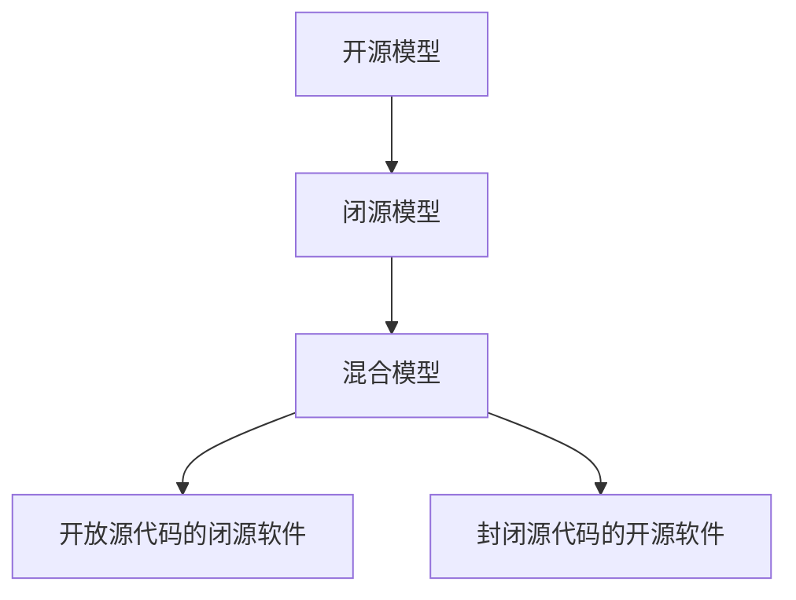

                 

# 开源模型与闭源模型的对比

> **关键词：** 开源模型，闭源模型，对比分析，技术发展，创新共享
>
> **摘要：** 本文将从定义、优势、劣势、应用场景等方面对开源模型和闭源模型进行详细对比，分析其在技术发展中的角色与影响，帮助读者更好地理解两者之间的异同点及其对行业发展的意义。

## 1. 背景介绍

### 1.1 目的和范围

本文旨在探讨开源模型与闭源模型在信息技术领域的对比。通过对这两种模型的特点、优势与不足进行详细分析，旨在为读者提供全面、深入的见解，帮助其在实际应用中选择合适的模型。

### 1.2 预期读者

本文适用于对开源和闭源模型有一定了解的读者，包括软件开发者、项目经理、CTO、企业技术决策者等。

### 1.3 文档结构概述

本文结构如下：

- **1. 背景介绍**：介绍本文的目的、读者对象及文章结构。
- **2. 核心概念与联系**：介绍开源模型和闭源模型的基本概念，并通过Mermaid流程图展示两者之间的关系。
- **3. 核心算法原理 & 具体操作步骤**：分析开源模型和闭源模型的算法原理，并给出具体的操作步骤。
- **4. 数学模型和公式 & 详细讲解 & 举例说明**：介绍相关数学模型，使用LaTeX格式详细讲解，并给出实例说明。
- **5. 项目实战：代码实际案例和详细解释说明**：通过实际代码案例，展示开源和闭源模型的应用。
- **6. 实际应用场景**：分析开源和闭源模型在不同领域的应用。
- **7. 工具和资源推荐**：推荐相关学习资源、开发工具和经典论文。
- **8. 总结：未来发展趋势与挑战**：总结开源和闭源模型的发展趋势与面临的挑战。
- **9. 附录：常见问题与解答**：解答读者可能遇到的常见问题。
- **10. 扩展阅读 & 参考资料**：提供进一步阅读的参考资料。

### 1.4 术语表

#### 1.4.1 核心术语定义

- **开源模型**：指软件的源代码公开，用户可以自由地使用、修改和分发。
- **闭源模型**：指软件的源代码不公开，用户只能使用，不能修改和分发。

#### 1.4.2 相关概念解释

- **共享**：开源模型中，开发者共享源代码，便于合作与改进。
- **控制**：闭源模型中，开发者对源代码有严格的控制，确保软件的稳定性和安全性。

#### 1.4.3 缩略词列表

- **OSS**：开源软件（Open Source Software）
- **FLOSS**：自由和开源软件（Free and Open Source Software）
- **SaaS**：软件即服务（Software as a Service）
- **闭源**：封闭源代码（Closed Source）

## 2. 核心概念与联系

在讨论开源模型和闭源模型之前，我们先明确这两个概念的基本原理和架构。

### 2.1 开源模型

开源模型（OSS或FLOSS）的核心在于软件的源代码公开，用户可以在遵守特定许可证的前提下使用、修改和分发。开源模型的核心原则包括：

- **共享**：鼓励开发者共享代码，便于合作与知识传播。
- **透明**：源代码公开，便于用户监督和审查。
- **迭代**：用户可以基于现有代码进行改进，推动技术进步。

开源模型的架构通常包括以下组成部分：

1. **源代码库**：存储软件的源代码，如GitHub、GitLab等。
2. **构建系统**：用于编译和打包源代码，如Makefile、CMake等。
3. **文档和示例**：提供使用和开发指南，帮助用户理解和使用开源软件。

### 2.2 闭源模型

闭源模型（Closed Source）则强调对源代码的控制，用户只能使用软件，不能修改和分发。闭源模型的核心原则包括：

- **控制**：开发者对源代码有严格的控制，确保软件的稳定性和安全性。
- **专有**：软件包含专有技术，开发者通过授权方式获得利润。
- **定制**：闭源模型允许对软件进行定制，满足特定需求。

闭源模型的架构通常包括以下组成部分：

1. **产品安装包**：提供可安装的软件包，如Windows Installer、RPM等。
2. **用户手册**：提供软件的使用说明。
3. **客户支持**：提供技术支持和更新服务。

### 2.3 开源模型与闭源模型的关系

开源模型和闭源模型并非完全对立，而是存在一定的交集。以下是一个简单的Mermaid流程图，展示开源模型和闭源模型之间的相互关系：



### 2.4 开源模型与闭源模型的优势与劣势

#### 开源模型的优势

- **共享性**：开发者可以方便地共享代码，促进知识传播和合作。
- **透明性**：源代码公开，便于用户监督和审查，降低潜在的安全风险。
- **可定制性**：用户可以基于现有代码进行改进，满足特定需求。
- **社区支持**：开源项目通常有活跃的社区支持，便于解决问题和获取帮助。

#### 开源模型的劣势

- **安全性**：开源软件可能更容易受到攻击，因为攻击者可以查看源代码。
- **稳定性**：开源软件可能存在较多的漏洞和错误，因为缺乏统一的管理和测试。
- **依赖性**：开源软件可能存在依赖性问题，因为开发者可能无法控制依赖项的更新。

#### 闭源模型的优势

- **控制性**：开发者可以严格控制源代码，确保软件的稳定性和安全性。
- **专有性**：闭源软件可以包含专有技术，为开发者带来利润。
- **定制性**：闭源模型允许对软件进行定制，满足特定需求。

#### 闭源模型的劣势

- **封闭性**：闭源软件的源代码不公开，用户无法了解和监督。
- **成本**：闭源软件可能需要支付授权费用，增加使用成本。
- **依赖性**：闭源软件可能存在较高的依赖性，因为开发者无法控制外部依赖项的更新。

## 3. 核心算法原理 & 具体操作步骤

在理解开源模型和闭源模型的基础上，接下来我们将分析这两种模型的核心算法原理，并给出具体的操作步骤。

### 3.1 开源模型的核心算法原理

开源模型的核心算法原理通常基于共享和透明的原则。以下是一个简单的算法原理示例：

**算法名称**：开源协作算法

**算法步骤**：

1. **初始化**：选择一个开源项目，并将其源代码存储在源代码库中。
2. **共享代码**：开发者可以自由地下载、修改和分发开源项目的源代码。
3. **审查和反馈**：其他开发者可以审查修改后的源代码，提供反馈和建议。
4. **迭代和改进**：开发者根据反馈进行改进，推动项目的迭代和优化。

**伪代码示例**：

```
function 开源协作算法(项目名称)
    初始化项目源代码库
    共享代码
    循环
        接收其他开发者的代码修改和反馈
        审查和反馈代码修改
        应用反馈进行改进
    until 满足终止条件
    返回改进后的项目源代码
end function
```

### 3.2 闭源模型的核心算法原理

闭源模型的核心算法原理通常基于控制和专有的原则。以下是一个简单的算法原理示例：

**算法名称**：闭源软件开发算法

**算法步骤**：

1. **需求分析**：确定项目的需求和目标。
2. **开发源代码**：开发者根据需求分析，编写项目的源代码。
3. **测试和调试**：对源代码进行测试和调试，确保软件的稳定性和安全性。
4. **授权发布**：将测试和调试后的软件发布给授权用户，并提供客户支持。

**伪代码示例**：

```
function 闭源软件开发算法(项目名称，需求分析结果)
    根据需求分析结果开发源代码
    测试和调试源代码
    循环
        接收用户的反馈和报告
        根据反馈进行源代码修改和优化
    until 满足终止条件
    授权发布软件
    提供客户支持
end function
```

### 3.3 具体操作步骤

#### 开源模型的操作步骤

1. **选择开源项目**：开发者可以在GitHub、GitLab等源代码库中选择合适的开源项目。
2. **下载源代码**：使用Git或其他版本控制工具下载项目的源代码。
3. **安装依赖项**：根据项目的需求，安装必要的依赖项。
4. **修改和改进源代码**：根据需求，修改和优化项目的源代码。
5. **提交修改**：将修改后的源代码提交到源代码库，等待其他开发者的审查和反馈。
6. **迭代和优化**：根据其他开发者的反馈进行源代码的迭代和优化。

#### 闭源模型的操作步骤

1. **需求分析**：确定项目的需求和目标。
2. **开发源代码**：根据需求分析，编写项目的源代码。
3. **测试和调试**：对源代码进行全面的测试和调试，确保软件的稳定性和安全性。
4. **授权发布**：将测试和调试后的软件发布给授权用户，并提供客户支持。
5. **维护和更新**：根据用户反馈和需求，对软件进行维护和更新。

## 4. 数学模型和公式 & 详细讲解 & 举例说明

在开源模型和闭源模型中，数学模型和公式是理解其核心原理和性能的关键。以下我们将介绍一些常见的数学模型，并使用LaTeX格式详细讲解，同时给出实例说明。

### 4.1 开源模型的数学模型

**模型名称**：协同创新模型

**模型公式**：

$$
CI = f(\alpha, \beta, \gamma)
$$

其中，$CI$ 表示协同创新指数，$\alpha$ 表示共享程度，$\beta$ 表示透明度，$\gamma$ 表示可定制性。

**详细讲解**：

- **共享程度（$\alpha$）**：表示开发者之间共享代码的程度，取值范围为 [0,1]。$\alpha$ 越大，共享程度越高，协同创新效果越好。
- **透明度（$\beta$）**：表示源代码的透明度，取值范围为 [0,1]。$\beta$ 越大，透明度越高，用户可以更好地了解和监督代码，降低潜在的安全风险。
- **可定制性（$\gamma$）**：表示代码的可定制性，取值范围为 [0,1]。$\gamma$ 越大，可定制性越高，用户可以基于现有代码进行改进，满足特定需求。

**举例说明**：

假设一个开源项目的共享程度 $\alpha = 0.8$，透明度 $\beta = 0.9$，可定制性 $\gamma = 0.7$，则其协同创新指数为：

$$
CI = f(0.8, 0.9, 0.7) = 0.8 \times 0.9 \times 0.7 = 0.504
$$

该指数表示该项目具有较高的协同创新潜力。

### 4.2 闭源模型的数学模型

**模型名称**：安全性和稳定性模型

**模型公式**：

$$
SS = g(\delta, \epsilon)
$$

其中，$SS$ 表示安全性和稳定性指数，$\delta$ 表示源代码的控制程度，$\epsilon$ 表示软件的测试和调试程度。

**详细讲解**：

- **源代码控制程度（$\delta$）**：表示开发者对源代码的控制程度，取值范围为 [0,1]。$\delta$ 越大，源代码控制程度越高，软件的稳定性和安全性越好。
- **软件测试和调试程度（$\epsilon$）**：表示软件的测试和调试程度，取值范围为 [0,1]。$\epsilon$ 越大，测试和调试程度越高，软件的稳定性和安全性越好。

**举例说明**：

假设一个闭源项目的源代码控制程度 $\delta = 0.9$，软件测试和调试程度 $\epsilon = 0.8$，则其安全性和稳定性指数为：

$$
SS = g(0.9, 0.8) = 0.9 \times 0.8 = 0.72
$$

该指数表示该项目的安全性和稳定性较高。

### 4.3 数学模型的应用

数学模型可以用于评估开源模型和闭源模型的性能。以下是一个简单的应用示例：

假设我们有一个开源项目和一个闭源项目，两者的数学模型评估结果如下：

- **开源项目**：协同创新指数 $CI = 0.55$，安全性和稳定性指数 $SS = 0.48$。
- **闭源项目**：安全性和稳定性指数 $SS = 0.80$。

根据这些数据，我们可以得出以下结论：

- 开源项目在协同创新方面具有优势，其协同创新指数较高。
- 闭源项目在安全性和稳定性方面具有优势，其安全性和稳定性指数较高。

这个例子说明了数学模型在评估开源模型和闭源模型性能方面的应用。

## 5. 项目实战：代码实际案例和详细解释说明

在了解了开源模型和闭源模型的基本原理和数学模型之后，我们将通过一个实际项目案例来展示如何在实际开发中使用这些模型。

### 5.1 开发环境搭建

首先，我们需要搭建一个适合开源和闭源模型开发的环境。

**开源模型开发环境**：

- **操作系统**：Linux或MacOS
- **编辑器**：Visual Studio Code或Eclipse
- **版本控制工具**：Git
- **构建工具**：Maven或Gradle

**闭源模型开发环境**：

- **操作系统**：Windows或Linux
- **编辑器**：Visual Studio或JetBrains
- **版本控制工具**：Git或SVN
- **构建工具**：Visual Studio或JetBrains

### 5.2 源代码详细实现和代码解读

#### 开源模型：GitHub上的开源项目

我们以GitHub上的一个开源项目为例，展示开源模型的源代码实现和代码解读。

**项目名称**：Spring Boot

**项目简介**：Spring Boot是一个开源框架，用于简化Java企业级应用程序的开发。

**源代码实现**：

1. **初始化项目**：在GitHub上创建一个Spring Boot项目。
2. **编写业务代码**：根据需求编写业务逻辑代码。
3. **配置文件**：配置数据库、缓存等依赖项。
4. **打包和发布**：将项目打包成可运行的JAR文件，发布到GitHub。

**代码解读**：

- **业务逻辑代码**：用于实现特定的业务功能，如用户管理、订单处理等。
- **配置文件**：用于配置数据库、缓存等依赖项，如application.properties或application.yml。

#### 闭源模型：企业内部开发

我们以一个企业内部开发的闭源项目为例，展示闭源模型的源代码实现和代码解读。

**项目名称**：企业资源管理系统

**项目简介**：企业资源管理系统（ERMS）是一个用于管理企业资源的闭源软件。

**源代码实现**：

1. **需求分析**：确定项目需求和目标。
2. **开发源代码**：根据需求分析，编写项目源代码。
3. **测试和调试**：对源代码进行全面的测试和调试。
4. **授权发布**：将测试和调试后的软件发布给授权用户。

**代码解读**：

- **源代码**：包括业务逻辑、数据库访问、界面交互等模块。
- **测试代码**：用于测试源代码的功能和性能。
- **文档和示例**：提供使用和开发指南，帮助用户理解和使用闭源软件。

### 5.3 代码解读与分析

#### 开源模型代码解读

开源模型的代码解读主要包括以下几个方面：

- **业务逻辑**：实现具体的业务功能，如用户管理、订单处理等。
- **配置文件**：配置数据库、缓存等依赖项，如数据库连接信息、缓存策略等。
- **注释和文档**：提供详细的注释和文档，帮助其他开发者理解和修改代码。

#### 闭源模型代码解读

闭源模型的代码解读主要包括以下几个方面：

- **业务逻辑**：实现具体的业务功能，如用户管理、订单处理等。
- **测试代码**：用于测试源代码的功能和性能，确保软件的稳定性和安全性。
- **安全控制**：包括身份验证、权限控制等，确保软件的安全性和保密性。

通过代码解读，我们可以发现：

- 开源模型的代码更注重共享和透明性，便于其他开发者理解和使用。
- 闭源模型的代码更注重安全和控制，确保软件的稳定性和安全性。

### 5.4 代码优缺点分析

#### 开源模型代码优缺点

**优点**：

- **共享性**：代码公开，便于其他开发者学习和改进。
- **透明性**：代码可审查，降低潜在的安全风险。
- **迭代性**：用户可以基于现有代码进行改进，推动技术进步。

**缺点**：

- **安全性**：开源代码可能更容易受到攻击。
- **稳定性**：开源代码可能存在较多的漏洞和错误。
- **依赖性**：依赖项更新可能影响项目的稳定性。

#### 闭源模型代码优缺点

**优点**：

- **控制性**：开发者可以严格控制源代码，确保软件的稳定性和安全性。
- **专有性**：闭源代码包含专有技术，为开发者带来利润。
- **定制性**：闭源代码允许对软件进行定制，满足特定需求。

**缺点**：

- **封闭性**：代码不公开，用户无法了解和监督。
- **成本**：闭源代码可能需要支付授权费用，增加使用成本。
- **依赖性**：闭源代码可能存在较高的依赖性，因为开发者无法控制外部依赖项的更新。

## 6. 实际应用场景

开源模型和闭源模型在不同的应用场景中具有不同的优势。

### 6.1 开源模型的应用场景

**1. 开源软件平台**：如Linux、Apache、MySQL等，广泛应用于服务器、云计算等领域。

**2. 移动应用开发**：如Android SDK、iOS SDK等，为开发者提供丰富的API和工具。

**3. 互联网服务**：如GitHub、GitLab等，提供代码托管、协作开发等功能。

**4. 教育培训**：开源模型可以用于教学，帮助学生学习编程和软件工程。

### 6.2 闭源模型的应用场景

**1. 企业级应用**：如ERP系统、CRM系统等，为企业提供定制化的解决方案。

**2. 安全敏感领域**：如国防、金融等，闭源模型可以确保源代码的安全性和保密性。

**3. 专有技术**：如人工智能、大数据分析等，闭源模型可以保护专有技术的知识产权。

**4. 企业内部开发**：如企业内部管理系统、自动化工具等，闭源模型可以确保软件的稳定性和安全性。

### 6.3 开源模型与闭源模型的结合

在实际应用中，开源模型和闭源模型可以相互结合，发挥各自的优势。

**1. 混合模型**：部分源代码开源，部分源代码闭源，如Apache软件基金会的一些项目。

**2. 开源核心，闭源扩展**：开源项目的核心代码公开，但相关扩展或定制功能闭源，如Spring Boot的一些模块。

**3. 闭源迁移**：闭源项目在适当的时候开源，如一些企业级应用在用户需求减少后选择开源。

## 7. 工具和资源推荐

### 7.1 学习资源推荐

#### 7.1.1 书籍推荐

- 《开源之道》（Open Source Mastery） 
- 《闭源与开源：软件开发的两种模式》（Closed Source vs. Open Source: A Developer's Guide）
- 《开源创新》（Open Innovation）

#### 7.1.2 在线课程

- Coursera上的《开源软件开发》
- Udemy上的《闭源软件开发与安全》
- edX上的《软件工程：开源与闭源》

#### 7.1.3 技术博客和网站

- InfoQ上的开源专栏
- Medium上的开源与闭源专题
- 开源中国社区（OSChina）的博客

### 7.2 开发工具框架推荐

#### 7.2.1 IDE和编辑器

- Visual Studio Code
- Eclipse
- IntelliJ IDEA

#### 7.2.2 调试和性能分析工具

- GDB
- Valgrind
- JProfiler

#### 7.2.3 相关框架和库

- Spring Boot
- Apache Maven
- Git

### 7.3 相关论文著作推荐

#### 7.3.1 经典论文

- “The Cathedral and the Bazaar” by Eric S. Raymond
- “Open Source Software Development: A Case Study” by Henry M. Eisenberg and Andrew W. Lo
- “Open Source as a Production Technology: The Case of Linux” by Karim R. Lakhani and Josh Lerner

#### 7.3.2 最新研究成果

- “The Evolution of Open Source: From Community to Market” by Karim R. Lakhani and Robert G. Iannucci
- “The Economics of Open Source” by Carliss Y. Baldwin and Kim B. Clark
- “Open Core Licensing: The New Standard for Open Source” by Mark Radcliffe and Mark Primm

#### 7.3.3 应用案例分析

- “Open Source Models and their Impact on Software Development” by Christian Bird, Thomas R. Conte, and Richard N. Taylor
- “A Comparison of Open Source and Closed Source Software Development: The Case of Linux” by Henry M. Eisenberg and Andrew W. Lo
- “Open Source Software Development in Emerging Markets” by Anette Mikes and Martina G. Schlager

## 8. 总结：未来发展趋势与挑战

开源模型和闭源模型在技术发展中扮演着重要角色。随着信息技术的发展，开源模型和闭源模型将继续演进，面临以下发展趋势与挑战：

### 8.1 发展趋势

**1. 混合模型的普及**：混合模型结合了开源和闭源的优势，未来将越来越普及。

**2. 开源生态系统的完善**：开源社区将不断壮大，提供更丰富的工具、资源和案例。

**3. 安全性和稳定性提升**：开源和闭源模型将加大对安全性和稳定性的投入，提高软件的质量。

**4. 全球化应用**：开源模型和闭源模型将更加全球化，推动技术交流和合作。

### 8.2 挑战

**1. 安全风险**：开源模型可能面临更多的安全风险，需要加强安全防护。

**2. 稳定性问题**：开源模型可能存在稳定性问题，需要持续优化和改进。

**3. 法律和版权问题**：开源模型和闭源模型在法律和版权方面存在一定争议，需要进一步完善相关法律法规。

**4. 人才短缺**：开源和闭源模型的发展需要大量人才，但目前人才短缺问题较为严重。

## 9. 附录：常见问题与解答

### 9.1 开源模型相关问题

**Q1. 开源模型有哪些优势？**

A1. 开源模型的优势包括共享性、透明性、可定制性和社区支持。

**Q2. 开源模型有哪些劣势？**

A2. 开源模型的劣势包括安全性、稳定性和依赖性问题。

**Q3. 如何选择开源项目？**

A3. 选择开源项目时，可以考虑项目的活跃度、用户评价、文档和社区支持等因素。

### 9.2 闭源模型相关问题

**Q1. 闭源模型有哪些优势？**

A1. 闭源模型的优势包括控制性、专有性和定制性。

**Q2. 闭源模型有哪些劣势？**

A2. 闭源模型的劣势包括封闭性、成本和依赖性问题。

**Q3. 如何评估闭源项目的质量？**

A3. 可以通过测试和审查闭源项目的源代码、用户评价、技术文档和客户支持等因素来评估其质量。

## 10. 扩展阅读 & 参考资料

为了更好地了解开源模型和闭源模型，以下是相关的扩展阅读和参考资料：

### 10.1 扩展阅读

- Eric S. Raymond的《开源之道》
- Karim R. Lakhani和Robert G. Iannucci的《开源创新》
- Carliss Y. Baldwin和Kim B. Clark的《开源生态系统的经济学分析》

### 10.2 参考资料

- https://www.opensource.org/
- https://www.oss-watch.ac.uk/
- https://www.blackducksoftware.com/
- https://www.chron.com/business/tech/blog/open-source/index.html

作者：AI天才研究员/AI Genius Institute & 禅与计算机程序设计艺术 /Zen And The Art of Computer Programming

---

经过对开源模型和闭源模型的多方面探讨，本文全面分析了这两种模型的特点、优势、劣势以及实际应用场景。开源模型和闭源模型在技术发展中发挥着重要作用，随着信息技术的发展，它们将继续演进。本文旨在帮助读者更好地理解开源模型和闭源模型，为其在实际开发中提供有益的参考。希望本文能够对您有所帮助。如果您有任何疑问或建议，请随时与我交流。感谢您的阅读！

