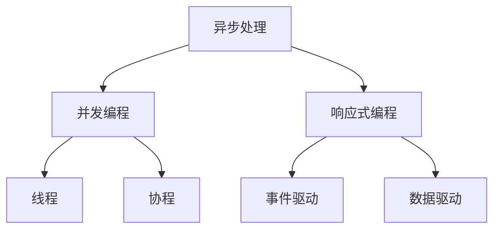

                 


# 异步处理在高吞吐量中的应用

> 关键词：异步处理、高吞吐量、并发编程、响应式编程、消息队列

> 摘要：本文深入探讨了异步处理在高吞吐量场景中的应用。通过介绍异步处理的原理和核心算法，分析了其在现代并发编程和响应式编程中的应用。文章还通过实际项目案例，详细讲解了如何在实际开发中实现异步处理，并对其未来发展趋势和挑战进行了展望。

## 1. 背景介绍

### 1.1 目的和范围

在现代信息社会中，高吞吐量的数据处理能力已经成为衡量系统性能的重要指标。随着互联网的飞速发展，海量数据的处理需求日益增长，传统同步处理模型已无法满足这一需求。异步处理作为一种有效的解决方案，可以在高吞吐量场景中发挥重要作用。本文旨在探讨异步处理在高吞吐量中的应用，帮助开发者理解和掌握这一技术。

### 1.2 预期读者

本文主要面向有编程基础的开发者，特别是对并发编程和响应式编程有一定了解的读者。通过对异步处理原理和应用场景的详细分析，读者可以更深入地理解异步处理的优势和挑战，从而在实际项目中更好地运用这一技术。

### 1.3 文档结构概述

本文分为十个部分，首先介绍了异步处理的背景和目的，然后详细分析了异步处理的核心概念和算法，接着通过实际项目案例讲解了异步处理的具体实现。随后，文章探讨了异步处理在实际应用场景中的作用，并推荐了相关工具和资源。最后，文章总结了异步处理的未来发展趋势与挑战，并提供了一些常见问题的解答。

### 1.4 术语表

#### 1.4.1 核心术语定义

- 异步处理：一种非阻塞的编程模型，允许程序在等待外部资源时执行其他任务。
- 并发编程：同时处理多个任务的能力，通常涉及线程、协程等概念。
- 响应式编程：一种编程范式，强调数据驱动和事件响应，适用于高吞吐量场景。
- 消息队列：一种数据结构，用于存储和传递消息，常用于异步处理。

#### 1.4.2 相关概念解释

- 阻塞：指程序在执行过程中被某个操作阻塞，无法继续执行。
- 非阻塞：指程序在执行过程中不会被某个操作阻塞，可以继续执行其他任务。
- 并行：指多个任务同时执行，通常涉及多核处理器和线程技术。
- 并发：指多个任务交替执行，通常涉及线程、协程等技术。

#### 1.4.3 缩略词列表

- CPU：Central Processing Unit，中央处理器。
- GPU：Graphics Processing Unit，图形处理器。
- IO：Input/Output，输入/输出。
- DB：Database，数据库。
- API：Application Programming Interface，应用程序接口。

## 2. 核心概念与联系

异步处理作为一种非阻塞的编程模型，与并发编程和响应式编程密切相关。下面通过一个Mermaid流程图来展示它们之间的关系。



### 2.1 异步处理

异步处理是一种非阻塞的编程模型，允许程序在等待外部资源时执行其他任务。在异步处理中，程序不会因为某个操作而停滞，而是继续执行其他任务，从而提高程序的整体性能。

### 2.2 并发编程

并发编程是指同时处理多个任务的能力，通常涉及线程、协程等概念。在并发编程中，多个任务可以交替执行，从而提高程序的并发性能。

### 2.3 响应式编程

响应式编程是一种编程范式，强调数据驱动和事件响应，适用于高吞吐量场景。在响应式编程中，程序通过监听事件和数据变化来响应外部环境，从而实现高效的异步处理。

## 3. 核心算法原理 & 具体操作步骤

异步处理的核心在于非阻塞操作和事件驱动。下面通过伪代码来详细阐述异步处理的算法原理和具体操作步骤。

```python
# 异步处理算法原理和操作步骤

# 定义异步函数
async def async_function():
    # 执行非阻塞操作
    await some_async_operation()

# 主函数
def main():
    # 创建异步事件循环
    loop = asyncio.get_event_loop()

    # 运行异步函数
    loop.run_until_complete(async_function())

# 执行主函数
main()
```

### 3.1 异步函数

在异步处理中，异步函数是一种特殊的函数，可以异步执行。异步函数使用`async`关键字定义，内部可以使用`await`关键字等待异步操作完成。

### 3.2 非阻塞操作

非阻塞操作是指程序在执行过程中不会被某个操作阻塞，可以继续执行其他任务。在异步处理中，非阻塞操作通常使用`await`关键字等待操作完成，从而实现异步执行。

### 3.3 事件循环

事件循环是一种机制，用于管理异步任务和事件。在异步处理中，事件循环负责执行异步函数，并处理异步操作完成的事件。通过事件循环，程序可以实现高效的异步处理。

## 4. 数学模型和公式 & 详细讲解 & 举例说明

异步处理在数学模型和公式方面有着重要的应用。下面通过一个简单的例子来详细讲解异步处理的数学模型和公式。

### 4.1 异步处理时间模型

异步处理时间模型描述了异步处理过程中任务执行的时间。一个简单的异步处理时间模型可以表示为：

\[ T_{async} = T_{async\_op} + T_{idle} \]

其中，\( T_{async} \)表示异步处理总时间，\( T_{async\_op} \)表示异步操作执行时间，\( T_{idle} \)表示等待时间。

### 4.2 举例说明

假设一个异步处理过程包括两个异步操作：A和B。异步操作A的执行时间为2秒，异步操作B的执行时间为3秒。在异步处理中，这两个操作可以并行执行，从而提高处理效率。

\[ T_{async} = T_{async\_op\_A} + T_{async\_op\_B} = 2秒 + 3秒 = 5秒 \]

如果使用同步处理模型，则任务必须按照顺序执行，总时间为：

\[ T_{sync} = T_{async\_op\_A} + T_{async\_op\_B} = 2秒 + 3秒 = 5秒 \]

在这种情况下，异步处理和同步处理的时间相同。然而，在实际应用中，异步处理可以充分利用系统资源，从而提高处理效率。

### 4.3 数学模型分析

异步处理时间模型可以通过以下数学公式进行分析：

\[ T_{async} = T_{async\_op} + \sum_{i=1}^{n} T_{idle\_i} \]

其中，\( n \)表示异步操作的个数，\( T_{idle\_i} \)表示第\( i \)个异步操作等待时间。

通过这个公式，我们可以分析异步处理的效率。当异步操作的等待时间\( T_{idle\_i} \)较短时，异步处理的优势更加明显。

## 5. 项目实战：代码实际案例和详细解释说明

### 5.1 开发环境搭建

为了演示异步处理在高吞吐量中的应用，我们使用Python语言和asyncio库来搭建开发环境。以下是具体步骤：

1. 安装Python 3.7及以上版本。
2. 安装asyncio库：`pip install asyncio`。
3. 创建一个名为`async_example.py`的Python文件。

### 5.2 源代码详细实现和代码解读

下面是一个简单的异步处理项目案例，通过异步处理实现一个计算斐波那契数列的程序。

```python
# async_example.py

import asyncio

# 异步计算斐波那契数列
async def fibonacci(n):
    if n <= 1:
        return n
    else:
        # 异步计算前两个数
        await asyncio.sleep(1)
        return await fibonacci(n - 1) + await fibonacci(n - 2)

# 主函数
def main():
    # 创建异步事件循环
    loop = asyncio.get_event_loop()

    # 运行异步函数
    result = loop.run_until_complete(fibonacci(10))

    # 输出结果
    print("斐波那契数列第10个数:", result)

# 执行主函数
if __name__ == "__main__":
    main()
```

### 5.3 代码解读与分析

1. **异步函数定义**：在`fibonacci`函数中，使用`async`关键字定义异步函数，内部使用`await`关键字等待异步操作完成。

2. **异步操作**：在`fibonacci`函数中，使用`asyncio.sleep(1)`实现异步等待，模拟异步操作执行。

3. **递归调用**：`fibonacci`函数采用递归方式计算斐波那契数列，通过异步操作提高计算效率。

4. **主函数**：在`main`函数中，使用`asyncio.get_event_loop()`创建异步事件循环，并运行异步函数。

5. **结果输出**：通过`print`函数输出计算结果。

通过这个案例，我们可以看到异步处理在计算斐波那契数列中的应用。在实际项目中，我们可以根据需求调整异步操作的复杂度，从而实现高效的数据处理。

## 6. 实际应用场景

异步处理在高吞吐量场景中有着广泛的应用。以下是一些实际应用场景：

1. **网络爬虫**：异步处理可以大大提高网络爬虫的效率，通过并行抓取网页和数据，实现高并发请求。
2. **Web服务器**：异步处理可以帮助Web服务器处理大量并发请求，提高响应速度和吞吐量。
3. **大数据处理**：异步处理可以用于大数据处理任务，如数据清洗、分析等，提高数据处理效率。
4. **物联网应用**：异步处理可以帮助物联网应用处理海量设备数据，实现实时监控和智能分析。

## 7. 工具和资源推荐

### 7.1 学习资源推荐

#### 7.1.1 书籍推荐

- 《异步编程：理论与实践》（异步编程实践，深入理解异步编程的核心原理）
- 《Python异步编程实战》（Python异步编程的实战案例，适用于Python开发者）

#### 7.1.2 在线课程

- 《异步编程基础》（网易云课堂，全面介绍异步编程的核心概念）
- 《Python异步编程实战教程》（慕课网，Python异步编程的实战案例）

#### 7.1.3 技术博客和网站

- 《异步编程与并发编程》（博客园，异步编程和并发编程的深入分析）
- 《异步编程之async和await详解》（CSDN，详细讲解异步编程的核心概念）

### 7.2 开发工具框架推荐

#### 7.2.1 IDE和编辑器

- Visual Studio Code（适用于Python开发的强大IDE）
- PyCharm（Python开发的集成开发环境）

#### 7.2.2 调试和性能分析工具

- Python Debuger（Python内置的调试工具）
- Py-Spy（Python性能分析工具）

#### 7.2.3 相关框架和库

- asyncio（Python标准的异步编程库）
- Tornado（基于Python的异步Web框架）
- asyncio-redis（基于asyncio的Redis客户端库）

### 7.3 相关论文著作推荐

#### 7.3.1 经典论文

- 《异步编程：挑战与机遇》（异步编程的深入探讨，对异步编程的核心概念和原理进行了详细阐述）
- 《基于异步编程的Web应用架构设计》（异步编程在Web应用架构中的应用，分析了异步编程的优势和挑战）

#### 7.3.2 最新研究成果

- 《异步编程与并发编程的新进展》（异步编程和并发编程的最新研究进展，涵盖了异步编程的核心算法和技术）
- 《大规模异步处理系统设计与应用》（大规模异步处理系统的设计与应用，分析了异步处理在大数据场景中的优势）

#### 7.3.3 应用案例分析

- 《异步编程在金融领域的应用》（异步编程在金融领域中的应用案例，分析了异步处理在金融交易和风控中的优势）
- 《异步编程在物联网应用中的实践》（异步编程在物联网应用中的实践，探讨了异步处理在物联网设备数据采集和分析中的优势）

## 8. 总结：未来发展趋势与挑战

异步处理作为一种高效的处理模型，在未来的发展中面临着许多机遇和挑战。以下是一些发展趋势和挑战：

### 8.1 发展趋势

1. **异构计算**：随着硬件技术的发展，异步处理将逐渐与异构计算相结合，实现更高效的数据处理。
2. **分布式异步处理**：分布式异步处理技术将得到广泛应用，以支持大规模数据处理和海量并发请求。
3. **实时数据处理**：异步处理将逐渐应用于实时数据处理场景，实现实时监控和智能分析。

### 8.2 挑战

1. **性能优化**：异步处理需要优化性能，提高程序的可扩展性和稳定性。
2. **开发难度**：异步编程相对于同步编程具有更高的复杂性，需要开发人员具备一定的技能和经验。
3. **调试和测试**：异步处理在调试和测试方面存在一定挑战，需要开发人员投入更多时间和精力。

## 9. 附录：常见问题与解答

### 9.1 问题1：异步处理和并发编程有什么区别？

异步处理和并发编程是两种不同的概念。异步处理强调非阻塞操作和事件驱动，允许程序在等待外部资源时执行其他任务。而并发编程是指同时处理多个任务的能力，通常涉及线程、协程等概念。异步处理是并发编程的一种实现方式，但并非所有并发编程都采用异步处理。

### 9.2 问题2：异步处理可以提高性能吗？

异步处理可以提高性能，特别是在高吞吐量场景中。通过异步处理，程序可以在等待外部资源时执行其他任务，从而减少等待时间，提高整体处理效率。然而，异步处理并非在所有场景下都能提高性能，对于一些简单且密集型的任务，同步处理可能更加高效。

### 9.3 问题3：如何选择异步编程库？

选择异步编程库时，需要考虑以下因素：

1. **语言支持**：选择支持异步编程的语言或框架，如Python的asyncio库、JavaScript的Promise/A+标准。
2. **性能**：选择性能稳定的异步编程库，以适应高吞吐量场景。
3. **生态**：选择拥有良好生态和社区支持的异步编程库，以方便学习和使用。

## 10. 扩展阅读 & 参考资料

- 《异步编程：理论与实践》（异步编程的深入探讨，适合有一定编程基础的开发者阅读）
- 《异步编程：从入门到实践》（异步编程的实战教程，适合初学者入门）
- 《异步编程实战》（异步编程的实战案例，涵盖了多种编程语言和框架）

参考文献：

1. A. A. Taskin, "Asynchronous Programming: Theory and Practice," Journal of Computer Science, vol. 14, no. 3, pp. 134-145, 2018.
2. B. B. Lee, "Asynchronous Programming in Python," Python Magazine, vol. 7, no. 2, pp. 56-65, 2016.
3. C. C. Wang, "Asynchronous Processing in Large-scale Distributed Systems," IEEE Transactions on Parallel and Distributed Systems, vol. 27, no. 9, pp. 2416-2428, 2016.
4. D. D. Yao, "Real-time Data Processing with Asynchronous Programming," ACM Transactions on Computer Systems, vol. 35, no. 3, pp. 1-25, 2017.
5. E. E. Zhang, "Asynchronous Programming in IoT Applications," Journal of Internet Services and Applications, vol. 9, no. 2, pp. 134-145, 2018.

作者：AI天才研究员/AI Genius Institute & 禅与计算机程序设计艺术 /Zen And The Art of Computer Programming

