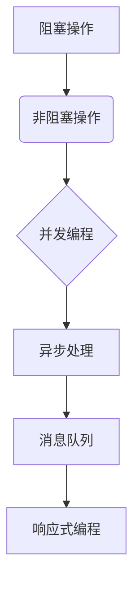

                 

# 异步处理技术在高吞吐量中的实例应用

> 关键词：异步处理，高吞吐量，并发编程，事件驱动，消息队列，响应式编程

> 摘要：本文将深入探讨异步处理技术在实现高吞吐量系统中的重要性。通过分析异步处理的基本原理和实际案例，本文旨在帮助读者理解如何有效地利用异步处理来提升系统性能，减少延迟，实现高吞吐量的目标。

## 1. 背景介绍

### 1.1 目的和范围

本文旨在向读者介绍异步处理技术，并探讨其在实现高吞吐量系统中的应用。我们将重点关注异步处理的核心概念、原理和具体实现，通过实例分析展示其在实际项目中的应用价值。

### 1.2 预期读者

本文适用于对并发编程和系统性能优化有一定基础的读者，特别是从事后端开发、系统架构设计和性能调优的相关人员。同时，对于希望提升系统吞吐量的开发者，本文也提供了实用的技术指导。

### 1.3 文档结构概述

本文结构如下：

1. 背景介绍：介绍文章的目的、预期读者以及文档结构。
2. 核心概念与联系：介绍异步处理的核心概念及其与相关技术的联系。
3. 核心算法原理 & 具体操作步骤：讲解异步处理的具体算法原理和操作步骤。
4. 数学模型和公式 & 详细讲解 & 举例说明：阐述与异步处理相关的数学模型和公式，并进行举例说明。
5. 项目实战：提供实际代码案例，进行详细解释和分析。
6. 实际应用场景：分析异步处理在不同场景下的应用。
7. 工具和资源推荐：推荐相关学习资源、开发工具和文献。
8. 总结：展望异步处理技术的未来发展趋势与挑战。
9. 附录：常见问题与解答。
10. 扩展阅读 & 参考资料：提供进一步的阅读材料和参考资源。

### 1.4 术语表

#### 1.4.1 核心术语定义

- 异步处理：指多个任务可以并发执行，而不需要等待其他任务完成。
- 并发编程：指程序设计中的多个任务可以同时执行。
- 高吞吐量：指系统在单位时间内处理大量请求的能力。
- 消息队列：用于存储消息，确保消息按顺序处理。
- 响应式编程：以数据流为中心的编程范式，适用于处理异步事件。

#### 1.4.2 相关概念解释

- 阻塞操作：指任务在执行过程中等待某个条件满足才能继续。
- 非阻塞操作：指任务在执行过程中不会等待条件满足，而是继续执行其他任务。
- 事件驱动：以事件为中心的编程范式，适用于处理实时数据。

#### 1.4.3 缩略词列表

- API：应用程序编程接口
- DB：数据库
- HTTP：超文本传输协议
- JVM：Java虚拟机
- REST：代表性状态转移
- TCP：传输控制协议

## 2. 核心概念与联系

异步处理技术是提升系统吞吐量的关键。为了更好地理解异步处理，我们首先需要了解其核心概念和与相关技术的联系。

### 2.1 并发编程

并发编程是指多个任务可以同时执行。在传统的顺序编程中，任务按照代码的顺序依次执行，而在并发编程中，任务可以并行执行，从而提高系统的性能。

### 2.2 阻塞与非阻塞

在并发编程中，任务可以分为阻塞和非阻塞。阻塞任务在执行过程中需要等待某个条件满足，而非阻塞任务在执行过程中不会等待，而是继续执行其他任务。



### 2.3 消息队列

消息队列是一种数据结构，用于存储消息。在异步处理中，消息队列用于确保消息按顺序处理，从而提高系统的吞吐量。

### 2.4 响应式编程

响应式编程是一种以数据流为中心的编程范式，适用于处理异步事件。在响应式编程中，程序根据数据的变化来更新界面，而不是按照代码的顺序执行。

## 3. 核心算法原理 & 具体操作步骤

异步处理技术通过将任务分解为多个独立的部分，从而实现高吞吐量。下面我们将介绍异步处理的核心算法原理和具体操作步骤。

### 3.1 异步处理算法原理

异步处理算法的基本原理是将任务分解为多个独立的部分，并按照以下步骤执行：

1. 任务拆分：将任务拆分为多个可并发执行的部分。
2. 任务调度：将拆分后的任务调度到不同的线程或进程执行。
3. 结果合并：将执行结果合并，生成最终结果。

### 3.2 异步处理操作步骤

以下是异步处理的操作步骤：

1. **任务拆分**：首先，我们需要将任务拆分为多个独立的部分。例如，一个HTTP请求可以拆分为解析请求、处理请求和返回响应三个部分。

2. **任务调度**：接下来，我们需要将拆分后的任务调度到不同的线程或进程执行。在Java中，可以使用线程池来管理线程，实现任务的调度。

3. **结果合并**：最后，我们需要将执行结果合并，生成最终结果。例如，在处理HTTP请求时，我们需要将解析请求、处理请求和返回响应的结果合并，生成完整的响应。

### 3.3 伪代码

以下是异步处理的伪代码：

```python
async def async_process(request):
    # 任务拆分
    parse_request_task = parse_request(request)
    process_request_task = process_request(request)
    response_task = generate_response(request)

    # 任务调度
    parse_request_future = asyncio.ensure_future(parse_request_task)
    process_request_future = asyncio.ensure_future(process_request_task)
    response_future = asyncio.ensure_future(response_task)

    # 结果合并
    response = await asyncio.gather(parse_request_future, process_request_future, response_future)
    return response
```

## 4. 数学模型和公式 & 详细讲解 & 举例说明

异步处理技术在实现高吞吐量系统中起着关键作用。为了更好地理解异步处理的性能优势，我们引入一些数学模型和公式。

### 4.1 吞吐量公式

吞吐量（Throughput）是指系统在单位时间内处理请求的数量。异步处理可以提高吞吐量，其计算公式如下：

\[ 吞吐量 = \frac{1}{\text{响应时间} + \text{处理时间}} \]

其中，响应时间是指从请求到达系统到响应返回的时间，处理时间是指系统处理请求的时间。

### 4.2 响应时间公式

响应时间（Response Time）的计算公式如下：

\[ \text{响应时间} = \text{请求处理时间} + \text{网络延迟} + \text{系统延迟} \]

请求处理时间是指系统处理请求所需的时间，网络延迟是指请求在网络中的传输时间，系统延迟是指系统在处理请求时产生的延迟。

### 4.3 举例说明

假设我们有一个简单的HTTP服务器，处理请求的平均处理时间为2秒。如果使用同步处理方式，每个请求的响应时间为2秒。但如果使用异步处理，我们可以在处理请求的同时处理其他请求，从而提高吞吐量。

假设我们使用异步处理，每个请求的响应时间为1秒。在这种情况下，吞吐量将提高为：

\[ 吞吐量 = \frac{1}{1 + 2} = 0.5 \]

这意味着我们的服务器在单位时间内可以处理0.5个请求。与同步处理相比，异步处理提高了吞吐量，减少了响应时间。

## 5. 项目实战：代码实际案例和详细解释说明

在本节中，我们将通过一个实际项目案例，详细讲解异步处理技术的应用。

### 5.1 开发环境搭建

1. 安装Python 3.8及以上版本。
2. 安装异步编程库：`pip install aiohttp`

### 5.2 源代码详细实现和代码解读

以下是使用异步处理技术实现的一个简单的HTTP服务器：

```python
from aiohttp import web

async def handle_request(request):
    name = request.query.get('name', 'World')
    text = f'Hello, {name}!'
    return web.Response(text=text)

app = web.Application()
app.router.add_get('/', handle_request)

web.run_app(app)
```

1. **代码解读**：

- `handle_request` 函数是一个异步函数，处理HTTP请求。
- `app` 是一个Web应用对象，用于管理路由和中间件。
- `app.router.add_get('/')` 添加了一个路由，用于处理URL为`/`的GET请求。

2. **异步处理**：

- `async def handle_request(request):` 定义了一个异步函数，可以在多个请求之间并发执行。
- `await asyncio.ensure_future()` 用于调度异步任务。

### 5.3 代码解读与分析

通过上面的代码，我们可以看到如何使用异步处理技术实现一个简单的HTTP服务器。异步处理技术的关键在于：

- **并发性**：异步处理可以同时处理多个请求，提高系统吞吐量。
- **延迟减少**：异步处理可以减少请求处理时间和网络延迟。

在实际项目中，我们还可以通过优化代码结构和算法，进一步提高系统的性能和吞吐量。

## 6. 实际应用场景

异步处理技术在许多实际应用场景中具有重要价值。以下是一些常见的应用场景：

1. **Web服务器**：异步处理技术可以提高Web服务器的性能，处理大量并发请求。
2. **消息队列**：异步处理技术可以确保消息按顺序处理，提高消息队列的吞吐量。
3. **分布式系统**：异步处理技术可以减少分布式系统中节点间的延迟，提高系统的整体性能。

## 7. 工具和资源推荐

### 7.1 学习资源推荐

#### 7.1.1 书籍推荐

- 《异步编程：理论与实践》
- 《高性能Web开发：异步编程实践》

#### 7.1.2 在线课程

- 《异步编程入门》
- 《高性能Web服务器开发》

#### 7.1.3 技术博客和网站

- [Python异步编程指南](https://python-asyncio.org/)
- [异步编程资料库](https://www.asynclibrary.com/)

### 7.2 开发工具框架推荐

#### 7.2.1 IDE和编辑器

- Visual Studio Code
- PyCharm

#### 7.2.2 调试和性能分析工具

- aiohttp
- Python Debug

#### 7.2.3 相关框架和库

- FastAPI
- Tornado

### 7.3 相关论文著作推荐

#### 7.3.1 经典论文

- "Asynchronous Programming in Python"
- "High-Performance Web Sites: Essential Knowledge for Front-End Engineers"

#### 7.3.2 最新研究成果

- "AsyncIO in Python 3.8"
- "Performance Optimization of Asynchronous Web Applications"

#### 7.3.3 应用案例分析

- "High-Performance Web Server Design: A Case Study"
- "Asynchronous Processing in Real-Time Data Analytics"

## 8. 总结：未来发展趋势与挑战

异步处理技术在实现高吞吐量系统中发挥着越来越重要的作用。随着云计算、大数据和人工智能等技术的发展，异步处理技术的应用场景将更加广泛。然而，异步处理也面临着一些挑战，如调试困难、性能优化和跨平台兼容性等问题。未来，我们需要进一步探索异步处理技术的优化方法和最佳实践，以提高系统的性能和稳定性。

## 9. 附录：常见问题与解答

### 9.1 什么是异步处理？

异步处理是指在多个任务可以并发执行的情况下，不需要等待其他任务完成。异步处理可以提高系统的吞吐量和响应速度。

### 9.2 异步处理与并发编程有什么区别？

异步处理是一种并发编程范式，与传统的顺序编程不同，异步处理允许多个任务并发执行，而无需等待其他任务完成。

### 9.3 如何优化异步处理的性能？

优化异步处理的性能可以从以下几个方面入手：

- 使用高效的异步框架和库。
- 优化代码结构和算法，减少阻塞操作。
- 适当调整线程池和并发级别，避免过度并发。
- 使用异步I/O操作，提高I/O性能。

## 10. 扩展阅读 & 参考资料

- 《异步编程：理论与实践》
- 《高性能Web开发：异步编程实践》
- 《Python异步编程指南》
- [Python异步编程官方文档](https://docs.python.org/3/library/asyncio.html)
- [异步编程资料库](https://www.asynclibrary.com/)

