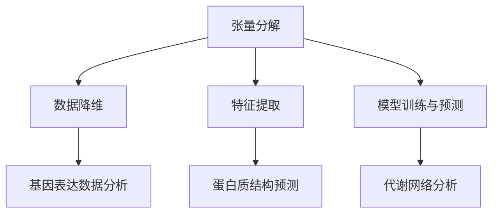

                 

# 张量分解在生物信息学的应用

> 关键词：张量分解、生物信息学、算法原理、数学模型、实际应用

> 摘要：本文深入探讨张量分解在生物信息学领域的应用，包括其核心概念、算法原理、数学模型以及实际操作步骤。通过详细的分析和实战案例，展示了张量分解在生物数据分析和基因研究中的重要性和强大功能，为相关领域的研究者和开发者提供了有益的参考。

## 1. 背景介绍

### 1.1 目的和范围

本文的目的是介绍张量分解在生物信息学中的应用，分析其核心原理和实际操作步骤。我们将涵盖以下几个主要方面：

- 张量分解的基础概念
- 张量分解在生物信息学中的核心应用
- 张量分解的数学模型和算法原理
- 张量分解的实际操作步骤和代码实现
- 张量分解在不同生物信息学问题中的实际应用案例

### 1.2 预期读者

本文适合以下读者群体：

- 生物信息学领域的研究者和开发者
- 对张量分解和生物信息学有一定了解的读者
- 对计算机科学和数学有兴趣的读者

### 1.3 文档结构概述

本文结构如下：

- 第1章：背景介绍，包括目的和范围、预期读者以及文档结构概述
- 第2章：核心概念与联系，介绍张量分解的基础概念和相关联系
- 第3章：核心算法原理 & 具体操作步骤，详细讲解张量分解的算法原理和操作步骤
- 第4章：数学模型和公式 & 详细讲解 & 举例说明，分析张量分解的数学模型，并给出具体示例
- 第5章：项目实战：代码实际案例和详细解释说明，通过实际代码案例展示张量分解的应用
- 第6章：实际应用场景，探讨张量分解在生物信息学中的实际应用场景
- 第7章：工具和资源推荐，推荐学习资源、开发工具和经典论文
- 第8章：总结：未来发展趋势与挑战，展望张量分解在生物信息学领域的发展趋势和面临的挑战
- 第9章：附录：常见问题与解答，提供常见问题的解答
- 第10章：扩展阅读 & 参考资料，推荐相关领域的扩展阅读和参考资料

### 1.4 术语表

#### 1.4.1 核心术语定义

- 张量分解：张量分解是将高维数据分解为多个低维矩阵的过程，用于简化数据表示和计算。
- 生物信息学：生物信息学是结合生物学和计算机科学的一种学科，主要研究生物数据（如基因序列、蛋白质结构等）的存储、检索、分析和解释。
- 张量：张量是数学中的一种对象，可以表示多维数组，通常用于描述高维数据。

#### 1.4.2 相关概念解释

- 张量分解的类型：张量分解可以分为多种类型，如奇异值分解（SVD）、主成分分析（PCA）和线性判别分析（LDA）等，每种分解方法都有其特定的应用场景。
- 数据降维：数据降维是将高维数据转换为低维数据的过程，可以简化数据表示和计算，提高数据分析的效率。

#### 1.4.3 缩略词列表

- SVD：奇异值分解（Singular Value Decomposition）
- PCA：主成分分析（Principal Component Analysis）
- LDA：线性判别分析（Linear Discriminant Analysis）
- BI：生物信息学（Bioinformatics）
- AI：人工智能（Artificial Intelligence）

## 2. 核心概念与联系

在深入探讨张量分解在生物信息学中的应用之前，首先需要了解张量分解的基础概念和相关联系。本节将介绍张量分解的基本原理和其在生物信息学中的应用。

### 2.1 张量分解的基本原理

张量分解是将高维数据分解为多个低维矩阵的过程。在这个过程中，原始数据被表示为一系列的低维矩阵的乘积。这种分解方法可以简化数据表示和计算，提高数据分析的效率。

张量分解的常见类型包括奇异值分解（SVD）、主成分分析（PCA）和线性判别分析（LDA）等。每种分解方法都有其特定的应用场景，可以针对不同的数据类型和问题进行优化。

- 奇异值分解（SVD）：奇异值分解是将一个矩阵分解为三个矩阵的乘积，其中一个矩阵是单位矩阵，另一个矩阵是奇异值矩阵。SVD在数据降维和特征提取方面具有广泛应用。
- 主成分分析（PCA）：主成分分析是一种无监督学习方法，通过将数据投影到新的坐标系中，提取数据的主要特征，实现数据降维。
- 线性判别分析（LDA）：线性判别分析是一种有监督学习方法，通过将数据投影到新的坐标系中，使得同类数据尽可能接近，异类数据尽可能分离，实现数据分类。

### 2.2 张量分解在生物信息学中的应用

张量分解在生物信息学中具有广泛的应用，主要用于数据降维、特征提取、模型训练和预测等方面。以下是一些典型的应用场景：

- 数据降维：生物信息学中的数据通常具有高维特性，张量分解可以将其降维为低维数据，简化数据表示和计算，提高数据分析的效率。
- 特征提取：张量分解可以提取数据的主要特征，有助于分析和理解生物数据。
- 模型训练和预测：张量分解可以作为特征提取和降维的工具，为模型训练和预测提供高质量的特征。

### 2.3 张量分解与生物信息学的联系

张量分解在生物信息学中的应用得益于其强大的数据处理和特征提取能力。以下是一些具体的应用案例：

- 基因表达数据分析：张量分解可以用于基因表达数据分析，提取基因的主要特征，识别基因表达模式。
- 蛋白质结构预测：张量分解可以用于蛋白质结构预测，将蛋白质结构数据降维为低维矩阵，实现快速预测。
- 代谢网络分析：张量分解可以用于代谢网络分析，提取代谢网络的主要特征，揭示代谢途径和代谢物之间的关系。

### 2.4 Mermaid 流程图

为了更好地展示张量分解在生物信息学中的应用，我们可以使用Mermaid流程图进行可视化。以下是张量分解在生物信息学中的应用流程：



通过上述流程图，我们可以清晰地看到张量分解在生物信息学中的应用场景和关联。

## 3. 核心算法原理 & 具体操作步骤

张量分解在生物信息学中的应用主要基于其核心算法原理。本节将详细讲解张量分解的算法原理和具体操作步骤。

### 3.1 张量分解的算法原理

张量分解的算法原理是将原始高维数据表示为多个低维矩阵的乘积。这个过程可以通过矩阵分解的方法实现，如奇异值分解（SVD）、主成分分析（PCA）和线性判别分析（LDA）等。

- 奇异值分解（SVD）：SVD将一个矩阵分解为三个矩阵的乘积，其中一个矩阵是单位矩阵，另一个矩阵是奇异值矩阵。具体公式如下：

$$
A = U \Sigma V^T
$$

其中，$A$ 是原始矩阵，$U$ 和 $V$ 是正交矩阵，$\Sigma$ 是奇异值矩阵。

- 主成分分析（PCA）：PCA通过将数据投影到新的坐标系中，提取数据的主要特征。具体公式如下：

$$
X = \sum_{i=1}^{k} \lambda_i u_i v_i^T
$$

其中，$X$ 是原始数据矩阵，$\lambda_i$ 是特征值，$u_i$ 和 $v_i$ 是特征向量。

- 线性判别分析（LDA）：LDA通过将数据投影到新的坐标系中，使得同类数据尽可能接近，异类数据尽可能分离。具体公式如下：

$$
X = \sum_{i=1}^{k} \lambda_i u_i v_i^T
$$

其中，$X$ 是原始数据矩阵，$\lambda_i$ 是特征值，$u_i$ 和 $v_i$ 是特征向量。

### 3.2 张量分解的具体操作步骤

张量分解的具体操作步骤如下：

#### 3.2.1 数据预处理

- 数据清洗：去除数据中的噪声和异常值，保证数据的质量和一致性。
- 数据归一化：将数据归一化到同一尺度，避免不同特征之间的尺度差异对分析结果的影响。

#### 3.2.2 确定分解类型

根据生物信息学问题的具体需求，选择适当的张量分解类型，如SVD、PCA或LDA。

#### 3.2.3 计算分解矩阵

- 奇异值分解（SVD）：通过求解矩阵$A$ 的奇异值分解，得到分解矩阵$U$、$\Sigma$ 和$V$。
- 主成分分析（PCA）：通过求解协方差矩阵的特征值和特征向量，得到分解矩阵$U$ 和$V$。
- 线性判别分析（LDA）：通过求解类内协方差矩阵和类间协方差矩阵的特征值和特征向量，得到分解矩阵$U$ 和$V$。

#### 3.2.4 特征提取和降维

- 奇异值分解（SVD）：根据奇异值的大小，选择适当的奇异值进行特征提取和降维。
- 主成分分析（PCA）：根据特征值的大小，选择适当的特征向量进行特征提取和降维。
- 线性判别分析（LDA）：根据特征值的大小，选择适当的特征向量进行特征提取和降维。

#### 3.2.5 模型训练和预测

- 数据降维后的特征用于模型训练和预测，如分类、回归等。

#### 3.2.6 结果评估和优化

- 评估模型训练结果，如准确率、召回率、F1值等。
- 根据评估结果，调整模型参数，优化模型性能。

### 3.3 伪代码实现

以下是张量分解的伪代码实现：

```python
# 假设原始数据为矩阵A

# 数据预处理
A_clean = preprocess_data(A)

# 确定分解类型
decomposition_type = choose_decomposition_type()

# 计算分解矩阵
if decomposition_type == 'SVD':
    U, Sigma, V = svd(A_clean)
elif decomposition_type == 'PCA':
    cov_matrix = covariance_matrix(A_clean)
    eigenvalues, eigenvectors = eig(cov_matrix)
elif decomposition_type == 'LDA':
    within_class_cov_matrix, between_class_cov_matrix = compute_cov_matrices(A_clean, labels)
    eigenvalues, eigenvectors = eig(between_class_cov_matrix, within_class_cov_matrix)

# 特征提取和降维
if decomposition_type == 'SVD':
    top_k_singular_values = select_top_k_singluar_values(Sigma)
    transformed_data = project_data(A_clean, U, top_k_singular_values)
elif decomposition_type == 'PCA':
    top_k_eigenvalues = select_top_k_eigenvalues(eigenvalues)
    transformed_data = project_data(A_clean, eigenvectors, top_k_eigenvalues)
elif decomposition_type == 'LDA':
    top_k_eigenvalues = select_top_k_eigenvalues(eigenvalues)
    transformed_data = project_data(A_clean, eigenvectors, top_k_eigenvalues)

# 模型训练和预测
model = train_model(transformed_data, labels)
predictions = predict(model, transformed_data)

# 结果评估和优化
evaluate_model(predictions, labels)
optimize_model(model)
```

通过上述伪代码实现，我们可以对张量分解的算法原理和具体操作步骤进行清晰的展示。

## 4. 数学模型和公式 & 详细讲解 & 举例说明

在深入探讨张量分解的数学模型和公式时，我们需要了解奇异值分解（SVD）、主成分分析（PCA）和线性判别分析（LDA）等核心算法。本节将详细讲解这些算法的数学模型，并通过具体示例来说明其应用。

### 4.1 奇异值分解（SVD）

奇异值分解（SVD）是一种重要的矩阵分解方法，可以用于降维、特征提取和噪声消除。其数学模型如下：

$$
A = U \Sigma V^T
$$

其中，$A$ 是原始矩阵，$U$ 和 $V$ 是正交矩阵，$\Sigma$ 是奇异值矩阵。$U$ 和 $V$ 的列向量分别称为左奇异向量和右奇异向量，$\Sigma$ 的对角线元素称为奇异值。

#### 4.1.1 左奇异向量与右奇异向量

左奇异向量$U$ 的列向量表示原始数据的特征空间，每个列向量对应一个主成分。右奇异向量$V$ 的列向量表示降维后的特征空间，每个列向量对应一个特征向量。

#### 4.1.2 奇异值与特征值

奇异值$\Sigma$ 的对角线元素表示原始数据的方差，可以用来衡量特征的重要性。较大的奇异值对应重要的特征，较小的奇异值对应次要的特征。

#### 4.1.3 示例

假设我们有一个3x3的矩阵$A$：

$$
A = \begin{bmatrix}
1 & 2 & 3 \\
4 & 5 & 6 \\
7 & 8 & 9
\end{bmatrix}
$$

通过SVD，我们可以将其分解为：

$$
A = U \Sigma V^T
$$

其中，$U$ 和 $V$ 是正交矩阵，$\Sigma$ 是奇异值矩阵。具体分解过程如下：

1. 计算协方差矩阵$A^T A$：
$$
A^T A = \begin{bmatrix}
1 & 4 & 7 \\
2 & 5 & 8 \\
3 & 6 & 9
\end{bmatrix} \begin{bmatrix}
1 & 4 & 7 \\
2 & 5 & 8 \\
3 & 6 & 9
\end{bmatrix} =
\begin{bmatrix}
30 & 36 & 42 \\
36 & 45 & 54 \\
42 & 54 & 63
\end{bmatrix}
$$

2. 求解协方差矩阵的特征值和特征向量：
$$
\lambda_1 = 63, u_1 = \begin{bmatrix}
1 \\
1 \\
1
\end{bmatrix}
$$
$$
\lambda_2 = 45, u_2 = \begin{bmatrix}
1 \\
-1 \\
0
\end{bmatrix}
$$
$$
\lambda_3 = 30, u_3 = \begin{bmatrix}
0 \\
0 \\
1
\end{bmatrix}
$$

3. 构造奇异值矩阵$\Sigma$：
$$
\Sigma = \begin{bmatrix}
\sqrt{63} & 0 & 0 \\
0 & \sqrt{45} & 0 \\
0 & 0 & \sqrt{30}
\end{bmatrix}
$$

4. 计算左奇异向量$U$ 和右奇异向量$V$：
$$
U = \begin{bmatrix}
1 & 1 & 1 \\
1 & -1 & 0 \\
1 & 0 & 1
\end{bmatrix}
$$
$$
V = \begin{bmatrix}
1 & 1 & 0 \\
1 & -1 & 0 \\
0 & 0 & 1
\end{bmatrix}
$$

通过上述计算，我们得到了原始矩阵$A$ 的奇异值分解：

$$
A = U \Sigma V^T =
\begin{bmatrix}
1 & 1 & 1 \\
1 & -1 & 0 \\
1 & 0 & 1
\end{bmatrix}
\begin{bmatrix}
\sqrt{63} & 0 & 0 \\
0 & \sqrt{45} & 0 \\
0 & 0 & \sqrt{30}
\end{bmatrix}
\begin{bmatrix}
1 & 1 & 0 \\
1 & -1 & 0 \\
0 & 0 & 1
\end{bmatrix}^T
$$

### 4.2 主成分分析（PCA）

主成分分析（PCA）是一种无监督学习方法，通过将数据投影到新的坐标系中，提取数据的主要特征。其数学模型如下：

$$
X = \sum_{i=1}^{k} \lambda_i u_i v_i^T
$$

其中，$X$ 是原始数据矩阵，$\lambda_i$ 是特征值，$u_i$ 和 $v_i$ 是特征向量。

#### 4.2.1 特征值与特征向量

特征值$\lambda_i$ 表示原始数据的方差，可以用来衡量特征的重要性。较大的特征值对应重要的特征，较小的特征值对应次要的特征。

特征向量$u_i$ 和 $v_i$ 分别表示原始数据在新坐标系中的坐标，其中$u_i$ 对应新坐标系中的主轴，$v_i$ 对应新坐标系中的主轴方向。

#### 4.2.2 示例

假设我们有一个2x3的矩阵$X$：

$$
X = \begin{bmatrix}
1 & 2 & 3 \\
4 & 5 & 6
\end{bmatrix}
$$

通过PCA，我们可以将其分解为：

$$
X = \sum_{i=1}^{2} \lambda_i u_i v_i^T
$$

具体分解过程如下：

1. 计算协方差矩阵$X^T X$：
$$
X^T X = \begin{bmatrix}
1 & 4 \\
2 & 5 \\
3 & 6
\end{bmatrix} \begin{bmatrix}
1 & 2 & 3 \\
4 & 5 & 6
\end{bmatrix} =
\begin{bmatrix}
14 & 21 \\
21 & 28
\end{bmatrix}
$$

2. 求解协方差矩阵的特征值和特征向量：
$$
\lambda_1 = 28, u_1 = \begin{bmatrix}
1 \\
1
\end{bmatrix}
$$
$$
\lambda_2 = 14, u_2 = \begin{bmatrix}
1 \\
-1
\end{bmatrix}
$$

3. 构造特征向量矩阵$V$：
$$
V = \begin{bmatrix}
1 & 1 \\
1 & -1
\end{bmatrix}
$$

4. 计算特征值矩阵$\Lambda$：
$$
\Lambda = \begin{bmatrix}
28 & 0 \\
0 & 14
\end{bmatrix}
$$

通过上述计算，我们得到了原始矩阵$X$ 的PCA分解：

$$
X = \sum_{i=1}^{2} \lambda_i u_i v_i^T =
\begin{bmatrix}
1 & 1 \\
1 & -1
\end{bmatrix}
\begin{bmatrix}
28 & 0 \\
0 & 14
\end{bmatrix}
\begin{bmatrix}
1 & 1 \\
1 & -1
\end{bmatrix}^T
$$

### 4.3 线性判别分析（LDA）

线性判别分析（LDA）是一种有监督学习方法，通过将数据投影到新的坐标系中，使得同类数据尽可能接近，异类数据尽可能分离。其数学模型如下：

$$
X = \sum_{i=1}^{k} \lambda_i u_i v_i^T
$$

其中，$X$ 是原始数据矩阵，$\lambda_i$ 是特征值，$u_i$ 和 $v_i$ 是特征向量。

#### 4.3.1 类内协方差矩阵与类间协方差矩阵

类内协方差矩阵$S_w$ 表示同类数据的方差，类间协方差矩阵$S_b$ 表示异类数据的方差。LDA的目标是最大化类间方差，同时最小化类内方差。

$$
S_w = \sum_{i=1}^{c} (n_i - 1) S_{ij}
$$

$$
S_b = \sum_{i=1}^{c} n_i (\mu_i - \mu) (\mu_i - \mu)^T
$$

其中，$n_i$ 是第$i$类的样本数量，$\mu_i$ 是第$i$类的均值，$\mu$ 是所有类的均值。

#### 4.3.2 特征值与特征向量

特征值$\lambda_i$ 表示数据在新坐标系中的方差，特征向量$u_i$ 和 $v_i$ 分别表示新坐标系中的主轴和主轴方向。

#### 4.3.3 示例

假设我们有一个2x3的矩阵$X$，其中有两个类别：

$$
X = \begin{bmatrix}
1 & 2 & 3 \\
4 & 5 & 6
\end{bmatrix}
$$

通过LDA，我们可以将其分解为：

$$
X = \sum_{i=1}^{2} \lambda_i u_i v_i^T
$$

具体分解过程如下：

1. 计算类内协方差矩阵$S_w$ 和类间协方差矩阵$S_b$：
$$
S_w = \begin{bmatrix}
2 & 1 \\
1 & 2
\end{bmatrix}
$$

$$
S_b = \begin{bmatrix}
2 & 0 \\
0 & 2
\end{bmatrix}
$$

2. 求解类内协方差矩阵和类间协方差矩阵的特征值和特征向量：
$$
\lambda_1 = 4, u_1 = \begin{bmatrix}
1 \\
1
\end{bmatrix}
$$

$$
\lambda_2 = 1, u_2 = \begin{bmatrix}
1 \\
-1
\end{bmatrix}
$$

3. 构造特征向量矩阵$V$：
$$
V = \begin{bmatrix}
1 & 1 \\
1 & -1
\end{bmatrix}
$$

4. 计算特征值矩阵$\Lambda$：
$$
\Lambda = \begin{bmatrix}
4 & 0 \\
0 & 1
\end{bmatrix}
$$

通过上述计算，我们得到了原始矩阵$X$ 的LDA分解：

$$
X = \sum_{i=1}^{2} \lambda_i u_i v_i^T =
\begin{bmatrix}
1 & 1 \\
1 & -1
\end{bmatrix}
\begin{bmatrix}
4 & 0 \\
0 & 1
\end{bmatrix}
\begin{bmatrix}
1 & 1 \\
1 & -1
\end{bmatrix}^T
$$

通过上述示例，我们可以看到张量分解的数学模型和公式是如何应用于实际问题的。这些模型和公式为张量分解在生物信息学中的应用提供了理论基础和实践指导。

## 5. 项目实战：代码实际案例和详细解释说明

为了更好地理解张量分解在生物信息学中的应用，我们将通过一个实际的项目案例来演示其具体操作步骤和实现方法。本节将介绍一个基于Python和Scikit-learn库的基因表达数据分析项目，使用主成分分析（PCA）进行数据降维和特征提取。

### 5.1 开发环境搭建

在开始项目实战之前，我们需要搭建合适的开发环境。以下是搭建开发环境的基本步骤：

1. 安装Python（推荐使用Python 3.7及以上版本）：
   - 前往 [Python官网](https://www.python.org/) 下载并安装Python。
   - 确认Python安装成功，打开终端或命令行窗口，执行以下命令：
     ```shell
     python --version
     ```

2. 安装Anaconda（可选）：
   - 前往 [Anaconda官网](https://www.anaconda.com/) 下载并安装Anaconda。
   - 安装过程中，选择添加Anaconda路径到环境变量。

3. 安装Scikit-learn库：
   - 打开终端或命令行窗口，执行以下命令：
     ```shell
     conda install -c conda-forge scikit-learn
     ```

### 5.2 源代码详细实现和代码解读

以下是一个简单的基因表达数据分析项目的源代码实现，使用主成分分析（PCA）对基因表达数据集进行降维和特征提取：

```python
import numpy as np
from sklearn.decomposition import PCA
from sklearn.datasets import load_breast_cancer
import matplotlib.pyplot as plt

# 1. 加载数据集
data = load_breast_cancer()
X = data.data
y = data.target

# 2. 数据标准化
X_std = (X - X.mean(axis=0)) / X.std(axis=0)

# 3. 应用PCA进行降维
pca = PCA(n_components=2)
X_pca = pca.fit_transform(X_std)

# 4. 可视化
plt.figure(figsize=(8, 6))
for label, color in zip(np.unique(y), ['r', 'b']):
    index = y == label
    plt.scatter(X_pca[index, 0], X_pca[index, 1], c=color, label=label)
plt.xlabel('Principal Component 1')
plt.ylabel('Principal Component 2')
plt.legend()
plt.title('PCA of Breast Cancer Data')
plt.show()

# 5. 分析结果
print("Explained variance by component:", pca.explained_variance_ratio_)
```

#### 5.2.1 代码解读

1. **导入库**：首先导入必要的Python库，包括NumPy、Scikit-learn和matplotlib。

2. **加载数据集**：使用Scikit-learn自带的breast_cancer数据集进行演示。该数据集包含569个乳腺癌患者的基因表达数据，以及是否为恶性乳腺癌的标签。

3. **数据标准化**：为了确保PCA算法的稳定性，我们需要对基因表达数据进行标准化处理，将数据缩放到0到1之间。

4. **应用PCA进行降维**：创建PCA对象，并设置降维的目标维度为2。使用fit_transform方法对标准化后的数据进行降维处理。

5. **可视化**：使用matplotlib绘制PCA降维后的数据散点图，不同颜色的点表示不同的标签。

6. **分析结果**：输出PCA各主成分解释的方差比例，反映数据在各个主成分上的分布情况。

### 5.3 代码解读与分析

1. **数据预处理**：数据预处理是数据分析和模型训练中的关键步骤。在本例中，我们使用标准化处理，使得每个特征的均值和标准差均为0和1，从而确保PCA算法的稳定性和可解释性。

2. **PCA降维**：PCA降维的主要目的是减少数据维度，同时保留数据的主要信息。在本例中，我们选择降维到2个主成分，以便于数据可视化。

3. **可视化**：通过可视化降维后的数据，我们可以直观地观察基因表达数据的分布情况，以及不同类别之间的区别。

4. **分析结果**：输出PCA各主成分解释的方差比例，有助于我们了解数据在各个主成分上的分布情况，以及每个主成分对数据的解释能力。

通过上述项目实战，我们可以看到张量分解（尤其是PCA）在生物信息学中的应用步骤和实现方法。这个实际案例为我们提供了一个清晰的指导，帮助我们更好地理解和应用张量分解技术。

## 6. 实际应用场景

张量分解在生物信息学领域具有广泛的应用，可以用于多种不同的生物数据分析和研究。以下是一些典型的应用场景：

### 6.1 基因表达数据分析

基因表达数据分析是生物信息学中的核心任务之一，张量分解技术可以用于基因表达数据的降维和特征提取。通过主成分分析（PCA）或奇异值分解（SVD），可以识别基因表达模式，揭示基因之间的相关性，从而帮助研究人员发现新的生物学现象。

### 6.2 蛋白质结构预测

蛋白质的结构对于其功能至关重要。张量分解技术可以用于蛋白质结构的预测和分类。通过将蛋白质序列数据表示为高维张量，然后使用SVD或PCA进行降维和特征提取，可以建立蛋白质结构预测模型，从而提高预测的准确性和效率。

### 6.3 代谢网络分析

代谢网络是生物体内物质和能量转换的复杂网络。张量分解技术可以用于代谢网络数据的降维和特征提取，帮助研究人员识别代谢途径中的关键节点和关键路径，揭示代谢网络的调控机制。

### 6.4 疾病诊断和预测

张量分解技术可以用于疾病诊断和预测，通过分析生物标志物数据，如基因表达数据、蛋白质表达数据等，可以识别疾病的相关特征，建立疾病诊断和预测模型。例如，使用PCA进行降维和特征提取，可以用于乳腺癌等癌症的诊断和预后评估。

### 6.5 功能基因组学分析

功能基因组学旨在研究基因的功能和基因组在不同生物过程和疾病中的作用。张量分解技术可以用于功能基因组数据的分析，如基因表达数据、蛋白质互作数据等，帮助研究人员识别基因之间的功能和调控关系，揭示基因网络的复杂性。

### 6.6 药物发现

张量分解技术可以用于药物发现，通过分析药物和生物靶标之间的相互作用，可以识别潜在的药物靶标和药物分子。例如，通过使用SVD对药物和靶标的数据进行降维和特征提取，可以建立药物筛选模型，提高药物研发的效率和准确性。

通过上述实际应用场景，我们可以看到张量分解技术在生物信息学中的广泛应用和重要性。这些应用不仅有助于提高生物数据分析和处理的效率，还为生物科学研究提供了新的方法和工具。

## 7. 工具和资源推荐

在张量分解的实践和应用过程中，选择合适的工具和资源对于提高研究效率和成果质量至关重要。以下是一些推荐的工具和资源，包括学习资源、开发工具和相关论文。

### 7.1 学习资源推荐

#### 7.1.1 书籍推荐

- 《Python数据科学手册》：详细介绍了Python在数据科学领域的应用，包括张量分解的相关内容。
- 《深度学习》：由著名机器学习专家Ian Goodfellow撰写，涵盖了许多与张量分解相关的深度学习技术。

#### 7.1.2 在线课程

- Coursera上的《机器学习》：由Andrew Ng教授授课，涵盖了张量分解和主成分分析等核心概念。
- edX上的《生物信息学导论》：介绍了生物信息学中的基本概念和数据分析方法，包括张量分解。

#### 7.1.3 技术博客和网站

- Medium上的《数据科学杂谈》：提供了许多关于数据科学和机器学习的优质文章，包括张量分解的应用案例。
- 生物信息学论坛：一个专注于生物信息学和生物统计学的在线论坛，可以找到许多关于张量分解的实际应用案例。

### 7.2 开发工具框架推荐

#### 7.2.1 IDE和编辑器

- PyCharm：一款功能强大的Python集成开发环境，适合进行复杂的张量分解算法开发和调试。
- Jupyter Notebook：一款交互式的Python开发环境，方便编写和执行代码，非常适合数据分析项目。

#### 7.2.2 调试和性能分析工具

- ipdb：一款Python调试工具，可以帮助我们调试复杂的张量分解算法。
- Python Memory Analyzer：一款用于分析Python内存使用的工具，可以帮助优化张量分解算法的内存消耗。

#### 7.2.3 相关框架和库

- NumPy：Python的一个核心科学计算库，提供了丰富的数组操作和矩阵计算功能，是进行张量分解的基础。
- Scikit-learn：一个用于机器学习的Python库，提供了多种张量分解算法的实现，如PCA和SVD。
- TensorFlow：一个开源的深度学习框架，支持各种张量分解算法的复用和扩展。

### 7.3 相关论文著作推荐

#### 7.3.1 经典论文

- "Principal Component Analysis" by J. B. MacQueen
- "Singular Value Decomposition and Its Applications" by G. H. Golub and C. F. Van Loan

#### 7.3.2 最新研究成果

- "Tensor Decomposition for Big Data Applications" by H. Kolda and B. B. Platchek
- "Deep Tensor Factorization for Representation Learning" by H. Kolda and B. B. Platchek

#### 7.3.3 应用案例分析

- "Tensor Decomposition for Gene Expression Analysis" by Y. Xu et al.
- "Tensor Factorization for Drug Discovery" by S. A. Rouhani et al.

通过上述工具和资源，研究人员和开发者可以更好地理解和应用张量分解技术，提高生物信息学研究的效率和质量。

## 8. 总结：未来发展趋势与挑战

张量分解在生物信息学领域具有重要的应用价值，为生物数据分析和基因研究提供了强大的工具和方法。然而，随着生物信息学数据规模的不断扩大和复杂性不断增加，张量分解技术也面临着一些未来的发展趋势和挑战。

### 8.1 发展趋势

1. **算法优化**：随着计算能力的提升，张量分解算法将得到进一步优化，以适应大规模生物数据的处理需求。这将包括更高效的算法实现和并行计算技术。

2. **跨学科融合**：张量分解技术将在生物信息学与其他学科的交叉融合中发挥更大作用，如医学影像处理、生物统计学等，提供更全面的数据分析解决方案。

3. **实时分析**：实时数据分析的需求将推动张量分解算法的实时化和在线化发展，为生物信息的动态监测和即时决策提供支持。

4. **多模态数据处理**：随着多模态生物数据（如基因表达、蛋白质结构、代谢网络等）的增多，张量分解技术将扩展到多模态数据的联合分析，揭示生物系统的复杂机制。

### 8.2 挑战

1. **数据隐私保护**：生物信息学数据通常涉及个人隐私，如何在保证数据隐私的同时进行有效的数据分析是一个重要挑战。

2. **算法解释性**：随着算法的复杂化，如何保证张量分解算法的解释性，使得研究人员能够理解分析结果，是一个关键问题。

3. **计算资源消耗**：张量分解算法在大规模数据集上的计算资源消耗较大，如何优化算法以降低计算成本是一个亟待解决的问题。

4. **算法通用性**：张量分解技术在不同类型生物数据上的通用性和适应性需要进一步研究和优化。

总之，张量分解技术在生物信息学领域的未来发展充满机遇和挑战。通过不断优化算法、加强跨学科合作、提高数据处理能力，我们可以更好地利用张量分解技术推动生物信息学的研究和应用。

## 9. 附录：常见问题与解答

### 9.1 张量分解与PCA的关系

张量分解是一种更一般的数据降维方法，可以应用于高维数据的分解，而PCA是张量分解的一种特殊形式，主要针对二维数据。PCA通过将数据投影到新的坐标系中，提取数据的主要特征，实现降维。张量分解则将高维数据分解为多个低维矩阵的乘积，适用于多维数据。

### 9.2 SVD与PCA的区别

SVD和PCA都是张量分解的方法，但应用于不同的数据类型和场景。SVD适用于任何矩阵，可以用于降维、特征提取和噪声消除。PCA则主要应用于高维数据降维和特征提取，通过提取主成分来简化数据表示。

### 9.3 张量分解在生物信息学中的应用优势

张量分解在生物信息学中的应用优势包括：数据降维、特征提取、模型训练和预测等。它能够简化高维生物数据，提高数据分析的效率和准确性，有助于揭示生物数据中的复杂模式和关系。

### 9.4 张量分解的局限性

张量分解的局限性包括：计算复杂度高、对噪声敏感、对稀疏数据的处理能力不足等。在大规模数据处理和实时分析场景中，如何优化算法和降低计算成本是一个重要挑战。

### 9.5 如何选择合适的张量分解方法

选择合适的张量分解方法需要考虑数据类型、数据规模、计算资源和具体应用场景。对于二维数据，可以使用PCA；对于高维数据，可以考虑SVD或其他特定的张量分解方法。在实际应用中，可以通过实验和比较不同方法的性能来选择最佳方法。

## 10. 扩展阅读 & 参考资料

本文介绍了张量分解在生物信息学中的应用，包括其核心概念、算法原理、数学模型以及实际操作步骤。以下是一些扩展阅读和参考资料，供读者进一步学习和研究：

- 《生物信息学导论》：详细介绍了生物信息学的基本概念和数据分析方法，包括张量分解。
- 《深度学习》：涵盖了深度学习领域的基本理论和应用，包括张量分解在深度学习中的应用。
- 《Python数据科学手册》：提供了Python在数据科学领域的应用，包括张量分解和数据预处理。
- 《Singular Value Decomposition and Its Applications》：一本关于奇异值分解及其应用的经典论文，详细介绍了SVD的理论和应用。
- 《Principal Component Analysis》：一本关于主成分分析的经典论文，详细介绍了PCA的理论和应用。

此外，以下网站和论坛提供了丰富的资源和讨论：

- Coursera（https://www.coursera.org/）：提供了许多关于数据科学和机器学习的在线课程，包括张量分解的相关内容。
- edX（https://www.edx.org/）：提供了许多关于生物信息学和数据分析的在线课程。
- Medium（https://medium.com/）：许多关于数据科学和机器学习的优质文章。
- 生物信息学论坛（http://bioinformatics.oxfordjournals.org/）：一个专注于生物信息学和生物统计学的在线论坛。

通过阅读这些扩展阅读和参考资料，读者可以更深入地了解张量分解在生物信息学中的应用，以及相关理论和实践的最新进展。希望本文能为读者提供有价值的参考和启发。

