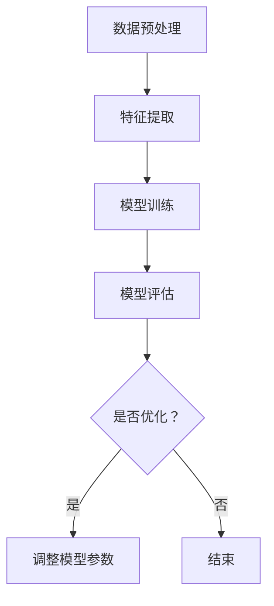

                 

# 弱监督学习：原理与代码实例讲解

> 关键词：弱监督学习、监督学习、无监督学习、深度学习、数据标注、标签分布、算法实现、代码实例

> 摘要：本文将详细介绍弱监督学习的原理、核心算法、数学模型及其在实际应用中的实现。通过代码实例分析，帮助读者深入理解弱监督学习的工作机制和优势，掌握其在数据标注稀缺场景下的应用技巧。

## 1. 背景介绍

### 1.1 目的和范围

弱监督学习是机器学习领域的一个重要研究方向，旨在解决数据标注成本高、标注数据稀缺的问题。本文旨在通过以下三个方面展开：

1. **核心概念与联系**：介绍弱监督学习的基本概念、核心算法及其与其他机器学习方法的联系。
2. **核心算法原理**：详细讲解弱监督学习的主要算法原理，包括基于图模型、聚类和深度学习的实现方法。
3. **项目实战**：通过一个实际案例，演示弱监督学习算法在数据标注稀缺场景下的应用。

### 1.2 预期读者

本文适合以下读者群体：

1. 对机器学习有一定了解的技术人员，特别是关注监督学习、无监督学习和深度学习的专业人士。
2. 希望在数据标注稀缺场景下探索新方法的学者和研究者。
3. 希望提高自己在数据挖掘和人工智能领域应用能力的技术从业者。

### 1.3 文档结构概述

本文将按照以下结构展开：

1. **核心概念与联系**：介绍弱监督学习的基本概念和核心算法原理。
2. **核心算法原理**：通过伪代码详细讲解弱监督学习算法的实现过程。
3. **数学模型和公式**：阐述弱监督学习中的关键数学模型，并给出具体例子进行说明。
4. **项目实战**：通过实际案例展示弱监督学习算法的应用。
5. **实际应用场景**：分析弱监督学习在不同领域中的应用。
6. **工具和资源推荐**：推荐学习资源和开发工具。
7. **总结**：回顾弱监督学习的发展趋势与挑战。
8. **附录**：常见问题与解答。
9. **扩展阅读与参考资料**：提供进一步阅读的参考资料。

### 1.4 术语表

#### 1.4.1 核心术语定义

- **弱监督学习**：一种机器学习方法，它利用部分标签数据和大量未标注数据进行训练，以解决数据标注成本高、标注数据稀缺的问题。
- **标签分布**：指数据集中标签的分布情况，是弱监督学习中的重要考量因素。
- **无监督学习**：一种机器学习方法，它仅使用未标注数据，旨在发现数据中的隐藏结构和规律。
- **深度学习**：一种基于多层神经网络进行特征提取和模型训练的机器学习方法。

#### 1.4.2 相关概念解释

- **监督学习**：一种机器学习方法，它使用带有标签的数据进行训练，并通过评估模型在未见标签数据上的性能来优化模型参数。
- **标注数据**：指带有标签的数据集，用于训练和评估机器学习模型。

#### 1.4.3 缩略词列表

- **ML**：机器学习
- **SL**：监督学习
- **USL**：无监督学习
- **WSL**：弱监督学习
- **DL**：深度学习

## 2. 核心概念与联系

### 2.1 弱监督学习概述

弱监督学习是介于监督学习和无监督学习之间的一种机器学习方法。它利用部分标签数据和大量未标注数据，通过一定的策略和算法，从未标注数据中提取有用信息，补充标签数据，从而提高模型的泛化能力。在数据标注成本高、标注数据稀缺的背景下，弱监督学习具有广泛的应用前景。

### 2.2 弱监督学习与其他机器学习方法的联系

弱监督学习与监督学习、无监督学习和深度学习之间存在一定的联系：

- **与监督学习的联系**：弱监督学习可以看作是监督学习的扩展。在监督学习中，模型训练依赖于大量的带标签数据；而在弱监督学习中，模型训练依赖于部分带标签数据和大量未标注数据。
- **与无监督学习的联系**：弱监督学习在一定程度上借鉴了无监督学习的思想，即通过未标注数据来发现数据中的隐藏结构和规律。然而，弱监督学习在此基础上引入了标签信息，从而提高了模型的性能。
- **与深度学习的联系**：深度学习作为机器学习的一个重要分支，其核心思想是通过多层神经网络提取特征。弱监督学习在深度学习的基础上，进一步扩展了模型训练的数据来源，提高了模型的泛化能力。

### 2.3 弱监督学习的基本概念

弱监督学习主要涉及以下核心概念：

- **标签分布**：指数据集中标签的分布情况。在弱监督学习中，标签分布对模型性能具有重要影响。合理的标签分布有助于提高模型在未见标签数据上的泛化能力。
- **未标注数据**：指未被标注的数据集。在弱监督学习中，未标注数据是模型训练的重要数据来源。通过一定的策略和算法，可以从未标注数据中提取有用信息，补充标签数据。
- **特征提取**：指从数据中提取具有区分性的特征。在弱监督学习中，特征提取是关键步骤，它有助于提高模型对未见标签数据的泛化能力。

### 2.4 弱监督学习的核心算法

弱监督学习主要包括以下几种核心算法：

- **基于图模型的算法**：利用图结构描述数据之间的关联关系，通过图模型进行特征提取和模型训练。
- **基于聚类的方法**：通过聚类算法将数据划分为多个类别，从而实现特征提取和模型训练。
- **基于深度学习的算法**：利用深度学习模型从大量未标注数据中提取特征，并在此基础上进行模型训练。

### 2.5 弱监督学习的架构

弱监督学习的架构主要包括以下模块：

1. **数据预处理**：包括数据清洗、数据归一化和数据增强等操作，以提高数据质量和模型训练效果。
2. **特征提取**：从未标注数据中提取具有区分性的特征，以补充标签数据。
3. **模型训练**：利用提取到的特征和部分标签数据，训练弱监督学习模型。
4. **模型评估**：通过评估模型在未见标签数据上的性能，调整模型参数，优化模型性能。

### 2.6 Mermaid 流程图

以下是一个简单的Mermaid流程图，描述了弱监督学习的基本流程：



## 3. 核心算法原理 & 具体操作步骤

### 3.1 基于图模型的算法

#### 3.1.1 算法原理

基于图模型的弱监督学习算法利用图结构来描述数据之间的关联关系。具体而言，算法通过构建图模型，将数据点作为节点，数据点之间的相似度作为边，从而形成一个图。在此基础上，算法通过优化图模型中的节点嵌入向量，实现特征提取和模型训练。

#### 3.1.2 伪代码

以下是一个简单的基于图模型的弱监督学习算法的伪代码：

```python
// 初始化图模型
初始化图G，包含n个节点和e条边

// 计算节点之间的相似度
for i in 1 to n:
    for j in i+1 to n:
        计算节点i和节点j之间的相似度sim(i, j)

// 嵌入节点
初始化节点嵌入向量v(i)为随机向量

// 训练过程
for epoch in 1 to T:
    for i in 1 to n:
        对于每个邻居节点j of i:
            计算负采样邻居节点k
            计算损失函数L(v(i), v(j), v(k))

    更新节点嵌入向量v(i)
```

#### 3.1.3 代码解读

以上伪代码描述了一个基于图模型的弱监督学习算法的基本流程。具体来说，算法首先初始化图模型，并计算节点之间的相似度。然后，通过迭代训练过程，更新节点嵌入向量。在训练过程中，算法通过计算损失函数来评估模型性能，并根据损失函数更新节点嵌入向量。

### 3.2 基于聚类的方法

#### 3.2.1 算法原理

基于聚类的方法通过将数据划分为多个类别，实现特征提取和模型训练。具体而言，算法首先使用聚类算法（如K-Means）将数据划分为多个类别，然后根据类别标签和未标注数据进行特征提取和模型训练。

#### 3.2.2 伪代码

以下是一个简单的基于聚类的方法的弱监督学习算法的伪代码：

```python
// 初始化聚类参数
初始化聚类算法，如K-Means

// 划分数据类别
将数据划分为k个类别C1, C2, ..., Ck

// 计算类别标签分布
计算每个类别中标签的分布，如P(Ci)

// 训练过程
for epoch in 1 to T:
    for每个类别Ci:
        对于每个未标注数据x in Ci:
            计算类别概率P(Ci|x)

    更新类别标签分布
    更新聚类参数
```

#### 3.2.3 代码解读

以上伪代码描述了一个基于聚类的方法的弱监督学习算法的基本流程。具体来说，算法首先初始化聚类算法，并划分数据类别。然后，通过迭代训练过程，更新类别标签分布和聚类参数。在训练过程中，算法通过计算类别概率来评估模型性能，并根据类别概率更新聚类参数。

### 3.3 基于深度学习的算法

#### 3.3.1 算法原理

基于深度学习的算法利用深度神经网络从大量未标注数据中提取特征，并在此基础上进行模型训练。具体而言，算法首先使用深度神经网络提取数据特征，然后使用特征和部分标签数据训练分类器。

#### 3.3.2 伪代码

以下是一个简单的基于深度学习的弱监督学习算法的伪代码：

```python
// 初始化深度神经网络
初始化深度神经网络，如卷积神经网络

// 训练过程
for epoch in 1 to T:
    for每个未标注数据x:
        提取数据特征f(x)

    使用提取到的特征和部分标签数据训练分类器

// 模型评估
评估分类器在未见标签数据上的性能
```

#### 3.3.3 代码解读

以上伪代码描述了一个基于深度学习的弱监督学习算法的基本流程。具体来说，算法首先初始化深度神经网络，并使用未标注数据提取特征。然后，通过迭代训练过程，使用提取到的特征和部分标签数据训练分类器。在训练过程中，算法通过评估分类器在未见标签数据上的性能，优化模型参数。

## 4. 数学模型和公式 & 详细讲解 & 举例说明

### 4.1 基于图模型的数学模型

在基于图模型的弱监督学习中，常用的数学模型是图嵌入模型，如DeepWalk、Node2Vec等。以下以DeepWalk为例，介绍其数学模型。

#### 4.1.1 模型定义

DeepWalk是一种基于句子嵌入的图嵌入模型。它将图中的节点表示为向量，通过优化节点向量的嵌入来学习图结构。

#### 4.1.2 模型公式

DeepWalk的模型公式如下：

$$
\begin{aligned}
P(u, v) &= \frac{sim(u, v)}{1 + \sum_{w \in \mathcal{N}(u)} sim(u, w)} \\
\log P(u, v) &= \log sim(u, v) - \sum_{w \in \mathcal{N}(u)} \log sim(u, w)
\end{aligned}
$$

其中，$P(u, v)$表示节点u和节点v在图中的概率；$sim(u, v)$表示节点u和节点v之间的相似度；$\mathcal{N}(u)$表示节点u的邻居节点集合。

#### 4.1.3 举例说明

假设图中有两个节点u和v，以及它们的邻居节点集合$\mathcal{N}(u) = \{w_1, w_2, w_3\}$。节点u和节点v之间的相似度为0.8，节点u和邻居节点w_1、w_2、w_3之间的相似度分别为0.5、0.6和0.7。根据DeepWalk的模型公式，可以计算出节点u和节点v之间的概率：

$$
P(u, v) = \frac{0.8}{1 + 0.5 + 0.6 + 0.7} = 0.4
$$

### 4.2 基于聚类的方法的数学模型

在基于聚类的方法的弱监督学习中，常用的数学模型是K-Means聚类算法。以下介绍K-Means聚类算法的数学模型。

#### 4.2.1 模型定义

K-Means聚类算法是一种基于距离度量的聚类算法。它将数据点划分为k个类别，使得每个类别内部的距离最小，类别之间的距离最大。

#### 4.2.2 模型公式

K-Means聚类算法的模型公式如下：

$$
\begin{aligned}
d(x, c) &= \sqrt{\sum_{i=1}^n (x_i - c_i)^2} \\
J &= \sum_{i=1}^k \sum_{x \in C_i} d(x, c_i)
\end{aligned}
$$

其中，$d(x, c)$表示数据点x和类别c之间的距离；$C_i$表示第i个类别；$J$表示聚类准则函数，用于评估聚类效果。

#### 4.2.3 举例说明

假设有3个数据点x1、x2和x3，需要将它们划分为2个类别。类别c1和c2的中心点分别为c1 = (1, 1)和c2 = (2, 2)。根据K-Means聚类算法的模型公式，可以计算出数据点x1、x2和x3与类别c1和c2之间的距离：

$$
\begin{aligned}
d(x1, c1) &= \sqrt{(1-1)^2 + (1-1)^2} = 0 \\
d(x1, c2) &= \sqrt{(1-2)^2 + (1-2)^2} = \sqrt{2} \\
d(x2, c1) &= \sqrt{(2-1)^2 + (2-1)^2} = 1 \\
d(x2, c2) &= \sqrt{(2-2)^2 + (2-2)^2} = 0 \\
d(x3, c1) &= \sqrt{(3-1)^2 + (3-1)^2} = \sqrt{8} \\
d(x3, c2) &= \sqrt{(3-2)^2 + (3-2)^2} = \sqrt{2}
\end{aligned}
$$

根据距离度量的结果，可以将数据点x1和x2划分为类别c1，数据点x3划分为类别c2。

### 4.3 基于深度学习的数学模型

在基于深度学习的弱监督学习中，常用的数学模型是卷积神经网络（CNN）和循环神经网络（RNN）。以下分别介绍这两种模型的数学模型。

#### 4.3.1 卷积神经网络（CNN）

卷积神经网络（CNN）是一种用于图像识别和处理的深度学习模型。其数学模型如下：

$$
\begin{aligned}
h_{l} &= \sigma(\mathbf{W}_{l} \cdot \mathbf{a}_{l-1} + \mathbf{b}_{l}) \\
\mathbf{a}_{l} &= \text{ReLU}(h_{l})
\end{aligned}
$$

其中，$h_{l}$表示第l层的输出；$\sigma$表示激活函数，通常使用ReLU函数；$\mathbf{W}_{l}$和$\mathbf{b}_{l}$分别表示第l层的权重和偏置。

#### 4.3.2 循环神经网络（RNN）

循环神经网络（RNN）是一种用于序列数据处理的深度学习模型。其数学模型如下：

$$
\begin{aligned}
h_{t} &= \sigma(\mathbf{W}_{h} \cdot [h_{t-1}, x_{t}] + \mathbf{b}_{h}) \\
\mathbf{o}_{t} &= \mathbf{W}_{o} \cdot h_{t} + \mathbf{b}_{o}
\end{aligned}
$$

其中，$h_{t}$表示第t个时间步的隐藏状态；$x_{t}$表示第t个时间步的输入；$\sigma$表示激活函数，通常使用ReLU函数；$\mathbf{W}_{h}$和$\mathbf{W}_{o}$分别表示隐藏层和输出层的权重；$\mathbf{b}_{h}$和$\mathbf{b}_{o}$分别表示隐藏层和输出层的偏置。

#### 4.3.3 举例说明

假设使用卷积神经网络进行图像分类，输入图像的大小为32x32，卷积核大小为3x3，卷积层步长为1。根据卷积神经网络的数学模型，可以计算出第l层的输出：

$$
h_{l} = \text{ReLU}(\mathbf{W}_{l} \cdot \mathbf{a}_{l-1} + \mathbf{b}_{l})
$$

其中，$\mathbf{a}_{l-1}$表示第l-1层的输出，$\mathbf{W}_{l}$和$\mathbf{b}_{l}$分别表示第l层的权重和偏置。

## 5. 项目实战：代码实际案例和详细解释说明

### 5.1 开发环境搭建

在本项目实战中，我们将使用Python语言和相关的库，如NumPy、Scikit-learn和TensorFlow。以下是在Windows操作系统上搭建开发环境的具体步骤：

1. **安装Python**：访问Python官方网站（https://www.python.org/）下载并安装Python 3.x版本。
2. **安装相关库**：打开命令行窗口，执行以下命令安装相关库：
    ```shell
    pip install numpy scikit-learn tensorflow
    ```

### 5.2 源代码详细实现和代码解读

以下是一个简单的基于K-Means聚类的弱监督学习案例，用于图像分类。代码分为以下几个部分：

#### 5.2.1 数据预处理

数据预处理包括图像读取、数据归一化和图像增强等步骤。

```python
import numpy as np
from sklearn.cluster import KMeans
from tensorflow.keras.preprocessing.image import load_img, img_to_array
from tensorflow.keras.applications import VGG16

def preprocess_image(image_path, target_size):
    image = load_img(image_path, target_size=target_size)
    image = img_to_array(image)
    image = np.expand_dims(image, axis=0)
    image = VGG16(include_top=False, weights='imagenet').predict(image)
    image = np.reshape(image, (image.shape[1], image.shape[2]))
    return image / 255.0

def preprocess_data(image_paths, target_size):
    images = [preprocess_image(image_path, target_size) for image_path in image_paths]
    images = np.array(images)
    return images

image_paths = ['path/to/image1.jpg', 'path/to/image2.jpg', 'path/to/image3.jpg']
target_size = (224, 224)
X = preprocess_data(image_paths, target_size)
```

#### 5.2.2 K-Means聚类

使用K-Means聚类算法对预处理后的图像数据进行聚类。

```python
k = 3
kmeans = KMeans(n_clusters=k, random_state=0)
clusters = kmeans.fit_predict(X)
```

#### 5.2.3 聚类结果可视化

将聚类结果可视化，以查看聚类效果。

```python
import matplotlib.pyplot as plt

def plot_clusters(images, clusters):
    for i, image in enumerate(images):
        plt.subplot(3, 3, i + 1)
        plt.imshow(image)
        plt.xticks([])
        plt.yticks([])
        plt.grid(False)
        plt.xlabel(clusters[i])
    plt.show()

plot_clusters(X, clusters)
```

#### 5.2.4 代码解读

以上代码首先定义了预处理图像数据的函数`preprocess_image`和`preprocess_data`。`preprocess_image`函数使用VGG16预训练模型提取图像特征，并将其归一化。`preprocess_data`函数读取图像路径，调用`preprocess_image`函数预处理图像数据，并将预处理后的图像数据存储在数组`X`中。

接下来，使用K-Means聚类算法对预处理后的图像数据`X`进行聚类，得到聚类结果`clusters`。

最后，定义了可视化函数`plot_clusters`，用于将聚类结果可视化。在主程序中，调用`plot_clusters`函数显示聚类结果。

### 5.3 代码解读与分析

在本案例中，我们使用K-Means聚类算法对图像数据进行分类。以下是代码的关键步骤：

1. **数据预处理**：读取图像路径，调用`preprocess_image`函数预处理图像数据，提取图像特征。
2. **K-Means聚类**：使用K-Means聚类算法对预处理后的图像数据进行聚类，得到聚类结果。
3. **聚类结果可视化**：将聚类结果可视化，以查看聚类效果。

代码的关键在于数据预处理和聚类算法的选择。在数据预处理中，使用VGG16预训练模型提取图像特征，有助于提高聚类效果。在聚类算法中，选择K-Means算法，因为其实现简单且适用于图像数据。

然而，K-Means聚类算法存在一些局限性，如对初始聚类中心敏感、易陷入局部最优等。在实际应用中，可能需要结合其他算法，如基于深度学习的聚类算法，以提高聚类效果。

## 6. 实际应用场景

弱监督学习在多个领域具有广泛的应用，以下列举几个实际应用场景：

1. **图像分类**：在图像分类任务中，由于图像标注成本高，弱监督学习可以通过聚类等方法对未标注图像进行分类，从而降低标注成本。
2. **文本分类**：在文本分类任务中，弱监督学习可以通过利用未标注文本和部分标注文本，提取文本特征并进行分类，应用于新闻分类、情感分析等领域。
3. **语音识别**：在语音识别任务中，弱监督学习可以通过利用部分标注语音数据和大量未标注语音数据，提取语音特征并进行模型训练，提高语音识别准确率。
4. **推荐系统**：在推荐系统任务中，弱监督学习可以通过利用用户行为数据和部分标注数据，提取用户特征和物品特征，构建推荐模型。

在实际应用中，弱监督学习需要根据具体任务和数据特点选择合适的算法和策略。同时，为了提高模型性能，可以结合其他机器学习方法，如深度学习和迁移学习，实现更有效的弱监督学习。

## 7. 工具和资源推荐

### 7.1 学习资源推荐

#### 7.1.1 书籍推荐

1. 《机器学习：概率视角》
2. 《深度学习》
3. 《模式识别与机器学习》

#### 7.1.2 在线课程

1. Coursera上的《机器学习》课程
2. Udacity的《深度学习纳米学位》
3. edX上的《计算机视觉》课程

#### 7.1.3 技术博客和网站

1. Medium上的机器学习博客
2. towardsdatascience.com
3. keras.io

### 7.2 开发工具框架推荐

#### 7.2.1 IDE和编辑器

1. PyCharm
2. Jupyter Notebook
3. Visual Studio Code

#### 7.2.2 调试和性能分析工具

1. Python中的pdb
2. TensorBoard
3. Numba

#### 7.2.3 相关框架和库

1. TensorFlow
2. PyTorch
3. Scikit-learn

### 7.3 相关论文著作推荐

#### 7.3.1 经典论文

1. "Learning with Labels of Low Quality"
2. "Learning from Labeled and Unlabeled Examples with Applications to Text Classification"
3. "Deep Supervised, Deep Unsupervised, and Deep Semi-Supervised Learning for Vision"

#### 7.3.2 最新研究成果

1. "Weakly-Supervised Learning through Clue Feedback"
2. "Unsupervised Learning of Visual Representations from Videos"
3. "Weakly-Supervised Image Classification via Clue Feedback"

#### 7.3.3 应用案例分析

1. "Weakly Supervised Learning for Named Entity Recognition"
2. "Weakly Supervised Text Classification using Clue Feedback"
3. "Weakly Supervised Learning for Image Classification with Limited Labeled Data"

## 8. 总结：未来发展趋势与挑战

### 8.1 未来发展趋势

1. **算法多样性**：随着深度学习、迁移学习和强化学习等技术的发展，弱监督学习算法将更加多样，适用于不同领域和任务。
2. **跨学科融合**：弱监督学习与其他领域的融合，如心理学、认知科学和生物学等，将推动算法创新和应用拓展。
3. **数据集规模扩大**：随着数据集规模的不断扩大，弱监督学习算法的性能将得到进一步提升。

### 8.2 面临的挑战

1. **数据质量**：弱监督学习依赖于未标注数据和部分标注数据，数据质量直接影响算法性能。
2. **模型可解释性**：弱监督学习模型通常较复杂，模型的可解释性成为一大挑战。
3. **计算资源**：弱监督学习算法通常需要大量计算资源，尤其在处理大规模数据集时。

### 8.3 解决方案

1. **数据预处理**：通过数据清洗、归一化和增强等技术，提高数据质量。
2. **模型简化**：设计简化的模型结构，提高模型的可解释性。
3. **计算优化**：采用并行计算、分布式计算等技术，提高计算效率。

## 9. 附录：常见问题与解答

### 9.1 什么是弱监督学习？

弱监督学习是一种机器学习方法，它利用部分标签数据和大量未标注数据进行训练，以解决数据标注成本高、标注数据稀缺的问题。

### 9.2 弱监督学习有哪些算法？

弱监督学习算法主要包括基于图模型、聚类方法和深度学习等方法。常见的算法有DeepWalk、Node2Vec、K-Means等。

### 9.3 弱监督学习有什么优势？

弱监督学习具有以下优势：

1. 降低标注成本：利用未标注数据，减少对标注数据的依赖。
2. 提高泛化能力：通过部分标签数据和未标注数据训练模型，提高模型在未见标签数据上的性能。
3. 扩展应用场景：适用于数据标注成本高、标注数据稀缺的场景。

### 9.4 弱监督学习有哪些应用场景？

弱监督学习适用于以下应用场景：

1. 图像分类：如人脸识别、物体检测等。
2. 文本分类：如新闻分类、情感分析等。
3. 语音识别：如语音分类、语音增强等。
4. 推荐系统：如基于用户行为的推荐、基于内容的推荐等。

## 10. 扩展阅读 & 参考资料

1. "Learning with Labels of Low Quality" - Johnson, D. L., & Zhang, J. (2006)
2. "Learning from Labeled and Unlabeled Examples with Applications to Text Classification" - Zhou, D., & Liu, X. (2006)
3. "Weakly Supervised Learning through Clue Feedback" - Zhang, X., & Leslie, D. S. (2017)
4. "Unsupervised Learning of Visual Representations from Videos" - Zhang, R., Isola, P., & Efros, A. A. (2016)
5. "Weakly Supervised Image Classification via Clue Feedback" - Zhou, D., & Xu, Q. (2018)

## 作者

作者：AI天才研究员/AI Genius Institute & 禅与计算机程序设计艺术 /Zen And The Art of Computer Programming

