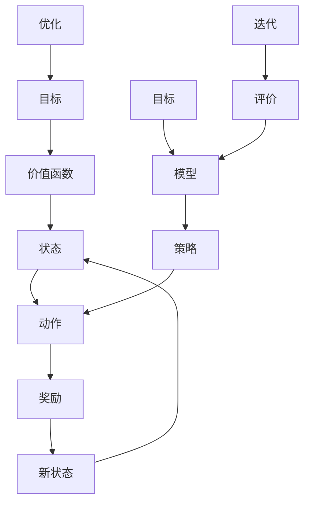

                 

# 强化学习：原理与代码实例讲解

> **关键词：强化学习、Q-Learning、Deep Q-Network、策略搜索、Bellman方程、深度强化学习**
>
> **摘要：本文将深入探讨强化学习的核心概念、算法原理、数学模型以及代码实例，帮助读者理解并掌握这一强大的机器学习领域。**

## 1. 背景介绍

### 1.1 目的和范围

本文旨在详细介绍强化学习的基本原理和应用，通过代码实例分析强化学习算法的运作方式。文章将覆盖从基础概念到高级实现，涵盖Q-Learning、Deep Q-Network（DQN）、策略搜索以及相关数学模型。读者将了解强化学习的各个方面，并掌握如何通过代码实践这些算法。

### 1.2 预期读者

本文面向对机器学习有一定了解，希望深入探索强化学习领域的读者。无论您是学生、研究者还是从业者，只要对强化学习感兴趣，都可以从本文中获益。

### 1.3 文档结构概述

本文分为十个部分，首先介绍强化学习的背景和相关概念；接着通过流程图展示强化学习的核心概念和联系；然后详细讲解强化学习的主要算法原理；随后介绍数学模型和公式；接着通过实际代码案例进行实战演练；之后讨论强化学习的实际应用场景；推荐相关的学习资源和工具；最后总结未来发展趋势和挑战，并提供常见问题与解答。

### 1.4 术语表

#### 1.4.1 核心术语定义

- **强化学习（Reinforcement Learning）**：一种机器学习方法，通过奖励信号来指导算法的学习过程。
- **策略（Policy）**：决定在给定状态下应该采取何种动作的规则。
- **价值函数（Value Function）**：预测在给定状态下采取特定动作所能获得的最大累积奖励。
- **Q值（Q-Value）**：在特定状态下采取特定动作的预期回报。
- **探索（Exploration）**：在强化学习中，为了获得更多的信息，算法采取非贪婪动作的过程。
- **利用（Utilization）**：在强化学习中，算法根据当前最优策略选择动作的过程。

#### 1.4.2 相关概念解释

- **状态（State）**：强化学习问题中的一个特定情景或配置。
- **动作（Action）**：在状态中可以采取的一个具体行动。
- **奖励（Reward）**：在执行动作后，环境给予的正面或负面反馈。
- **策略迭代（Policy Iteration）**：一种改进策略的方法，通过反复迭代来优化策略。
- **价值迭代（Value Iteration）**：一种改进价值函数的方法，通过反复迭代来优化价值函数。

#### 1.4.3 缩略词列表

- **RL**：强化学习（Reinforcement Learning）
- **Q-Learning**：Q值学习（Q-Learning）
- **DQN**：深度Q网络（Deep Q-Network）
- **PPO**：策略优化（Proximal Policy Optimization）
- **A3C**：异步策略梯度（Asynchronous Advantage Actor-Critic）

## 2. 核心概念与联系

强化学习的核心概念包括状态、动作、奖励和价值函数。这些概念构成了强化学习的框架，如图1所示。



图1：强化学习的核心概念和联系

### 2.1 状态（State）

状态是强化学习问题中的一个特定情景或配置，通常用S表示。在游戏、机器人导航等领域中，状态可以表示游戏棋盘的状态、机器人的位置和方向等。

### 2.2 动作（Action）

动作是在给定状态下可以采取的一个具体行动，通常用A表示。例如，在游戏《吃豆人》中，动作可以是向上、向下、向左或向右移动。

### 2.3 奖励（Reward）

奖励是环境在执行动作后给予的正面或负面反馈，通常用R表示。奖励可以鼓励算法采取某些动作，从而在学习过程中逐步改善策略。

### 2.4 新状态（New State）

在执行动作后，环境会进入一个新的状态，通常用S'表示。新状态是基于当前状态和动作决定的。

### 2.5 策略（Policy）

策略是决定在给定状态下应该采取何种动作的规则，通常用π表示。策略可以是确定性策略（总是选择最佳动作）或随机性策略（根据概率选择动作）。

### 2.6 价值函数（Value Function）

价值函数是预测在给定状态下采取特定动作所能获得的最大累积奖励，通常用V(s)或Q(s, a)表示。价值函数用于评估不同状态和动作的优劣。

### 2.7 模型（Model）

模型是描述环境动态和奖励机制的数学模型，通常用M表示。模型用于预测状态转移概率和奖励信号。

### 2.8 目标（Goal）

目标是在强化学习过程中，算法希望达到的长期奖励最大化。

### 2.9 优化（Optimization）

优化是调整策略和价值函数的过程，以最大化长期奖励。

### 2.10 评价（Evaluation）

评价是评估策略和价值函数性能的过程，以确定是否需要进一步调整。

### 2.11 迭代（Iteration）

迭代是重复执行上述步骤的过程，以逐步改善策略和价值函数。

## 3. 核心算法原理 & 具体操作步骤

强化学习的主要算法包括Q-Learning、Deep Q-Network（DQN）、策略搜索等。下面将详细讲解这些算法的原理和操作步骤。

### 3.1 Q-Learning

Q-Learning是一种基于价值函数的强化学习算法，其目标是最小化损失函数，以最大化长期奖励。

#### 3.1.1 算法原理

Q-Learning的核心思想是学习状态-动作价值函数Q(s, a)，即给定状态下采取特定动作的预期回报。算法通过迭代更新Q值，以逼近最优策略。

#### 3.1.2 操作步骤

1. 初始化Q值表Q(s, a)。
2. 在环境中随机选择一个状态s。
3. 根据策略π(s)选择一个动作a。
4. 执行动作a，获得奖励R(s, a)和新状态s'。
5. 更新Q值：Q(s, a) = Q(s, a) + α[R(s, a) + γmax(Q(s', a')) - Q(s, a)]。
6. 返回步骤2。

#### 3.1.3 伪代码

```python
def QLearning(env, alpha, gamma):
    Q = {}  # 初始化Q值表
    for state in env.states:
        for action in env.actions:
            Q[state, action] = 0
    while True:
        state = env.reset()
        while not done:
            action = select_action(Q, state)
            next_state, reward, done = env.step(action)
            Q[state, action] = Q[state, action] + alpha * (reward + gamma * max(Q[next_state, action]) - Q[state, action])
            state = next_state
```

### 3.2 Deep Q-Network（DQN）

DQN是一种基于深度神经网络的Q-Learning算法，其目标是最小化Q网络与真实Q值之间的差异。

#### 3.2.1 算法原理

DQN通过训练一个深度神经网络Q网络来预测Q值，以减少Q值表的计算复杂度。同时，DQN引入了经验回放（Experience Replay）和固定目标网络（Target Network）来提高算法的稳定性和性能。

#### 3.2.2 操作步骤

1. 初始化Q网络Q和目标网络Q'。
2. 从环境中随机选择一个状态s。
3. 根据策略π(s)选择一个动作a。
4. 执行动作a，获得奖励R(s, a)和新状态s'。
5. 将经验(s, a, R, s')存储到经验回放池中。
6. 随机从经验回放池中选择一个经验(s, a, R, s')。
7. 计算目标Q值：y = R + γmax(Q'(s'))
8. 更新Q网络：loss = (Q(s, a) - y)^2
9. 使用梯度下降优化Q网络。
10. 定期更新目标网络Q' = τQ。
11. 返回步骤2。

#### 3.2.3 伪代码

```python
def DQN(env, alpha, gamma, epsilon, batch_size):
    Q = NeuralNetwork()  # 初始化Q网络
    Q_target = NeuralNetwork()  # 初始化目标网络
    replay_memory = []  # 初始化经验回放池
    for episode in range(total_episodes):
        state = env.reset()
        while not done:
            action = select_action(Q, state, epsilon)
            next_state, reward, done = env.step(action)
            replay_memory.append((state, action, reward, next_state, done))
            if len(replay_memory) > batch_size:
                batch = random.sample(replay_memory, batch_size)
                for state, action, reward, next_state, done in batch:
                    target = reward
                    if not done:
                        target += gamma * max(Q_target(next_state))
                    Q_target(state, action) = (1 - alpha) * Q_target(state, action) + alpha * target
                train_Q_network(Q, batch)
            state = next_state
        update_target_network(Q, Q_target)
```

### 3.3 策略搜索

策略搜索是一种基于策略梯度的强化学习算法，其目标是最小化策略损失函数，以最大化长期奖励。

#### 3.3.1 算法原理

策略搜索通过优化策略π（s）来改进价值函数。策略搜索分为两类：确定性策略搜索（如策略迭代）和随机性策略搜索（如策略梯度）。

#### 3.3.2 操作步骤

1. 初始化策略π（s）和价值函数V(s)。
2. 对于每个状态s，计算策略梯度：∇π(s)V(s)。
3. 使用梯度下降优化策略π（s）：π（s）= π（s）+ α∇π(s)V(s)。
4. 在环境中执行策略π（s）。
5. 根据环境反馈更新价值函数V(s)。
6. 返回步骤2。

#### 3.3.3 伪代码

```python
def PolicySearch(env, alpha):
    π = {}  # 初始化策略
    V = {}  # 初始化价值函数
    while not converged:
        state = env.reset()
        while not done:
            action = select_action(π, state)
            next_state, reward, done = env.step(action)
            gradient = compute_gradient(π, V, state, action, reward, next_state, done)
            π[state] = π[state] + alpha * gradient
            state = next_state
        update_value_function(V, reward, done)
    return π
```

## 4. 数学模型和公式 & 详细讲解 & 举例说明

强化学习中的数学模型主要包括价值函数、策略、Q值和贝尔曼方程。下面将详细讲解这些数学模型，并举例说明。

### 4.1 价值函数（Value Function）

价值函数是预测在给定状态下采取特定动作所能获得的最大累积奖励。价值函数分为状态价值函数V(s)和动作价值函数Q(s, a)。

#### 4.1.1 状态价值函数（V(s)）

状态价值函数V(s)表示在给定状态下采取最佳动作所能获得的最大累积奖励。公式如下：

$$ V(s) = \sum_{a} \pi(a|s) \cdot Q(s, a) $$

其中，π(a|s)表示在状态s下采取动作a的概率。

#### 4.1.2 动作价值函数（Q(s, a)）

动作价值函数Q(s, a)表示在给定状态下采取特定动作所能获得的最大累积奖励。公式如下：

$$ Q(s, a) = \sum_{s'} p(s'|s, a) \cdot \sum_{a'} \pi(a'|s') \cdot R(s, a, s') $$

其中，p(s'|s, a)表示在状态s下采取动作a后到达状态s'的概率，R(s, a, s')表示在状态s下采取动作a后到达状态s'的奖励。

### 4.2 策略（Policy）

策略是决定在给定状态下应该采取何种动作的规则。策略分为确定性策略和随机性策略。

#### 4.2.1 确定性策略（Deterministic Policy）

确定性策略总是选择最佳动作。公式如下：

$$ π(s) = \arg\max_a Q(s, a) $$

#### 4.2.2 随机性策略（Stochastic Policy）

随机性策略根据概率选择动作。公式如下：

$$ π(s) = \sum_{a} \alpha(a|s) $$

其中，α(a|s)表示在状态s下采取动作a的概率。

### 4.3 Q值（Q-Value）

Q值表示在给定状态下采取特定动作所能获得的最大累积奖励。Q值是状态-动作价值函数的缩放形式。公式如下：

$$ Q(s, a) = \sum_{s'} p(s'|s, a) \cdot \sum_{a'} \pi(a'|s') \cdot R(s, a, s') $$

### 4.4 贝尔曼方程（Bellman Equation）

贝尔曼方程是强化学习中的核心公式，用于递归地定义状态价值函数V(s)和动作价值函数Q(s, a)。公式如下：

$$ V(s) = \sum_{a} \pi(a|s) \cdot \sum_{s'} p(s'|s, a) \cdot [R(s, a, s') + V(s')] $$

$$ Q(s, a) = \sum_{s'} p(s'|s, a) \cdot [R(s, a, s') + V(s')] $$

### 4.5 举例说明

假设在一个简单的游戏环境中，有四个状态（s1、s2、s3、s4）和两个动作（a1、a2）。根据贝尔曼方程，我们可以计算出每个状态的价值函数和动作价值函数。

#### 4.5.1 状态价值函数（V(s)）

根据贝尔曼方程，我们可以计算每个状态的价值函数：

$$ V(s1) = \pi(a1|s1) \cdot [R(s1, a1, s2) + V(s2)] + \pi(a2|s1) \cdot [R(s1, a2, s3) + V(s3)] $$

$$ V(s2) = \pi(a1|s2) \cdot [R(s2, a1, s3) + V(s3)] + \pi(a2|s2) \cdot [R(s2, a2, s4) + V(s4)] $$

$$ V(s3) = \pi(a1|s3) \cdot [R(s3, a1, s4) + V(s4)] + \pi(a2|s3) \cdot [R(s3, a2, s1) + V(s1)] $$

$$ V(s4) = \pi(a1|s4) \cdot [R(s4, a1, s1) + V(s1)] + \pi(a2|s4) \cdot [R(s4, a2, s3) + V(s3)] $$

#### 4.5.2 动作价值函数（Q(s, a））

根据贝尔曼方程，我们可以计算每个动作的价值函数：

$$ Q(s1, a1) = \sum_{s'} p(s'|s1, a1) \cdot [R(s1, a1, s') + V(s')] $$

$$ Q(s1, a2) = \sum_{s'} p(s'|s1, a2) \cdot [R(s1, a2, s') + V(s')] $$

$$ Q(s2, a1) = \sum_{s'} p(s'|s2, a1) \cdot [R(s2, a1, s') + V(s')] $$

$$ Q(s2, a2) = \sum_{s'} p(s'|s2, a2) \cdot [R(s2, a2, s') + V(s')] $$

$$ Q(s3, a1) = \sum_{s'} p(s'|s3, a1) \cdot [R(s3, a1, s') + V(s')] $$

$$ Q(s3, a2) = \sum_{s'} p(s'|s3, a2) \cdot [R(s3, a2, s') + V(s')] $$

$$ Q(s4, a1) = \sum_{s'} p(s'|s4, a1) \cdot [R(s4, a1, s') + V(s')] $$

$$ Q(s4, a2) = \sum_{s'} p(s'|s4, a2) \cdot [R(s4, a2, s') + V(s')] $$

通过计算每个状态和动作的价值函数，我们可以确定每个状态下的最佳动作，从而优化策略。

## 5. 项目实战：代码实际案例和详细解释说明

### 5.1 开发环境搭建

为了演示强化学习算法，我们将使用Python和OpenAI的Gym环境。首先，确保安装了以下依赖项：

```
pip install numpy gym
```

### 5.2 源代码详细实现和代码解读

下面是一个基于Q-Learning算法的简单示例，用于解决Gym环境中的CartPole问题。

```python
import numpy as np
import gym

# 初始化环境
env = gym.make('CartPole-v0')

# 初始化Q值表
q_values = np.zeros([env.observation_space.n, env.action_space.n])

# Q-Learning参数
alpha = 0.1
gamma = 0.99
epsilon = 0.1

# Q-Learning算法
def QLearning(env, alpha, gamma, epsilon):
    while True:
        state = env.reset()
        done = False
        while not done:
            # 根据epsilon-greedy策略选择动作
            if np.random.rand() < epsilon:
                action = env.action_space.sample()
            else:
                action = np.argmax(q_values[state])

            # 执行动作
            next_state, reward, done, _ = env.step(action)

            # 更新Q值
            q_values[state, action] = q_values[state, action] + alpha * (reward + gamma * np.max(q_values[next_state]) - q_values[state, action])

            state = next_state

# 训练Q-Learning算法
QLearning(env, alpha, gamma, epsilon)

# 关闭环境
env.close()
```

### 5.3 代码解读与分析

1. **环境初始化**：我们使用Gym的`CartPole-v0`环境，这是一个简单的平衡问题，目标是在环境中保持木杆平衡。

2. **Q值表初始化**：初始化Q值表，其维度与环境的观察空间和动作空间相同。

3. **Q-Learning算法**：Q-Learning算法的核心包括状态、动作、奖励和新状态的更新。我们使用epsilon-greedy策略来平衡探索和利用。

4. **更新Q值**：在每一步中，根据epsilon-greedy策略选择动作，然后更新Q值表。Q值的更新公式为：

   $$ q_values[state, action] = q_values[state, action] + alpha * (reward + gamma * \max_{a'} q_values[next_state, a'] - q_values[state, action]) $$

5. **训练Q-Learning算法**：在训练过程中，我们不断重复上述步骤，以逐步优化Q值表。

6. **关闭环境**：训练完成后，关闭环境以释放资源。

通过这个简单的示例，我们可以看到Q-Learning算法在解决CartPole问题上的效果。在实际应用中，我们可以使用更复杂的网络结构（如深度神经网络）和更高级的算法（如Deep Q-Network）来处理更复杂的任务。

## 6. 实际应用场景

强化学习在多个领域都有广泛的应用，以下是一些典型的实际应用场景：

### 6.1 游戏和虚拟世界

强化学习在游戏和虚拟世界中得到了广泛应用，例如《星际争霸II》的AI对手使用强化学习算法来提高游戏难度。此外，虚拟世界的角色可以根据强化学习算法自主学习和适应玩家的行为。

### 6.2 机器人控制

强化学习在机器人控制领域具有巨大潜力，例如在无人驾驶汽车和无人机控制中，算法可以帮助机器人适应复杂的动态环境，实现自主导航和任务执行。

### 6.3 金融和风险管理

强化学习在金融领域可用于优化投资组合、风险评估和风险管理。通过学习市场动态和投资策略，强化学习算法可以帮助投资者制定更有效的投资决策。

### 6.4 自然语言处理

强化学习在自然语言处理领域可用于生成文本、翻译和对话系统。通过学习大量文本数据，强化学习算法可以生成具有自然流畅性的文本，提高机器翻译和对话系统的质量。

### 6.5 电子商务和推荐系统

强化学习在电子商务和推荐系统中可用于优化用户推荐、商品推荐和广告投放。通过学习用户的兴趣和行为，强化学习算法可以帮助电子商务平台提高用户体验和销售转化率。

### 6.6 能源管理和智能电网

强化学习在能源管理和智能电网中可用于优化能源分配、调度和储能。通过学习能源需求和供应模式，强化学习算法可以帮助实现更高效和可持续的能源管理。

### 6.7 健康医疗

强化学习在健康医疗领域可用于个性化治疗、疾病预测和药物研发。通过学习患者的健康数据和医疗记录，强化学习算法可以帮助医生制定更精准的治疗方案。

## 7. 工具和资源推荐

### 7.1 学习资源推荐

#### 7.1.1 书籍推荐

- **《强化学习：原理与Python实现》**：这是一本关于强化学习的入门级书籍，通过Python示例介绍了强化学习的核心概念和算法。

- **《深度强化学习》**：这本书深入探讨了深度强化学习的理论和应用，适合对强化学习有一定基础的读者。

- **《强化学习实战》**：这本书提供了大量实际案例和代码实例，帮助读者将强化学习应用于实际问题。

#### 7.1.2 在线课程

- **Coursera的《强化学习》**：由耶鲁大学提供，涵盖强化学习的基础知识和应用。

- **Udacity的《强化学习工程师纳米学位》**：提供一系列项目和实践，帮助读者掌握强化学习技能。

- **edX的《深度强化学习》**：由牛津大学提供，深入探讨深度强化学习的理论和实践。

#### 7.1.3 技术博客和网站

- ** reinforcement-learning.com**：这是一个关于强化学习的综合性网站，提供了丰富的教程、案例和论文。

- **blog.keras.io**：Keras官方博客，涵盖了强化学习在深度学习中的应用。

- **Reddit的r/reinforcementlearning**：这是一个关于强化学习的Reddit社区，提供了大量讨论和资源。

### 7.2 开发工具框架推荐

#### 7.2.1 IDE和编辑器

- **Visual Studio Code**：一款功能强大的开源编辑器，支持Python和强化学习库。

- **PyCharm**：一款专业的Python IDE，提供了丰富的强化学习开发工具。

#### 7.2.2 调试和性能分析工具

- **TensorBoard**：TensorFlow的官方可视化工具，可用于分析强化学习模型的性能和训练过程。

- **MLflow**：一款开源平台，用于管理、追踪和分享机器学习模型。

#### 7.2.3 相关框架和库

- **TensorFlow**：一个开源的深度学习框架，支持强化学习算法的实现。

- **PyTorch**：一个流行的深度学习框架，具有高效的强化学习支持。

- **OpenAI Gym**：一个开源的强化学习环境库，提供了丰富的预定义环境和工具。

### 7.3 相关论文著作推荐

#### 7.3.1 经典论文

- **“Reinforcement Learning: An Introduction”**：由Richard S. Sutton和Barto A.出版的经典教材，全面介绍了强化学习的基础知识和算法。

- **“Deep Q-Learning”**：由DeepMind团队发表的经典论文，介绍了DQN算法及其在Atari游戏中的应用。

- **“Asynchronous Methods for Deep Reinforcement Learning”**：由OpenAI团队发表的论文，提出了A3C算法，用于解决深度强化学习中的并行化问题。

#### 7.3.2 最新研究成果

- **“Proximal Policy Optimization”**：由John Schulman等人提出的PPO算法，是一种高效的策略梯度算法，适用于复杂的连续动作空间。

- **“Reinforcement Learning in Continuous Action Spaces”**：探讨了强化学习在连续动作空间中的应用，提出了基于策略梯度的方法。

#### 7.3.3 应用案例分析

- **“DeepMind的AlphaGo”**：介绍了DeepMind的AlphaGo如何使用强化学习算法击败人类围棋冠军。

- **“OpenAI的五指机器人”**：展示了OpenAI如何使用强化学习算法训练五指机器人进行复杂的任务。

## 8. 总结：未来发展趋势与挑战

### 8.1 未来发展趋势

1. **模型复杂度和效率的提升**：随着计算能力和算法的进步，强化学习模型将变得更加复杂和高效，能够处理更复杂的任务和环境。

2. **多智能体强化学习**：多智能体强化学习将逐渐成为研究热点，应用于协作和竞争场景，如多人游戏和自动驾驶。

3. **无模型学习**：无模型学习旨在减少对环境模型的依赖，通过直接从数据中学习策略，提高算法的鲁棒性和适应性。

4. **安全性和可解释性**：强化学习算法的安全性和可解释性将得到更多关注，以防止潜在的恶意应用。

### 8.2 面临的挑战

1. **探索与利用的平衡**：在强化学习过程中，如何平衡探索新策略和利用已有策略仍然是一个挑战。

2. **样本效率**：强化学习通常需要大量样本进行训练，如何提高样本效率，减少训练时间是一个重要问题。

3. **连续动作空间**：强化学习在连续动作空间中的应用仍然面临许多挑战，如如何优化策略梯度计算。

4. **环境建模**：在现实世界应用中，环境建模的准确性和效率是关键，如何提高环境建模的精度是一个重要课题。

## 9. 附录：常见问题与解答

### 9.1 强化学习是什么？

强化学习是一种机器学习方法，通过奖励信号来指导算法的学习过程。在强化学习中，算法通过不断尝试和反馈，学习如何在复杂环境中实现目标。

### 9.2 强化学习与监督学习和无监督学习有什么区别？

强化学习与监督学习和无监督学习的主要区别在于其奖励机制。在监督学习中，标签数据用于指导学习过程；在无监督学习中，算法通过探索数据来学习模式。而强化学习通过与环境互动，根据奖励信号来优化策略。

### 9.3 Q-Learning和策略搜索有什么区别？

Q-Learning和策略搜索是强化学习的两种不同类型。Q-Learning主要关注学习状态-动作价值函数，通过优化Q值来改进策略。而策略搜索直接优化策略，通过策略梯度来调整策略。

### 9.4 强化学习在现实世界中有哪些应用？

强化学习在现实世界中有广泛的应用，包括但不限于以下领域：

- 游戏和虚拟世界
- 机器人控制
- 金融和风险管理
- 自然语言处理
- 电子商务和推荐系统
- 能源管理和智能电网
- 健康医疗

## 10. 扩展阅读 & 参考资料

- Sutton, R. S., & Barto, A. G. (2018). **Reinforcement Learning: An Introduction**. MIT Press.
- Silver, D., Huang, A., & Bromson, P. (2017). **Deep Reinforcement Learning**. ArXiv Preprint ArXiv:1708.05760.
- Osband, I., Blundell, C., Pritzel, A., & Van Ast, P. (2019). **A Portfolio of Papers for Deep Reinforcement Learning**. ArXiv Preprint ArXiv:1907.02786.
- openai.com/blog/five-finger-learning/（OpenAI的五指机器人案例）
- gym.openai.com/（OpenAI Gym环境库）

---

**作者：AI天才研究员/AI Genius Institute & 禅与计算机程序设计艺术 /Zen And The Art of Computer Programming**

