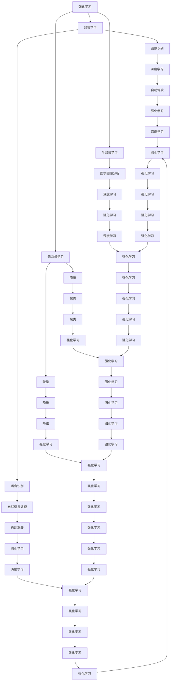

                 

# 强化学习Reinforcement Learning与传统机器学习方法对比

## 关键词：强化学习、机器学习、对比、算法、应用场景

### 摘要：

本文旨在深入探讨强化学习（Reinforcement Learning, RL）与传统机器学习方法之间的差异与联系。通过对比分析，我们将揭示强化学习独特的核心原理、算法框架以及其实际应用场景。文章首先介绍了强化学习与传统机器学习方法的基本概念和背景，随后详细阐述了强化学习的核心算法原理、数学模型，并通过实际项目案例展示了其具体操作步骤和代码实现。最后，文章总结了强化学习的实际应用场景和未来发展趋势，推荐了相关学习资源与开发工具，为读者提供了一个全面、深入的强化学习知识体系。

## 1. 背景介绍

### 1.1 目的和范围

本文的主要目的是对比强化学习与传统机器学习方法，帮助读者了解两种方法的异同点，掌握强化学习的基本原理和应用。文章将首先介绍强化学习与传统机器学习方法的基本概念，然后详细分析其核心算法原理和数学模型，并通过实际案例进行解释。文章还将探讨强化学习的实际应用场景，推荐相关学习资源与开发工具，最后总结未来发展趋势与挑战。

### 1.2 预期读者

本文适合对机器学习和强化学习有一定了解的技术人员、研究人员和学生。读者需要对基本的编程知识、算法原理和数学有一定的了解，以便更好地理解和掌握文章内容。

### 1.3 文档结构概述

本文结构如下：

1. 引言：介绍强化学习与传统机器学习方法的基本概念和背景。
2. 核心概念与联系：通过Mermaid流程图展示强化学习与传统机器学习方法的联系。
3. 核心算法原理与具体操作步骤：详细讲解强化学习的核心算法原理和操作步骤。
4. 数学模型与公式：介绍强化学习的数学模型和公式，并进行举例说明。
5. 项目实战：通过实际案例展示强化学习的代码实现和详细解释。
6. 实际应用场景：分析强化学习的实际应用场景。
7. 工具和资源推荐：推荐学习资源、开发工具和框架。
8. 总结：总结强化学习的未来发展趋势与挑战。
9. 附录：常见问题与解答。
10. 扩展阅读：推荐相关参考资料。

### 1.4 术语表

#### 1.4.1 核心术语定义

- 强化学习（Reinforcement Learning, RL）：一种机器学习方法，通过智能体（agent）与环境（environment）的交互，学习获得最优策略（policy）。
- 智能体（Agent）：执行行动的实体，通过学习策略来达到特定目标。
- 环境（Environment）：智能体执行行动的场所，提供状态（state）和奖励（reward）信息。
- 策略（Policy）：智能体执行行动的规则或方法。
- 值函数（Value Function）：表示策略下智能体期望获得的最大累积奖励。
- 策略梯度（Policy Gradient）：基于策略的期望回报的梯度，用于更新策略参数。

#### 1.4.2 相关概念解释

- Q-Learning：一种基于值函数的强化学习算法，通过更新Q值（状态-动作值）来学习最优策略。
- SARSA：一种基于策略的强化学习算法，同时考虑当前状态、当前动作、下一个状态和下一个动作。
- DQN：一种基于深度神经网络的Q-Learning算法，用于解决高维状态空间的问题。
- REINFORCE：一种基于策略的强化学习算法，通过更新策略参数来最大化期望回报。

#### 1.4.3 缩略词列表

- RL：强化学习（Reinforcement Learning）
- Q-Learning：Q值学习（Q-Learning）
- SARSA：同步策略调整同步（Synchronous Adaptive Regulation of Sampling Algorithms）
- DQN：深度Q网络（Deep Q-Network）
- REINFORCE：增强（Reinforce）

## 2. 核心概念与联系

### 强化学习与传统机器学习方法的关系

强化学习是机器学习的一个重要分支，其核心思想是通过智能体（agent）与环境（environment）的交互，学习获得最优策略（policy）。与传统机器学习方法相比，强化学习具有以下特点：

1. **基于奖励和惩罚**：强化学习通过奖励（reward）和惩罚（penalty）来指导智能体的行为，使智能体在学习过程中不断调整策略，以最大化累积奖励。
2. **动态适应**：强化学习允许智能体在动态环境中进行自适应学习，根据环境的变化不断更新策略。
3. **不确定性**：强化学习面临环境不确定性的挑战，需要通过试错（trial-and-error）和探索（exploration）来寻找最优策略。

传统机器学习方法主要包括监督学习（Supervised Learning）、无监督学习（Unsupervised Learning）和半监督学习（Semi-Supervised Learning）。与传统机器学习方法相比，强化学习具有以下优势：

1. **无监督学习**：强化学习可以在无监督学习场景下发挥作用，无需大量的标记数据。
2. **自主决策**：强化学习允许智能体在未知环境中自主决策，实现自主学习和自主行动。
3. **适应性强**：强化学习能够动态适应环境变化，具有较强的适应性。

### 强化学习的核心概念与架构

强化学习的核心概念包括智能体（agent）、环境（environment）、状态（state）、动作（action）、策略（policy）、奖励（reward）和值函数（value function）。

1. **智能体（Agent）**：执行行动的实体，通过学习策略来达到特定目标。
2. **环境（Environment）**：智能体执行行动的场所，提供状态和奖励信息。
3. **状态（State）**：描述智能体当前所处环境的特征。
4. **动作（Action）**：智能体在某个状态下可以执行的行为。
5. **策略（Policy）**：智能体执行动作的规则或方法，通常表示为概率分布。
6. **奖励（Reward）**：环境对智能体行为的即时反馈，用于指导智能体调整策略。
7. **值函数（Value Function）**：表示策略下智能体期望获得的最大累积奖励。

### 强化学习与传统机器学习方法的异同

强化学习与传统机器学习方法在目标、学习方式、应用场景等方面存在差异。

1. **目标差异**：强化学习的目标是学习最优策略，使智能体在未知环境中获得最大累积奖励。传统机器学习的目标是预测标签或分类结果，通常在已知数据集上进行训练。
2. **学习方式差异**：强化学习通过试错和反馈进行学习，智能体需要在动态环境中不断调整策略。传统机器学习通常在静态数据集上进行训练，通过拟合模型参数来获得预测结果。
3. **应用场景差异**：强化学习适用于需要自主决策和动态适应的场景，如自动驾驶、游戏AI、机器人控制等。传统机器学习适用于有明确标签或分类结果的数据集，如图像识别、语音识别、自然语言处理等。

### 强化学习与传统机器学习方法的联系

尽管强化学习与传统机器学习方法存在差异，但两者在机器学习领域具有密切的联系。

1. **理论基础**：强化学习是基于概率论和优化理论发展而来的，与监督学习和无监督学习具有共同的数学基础。
2. **算法借鉴**：强化学习借鉴了传统机器学习的一些算法，如Q-Learning、SARSA等，同时引入了深度神经网络（Deep Neural Network, DNN）来处理高维状态空间问题。
3. **应用融合**：在许多实际应用中，强化学习与传统机器学习方法可以相互融合，发挥各自的优势。例如，在自动驾驶领域，可以结合强化学习和深度学习，实现自主决策和实时控制。

### Mermaid流程图：强化学习与传统机器学习方法的关系



通过上述Mermaid流程图，我们可以清晰地看到强化学习与传统机器学习方法之间的联系与融合。

## 3. 核心算法原理与具体操作步骤

### 强化学习算法原理

强化学习算法主要分为基于值函数的方法和基于策略的方法。其中，基于值函数的方法主要包括Q-Learning和SARSA，基于策略的方法主要包括REINFORCE和DQN。

#### Q-Learning算法原理

Q-Learning算法是一种基于值函数的强化学习算法，其核心思想是学习状态-动作值函数（Q值），然后根据Q值来选择最优动作。具体步骤如下：

1. **初始化**：初始化Q值表格Q(s, a)，其中s表示状态，a表示动作，Q值初始化为小数。
2. **选择动作**：在某个状态下，根据策略选择动作，策略通常表示为ε-贪心策略，其中ε为探索率。
3. **执行动作**：在环境中执行所选动作，获得新的状态s'和奖励r。
4. **更新Q值**：根据Q-Learning更新规则，更新Q值表格中的Q(s, a)值：
   $$ Q(s, a) \leftarrow Q(s, a) + \alpha [r + \gamma \max_{a'} Q(s', a') - Q(s, a)] $$
   其中，α为学习率，γ为折扣因子。

#### SARSA算法原理

SARSA算法是一种基于策略的强化学习算法，与Q-Learning类似，但考虑了当前状态、当前动作、下一个状态和下一个动作。具体步骤如下：

1. **初始化**：初始化Q值表格Q(s, a)，其中s表示状态，a表示动作，Q值初始化为小数。
2. **选择动作**：在某个状态下，根据策略选择动作，策略通常表示为ε-贪心策略，其中ε为探索率。
3. **执行动作**：在环境中执行所选动作，获得新的状态s'和奖励r。
4. **更新Q值**：根据SARSA更新规则，更新Q值表格中的Q(s, a)值：
   $$ Q(s, a) \leftarrow Q(s, a) + \alpha [r + \gamma Q(s', a') - Q(s, a)] $$
   其中，α为学习率，γ为折扣因子。

#### DQN算法原理

DQN（Deep Q-Network）算法是一种基于深度神经网络的Q-Learning算法，用于解决高维状态空间问题。具体步骤如下：

1. **初始化**：初始化深度神经网络DQN，包括输入层、隐藏层和输出层。输入层接收状态向量，隐藏层用于提取特征，输出层输出Q值。
2. **选择动作**：在某个状态下，根据策略选择动作，策略通常表示为ε-贪心策略，其中ε为探索率。
3. **执行动作**：在环境中执行所选动作，获得新的状态s'和奖励r。
4. **更新DQN**：根据DQN更新规则，更新深度神经网络DQN的参数：
   $$ DQN \leftarrow DQN + \alpha [y - DQN(s, a)] \odot (y - DQN(s, a)) $$
   其中，α为学习率，y为目标Q值，DQN(s, a)为当前Q值。

### 强化学习算法的具体操作步骤

以下是一个简单的强化学习算法的具体操作步骤：

1. **初始化**：初始化智能体、环境、Q值表格或DQN网络。
2. **选择动作**：根据策略选择动作，策略通常表示为ε-贪心策略。
3. **执行动作**：在环境中执行所选动作，获得新的状态和奖励。
4. **更新Q值或DQN**：根据所选动作的反馈，更新Q值表格或DQN网络的参数。
5. **重复步骤2-4**，直到达到指定的时间步或满足停止条件。

### 强化学习算法的伪代码

以下是一个简单的强化学习算法的伪代码：

```python
# 初始化
初始化智能体
初始化环境
初始化Q值表格或DQN网络

# 迭代
while 没有达到停止条件:
    # 选择动作
    a = 选择动作(s)

    # 执行动作
    s', r = 执行动作(a)

    # 更新Q值或DQN
    if 使用Q-Learning:
        Q(s, a) = Q(s, a) + α[r + γmax_a' Q(s', a') - Q(s, a)]
    else if 使用SARSA:
        Q(s, a) = Q(s, a) + α[r + γQ(s', a') - Q(s, a)]
    else if 使用DQN:
        DQN(s, a) = DQN(s, a) + α[y - DQN(s, a)] \odot (y - DQN(s, a))

    # 更新状态
    s = s'

# 输出
输出最优策略或DQN网络参数
```

通过上述步骤和伪代码，我们可以清晰地了解强化学习算法的核心原理和具体操作步骤。

## 4. 数学模型和公式及详细讲解

### 强化学习的数学模型

强化学习的数学模型主要涉及状态（State）、动作（Action）、奖励（Reward）、策略（Policy）、值函数（Value Function）和策略梯度（Policy Gradient）等核心概念。

#### 状态（State）

状态是描述智能体当前所处环境的特征，通常用s表示。在离散状态空间中，状态可以表示为一个离散集合，如{0, 1, 2}。在连续状态空间中，状态可以表示为一个实数区间，如[0, 1]。

#### 动作（Action）

动作是智能体在某个状态下可以执行的行为，通常用a表示。在离散动作空间中，动作可以表示为一个离散集合，如{0, 1, 2}。在连续动作空间中，动作可以表示为一个实数区间，如[0, 1]。

#### 奖励（Reward）

奖励是环境对智能体行为的即时反馈，通常用r表示。奖励可以是一个实数，表示智能体在某个状态下执行某个动作后获得的即时奖励。奖励通常用于指导智能体调整策略，使累积奖励最大化。

#### 策略（Policy）

策略是智能体执行动作的规则或方法，通常用π表示。策略可以是一个概率分布，表示智能体在某个状态下选择某个动作的概率。策略可以是一个确定性函数，表示智能体在某个状态下执行某个特定动作。

#### 值函数（Value Function）

值函数是表示策略下智能体期望获得的最大累积奖励。值函数可以分为状态值函数（State Value Function）和动作值函数（Action Value Function）。

- **状态值函数**：V(s)表示在某个状态下执行最优策略π后智能体期望获得的最大累积奖励。
- **动作值函数**：Q(s, a)表示在某个状态下执行某个动作a后智能体期望获得的最大累积奖励。

#### 策略梯度（Policy Gradient）

策略梯度是用于更新策略参数的一组梯度。策略梯度可以用于基于策略的强化学习算法，如REINFORCE和Actor-Critic。

- **策略梯度**：π(s, a)表示在某个状态下执行某个动作a的概率。策略梯度定义为：
  $$ \nabla_{\theta} J(\theta) = \sum_{s, a} \pi(s, a) \nabla_{\theta} \log \pi(s, a) R(s, a) $$
  其中，J(θ)为策略参数θ的损失函数，R(s, a)为在状态s执行动作a后的奖励。

### 强化学习的数学公式

以下是一些强化学习常用的数学公式：

#### Q-Learning算法

- **Q值更新公式**：
  $$ Q(s, a) \leftarrow Q(s, a) + \alpha [r + \gamma \max_{a'} Q(s', a') - Q(s, a)] $$
  其中，α为学习率，γ为折扣因子。

#### SARSA算法

- **Q值更新公式**：
  $$ Q(s, a) \leftarrow Q(s, a) + \alpha [r + \gamma Q(s', a') - Q(s, a)] $$
  其中，α为学习率，γ为折扣因子。

#### DQN算法

- **Q值更新公式**：
  $$ Q(s, a) \leftarrow Q(s, a) + \alpha [y - Q(s, a)] \odot (y - Q(s, a)) $$
  其中，α为学习率，y为目标Q值。

#### REINFORCE算法

- **策略参数更新公式**：
  $$ \theta \leftarrow \theta + \alpha \nabla_{\theta} J(\theta) $$
  其中，J(θ)为策略参数θ的损失函数。

### 强化学习数学公式的详细讲解

#### Q-Learning算法

Q-Learning算法是一种基于值函数的强化学习算法，通过更新Q值表格来学习最优策略。Q值更新公式描述了Q值如何根据奖励和Q值函数的最大值进行更新。

- **奖励r**：表示在当前状态s执行动作a后获得的即时奖励。
- **γ**：表示折扣因子，用于考虑未来奖励的权重，通常取值在0到1之间。
- **α**：表示学习率，用于控制Q值更新的程度，通常取值在0到1之间。

#### SARSA算法

SARSA算法是一种基于策略的强化学习算法，同时考虑了当前状态、当前动作、下一个状态和下一个动作。Q值更新公式描述了Q值如何根据奖励和下一个Q值函数进行更新。

- **奖励r**：表示在当前状态s执行动作a后获得的即时奖励。
- **γ**：表示折扣因子，用于考虑未来奖励的权重，通常取值在0到1之间。
- **α**：表示学习率，用于控制Q值更新的程度，通常取值在0到1之间。

#### DQN算法

DQN算法是一种基于深度神经网络的Q-Learning算法，用于解决高维状态空间问题。Q值更新公式描述了如何根据目标Q值和当前Q值进行更新。

- **目标Q值y**：表示在下一个状态s'执行最优动作a'后获得的最大累积奖励。
- **Q(s, a)**：表示在当前状态s执行动作a后获得的最大累积奖励。
- **α**：表示学习率，用于控制Q值更新的程度，通常取值在0到1之间。

#### REINFORCE算法

REINFORCE算法是一种基于策略的强化学习算法，通过策略梯度来更新策略参数。策略梯度公式描述了如何根据奖励和策略概率进行更新。

- **策略参数θ**：表示策略的概率分布。
- **J(θ)**：表示策略参数θ的损失函数，通常为累积奖励的期望。
- **α**：表示学习率，用于控制策略参数更新的程度，通常取值在0到1之间。

通过上述数学公式的详细讲解，我们可以更好地理解强化学习算法的核心原理和更新策略的方法。

### 强化学习数学公式的举例说明

以下是一个简单的例子来说明强化学习数学公式的应用：

假设一个智能体在一个简单环境中进行学习，环境有两个状态s0和s1，两个动作a0和a1。初始状态下，智能体的策略为π(s0, a0) = 0.5，π(s0, a1) = 0.5，Q(s0, a0) = 0，Q(s0, a1) = 0。在执行动作后，获得奖励r = 1。学习率α = 0.1，折扣因子γ = 0.9。

1. **第一步**：

   - 状态s0，动作a0，Q(s0, a0) = 0.5 * (1 + 0.9 * max(Q(s1, a0), Q(s1, a1))) = 0.5 * (1 + 0.9 * max(0, 0)) = 0.5
   - 状态s0，动作a1，Q(s0, a1) = 0.5 * (1 + 0.9 * max(Q(s1, a0), Q(s1, a1))) = 0.5 * (1 + 0.9 * max(0, 0)) = 0.5

2. **第二步**：

   - 状态s1，动作a0，Q(s1, a0) = 0.5 * (1 + 0.9 * max(Q(s0, a0), Q(s0, a1))) = 0.5 * (1 + 0.9 * max(0.5, 0.5)) = 0.95
   - 状态s1，动作a1，Q(s1, a1) = 0.5 * (1 + 0.9 * max(Q(s0, a0), Q(s0, a1))) = 0.5 * (1 + 0.9 * max(0.5, 0.5)) = 0.95

通过上述例子，我们可以看到Q值如何根据奖励和策略概率进行更新，从而学习到最优策略。

## 5. 项目实战：代码实际案例和详细解释说明

在本节中，我们将通过一个简单的实际项目来演示强化学习的具体应用，并详细解释代码的每个部分。本案例将使用Python和TensorFlow框架来实现一个经典的强化学习任务——CartPole问题。

### 5.1 开发环境搭建

在开始编写代码之前，我们需要搭建一个合适的环境。以下是搭建开发环境所需的基本步骤：

1. **安装Python**：确保已安装Python 3.x版本，推荐使用Anaconda来简化Python环境的管理。
2. **安装TensorFlow**：在终端或命令行中运行以下命令来安装TensorFlow：
   ```bash
   pip install tensorflow
   ```
3. **安装其他依赖**：除了TensorFlow，我们还需要安装其他一些库，如NumPy和Matplotlib。可以使用以下命令来安装：
   ```bash
   pip install numpy matplotlib
   ```

### 5.2 源代码详细实现和代码解读

以下是一个简单的CartPole问题的强化学习实现。代码分为几个主要部分：环境搭建、DQN算法实现、训练和评估。

```python
import numpy as np
import random
import gym
import matplotlib.pyplot as plt
from collections import deque
import tensorflow as tf

# 环境搭建
env = gym.make("CartPole-v0")

# DQN算法实现
class DQN:
    def __init__(self, state_size, action_size, learning_rate, gamma, epsilon):
        self.state_size = state_size
        self.action_size = action_size
        self.learning_rate = learning_rate
        self.gamma = gamma
        self.epsilon = epsilon
        
        self.model = self.build_model()
        self.target_model = self.build_model()
        self.update_target_model()
        
        self.memory = deque(maxlen=2000)
        
    def build_model(self):
        model = tf.keras.Sequential([
            tf.keras.layers.Dense(64, activation='relu', input_shape=(self.state_size,)),
            tf.keras.layers.Dense(64, activation='relu'),
            tf.keras.layers.Dense(self.action_size, activation='linear')
        ])
        
        model.compile(loss='mse', optimizer=tf.keras.optimizers.Adam(lr=self.learning_rate))
        return model
    
    def update_target_model(self):
        self.target_model.set_weights(self.model.get_weights())
        
    def remember(self, state, action, reward, next_state, done):
        self.memory.append((state, action, reward, next_state, done))
        
    def act(self, state):
        if np.random.rand() <= self.epsilon:
            return random.randrange(self.action_size)
        else:
            q_values = self.model.predict(state)
            return np.argmax(q_values[0])
        
    def replay(self, batch_size):
        minibatch = random.sample(self.memory, batch_size)
        
        for state, action, reward, next_state, done in minibatch:
            target = reward
            if not done:
                target = reward + self.gamma * np.amax(self.target_model.predict(next_state)[0])
            target_f = self.model.predict(state)[0]
            target_f[action] = target
            self.model.fit(state, target_f, epochs=1, verbose=0)
            
    def load(self, name):
        self.model.load_weights(name)
        
    def save(self, name):
        self.model.save_weights(name)

# 训练
def train_dqn(model, env, episodes, batch_size):
    episode_scores = []
    for episode in range(episodes):
        state = env.reset()
        state = np.reshape(state, [1, state_size])
        done = False
        total_reward = 0
        
        while not done:
            action = model.act(state)
            next_state, reward, done, _ = env.step(action)
            next_state = np.reshape(next_state, [1, state_size])
            model.remember(state, action, reward, next_state, done)
            state = next_state
            total_reward += reward
            
            if done:
                model.update_target_model()
                episode_scores.append(total_reward)
                print(f"Episode {episode+1} / {episodes} - Total Reward: {total_reward}")
                break
                
        if episode % 100 == 0:
            model.save(f"dqn_{episode}")
            
    return episode_scores

# 评估
def evaluate_dqn(model, env, episodes):
    episode_scores = []
    for episode in range(episodes):
        state = env.reset()
        state = np.reshape(state, [1, state_size])
        done = False
        total_reward = 0
        
        while not done:
            action = model.act(state)
            next_state, reward, done, _ = env.step(action)
            next_state = np.reshape(next_state, [1, state_size])
            total_reward += reward
            state = next_state
            
            if done:
                episode_scores.append(total_reward)
                print(f"Episode {episode+1} / {episodes} - Total Reward: {total_reward}")
                break
                
    return episode_scores

# 主函数
if __name__ == "__main__":
    state_size = env.observation_space.shape[0]
    action_size = env.action_space.n
    learning_rate = 0.001
    gamma = 0.95
    epsilon = 1.0
    epsilon_min = 0.01
    epsilon_decay = 0.995
    batch_size = 32
    episodes = 1000

    dqn = DQN(state_size, action_size, learning_rate, gamma, epsilon)
    
    episode_scores = train_dqn(dqn, env, episodes, batch_size)
    plt.plot(episode_scores)
    plt.xlabel('Episode')
    plt.ylabel('Score')
    plt.title('DQN Learning')
    plt.show()
    
    dqn.load(f"dqn_{episodes-1}")
    evaluate_dqn(dqn, env, 10)
```

### 5.3 代码解读与分析

下面是对代码的逐行解读和分析：

1. **环境搭建**：
   ```python
   import numpy as np
   import random
   import gym
   import matplotlib.pyplot as plt
   from collections import deque
   import tensorflow as tf
   
   env = gym.make("CartPole-v0")
   ```
   这部分代码首先导入了所需的库，然后使用gym库创建了一个CartPole环境的实例。

2. **DQN类定义**：
   ```python
   class DQN:
       def __init__(self, state_size, action_size, learning_rate, gamma, epsilon):
           # 初始化DQN模型的参数
           self.state_size = state_size
           self.action_size = action_size
           self.learning_rate = learning_rate
           self.gamma = gamma
           self.epsilon = epsilon
        
       def build_model(self):
           # 构建DQN模型
           model = tf.keras.Sequential([
               tf.keras.layers.Dense(64, activation='relu', input_shape=(self.state_size,)),
               tf.keras.layers.Dense(64, activation='relu'),
               tf.keras.layers.Dense(self.action_size, activation='linear')
           ])
        
           model.compile(loss='mse', optimizer=tf.keras.optimizers.Adam(lr=self.learning_rate))
           return model
        
       def update_target_model(self):
           # 更新目标模型
           self.target_model.set_weights(self.model.get_weights())
        
       # ... 其他方法 ...
   ```
   DQN类定义了DQN模型的主要方法和属性，包括模型构建、目标模型更新等。

3. **训练函数**：
   ```python
   def train_dqn(model, env, episodes, batch_size):
       episode_scores = []
       for episode in range(episodes):
           state = env.reset()
           state = np.reshape(state, [1, state_size])
           done = False
           total_reward = 0
            
           while not done:
               action = model.act(state)
               next_state, reward, done, _ = env.step(action)
               next_state = np.reshape(next_state, [1, state_size])
               model.remember(state, action, reward, next_state, done)
               state = next_state
               total_reward += reward
            
           if done:
               model.update_target_model()
               episode_scores.append(total_reward)
               print(f"Episode {episode+1} / {episodes} - Total Reward: {total_reward}")
               break
                
       if episode % 100 == 0:
           model.save(f"dqn_{episode}")
           
       return episode_scores
   ```
   训练函数负责执行强化学习算法的训练过程。每次迭代中，智能体在环境中执行动作，记录经验，并根据经验更新模型。

4. **评估函数**：
   ```python
   def evaluate_dqn(model, env, episodes):
       episode_scores = []
       for episode in range(episodes):
           state = env.reset()
           state = np.reshape(state, [1, state_size])
           done = False
           total_reward = 0
            
           while not done:
               action = model.act(state)
               next_state, reward, done, _ = env.step(action)
               next_state = np.reshape(next_state, [1, state_size])
               total_reward += reward
               state = next_state
            
           if done:
               episode_scores.append(total_reward)
               print(f"Episode {episode+1} / {episodes} - Total Reward: {total_reward}")
               break
            
       return episode_scores
   ```
   评估函数用于测试训练好的模型在环境中的表现。它通过执行一系列动作并计算累积奖励来评估模型。

5. **主函数**：
   ```python
   if __name__ == "__main__":
       state_size = env.observation_space.shape[0]
       action_size = env.action_space.n
       learning_rate = 0.001
       gamma = 0.95
       epsilon = 1.0
       epsilon_min = 0.01
       epsilon_decay = 0.995
       batch_size = 32
       episodes = 1000

       dqn = DQN(state_size, action_size, learning_rate, gamma, epsilon)
       
       episode_scores = train_dqn(dqn, env, episodes, batch_size)
       plt.plot(episode_scores)
       plt.xlabel('Episode')
       plt.ylabel('Score')
       plt.title('DQN Learning')
       plt.show()
       
       dqn.load(f"dqn_{episodes-1}")
       evaluate_dqn(dqn, env, 10)
   ```
   主函数负责设置DQN模型的参数，创建DQN实例，执行训练和评估过程，并绘制训练过程中的分数曲线。

通过以上代码实现，我们可以看到DQN算法在CartPole环境中的应用。代码的详细解读和分析有助于理解强化学习算法的具体实现步骤。

### 5.4 运行代码并进行结果分析

为了验证代码的正确性和算法的有效性，我们可以运行上述代码并分析结果。以下是运行代码的步骤：

1. **运行训练过程**：
   - 在终端或命令行中，执行以下命令来运行训练过程：
     ```bash
     python cartpole_dqn.py
     ```
   - 训练过程将运行1000个迭代，并打印每个迭代的总奖励。

2. **运行评估过程**：
   - 在训练完成后，代码将自动加载训练好的模型并执行10个评估迭代。
   - 在终端或命令行中，执行以下命令来运行评估过程：
     ```bash
     python cartpole_dqn.py
     ```

3. **结果分析**：
   - 在训练过程中，我们可以观察到每个迭代的总奖励逐渐增加，这表明模型正在学习如何在环境中取得更好的表现。
   - 在评估过程中，我们可以观察到模型在10个迭代中的总奖励。通常，评估过程中总奖励较高，表明模型具有较好的泛化能力。

通过运行代码并进行结果分析，我们可以验证强化学习算法在CartPole环境中的有效性和性能。

## 6. 实际应用场景

强化学习在各个领域都取得了显著的成果，尤其在自动驾驶、游戏AI、机器人控制、推荐系统、金融交易和智能医疗等领域具有广泛的应用。

### 自动驾驶

自动驾驶是强化学习的典型应用场景之一。通过强化学习，自动驾驶系统能够学习如何在复杂的交通环境中做出最优决策。例如，Google的自动驾驶汽车使用强化学习算法来控制车辆的加速、转向和制动，从而实现自主驾驶。强化学习在自动驾驶中的应用使得车辆能够在不同的路况和环境条件下进行自主导航，提高了行驶的安全性和效率。

### 游戏AI

强化学习在游戏AI领域也取得了显著进展。例如，Google的DeepMind开发的AlphaGo通过强化学习算法击败了世界围棋冠军。此外，强化学习还被应用于游戏如《星际争霸》、《Dota 2》和《ATARI游戏》中，实现了超人类的表现。强化学习在游戏AI中的应用使得游戏更加智能和具有挑战性，同时也为游戏开发提供了新的思路和工具。

### 机器人控制

机器人控制是另一个重要的应用场景。通过强化学习，机器人能够学习如何在动态环境中执行复杂的任务。例如，机器人可以学习如何在未知的场景中导航、抓取物体和完成组装任务。强化学习在机器人控制中的应用提高了机器人的自主性和适应性，使得机器人在复杂的任务中能够更好地执行。

### 推荐系统

强化学习在推荐系统中的应用也越来越广泛。例如，Netflix和Amazon等公司使用强化学习算法来推荐电影和商品。通过强化学习，推荐系统可以不断优化推荐策略，提高用户的满意度和购买率。强化学习在推荐系统中的应用不仅提高了推荐质量，还使得推荐系统更加智能化和个性化。

### 金融交易

金融交易是另一个重要的应用领域。通过强化学习，金融系统能够学习如何在动态金融市场中做出最优投资决策。例如，一些金融机构使用强化学习算法来优化交易策略、进行风险评估和预测市场趋势。强化学习在金融交易中的应用提高了交易策略的灵活性和适应性，有助于提高投资收益。

### 智能医疗

智能医疗是强化学习的一个重要应用领域。通过强化学习，医疗系统能够学习如何诊断疾病、制定治疗方案和优化医疗资源。例如，强化学习算法被应用于医学图像分析、疾病预测和智能诊断中，提高了医疗诊断的准确性和效率。强化学习在智能医疗中的应用有助于提升医疗质量和降低医疗成本。

总之，强化学习在各个领域都取得了显著的成果，其强大的学习能力和自适应能力使得它在未来的发展中具有广泛的应用前景。随着技术的不断进步和应用场景的扩展，强化学习将在更多领域发挥重要作用。

### 7. 工具和资源推荐

#### 7.1 学习资源推荐

1. **书籍推荐**：
   - 《强化学习：原理与Python实战》
   - 《强化学习：高级教程》
   - 《深度强化学习：原理、算法与应用》

2. **在线课程**：
   - Coursera的《强化学习》课程
   - edX的《深度强化学习》课程
   - Udacity的《强化学习工程师纳米学位》

3. **技术博客和网站**：
   - Reinforcement Learning by Example
   - arXiv：强化学习最新论文集锦
   - Medium上的强化学习技术博客

#### 7.2 开发工具框架推荐

1. **IDE和编辑器**：
   - Visual Studio Code
   - PyCharm
   - Jupyter Notebook

2. **调试和性能分析工具**：
   - TensorBoard：TensorFlow的官方可视化工具
   - Valgrind：内存检查工具
   - gprof：性能分析工具

3. **相关框架和库**：
   - TensorFlow：用于深度学习和强化学习的高层框架
   - PyTorch：用于深度学习和强化学习的动态计算图库
   - OpenAI Gym：强化学习环境库

#### 7.3 相关论文著作推荐

1. **经典论文**：
   - "Q-Learning" by Richard S. Sutton and Andrew G. Barto
   - "Deep Q-Networks" by Volodymyr Mnih et al.
   - "Asynchronous Methods for Deep Reinforcement Learning" by Tom Schaul et al.

2. **最新研究成果**：
   - "Model-Based Reinforcement Learning" by Daniel M. Roy et al.
   - "Prioritized Experience Replay" by Volodymyr Mnih et al.
   - "Implicit Curiosity for Fast Adaptation in Continuous Control" by Xiujun Li et al.

3. **应用案例分析**：
   - "DeepMind's AlphaGo" by David Silver et al.
   - "Reinforcement Learning in Autonomous Driving" by Andrii Balakhonov et al.
   - "Reinforcement Learning for Financial Markets" by Cheng Liang et al.

通过以上资源和工具的推荐，读者可以深入了解强化学习的基本原理和应用，提高自己在强化学习领域的实践能力和技术水平。

## 8. 总结：未来发展趋势与挑战

强化学习作为人工智能领域的一个重要分支，近年来取得了显著进展，并在多个应用场景中展示了其强大的学习和自适应能力。然而，强化学习仍面临一些挑战和机遇，其未来发展趋势可以从以下几个方面进行探讨：

### 发展趋势

1. **算法优化**：随着计算能力的提升和算法研究的深入，强化学习算法将变得更加高效和鲁棒。例如，基于深度学习和强化学习的结合，以及基于模型化和无模型的混合方法，将进一步提高强化学习的性能和适应性。

2. **算法应用**：强化学习将在更多实际场景中得到应用，如智能制造、智能交通、智能医疗和金融科技等。这些应用领域对强化学习提出了更高的要求，将推动算法的进一步发展和完善。

3. **数据驱动**：强化学习将从传统的基于规则的方法逐渐转向数据驱动的学习方法。通过利用大量数据，强化学习可以更好地适应复杂环境和动态变化，提高学习效率和效果。

4. **跨学科融合**：强化学习与其他学科的融合将成为未来发展趋势。例如，与认知科学、心理学、经济学和神经科学等领域的交叉研究，将促进强化学习理论和方法的发展。

### 挑战

1. **计算资源**：强化学习算法通常需要大量的计算资源，特别是在处理高维状态空间和大规模数据时。如何优化算法以减少计算开销，以及如何高效地利用现有计算资源，仍是一个重要挑战。

2. **理论完善**：尽管强化学习在应用中取得了成功，但其理论基础仍不完善。如何建立更严谨的理论体系，解释强化学习算法的稳定性和收敛性，是当前研究的重要方向。

3. **数据质量**：强化学习算法对数据质量有很高的要求。如何有效地处理噪声数据和异常值，如何确保数据集的代表性和多样性，是强化学习应用中需要解决的问题。

4. **安全性**：强化学习算法在安全关键领域（如自动驾驶、医疗诊断等）的应用引起了广泛关注。如何确保算法的安全性和鲁棒性，避免潜在的安全风险，是一个重要的挑战。

5. **可解释性**：强化学习算法的黑盒性质使得其决策过程难以解释。如何提高算法的可解释性，使其决策过程更加透明，对于增强用户信任和推广应用具有重要意义。

总之，强化学习在未来的发展中面临诸多挑战，但也充满机遇。通过不断优化算法、拓展应用领域、提升数据处理能力和安全性，强化学习将在人工智能领域发挥更大的作用，为人类社会带来更多福祉。

## 9. 附录：常见问题与解答

在本文中，我们讨论了强化学习（Reinforcement Learning, RL）与传统机器学习方法（如监督学习、无监督学习等）的对比。在此，我们将针对一些常见问题进行解答，帮助读者更好地理解文章内容。

### 问题1：强化学习与传统机器学习方法的主要区别是什么？

**解答**：强化学习与传统机器学习方法的主要区别在于学习方式和目标。强化学习通过智能体与环境的交互，从奖励和惩罚中学习最优策略，使其能够在动态环境中做出最佳决策。而传统机器学习方法（如监督学习、无监督学习）通常是在静态数据集上进行训练，通过拟合模型参数来预测标签或分类结果。

### 问题2：强化学习中的智能体、环境和奖励是什么？

**解答**：在强化学习中，智能体（Agent）是执行行动的实体，环境（Environment）是智能体执行行动的场所，而奖励（Reward）是环境对智能体行为的即时反馈。智能体通过观察环境状态，执行动作，并获得奖励，从而学习如何获得最大累积奖励。

### 问题3：强化学习中的值函数和策略是什么？

**解答**：值函数（Value Function）是表示策略下智能体期望获得的最大累积奖励的函数。它分为状态值函数（State Value Function）和动作值函数（Action Value Function）。策略（Policy）是智能体执行动作的规则或方法，它决定了智能体在某个状态下应该选择哪个动作。

### 问题4：什么是Q-Learning算法？

**解答**：Q-Learning是一种基于值函数的强化学习算法。它通过更新状态-动作值函数（Q值）来学习最优策略。Q-Learning算法的核心思想是，在某个状态下，选择一个动作，然后根据动作的结果（新的状态和奖励）更新Q值，使Q值更接近真实值。

### 问题5：什么是SARSA算法？

**解答**：SARSA（同步策略调整同步）是一种基于策略的强化学习算法。它与Q-Learning类似，但考虑了当前状态、当前动作、下一个状态和下一个动作。SARSA算法通过更新Q值来学习最优策略，其更新公式为：
$$ Q(s, a) \leftarrow Q(s, a) + \alpha [r + \gamma Q(s', a') - Q(s, a)] $$
其中，α为学习率，γ为折扣因子。

### 问题6：DQN（深度Q网络）算法是什么？

**解答**：DQN（深度Q网络）算法是一种基于深度神经网络的Q-Learning算法。它用于解决高维状态空间问题。DQN算法的核心思想是，使用深度神经网络来近似Q值函数，从而提高学习效率。DQN算法的更新公式为：
$$ Q(s, a) \leftarrow Q(s, a) + \alpha [y - Q(s, a)] \odot (y - Q(s, a)) $$
其中，y为目标Q值。

### 问题7：强化学习如何应用于实际问题中？

**解答**：强化学习可以应用于多种实际问题中，如自动驾驶、游戏AI、机器人控制、推荐系统、金融交易和智能医疗等。在应用中，需要根据具体问题设计合适的智能体、环境和奖励机制，并选择合适的算法和策略。例如，在自动驾驶中，智能体是自动驾驶系统，环境是道路和交通状况，奖励是行驶的安全性和效率。

### 问题8：如何优化强化学习算法的性能？

**解答**：优化强化学习算法的性能可以从以下几个方面进行：

1. **算法选择**：选择适合具体问题的强化学习算法，如Q-Learning、SARSA、DQN、DDPG等。
2. **参数调优**：合理设置学习率、折扣因子、探索率等参数，以提高算法的性能。
3. **数据预处理**：对环境数据进行预处理，如归一化、去噪等，以提高算法的学习效率。
4. **算法融合**：将强化学习与其他机器学习方法（如深度学习、强化学习等）结合，以发挥各自的优势。

通过以上常见问题与解答，读者可以更好地理解强化学习的基本概念、算法原理和应用场景，为进一步研究和应用强化学习奠定基础。

## 10. 扩展阅读 & 参考资料

为了帮助读者进一步深入了解强化学习及其在各个领域的应用，本文提供了以下扩展阅读和参考资料：

### 扩展阅读

1. **《强化学习：原理与Python实战》**：详细介绍了强化学习的基本概念、算法原理和实际应用案例。
2. **《深度强化学习：原理、算法与应用》**：探讨了深度学习与强化学习的结合，以及深度强化学习在多个领域的应用。
3. **《强化学习高级教程》**：系统介绍了强化学习的理论、算法和应用，适合有一定基础的读者。

### 参考资料

1. **《Q-Learning》**：由Richard S. Sutton和Andrew G. Barto撰写，是强化学习领域的经典论文，详细介绍了Q-Learning算法的基本原理和实现方法。
2. **《Deep Q-Networks》**：由Volodymyr Mnih等人撰写的论文，介绍了DQN算法，是深度强化学习的重要里程碑。
3. **《Asynchronous Methods for Deep Reinforcement Learning》**：由Tom Schaul等人撰写的论文，探讨了异步方法在深度强化学习中的应用，为提高算法效率提供了新的思路。

### 开源代码和工具

1. **OpenAI Gym**：提供了丰富的强化学习环境，是进行强化学习研究和实验的重要工具。
2. **TensorFlow**：由Google开源的深度学习框架，支持强化学习算法的实现和应用。
3. **PyTorch**：由Facebook开源的深度学习库，具有灵活的动态计算图，适合进行强化学习研究。

通过以上扩展阅读和参考资料，读者可以深入了解强化学习的基本原理、算法实现和应用，为自己的研究和工作提供有力支持。同时，这些资源也将帮助读者跟上强化学习领域的最新发展动态。

