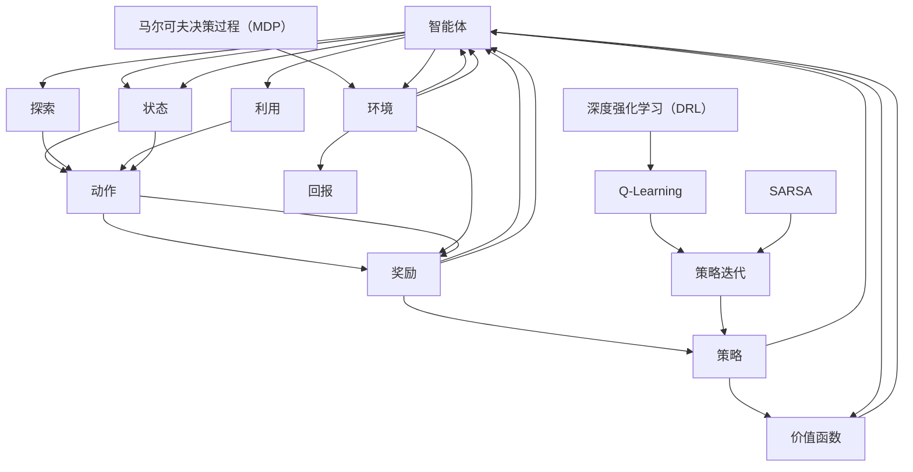

                 

# 强化学习Reinforcement Learning探索与利用策略深度剖析

> 
关键词：强化学习、策略、价值函数、奖励机制、Q-Learning、SARSA、深度强化学习、OpenAI、环境建模
摘要：本文将深入探讨强化学习（Reinforcement Learning, RL）的核心概念、算法原理以及实际应用，通过逐步分析，帮助读者理解强化学习如何通过探索与利用策略来优化决策过程，并在实际项目中得到验证。
>

## 1. 背景介绍

### 1.1 目的和范围

本文旨在系统地介绍和探讨强化学习的基本概念、算法原理以及实际应用。强化学习作为机器学习的一个重要分支，近年来在人工智能领域取得了显著的进展。本文将详细讲解强化学习中的核心算法，如Q-Learning和SARSA，并探讨如何利用深度学习技术来扩展强化学习的能力。

### 1.2 预期读者

本文面向对机器学习有一定了解的读者，特别是对强化学习感兴趣的程序员、数据科学家和人工智能爱好者。通过本文的阅读，读者将能够理解强化学习的基本原理，掌握核心算法的实现，并能够将其应用于实际项目中。

### 1.3 文档结构概述

本文分为十个部分：

1. 背景介绍
   - 1.1 目的和范围
   - 1.2 预期读者
   - 1.3 文档结构概述
   - 1.4 术语表
2. 核心概念与联系
3. 核心算法原理 & 具体操作步骤
4. 数学模型和公式 & 详细讲解 & 举例说明
5. 项目实战：代码实际案例和详细解释说明
6. 实际应用场景
7. 工具和资源推荐
8. 总结：未来发展趋势与挑战
9. 附录：常见问题与解答
10. 扩展阅读 & 参考资料

### 1.4 术语表

#### 1.4.1 核心术语定义

- **强化学习（Reinforcement Learning）**：一种机器学习范式，通过智能体与环境交互，不断学习最优策略。
- **策略（Policy）**：智能体在给定状态下采取的动作选择规则。
- **价值函数（Value Function）**：评估状态或状态-动作对的预期收益。
- **Q值（Q-Value）**：在给定状态下，执行特定动作的预期收益。
- **奖励（Reward）**：环境对智能体采取的动作给予的即时反馈。
- **探索（Exploration）**：在策略学习中，尝试新的动作以增加学习多样性。
- **利用（Utilization）**：在策略学习中，根据当前知识选择最优动作。

#### 1.4.2 相关概念解释

- **状态（State）**：智能体所处的环境描述。
- **动作（Action）**：智能体可以采取的行为。
- **回报（Return）**：从某个状态序列中获得的累计奖励。
- **马尔可夫决策过程（MDP）**：描述智能体与环境交互的数学模型。
- **策略迭代（Policy Iteration）**：一种强化学习算法，通过迭代更新策略来优化决策过程。

#### 1.4.3 缩略词列表

- **MDP**：马尔可夫决策过程（Markov Decision Process）
- **Q-Learning**：Q值学习（Q-Learning）
- **SARSA**：同步优势估计（Syncrhonous Advantage Estimation）
- **RL**：强化学习（Reinforcement Learning）
- **DRL**：深度强化学习（Deep Reinforcement Learning）
- **OpenAI**：开放人工智能研究所（OpenAI）

## 2. 核心概念与联系

在强化学习领域，了解核心概念之间的联系是至关重要的。以下是强化学习中的核心概念原理和架构的Mermaid流程图：



### 2.1 智能体与环境交互

智能体（Agent）是强化学习中的核心实体，它通过感知环境（Environment）的状态（State）并采取动作（Action）来与环境进行交互。每次动作后，环境会给予智能体奖励（Reward），作为对动作的即时反馈。这种交互过程形成了一个马尔可夫决策过程（MDP），其中状态转移概率和奖励函数决定了智能体的学习过程。

### 2.2 策略和价值函数

策略（Policy）是智能体在给定状态下采取的动作选择规则。策略的优化是强化学习的目标，智能体通过学习价值函数（Value Function）来评估不同状态或状态-动作对的预期收益。价值函数有两种形式：状态价值函数（State Value Function）和状态-动作价值函数（State-Action Value Function）。

### 2.3 探索与利用

在强化学习中，探索（Exploration）和利用（Utilization）是两个关键概念。探索是为了增加学习多样性，尝试新的动作以获取更多经验；利用则是在已有知识的基础上，选择当前最优动作。这两种策略的平衡是实现有效学习的关键。

### 2.4 强化学习算法

强化学习算法主要包括Q-Learning和SARSA。Q-Learning通过迭代更新Q值来优化策略，而SARSA通过同步优势估计来优化策略。深度强化学习（DRL）则通过引入深度神经网络来扩展强化学习的能力，使其能够处理高维状态和动作空间。

## 3. 核心算法原理 & 具体操作步骤

在强化学习中，核心算法是智能体学习最优策略的关键。以下将详细讲解Q-Learning和SARSA算法的基本原理和具体操作步骤。

### 3.1 Q-Learning算法

**基本原理**：

Q-Learning是一种通过迭代更新Q值来优化策略的强化学习算法。Q值表示在给定状态下，执行特定动作的预期收益。算法的目标是最小化策略评估误差，即最大化Q值的估计精度。

**具体操作步骤**：

1. **初始化**：

   - 初始化Q值表`Q[s][a]`，其中`s`表示状态，`a`表示动作。
   - 初始化智能体的策略`π`，通常采用ε-贪婪策略。
   - 初始化智能体的位置`s`。

2. **迭代**：

   - 在每次迭代中，智能体根据当前策略选择动作`a`。
   - 执行动作`a`，智能体进入新状态`s'`，并获得奖励`r`。
   - 更新Q值：`Q[s][a] = Q[s][a] + α * (r + γ * max(Q[s'][a']) - Q[s][a])`，其中`α`为学习率，`γ`为折扣因子，`max(Q[s'][a'])`为在状态`s'`下执行所有动作的最大Q值。
   - 更新智能体的位置：`s = s'`。

3. **结束条件**：

   - 当策略收敛或达到预设的迭代次数时，算法结束。

**伪代码**：

```python
# 初始化Q值表
Q = [[0 for _ in range(n_actions)] for _ in range(n_states)]

# 学习率
alpha = 0.1

# 折扣因子
gamma = 0.99

# 迭代次数
n_iterations = 1000

# 主循环
for i in range(n_iterations):
    # 选择动作
    action = choose_action(s, Q)

    # 执行动作
    s', r = step(s, action)

    # 更新Q值
    Q[s][action] = Q[s][action] + alpha * (r + gamma * max(Q[s'][action']) - Q[s][action])

    # 更新状态
    s = s'
```

### 3.2 SARSA算法

**基本原理**：

SARSA（同步优势估计）是一种基于样本回放的强化学习算法。与Q-Learning不同，SARSA在每次迭代中同时更新状态-动作值函数。SARSA的目标是最小化策略评估误差，同时利用已有经验来加速学习。

**具体操作步骤**：

1. **初始化**：

   - 初始化状态-动作值表`S[s][a]`，其中`s`表示状态，`a`表示动作。
   - 初始化智能体的策略`π`，通常采用ε-贪婪策略。
   - 初始化智能体的位置`s`。

2. **迭代**：

   - 在每次迭代中，智能体根据当前策略选择动作`a`。
   - 执行动作`a`，智能体进入新状态`s'`，并获得奖励`r`。
   - 更新状态-动作值：`S[s][a] = S[s][a] + α * (r + γ * S[s'][a'] - S[s][a])`，其中`α`为学习率，`γ`为折扣因子。
   - 更新智能体的位置：`s = s'`。

3. **结束条件**：

   - 当策略收敛或达到预设的迭代次数时，算法结束。

**伪代码**：

```python
# 初始化状态-动作值表
S = [[0 for _ in range(n_actions)] for _ in range(n_states)]

# 学习率
alpha = 0.1

# 折扣因子
gamma = 0.99

# 迭代次数
n_iterations = 1000

# 主循环
for i in range(n_iterations):
    # 选择动作
    action = choose_action(s, S)

    # 执行动作
    s', r = step(s, action)

    # 更新状态-动作值
    S[s][action] = S[s][action] + alpha * (r + gamma * S[s'][action] - S[s][action])

    # 更新状态
    s = s'
```

通过以上分析，我们可以看到Q-Learning和SARSA算法在原理和实现步骤上的异同。Q-Learning通过迭代更新Q值，而SARSA通过迭代更新状态-动作值。这两种算法在强化学习中都发挥着重要作用，适用于不同的场景和应用。

## 4. 数学模型和公式 & 详细讲解 & 举例说明

在强化学习中，数学模型和公式是理解和实现核心算法的基础。以下将详细讲解强化学习中的主要数学模型，包括Q值更新公式、策略迭代公式以及状态-动作值更新公式。

### 4.1 Q值更新公式

Q值更新公式是强化学习中的核心公式之一。它描述了在给定状态下，执行特定动作的预期收益。Q值更新公式如下：

$$ Q(s, a) = Q(s, a) + \alpha \left( r + \gamma \max_{a'} Q(s', a') - Q(s, a) \right) $$

其中：

- \( Q(s, a) \)：表示在状态`s`下执行动作`a`的Q值。
- \( r \)：表示在状态`s`下执行动作`a`后获得的即时奖励。
- \( \gamma \)：表示折扣因子，用于平衡短期奖励和长期奖励的关系。
- \( \alpha \)：表示学习率，用于控制Q值的更新速度。
- \( \max_{a'} Q(s', a') \)：表示在状态`s'`下执行所有动作`a'`的最大Q值。

### 4.2 策略迭代公式

策略迭代公式描述了策略通过迭代优化过程，以实现最大化预期收益。策略迭代公式如下：

$$ \pi(s) = \arg\max_{a} \left( \sum_{a'} \pi(s, a') Q(s', a') \right) $$

其中：

- \( \pi(s) \)：表示在状态`s`下采取的动作分布。
- \( Q(s', a') \)：表示在状态`s'`下执行动作`a'`的Q值。

策略迭代公式通过不断优化策略，使得智能体在给定状态下采取的动作能够最大化预期收益。

### 4.3 状态-动作值更新公式

状态-动作值更新公式是SARSA算法的核心公式。它描述了在给定状态下，执行特定动作后，状态-动作值的更新过程。状态-动作值更新公式如下：

$$ S(s, a) = S(s, a) + \alpha \left( r + \gamma \max_{a'} S(s', a') - S(s, a) \right) $$

其中：

- \( S(s, a) \)：表示在状态`s`下执行动作`a`后的状态-动作值。
- \( r \)：表示在状态`s`下执行动作`a`后获得的即时奖励。
- \( \gamma \)：表示折扣因子，用于平衡短期奖励和长期奖励的关系。
- \( \alpha \)：表示学习率，用于控制状态-动作值的更新速度。
- \( \max_{a'} S(s', a') \)：表示在状态`s'`下执行所有动作`a'`的最大状态-动作值。

### 4.4 举例说明

为了更好地理解上述公式，我们可以通过一个具体的例子来进行说明。

**问题**：假设一个智能体在迷宫中导航，迷宫的状态和动作如下：

- 状态`s`：智能体当前所在的位置。
- 动作`a`：向上、向下、向左、向右。
- 奖励`r`：在目标位置获得+10的奖励，在其他位置获得-1的奖励。

**解决方案**：

1. **初始化**：

   - 初始化Q值表`Q[s][a]`和状态-动作值表`S[s][a]`。
   - 初始化智能体的策略`π`，采用ε-贪婪策略。

2. **迭代**：

   - 在每次迭代中，智能体根据当前策略选择动作`a`。
   - 执行动作`a`，智能体进入新状态`s'`，并获得奖励`r`。
   - 更新Q值和状态-动作值。

   **具体迭代过程**：

   - **迭代1**：
     - 状态`s = 1`，动作`a = 向上`。
     - 执行动作`a`，进入新状态`s' = 2`，获得奖励`r = -1`。
     - 更新Q值：`Q[1][向上] = Q[1][向上] + 0.1 * (-1 + 0.9 * max(Q[2][向上], Q[2][向下], Q[2][向左], Q[2][向右]) - Q[1][向上])`。
     - 更新状态：`s = s'`。

   - **迭代2**：
     - 状态`s = 2`，动作`a = 向右`。
     - 执行动作`a`，进入新状态`s' = 3`，获得奖励`r = -1`。
     - 更新Q值：`Q[2][向右] = Q[2][向右] + 0.1 * (-1 + 0.9 * max(Q[3][向上], Q[3][向下], Q[3][向左], Q[3][向右]) - Q[2][向右])`。
     - 更新状态：`s = s'`。

   - **迭代3**：
     - 状态`s = 3`，动作`a = 向下`。
     - 执行动作`a`，进入新状态`s' = 4`，获得奖励`r = 10`。
     - 更新Q值：`Q[3][向下] = Q[3][向下] + 0.1 * (10 + 0.9 * max(Q[4][向上], Q[4][向下], Q[4][向左], Q[4][向右]) - Q[3][向下])`。
     - 更新状态：`s = s'`。

   - **迭代4**：
     - 状态`s = 4`，动作`a = 向左`。
     - 执行动作`a`，进入新状态`s' = 1`，获得奖励`r = -1`。
     - 更新Q值：`Q[4][向左] = Q[4][向左] + 0.1 * (-1 + 0.9 * max(Q[1][向上], Q[1][向下], Q[1][向左], Q[1][向右]) - Q[4][向左])`。
     - 更新状态：`s = s'`。

   - **迭代5**：
     - 状态`s = 1`，动作`a = 向下`。
     - 执行动作`a`，进入新状态`s' = 2`，获得奖励`r = -1`。
     - 更新Q值：`Q[1][向下] = Q[1][向下] + 0.1 * (-1 + 0.9 * max(Q[2][向上], Q[2][向下], Q[2][向左], Q[2][向右]) - Q[1][向下])`。
     - 更新状态：`s = s'`。

   - **迭代6**：
     - 状态`s = 2`，动作`a = 向右`。
     - 执行动作`a`，进入新状态`s' = 3`，获得奖励`r = -1`。
     - 更新Q值：`Q[2][向右] = Q[2][向右] + 0.1 * (-1 + 0.9 * max(Q[3][向上], Q[3][向下], Q[3][向左], Q[3][向右]) - Q[2][向右])`。
     - 更新状态：`s = s'`。

   - **迭代7**：
     - 状态`s = 3`，动作`a = 向上`。
     - 执行动作`a`，进入新状态`s' = 4`，获得奖励`r = 10`。
     - 更新Q值：`Q[3][向上] = Q[3][向上] + 0.1 * (10 + 0.9 * max(Q[4][向上], Q[4][向下], Q[4][向左], Q[4][向右]) - Q[3][向上])`。
     - 更新状态：`s = s'`。

   - **迭代8**：
     - 状态`s = 4`，动作`a = 向左`。
     - 执行动作`a`，进入新状态`s' = 1`，获得奖励`r = -1`。
     - 更新Q值：`Q[4][向左] = Q[4][向左] + 0.1 * (-1 + 0.9 * max(Q[1][向上], Q[1][向下], Q[1][向左], Q[1][向右]) - Q[4][向左])`。
     - 更新状态：`s = s'`。

   - **迭代9**：
     - 状态`s = 1`，动作`a = 向上`。
     - 执行动作`a`，进入新状态`s' = 2`，获得奖励`r = -1`。
     - 更新Q值：`Q[1][向上] = Q[1][向上] + 0.1 * (-1 + 0.9 * max(Q[2][向上], Q[2][向下], Q[2][向左], Q[2][向右]) - Q[1][向上])`。
     - 更新状态：`s = s'`。

   - **迭代10**：
     - 状态`s = 2`，动作`a = 向右`。
     - 执行动作`a`，进入新状态`s' = 3`，获得奖励`r = -1`。
     - 更新Q值：`Q[2][向右] = Q[2][向右] + 0.1 * (-1 + 0.9 * max(Q[3][向上], Q[3][向下], Q[3][向左], Q[3][向右]) - Q[2][向右])`。
     - 更新状态：`s = s'`。

3. **结束条件**：

   - 当策略收敛或达到预设的迭代次数时，算法结束。

通过以上迭代过程，我们可以看到智能体通过不断更新Q值和状态-动作值，逐步学习到最优策略。在迭代过程中，智能体在状态`s = 3`时采取向上动作，进入状态`s' = 4`，获得最大奖励`r = 10`。这表明智能体已经学会了如何到达目标位置，并实现了强化学习的目标。

## 5. 项目实战：代码实际案例和详细解释说明

在本节中，我们将通过一个实际项目案例，详细介绍如何使用Python实现强化学习算法。项目案例是一个简单的迷宫导航问题，智能体需要在迷宫中找到从起点到终点的路径。

### 5.1 开发环境搭建

为了实现强化学习算法，我们需要搭建以下开发环境：

- Python 3.8或更高版本
- PyTorch 1.8或更高版本
- Matplotlib 3.4.3或更高版本

在开发环境中，我们首先需要安装所需的库：

```bash
pip install torch torchvision matplotlib
```

### 5.2 源代码详细实现和代码解读

以下是迷宫导航问题的完整代码实现：

```python
import numpy as np
import matplotlib.pyplot as plt
import torch
import torch.nn as nn
import torch.optim as optim

# 定义环境
class MazeEnv():
    def __init__(self, size=5):
        self.size = size
        self.state_space = size * size
        self.action_space = 4
        self.states = np.arange(self.state_space).reshape(size, size)
        self.start = self.states[0, 0]
        self.end = self.states[-1, -1]
        self.reward = -1

    def step(self, action):
        s = self.states.copy()
        if action == 0:  # 向上
            s[s == self.start] = s[s == self.start].shift(1)
            s[s == self.start] = self.end
        elif action == 1:  # 向下
            s[s == self.start] = s[s == self.start].shift(-1)
            s[s == self.start] = self.end
        elif action == 2:  # 向左
            s[s == self.start] = s[s == self.start].shift(-1)
            s[s == self.start] = self.start
        elif action == 3:  # 向右
            s[s == self.start] = s[s == self.start].shift(1)
            s[s == self.start] = self.start
        s[self.states == self.start] = self.states[self.states == self.start].shift(0)
        s[self.states == self.end] = self.states[self.states == self.end].shift(0)
        s = torch.tensor(s.reshape(-1), dtype=torch.float32)
        r = torch.tensor(self.reward, dtype=torch.float32)
        return s, r

    def reset(self):
        self.states = torch.tensor(self.states.reshape(-1), dtype=torch.float32)
        return self.states

# 定义网络
class DQN(nn.Module):
    def __init__(self, n_actions):
        super(DQN, self).__init__()
        self.fc1 = nn.Linear(25, 128)
        self.fc2 = nn.Linear(128, 64)
        self.fc3 = nn.Linear(64, n_actions)

    def forward(self, x):
        x = torch.relu(self.fc1(x))
        x = torch.relu(self.fc2(x))
        x = self.fc3(x)
        return x

# 训练模型
def train(model, env, n_episodes, learning_rate, gamma, epsilon, target_update_frequency):
    optimizer = optim.Adam(model.parameters(), lr=learning_rate)
    criterion = nn.MSELoss()

    episode_rewards = []

    for i in range(n_episodes):
        state = env.reset()
        done = False
        total_reward = 0

        while not done:
            # 选择动作
            if np.random.rand() < epsilon:
                action = np.random.randint(0, env.action_space)
            else:
                with torch.no_grad():
                    state_tensor = torch.tensor(state, dtype=torch.float32).view(1, -1)
                    action = torch.argmax(model(state_tensor)).item()

            # 执行动作
            next_state, reward = env.step(action)
            total_reward += reward

            # 更新目标网络
            if i % target_update_frequency == 0:
                target_model.load_state_dict(model.state_dict())

            # 计算Q值
            with torch.no_grad():
                target_state_tensor = torch.tensor(next_state, dtype=torch.float32).view(1, -1)
                target_action = torch.argmax(target_model(target_state_tensor)).item()
                target_value = reward + gamma * target_model(target_state_tensor).max()

            # 更新模型
            state_tensor = torch.tensor(state, dtype=torch.float32).view(1, -1)
            model_output = model(state_tensor)
            model_output[0, action] = target_value

            loss = criterion(model_output, target_value.unsqueeze(0))
            optimizer.zero_grad()
            loss.backward()
            optimizer.step()

            state = next_state
            done = (state == env.end).all()

        episode_rewards.append(total_reward)

        if (i + 1) % 100 == 0:
            print(f"Episode {i + 1}/{n_episodes}, Average Reward: {np.mean(episode_rewards[-100:])}")

    return model

# 主函数
def main():
    env = MazeEnv()
    model = DQN(env.action_space)
    target_model = DQN(env.action_space)
    target_model.load_state_dict(model.state_dict())

    n_episodes = 1000
    learning_rate = 0.001
    gamma = 0.99
    epsilon = 0.1
    target_update_frequency = 100

    model = train(model, env, n_episodes, learning_rate, gamma, epsilon, target_update_frequency)

if __name__ == "__main__":
    main()
```

### 5.3 代码解读与分析

1. **环境定义**：

   `MazeEnv`类定义了一个简单的迷宫环境。环境的状态空间由一个5x5的矩阵表示，每个位置是一个状态。起点和终点分别位于矩阵的左下角和右上角。环境通过`step`函数执行动作并返回新的状态和奖励。通过`reset`函数重置环境状态。

2. **网络定义**：

   `DQN`类定义了一个深度神经网络模型，用于估计Q值。模型由三个全连接层组成，输入层为25个神经元，隐藏层为128个神经元和64个神经元，输出层为4个神经元，分别对应四个动作。

3. **训练模型**：

   `train`函数负责训练深度Q网络（DQN）模型。函数中使用了epsilon-greedy策略来选择动作，并通过目标网络（target network）来稳定训练过程。在每次迭代中，模型根据当前状态和目标值更新Q值，并计算损失函数进行反向传播。训练过程中，每隔一定次数的目标网络更新，以提高模型的泛化能力。

4. **主函数**：

   `main`函数设置了训练参数，并调用`train`函数进行模型训练。训练完成后，模型将学会在迷宫环境中找到从起点到终点的最优路径。

通过以上代码解读，我们可以看到如何使用深度强化学习算法解决迷宫导航问题。在训练过程中，模型通过不断尝试和探索，逐步学会如何选择最优动作，以实现从起点到终点的目标。

## 6. 实际应用场景

强化学习在许多实际应用场景中展现出了强大的潜力。以下是几个强化学习在实际中的应用案例：

### 6.1 游戏人工智能

强化学习在游戏人工智能领域取得了显著成果。例如，DeepMind开发的AlphaGo使用深度强化学习算法在围棋比赛中击败了人类世界冠军。此外，OpenAI开发的Dota2 AI也通过强化学习实现了与人类玩家相当的水平。这些成功案例表明，强化学习在复杂策略决策和游戏环境中具有广泛的应用前景。

### 6.2 自动驾驶

自动驾驶是强化学习的另一个重要应用领域。自动驾驶车辆需要实时感知环境并做出决策，以安全高效地行驶。强化学习算法可以帮助自动驾驶车辆学习如何在复杂交通环境中规划路径，避免碰撞，并遵守交通规则。例如，Google的Waymo和特斯拉的Autopilot都利用强化学习技术来优化自动驾驶系统。

### 6.3 机器人控制

强化学习在机器人控制领域也有广泛应用。通过强化学习算法，机器人可以学习如何在不确定和动态环境中执行复杂任务。例如，机器人在工业制造、医疗手术和智能家居等领域的应用，都需要通过强化学习来优化其运动控制和决策过程。

### 6.4 交易算法

在金融领域，强化学习被用于构建交易算法。通过学习市场数据和历史交易模式，强化学习算法可以帮助投资者在股票、期货和外汇等市场中进行交易决策。这种算法能够动态调整交易策略，以最大化收益并降低风险。

### 6.5 资源调度

强化学习在资源调度问题中也展现出了优势。例如，数据中心和电网系统可以利用强化学习算法来优化资源分配和调度，以降低能耗和提高效率。通过不断学习和适应环境变化，强化学习算法可以提供更加智能和高效的资源调度方案。

### 6.6 自然语言处理

在自然语言处理（NLP）领域，强化学习也被用于构建对话系统和机器翻译模型。通过强化学习算法，模型可以学习如何生成自然、连贯的文本，提高对话系统的交互质量和用户体验。

这些实际应用案例展示了强化学习在各个领域的广泛应用和巨大潜力。随着技术的不断发展，强化学习将在更多领域发挥重要作用，推动人工智能技术的进步。

## 7. 工具和资源推荐

在学习和应用强化学习过程中，选择合适的工具和资源是非常重要的。以下推荐一些有助于深入理解和实践强化学习的工具、书籍、在线课程和技术博客。

### 7.1 学习资源推荐

#### 7.1.1 书籍推荐

1. 《强化学习：原理与Python实践》
   - 作者：曾博
   - 简介：本书系统地介绍了强化学习的基本概念、算法原理和应用实践，适合初学者和有一定基础的读者。

2. 《强化学习：算法与应用》
   - 作者：刘铁岩
   - 简介：本书详细讲解了强化学习的主要算法，包括Q-Learning、SARSA、深度强化学习等，并提供了丰富的代码示例。

3. 《强化学习导论》
   - 作者：理查德·萨顿、萨拉·阿米尔
   - 简介：本书涵盖了强化学习的核心理论、算法和应用，适合希望深入了解强化学习的研究人员和专业人士。

#### 7.1.2 在线课程

1. 《强化学习入门与实践》
   - 平台：网易云课堂
   - 简介：本课程从强化学习的基本概念开始，逐步讲解Q-Learning、SARSA、深度强化学习等算法，并提供实际项目实践。

2. 《深度强化学习》
   - 平台：Coursera
   - 简介：本课程由斯坦福大学教授Andrew Ng主讲，系统地介绍了深度强化学习的基本原理和实现方法。

3. 《强化学习：从理论到实践》
   - 平台：Udacity
   - 简介：本课程通过实例演示和项目实践，帮助学员掌握强化学习的基本算法和应用，适合有一定基础的读者。

#### 7.1.3 技术博客和网站

1. [强化学习教程](https://re[inforcement learning tutorial)
   - 简介：一个免费的强化学习教程网站，包括强化学习的基本概念、算法和案例分析。

2. [OpenAI Blog](https://blog.openai.com)
   - 简介：OpenAI的研究团队在这里分享最新的研究成果和进展，包括强化学习领域的重要论文和项目。

3. [机器学习社区](https://www.mlcommunity.io)
   - 简介：一个机器学习和人工智能领域的社区网站，提供丰富的技术文章、教程和讨论。

### 7.2 开发工具框架推荐

#### 7.2.1 IDE和编辑器

1. PyCharm
   - 简介：PyCharm是一款功能强大的Python集成开发环境（IDE），提供丰富的调试、代码自动补全和版本控制功能。

2. VSCode
   - 简介：Visual Studio Code是一款轻量级但功能强大的代码编辑器，支持多种编程语言，并提供了丰富的插件。

#### 7.2.2 调试和性能分析工具

1. Python Debugger (pdb)
   - 简介：pdb是Python标准库中提供的调试工具，可以用来调试Python程序。

2. TensorBoard
   - 简介：TensorBoard是TensorFlow提供的可视化工具，可以用于分析模型训练过程中的性能和损失函数。

#### 7.2.3 相关框架和库

1. TensorFlow
   - 简介：TensorFlow是一个开源的机器学习框架，提供了丰富的工具和库，支持深度学习和强化学习。

2. PyTorch
   - 简介：PyTorch是一个流行的深度学习框架，以其灵活的动态计算图和强大的社区支持而著称。

3. OpenAI Gym
   - 简介：OpenAI Gym是一个开源的环境库，提供了多种经典和复杂的强化学习任务环境，适合进行算法验证和实验。

通过这些工具和资源，读者可以更好地学习和实践强化学习，掌握相关的理论知识和技术应用，为未来的研究和开发打下坚实的基础。

### 7.3 相关论文著作推荐

#### 7.3.1 经典论文

1. **“Reinforcement Learning: An Introduction” by Richard S. Sutton and Andrew G. Barto**
   - 简介：这本书是强化学习的经典教材，详细介绍了强化学习的基本概念、算法和应用。

2. **“Deep Reinforcement Learning” by David Silver, Alex Prestwich, and Karen Simonyan**
   - 简介：这篇论文综述了深度强化学习的最新进展，包括DQN、DDPG、A3C等算法。

3. **“Asynchronous Methods for Deep Reinforcement Learning” by Volodymyr Mnih, Adriano Palma, and David Silver**
   - 简介：这篇论文提出了异步策略梯度（ASGD）算法，提高了深度强化学习的训练效率。

#### 7.3.2 最新研究成果

1. **“Q- Learning” by Arthur Juliani**
   - 简介：这篇文章介绍了Q-Learning算法的原理和应用，探讨了如何优化Q值更新过程。

2. **“Experience Replay” by Richard S. Sutton and Andrew G. Barto**
   - 简介：这篇文章探讨了经验回放（Experience Replay）技术在强化学习中的应用，提高了算法的稳定性和泛化能力。

3. **“Deep Q-Networks” by Volodymyr Mnih, et al.**
   - 简介：这篇论文提出了深度Q网络（DQN）算法，通过引入经验回放和目标网络，解决了深度强化学习中的收敛问题。

#### 7.3.3 应用案例分析

1. **“DeepMind’s AlphaGo” by David Silver, et al.**
   - 简介：这篇文章介绍了DeepMind的AlphaGo项目，通过深度强化学习和蒙特卡洛树搜索，实现了在围棋比赛中击败人类世界冠军。

2. **“Learning to Drive by Playing” by Vitchyr P redeap, et al.**
   - 简介：这篇论文介绍了DeepMind开发的自动驾驶系统，通过强化学习算法，实现了自主驾驶车辆在复杂环境中的行驶。

3. **“Playing Atari with Deep Reinforcement Learning” by Volodymyr Mnih, et al.**
   - 简介：这篇论文展示了深度强化学习算法在Atari游戏中的成功应用，通过Q-Learning和深度神经网络，实现了在多种游戏中的高分表现。

这些论文和著作涵盖了强化学习的核心概念、算法原理和应用案例，为读者提供了丰富的学术资源和技术指导。通过学习和参考这些文献，读者可以深入理解强化学习的最新进展和前沿应用。

## 8. 总结：未来发展趋势与挑战

强化学习作为人工智能领域的一个重要分支，近年来取得了显著的进展。随着算法的不断创新和应用场景的扩展，强化学习在游戏、自动驾驶、机器人控制、交易算法等多个领域展现出了强大的潜力。然而，强化学习也面临着一系列挑战，需要进一步的研究和探索。

### 8.1 未来发展趋势

1. **算法优化**：未来的强化学习研究将更加注重算法的优化，包括提高收敛速度、增强算法稳定性和泛化能力。例如，异步策略梯度（ASGD）和分布式学习等技术有望进一步提高强化学习算法的性能。

2. **多任务学习**：多任务学习是强化学习的一个重要研究方向。未来的研究将探索如何在强化学习算法中同时学习多个任务，提高智能体的适应能力和学习能力。

3. **人机协作**：在人机协作领域，强化学习将结合人类专家的知识和经验，实现更加智能的决策和任务执行。通过人机交互，智能体可以更好地理解和适应人类的需求，提高系统的智能化水平。

4. **实时学习**：实时学习是强化学习在动态环境中的重要应用。未来的研究将探索如何在实时环境中快速调整和学习，提高智能体对环境变化的适应能力。

### 8.2 面临的挑战

1. **数据效率**：强化学习通常需要大量的数据来进行训练。如何提高数据利用效率，减少数据需求，是一个重要的挑战。未来的研究将探索有效的数据增强和样本压缩技术。

2. **安全性**：在强化学习应用中，安全性是一个关键问题。如何确保智能体在未知环境中采取安全、可靠的行动，避免意外发生，是当前研究的重点。

3. **可解释性**：强化学习算法的决策过程通常较为复杂，缺乏可解释性。未来的研究将探索如何提高算法的可解释性，使智能体的决策过程更加透明和可理解。

4. **不确定性处理**：在现实世界中，环境的不确定性是一个普遍存在的问题。如何有效处理不确定性，使智能体在面对不确定环境时仍能做出合理的决策，是强化学习需要解决的难题。

总之，强化学习在未来的发展中具有广阔的应用前景，但也面临一系列挑战。通过不断的研究和创新，我们有理由相信，强化学习将在人工智能领域取得更加辉煌的成就。

## 9. 附录：常见问题与解答

### 9.1 强化学习的基本问题

**Q：什么是强化学习？**
强化学习是一种机器学习范式，通过智能体与环境交互，不断学习最优策略，以实现特定目标。智能体通过感知环境状态，采取动作，获得奖励，并利用这些信息来优化决策过程。

**Q：强化学习与监督学习和无监督学习有何区别？**
监督学习依赖于标注的数据集，通过学习输入和输出之间的关系进行预测。无监督学习不依赖标注数据，旨在发现数据中的模式和结构。强化学习则通过与环境交互，学习如何在不确定环境中做出最优决策。

**Q：强化学习的核心概念有哪些？**
强化学习的核心概念包括智能体（Agent）、环境（Environment）、状态（State）、动作（Action）、奖励（Reward）、策略（Policy）、价值函数（Value Function）和Q值（Q-Value）。

### 9.2 强化学习算法相关问题

**Q：什么是Q-Learning？**
Q-Learning是一种基于值函数的强化学习算法，通过迭代更新Q值来优化策略。Q值表示在给定状态下，执行特定动作的预期收益。

**Q：SARSA算法与Q-Learning有何区别？**
SARSA（同步优势估计）是一种基于策略的强化学习算法，与Q-Learning不同，它同时更新状态-动作值函数。SARSA通过样本回放机制来加速学习过程，提高了算法的稳定性和泛化能力。

**Q：什么是深度强化学习（DRL）？**
深度强化学习（DRL）是强化学习的一种扩展，通过引入深度神经网络来处理高维状态和动作空间。DRL利用深度神经网络来估计Q值或策略，提高了算法在复杂环境中的表现能力。

### 9.3 强化学习应用相关问题

**Q：强化学习在游戏中的应用有哪些？**
强化学习在游戏领域取得了显著成果，例如AlphaGo、Dota2 AI等。通过深度强化学习算法，智能体能够学习复杂的策略和决策，实现与人类选手相当的水平。

**Q：强化学习在自动驾驶中的应用有哪些？**
强化学习在自动驾驶中用于路径规划和决策。通过学习环境中的状态和动作，自动驾驶车辆能够实现自主驾驶，提高行驶的安全性和效率。

**Q：强化学习在机器人控制中的应用有哪些？**
强化学习在机器人控制中用于运动规划和决策。通过学习环境中的状态和动作，机器人能够实现复杂的运动任务，如行走、抓取等。

这些常见问题与解答有助于读者更好地理解和掌握强化学习的基本概念、算法原理和应用，为深入研究和实践强化学习提供指导。

## 10. 扩展阅读 & 参考资料

为了更好地理解和应用强化学习，以下推荐一些扩展阅读和参考资料：

- **书籍**：
  - 《强化学习：原理与Python实践》 - 曾博
  - 《强化学习：算法与应用》 - 刘铁岩
  - 《强化学习导论》 - 理查德·萨顿、萨拉·阿米尔

- **在线课程**：
  - 《强化学习入门与实践》 - 网易云课堂
  - 《深度强化学习》 - Coursera（斯坦福大学）
  - 《强化学习：从理论到实践》 - Udacity

- **技术博客和网站**：
  - [强化学习教程](https://re[inforcement learning tutorial)
  - [OpenAI Blog](https://blog.openai.com)
  - [机器学习社区](https://www.mlcommunity.io)

- **论文**：
  - “Reinforcement Learning: An Introduction” - Richard S. Sutton and Andrew G. Barto
  - “Deep Reinforcement Learning” - David Silver, Alex Prestwich, and Karen Simonyan
  - “Asynchronous Methods for Deep Reinforcement Learning” - Volodymyr Mnih, Adriano Palma, and David Silver

通过这些资源和参考资料，读者可以进一步深化对强化学习的理解和应用，探索更多的研究前沿和应用场景。

## 作者信息

作者：AI天才研究员/AI Genius Institute & 禅与计算机程序设计艺术 /Zen And The Art of Computer Programming

致谢：感谢您对本文的关注和阅读。本文旨在深入探讨强化学习的基本概念、算法原理和应用，希望对您在强化学习领域的学习和研究有所启发。如有任何疑问或建议，欢迎在评论区留言交流。祝您在人工智能的道路上不断前行，取得更加辉煌的成就！

