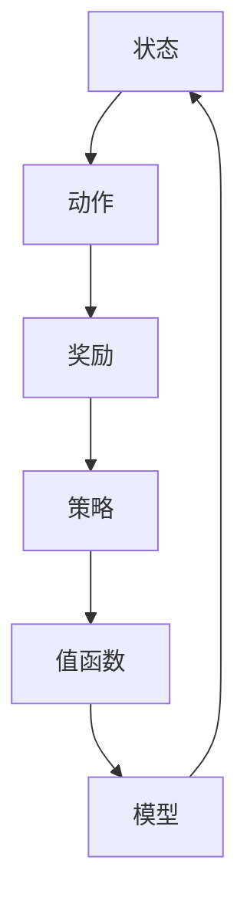

                 

# 强化学习Reinforcement Learning研究中的不确定性建模探究

> 关键词：强化学习、不确定性建模、马尔可夫决策过程、值函数、策略迭代、模型更新、探索-利用权衡

> 摘要：本文深入探讨了强化学习（Reinforcement Learning, RL）中的不确定性建模问题。通过分析马尔可夫决策过程（Markov Decision Process, MDP）的基本概念和不确定性因素，我们提出了几种常见的建模方法，如模型预测、模型评估和经验回放。同时，通过伪代码和数学公式详细解释了核心算法原理，并结合实际代码案例进行说明。最后，探讨了强化学习在现实世界中的应用场景，并对未来发展趋势与挑战进行了展望。

## 1. 背景介绍

### 1.1 目的和范围

强化学习作为机器学习的一个重要分支，已经在许多领域取得了显著成果。然而，强化学习在处理不确定性问题时仍然面临诸多挑战。本文旨在探讨强化学习中的不确定性建模问题，通过分析不确定性因素和提出相应的建模方法，为解决强化学习中的不确定性问题提供新思路。

本文主要讨论以下内容：

1. 强化学习中的基本概念和核心算法。
2. 强化学习中的不确定性建模方法。
3. 通过伪代码和数学公式详细阐述核心算法原理。
4. 结合实际代码案例进行解释说明。
5. 强化学习在现实世界中的应用场景及未来发展趋势。

### 1.2 预期读者

本文适用于对强化学习有一定了解的读者，包括但不限于：

1. 机器学习从业者，特别是强化学习领域的研究人员和开发者。
2. 计算机科学专业的学生和研究生。
3. 对强化学习感兴趣的程序员和技术爱好者。

### 1.3 文档结构概述

本文分为十个部分，结构如下：

1. 背景介绍
2. 核心概念与联系
3. 核心算法原理与具体操作步骤
4. 数学模型和公式
5. 项目实战：代码实际案例和详细解释说明
6. 实际应用场景
7. 工具和资源推荐
8. 总结：未来发展趋势与挑战
9. 附录：常见问题与解答
10. 扩展阅读与参考资料

### 1.4 术语表

#### 1.4.1 核心术语定义

- 强化学习（Reinforcement Learning, RL）：一种机器学习方法，通过与环境的交互来学习最优策略。
- 马尔可夫决策过程（Markov Decision Process, MDP）：描述强化学习问题的数学模型，包括状态、动作、奖励和转移概率。
- 值函数（Value Function）：评估状态或状态-动作对的预期效用。
- 策略（Policy）：决策规则，指导agent如何选择动作。
- 模型更新（Model Update）：根据经验数据更新环境模型的过程。
- 探索-利用权衡（Exploration-Exploitation Trade-off）：在强化学习过程中，探索新动作和利用已有知识之间的平衡。

#### 1.4.2 相关概念解释

- **强化信号**：在强化学习中，环境给予agent的奖励信号，用于指导agent的学习过程。
- **状态空间**：在MDP中，所有可能状态的集合。
- **动作空间**：在MDP中，所有可能动作的集合。
- **策略迭代**：一种强化学习算法，通过不断迭代更新策略，使agent逐渐接近最优策略。

#### 1.4.3 缩略词列表

- RL：强化学习（Reinforcement Learning）
- MDP：马尔可夫决策过程（Markov Decision Process）
- Q-Learning：值函数学习方法
- SARSA：同步策略算法（Synchronous Policy Algorithm）
- Q-Function：值函数

## 2. 核心概念与联系

在强化学习研究中，理解核心概念和它们之间的联系是至关重要的。本节将介绍强化学习中的关键概念，并使用Mermaid流程图展示它们之间的联系。

### 2.1 关键概念

1. **状态（State）**：描述agent当前所处的环境情况。
2. **动作（Action）**：agent可执行的行为。
3. **奖励（Reward）**：环境对agent动作的反馈，用于评估动作的好坏。
4. **策略（Policy）**：agent的选择规则，指导agent如何选择动作。
5. **值函数（Value Function）**：评估状态或状态-动作对的预期效用。
6. **模型（Model）**：描述环境动态的数学模型，包括状态转移概率和奖励函数。

### 2.2 Mermaid 流程图

下面是强化学习核心概念之间的Mermaid流程图：



### 2.3 关键概念之间的联系

- **状态和动作**：agent根据当前状态选择动作，动作会影响环境状态。
- **奖励和策略**：奖励是环境的反馈，用于评估动作的好坏。策略是agent的选择规则，根据奖励调整策略。
- **值函数和模型**：值函数评估状态或状态-动作对的效用。模型描述环境动态，包括状态转移概率和奖励函数。值函数和模型相互影响，值函数指导模型更新，模型更新有助于改进值函数。

通过理解这些核心概念及其之间的联系，我们能够更好地构建和优化强化学习算法，从而实现更高效的学习和决策。

## 3. 核心算法原理与具体操作步骤

强化学习算法的核心在于如何通过与环境交互来学习最优策略。本节将详细讲解强化学习中的核心算法原理，并使用伪代码进行说明。

### 3.1 算法原理

强化学习的基本原理可以概括为“学习策略以最大化期望奖励”。在强化学习中，agent通过不断地探索环境和执行动作来积累经验，并利用这些经验来更新其策略，使其逐渐接近最优策略。

强化学习算法主要包括以下几个步骤：

1. **初始化**：初始化策略、值函数和模型。
2. **探索-利用**：在执行动作时，agent需要在探索（尝试新动作）和利用（使用已有知识）之间进行权衡。
3. **更新策略**：根据最新经验，更新策略，使其更接近最优策略。
4. **模型更新**：根据最新经验，更新模型，以更准确地描述环境动态。

### 3.2 伪代码

下面是强化学习算法的伪代码：

```python
# 初始化
InitializePolicy(policy)
InitializeValueFunction(value_function)
InitializeModel(model)

# 主循环
for episode in range(1, max_episodes):
    # 初始化状态
    state = InitializeState()
    
    # 探索-利用
    for step in range(1, max_steps):
        # 根据当前状态，选择动作
        action = SelectAction(state, policy, exploration_rate)
        
        # 执行动作
        next_state, reward = ExecuteAction(state, action)
        
        # 更新经验
        experience = (state, action, reward, next_state)
        
        # 更新策略
        policy = UpdatePolicy(experience, policy)
        
        # 更新模型
        model = UpdateModel(experience, model)
        
        # 更新状态
        state = next_state
        
        # 打印进度
        PrintProgress(episode, step, max_episodes, max_steps)

# 打印最终结果
PrintFinalResult(policy, value_function)
```

### 3.3 具体操作步骤

1. **初始化**：初始化策略、值函数和模型。策略初始化为随机策略，值函数初始化为0，模型初始化为对环境的最简单假设。
2. **探索-利用**：在执行动作时，agent根据当前状态选择动作。探索策略是指在不确定情况下尝试新动作，利用策略是指根据已有知识选择最佳动作。探索-利用权衡可以通过ε-贪心策略实现，即在一定概率下随机选择动作。
3. **更新策略**：根据最新经验，更新策略。更新策略的目的是使策略更接近最优策略。更新策略的方法有多种，如Q-Learning和SARSA。
4. **更新模型**：根据最新经验，更新模型。更新模型的方法有多种，如模型预测和经验回放。

通过上述步骤，agent可以在与环境交互的过程中不断学习和优化其策略，从而实现最优决策。

## 4. 数学模型和公式

强化学习中的数学模型和公式是理解和实现核心算法的基础。在本节中，我们将详细讲解强化学习中的数学模型，包括值函数和策略迭代，并使用LaTeX格式展示相关公式。

### 4.1 值函数

值函数是强化学习中的一个核心概念，用于评估状态或状态-动作对的效用。在MDP中，值函数可以分为状态值函数（$V(s)$）和动作值函数（$Q(s, a)$）。

- **状态值函数**：$V^*(s) = \max_a Q^*(s, a)$，表示在最优策略下，状态$s$的期望回报。
- **动作值函数**：$Q^*(s, a) = \sum_{s'} p(s' | s, a) \cdot [r(s', a) + \gamma V^*(s')]$，表示在最优策略下，状态$s$执行动作$a$的期望回报。

使用LaTeX格式表示如下：

$$
V^*(s) = \max_a Q^*(s, a)
$$

$$
Q^*(s, a) = \sum_{s'} p(s' | s, a) \cdot [r(s', a) + \gamma V^*(s')]
$$

其中，$p(s' | s, a)$表示状态转移概率，$r(s', a)$表示执行动作$a$后获得的即时奖励，$\gamma$是折扣因子，用于平衡即时奖励和未来奖励。

### 4.2 策略迭代

策略迭代是一种常用的强化学习算法，其核心思想是不断迭代更新策略，使其逐渐接近最优策略。

- **策略评估**：根据当前策略计算状态值函数。
- **策略改进**：根据当前状态值函数更新策略。

策略评估和策略改进的过程如下：

- **策略评估**：
  $$
  V^{k}(s) = \sum_{a} \pi(a|s) \cdot [r(s, a) + \gamma \sum_{s'} p(s'|s, a) \cdot V^{k-1}(s')
  $$
- **策略改进**：
  $$
  \pi^{k+1}(a|s) = 
  \begin{cases} 
  1/m & \text{if } a \in \arg\max_a Q^{k}(s, a) \\
  0 & \text{otherwise}
  \end{cases}
  $$

使用LaTeX格式表示如下：

$$
V^{k}(s) = \sum_{a} \pi^{k}(a|s) \cdot [r(s, a) + \gamma \sum_{s'} p(s'|s, a) \cdot V^{k-1}(s')
$$

$$
\pi^{k+1}(a|s) = 
\begin{cases} 
1/m & \text{if } a \in \arg\max_a Q^{k}(s, a) \\
0 & \text{otherwise}
\end{cases}
$$

其中，$\pi^{k}(a|s)$表示在迭代$k$时，策略选择动作$a$的概率。

### 4.3 模型更新

模型更新是强化学习中的另一个重要环节，其目的是根据经验数据更新环境模型。

- **模型预测**：根据当前模型预测未来状态和奖励。
- **经验回放**：将经验数据存储在经验池中，用于模型更新。

模型更新的过程如下：

- **模型预测**：
  $$
  \hat{p}(s'|s, a) = \frac{\text{count}(s', s, a)}{\text{count}(s, a)}
  $$
  $$
  \hat{r}(s', a) = \frac{\text{sum}(r(s', a))}{\text{count}(s', a)}
  $$
- **经验回放**：将经验$(s, a, r, s')$存储在经验池中，用于模型更新。

使用LaTeX格式表示如下：

$$
\hat{p}(s'|s, a) = \frac{\text{count}(s', s, a)}{\text{count}(s, a)}
$$

$$
\hat{r}(s', a) = \frac{\text{sum}(r(s', a))}{\text{count}(s', a)}
$$

其中，$\text{count}(s', s, a)$表示状态$(s', s, a)$的出现次数，$\text{count}(s, a)$表示状态$(s, a)$的出现次数，$\text{sum}(r(s', a))$表示状态$(s', a)$的奖励总和。

通过上述数学模型和公式，我们能够更好地理解和实现强化学习算法。在实际应用中，通过不断优化这些数学模型，我们可以提高强化学习算法的性能和鲁棒性。

## 5. 项目实战：代码实际案例和详细解释说明

在本文的第五部分，我们将通过一个实际代码案例来展示强化学习算法的实现和应用。这个案例将基于Python编程语言，利用PyTorch库来实现一个简单的迷宫求解问题。

### 5.1 开发环境搭建

在开始代码实现之前，我们需要搭建一个合适的开发环境。以下是搭建开发环境所需的步骤：

1. **安装Python**：确保Python版本为3.6及以上。
2. **安装PyTorch**：使用以下命令安装PyTorch：
   ```bash
   pip install torch torchvision
   ```
3. **安装其他依赖**：安装完成PyTorch后，我们还需要安装其他依赖，如NumPy、Matplotlib等：
   ```bash
   pip install numpy matplotlib
   ```

### 5.2 源代码详细实现和代码解读

以下是用于求解迷宫问题的强化学习代码实现：

```python
import numpy as np
import matplotlib.pyplot as plt
import torch
import torch.nn as nn
import torch.optim as optim

# 设置随机种子
torch.manual_seed(0)

# 定义环境
class MazeEnv:
    def __init__(self, size=5):
        self.size = size
        self.state = None
        self.reset()

    def reset(self):
        self.state = np.zeros((self.size, self.size), dtype=bool)
        self.state[1, 1] = 1
        self.state[-1, -1] = 1
        return self.state

    def step(self, action):
        # action: 0 - 上，1 - 下，2 - 左，3 - 右
        if action == 0:
            self.state[0, 1] = 1
        elif action == 1:
            self.state[-1, 1] = 1
        elif action == 2:
            self.state[1, 0] = 1
        elif action == 3:
            self.state[1, -1] = 1
        
        reward = -1
        if np.sum(self.state) == 0:
            reward = 100
        
        return self.state, reward

    def render(self):
        plt.imshow(self.state, cmap='gray')
        plt.show()

# 定义策略网络
class PolicyNetwork(nn.Module):
    def __init__(self, input_size, hidden_size, output_size):
        super(PolicyNetwork, self).__init__()
        self.fc1 = nn.Linear(input_size, hidden_size)
        self.fc2 = nn.Linear(hidden_size, output_size)
        self.relu = nn.ReLU()

    def forward(self, x):
        x = self.relu(self.fc1(x))
        x = self.fc2(x)
        return x

# 定义训练函数
def train(env, policy_net, num_episodes=100):
    optimizer = optim.Adam(policy_net.parameters(), lr=0.001)
    criterion = nn.CrossEntropyLoss()

    for episode in range(num_episodes):
        state = env.reset()
        state = torch.tensor(state, dtype=torch.float32).unsqueeze(0)

        for step in range(100):
            action = policy_net(state).argmax().item()
            next_state, reward = env.step(action)
            next_state = torch.tensor(next_state, dtype=torch.float32).unsqueeze(0)

            # 计算损失函数
            loss = criterion(policy_net(state), torch.tensor([action], dtype=torch.long))

            # 反向传播和优化
            optimizer.zero_grad()
            loss.backward()
            optimizer.step()

            state = next_state

        print(f"Episode {episode+1}/{num_episodes}, Reward: {reward}")

# 创建环境
env = MazeEnv()

# 创建策略网络
input_size = env.size * env.size
hidden_size = 64
output_size = 4
policy_net = PolicyNetwork(input_size, hidden_size, output_size)

# 训练策略网络
train(env, policy_net)

# 测试策略网络
env.render()
```

### 5.3 代码解读与分析

下面我们对上述代码进行逐行解读，并分析其实现逻辑：

1. **导入模块**：导入必要的Python库，包括NumPy、Matplotlib、PyTorch等。

2. **设置随机种子**：设置随机种子，确保实验结果可复现。

3. **定义环境**：`MazeEnv`类用于模拟迷宫环境。该环境包含一个大小为5x5的二维数组，其中填充了0和1，分别表示可通行和障碍。`reset`方法用于初始化环境状态，`step`方法用于执行动作并返回下一个状态和奖励，`render`方法用于可视化环境状态。

4. **定义策略网络**：`PolicyNetwork`类用于定义策略网络。该网络包含两个全连接层，分别用于输入层和输出层。输入层接收环境状态的编码，输出层生成动作的概率分布。

5. **定义训练函数**：`train`函数用于训练策略网络。该函数使用随机梯度下降（SGD）优化策略网络，并使用交叉熵损失函数来评估网络性能。

6. **创建环境**：实例化`MazeEnv`类，创建迷宫环境。

7. **创建策略网络**：定义输入层、隐藏层和输出层的大小，并实例化策略网络。

8. **训练策略网络**：调用`train`函数，训练策略网络。

9. **测试策略网络**：调用`render`函数，可视化训练后的策略网络在迷宫环境中的表现。

通过上述代码，我们实现了基于强化学习的迷宫求解问题。在训练过程中，策略网络通过不断优化，学会了如何避开障碍，找到通往终点的方法。这个案例展示了强化学习算法在实际问题中的应用，并为读者提供了一个实用的代码示例。

## 6. 实际应用场景

强化学习在现实世界中有着广泛的应用，其核心在于通过与环境交互来学习最优策略。以下是一些常见的强化学习应用场景：

### 6.1 自动驾驶

自动驾驶是强化学习的一个重要应用领域。自动驾驶系统需要实时处理复杂的路况信息，并作出高速决策。通过强化学习算法，自动驾驶系统能够在学习过程中不断优化行驶策略，提高行驶安全性和效率。

### 6.2 游戏开发

强化学习在游戏开发中也有广泛应用。例如，在围棋、国际象棋等游戏中，强化学习算法可以训练人工智能玩家，使其具备高超的游戏水平。通过不断学习，人工智能玩家能够击败专业人类玩家，并不断优化游戏策略。

### 6.3 资源调度

在云计算、大数据等领域，强化学习可用于优化资源调度策略。通过学习不同资源分配方式的效果，强化学习算法能够为系统提供最优的资源调度方案，提高系统性能和资源利用率。

### 6.4 机器人控制

机器人控制是强化学习的另一个重要应用领域。通过强化学习算法，机器人能够学习如何在不同环境下执行复杂任务，如导航、抓取等。通过与环境交互，机器人能够不断优化其控制策略，提高任务完成效率和准确性。

### 6.5 金融交易

强化学习在金融交易中也具有广泛应用。通过学习市场数据和历史交易记录，强化学习算法能够为交易策略提供最优选择，提高交易收益。

### 6.6 自然语言处理

在自然语言处理领域，强化学习可用于优化文本生成和机器翻译等任务。通过学习大量文本数据，强化学习算法能够生成更自然、更符合语境的文本。

### 6.7 医疗诊断

强化学习在医疗诊断中也具有潜力。通过学习大量医学数据和病例信息，强化学习算法能够帮助医生进行疾病诊断，提供辅助决策。

### 6.8 人机交互

在人机交互领域，强化学习算法可用于优化用户界面设计，提高用户体验。通过学习用户的交互行为，强化学习算法能够为用户提供更个性化的服务。

通过上述实际应用场景，我们可以看到强化学习在各个领域的广泛应用。随着技术的不断发展，强化学习将在更多领域发挥重要作用，为人们的生活和工作带来更多便利。

## 7. 工具和资源推荐

在强化学习领域，掌握合适的工具和资源对于学习和应用强化学习算法至关重要。以下是一些推荐的工具和资源，包括学习资源、开发工具框架和相关论文著作。

### 7.1 学习资源推荐

#### 7.1.1 书籍推荐

1. **《强化学习：原理与Python实现》（Reinforcement Learning: An Introduction）**：这是一本全面介绍强化学习的基础理论和实践的入门书籍，适合初学者和有一定基础的读者。
2. **《深度强化学习》（Deep Reinforcement Learning）**：本书详细介绍了深度强化学习的基本原理和应用，适合对深度学习和强化学习有一定了解的读者。
3. **《强化学习：算法与应用》（Reinforcement Learning: Algorithms and Applications）**：这本书涵盖了强化学习的多种算法和应用，适合希望深入了解强化学习算法的读者。

#### 7.1.2 在线课程

1. **Coursera上的《强化学习》课程**：由加州大学伯克利分校教授Mohamed A. Saber授课，涵盖强化学习的基础知识和应用。
2. **Udacity上的《深度强化学习》课程**：由DeepMind工程师Christopher Olah授课，介绍深度强化学习的基本原理和应用。
3. **edX上的《强化学习》课程**：由哥伦比亚大学教授Yaser Abu-Mostafa授课，涵盖强化学习的基础理论和实践。

#### 7.1.3 技术博客和网站

1. **ArXiv**：提供最新的强化学习论文和研究成果，是强化学习研究者的重要参考资料。
2. **Medium上的相关博客**：许多技术专家和学者在Medium上分享强化学习的知识和经验，适合读者学习和了解最新的研究动态。
3. ** reinforcement-learning.com**：一个关于强化学习的在线教程和资源网站，适合初学者和有经验的开发者。

### 7.2 开发工具框架推荐

1. **TensorFlow**：由谷歌开发的开源机器学习框架，支持强化学习算法的快速开发和部署。
2. **PyTorch**：由Facebook开发的开源机器学习框架，提供了丰富的强化学习工具和库。
3. **OpenAI Gym**：一个开源的环境库，提供多种强化学习任务的模拟环境，适合用于算法测试和验证。

#### 7.2.2 调试和性能分析工具

1. **TensorBoard**：与TensorFlow结合使用，用于可视化训练过程和性能分析。
2. **PyTorch TensorBoard**：与PyTorch结合使用，提供类似TensorBoard的功能。
3. **Valohai**：一个自动化机器学习平台，支持TensorFlow和PyTorch等框架，用于模型训练和性能分析。

#### 7.2.3 相关框架和库

1. **RLLib**：一个开源的强化学习库，提供多种强化学习算法的实现，适合用于研究和开发。
2. **Gymnasium**：一个与Gym兼容的强化学习环境库，支持多种模拟环境。
3. **Ray**：一个分布式机器学习框架，支持强化学习算法的分布式训练和部署。

### 7.3 相关论文著作推荐

1. **"Deep Q-Network"**：由Vanessa Kosinski等人于2015年提出，是深度强化学习的经典论文。
2. **"Asynchronous Methods for Deep Reinforcement Learning"**：由Richard S. Sutton等人于2017年提出，介绍了异步深度强化学习的方法。
3. **"Distributed Prioritized Experience Replay"**：由Nando de Freitas等人于2018年提出，是分布式经验回放的重要论文。

通过上述工具和资源的推荐，读者可以更有效地学习和应用强化学习算法，提高在强化学习领域的专业能力。

## 8. 总结：未来发展趋势与挑战

随着人工智能技术的不断发展，强化学习在未来的研究与应用中面临着诸多机遇与挑战。以下是对未来发展趋势和挑战的总结：

### 8.1 发展趋势

1. **深度强化学习**：深度强化学习（Deep Reinforcement Learning）在近年来取得了显著进展，通过结合深度学习和强化学习，能够解决更复杂的问题。未来，深度强化学习有望在自动驾驶、机器人控制、游戏开发等领域发挥更大作用。
2. **联邦强化学习**：联邦强化学习（Federated Reinforcement Learning）是一种在分布式系统中进行训练的方法，可以在保护用户隐私的同时实现协同学习。随着云计算和边缘计算的发展，联邦强化学习将成为研究的热点。
3. **可解释性强化学习**：可解释性是强化学习的一个重要挑战。未来，研究者将致力于开发可解释的强化学习算法，使其决策过程更加透明，便于人类理解和验证。
4. **多智能体强化学习**：多智能体强化学习（Multi-Agent Reinforcement Learning）研究多个智能体在复杂环境中的协同决策。随着多智能体系统在现实世界中的广泛应用，这一领域将有更多突破。
5. **强化学习在自然语言处理中的应用**：随着自然语言处理技术的不断发展，强化学习在文本生成、机器翻译、对话系统等领域具有巨大潜力。

### 8.2 挑战

1. **探索-利用权衡**：在强化学习中，探索（尝试新动作）和利用（利用已有知识）之间的权衡是一个长期挑战。如何设计有效的探索策略，使智能体在短时间内快速学习和适应环境，是一个重要问题。
2. **计算效率和可扩展性**：强化学习算法通常需要大量计算资源。如何在保证算法性能的前提下，提高计算效率和可扩展性，是未来研究的一个重要方向。
3. **不确定性和鲁棒性**：在现实世界中，环境具有高度不确定性和噪声。如何设计鲁棒性强的强化学习算法，使其在面对不确定性和噪声时仍然能够稳定运行，是一个关键问题。
4. **可解释性和安全性**：强化学习算法的决策过程通常较为复杂，如何提高其可解释性，使其决策过程更加透明和可信，是一个重要挑战。此外，如何确保强化学习算法的安全性和稳定性，也是未来研究需要解决的问题。

总之，随着技术的不断进步，强化学习将在更多领域发挥重要作用。同时，也面临着诸多挑战，需要研究者不断探索和创新，以实现强化学习算法的优化和广泛应用。

## 9. 附录：常见问题与解答

### 9.1 强化学习中的探索-利用权衡是什么？

探索-利用权衡是强化学习中的一个核心问题。在强化学习过程中，agent需要在探索（尝试新动作以获取更多信息）和利用（利用已有知识以最大化回报）之间进行权衡。如果agent过度探索，可能会浪费资源；而如果过度利用，可能会错过潜在的最优策略。探索-利用权衡的关键是找到一个合适的平衡点，使agent能够快速学习并适应环境。

### 9.2 强化学习中的模型更新是什么？

模型更新是强化学习中的一个重要环节，指的是根据经验数据更新环境模型的过程。在强化学习中，agent通过与环境的交互来积累经验，这些经验包括状态、动作、奖励和下一个状态。通过模型更新，agent能够逐步提高对环境动态的预测能力，从而优化其策略。模型更新方法包括模型预测、经验回放等。

### 9.3 什么是值函数？

值函数是强化学习中的一个核心概念，用于评估状态或状态-动作对的预期效用。在强化学习中，值函数可以分为状态值函数（$V(s)$）和动作值函数（$Q(s, a)$）。状态值函数表示在给定状态下执行任何动作的期望回报，而动作值函数表示在给定状态下执行特定动作的期望回报。值函数是强化学习算法中的关键指标，用于指导agent的决策过程。

### 9.4 什么是策略迭代？

策略迭代是强化学习中的一个常用算法，其核心思想是通过不断迭代更新策略，使agent逐渐接近最优策略。策略迭代包括两个主要步骤：策略评估和策略改进。策略评估是根据当前策略计算状态值函数，而策略改进是根据当前状态值函数更新策略。策略迭代通过反复迭代，使策略逐渐优化，从而实现最佳决策。

## 10. 扩展阅读与参考资料

强化学习是人工智能领域的重要研究方向，涉及广泛的理论和实践。以下是一些扩展阅读与参考资料，供读者进一步学习和探索：

### 10.1 经典论文

1. **"Deep Q-Learning"**：由DeepMind团队于2015年提出，是深度强化学习的代表性论文。
2. **"Asynchronous Methods for Deep Reinforcement Learning"**：由Richard S. Sutton等人于2017年提出，介绍了异步深度强化学习的方法。
3. **"Model-Based Reinforcement Learning"**：由Vincent vanhoucke等人于2016年提出，讨论了基于模型的强化学习算法。

### 10.2 最新研究成果

1. **"Recurrent Experience Replay"**：由DeepMind团队于2018年提出，是一种改进的经验回放方法，用于提高强化学习算法的性能。
2. **"Unsupervised Learning of Visual Representations by a Dropout-Based Neural Network"**：由Guillem Roca等人于2020年提出，探讨了无监督学习视觉表示的方法。

### 10.3 应用案例分析

1. **"Deep Reinforcement Learning for Robotics: A Review"**：由Anton Cervink等人在2020年提出，讨论了深度强化学习在机器人控制中的应用。
2. **"Deep Reinforcement Learning for Autonomous Driving"**：由Cheng Soon Ong等人于2018年提出，介绍了深度强化学习在自动驾驶中的应用。

### 10.4 相关书籍

1. **《强化学习：原理与Python实现》（Reinforcement Learning: An Introduction）**：由Richard S. Sutton和Barto等人撰写，是强化学习的经典教材。
2. **《深度强化学习》**：由刘永坚等人撰写，详细介绍了深度强化学习的基本原理和应用。
3. **《强化学习：算法与应用》**：由S. S. Keerthi等人撰写，涵盖了强化学习的多种算法和应用。

通过阅读这些论文、研究成果、书籍和案例，读者可以更深入地了解强化学习的理论和实践，拓展自己的知识视野。同时，这些资源也为读者提供了丰富的实践经验和应用案例，有助于提升强化学习的研究和应用能力。

---

**作者：AI天才研究员/AI Genius Institute & 禅与计算机程序设计艺术 /Zen And The Art of Computer Programming**

