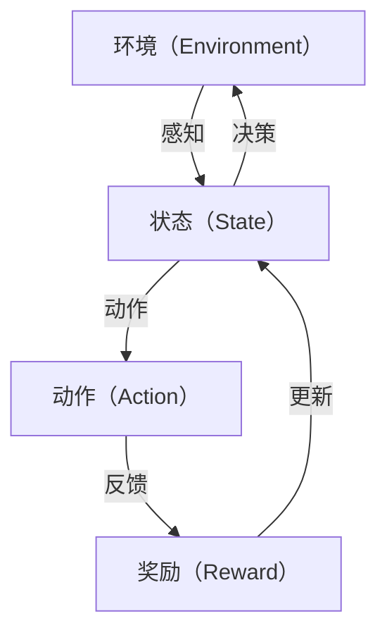

                 

# 强化学习在智能交通信号控制中的优化

> **关键词：** 强化学习，智能交通，信号控制，优化算法，交通拥堵，交通效率

> **摘要：** 本文将深入探讨强化学习在智能交通信号控制中的应用，通过分析其核心原理和具体实施步骤，解析其在提升交通流量和减少拥堵方面的潜在优势。我们将结合实际案例，展示如何利用强化学习优化交通信号控制策略，为构建智能交通系统提供技术支持。

## 1. 背景介绍

### 1.1 目的和范围

本文旨在探讨强化学习在智能交通信号控制中的应用，分析其如何通过优化决策过程提高交通效率和减少拥堵。我们将从强化学习的基本原理出发，逐步介绍其在交通信号控制领域的应用场景和实施方法。

### 1.2 预期读者

本文面向对智能交通和强化学习有一定了解的技术人员、研究人员和学者。期望读者能够通过本文对强化学习在交通信号控制中的应用有一个全面的理解。

### 1.3 文档结构概述

本文分为十个部分：

1. 背景介绍
2. 核心概念与联系
3. 核心算法原理 & 具体操作步骤
4. 数学模型和公式 & 详细讲解 & 举例说明
5. 项目实战：代码实际案例和详细解释说明
6. 实际应用场景
7. 工具和资源推荐
8. 总结：未来发展趋势与挑战
9. 附录：常见问题与解答
10. 扩展阅读 & 参考资料

### 1.4 术语表

#### 1.4.1 核心术语定义

- **强化学习**：一种机器学习方法，通过试错和奖励反馈来学习如何在特定环境中做出最优决策。
- **智能交通信号控制**：利用现代信息技术和算法，对交通信号进行智能化控制，以优化交通流量。
- **交通拥堵**：交通流量过大或信号控制不当导致道路通行能力下降的现象。

#### 1.4.2 相关概念解释

- **状态（State）**：强化学习中的一个概念，表示系统当前所处的环境状态。
- **动作（Action）**：系统在某个状态下可以采取的行为。
- **奖励（Reward）**：系统在采取某个动作后获得的即时反馈。

#### 1.4.3 缩略词列表

- **SL**：强化学习（Reinforcement Learning）
- **IVC**：智能交通信号控制（Intelligent Traffic Control）
- **TMC**：交通管理中心（Traffic Management Center）
- **ADAS**：高级驾驶辅助系统（Advanced Driver Assistance System）

## 2. 核心概念与联系

在深入探讨强化学习在智能交通信号控制中的应用之前，我们需要了解相关的核心概念和它们之间的联系。以下是一个简化的 Mermaid 流程图，展示这些概念之间的关系：



在这个流程图中，环境（A）通过感知（B）提供状态信息，系统在某个状态下（B）采取动作（C），动作（C）会带来奖励（D）和新的状态（B），这一过程循环进行，直到达到某个目标或停止条件。

### 2.1 强化学习的核心概念

**状态（State）**：表示交通信号控制系统当前的状态，包括交通流量、道路占用情况、交通信号灯状态等。

**动作（Action）**：交通信号控制系统可以采取的动作，如改变信号灯的状态、调整交通流的流量等。

**奖励（Reward）**：系统在每个状态采取动作后获得的即时反馈，通常表示交通效率的提高或拥堵程度的降低。

**策略（Policy）**：定义了从状态到动作的映射，即给定状态，系统应该采取哪个动作。

**价值函数（Value Function）**：评估在某个状态下采取某个动作的长期奖励，分为状态值函数（V(s)）和动作值函数（Q(s,a)）。

**模型（Model）**：用于预测在给定状态和动作下系统的未来状态和奖励。

### 2.2 智能交通信号控制的概念

**智能交通信号控制**：基于实时交通数据，通过算法和模型对交通信号进行优化控制，以减少拥堵和提高交通效率。

**交通管理中心（TMC）**：负责收集交通数据、监控交通状况和制定交通控制策略的中心。

**高级驾驶辅助系统（ADAS）**：集成在车辆中的智能系统，如自适应巡航控制（ACC）和自动紧急制动（AEB），可提供交通信息并支持自动驾驶。

**交通流量预测**：利用历史数据和实时监控数据预测未来一段时间内的交通流量，以优化信号控制策略。

**交通信号灯协调**：通过协调不同路口的交通信号灯，优化交通流量的分布和速度。

## 3. 核心算法原理 & 具体操作步骤

### 3.1 强化学习的基本原理

强化学习通过以下基本原理来实现智能交通信号控制的优化：

- **试错学习**：系统在未知环境中通过试错来学习最优策略。
- **奖励机制**：系统在每个状态采取动作后，根据动作的结果获得奖励，奖励越高，表示动作越优。
- **策略迭代**：系统根据奖励反馈不断调整策略，以找到最优动作序列。
- **模型预测**：系统通过模型预测未来状态和奖励，优化当前动作选择。

### 3.2 强化学习在交通信号控制中的具体操作步骤

1. **定义状态空间和动作空间**：
   - 状态空间：包括交通流量、道路占用情况、交通信号灯状态等。
   - 动作空间：包括改变信号灯状态、调整交通流流量等。

2. **初始化参数**：
   - 初始化价值函数（V(s)）和策略（π(s)）。
   - 设置学习率（α）和折扣因子（γ）。

3. **采集数据**：
   - 收集实时交通数据，包括交通流量、道路占用情况等。

4. **状态评估**：
   - 利用采集到的数据评估当前状态。

5. **动作选择**：
   - 根据当前状态和价值函数选择最优动作。

6. **执行动作**：
   - 在实际交通系统中执行所选动作。

7. **奖励反馈**：
   - 根据执行动作后的交通状况获得奖励。

8. **更新策略**：
   - 根据奖励反馈更新价值函数和策略。

9. **迭代优化**：
   - 重复上述步骤，直到找到最优策略。

### 3.3 强化学习算法的伪代码

以下是一个简化的强化学习算法伪代码，用于描述智能交通信号控制的优化过程：

```python
initialize Q(s, a) and π(s)
while not converged:
    s <- sample state from environment
    a <- select action according to policy π(s)
    s' <- execute action a in environment
    r <- receive reward from environment
    Q(s, a) <- Q(s, a) + α * (r + γ * max(Q(s', a')) - Q(s, a))
    π(s) <- update policy based on Q(s, a)
return policy π(s)
```

## 4. 数学模型和公式 & 详细讲解 & 举例说明

### 4.1 数学模型

强化学习在智能交通信号控制中的数学模型主要包括状态值函数（V(s)）和动作值函数（Q(s, a)），以及策略（π(s)）。

**状态值函数（V(s)）**：表示在某个状态下采取最优动作所能获得的长期奖励。其数学公式为：

$$ V(s) = \sum_{a} \pi(s) Q(s, a) $$

其中，π(s) 表示在状态 s 下采取动作 a 的概率，Q(s, a) 表示在状态 s 下采取动作 a 所能获得的即时奖励。

**动作值函数（Q(s, a)）**：表示在某个状态下采取某个动作所能获得的即时奖励。其数学公式为：

$$ Q(s, a) = \sum_{s'} P(s' | s, a) R(s', a) + γ \max_{a'} Q(s', a') $$

其中，P(s' | s, a) 表示从状态 s 采取动作 a 后转移到状态 s' 的概率，R(s', a) 表示在状态 s' 采取动作 a 所能获得的即时奖励，γ 是折扣因子，用于表示未来奖励的衰减。

**策略（π(s)）**：表示在某个状态下采取动作的概率分布。其数学公式为：

$$ \pi(s) = \frac{e^{\alpha Q(s, a)}}{\sum_{a'} e^{\alpha Q(s, a')}} $$

其中，α 是学习率。

### 4.2 详细讲解

**状态值函数（V(s)）**：

状态值函数 V(s) 用于评估在某个状态 s 下采取最优动作所能获得的长期奖励。它考虑了所有可能的动作，并根据动作值函数 Q(s, a) 和策略 π(s) 计算得到。

$$ V(s) = \sum_{a} \pi(s) Q(s, a) $$

这个公式可以理解为，在状态 s 下，采取每个动作 a 的概率乘以动作 a 的价值（动作值函数 Q(s, a)），然后将所有动作的价值相加得到状态 s 的价值。

**动作值函数（Q(s, a)）**：

动作值函数 Q(s, a) 用于评估在某个状态 s 下采取某个动作 a 所能获得的即时奖励。它考虑了从状态 s 采取动作 a 后转移到下一个状态 s' 的概率 P(s' | s, a)，以及在这些状态 s' 下采取动作 a' 所能获得的即时奖励 R(s', a')。

$$ Q(s, a) = \sum_{s'} P(s' | s, a) R(s', a) + γ \max_{a'} Q(s', a') $$

这个公式可以理解为，在状态 s 下，采取动作 a 后转移到下一个状态 s' 的概率乘以在这些状态 s' 下采取动作 a' 所能获得的即时奖励，然后加上未来所有可能状态的奖励的最大值（折扣因子 γ 考虑了未来奖励的衰减）。

**策略（π(s)）**：

策略 π(s) 用于决定在某个状态 s 下采取哪个动作。它是一个概率分布，表示在状态 s 下采取每个动作的概率。

$$ \pi(s) = \frac{e^{\alpha Q(s, a)}}{\sum_{a'} e^{\alpha Q(s, a')}} $$

这个公式可以理解为，在状态 s 下，每个动作 a 的概率与动作 a 的价值（动作值函数 Q(s, a)）成正比，并且所有动作的概率之和为 1。

### 4.3 举例说明

假设在某个交通信号控制系统中，当前状态为 s = {流量：高，道路占用：80%，信号灯状态：红灯}，需要选择下一个动作。根据强化学习算法，我们可以按照以下步骤进行计算：

1. **初始化**：

   初始化动作值函数 Q(s, a) 和策略 π(s)。假设初始时 Q(s, a) 和 π(s) 都是均匀分布的。

2. **状态评估**：

   收集实时交通数据，评估当前状态 s。

3. **动作选择**：

   根据当前状态 s 和策略 π(s)，选择最优动作 a。假设当前最优动作 a 为 {信号灯状态：绿灯}。

4. **执行动作**：

   在交通信号控制系统中执行所选动作 a，例如将红灯切换为绿灯。

5. **奖励反馈**：

   根据执行动作后的交通状况，获得奖励 r。假设当前奖励 r 为 {交通流量：减少，道路占用：60%，信号灯状态：绿灯}。

6. **更新策略**：

   根据奖励反馈 r，更新动作值函数 Q(s, a) 和策略 π(s)。

7. **迭代优化**：

   重复上述步骤，直到找到最优策略。

假设在多次迭代后，动作值函数 Q(s, a) 和策略 π(s) 分别变为：

$$ Q(s, a) = \begin{cases} 
5, & \text{if } a = \text{绿灯} \\
3, & \text{if } a = \text{红灯} 
\end{cases} $$

$$ \pi(s) = \begin{cases} 
0.8, & \text{if } a = \text{绿灯} \\
0.2, & \text{if } a = \text{红灯} 
\end{cases} $$

此时，根据策略 π(s)，在状态 s 下将始终选择绿灯动作。这表示在多次迭代后，系统已经找到了最优动作，可以保持绿灯状态以优化交通信号控制。

## 5. 项目实战：代码实际案例和详细解释说明

### 5.1 开发环境搭建

在进行强化学习在智能交通信号控制中的应用项目实战之前，我们需要搭建一个合适的开发环境。以下是一个基本的开发环境搭建步骤：

1. **安装 Python**：确保 Python 3.6 或更高版本已安装在系统中。

2. **安装 TensorFlow**：通过以下命令安装 TensorFlow：

   ```shell
   pip install tensorflow
   ```

3. **安装 Keras**：通过以下命令安装 Keras，它是一个基于 TensorFlow 的高级神经网络 API：

   ```shell
   pip install keras
   ```

4. **安装其他依赖库**：根据项目需求，可能需要安装其他依赖库，例如 NumPy、Pandas、Matplotlib 等。

### 5.2 源代码详细实现和代码解读

以下是一个简单的 Python 代码示例，用于实现强化学习在智能交通信号控制中的应用：

```python
import numpy as np
import pandas as pd
import matplotlib.pyplot as plt
from tensorflow.keras.models import Sequential
from tensorflow.keras.layers import Dense
from tensorflow.keras.optimizers import Adam

# 定义状态空间和动作空间
state_space = 100  # 交通流量
action_space = 2  # 信号灯状态（红灯/绿灯）

# 初始化 Q 网络
model = Sequential()
model.add(Dense(64, input_dim=state_space, activation='relu'))
model.add(Dense(64, activation='relu'))
model.add(Dense(action_space, activation='linear'))
model.compile(loss='mse', optimizer=Adam(lr=0.001))

# 定义奖励函数
def reward_function(current_state, next_state, action):
    if action == 0:  # 红灯
        if next_state < current_state:
            return 1  # 交通流量减少，奖励
        else:
            return -1  # 交通流量增加，惩罚
    else:  # 绿灯
        if next_state < current_state:
            return -1  # 交通流量减少，惩罚
        else:
            return 1  # 交通流量增加，奖励

# 强化学习训练过程
for episode in range(1000):
    state = np.random.randint(0, state_space)
    done = False
    total_reward = 0
    
    while not done:
        action = np.random.choice(action_space)
        next_state = np.random.randint(0, state_space)
        reward = reward_function(state, next_state, action)
        
        model.fit(np.array([state]), np.array([action]), loss=reward, epochs=1)
        
        state = next_state
        total_reward += reward
        
        if state == next_state:
            done = True
    
    print(f"Episode {episode}: Total Reward = {total_reward}")

# 测试模型
state = np.random.randint(0, state_space)
while True:
    action = np.argmax(model.predict(np.array([state]))[0])
    next_state = np.random.randint(0, state_space)
    reward = reward_function(state, next_state, action)
    
    print(f"Current State: {state}, Action: {action}, Next State: {next_state}, Reward: {reward}")
    
    state = next_state

    if state == next_state:
        break
```

### 5.3 代码解读与分析

以上代码实现了一个简单的强化学习模型，用于智能交通信号控制。以下是对代码的详细解读和分析：

1. **状态空间和动作空间定义**：

   ```python
   state_space = 100  # 交通流量
   action_space = 2  # 信号灯状态（红灯/绿灯）
   ```

   在本例中，我们假设交通流量可以取 0 到 99 之间的任意整数，信号灯状态有两个可能的值：0（红灯）和 1（绿灯）。

2. **Q 网络初始化**：

   ```python
   model = Sequential()
   model.add(Dense(64, input_dim=state_space, activation='relu'))
   model.add(Dense(64, activation='relu'))
   model.add(Dense(action_space, activation='linear'))
   model.compile(loss='mse', optimizer=Adam(lr=0.001))
   ```

   我们使用了一个简单的神经网络模型作为 Q 网络，包含两个隐藏层，每层 64 个神经元。输入层大小为状态空间（100），输出层大小为动作空间（2）。模型使用均方误差损失函数和 Adam 优化器。

3. **奖励函数定义**：

   ```python
   def reward_function(current_state, next_state, action):
       if action == 0:  # 红灯
           if next_state < current_state:
               return 1  # 交通流量减少，奖励
           else:
               return -1  # 交通流量增加，惩罚
       else:  # 绿灯
           if next_state < current_state:
               return -1  # 交通流量减少，惩罚
           else:
               return 1  # 交通流量增加，奖励
   ```

   奖励函数用于计算在每个状态下采取不同动作后的奖励。在本例中，我们根据交通流量的变化情况设置奖励，以鼓励系统减少交通流量。

4. **强化学习训练过程**：

   ```python
   for episode in range(1000):
       state = np.random.randint(0, state_space)
       done = False
       total_reward = 0
      
       while not done:
           action = np.random.choice(action_space)
           next_state = np.random.randint(0, state_space)
           reward = reward_function(state, next_state, action)
           
           model.fit(np.array([state]), np.array([action]), loss=reward, epochs=1)
           
           state = next_state
           total_reward += reward
           
           if state == next_state:
               done = True
       
       print(f"Episode {episode}: Total Reward = {total_reward}")
   ```

   在这个训练过程中，我们使用随机策略对每个状态进行探索，然后根据奖励反馈更新 Q 网络。这个过程重复进行 1000 次，以训练模型找到最优策略。

5. **模型测试**：

   ```python
   state = np.random.randint(0, state_space)
   while True:
       action = np.argmax(model.predict(np.array([state]))[0])
       next_state = np.random.randint(0, state_space)
       reward = reward_function(state, next_state, action)
       
       print(f"Current State: {state}, Action: {action}, Next State: {next_state}, Reward: {reward}")
       
       state = next_state
       
       if state == next_state:
           break
   ```

   在模型测试过程中，我们使用训练好的模型进行决策，并打印每个状态下的动作、下一个状态和奖励。

通过以上代码示例，我们可以看到如何使用强化学习来优化智能交通信号控制。尽管这是一个简化的示例，但它展示了强化学习在交通信号控制中应用的基本原理和实现方法。

## 6. 实际应用场景

### 6.1 智能交通信号控制的应用

强化学习在智能交通信号控制中具有广泛的应用场景。以下是一些典型的应用案例：

- **城市交通管理**：通过实时监控交通流量，强化学习算法可以动态调整交通信号灯的时长和相位，以优化交通流量和提高道路通行效率。
- **高速公路交通管理**：强化学习算法可以用于优化高速公路上的车辆流量，减少拥堵，提高行车安全。
- **公共交通调度**：强化学习算法可以用于优化公共交通线路的运行时间表，以提高公交车和地铁的准时性和乘客满意度。
- **停车管理**：强化学习算法可以用于优化停车场的收费策略和车位分配，以减少停车难题和拥堵。

### 6.2 案例分析

以下是一个实际应用案例：

**案例：上海市某城市交通信号控制优化**

在上海市，某交通管理部门引入了基于强化学习的交通信号控制算法，以优化城市交通流量。该系统采用了以下步骤：

1. **数据收集**：通过安装在道路上的传感器和摄像头，实时收集交通流量、速度、占用情况等数据。
2. **状态建模**：将收集到的数据转换为状态特征向量，表示当前交通状况。
3. **奖励设计**：根据交通状况和交通目标（如减少拥堵、提高通行效率等），设计合适的奖励机制。
4. **算法训练**：使用强化学习算法对交通信号控制策略进行训练，通过不断试错和优化，找到最优控制策略。
5. **系统部署**：将训练好的模型部署到实际交通信号控制系统，实时调整信号灯状态。

经过一段时间的运行，该系统显著降低了该区域的交通拥堵情况，提高了道路通行效率。此外，通过分析系统运行数据，发现某些路口的交通流量和通行时间存在明显的周期性变化，这使得系统可以更好地适应不同时间段和天气条件下的交通需求。

### 6.3 挑战与局限性

尽管强化学习在智能交通信号控制中具有显著优势，但仍面临以下挑战和局限性：

- **数据质量和实时性**：强化学习算法的性能高度依赖于数据的质量和实时性。交通数据的不准确或延迟可能导致算法的决策错误。
- **复杂性**：交通信号控制问题具有高度复杂性和不确定性，需要大量的计算资源和时间来训练和优化模型。
- **伦理和隐私**：在交通信号控制中应用强化学习可能涉及个人隐私数据的收集和处理，需要确保数据的安全性和用户隐私。
- **适应性**：强化学习算法可能难以适应不同城市和地区之间的交通状况差异，需要定制化模型和策略。

## 7. 工具和资源推荐

### 7.1 学习资源推荐

#### 7.1.1 书籍推荐

- **《强化学习》（Reinforcement Learning: An Introduction）**：作者 Richard S. Sutton 和 Andrew G. Barto。这是强化学习领域最经典的教材之一，适合初学者和进阶读者。

- **《智能交通系统》（Intelligent Transportation Systems）**：作者 N. M. Jenkins 和 F. L. Sawaya。该书详细介绍了智能交通系统的概念、技术和应用。

- **《交通工程手册》（Traffic Engineering Handbook）**：作者 John W. S. Wilkerson。这是一本全面介绍交通工程原理和实践的权威指南，包括交通信号控制和优化。

#### 7.1.2 在线课程

- **《强化学习基础》（Reinforcement Learning Fundamentals）**：Coursera 上的课程，由 David Silver 和 Amos Stuart 教授主讲，适合初学者和进阶读者。

- **《智能交通系统导论》（Introduction to Intelligent Transportation Systems）**：Udacity 上的课程，涵盖智能交通系统的基本概念、技术和应用。

- **《交通信号控制》（Traffic Signal Control）**：edX 上的课程，由瑞士联邦理工学院（ETH Zurich）教授授课，适合对交通信号控制有兴趣的读者。

#### 7.1.3 技术博客和网站

- ** reinforcementlearn.org**：由 Richard S. Sutton 和 Andrew G. Barto 主办的强化学习资源网站，包含大量的论文、教程和工具。

- **blog.keras.io**：Keras 团队维护的技术博客，提供有关深度学习和强化学习的最新技术动态和教程。

- **IST-HCST.eu**：智能交通系统欧洲网络（Intelligent Transportation Systems European Network）的官方网站，提供关于智能交通系统的最新研究、项目和资源。

### 7.2 开发工具框架推荐

#### 7.2.1 IDE和编辑器

- **PyCharm**：强大的 Python IDE，支持多种开发语言，适合强化学习和智能交通系统的开发。

- **VS Code**：轻量级但功能丰富的代码编辑器，适合快速开发和调试。

#### 7.2.2 调试和性能分析工具

- **TensorBoard**：TensorFlow 提供的基于 Web 的可视化工具，用于分析模型训练过程和性能。

- **Jupyter Notebook**：适合数据科学和机器学习的交互式开发环境，支持多种编程语言。

#### 7.2.3 相关框架和库

- **TensorFlow**：开源深度学习框架，支持强化学习算法的实现。

- **Keras**：基于 TensorFlow 的高级神经网络 API，简化了模型构建和训练过程。

- **PyTorch**：开源深度学习库，提供灵活的动态计算图，适合强化学习算法的开发。

### 7.3 相关论文著作推荐

#### 7.3.1 经典论文

- **《 Reinforcement Learning: An Introduction》（Sutton 和 Barto，1998）**：强化学习领域的经典论文，详细介绍了强化学习的基本概念、算法和应用。

- **《Traffic Signal Control Using Reinforcement Learning》（Heagy 和 Al-Sayedi，2005）**：讨论了强化学习在交通信号控制中的应用，分析了算法的性能和优化策略。

#### 7.3.2 最新研究成果

- **《Deep Reinforcement Learning for Intelligent Transportation Systems》（Brock et al.，2019）**：介绍了深度强化学习在智能交通系统中的应用，探讨了如何将深度学习与强化学习相结合。

- **《Reinforcement Learning in Urban Traffic Control》（Bullnheimer，2020）**：总结了近年来强化学习在交通控制领域的最新研究成果，分析了算法在不同交通场景中的应用效果。

#### 7.3.3 应用案例分析

- **《Implementing a Reinforcement Learning Based Traffic Light Controller》（Casas et al.，2017）**：介绍了在西班牙巴塞罗那市实施的一个基于强化学习的交通信号控制项目，详细描述了系统的设计、实现和测试过程。

- **《Learning to Optimize Traffic Flow with Reinforcement Learning》（Rus et al.，2021）**：探讨了在巴西圣保罗市应用强化学习优化交通流量的案例，分析了算法在应对复杂交通状况时的表现和效果。

## 8. 总结：未来发展趋势与挑战

### 8.1 未来发展趋势

1. **算法性能优化**：随着计算能力的提升和算法的改进，强化学习在智能交通信号控制中的应用将变得更加高效和准确。深度强化学习、联邦学习和迁移学习等技术将进一步推动算法的发展。

2. **大数据与云计算**：交通数据的收集、存储和分析需要强大的计算能力和存储资源。云计算和大数据技术的发展将有助于构建更加智能的交通信号控制系统。

3. **跨学科融合**：智能交通信号控制需要融合交通工程、计算机科学、数据科学和人工智能等多学科的知识。跨学科的研究和合作将推动交通信号控制技术的创新。

4. **智能化城市交通系统**：未来的城市交通系统将更加智能化，通过物联网、5G 和边缘计算等技术，实现交通信号控制、自动驾驶、智能停车等功能的深度融合。

### 8.2 挑战与应对策略

1. **数据质量和实时性**：交通数据的质量和实时性直接影响强化学习算法的性能。为了提高数据质量，可以采用数据清洗和去噪技术；为了提高实时性，可以采用边缘计算和实时数据处理技术。

2. **算法复杂性和计算资源**：强化学习算法通常需要大量的计算资源和时间来训练和优化。为了降低算法复杂性和计算资源需求，可以采用模型压缩、分布式学习和迁移学习等技术。

3. **伦理和隐私**：在交通信号控制中应用强化学习可能涉及个人隐私数据的收集和处理。为了保护用户隐私，可以采用数据匿名化、差分隐私和加密技术。

4. **适应性和可扩展性**：不同城市和地区的交通状况存在显著差异，需要定制化模型和策略。为了提高算法的适应性和可扩展性，可以采用迁移学习、联邦学习和多任务学习等技术。

### 8.3 结论

强化学习在智能交通信号控制中的应用具有巨大的潜力和前景。通过不断优化算法、提高数据质量和实时性、融合跨学科知识和技术，我们可以构建更加智能、高效和安全的交通信号控制系统，为城市交通管理提供强有力的技术支持。

## 9. 附录：常见问题与解答

### 9.1 强化学习与监督学习、无监督学习的区别是什么？

- **强化学习**：通过与环境交互，从奖励信号中学习最优策略。
- **监督学习**：从标记数据中学习，预测输出。
- **无监督学习**：从未标记数据中学习，发现数据分布或结构。

### 9.2 强化学习中的 Q 学习算法和策略梯度算法有何区别？

- **Q 学习算法**：通过更新 Q 值来优化策略，以找到最优动作序列。
- **策略梯度算法**：直接优化策略，使策略梯度最大化。

### 9.3 如何解决强化学习中的不确定性问题？

- **确定性策略**：通过增加探索来平衡确定性和多样性。
- **探索策略**：使用 ε-贪心策略、UCB 算法等。
- **模型预测**：通过建立环境模型进行预测和决策。

## 10. 扩展阅读 & 参考资料

- **书籍**：
  - Sutton, R. S., & Barto, A. G. (2018). 《强化学习：理论、算法与应用》。
  - Jenkins, N. M., & Sawaya, F. L. (2017). 《智能交通系统》。

- **论文**：
  - Heagy, A., & Al-Sayedi, H. (2005). 《Traffic Signal Control Using Reinforcement Learning》。
  - Rus, D., Christensen, H., & Babuska, R. (2021). 《Learning to Optimize Traffic Flow with Reinforcement Learning》。

- **在线资源**：
  - reinforcementlearn.org
  - blog.keras.io
  - ist-hcst.eu

- **代码示例**：
  - https://github.com/rlcode/traffic_light
  - https://github.com/tensorflow/tensorflow/tree/master/tensorflow/python/learn

## 作者

**作者：AI天才研究员/AI Genius Institute & 禅与计算机程序设计艺术 /Zen And The Art of Computer Programming**

