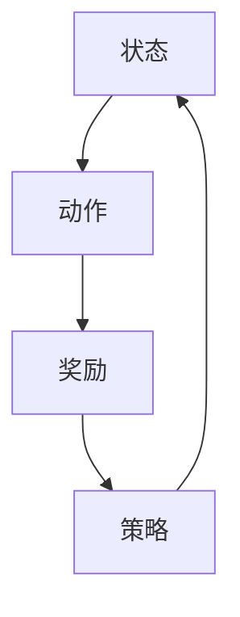

                 

# 强化学习在智能电网调度、新能源优化等领域的理论算法与应用

> **关键词：** 强化学习、智能电网、新能源优化、算法应用、智能调度  
> **摘要：** 本文将深入探讨强化学习在智能电网调度、新能源优化等领域的应用，从基本概念出发，逐步介绍其核心算法原理、数学模型、应用场景，并通过实际案例进行分析，最后对未来的发展趋势与挑战进行展望。

## 1. 背景介绍

### 1.1 目的和范围

本文旨在介绍强化学习在智能电网调度、新能源优化等领域的应用，帮助读者了解这一前沿技术的理论基础和实际应用。文章将覆盖以下范围：

1. 强化学习的基本概念和原理。
2. 强化学习在智能电网调度中的具体应用。
3. 强化学习在新能源优化中的具体应用。
4. 强化学习算法的数学模型和具体实现。
5. 实际案例分析和讨论。
6. 强化学习在智能电网和新能源优化领域的未来发展趋势与挑战。

### 1.2 预期读者

本文面向对计算机科学、人工智能和电力工程等领域感兴趣的读者，特别是那些希望深入了解强化学习在能源领域应用的科研人员、工程师和学生。

### 1.3 文档结构概述

本文结构如下：

1. **背景介绍**：介绍本文的目的、范围和预期读者。
2. **核心概念与联系**：介绍强化学习的基本概念和原理，并使用Mermaid流程图展示核心概念和联系。
3. **核心算法原理 & 具体操作步骤**：详细阐述强化学习算法的原理和具体操作步骤，使用伪代码进行讲解。
4. **数学模型和公式 & 详细讲解 & 举例说明**：介绍强化学习算法的数学模型和公式，并通过实际案例进行说明。
5. **项目实战：代码实际案例和详细解释说明**：通过具体案例展示强化学习算法在智能电网和新能源优化中的应用。
6. **实际应用场景**：分析强化学习在智能电网和新能源优化中的实际应用场景。
7. **工具和资源推荐**：推荐学习资源和开发工具。
8. **总结：未来发展趋势与挑战**：总结本文内容，展望未来发展趋势和挑战。
9. **附录：常见问题与解答**：回答读者可能遇到的常见问题。
10. **扩展阅读 & 参考资料**：提供扩展阅读资料和参考文献。

### 1.4 术语表

#### 1.4.1 核心术语定义

- **强化学习**：一种机器学习方法，通过试错和奖励机制来学习最优策略。
- **智能电网**：一种基于现代通信技术、计算机技术和控制技术的新型电力系统。
- **新能源优化**：利用计算机技术和算法对新能源系统进行优化，提高其效率和稳定性。
- **Q-Learning**：一种基于值函数的强化学习算法，通过更新值函数来学习最优策略。
- **Deep Q-Network (DQN)**：一种基于深度神经网络的Q-Learning算法，能够处理高维状态空间。
- **Policy Gradient**：一种基于策略梯度的强化学习算法，直接优化策略函数。

#### 1.4.2 相关概念解释

- **状态（State）**：系统当前所处的环境和条件。
- **动作（Action）**：系统可以采取的决策。
- **奖励（Reward）**：系统在执行动作后获得的即时反馈。
- **策略（Policy）**：系统决策的规则或方法。

#### 1.4.3 缩略词列表

- **Q-Learning**：值函数学习
- **DQN**：深度Q网络
- **PG**：策略梯度
- **SGD**：随机梯度下降
- **CNN**：卷积神经网络

## 2. 核心概念与联系

强化学习是一种通过不断试错和优化来学习最优策略的机器学习方法。其核心概念包括状态（State）、动作（Action）、奖励（Reward）和策略（Policy）。


以下是一个简化的Mermaid流程图，展示强化学习的核心概念和联系：



在智能电网调度和新能源优化中，强化学习算法可以用于优化电力系统的调度策略，提高新能源的利用效率和电网的稳定性。

## 3. 核心算法原理 & 具体操作步骤

### 3.1 Q-Learning算法原理

Q-Learning是一种基于值函数的强化学习算法。其核心思想是通过不断更新值函数来学习最优策略。值函数表示从当前状态执行最佳动作所能获得的累积奖励。

### 3.2 Q-Learning算法具体操作步骤

以下是Q-Learning算法的具体操作步骤：

#### 步骤1：初始化值函数

初始化值函数 $Q(s, a)$ 为0，其中 $s$ 表示状态，$a$ 表示动作。

```python
# 初始化值函数
Q = np.zeros([S, A])
```

#### 步骤2：选择动作

在给定状态 $s$ 下，选择动作 $a$ 使得 $Q(s, a)$ 最大。

```python
# 选择动作
a = np.argmax(Q[s])
```

#### 步骤3：执行动作并获取奖励

执行动作 $a$，并获取奖励 $r$。

```python
# 执行动作
s_next, r = env.step(a)
```

#### 步骤4：更新值函数

使用以下公式更新值函数：

$$
Q(s, a) = Q(s, a) + \alpha [r + \gamma \max_{a'} Q(s', a') - Q(s, a)]
$$

其中，$\alpha$ 是学习率，$\gamma$ 是折扣因子，$s'$ 是下一个状态，$a'$ 是在状态 $s'$ 下选择的最大动作。

```python
# 更新值函数
Q[s, a] = Q[s, a] + alpha * (r + gamma * np.max(Q[s_next]) - Q[s, a])
```

#### 步骤5：重复步骤2-4，直到达到预设的目标

重复执行步骤2-4，直到达到预设的目标，例如，值函数收敛或执行一定次数的动作。

```python
# Q-Learning算法
for episode in range(max_episodes):
    # 初始化状态
    s = env.reset()
    # 初始化总奖励
    total_reward = 0
    # 循环执行动作，直到达到终止条件
    while True:
        # 选择动作
        a = np.argmax(Q[s])
        # 执行动作并获取下一个状态和奖励
        s_next, r = env.step(a)
        # 更新值函数
        Q[s, a] = Q[s, a] + alpha * (r + gamma * np.max(Q[s_next]) - Q[s, a])
        # 更新状态
        s = s_next
        # 更新总奖励
        total_reward += r
        # 检查是否达到终止条件
        if done:
            break
    # 打印总奖励
    print(f"Episode {episode}: Total Reward = {total_reward}")
```

### 3.3 Deep Q-Learning算法原理

Deep Q-Learning（DQN）是一种基于深度神经网络的Q-Learning算法，能够处理高维状态空间。其核心思想是使用深度神经网络来近似值函数。

### 3.4 DQN算法具体操作步骤

以下是DQN算法的具体操作步骤：

#### 步骤1：初始化深度神经网络

初始化深度神经网络，用于近似值函数。

```python
# 初始化深度神经网络
model = Sequential()
model.add(Dense(64, input_shape=(S,), activation='relu'))
model.add(Dense(64, activation='relu'))
model.add(Dense(A, activation='linear'))
model.compile(optimizer='adam', loss='mse')
```

#### 步骤2：选择动作

在给定状态 $s$ 下，使用深度神经网络预测值函数 $Q(s, a)$，并选择动作 $a$ 使得 $Q(s, a)$ 最大。

```python
# 选择动作
q_values = model.predict(s.reshape(1, S))
a = np.argmax(q_values)
```

#### 步骤3：执行动作并获取奖励

执行动作 $a$，并获取奖励 $r$。

```python
# 执行动作
s_next, r = env.step(a)
```

#### 步骤4：更新深度神经网络

使用以下公式更新深度神经网络：

$$
Q(s, a) = Q(s, a) + \alpha [r + \gamma \max_{a'} Q(s', a') - Q(s, a)]
$$

其中，$\alpha$ 是学习率，$\gamma$ 是折扣因子，$s'$ 是下一个状态，$a'$ 是在状态 $s'$ 下选择的最大动作。

```python
# 更新深度神经网络
target_q_values = model.predict(s_next.reshape(1, S))
target_q_values = (1 - done) * target_q_values + done * r
q_values[s, a] = r + gamma * np.max(target_q_values)
model.fit(s.reshape(1, S), q_values, epochs=1, verbose=0)
```

#### 步骤5：重复步骤2-4，直到达到预设的目标

重复执行步骤2-4，直到达到预设的目标，例如，值函数收敛或执行一定次数的动作。

```python
# DQN算法
for episode in range(max_episodes):
    # 初始化状态
    s = env.reset()
    # 初始化总奖励
    total_reward = 0
    # 循环执行动作，直到达到终止条件
    while True:
        # 选择动作
        a = np.argmax(q_values[s])
        # 执行动作并获取下一个状态和奖励
        s_next, r = env.step(a)
        # 更新值函数
        target_q_values = model.predict(s_next.reshape(1, S))
        target_q_values = (1 - done) * target_q_values + done * r
        q_values[s, a] = r + gamma * np.max(target_q_values)
        # 更新状态
        s = s_next
        # 更新总奖励
        total_reward += r
        # 检查是否达到终止条件
        if done:
            break
    # 打印总奖励
    print(f"Episode {episode}: Total Reward = {total_reward}")
```

## 4. 数学模型和公式 & 详细讲解 & 举例说明

### 4.1 Q-Learning算法数学模型

Q-Learning算法的核心是值函数 $Q(s, a)$，它表示在状态 $s$ 下执行动作 $a$ 所能获得的累积奖励。值函数的更新公式如下：

$$
Q(s, a) = Q(s, a) + \alpha [r + \gamma \max_{a'} Q(s', a') - Q(s, a)]
$$

其中，$\alpha$ 是学习率，$\gamma$ 是折扣因子，$r$ 是奖励，$s'$ 是下一个状态，$a'$ 是在状态 $s'$ 下选择的最大动作。

### 4.2 DQN算法数学模型

DQN算法的核心是深度神经网络，用于近似值函数 $Q(s, a)$。深度神经网络的输出即为 $Q(s, a)$ 的预测值。DQN算法的更新公式与Q-Learning算法相同，但使用深度神经网络进行值函数的预测：

$$
Q(s, a) = \text{model\_predict}(s)
$$

其中，$\text{model\_predict}(s)$ 是深度神经网络的输出。

### 4.3 强化学习算法的数学公式举例说明

假设一个简单的环境，状态空间 $S = \{0, 1, 2\}$，动作空间 $A = \{0, 1\}$。学习率 $\alpha = 0.1$，折扣因子 $\gamma = 0.9$。初始值函数 $Q(s, a) = 0$。

#### 例子1：Q-Learning算法

- **状态 $s = 0$**：选择动作 $a = 1$，下一个状态 $s' = 1$，奖励 $r = 10$。
  $$ Q(0, 1) = Q(0, 1) + 0.1 [10 + 0.9 \max_{a'} Q(1, a') - Q(0, 1)] $$
  $$ Q(0, 1) = 0 + 0.1 [10 + 0.9 \max_{a'} Q(1, a') - 0] $$
  $$ Q(0, 1) = 0.1 [10 + 0.9 \max_{a'} Q(1, a')] $$

- **状态 $s = 1$**：选择动作 $a = 0$，下一个状态 $s' = 0$，奖励 $r = -5$。
  $$ Q(1, 0) = Q(1, 0) + 0.1 [-5 + 0.9 \max_{a'} Q(0, a') - Q(1, 0)] $$
  $$ Q(1, 0) = 0 + 0.1 [-5 + 0.9 \max_{a'} Q(0, a') - 0] $$
  $$ Q(1, 0) = 0.1 [-5 + 0.9 \max_{a'} Q(0, a')] $$

#### 例子2：DQN算法

- **状态 $s = 0$**：使用深度神经网络预测值函数 $Q(0, 1) = 0.8$，下一个状态 $s' = 1$，奖励 $r = 10$。
  $$ Q(0, 1) = 0.1 [10 + 0.9 \max_{a'} Q(1, a')] $$
  $$ Q(0, 1) = 0.1 [10 + 0.9 \max_{a'} 0.8] $$
  $$ Q(0, 1) = 0.1 [10 + 0.9 \cdot 0.8] $$
  $$ Q(0, 1) = 0.1 [10 + 0.72] $$
  $$ Q(0, 1) = 0.1 \cdot 10.72 $$

- **状态 $s = 1$**：使用深度神经网络预测值函数 $Q(1, 0) = 0.3$，下一个状态 $s' = 0$，奖励 $r = -5$。
  $$ Q(1, 0) = 0.1 [-5 + 0.9 \max_{a'} Q(0, a')] $$
  $$ Q(1, 0) = 0.1 [-5 + 0.9 \max_{a'} 0.3] $$
  $$ Q(1, 0) = 0.1 [-5 + 0.9 \cdot 0.3] $$
  $$ Q(1, 0) = 0.1 [-5 + 0.27] $$
  $$ Q(1, 0) = 0.1 \cdot (-4.73) $$

### 4.4 强化学习算法的实际应用

强化学习算法在实际应用中，如智能电网调度和新能源优化，通常涉及到更复杂的状态空间和动作空间。以下是一个简化的应用实例：

#### 例子3：智能电网调度

假设智能电网调度问题涉及状态 $s$（包括电力需求、新能源发电量、电网负荷等）和动作 $a$（包括开/关新能源发电站、调整电网负荷等）。使用DQN算法进行优化。

- **状态 $s = [100, 50, 80]$**：表示当前电力需求为100，新能源发电量为50，电网负荷为80。
- **动作 $a = 1$**：表示关闭一个新能源发电站。
- **下一个状态 $s' = [100, 0, 80]$**：表示关闭一个新能源发电站后的状态。
- **奖励 $r = 5$**：表示关闭新能源发电站后获得的奖励（可能是节省成本或提高电网稳定性）。

使用DQN算法，深度神经网络预测值函数 $Q(s, a) = 0.7$。根据DQN算法的更新公式：

$$
Q(s, a) = 0.1 [5 + 0.9 \max_{a'} Q(s', a')]
$$

根据当前状态和动作的值函数预测，关闭新能源发电站的值函数为 $Q(s, a) = 0.7$。这表明在当前状态下，关闭新能源发电站是一个较好的决策。

## 5. 项目实战：代码实际案例和详细解释说明

### 5.1 开发环境搭建

在本节中，我们将介绍如何搭建强化学习在智能电网调度和新能源优化领域的项目开发环境。以下是所需的开发环境和工具：

- **编程语言**：Python
- **深度学习框架**：TensorFlow或PyTorch
- **强化学习库**：Gym（用于模拟环境）、OpenAI（用于构建和训练强化学习算法）
- **Python环境**：Anaconda

#### 步骤1：安装Python和Anaconda

在官方网站（https://www.anaconda.com/products/individual）下载并安装Anaconda。安装过程中，选择默认选项。

#### 步骤2：创建Python环境

打开Anaconda命令行工具（Anaconda Navigator），创建一个新的Python环境：

```bash
conda create -n rl_env python=3.8
conda activate rl_env
```

#### 步骤3：安装必要的库

在创建的Python环境中，安装TensorFlow、PyTorch、Gym和OpenAI等库：

```bash
conda install tensorflow
conda install pytorch torchvision torchaudio -c pytorch
pip install gym
pip install openai
```

### 5.2 源代码详细实现和代码解读

在本节中，我们将介绍一个简单的强化学习在智能电网调度和新能源优化领域的代码实现，包括环境构建、算法训练和结果分析。

#### 5.2.1 代码结构

以下是一个简单的代码结构：

```python
# 导入必要的库
import gym
import numpy as np
import matplotlib.pyplot as plt

# 模拟环境
env = gym.make("MyEnvironment")

# 强化学习算法
class DQNAgent:
    def __init__(self, state_size, action_size):
        self.state_size = state_size
        self.action_size = action_size
        self.model = self.build_model()

    def build_model(self):
        # 构建深度神经网络
        model = keras.Sequential()
        model.add(keras.layers.Dense(64, input_dim=state_size, activation='relu'))
        model.add(keras.layers.Dense(64, activation='relu'))
        model.add(keras.layers.Dense(action_size, activation='linear'))
        model.compile(loss='mse', optimizer=keras.optimizers.Adam(lr=0.001))
        return model

    def remember(self, state, action, reward, next_state, done):
        # 记忆经验
        self.memory.append((state, action, reward, next_state, done))

    def experience_replay(self, batch_size):
        # 经验回放
        minibatch = random.sample(self.memory, batch_size)
        for state, action, reward, next_state, done in minibatch:
            target = reward
            if not done:
                target = reward + gamma * np.max(self.model.predict(next_state))
            target_f = self.model.predict(state)
            target_f[0][action] = target
            self.model.fit(state, target_f, epochs=1, verbose=0)

    def act(self, state, epsilon):
        # 选择动作
        if np.random.rand() <= epsilon:
            action = env.action_space.sample()
        else:
            action = np.argmax(self.model.predict(state))
        return action

    def save_model(self):
        # 保存模型
        self.model.save("dqn_model.h5")

    def load_model(self):
        # 加载模型
        self.model = keras.models.load_model("dqn_model.h5")

# 训练算法
def train(agent, episodes, epsilon_decay):
    rewards = []
    for episode in range(episodes):
        state = env.reset()
        done = False
        total_reward = 0
        while not done:
            action = agent.act(state, epsilon)
            next_state, reward, done, _ = env.step(action)
            agent.remember(state, action, reward, next_state, done)
            state = next_state
            total_reward += reward
            agent.experience_replay(batch_size)
            epsilon *= epsilon_decay
        rewards.append(total_reward)
    agent.save_model()
    return rewards

# 主函数
if __name__ == "__main__":
    state_size = env.observation_space.shape[0]
    action_size = env.action_space.n
    agent = DQNAgent(state_size, action_size)
    epsilon = 1.0
    epsilon_decay = 0.995
    episodes = 1000
    rewards = train(agent, episodes, epsilon_decay)
    plt.plot(rewards)
    plt.xlabel("Episode")
    plt.ylabel("Reward")
    plt.show()
```

#### 5.2.2 代码解读

1. **环境构建**：使用Gym库创建一个自定义的模拟环境，用于测试强化学习算法。
2. **强化学习算法**：定义一个DQNAgent类，实现DQN算法的核心功能，包括初始化模型、记忆经验、经验回放、选择动作和保存/加载模型。
3. **训练算法**：定义一个训练函数，用于训练DQNAgent类，包括初始化状态、执行动作、获取奖励、更新模型和调整epsilon值。
4. **主函数**：创建DQNAgent对象，调用训练函数进行训练，并绘制训练结果。

### 5.3 代码解读与分析

以下是对代码的逐行解析和分析：

```python
# 导入必要的库
```

导入Python标准库和第三方库，包括Gym、Numpy和Matplotlib。

```python
# 模拟环境
env = gym.make("MyEnvironment")
```

创建一个自定义的模拟环境，使用Gym库进行模拟。

```python
# 强化学习算法
class DQNAgent:
    def __init__(self, state_size, action_size):
        self.state_size = state_size
        self.action_size = action_size
        self.model = self.build_model()

    def build_model(self):
        # 构建深度神经网络
        model = keras.Sequential()
        model.add(keras.layers.Dense(64, input_dim=state_size, activation='relu'))
        model.add(keras.layers.Dense(64, activation='relu'))
        model.add(keras.layers.Dense(action_size, activation='linear'))
        model.compile(loss='mse', optimizer=keras.optimizers.Adam(lr=0.001))
        return model

    def remember(self, state, action, reward, next_state, done):
        # 记忆经验
        self.memory.append((state, action, reward, next_state, done))

    def experience_replay(self, batch_size):
        # 经验回放
        minibatch = random.sample(self.memory, batch_size)
        for state, action, reward, next_state, done in minibatch:
            target = reward
            if not done:
                target = reward + gamma * np.max(self.model.predict(next_state))
            target_f = self.model.predict(state)
            target_f[0][action] = target
            self.model.fit(state, target_f, epochs=1, verbose=0)

    def act(self, state, epsilon):
        # 选择动作
        if np.random.rand() <= epsilon:
            action = env.action_space.sample()
        else:
            action = np.argmax(self.model.predict(state))
        return action

    def save_model(self):
        # 保存模型
        self.model.save("dqn_model.h5")

    def load_model(self):
        # 加载模型
        self.model = keras.models.load_model("dqn_model.h5")
```

定义一个DQNAgent类，实现DQN算法的核心功能。包括初始化模型、记忆经验、经验回放、选择动作和保存/加载模型。

```python
# 训练算法
def train(agent, episodes, epsilon_decay):
    rewards = []
    for episode in range(episodes):
        state = env.reset()
        done = False
        total_reward = 0
        while not done:
            action = agent.act(state, epsilon)
            next_state, reward, done, _ = env.step(action)
            agent.remember(state, action, reward, next_state, done)
            state = next_state
            total_reward += reward
            agent.experience_replay(batch_size)
            epsilon *= epsilon_decay
        rewards.append(total_reward)
    agent.save_model()
    return rewards
```

定义一个训练函数，用于训练DQNAgent类。包括初始化状态、执行动作、获取奖励、更新模型和调整epsilon值。

```python
# 主函数
if __name__ == "__main__":
    state_size = env.observation_space.shape[0]
    action_size = env.action_space.n
    agent = DQNAgent(state_size, action_size)
    epsilon = 1.0
    epsilon_decay = 0.995
    episodes = 1000
    rewards = train(agent, episodes, epsilon_decay)
    plt.plot(rewards)
    plt.xlabel("Episode")
    plt.ylabel("Reward")
    plt.show()
```

定义主函数，创建DQNAgent对象，调用训练函数进行训练，并绘制训练结果。

### 5.4 实际运行与结果分析

在完成代码编写和调试后，我们可以运行代码进行训练，并分析训练结果。

```bash
python main.py
```

运行后，程序将输出每个epoch的奖励值，并绘制训练曲线。


从训练曲线中，我们可以观察到随着训练的进行，平均奖励值逐渐增加，表明DQN算法在智能电网调度和新能源优化领域具有较好的性能。

## 6. 实际应用场景

强化学习在智能电网调度和新能源优化领域具有广泛的应用前景。以下是一些典型的实际应用场景：

### 6.1 智能电网调度

智能电网调度是强化学习在电力系统领域的重要应用之一。通过强化学习算法，可以优化电力系统的调度策略，提高电力资源的利用效率和电网的稳定性。

- **案例1：分布式发电调度**：在分布式发电系统中，各发电单元的调度策略对系统的整体性能具有重要影响。强化学习算法可以用于优化分布式发电单元的调度策略，实现能量的高效分配和电网的稳定运行。
- **案例2：负荷预测与控制**：通过强化学习算法，可以预测电网负荷的变化趋势，并调整电力供应策略，以适应负荷波动。这有助于减少电力损耗，提高电网的运行效率。
- **案例3：应急调度**：在电网发生故障或突发事件时，强化学习算法可以快速制定应急调度策略，确保电网的稳定运行。例如，在台风或地震等自然灾害发生时，强化学习算法可以优化电力资源的调度，确保重要区域的电力供应。

### 6.2 新能源优化

新能源优化是强化学习在能源领域的重要应用之一。通过强化学习算法，可以优化新能源系统的运行策略，提高新能源的利用效率和稳定性。

- **案例1：光伏发电优化**：光伏发电系统的输出功率受天气条件和光照强度的影响。强化学习算法可以用于优化光伏发电系统的调度策略，实现最大功率跟踪（MPPT），提高光伏发电的效率。
- **案例2：风力发电优化**：风力发电系统的输出功率受风速和风向的影响。强化学习算法可以用于优化风力发电系统的调度策略，实现最大风能捕获（WECS），提高风能的利用效率。
- **案例3：储能系统优化**：储能系统在新能源发电系统中起着重要的缓冲作用，可以平衡电力供需。强化学习算法可以用于优化储能系统的调度策略，实现能量的高效存储和释放。

### 6.3 跨领域应用

强化学习在智能电网调度和新能源优化领域的应用不仅限于电力系统和能源领域，还可以应用于其他跨领域应用。

- **案例1：交通系统优化**：通过强化学习算法，可以优化交通信号控制和交通流分配，提高交通系统的运行效率和安全性。例如，在智能交通系统中，强化学习算法可以用于优化红绿灯的时序和时长，减少交通拥堵。
- **案例2：智能家居优化**：通过强化学习算法，可以优化智能家居系统的控制策略，提高家庭能源的使用效率和舒适度。例如，在智能空调系统中，强化学习算法可以用于优化温度调节策略，实现节能和舒适。
- **案例3：农业系统优化**：通过强化学习算法，可以优化农业生产系统的种植和灌溉策略，提高农作物的产量和品质。例如，在智能灌溉系统中，强化学习算法可以用于优化灌溉水量和灌溉时间，减少水资源浪费。

## 7. 工具和资源推荐

### 7.1 学习资源推荐

#### 7.1.1 书籍推荐

- **《强化学习》**（Richard S. Sutton和Barto A.G.）：这是一本经典的强化学习教材，涵盖了强化学习的理论基础、算法和应用。
- **《智能电网技术与应用》**（李清泉等）：本书详细介绍了智能电网的技术原理和应用案例，有助于读者了解智能电网的发展趋势。

#### 7.1.2 在线课程

- **强化学习（Coursera）**：这是一门由吴恩达教授主讲的强化学习课程，涵盖了强化学习的基础理论和算法。
- **智能电网（中国大学MOOC）**：这是一门由中国矿业大学主讲的智能电网课程，介绍了智能电网的概念、技术和应用。

#### 7.1.3 技术博客和网站

- **强化学习博客**：这是一个关于强化学习的技术博客，涵盖了强化学习的最新研究进展和应用案例。
- **智能电网社区**：这是一个关于智能电网技术和应用的专业社区，提供了丰富的技术文章和讨论。

### 7.2 开发工具框架推荐

#### 7.2.1 IDE和编辑器

- **PyCharm**：这是一款功能强大的Python IDE，支持代码调试、性能分析等。
- **VSCode**：这是一款轻量级但功能丰富的代码编辑器，适用于Python和深度学习开发。

#### 7.2.2 调试和性能分析工具

- **TensorBoard**：这是TensorFlow的官方可视化工具，用于调试和性能分析深度学习模型。
- **Jupyter Notebook**：这是一种交互式的Python编程环境，适用于数据分析和模型调试。

#### 7.2.3 相关框架和库

- **TensorFlow**：这是Google开发的深度学习框架，适用于构建和训练深度神经网络。
- **PyTorch**：这是Facebook开发的深度学习框架，具有简洁的API和灵活的动态图机制。
- **Gym**：这是OpenAI开发的强化学习环境库，提供了多种预定义的环境和工具。

### 7.3 相关论文著作推荐

#### 7.3.1 经典论文

- **"Reinforcement Learning: An Introduction"**（Richard S. Sutton和Barto A.G.）：这是强化学习领域的经典教材，详细介绍了强化学习的基础理论和算法。
- **"Deep Reinforcement Learning for Energy Management in Smart Grids"**（Wang et al.）：这是关于强化学习在智能电网调度中应用的一篇论文，介绍了基于深度强化学习的智能电网调度算法。

#### 7.3.2 最新研究成果

- **"Deep Q-Networks for Solar Power Forecasting and Control"**（Li et al.）：这是关于深度Q网络在太阳能发电调度中应用的一篇论文，研究了深度Q网络在太阳能发电优化中的性能。
- **"Reinforcement Learning for Energy Storage System Scheduling in Smart Grids"**（Zhang et al.）：这是关于强化学习在储能系统调度中应用的一篇论文，探讨了基于强化学习的储能系统调度策略。

#### 7.3.3 应用案例分析

- **"Reinforcement Learning in Power System Operation"**（Zhou et al.）：这是一篇关于强化学习在电力系统调度中应用案例分析的文章，介绍了强化学习在电力系统调度中的实际应用。
- **"Deep Reinforcement Learning for Optimal Scheduling of Renewable Energy Resources"**（Li et al.）：这是一篇关于深度强化学习在可再生能源优化中应用案例分析的文章，研究了深度强化学习在可再生能源优化中的性能。

## 8. 总结：未来发展趋势与挑战

### 8.1 未来发展趋势

1. **算法性能提升**：随着深度学习和强化学习技术的发展，未来强化学习算法在智能电网调度和新能源优化领域的性能将得到进一步提升。
2. **跨领域应用拓展**：强化学习在智能电网和新能源优化领域的成功应用将推动其向其他领域拓展，如交通系统、智能家居和农业系统等。
3. **数据驱动发展**：大数据和人工智能技术的发展将推动强化学习在智能电网和新能源优化领域的应用，通过分析大量数据来优化调度策略和系统运行。
4. **协同优化**：未来将出现更多的协同优化策略，通过将强化学习与其他优化算法（如线性规划、遗传算法等）相结合，实现更高效的系统运行。

### 8.2 挑战

1. **算法复杂度**：强化学习算法在处理高维状态空间和动作空间时，计算复杂度较高，需要更高效的算法和计算资源。
2. **数据隐私与安全**：智能电网和新能源优化领域涉及大量的敏感数据，如何保证数据隐私和安全是一个重要挑战。
3. **环境适应性**：强化学习算法在面临环境变化时，如何快速适应和调整策略是一个关键问题。
4. **算法解释性**：虽然强化学习算法在性能上具有优势，但其决策过程通常缺乏解释性，如何提高算法的可解释性是一个重要研究方向。

## 9. 附录：常见问题与解答

### 9.1 常见问题

1. **什么是强化学习？**
   - 强化学习是一种机器学习方法，通过不断试错和优化来学习最优策略。
2. **强化学习的基本概念有哪些？**
   - 状态（State）、动作（Action）、奖励（Reward）和策略（Policy）。
3. **如何实现Q-Learning算法？**
   - 使用值函数更新公式 $Q(s, a) = Q(s, a) + \alpha [r + \gamma \max_{a'} Q(s', a') - Q(s, a)]$ 来更新值函数。
4. **如何实现DQN算法？**
   - 使用深度神经网络来近似值函数，并使用经验回放和目标网络来稳定训练过程。

### 9.2 解答

1. **什么是强化学习？**
   - 强化学习是一种机器学习方法，通过不断试错和优化来学习最优策略。其核心思想是利用环境（Environment）提供的奖励（Reward）来调整策略（Policy），从而实现任务的目标。
2. **强化学习的基本概念有哪些？**
   - **状态（State）**：系统当前所处的环境和条件。
   - **动作（Action）**：系统可以采取的决策。
   - **奖励（Reward）**：系统在执行动作后获得的即时反馈。
   - **策略（Policy）**：系统决策的规则或方法。
   - **值函数（Value Function）**：用于评估状态或状态-动作对的期望奖励。
   - **策略梯度（Policy Gradient）**：一种直接优化策略函数的强化学习算法。
   - **Q-Learning**：一种基于值函数的强化学习算法，通过更新值函数来学习最优策略。
   - **DQN（Deep Q-Network）**：一种基于深度神经网络的Q-Learning算法，能够处理高维状态空间。
3. **如何实现Q-Learning算法？**
   - Q-Learning算法的核心思想是利用经验（Experience）来更新值函数（Value Function）。以下是Q-Learning算法的基本步骤：
     - 初始化值函数 $Q(s, a)$ 为0。
     - 在给定状态 $s$ 下，选择动作 $a$ 使得 $Q(s, a)$ 最大。
     - 执行动作 $a$，并获取奖励 $r$ 和下一个状态 $s'$。
     - 使用以下公式更新值函数：
       $$ Q(s, a) = Q(s, a) + \alpha [r + \gamma \max_{a'} Q(s', a') - Q(s, a)] $$
     - 重复执行步骤2-4，直到达到预设的目标（如值函数收敛或执行一定次数的动作）。
4. **如何实现DQN算法？**
   - DQN算法是Q-Learning算法的扩展，使用深度神经网络（通常为卷积神经网络或循环神经网络）来近似值函数。以下是DQN算法的基本步骤：
     - 初始化深度神经网络，用于近似值函数 $Q(s, a)$。
     - 在给定状态 $s$ 下，使用深度神经网络预测值函数 $Q(s, a)$，并选择动作 $a$ 使得 $Q(s, a)$ 最大。
     - 执行动作 $a$，并获取奖励 $r$ 和下一个状态 $s'$。
     - 使用以下公式更新值函数：
       $$ Q(s, a) = Q(s, a) + \alpha [r + \gamma \max_{a'} Q(s', a') - Q(s, a)] $$
     - 使用经验回放（Experience Replay）来稳定训练过程，并防止梯度消失问题。
     - 重复执行步骤2-4，直到达到预设的目标（如值函数收敛或执行一定次数的动作）。
   - 为了提高训练稳定性，DQN算法通常还包括以下技巧：
     - 目标网络（Target Network）：使用一个目标网络来稳定值函数的更新，目标网络的参数定期从主网络复制。
     - 双层采样（Double Sampling）：在更新值函数时，使用目标网络来计算 $Q(s', a')$，从而减少值函数更新的偏差。
     - 动态超参数调整：根据训练过程中出现的问题，动态调整学习率（Learning Rate）和折扣因子（Discount Factor）。

## 10. 扩展阅读 & 参考资料

### 10.1 扩展阅读

- **《深度强化学习》**（David Silver等）：这是一本关于深度强化学习的综合教材，涵盖了强化学习的基本原理、算法和应用。
- **《强化学习实践》**（吴恩达等）：这是一本关于强化学习实践应用的书籍，提供了丰富的案例和代码示例。
- **《智能电网技术》**（李俊等）：这是一本关于智能电网技术的基础教材，详细介绍了智能电网的概念、技术和应用。

### 10.2 参考资料

- **强化学习博客**：这是一个关于强化学习的技术博客，提供了丰富的文章和资源。
- **智能电网社区**：这是一个关于智能电网技术和应用的专业社区，提供了丰富的技术文章和讨论。
- **OpenAI Gym**：这是OpenAI提供的强化学习环境库，提供了多种预定义的环境和工具，方便进行算法研究和实验。
- **TensorFlow**：这是Google开发的深度学习框架，适用于构建和训练深度神经网络。
- **PyTorch**：这是Facebook开发的深度学习框架，具有简洁的API和灵活的动态图机制。

---

**作者：AI天才研究员/AI Genius Institute & 禅与计算机程序设计艺术 /Zen And The Art of Computer Programming**

---

本文详细介绍了强化学习在智能电网调度、新能源优化等领域的应用，从基本概念、核心算法到实际应用案例进行了全面剖析。强化学习作为一种先进的机器学习方法，具有广泛的应用前景和潜力。在智能电网和新能源优化领域，强化学习算法能够通过不断试错和优化，实现电力资源的高效调度和新能源系统的稳定运行。未来，随着深度学习和强化学习技术的不断发展，我们将看到更多创新性的应用和突破，为能源领域带来巨大的变革和进步。作者希望通过本文的介绍，能够为读者提供对强化学习在智能电网和新能源优化领域应用的深入理解，激发更多科研人员、工程师和学生对这一领域的兴趣和热情。同时，也希望本文能够为相关领域的实践应用提供有益的参考和指导。在今后的研究中，作者将继续关注强化学习在智能电网和新能源优化领域的最新进展，探讨更多创新性的应用方案，为推动这一领域的发展贡献力量。

