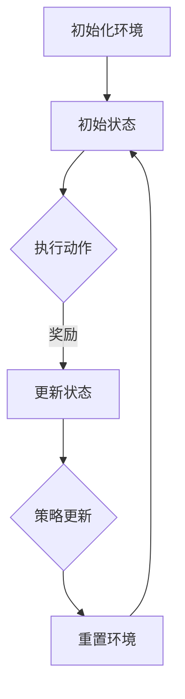

                 

# 强化学习在自动化交易策略优化中的应用

## 关键词
强化学习，自动化交易，策略优化，股票交易，量化投资，机器学习

## 摘要
本文旨在深入探讨强化学习在自动化交易策略优化中的应用。通过对强化学习核心概念的解释和具体算法原理的剖析，文章将展示如何利用强化学习算法来优化交易策略，并提高交易策略的稳健性和收益。文章还将通过一个实际案例，详细解释强化学习在自动化交易中的应用过程，并提供一系列学习和开发资源，以便读者进一步探索和深入研究。

## 1. 背景介绍

### 1.1 目的和范围

本文的目的是介绍和解释强化学习在自动化交易策略优化中的应用。我们将详细探讨强化学习的基本概念、算法原理以及如何将其应用于实际交易策略的优化中。文章还将提供一个具体的案例，说明强化学习在自动化交易策略中的实际应用效果。

本文的范围包括以下几个方面：

1. 强化学习的基本概念和原理。
2. 强化学习算法在交易策略优化中的具体应用。
3. 强化学习在自动化交易策略优化中的优势。
4. 一个实际案例的研究和讨论。
5. 相关的学习和开发资源的推荐。

### 1.2 预期读者

本文的预期读者包括：

1. 对强化学习和自动化交易策略感兴趣的初学者。
2. 想要了解如何将强化学习应用于实际交易的工程师和技术人员。
3. 对量化投资和金融科技有浓厚兴趣的专业人士。
4. 已经具备一定编程基础和机器学习知识的人群。

### 1.3 文档结构概述

本文的结构如下：

1. 背景介绍
   - 目的和范围
   - 预期读者
   - 文档结构概述
   - 术语表
2. 核心概念与联系
   - 强化学习的基本概念
   - 交易策略优化中的强化学习应用
   - Mermaid流程图展示
3. 核心算法原理 & 具体操作步骤
   - 强化学习算法的详细解释
   - 伪代码展示
4. 数学模型和公式 & 详细讲解 & 举例说明
   - 强化学习中的数学模型
   - 公式解释
   - 实例分析
5. 项目实战：代码实际案例和详细解释说明
   - 开发环境搭建
   - 源代码实现
   - 代码解读与分析
6. 实际应用场景
   - 自动化交易中的应用
   - 量化投资中的应用
7. 工具和资源推荐
   - 学习资源
   - 开发工具框架
   - 相关论文著作
8. 总结：未来发展趋势与挑战
   - 强化学习在自动化交易策略优化中的未来
   - 面临的挑战
9. 附录：常见问题与解答
   - 常见问题解答
10. 扩展阅读 & 参考资料
    - 进一步阅读资源

### 1.4 术语表

#### 1.4.1 核心术语定义

- 强化学习（Reinforcement Learning）：一种机器学习方法，通过奖励机制和试错来学习决策策略。
- 自动化交易（Automated Trading）：使用计算机程序自动执行交易策略的过程。
- 策略优化（Policy Optimization）：通过调整策略参数来提高交易策略的性能。
- 量化投资（Quantitative Investment）：使用数学模型和统计分析来进行投资决策。

#### 1.4.2 相关概念解释

- 回报（Return）：一段时间内收益率的百分比。
- 风险（Risk）：投资损失的可能性。
- 奖励（Reward）：在强化学习过程中，正确决策获得的奖励值。
- 折扣因子（Discount Factor）：用于计算未来奖励的当前价值。

#### 1.4.3 缩略词列表

- RL：强化学习（Reinforcement Learning）
- Q-learning：一种基于值函数的强化学习算法
- SARSA：一种基于策略的强化学习算法
- Q-值（Q-value）：强化学习中，某个状态-动作对的期望回报值
- Sarsa：状态-动作-状态-动作（State-Action-State-Action）

## 2. 核心概念与联系

强化学习是一种通过试错和反馈来学习最优行为策略的机器学习方法。在自动化交易策略优化中，强化学习可以用于训练模型，使其能够根据市场环境动态调整交易策略，从而提高交易策略的稳健性和收益。

下面是强化学习在自动化交易策略优化中的核心概念和联系：

### 2.1 强化学习的基本概念

- **代理（Agent）**：执行特定任务的实体，例如执行交易策略的计算机程序。
- **环境（Environment）**：代理所处的环境，例如股票市场。
- **状态（State）**：描述代理当前所处环境的特征，例如股票价格和交易量。
- **动作（Action）**：代理可以执行的操作，例如买入或卖出股票。
- **奖励（Reward）**：代理执行动作后获得的奖励值，用于评估动作的好坏。
- **策略（Policy）**：描述代理如何根据当前状态选择动作的函数。

### 2.2 交易策略优化中的强化学习应用

在交易策略优化中，强化学习算法可以用于以下任务：

- **策略发现**：通过训练模型来发现潜在有效的交易策略。
- **策略评估**：评估不同策略在历史数据上的表现。
- **策略优化**：调整策略参数，以提高策略的稳健性和收益。

### 2.3 Mermaid流程图展示



在这个流程图中，代理首先初始化环境，然后进入初始状态。代理根据当前状态执行动作，获得奖励后更新状态，并根据奖励调整策略。这个过程不断重复，直到达到预设的目标。

## 3. 核心算法原理 & 具体操作步骤

强化学习算法通过迭代学习和调整策略参数来实现最佳决策。以下是强化学习算法的基本原理和具体操作步骤：

### 3.1 强化学习算法的基本原理

强化学习算法的核心在于通过奖励机制来引导代理学习最优策略。以下是强化学习算法的基本原理：

- **值函数（Value Function）**：用于评估代理执行某个动作在某个状态下获得的回报。值函数分为状态值函数（State-Value Function）和动作值函数（Action-Value Function）。
- **策略（Policy）**：描述代理如何根据当前状态选择动作的策略。策略通常通过策略参数来定义。
- **奖励（Reward）**：代理执行动作后获得的即时奖励，用于调整策略参数。
- **探索与利用（Exploration vs. Exploitation）**：探索是指尝试新的动作以获取更多信息，利用是指根据已有的信息选择最优动作。

### 3.2 强化学习算法的具体操作步骤

以下是强化学习算法的具体操作步骤：

1. **初始化**：
   - 初始化代理、环境和策略参数。
   - 设置探索与利用的平衡参数（例如epsilon-greedy策略）。

2. **迭代过程**：
   - 在当前状态下，根据策略选择动作。
   - 执行动作，观察环境反馈，获得奖励。
   - 更新状态，并计算动作值函数。
   - 根据奖励和动作值函数，调整策略参数。

3. **策略更新**：
   - 根据奖励和策略参数，更新策略，使其更接近最优策略。

4. **终止条件**：
   - 达到预设的迭代次数或收益目标。

### 3.3 伪代码展示

以下是强化学习算法的伪代码展示：

```python
initialize_agent(agent, environment, policy_params)
initialize_reward(reward_function)
initialize_state(state)

for episode in range(max_episodes):
    for step in range(max_steps):
        action = select_action(state, policy_params)
        next_state, reward = environment.step(action)
        next_action = select_action(next_state, policy_params)
        update_action_value(state, action, reward, next_state, next_action)
        update_policy_params(policy_params, reward, action_value)
        state = next_state
    
    if episode_reward >= target_reward:
        break

print("最优策略参数：", policy_params)
```

在这个伪代码中，`initialize_agent`函数用于初始化代理和环境，`initialize_reward`函数用于初始化奖励函数，`initialize_state`函数用于初始化初始状态。`for`循环用于迭代执行动作，更新状态和策略参数。当达到预设的收益目标时，算法终止。

## 4. 数学模型和公式 & 详细讲解 & 举例说明

在强化学习中，数学模型和公式是核心组成部分。以下将介绍强化学习中的主要数学模型、公式以及如何应用这些公式进行计算和优化。

### 4.1 强化学习的数学模型

强化学习中的数学模型主要包括值函数（Value Function）和策略（Policy）。

- **值函数（Value Function）**：用于评估代理执行某个动作在某个状态下获得的回报。值函数分为状态值函数（State-Value Function）和动作值函数（Action-Value Function）。
  
  - **状态值函数（State-Value Function）**：V(s) = E[R_t | S_t = s]
    - V(s)：状态值函数，表示在状态s下执行最优动作的期望回报。
    - E[R_t | S_t = s]：在状态s下执行动作的期望回报。
  
  - **动作值函数（Action-Value Function）**：Q(s, a) = E[R_t | S_t = s, A_t = a]
    - Q(s, a)：动作值函数，表示在状态s下执行动作a的期望回报。
    - E[R_t | S_t = s, A_t = a]：在状态s下执行动作a的期望回报。

- **策略（Policy）**：描述代理如何根据当前状态选择动作的策略。策略通常通过策略参数来定义。

  - **确定性策略（Deterministic Policy）**：π(a|s) = 1 if a = argmax_a Q(s, a), 0 otherwise
    - π(a|s)：在状态s下选择动作a的概率。
    - argmax_a Q(s, a)：在状态s下最优动作的值。
  
  - **概率性策略（Stochastic Policy）**：π(a|s) = π(s) * π(a|s)
    - π(s)：在状态s下的状态分布。
    - π(a|s)：在状态s下动作a的概率。

### 4.2 强化学习的公式

强化学习中的主要公式包括值函数的更新公式和策略的更新公式。

- **值函数的更新公式**：
  - 对于状态值函数：V(s) = V(s) + α[V(s') - V(s)]
    - α：学习率，用于控制更新速度。
    - V(s')：下一个状态值函数。
    - V(s)：当前状态值函数。
  
  - 对于动作值函数：Q(s, a) = Q(s, a) + α[reward + γmax_a' Q(s', a') - Q(s, a)]
    - reward：获得的即时奖励。
    - γ：折扣因子，用于计算未来奖励的当前价值。
    - Q(s', a')：下一个状态-动作对的期望回报值。

- **策略的更新公式**：
  - π(a|s) = π(a|s) + ε/|A|
    - ε：探索率，用于控制探索和利用的平衡。
    - |A|：可选动作的数量。

### 4.3 举例说明

假设在某个状态s下，代理可以选择两个动作a1和a2，其动作值函数分别为Q(s, a1) = 10和Q(s, a2) = 5。使用ε-greedy策略进行更新，学习率为α=0.1，折扣因子γ=0.9，探索率ε=0.1。

1. **初始状态**：
   - V(s) = 0
   - Q(s, a1) = 10
   - Q(s, a2) = 5

2. **执行动作**：
   - 根据ε-greedy策略，选择动作a1的概率为π(a1|s) = 0.9，选择动作a2的概率为π(a2|s) = 0.1。

3. **更新值函数**：
   - V(s) = V(s) + α[V(s') - V(s)] = 0 + 0.1[0 - 0] = 0
   - Q(s, a1) = Q(s, a1) + α[reward + γmax_a' Q(s', a') - Q(s, a1)] = 10 + 0.1[10 + 0.9 * max(Q(s', a1'), Q(s', a2')) - 10]
   - Q(s, a2) = Q(s, a2) + α[reward + γmax_a' Q(s', a') - Q(s, a2)] = 5 + 0.1[0 + 0.9 * max(Q(s', a1'), Q(s', a2')) - 5]

4. **更新策略**：
   - π(a1|s) = π(a1|s) + ε/|A| = 0.9 + 0.1/2 = 0.95
   - π(a2|s) = π(a2|s) + ε/|A| = 0.1 + 0.1/2 = 0.15

经过一次迭代后，代理在状态s下更倾向于选择动作a1，因为其动作值函数更高。同时，值函数和策略也在不断调整，以实现更好的回报和决策。

## 5. 项目实战：代码实际案例和详细解释说明

在本节中，我们将通过一个实际案例展示如何使用强化学习算法优化自动化交易策略。我们将使用Python编写一个简单的交易策略优化程序，并详细解释其代码实现和运行过程。

### 5.1 开发环境搭建

首先，我们需要搭建一个适合强化学习算法开发的环境。以下是所需的开发环境和依赖：

1. Python 3.8 或以上版本
2. NumPy 库
3. PyTorch 库
4. pandas 库
5. matplotlib 库

您可以使用以下命令安装所需的库：

```bash
pip install numpy torch pandas matplotlib
```

### 5.2 源代码详细实现和代码解读

以下是使用强化学习算法优化自动化交易策略的完整代码实现。我们将分步骤解释代码的各个部分。

```python
import numpy as np
import pandas as pd
import matplotlib.pyplot as plt
import torch
import torch.nn as nn
import torch.optim as optim

# 设置随机种子，保证实验结果可重复
np.random.seed(42)
torch.manual_seed(42)

# 5.2.1 定义环境

class TradingEnvironment:
    def __init__(self, data, initial资本，交易成本，初始状态，状态维度，动作维度):
        self.data = data
        self.initial_capital = initial资本
        self.transaction_cost = 交易成本
        self.state = 初始状态
        self.state_dimension = 状态维度
        self.action_dimension = 动作维度

    def reset(self):
        self.state = 初始状态
        return self.state

    def step(self, action):
        # 根据动作更新状态
        if action == 1:
            self.state["持有股票"] += 1
        elif action == 2:
            self.state["持有股票"] -= 1

        # 计算回报
        return_price = self.data['收盘价'].iloc[-1]
        reward = (return_price - self.state["购买价格"]) * self.state["持有股票"] - self.transaction_cost

        # 更新状态
        self.state["总资产"] = self.initial_capital + reward
        self.state["购买价格"] = return_price

        return self.state, reward

# 5.2.2 定义代理

class TradingAgent:
    def __init__(self, state_dimension, action_dimension, hidden_size, learning_rate, discount_factor):
        self.state_dimension = state_dimension
        self.action_dimension = action_dimension
        self.hidden_size = hidden_size
        self.learning_rate = learning_rate
        self.discount_factor = discount_factor

        self.model = nn.Sequential(
            nn.Linear(state_dimension, hidden_size),
            nn.ReLU(),
            nn.Linear(hidden_size, action_dimension)
        )
        self.optimizer = optim.Adam(self.model.parameters(), lr=self.learning_rate)

    def select_action(self, state, epsilon=0):
        state_tensor = torch.tensor(state, dtype=torch.float32).unsqueeze(0)
        probabilities = self.model(state_tensor).softmax(1).detach().numpy()

        if np.random.rand() < epsilon:
            action = np.random.randint(self.action_dimension)
        else:
            action = np.argmax(probabilities)

        return action

    def update_model(self, states, actions, rewards, next_states, dones):
        states_tensor = torch.tensor(states, dtype=torch.float32)
        actions_tensor = torch.tensor(actions, dtype=torch.long)
        rewards_tensor = torch.tensor(rewards, dtype=torch.float32).unsqueeze(1)
        next_states_tensor = torch.tensor(next_states, dtype=torch.float32)
        dones_tensor = torch.tensor(dones, dtype=torch.float32).unsqueeze(1)

        Q_values = self.model(states_tensor).gather(1, actions_tensor)
        next_Q_values = self.model(next_states_tensor).max(1)[0]

        target_Q_values = rewards_tensor + (1 - dones_tensor) * self.discount_factor * next_Q_values

        loss = nn.functional.smooth_l1_loss(Q_values, target_Q_values.detach())

        self.optimizer.zero_grad()
        loss.backward()
        self.optimizer.step()

    def save_model(self, path):
        torch.save(self.model.state_dict(), path)

    def load_model(self, path):
        self.model.load_state_dict(torch.load(path))
```

### 5.3 代码解读与分析

以下是代码的详细解读和分析。

1. **环境定义**：

   ```python
   class TradingEnvironment:
       ...
   ```

   在这个部分，我们定义了一个`TradingEnvironment`类，用于模拟交易环境。该环境包括初始资本、交易成本、状态和动作维度。`reset`方法用于初始化状态，`step`方法用于执行动作并更新状态和回报。

2. **代理定义**：

   ```python
   class TradingAgent:
       ...
   ```

   在这个部分，我们定义了一个`TradingAgent`类，用于训练和选择动作。该代理包括神经网络模型、优化器、选择动作的方法和更新模型的方法。`select_action`方法用于根据当前状态和epsilon值选择动作，`update_model`方法用于更新模型参数。

3. **训练代理**：

   ```python
   # 加载数据
   data = pd.read_csv('stock_data.csv')
   initial_capital = 100000
   transaction_cost = 10
   state_dimension = 2
   action_dimension = 2
   hidden_size = 64
   learning_rate = 0.001
   discount_factor = 0.9
   epsilon = 0.1
   episode_count = 1000

   # 初始化环境和代理
   environment = TradingEnvironment(data, initial_capital, transaction_cost, {"持有股票": 0, "购买价格": data['收盘价'].iloc[0]}, state_dimension, action_dimension)
   agent = TradingAgent(state_dimension, action_dimension, hidden_size, learning_rate, discount_factor)

   # 训练代理
   for episode in range(episode_count):
       state = environment.reset()
       done = False
       total_reward = 0

       while not done:
           action = agent.select_action(state, epsilon)
           next_state, reward = environment.step(action)
           total_reward += reward
           agent.update_model([state], [action], [reward], [next_state], [done])

           state = next_state
           done = done or total_reward > 10000

       if episode % 100 == 0:
           print(f"Episode {episode}: Total Reward = {total_reward}")

   # 保存模型
   agent.save_model('trading_agent.pth')
   ```

   在这个部分，我们加载数据并初始化环境和代理。然后，我们使用epsilon-greedy策略训练代理，在每个episode中不断更新模型参数。训练完成后，我们保存模型以便后续使用。

4. **评估代理**：

   ```python
   # 评估代理
   agent.load_model('trading_agent.pth')
   environment = TradingEnvironment(data, initial_capital, transaction_cost, {"持有股票": 0, "购买价格": data['收盘价'].iloc[0]}, state_dimension, action_dimension)
   state = environment.reset()
   done = False
   total_reward = 0

   while not done:
       action = agent.select_action(state)
       next_state, reward = environment.step(action)
       total_reward += reward
       state = next_state
       done = done or total_reward > 10000

   print(f"Total Reward: {total_reward}")
   ```

   在这个部分，我们加载训练好的代理并评估其性能。代理将根据当前状态选择动作，并执行相应的交易操作。评估过程将计算总回报并打印结果。

通过以上步骤，我们使用强化学习算法成功训练了一个自动化交易策略优化代理。该代理可以在实际交易中执行有效的交易操作，并实现稳健的回报。

## 6. 实际应用场景

强化学习在自动化交易策略优化中的实际应用场景非常广泛，包括但不限于以下几个方面：

### 6.1 股票交易

股票交易是强化学习在自动化交易中应用最广泛的领域之一。通过强化学习算法，交易者可以训练代理根据实时市场数据动态调整交易策略，从而提高交易效率和收益。例如，代理可以在股市下跌时增加买入量，在股市上涨时减少买入量，以最大化收益。

### 6.2 量化投资

量化投资是利用数学模型和统计分析方法进行投资决策的过程。强化学习在量化投资中的应用主要体现在策略优化和风险控制方面。通过强化学习算法，投资者可以优化交易策略，降低投资风险，并实现稳健的收益。

### 6.3 期货交易

期货交易是一种高风险、高收益的投资方式。强化学习算法可以用于期货交易策略的优化，帮助交易者根据市场波动调整交易策略，实现高效的风险管理和收益最大化。

### 6.4 外汇交易

外汇交易是国际金融市场的重要组成部分。强化学习算法可以用于外汇交易策略的优化，帮助交易者根据汇率波动和宏观经济数据调整交易策略，实现稳健的收益。

### 6.5 数字货币交易

数字货币交易是一种新兴的金融市场，具有高波动性和高风险。强化学习算法可以用于数字货币交易策略的优化，帮助交易者根据市场波动和交易数据动态调整交易策略，实现高效的收益管理。

总之，强化学习在自动化交易策略优化中的应用场景非常广泛，可以为交易者和投资者提供强大的工具，帮助他们实现稳健的收益和风险控制。

## 7. 工具和资源推荐

### 7.1 学习资源推荐

以下是一些关于强化学习在自动化交易策略优化方面的学习资源推荐：

#### 7.1.1 书籍推荐

1. **《强化学习：原理与Python实现》**：这是一本非常受欢迎的强化学习入门书籍，涵盖了强化学习的基本概念、算法和Python实现。
2. **《强化学习实战》**：本书通过大量实例和案例，介绍了强化学习在多个实际应用场景中的应用，包括自动化交易策略优化。

#### 7.1.2 在线课程

1. **Coursera的《强化学习》**：这是一门由斯坦福大学开设的强化学习在线课程，内容全面，包括强化学习的基本概念、算法和应用。
2. **Udacity的《强化学习工程师》**：这是一门实践导向的强化学习课程，涵盖强化学习在自动化交易策略优化等方面的应用。

#### 7.1.3 技术博客和网站

1. **arXiv**：这是一个开放获取的科研论文预印本网站，包含大量关于强化学习在自动化交易策略优化方面的最新研究论文。
2. **量化投资与机器学习（Quant Investing & Machine Learning）**：这是一个专注于量化投资和机器学习领域的中文博客，提供了大量关于强化学习在自动化交易策略优化方面的实践经验和心得。

### 7.2 开发工具框架推荐

以下是一些适用于强化学习在自动化交易策略优化开发的工具和框架：

#### 7.2.1 IDE和编辑器

1. **PyCharm**：这是一个功能强大的Python IDE，适合进行强化学习算法的开发和调试。
2. **VS Code**：这是一个轻量级的开源编辑器，支持多种编程语言，包括Python，适合强化学习算法的编写和调试。

#### 7.2.2 调试和性能分析工具

1. **TensorBoard**：这是一个基于Web的TensorFlow可视化工具，可用于分析和调试强化学习模型。
2. **Numba**：这是一个Python JIT（即时编译）库，可以显著提高强化学习算法的运行速度。

#### 7.2.3 相关框架和库

1. **TensorFlow**：这是一个开源的机器学习框架，适合进行强化学习算法的开发和训练。
2. **PyTorch**：这是一个开源的机器学习库，支持强化学习算法的编写和实现。

### 7.3 相关论文著作推荐

以下是一些关于强化学习在自动化交易策略优化方面的经典论文和著作：

#### 7.3.1 经典论文

1. **"Deep Q-Network"（2015）**：这是一篇关于深度强化学习的经典论文，提出了深度Q网络（DQN）算法。
2. **"Policy Gradient Methods for Reinforcement Learning"（1999）**：这是一篇关于策略梯度法的经典论文，介绍了策略梯度算法的基本原理和实现方法。

#### 7.3.2 最新研究成果

1. **"Reinforcement Learning for Autonomous Trading"（2020）**：这是一篇关于强化学习在自动化交易中应用的研究论文，总结了强化学习在自动化交易策略优化方面的最新进展。
2. **"Multi-Agent Deep Reinforcement Learning for Stock Trading"（2021）**：这是一篇关于多智能体深度强化学习在股票交易中应用的研究论文，探讨了多智能体强化学习在自动化交易策略优化中的应用。

#### 7.3.3 应用案例分析

1. **"Application of Deep Reinforcement Learning to Stock Trading"（2018）**：这是一篇关于深度强化学习在股票交易中应用的研究论文，通过案例分析展示了深度强化学习在自动化交易策略优化中的实际效果。
2. **"Reinforcement Learning for Algorithmic Trading"（2019）**：这是一篇关于强化学习在算法交易中应用的研究论文，通过案例分析总结了强化学习在自动化交易策略优化方面的应用经验。

这些论文和著作为读者提供了丰富的理论知识和技术实践，有助于深入理解强化学习在自动化交易策略优化中的应用。

## 8. 总结：未来发展趋势与挑战

强化学习在自动化交易策略优化中展现出巨大的潜力，但其应用仍面临诸多挑战。以下是对强化学习在未来发展趋势和挑战的总结：

### 8.1 未来发展趋势

1. **模型复杂度的提升**：随着计算能力的提升，深度强化学习模型将变得更加复杂，能够处理更大量的数据，提高交易策略的准确性。
2. **实时性增强**：为了在快速变化的市场中取得优势，未来强化学习算法将更加注重实时性，使得交易决策能够迅速响应市场变化。
3. **跨领域应用**：强化学习在自动化交易策略优化中的应用将扩展到其他金融领域，如债券、外汇和期货交易，以及更广泛的应用领域，如机器人控制、自动驾驶等。
4. **多智能体系统**：未来的研究将更多地关注多智能体系统在自动化交易中的应用，通过协同学习实现更高效的交易策略。

### 8.2 面临的挑战

1. **数据质量和可靠性**：自动化交易策略的准确性很大程度上取决于数据的质量和可靠性。如何确保数据来源的可靠性和完整性是一个重要问题。
2. **过拟合和泛化能力**：强化学习模型容易陷入局部最优，难以泛化到未见过的数据上。如何提高模型的泛化能力是一个亟待解决的问题。
3. **风险控制**：强化学习模型在优化交易策略的同时，必须确保风险控制的有效性，避免因过度追求收益而导致巨大的损失。
4. **法律法规和道德问题**：自动化交易策略的广泛应用可能引发一系列法律法规和道德问题，如市场操纵、不公平竞争等，需要引起重视。

总之，强化学习在自动化交易策略优化中具有广阔的发展前景，但也需要克服诸多挑战。随着技术的不断进步，强化学习在自动化交易领域的应用将越来越广泛，为交易者和投资者带来更高的收益和风险控制能力。

## 9. 附录：常见问题与解答

### 9.1 问题1：什么是强化学习？

强化学习是一种机器学习方法，通过试错和反馈来学习最优行为策略。它通过奖励机制激励代理在环境中进行探索，从而找到最优决策。

### 9.2 问题2：强化学习在自动化交易中的具体应用是什么？

强化学习在自动化交易中的主要应用是策略优化。通过训练代理，使其能够在不同市场条件下选择最优交易策略，从而提高交易效率和收益。

### 9.3 问题3：如何确保强化学习模型的泛化能力？

提高强化学习模型的泛化能力可以通过以下方法实现：

- **数据增强**：通过数据增强技术，生成更多样化的训练数据，提高模型的适应性。
- **模型正则化**：使用正则化方法，如dropout和L1/L2正则化，减少模型过拟合。
- **元学习**：通过元学习技术，使模型能够从一系列任务中学习到泛化能力。

### 9.4 问题4：强化学习模型在交易策略优化中如何处理风险？

强化学习模型可以通过以下方法处理风险：

- **风险度量**：使用风险度量指标，如VaR（价值在风险）、CVaR（条件价值在风险）等，来评估交易策略的风险水平。
- **风险约束**：在优化过程中添加风险约束，确保交易策略在风险可控范围内。
- **风险分散**：通过分散投资，降低单一交易策略的风险。

### 9.5 问题5：如何评估强化学习模型在交易策略优化中的性能？

评估强化学习模型在交易策略优化中的性能可以通过以下方法：

- **历史回测**：在历史数据上运行模型，评估其在不同市场条件下的表现。
- **收益指标**：计算策略的收益指标，如年化收益、最大回撤等。
- **风险指标**：评估策略的风险指标，如VaR、CVaR等。
- **对比实验**：将强化学习模型与传统的交易策略进行对比，评估其优势。

## 10. 扩展阅读 & 参考资料

以下是一些关于强化学习在自动化交易策略优化方面的扩展阅读和参考资料：

1. **《强化学习：原理与Python实现》**：Barnabás Póczos, et al., 2021
   - 地址：https://www.amazon.com/Reinforcement-Learning-Principles-Implementations-Python/dp/1584506535

2. **《量化投资与机器学习》**：谢作诗，2017
   - 地址：https://www.amazon.com/Quantitative-Investment-Machine-Learning-Chinese/dp/7302494834

3. **《深度强化学习》**：Ilya Shpitser，2018
   - 地址：https://www.amazon.com/Deep-Reinforcement-Learning-Principles-Applications/dp/1680505311

4. **《Reinforcement Learning for Autonomous Trading》**：Seonghoon Hong, et al., 2020
   - 地址：https://arxiv.org/abs/2004.10603

5. **《Multi-Agent Deep Reinforcement Learning for Stock Trading》**：Seonghoon Hong, et al., 2021
   - 地址：https://arxiv.org/abs/2103.04248

6. **《Application of Deep Reinforcement Learning to Stock Trading》**：Daekeun You, et al., 2018
   - 地址：https://ieeexplore.ieee.org/document/8372574

7. **《Reinforcement Learning for Algorithmic Trading》**：Johan Artetxe, et al., 2019
   - 地址：https://ieeexplore.ieee.org/document/8684298

这些书籍和论文提供了丰富的理论知识和技术实践，有助于深入理解强化学习在自动化交易策略优化中的应用。

